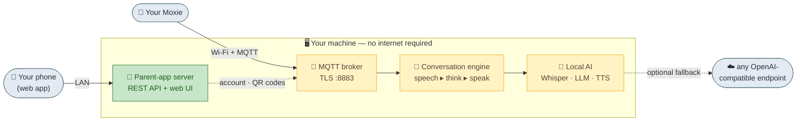
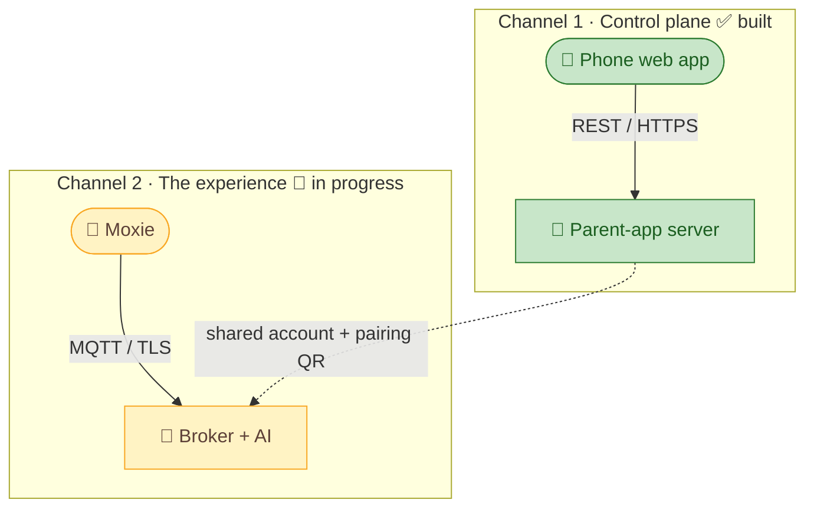
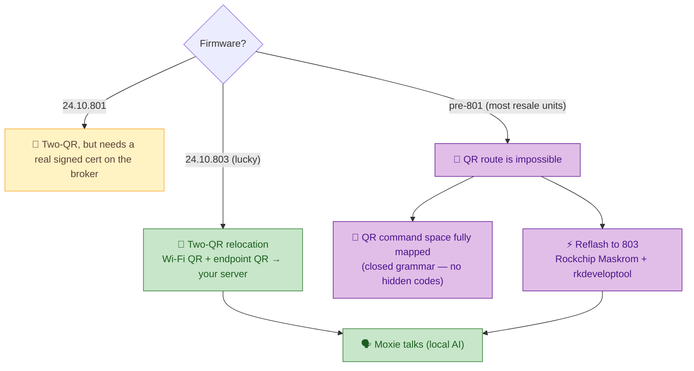
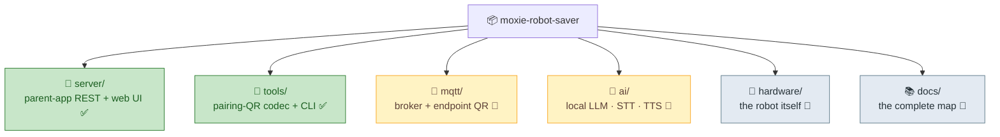

# 🤖 Moxie Robot Saver

**Bring a Moxie robot fully back to life — end to end — on your own hardware, with no cloud.**

Embodied Inc. shut down in December 2024, took its servers offline, and bricked every Moxie robot in
the field. This project is a complete, self-hosted replacement for **everything Moxie needed the
internet for** — so an owner can pair a robot, configure it, and (as the project grows) have it
*talk again* — all running on one machine at home.

But the ambition is bigger than reviving the dead cloud. Moxie decides everything it says and does
behind **one documented seam** (the `RemoteChat` turn), so **any** AI that answers it *becomes*
Moxie — a local LLM, a cloud model, your own agent. The body is a shell; this project lets **any mind
wear it**. Reviving the original experience is the floor; a full **brain transplant — a ghost in the
shell** — is the ceiling.

<p align="center">
  
</p>

> 🗂️ **Repo layout:** see [`STRUCTURE.md`](STRUCTURE.md) — three domains (robot · parent app · server app).

> 💚 **The goal:** unlock every Moxie so kids get their robot back, and keep a genuinely lovely piece
> of hardware out of the landfill. **Local-first, private, no account, no subscription.**

---

## 🏠 The vision: one box, the whole Moxie backend

One machine on your home network — a **gaming PC, a home server, or an NVIDIA Jetson Orin** (anything
with a GPU) — runs the entire Moxie cloud locally. Nothing leaves your home.



Local models by default; an OpenAI-compatible endpoint is an *optional* fallback, never a requirement.

---

## 🔌 Two channels, three steps

Reviving a Moxie means replacing **two independent cloud connections**:



### ⚠️ How you get there depends on the robot's firmware — read this first

The clean "show it two QR codes" path **only works on firmware `24.10.801/803`**, which Embodied added
late to bless the community server. In practice those units were claimed early; **most robots on the
resale market today are older (`pre-801`)**, whose cloud endpoint is hard-pinned to Google Cloud IoT
Core (dead since 2023) with hostname-checked TLS — so **they cannot be relocated by QR at all** (we
confirmed this on real hardware). Treat the two-QR route as the lucky case, not the default.



**The realistic paths this project builds toward:**

| Path | For | Status |
|------|-----|--------|
| **Two-QR relocation** (Wi-Fi QR → endpoint QR → MQTT) | firmware **803** (increasingly rare) | ✅ Wi-Fi QR hardware-verified; endpoint QR + broker built |
| **The QR command space** — mapped in full from the robot binaries (not guessed) | any firmware; reference | ✅ Closed grammar: pairing/Wi-Fi/VPN + `{"debug":{"command":…}}`; native `endpoint_update`/`om` re-home decoded ([`qr-commands.md`](docs/reverse-engineering/protocol/qr-commands.md)). The old discovery rig is retired — there are no hidden codes. |
| **Firmware reflash to 803** (open case → USB → `rkdeveloptool`) | **pre-801** (most resale units) | 🔩 documented; signed image located |

Full decision tree + the honest firmware reality: **[`docs/architecture/revival-path.md`](docs/architecture/revival-path.md)**
and the live log in **[`docs/debugging/`](docs/debugging/)**.

---

## 📍 Status

**Phase 1 — the parent app — works**, and its Wi-Fi QR has been **verified against a real Moxie**
(the robot scanned our clean-room QR and joined the network). Running today:

- ✅ A faithful, account-free reimplementation of the parent-app REST API.
- ✅ A mobile web app your phone opens over the LAN to set up a child, enter Wi-Fi, and make the QR.
- ✅ Clean-room pairing-QR tooling + deterministic recovery-key crypto, matched to the decompiled app.
- ✅ A hardware-free test path (`simulate-robot-scan`) that completes pairing with no robot.

**Phases 2–3 — the MQTT broker, conversation engine, and local AI — are being specced and built now.**
See the **[Roadmap](ROADMAP.md)**.

---

## 🚀 Quick start (Phase 1)

```bash
git clone https://github.com/mvalancy/moxie-robot-saver.git
cd moxie-robot-saver
pip install -r server/requirements.txt
python server/run.py                 # serves on 0.0.0.0:8080
```

Open **`http://<this-computer-ip>:8080`** from your phone (same LAN, or Tailscale), enter Wi-Fi,
generate the QR, hold it to Moxie. → **[Full setup guide](docs/guides/first-time-setup.md)**

---

## 🗂️ Repository map



| Path | What | Phase |
|------|------|-------|
| [`server/`](server/) | Parent-app server (REST API + mobile web client + crypto) | 1 ✅ |
| [`tools/pairing/`](tools/pairing/) | Clean-room QR codec + CLI | 1 ✅ |
| [`mqtt/`](mqtt/) | Robot cloud: MQTT broker, endpoint QR, conversation engine | 2–3 🔨 |
| [`ai/`](ai/) | Local LLM / STT / TTS adapters (OpenAI-compatible fallback) | 3 🔨 |
| [`hardware/`](hardware/) | The robot itself: OS, firmware, finding it on the LAN | ref |
| [`docs/`](docs/) | The complete map — start at [`docs/README.md`](docs/README.md) | — |

---

## 📚 Documentation

Start at **[`docs/README.md`](docs/README.md)**. Highlights:
- 🏗️ **Architecture** — [overview](docs/architecture/overview.md) · [revival path](docs/architecture/revival-path.md) · [Moxie as a platform (SDK)](docs/architecture/moxie-as-a-platform.md) · [MQTT & conversation](docs/architecture/mqtt-and-conversation.md) · [vision](docs/architecture/vision.md)
- 🔬 **Reverse-engineering** (source of truth) — [REST API](docs/reverse-engineering/phone/rest-api.md) · [crypto & keys](docs/reverse-engineering/phone/crypto-and-keys.md) · [pairing & robot](docs/reverse-engineering/phone/pairing-and-robot.md) · [QR format](docs/reverse-engineering/phone/qr-format.md) · [app structure](docs/reverse-engineering/phone/app-structure.md)
- 🎛️ **Features** — the complete parent-app [feature catalog](docs/features/)
- 🧭 **Guides** — [first-time setup](docs/guides/first-time-setup.md) · [factory reset](docs/guides/factory-reset-a-paired-moxie.md) · [find Moxie on the LAN](docs/guides/find-moxie-on-lan.md)
- 🔬 **Research tracks** — [Moxie sees (vision)](docs/architecture/vision.md) · [older robots & firmware](hardware/firmware-and-older-robots.md)
- 🌍 **Community** — [the existing revival landscape](docs/community-research.md) (OpenMoxie et al.)

---

## 🙏 Built with the community

None of this would exist without the people who kept Moxie alive after the shutdown — above all
**[OpenMoxie](https://github.com/jbeghtol/openmoxie)** (MIT, © Justin Beghtol), the CEO-sanctioned
open-source off-ramp, and its most active fork
**[Noonster77/openmoxie](https://github.com/Noonster77/openmoxie)**, which already runs Moxie on
local models. We build on their groundwork and aim to complete the picture — adding the phone-side
parent app and unifying everything into one local box. Full credits and licenses:
**[`ATTRIBUTION.md`](ATTRIBUTION.md)**.

## ⚖️ Legal & ethics

An independent **interoperability and repair** project for hardware people already own, built by
**clean-room reverse engineering** of the freely-distributed app solely to restore function to
abandoned devices. It ships **no** Embodied code, assets, firmware, or binaries. No affiliation with
or endorsement by Embodied Inc. "Moxie" is used only to identify the hardware this software
interoperates with. Children's data is handled exactly as the original app did — **end-to-end
encrypted, with the keys held by you**.

## 📄 License

MIT — see [`LICENSE`](LICENSE).
