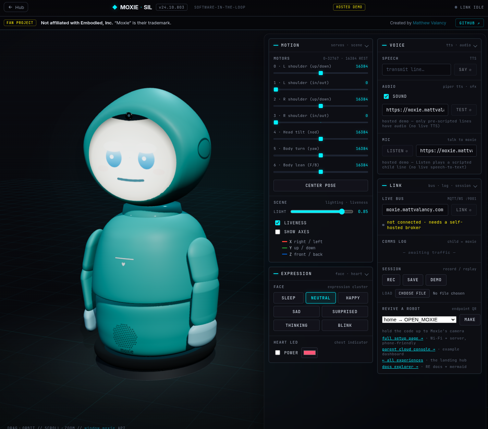
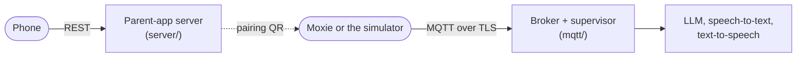

# Moxie Robot Saver

**A self-hosted replacement for the cloud that Moxie robots depended on.**

Embodied Inc. shut down in December 2024 and turned off the servers every Moxie robot needed. This
project rebuilds that backend, clean-room, as open source you run on your own machine: the parent
app, the robot's MQTT cloud, and the AI that lets Moxie talk. It also includes a browser simulator,
so you can meet a virtual Moxie without owning one.

<p align="center">
  
</p>

<p align="center">
  <b><a href="https://moxie.mattvalancy.com">Try the hosted simulator</a></b>
  &nbsp;·&nbsp; <a href="docs/README.md">Documentation</a>
  &nbsp;·&nbsp; <a href="ROADMAP.md">Roadmap</a>
</p>

*The hosted simulator is the maintainer's own deployment. Every hostname, key and gateway is
configuration, so you can deploy your own ([guide](docs/guides/deploy-cloudflare.md)).*

## What works today

| Piece | Status |
|---|---|
| **Parent app** — account-free REST server and phone web app: set up a child, enter Wi-Fi, generate the pairing QR | Works. A real Moxie scanned our Wi-Fi QR and joined the network. |
| **Robot cloud** — TLS MQTT broker, endpoint QR, and a supervisor that speaks Moxie's protocol (config push, conversation turns, device permit list) | Works against the simulator in CI. Not yet tested with a real robot. |
| **Brain, voice and ears** — any OpenAI-compatible LLM; speech via local Piper/Whisper or a gateway | Works in the simulator and the hosted demo. |
| **Content and management** — data-driven content modules, a parent console with fleet status and insights | Works. |
| **Simulator** — a 3D Moxie in the browser that speaks the real protocol | Works, locally and hosted. |
| **Getting a real robot onto this cloud** | Depends on firmware; see below. |

### The firmware catch

A robot can be pointed at a new server by showing it QR codes **only on firmware 24.10.801/803**.
Most robots sold second-hand run older firmware, whose cloud address is fixed and cannot be changed
by QR. Those units need a firmware reflash, which is documented but not yet proven end to end. Start
with the owner guide, [revive your Moxie](docs/guides/revive-your-moxie.md); the full decision tree
is the [revival path](docs/architecture/revival-path.md).

## Quick start

**Just the simulator** (needs Docker):

```bash
git clone https://github.com/mvalancy/moxie-robot-saver.git
cd moxie-robot-saver
docker compose -f sim/docker-compose.yml up
```

Open <http://localhost:8080/sim.html> (the `/sim` path serves the same page) and click
**Connect**. See [`sim/`](sim/README.md) for voice and demo options.

**The whole backend** (broker, supervisor and parent console), using prebuilt images for
`amd64` and `arm64` (a Raspberry Pi 4/5 works):

```bash
curl -O https://raw.githubusercontent.com/mvalancy/moxie-robot-saver/main/docker-compose.images.yml
MOXIE_APP=echo docker compose -f docker-compose.images.yml up
```

`MOXIE_APP=echo` runs the stack without a brain: Moxie echoes you, but every other part works. For a
real brain, set `MOXIE_LLM_BASE_URL` in a `.env` beside that file instead; with neither, only the
broker starts. Or `docker compose up` from a clone to build locally. Then open
`http://<this-computer's-ip>:8080` on your phone. Next steps: [one-command stack](docs/guides/one-command-stack.md)
and [first-time setup](docs/guides/first-time-setup.md).

## How it fits together

Moxie used two separate cloud connections, and this project replaces both.


```mermaid
flowchart LR
    phone(["Phone"]) -->|"REST"| server["Parent-app server<br/>(server/)"]
    robot(["Moxie or the simulator"]) -->|"MQTT over TLS"| broker["Broker + supervisor<br/>(mqtt/)"]
    broker --> brain["LLM, speech-to-text,<br/>text-to-speech"]
    server -. "pairing QR" .-> robot
```

1. **The control plane** — the phone app talks REST to the parent-app server to create an account
   and pair the robot.
2. **The experience** — the robot talks MQTT to the broker; the supervisor turns what the child says
   into a reply using whatever AI you configure.

The AI sits behind one documented interface ([AI seam](docs/architecture/ai-seam.md)), so any model,
local or hosted, can be Moxie's brain.

## Repository map

| Folder | What's in it |
|---|---|
| [`server/`](server/) | Parent-app REST server and phone web client |
| [`mqtt/`](mqtt/) | Robot cloud: broker config, supervisor, and the Moxie SDK (brain, voice, content) |
| [`sim/`](sim/) | Browser simulator, virtual robot, and most of the test suite |
| [`functions/`](functions/) | Cloudflare Pages functions behind the hosted demo |
| [`tools/`](tools/) | Pairing and endpoint QR tools, command-line |
| [`hardware/`](hardware/) | The physical robot: what it is made of, and firmware versions |
| [`docs/`](docs/README.md) | Guides, architecture contracts, and the reverse-engineering study |
| [`ai/`](ai/), [`scripts/`](scripts/), [`.claude/`](.claude/) | Where the AI adapters live (one README), the doc guards and PR helpers, and the shared Claude agents and skills |

More detail: [`STRUCTURE.md`](STRUCTURE.md).

## Contributing

How we write docs, and the guards that check them: [`CONTRIBUTING.md`](CONTRIBUTING.md). Branches,
CI and releases: [`RELEASING.md`](RELEASING.md). The hard rules every change follows:
[agent workflow](docs/architecture/agent-workflow.md).

## Credits

This builds on the people who kept Moxie alive after the shutdown, above all
[OpenMoxie](https://github.com/jbeghtol/openmoxie) (MIT, Justin Beghtol) and its active forks. Full
credits and licenses: [`ATTRIBUTION.md`](ATTRIBUTION.md).

## Legal

An independent interoperability and repair project for hardware people already own. It was built by
clean-room reverse engineering of the freely distributed app, and ships **no** Embodied code, assets,
firmware or binaries. It is not affiliated with or endorsed by Embodied Inc.; "Moxie" names the
hardware this software works with.

## License

MIT — see [`LICENSE`](LICENSE).
