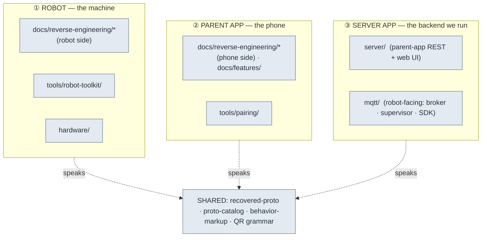

# 🗂️ Repository structure

We map and rebuild Moxie across **three domains** — the **robot**, the **parent app** (phone), and the
**server app** (the backend that replaces the dead cloud) — plus shared protocol and tooling. Every
top-level folder below belongs to one of them, and the layout is meant to **grow in that shape**.

## Top-level map

| Path | Domain | What it is |
|---|---|---|
| [`docs/`](docs/) | all | The documentation. `docs/reverse-engineering/` is split phone-side vs robot-side; see [`docs/README.md`](docs/README.md) for the 3-domain index. |
| [`tools/robot-toolkit/`](tools/robot-toolkit/) | ① robot / shared | QR codec, ZMQ bus client, cloud helpers, protoref, secrets extractor, 120 proto bindings. |
| [`tools/pairing/`](tools/pairing/) | ② parent app | The phone-side pairing-QR encoder (`moxie_qr.py`). |
| [`tools/qr-rig/`](tools/qr-rig/) | ① robot | Camera QR validation rig. |
| [`hardware/`](hardware/) | ① robot | Hardware notes / teardown material (grows as we open a unit). |
| [`server/`](server/) | ③ server app | **Parent-app half** of the backend: clean-room `client-service` REST API + mobile web UI (FastAPI). |
| [`mqtt/`](mqtt/) | ③ server app | **Robot-facing half** of the backend: MQTT broker, the supervisor (speaks the robot protocol), and the Moxie SDK. |
| [`ai/`](ai/) | shared | AI/agent notes. |
| [`scripts/`](scripts/) | shared | Repo-maintenance helpers (doc-link + mermaid checkers). |

## The "server app" domain — how it grows

Today the backend the robot + phone talk to is **two folders**, split by *who connects*:

- **[`server/`](server/)** — what the **parent app** expects (`client-service-api.embodied.com`): account,
  pairing, REST, the web UI. Named `server/` because it *is* the server the phone hits.
- **[`mqtt/`](mqtt/)** — what the **robot** connects to: the MQTT broker + supervisor + SDK
  ([`cloud-protocol.md`](docs/reverse-engineering/protocol/cloud-protocol.md)).

These are the two faces of **one server app**. The obvious growth path is to keep them as clear,
independently-runnable components under the server-app domain, and — as they mature — unify their
config/deploy (one compose stack, shared device/account store) so "run the server app" is a single
step. If we ever want a single top-level name, `server/` is where the parent-app face lives and
`mqtt/` the robot face; a future `serverapp/` (or renaming `server/ → server/parent-app` +
`server/robot-cloud`) is on the table once the interfaces settle. Until then each folder's README
states its scope so nothing is ambiguous.

## Conventions

- **Every folder has a `README.md`** so it's browsable in the GitHub UI (generated proto trees carry a
  single root README rather than one per package).
- **Robot-side docs are version-stamped** to the analyzed firmware
  **v3.6.4-Zephyr / OTA v24.10.803** ([`firmware-803-reference.md`](docs/reverse-engineering/firmware/firmware-803-reference.md)).
- Run [`scripts/check-doc-links.py`](scripts/check-doc-links.py) before committing docs.

---
📖 [Docs index](docs/README.md) · [Field guide](docs/reverse-engineering/FIELD-GUIDE.md) · [Architecture diagrams](docs/reverse-engineering/architecture-diagrams.md)
