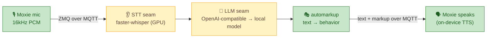

# 🧠 `ai/` — local AI adapters (Phase 3)

Pluggable **speech-to-text** and **LLM** for the conversation engine. Not built yet; this is the plan,
grounded in the [MQTT & conversation spec](../docs/architecture/mqtt-and-conversation.md). The precise
interface these adapters fill — the LLM/STT/TTS boundaries as request/response contracts — is the
[**AI seam** spec](../docs/architecture/ai-seam.md); build each adapter to that.

## Principles
- **Local first.** Default to models running on this machine's GPU — no internet at runtime.
- **No vendor lock-in.** The LLM speaks to **any OpenAI-compatible endpoint** (a local LiteLLM
  gateway, vLLM, Ollama, LM Studio, …). OpenAI itself is only an *optional fallback*, never required.
- **Swappable.** Each slot is a small adapter behind a tiny interface.

## The good news: there are only two seams

| Slot | Where it plugs in | Default (local) | Fallback |
|------|-------------------|-----------------|----------|
| **LLM** | `ai_factory` → set `base_url` on the OpenAI client | local model via LiteLLM/vLLM/Ollama/LM Studio | any OpenAI-compatible endpoint |
| **STT** | `zmq_stt_handler` → swap the transcription call | **faster-whisper** on the GPU | any Whisper-compatible service |

## About TTS (important finding)
**Moxie synthesizes its own voice on-device.** The server sends *text + behavior markup*; the robot
speaks. So there is **no server-side TTS to run for Moxie's voice** — the "local TTS" requirement is
satisfied by the robot itself, for free. Our expressiveness lever is the vendored **`automarkup`**
engine (text → Moxie behavior/emotion), not a TTS model.

> 🔊 **Piper TTS** (a great-sounding, fast, fully-local neural TTS) is noted as a favorite. It isn't
> needed for Moxie's *own* voice (on-device), but it's the natural pick if we ever add server-side
> speech — e.g. a "read this aloud" side feature, notifications, or an alternate-voice experiment.
> Tracked as an optional extra, not a core dependency.

## Status
🔨 Planned. See [`../ROADMAP.md`](../ROADMAP.md) Phase 3 and the [conversation spec](../docs/architecture/mqtt-and-conversation.md).

---
📖 [Back to top](../README.md) · [MQTT & conversation spec →](../docs/architecture/mqtt-and-conversation.md)
