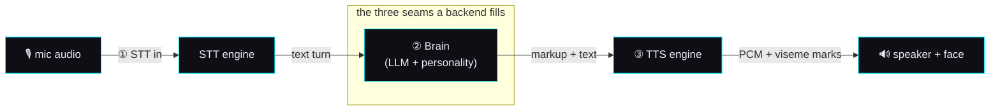

# 🔌 The AI seam — LLM / STT / TTS interface contract

> **Spec version 1 · robot side stamped to firmware v3.6.4-Zephyr / OTA v24.10.803.**
> This is the *implementation-facing* contract for the three places a backend supplies intelligence.
> It reads standalone; it cites the reverse-engineering study for provenance but you do not need to
> read that study to build against this. Distilled from
> [`remote-chat-protocol.md`](../reverse-engineering/protocol/remote-chat-protocol.md),
> [`perception-pipeline.md`](../reverse-engineering/runtime/perception-pipeline.md), and
> [`unity-mainapp-interface.md`](../reverse-engineering/protocol/unity-mainapp-interface.md).

## Why this is the whole game

Moxie's body — face render, motors, LEDs, speaker, camera, mic, the behavior tree, the perception
pipeline — is fixed hardware and fixed on-device code. It is a **shell**. Everything that makes a
given Moxie *think, hear, and speak* enters through exactly **three seams**, each a request/response
contract carried over the [MQTT/ZMQ bus](mqtt-and-conversation.md). Implement these three and any AI
becomes Moxie's mind — that is the "ghost in the shell." The SIL avatar and a re-homed robot are
**interchangeable clients** of the same three seams, so anything proven in the sim runs on hardware.



Each seam below is: **the contract** (what crosses it), **the wire shape** (exact fields, from the
recovered protos), **what's required vs optional**, and **the plug-in rule** (how to be a drop-in).

---

## ① STT in — audio → text

**Contract.** The backend receives streamed mic audio and must return an incremental transcript that
marks when a turn is finished. The robot already parses two shapes; implement **either**.

**Plug point A — cloud-shaped (`DeepgramResponse`).** Be a drop-in for the shipping cloud STT by
returning a Deepgram-compatible result over the same WebSocket the robot dials. Minimum fields the
robot reads: the transcript `channel.alternatives[].transcript`, `is_final`, and the turn-ender
**`speech_final`** (true = the child stopped talking → the turn closes and goes to the brain).
See [STT response wire format](../reverse-engineering/runtime/perception-pipeline.md#stt-response-wire-format-deepgramresponse).

**Plug point B — on-device bus (`zmqSTT`).** Implement one request/response pair on the perception
bus so any engine (local Whisper/Vosk/Kaldi, or a proxy) drops in behind the audio module:

```proto
message zmqSTTRequest  { VADState vad; bytes audio_content; string uuid; }   // vad: START / SPEECH / END_OF_SPEECH
message zmqSTTResponse { Type type; string speech; float confidence; ...     // type: PARTIAL / FINAL
                         string original_utterance; string original_language;  // translation-aware
                         repeated int32 speaker_id; }
```

**Required:** a `FINAL`/`speech_final` transcript per turn. **Optional but honored:** partials (for
low-latency barge-in), `confidence`, `speaker_id` (diarization), and the translation-aware
`original_*` fields. **Turn-end semantics:** the turn closes on `speech_final=true` (plug A) /
`END_OF_SPEECH` + `FINAL` (plug B); everything before that is provisional.
Full detail: [`perception-pipeline.md`](../reverse-engineering/runtime/perception-pipeline.md).

---

## ② Brain — the RemoteChat contract (where the AI lives)

**Contract.** This is the seam. Per turn, the backend receives a `RemoteChatRequest` (the child's
utterance + context) and returns a `RemoteChatResponse` that (a) says a line, (b) optionally drives
navigation, and (c) reports its read of the child. A minimal backend fills only the *speak* half; a
full brain uses all three.

### Request in — `RemoteChatRequest`
The transcript from seam ① plus conversation context, history, the current module/content id, and a
`RecommendationContext` telling the brain what it *could* steer toward
(`Recommendation{module_id, content_id, entry_line}`, `restricted_modules`, `Urgency` casual/normal/immediate).
Deltas over the base session are in [`remote-chat-protocol.md`](../reverse-engineering/protocol/remote-chat-protocol.md).

### Response out — `RemoteChatResponse`
Three parts:

**(a) `RemoteChatOutput` — the spoken turn (required).** Not just text — a fully-scored line:

| Field | Required? | Meaning |
|---|---|---|
| `text` (+ `text_extended`) | **yes** | the line to speak |
| `markup` | recommended | inline behavior markup — face/mood/gesture/audio ([behavior-markup](../reverse-engineering/runtime/behavior-markup.md)); drives the body while it talks |
| `mood`, `mood_intensity` | recommended | emotional performance to render on the face |
| `dialog_act`, `emotion`, `sentiment` (+ scores) | optional | what the line *means* — analytics/steering |
| `signals`, `auto_tags[]`, `perplexity`, `source` | optional | conversation signals + content tags + provenance |

**(b) `RemoteChatAction` — drive the robot (optional, this is the "director" power).** `ActionID`:
`launch` / `launch_if_confirmed` (start a module), `exit_module` / `abort_module`, `request_next`,
`execute` (run a device-side `function_id(args)`, result returns next turn via `execute_returns`),
`sleep`, `tangent`. Plus `EventSubscription{clear, active[], passive[]}` — the brain subscribing to
robot input events it wants pushed to it. This is why a revival server can do **more than reply**: it
moves the child between activities and reacts to perception.

**(c) `RemoteChatInput` — the brain's read of the child (optional).** `emotion`/`dialog_act`/`sentiment`
+ **`InputSafety{is_unsafe, blocked_by[], intents[], phrase_id}`** — the content-moderation verdict.
**This is the moderation hook**: a kid-facing backend SHOULD populate it.

**Result codes (`ResultCode`, required):** `REPLY` on success; `ERROR_OFFLINE` triggers the robot's
**local fallback** (see [`offline-and-brain-state.md`](../reverse-engineering/protocol/offline-and-brain-state.md)) —
so a backend that returns `ERROR_OFFLINE` degrades gracefully instead of hanging; also `NOREPLY_*`,
`REPLY_FORCE_ANCHOR`, `QUIT`. **Streaming:** chunk a long turn with `chunk_num`.

**Taxonomies** (closed sets the brain scores into): `DialogAct`×22, `EmotionState`×7, `Signal`×9,
`Urgency`×3 — enumerated in [`remote-chat-protocol.md`](../reverse-engineering/protocol/remote-chat-protocol.md#taxonomies).

> **The minimal viable brain:** answer every `RemoteChatRequest` with a `RemoteChatResponse` whose
> `ResultCode=REPLY` and `RemoteChatOutput.text` set. Add `markup`+`mood` to make the face act; add
> `RemoteChatAction` to run activities; add `InputSafety` to moderate. Everything past `text` is
> progressive enhancement.

---

## ③ TTS out — markup → audio + viseme marks

**Contract.** The brain's line (markup string) goes to a TTS engine; back comes rendered PCM plus a
timeline of marks the face uses to lip-sync and fire gestures. Any TTS drops in — the on-device
CereVoice is just the local fallback path.

### Request in — `CloudTTSRequest`
```proto
message CloudTTSRequest { string markup; string event_id; int32 chunk_num;
                          uint64 timestamp; string user_id; string module_name; }
```
`markup` is the spoken line with inline behavior markup (SSML-like; see
[behavior-markup](../reverse-engineering/runtime/behavior-markup.md)).

### Response out — `CloudTTSResponse`
```proto
message AudioBuffer      { bytes buffer; int32 channels; int32 sample_rate; }   // rendered PCM
message TTSMark          { uint32 time; uint32 start; uint32 end; string type; string value; }
message CloudTTSResponse { RequestSourceType request_source; AudioBuffer audio;
                           repeated TTSMark marks; string event_id; int32 chunk_num;
                           uint64 total_time; uint64 synthesis_time; }
```

**Required:** `audio` (PCM: raw `buffer` + `channels` + `sample_rate`) and `event_id` to correlate.
**`marks[]` (recommended):** timed events lifted from the markup — the face reads them for **viseme**
lip-sync (mouth shapes) and to fire gestures at the right instant. Without marks the audio still
plays; the mouth just won't sync. **Streaming:** emit chunks with `chunk_num`; pair with
`CloudTTSSupplement` for per-chunk timing metrics if desired.
Detail: [audio-out section](../reverse-engineering/protocol/unity-mainapp-interface.md#audio-out-tts-sfx-playback-control).

---

## Conformance checklist

A backend is a valid Moxie mind when it satisfies **one plug point per seam**:

- [ ] **① STT** — returns a per-turn final transcript via `DeepgramResponse.speech_final` **or** `zmqSTT` `FINAL`.
- [ ] **② Brain** — answers every `RemoteChatRequest` with `RemoteChatResponse{ResultCode, RemoteChatOutput.text}`; returns `ERROR_OFFLINE` rather than hanging when it can't.
- [ ] **③ TTS** — returns `CloudTTSResponse{audio, event_id}` for each `CloudTTSRequest`.

Recommended for a *good* experience (not required to function): `markup`+`mood` on the brain output,
`marks[]` on TTS (lip-sync), `InputSafety` (moderation), and partial STT (barge-in).

## Where each seam is implemented in this repo

| Seam | Lives in | Notes |
|---|---|---|
| ① STT in | `ai/` + `mqtt/` | local Whisper/Vosk → `DeepgramResponse` shape; the sim uses `sim/stt/` |
| ② Brain | `mqtt/` (the `MoxieApp`/`LLMApp` agent) | any OpenAI-compatible LLM (Ollama/LiteLLM), env-configured; emits markup |
| ③ TTS out | `ai/` + `mqtt/` | Piper (offline) → `CloudTTSResponse` PCM; the sim uses `sim/tts/` |

Keys/endpoints live only in a git-ignored `.env`; the repo ships placeholders. The
[ecosystem build plan](moxie-ecosystem.md) shows how these three sit inside the one-command stack; the
[MQTT/conversation spec](mqtt-and-conversation.md) carries the transport (topics, framing, session).

---
📖 [Docs index](../README.md) · [Architecture: MQTT & conversation →](mqtt-and-conversation.md) · [Ecosystem build plan](moxie-ecosystem.md)
