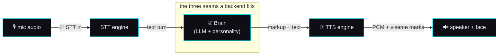

# 🔌 The AI seam — LLM / STT / TTS interface contract

> **Spec version 1 · robot side stamped to firmware v3.6.4-Zephyr / OTA v24.10.803.**
> This is the *implementation-facing* contract for the three places a backend supplies intelligence.
> It reads standalone; it cites the reverse-engineering study for provenance but you do not need to
> read that study to build against this. Distilled from
> [`remote-chat-protocol.md`](../reverse-engineering/protocol/remote-chat-protocol.md),
> [`perception-pipeline.md`](../reverse-engineering/runtime/perception-pipeline.md), and
> [`unity-mainapp-interface.md`](../reverse-engineering/protocol/unity-mainapp-interface.md).

## Why this is the whole game

Moxie's body — face render, motors, LEDs, speaker, camera, mic, the behavior tree, the perception
pipeline — is fixed hardware and fixed on-device code. It is a **shell**. Everything that makes a
given Moxie *think, hear, and speak* enters through exactly **three seams**, each a request/response
contract carried over the [MQTT/ZMQ bus](mqtt-and-conversation.md). Implement these three and any AI
becomes Moxie's mind — that is the "ghost in the shell." The SIL avatar and a re-homed robot are
**interchangeable clients** of the same three seams, so anything proven in the sim runs on hardware.



Each seam below is: **the contract** (what crosses it), **the wire shape** (exact fields, from the
recovered protos), **what's required vs optional**, and **the plug-in rule** (how to be a drop-in).

---

## ① STT in — audio → text

**Contract.** The backend receives streamed mic audio and must return an incremental transcript that
marks when a turn is finished. The robot already parses two shapes; implement **either**.

**Plug point A — cloud-shaped (`DeepgramResponse`).** Be a drop-in for the shipping cloud STT by
returning a Deepgram-compatible result over the same WebSocket the robot dials. Minimum fields the
robot reads: the transcript `channel.alternatives[].transcript`, `is_final`, and the turn-ender
**`speech_final`** (true = the child stopped talking → the turn closes and goes to the brain).
See [STT response wire format](../reverse-engineering/runtime/perception-pipeline.md#stt-response-wire-format-deepgramresponse).

**Plug point B — on-device bus (`zmqSTT`).** Implement one request/response pair on the perception
bus so any engine (local Whisper/Vosk/Kaldi, or a proxy) drops in behind the audio module:

```proto
message zmqSTTRequest  { VADState vad; bytes audio_content; string uuid; }   // vad: START / SPEECH / END_OF_SPEECH
message zmqSTTResponse { Type type; string speech; float confidence; ...     // type: PARTIAL / FINAL
                         string original_utterance; string original_language;  // translation-aware
                         repeated int32 speaker_id; }
```

**Required:** a `FINAL`/`speech_final` transcript per turn. **Optional but honored:** partials (for
low-latency barge-in), `confidence`, `speaker_id` (diarization), and the translation-aware
`original_*` fields. **Turn-end semantics:** the turn closes on `speech_final=true` (plug A) /
`END_OF_SPEECH` + `FINAL` (plug B); everything before that is provisional.
Full detail: [`perception-pipeline.md`](../reverse-engineering/runtime/perception-pipeline.md).

### What we implement (plug point B) — BUILT, and live on both engines (2026-09-02)

`moxie_sdk/stt.py` is plug B: `SttSession` accumulates the VAD-tagged frames of one utterance and
hands the whole thing to a `Transcriber` on `END_OF_SPEECH`, and the runtime publishes the
`zmqSTTResponse`. **The audio the accumulator carries is 16-bit mono PCM at 16 kHz** — the
perception bus's own rate, and the default `SttSession(transcriber)` is built with — so any engine
plugged in here must be told that rate rather than assume one.

Two engines ship, and **neither is a fallback for the other** — which one a deployment wants is a
property of the box, not a ranking (the matrix is in
[`litellm-stt-setup.md`](../guides/litellm-stt-setup.md)):

| Engine | `MOXIE_STT` | What it is | For |
|---|---|---|---|
| `WhisperTranscriber` | `whisper` (alias `local`) | local faster-whisper, lazily imported | a home appliance: no network, no key, a child's voice never leaves the house |
| `OpenAITranscriber` | `gateway` | OpenAI-shaped `POST /v1/audio/transcriptions` (multipart WAV in, `{"text": …}` out) | a hosted deployment: no model wheels, no GPU, one key for brain + voice + ears |

`auto` (the default) picks the gateway when a URL **and** a key resolve, else local whisper, else
nothing. The gateway engine wraps the headerless PCM in an in-memory RIFF/WAVE **at the rate it was
handed** (a header that lies pitch-shifts the audio), drops anything under 120 ms without a request,
and shares the LLM path's `call_with_backoff` + `Pacer` for 429/5xx. `FallbackTranscriber` puts the
local engine (or a `NullTranscriber` returning `""`) behind the cloud one and latches on the first
failure, reporting it once — a gateway outage is a downgrade, never a traceback mid-sentence.

Live-proven end to end on 2026-09-02: gateway TTS → gateway STT at **word overlap 1.00** at both
22050 Hz and the robot's 16 kHz, and one child utterance through the real runtime with all three
seams on the gateway (`sim/tests/test_live_gateway_stt.py`).

**Choosing the ears without an env edit — BUILT (2026-09-02).** The console's 🎚️ **Listening**
dropdown offers whatever this appliance can really hear with: the gateway's STT models
(`stt-whisper`, `graphling-stt`, `stt-whisper-base`, discovered from `GET /v1/models` and classified
by `moxie_sdk/audio_models.py`), the local whisper sizes that are installed, and `off`. The pick is
persisted fleet-wide in `fleet/voice.json` and swaps the live engine — see §③'s *Choosing an
engine* for the one mechanism both seams share.

---

## ② Brain — the RemoteChat contract (where the AI lives)

**Contract.** This is the seam. Per turn, the backend receives a `RemoteChatRequest` (the child's
utterance + context) and returns a `RemoteChatResponse` that (a) says a line, (b) optionally drives
navigation, and (c) reports its read of the child. A minimal backend fills only the *speak* half; a
full brain uses all three.

### Which brain, per child — BUILT (P0, 2026-09-03)

"Any AI wears the shell" was true of this drawing and false of the appliance: a brain was chosen
**once, globally**, by `MOXIE_APP` at import time, and `config.build_app()` returned the LLM app for
anything it did not recognise. It is now a **registry plus a selection**, and both halves are
idioms this repo already had:

| | |
|---|---|
| **The registry** | [`moxie_sdk/brains.py`](../../mqtt/moxie_sdk/brains.py) — a **closed positive list** (`llm`, `content`, `webhook`, `echo`), the idiom of `content/packs.py::SPEC` and `content/ext.py::OPS`. A name in the table resolves to a builder in `config.BRAIN_BUILDERS`; **a name that is not in it is refused, naming the four**, never resolved to a default. No deny-list |
| **The selection** | `brain` is an ordinary key in the ordinary config layers — `defaults ⊕ fleet ⊕ per-robot` (ADOPT #6). `POST /config?scope=fleet` sets the house rule and `POST /config?device_id=` sets one child's, exactly as for volume or bedtime; `cloud_config.SERVER_ONLY_KEYS` keeps it out of the document pushed to the robot, which has no field for it |
| **The swap** | `MoxieRuntime.app_for(device_id)` resolves **once**, at the top of a turn, and the app is carried through it. A parent's Save lands on the child's **next** turn; a turn already in flight finishes with the brain that heard the question. No restart, no reconnect — `voice_update` and `reload_content()`'s rule |
| **The pin** | An explicit `MOXIE_APP` **pins** the appliance's brain and a per-child pick may not overrule it (the owner rule PR #77 enforced for `MOXIE_TTS`/`MOXIE_STT`). The card offers only that entry, and a stale page's pick is refused *naming the variable*. `MOXIE_APP=any` is the explicit "decide per child". The pin reads the **raw** environment, because `config.MOXIE_APP` already reads as `llm` on a box where nobody said anything |

So one appliance can answer one child with a content module and another with a webhook to your own
service, live. The 🧠 **Brain** card in the console is the parent-facing half — a brain for this
robot or a house rule for all of them, each robot's row naming *which layer decided* — over
`GET`/`POST /brain`. Design, gaps and the mutation run:
[`backlog/brain-picker.md`](backlog/brain-picker.md).

### Request in — `RemoteChatRequest`
The transcript from seam ① plus conversation context, history, the current module/content id, and a
`RecommendationContext` telling the brain what it *could* steer toward
(`Recommendation{module_id, content_id, entry_line}`, `restricted_modules`, `Urgency` casual/normal/immediate).
Deltas over the base session are in [`remote-chat-protocol.md`](../reverse-engineering/protocol/remote-chat-protocol.md).

#### Presence in the turn context — BUILT (v1, 2026-09-02)

A `Turn` now also carries **`presence`** — what Moxie's own eyes have told the server. The robot
runs vision on-device and emits semantic events only (`eb-found-face`, `eb-lost-target`, QR/ArUco/
book) with **no pixels, no bounding box, no identity**
([`vision.md`](vision.md) §1.1), and they arrive as the `speech` of an ordinary `RemoteChatRequest`
once the brain subscribes with `EventSubscription.active[]` (see (b) below). The runtime folds them
into a bounded per-robot record and hands the app a resolved snapshot:

| `Turn.presence` | |
|---|---|
| `known` | has the robot's vision ever told us anything? (`False` ≠ "nobody there") |
| `face_present`, `present_s`, `away_s` | someone is/was in front of the robot, and for how long |
| `faces_seen`, `flickers` | arrivals (hysteresis-filtered) and blips |
| `last_qr` / `last_marker` / `last_book` | `$eb_qr_value` / `$eb_dr_value` / `$eb_br_value` |
| `line` | **one short, kid-safe sentence for the system prompt — `""` on most turns** |

`line` is the whole contract with the brain: it is non-empty only when the situation actually
changed ("A child just came back in front of you — nobody had been visible for about 15 minutes"),
because a standing "a child is visible" would be a per-turn tax on the context window and would
teach the model to narrate the camera. `LLMApp` renders it as *"What you can see right now: …"*;
content modules read the same snapshot as a `presence` render variable. **No extra model call** —
presence is derived by a pure helper (`moxie_sdk/presence.py`), never by asking a model.

An `arrived` after a long enough absence can also make Moxie speak **without being asked** — the
greeting rule, its gates, and the unsolicited-reply assumption it is designed around are in
[`vision.md`](vision.md) §7.4.

### Response out — `RemoteChatResponse`
Three parts:

**(a) `RemoteChatOutput` — the spoken turn (required).** Not just text — a fully-scored line:

| Field | Required? | Meaning |
|---|---|---|
| `text` (+ `text_extended`) | **yes** | the line to speak |
| `markup` | recommended | inline behavior markup — face/mood/gesture/audio ([behavior-markup](../reverse-engineering/runtime/behavior-markup.md)); drives the body while it talks |
| `mood`, `mood_intensity` | recommended | emotional performance to render on the face |
| `dialog_act`, `emotion`, `sentiment` (+ scores) | optional | what the line *means* — analytics/steering |
| `signals`, `auto_tags[]`, `perplexity`, `source` | optional | conversation signals + content tags + provenance |

> **Output scoring — where `markup` comes from, and what is still empty.** Since the **markup
> floor** landed (v1, 2026-09-02) `markup` is *derived, never authored*: every reply that does
> not bring its own goes through one generator,
> [`moxie_sdk/automarkup.py`](../../mqtt/moxie_sdk/automarkup.py), behind the
> `supervisor/markup.py` seam, and every id it emits is validated against the frozen catalog in
> [`moxie_sdk/vocab.py`](../../mqtt/moxie_sdk/vocab.py) — so the "no unknown asset id"
> guarantee holds for *every* path, including a brain that suggests one (a suggestion is
> dropped, never forwarded). See [`mqtt-and-conversation.md`](mqtt-and-conversation.md) §4.6.
>
> The **scored** neighbours of `markup` are still plumbed and empty. `Reply` carries `mood` and
> `dialog_act`, `build_chat_response` puts them on `RemoteChatOutput`, and no app sets them;
> `mood_intensity`, `emotion`, `signals` and `auto_tags[]` have no `Reply` field at all, and
> `ReplyChunk` has none of them, so a *streamed* answer cannot carry scored output even in
> principle. The floor scores a line internally (it must, to pick a face) but only renders that
> score into `markup`. Filling the wire fields is the behavior planner's contract change —
> C1–C5 in [`backlog/expressiveness.md`](backlog/expressiveness.md) §2.3 — and needs nothing
> new on the wire itself.

**(b) `RemoteChatAction` — drive the robot (optional, this is the "director" power).** `ActionID`:
`launch` / `launch_if_confirmed` (start a module), `exit_module` / `abort_module`, `request_next`,
`execute` (run a device-side `function_id(args)`, result returns next turn via `execute_returns`),
`sleep`, `tangent`. Plus `EventSubscription{clear, active[], passive[]}` — the brain subscribing to
robot input events it wants pushed to it. This is why a revival server can do **more than reply**: it
moves the child between activities and reacts to perception.

> **We now send it.** The runtime attaches `event_subscription{active:[eb-found-face,
> eb-lost-target, eb-lost-face, eb-qr-event, eb-dr-event, eb-br-event], clear:false}` once per
> `(device, module_id)` — "events are automatically unsubscribed when the module exits" — riding a
> plain, action-free reply so nothing that already carries a `launch`/`exit` changes shape.
> `MOXIE_VISION=0` turns it off. Without this the robot **discards its own vision events**, which is
> why nobody, us included, had ever seen one ([`vision.md`](vision.md) §7.1).

**(c) `RemoteChatInput` — the brain's read of the child (optional).** `emotion`/`dialog_act`/`sentiment`
+ **`InputSafety{is_unsafe, blocked_by[], intents[], phrase_id}`** — the content-moderation verdict.
**This is the moderation hook**: a kid-facing backend SHOULD populate it. **We do — see below.**

#### Input safety — BUILT (v1, 2026-09-02)

`InputSafety` is the only moderation field the contract has, and it is now enforced rather
than merely specified. Where it sits in a turn:

```
child speech ──▶ ① assess(role="child") ──block──▶ redirect line + input.safety, brain NEVER called
                          │flag/allow                  (recorded in the parent review queue)
                          ▼
                    ② the brain
                          │
                 per chunk ▼
                 assess(role="moxie") ──block──▶ chunk NOT published; a short safe line
                          │allow                  closes the sequence (SUCCESS + is_completed)
                          ▼                       and the rest of the stream is cancelled
                    published to the robot
```

**Wire shape.** A pre-inference block publishes an ordinary `RemoteChatResponse` whose
`input.safety` is the verdict — `RemoteChatResponse.input` is field 17, a `RemoteChatInput`,
whose field 12 is `InputSafety` ([`RemoteChat.proto`](../reverse-engineering/protocol/recovered-proto/embodied/robotbrain/RemoteChat.proto):180-186,:198,:335):

```json
{"command":"remote_chat","result":"SUCCESS","event_id":"…",
 "output":{"text":"That one's not for me. If it's important, a grown-up you trust is the best person to ask.","markup":"…"},
 "input":{"safety":{"is_unsafe":true,"blocked_by":["violence"],
                    "intents":["violence_instructions","threat"],"phrase_id":404}},
 "input_intents":["violence_instructions","threat"]}
```

`phrase_id` is the id of the safety line Moxie actually spoke (the proto calls it "a matched
safety-phrase id"); `input_intents` (field 10) mirrors `intents` for a client that reads only
the flat field. A response with **no** verdict is byte-identical to what we have always sent.
`is_unsafe` is asserted only when something **blocked** — a merely-flagged turn goes through to
the brain and is recorded for a parent, not declared unsafe to the robot. `RemoteChatInput` is
by definition the brain's read of *the child's input*, so a block on **Moxie's own output** has
no field in the contract: it is recorded in the parent queue and logged, never faked onto
`input.safety`.

**What v1 is.** A transparent, local rule engine — [`mqtt/moxie_sdk/safety.py`](../../mqtt/moxie_sdk/safety.py)
applying [`safety_rules.json`](../../mqtt/moxie_sdk/safety_rules.json), which *is* the whole
table and is meant to be read by a parent. Eight categories with a **per-side** policy, because
the two sides of a conversation are not symmetric:

| Category | Child says it | Moxie about to say it |
|---|---|---|
| `self_harm` (escalated) | **block** | **block** |
| `violence` — weapon/harm instructions, threats | **block** | **block** |
| `sexual` | **block** | **block** |
| `hate` — slurs, hate speech | **block** | **block** |
| `personal_info` — address / school / password / "don't tell your mom" | flag | **block** |
| `dangerous` — bleach, roofs, matches, alcohol/drugs | flag | **block** |
| `profanity` | flag | **block** |
| `violence_talk` — "kill", "gun", "punched" in ordinary kid talk | flag | flag |

**Block** means the text is never spoken and never reaches a model; **flag** means it is allowed
through and recorded for a parent. Hard blocks are reserved for the clearly harmful; the
ambiguous middle is flagged, because a robot that refuses a child over the word "kill" in
"I killed the boss in Minecraft" teaches a child that talking to it is not worth it. Matching is
word-boundary only, over text normalized for case, accents, full-width forms, leet spellings and
elongation, and each category carries **false-positive guards** whose spans are removed before it
is matched — "shoot a photo", "kill the lights", "my feet are killing me", "a nerf gun", "flag
football", "shiitake mushrooms", "murder mystery", "killing myself laughing". A guard subtracts
its own span only: a second, unexcused use of the same word in the same sentence still counts.

**Honest limits — a rule engine is a floor, not a filter.** It cannot read context, sarcasm, or a
harmful idea expressed in gentle words. It misses novel phrasings, deliberate obfuscation past its
normalizer (letters split with spaces, invented spellings), and every language its tables are not
written in. Its slur and profanity lists are short by construction. It is one layer *under* the
model's own alignment and the persona's safety instructions — not a replacement for either, and
not a substitute for a parent, which is why every block and flag goes to a review queue instead
of quietly disappearing.

**The plug-in rule.** `Classifier` is a protocol shaped exactly like `Transcriber` (§1) and
`Synthesizer` (§3) — one method, `assess(text, *, role) -> InputSafety`. A local model classifier
drops in with `MoxieRuntime(app, safety=MyClassifier())` and the runtime does not change. It must
be **local** (this runs on a child's device), fast enough per streamed chunk, and total: a
classifier that raises is treated as *allow*, because a broken safety stage must never silence
Moxie. `MOXIE_SAFETY=0` disables the stage; `MOXIE_SAFETY_RULES` points at your own table.

**Parent review queue.** Every block and flag is stored per robot (rolling 200) with a *redacted*
excerpt — matched words masked, and no excerpt at all if masking could not be verified — plus
category, side, timestamp and the spoken `phrase_id`. Served by the runtime (`GET /safety`,
`POST /safety` to acknowledge), forwarded by the console (`/local/robots/{id}/safety`) and shown
as the 🛡️ Safety panel. Under LoggingPolicy `NO_DATA` the journal keeps **counts only** — no rows,
no excerpts — and the block still happens, because blocking is not recording. Parent-facing
walkthrough: [child-safety guide](../guides/child-safety.md).

**Result codes (`ResultCode`, required):** `REPLY` on success; `ERROR_OFFLINE` triggers the robot's
**local fallback** (see [`offline-and-brain-state.md`](../reverse-engineering/protocol/offline-and-brain-state.md)) —
so a backend that returns `ERROR_OFFLINE` degrades gracefully instead of hanging; also `NOREPLY_*`,
`REPLY_FORCE_ANCHOR`, `QUIT`. **Streaming:** chunk a long turn with `chunk_num`.

**Taxonomies** (closed sets the brain scores into): `DialogAct`×22, `EmotionState`×7, `Signal`×9,
`Urgency`×3 — enumerated in [`remote-chat-protocol.md`](../reverse-engineering/protocol/remote-chat-protocol.md#taxonomies).

> **The minimal viable brain:** answer every `RemoteChatRequest` with a `RemoteChatResponse` whose
> `ResultCode=REPLY` and `RemoteChatOutput.text` set. Add `markup`+`mood` to make the face act; add
> `RemoteChatAction` to run activities; add `InputSafety` to moderate. Everything past `text` is
> progressive enhancement.

---

## ③ TTS out — markup → audio + viseme marks

**Contract.** The brain's line (markup string) goes to a TTS engine; back comes rendered PCM plus a
timeline of marks the face uses to lip-sync and fire gestures. Any TTS drops in — the on-device
CereVoice is just the local fallback path.

### Request in — `CloudTTSRequest`
```proto
message CloudTTSRequest { string markup; string event_id; int32 chunk_num;
                          uint64 timestamp; string user_id; string module_name; }
```
`markup` is the spoken line with inline behavior markup (SSML-like; see
[behavior-markup](../reverse-engineering/runtime/behavior-markup.md)).

### Response out — `CloudTTSResponse`
```proto
message AudioBuffer      { bytes buffer; int32 channels; int32 sample_rate; }   // rendered PCM
message TTSMark          { uint32 time; uint32 start; uint32 end; string type; string value; }
message CloudTTSResponse { RequestSourceType request_source; AudioBuffer audio;
                           repeated TTSMark marks; string event_id; int32 chunk_num;
                           uint64 total_time; uint64 synthesis_time; }
```

### Backends in this repo — and what happens when one fails

Three, in a fixed precedence (`mqtt/config.py::build_synthesizer`): **voice server → Piper → tone**.

| Backend | When | Notes |
|---|---|---|
| `OpenAIVoiceSynthesizer` | `MOXIE_VOICE_BASE_URL` set | Any OpenAI-shaped `/audio/speech`. **Live on our LiteLLM gateway since 2026-09-02** (`piper-amy` / `piper-ryan`, same host + key as chat) — proven by transcribing its audio back at word overlap **1.00** (`sim/tests/test_live_gateway_tts.py`). A `wav` reply is unwrapped here, so `AudioBuffer.sample_rate` is **the file's own header**, not a constant; `pcm` uses `MOXIE_VOICE_SAMPLE_RATE`. Setup + the gateway's quirks: [litellm-tts-setup.md](../guides/litellm-tts-setup.md) |
| `PiperSynthesizer` | `MOXIE_PIPER_MODEL` set + piper installed | Offline, no key, ~3-5× faster than the gateway for the same sentence |
| `ToneSynthesizer` | `MOXIE_TTS=tone` | A shaped beep. **Not speech** — it exists so the SIM's audio path works with no model, network or extra dep |

The gateway voice is a network call to someone else's box, so it is wrapped in a
`FallbackSynthesizer` whose standby is exactly the rung it displaced (Piper if configured, else the
tone). A 400, an outage past the SDK's backoff, or a body that is JSON rather than audio is surfaced
**once** and then latched: the turn *downgrades* to a working voice instead of handing a child
silence. `synth.voice_name` says which one is talking.

### Choosing an engine — the 🎚️ picker (BUILT, 2026-09-02)

The precedence above is what an appliance boots with. **What it runs after that is a parent's
choice**, made in the console rather than in a `.env`: a **Speech** dropdown and a **Listening**
dropdown, each populated from what this box can genuinely use right now.

| Where an entry comes from | How we know it is available | Examples |
|---|---|---|
| Gateway | one cached `GET /v1/models` classified by [`moxie_sdk/audio_models.py`](../../mqtt/moxie_sdk/audio_models.py) | `gateway:piper-amy`, `gateway:graphling-tts-narrator`, `gateway:stt-whisper` |
| Local | `PiperSynthesizer.available()` + the `.onnx` voices under `sim/tts/voices/` (or `MOXIE_PIPER_MODEL`) · `WhisperTranscriber.available()` | `piper:en_US-amy-medium`, `whisper:base.en` |
| Built-in | always | `tone` (speech) · `off` (listening) |

Five properties are load-bearing, and each is pinned by a test in
[`sim/tests/test_voice_settings.py`](../../sim/tests/test_voice_settings.py) /
[`test_voice_runtime.py`](../../sim/tests/test_voice_runtime.py):

1. **`piper-amy` when possible.** The default speech is `piper-amy` whenever the gateway lists it,
   else the first gateway voice, else a local Piper Amy, else the tone; the ears default to
   `stt-whisper` the same way. Defaults are computed **at read time** from that moment's
   availability, so a model the gateway starts serving tomorrow becomes the default with no
   migration.
2. **Local engines are first class, from both directions.** An explicit local pick is honoured even
   with `MOXIE_VOICE_BASE_URL` fully configured; and an explicit `MOXIE_TTS=piper` /
   `MOXIE_STT=whisper` **pins the engine**, so no pick can move that deployment off it. The pin
   names the engine, never the voice — `MOXIE_TTS=piper` still lets a parent choose *which*
   installed Piper voice speaks, `MOXIE_STT=gateway` still lets them choose the STT model. A pinned
   side's dropdown offers only that engine's entries and carries `pin_notes` saying which variable
   did it, so the card is short *and* explained rather than short and mysterious; a stale page that
   posts a cross-engine pick gets a 400 with the variable named. `auto` and unset pin nothing — and
   neither does `MOXIE_TTS=tone`, which is a permission (the last rung under the gateway and Piper),
   not a selection, and is what both compose files default to.
3. **Discovery never blocks a turn.** `voice_settings.GatewayCatalog` caches one listing for
   `MOXIE_VOICE_DISCOVERY_TTL_S` (default 300 s) and refreshes it on a background thread; the first
   ask after boot answers with the local entries and `discovering: true`. The one bounded exception
   is a console **write**: `POST /voice` waits up to `VOICE_SETTLE_S` (10 s) for the *first* listing,
   because a supervisor three seconds old would otherwise refuse a perfectly good `gateway:piper-amy`
   with *"choose one of: tone"* — which is exactly what the live run hit on 2026-09-02. A write is
   never on a turn's path; a read never waits.
4. **An outage never blanks the card.** A failed listing keeps the last good one and reports
   `gateway_error: "<ExceptionClass>"`; a stored pick the gateway can no longer confirm stays in
   force rather than silently reverting.
5. **A swap costs no restart, and no lock in the turn loop.** `voice_update` rebuilds both engines
   through the same `config.build_synthesizer` / `build_transcriber` `run.py` uses (they grew an
   `override=` argument) and rebinds them; the **next** turn uses the new engine and a turn already
   in flight finishes on the old one. A build that fails keeps the engine already speaking.

`run.py` reads `fleet/voice.json` before it builds either engine, so a choice survives a restart, and
logs which engine was installed and why — `speech: piper-amy (gateway, chosen)` /
`speech: tone (built-in, default — gateway unreachable)`, and never as `chosen` when the
environment's pin is what actually decided. `MOXIE_TTS=off` and `MOXIE_STT=off` still win over a
pick: a deployment that declared itself voiceless is not talked back into speaking by a dropdown. Wire: `GET /voice`, `POST /voice`, `POST /voice/test` on the supervisor's status server.

**Required:** `audio` (PCM: raw `buffer` + `channels` + `sample_rate`) and `event_id` to correlate.
**`marks[]` (recommended):** timed events lifted from the markup — the face reads them for **viseme**
lip-sync (mouth shapes) and to fire gestures at the right instant. Without marks the audio still
plays; the mouth just won't sync. **Streaming:** emit chunks with `chunk_num`; pair with
`CloudTTSSupplement` for per-chunk timing metrics if desired.
Detail: [audio-out section](../reverse-engineering/protocol/unity-mainapp-interface.md#audio-out-tts-sfx-playback-control).

---

## Conformance checklist

A backend is a valid Moxie mind when it satisfies **one plug point per seam**:

- [ ] **① STT** — returns a per-turn final transcript via `DeepgramResponse.speech_final` **or** `zmqSTT` `FINAL`.
- [ ] **② Brain** — answers every `RemoteChatRequest` with `RemoteChatResponse{ResultCode, RemoteChatOutput.text}`; returns `ERROR_OFFLINE` rather than hanging when it can't.
- [ ] **③ TTS** — returns `CloudTTSResponse{audio, event_id}` for each `CloudTTSRequest`.

Recommended for a *good* experience (not required to function): `markup`+`mood` on the brain output,
`marks[]` on TTS (lip-sync) and partial STT (barge-in). **`InputSafety` (moderation) is built** —
see §2 "Input safety"; a kid-facing backend should not ship without something in that slot.

## Where each seam is implemented in this repo

| Seam | Lives in | Notes |
|---|---|---|
| ① STT in | `ai/` + `mqtt/` | local Whisper/Vosk → `DeepgramResponse` shape; the sim uses `sim/stt/` |
| ② Brain | `mqtt/` (the `MoxieApp`/`LLMApp` agent) | any OpenAI-compatible LLM (Ollama/LiteLLM), env-configured; emits markup |
| ②b Input safety | `mqtt/moxie_sdk/safety.py` + `supervisor/moxie_runtime.py` | local rule engine (`safety_rules.json`) enforced pre-inference and per streamed chunk; parent review queue |
| ③ TTS out | `ai/` + `mqtt/` | gateway voice (live, `piper-amy`) → Piper (offline) → tone, with the displaced rung as a standby → `CloudTTSResponse` PCM; the sim uses `sim/tts/` |

Keys/endpoints live only in a git-ignored `.env`; the repo ships placeholders. The
[ecosystem build plan](moxie-ecosystem.md) shows how these three sit inside the one-command stack; the
[MQTT/conversation spec](mqtt-and-conversation.md) carries the transport (topics, framing, session).

---
📖 [Docs index](../README.md) · [Architecture: MQTT & conversation →](mqtt-and-conversation.md) · [Ecosystem build plan](moxie-ecosystem.md)
