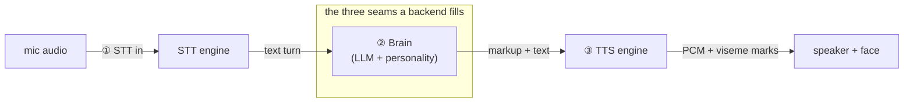

# The AI seam — LLM, STT and TTS interface contract

> **Spec version 1 · robot side stamped to firmware v3.6.4-Zephyr / OTA v24.10.803.**
> The contract for the three places a backend supplies intelligence. It reads on its own; the
> reverse-engineering study is cited for provenance only. Distilled from
> [`remote-chat-protocol.md`](../reverse-engineering/protocol/remote-chat-protocol.md),
> [`perception-pipeline.md`](../reverse-engineering/runtime/perception-pipeline.md), and
> [`unity-mainapp-interface.md`](../reverse-engineering/protocol/unity-mainapp-interface.md).

## The three seams

Moxie's body (face, motors, LEDs, speaker, camera, mic, behavior tree, perception) is fixed hardware and
fixed on-device code. Everything that makes it think, hear and speak enters through three seams, each a
request/response contract carried over [MQTT](mqtt-and-conversation.md). Implement them and any AI can
be Moxie's mind. The Sim and a re-homed robot are interchangeable clients of the same seams
([Sim as a client](sim-as-a-client.md)).


```mermaid
flowchart LR
  mic["mic audio"] -->|"① STT in"| stt["STT engine"]
  stt -->|"text turn"| brain
  subgraph seam["the three seams a backend fills"]
    brain["② Brain<br/>(LLM + personality)"]
  end
  brain -->|"markup + text"| tts["③ TTS engine"]
  tts -->|"PCM + viseme marks"| spk["speaker + face"]
```

Each seam below is: **the contract** (what crosses it), **the wire shape** (exact fields, from the
recovered protos), **what's required vs optional**, and **the plug-in rule** (how to be a drop-in).

---

## ① STT in — audio → text

**Contract.** The backend receives streamed mic audio and must return an incremental transcript that
marks when a turn is finished. The robot already parses two shapes; implement **either**.

**Plug point A — cloud-shaped (`DeepgramResponse`).** Be a drop-in for the shipping cloud STT by
returning a Deepgram-compatible result over the same WebSocket the robot dials. Minimum fields the
robot reads: the transcript `channel.alternatives[].transcript`, `is_final`, and the turn-ender
**`speech_final`** (true = the child stopped talking → the turn closes and goes to the brain).
See [STT response wire format](../reverse-engineering/runtime/perception-pipeline.md#stt-response-wire-format-deepgramresponse).

**Plug point B — on-device bus (`zmqSTT`).** Implement one request/response pair on the perception
bus so any engine (local Whisper/Vosk/Kaldi, or a proxy) drops in behind the audio module:

```proto
message zmqSTTRequest  { VADState vad; bytes audio_content; string uuid; }   // vad: START / SPEECH / END_OF_SPEECH
message zmqSTTResponse { Type type; string speech; float confidence; ...     // type: PARTIAL / FINAL
                         string original_utterance; string original_language;  // translation-aware
                         repeated int32 speaker_id; }
```

**Required:** a `FINAL`/`speech_final` transcript per turn. **Optional but honored:** partials (for
low-latency barge-in), `confidence`, `speaker_id` (diarization), and the translation-aware
`original_*` fields. **Turn-end semantics:** the turn closes on `speech_final=true` (plug A) /
`END_OF_SPEECH` + `FINAL` (plug B); everything before that is provisional.
Full detail: [`perception-pipeline.md`](../reverse-engineering/runtime/perception-pipeline.md).

### This repo's implementation (plug point B)

[`mqtt/moxie_sdk/stt.py`](../../mqtt/moxie_sdk/stt.py): `SttSession` accumulates the VAD-tagged frames
of one utterance and hands them to a `Transcriber` on `END_OF_SPEECH`; the runtime publishes the
`zmqSTTResponse`. The audio is **16-bit mono PCM at 16 kHz** (the perception bus's rate); an engine must
be told that rate, not assume one.

**The robot's dialect, both ways.** Nothing streams until the cloud asks: after the config push the
supervisor publishes a `ProtoSubscribe{timestamp, protos: ["embodied.perception.audio.zmqSTTRequest"]}`
on `/devices/{id}/commands/zmq`, and it answers every utterance with a `zmqSTTResponse{timestamp,
type: FINAL, speech, confidence, uuid}` on the same topic, both as the bus frame
`b"<proto.full_name>:" + protobuf_bytes` and never as JSON (`stt.py` `encode_proto_subscribe` /
`encode_zmq_stt_response`: stdlib writers, checked byte for byte against the committed
`tools/robot-toolkit` pb2 files). An empty transcript is still a `FINAL`; the robot's turn ends on the
type, not the text. So is a failed one: an engine that raises gets the robot a `FINAL` with no speech
and the failure in the recovered `error_code` / `error_message` fields (`error_code=66` plus the
exception text, as OpenMoxie's `zmq_stt_handler.py:70-73` answers), so no turn is left hanging. The ask
is repeated whenever the robot's session may have lost it (a second broker connect line with no
disconnect in between, a wake, a Permit or the fleet-wide toggle letting the robot in, the Listening
picker turning the ears on, a broker outage in whichever order the supervisor and the robot come back,
the roster resume after a supervisor restart; and the settle after a connect line always asks, even
when one of those landed inside its one-second window), and `/status` shows `stt_subscribed_at` per
robot, recorded only for a robot confirmed on this connection (an ask sent while it is away is not its
session) and cleared by a revoke; see
[mqtt-and-conversation.md §3.4](mqtt-and-conversation.md#34-connect-and-disconnect-detection).
Built to the contract and to OpenMoxie's field-proven behaviour (MIT: `site/hive/mqtt/moxie_server.py`
`on_device_connect` sends config then this subscribe, framed by `send_zmq_to_bot`; `zmq_stt_handler.py`
answers with a protobuf `zmqSTTResponse`). **Unverified on our hardware**: no physical Moxie has streamed
audio to this appliance yet. Tests: [`sim/tests/test_stt_wire.py`](../../sim/tests/test_stt_wire.py).

| Engine | `MOXIE_STT` | What it is |
|---|---|---|
| `WhisperTranscriber` | `whisper` (alias `local`) | local faster-whisper; no network, no key |
| `OpenAITranscriber` | `gateway` | OpenAI-shaped `POST /v1/audio/transcriptions` (multipart WAV in, `{"text": …}` out) |

Neither is a fallback ranking; which one fits is a property of the box
([STT setup](../guides/gateway-voice-and-ears.md)). `auto` (the default) picks the gateway when a URL **and**
a key resolve, else local whisper, else none. The gateway engine wraps the PCM in a WAV header at the
rate it was handed (a wrong header pitch-shifts the audio), skips clips under 120 ms, and shares the LLM
path's `call_with_backoff` + `Pacer` for 429/5xx. Every gateway request is bounded by
`MOXIE_STT_TIMEOUT_S` (12 s: the transcript is produced on the broker thread, so the bound sits inside the
broker's keepalive drop — and during an ears outage each retry spends it there, stalling the MQTT loop for
up to 12 s while there is speech) and a timeout is never retried within one utterance — the SDK's own
default was 600 s per request, and the backoff retried it. `FallbackTranscriber` puts the local engine (or
a `NullTranscriber` returning `""`) behind the gateway and latches on the first failure, reporting it once;
after `MOXIE_ENGINE_RETRY_S` (60 s) the next utterance tries the gateway again — one utterance; another
racing it stays on the standby — and an answer clears the latch with one recovery line (meanwhile
`describe()` says `standby since HH:MM … retrying the primary at HH:MM`, in the supervisor's local zone, or
`on the next utterance` once the window has passed). Before that window existed one outage latched the
standby for the rest of the run, and with no local whisper installed that standby hears nothing. Both
numbers are hang bounds, chosen not measured; 0 or less is refused at startup, never read as "no bound"
([production-hardening.md](backlog/production-hardening.md) §4.4, §9).

The console's **Listening** picker chooses the engine at runtime; see [Choosing an
engine](#choosing-an-engine) under ③.

---

## ② Brain — the RemoteChat contract (where the AI lives)

**Contract.** This is the seam. Per turn, the backend receives a `RemoteChatRequest` (the child's
utterance + context) and returns a `RemoteChatResponse` that (a) says a line, (b) optionally drives
navigation, and (c) reports its read of the child. A minimal backend fills only the *speak* half; a
full brain uses all three.

### Which brain, per child

| | |
|---|---|
| **Registry** | [`moxie_sdk/brains.py`](../../mqtt/moxie_sdk/brains.py): a closed list (`llm`, `content`, `webhook`, `echo`). Each name maps to a builder in `config.BRAIN_BUILDERS`; an unknown name is refused, naming the valid ones, never defaulted. |
| **Selection** | `brain` is an ordinary key in the config layers `defaults ⊕ fleet ⊕ per-robot`: `POST /config?scope=fleet` sets the house rule, `POST /config?device_id=` one child's. `cloud_config.SERVER_ONLY_KEYS` keeps it out of the document pushed to the robot. |
| **Swap** | `app_for(device_id)` (`supervisor/moxie_runtime/brain.py`) resolves once at the top of a turn. A change applies from the child's next turn; no restart. |
| **Pin** | An explicit `MOXIE_APP` pins the appliance's brain; a per-child pick cannot override it and a stale pick is refused naming the variable. `MOXIE_APP=any` means "decide per child". The pin reads the raw environment. |

The console's **Brain** card sets these over `GET`/`POST /brain`. Design:
[`backlog/brain-picker.md`](backlog/brain-picker.md).

### Request in — `RemoteChatRequest`
The transcript from seam ① plus conversation context, history, the current module/content id, and a
`RecommendationContext` telling the brain what it *could* steer toward
(`Recommendation{module_id, content_id, entry_line}`, `restricted_modules`, `Urgency` casual/normal/immediate).
Deltas over the base session are in [`remote-chat-protocol.md`](../reverse-engineering/protocol/remote-chat-protocol.md).

#### Presence in the turn context

A `Turn` also carries **`presence`**: what the robot's own vision has reported. The robot runs vision
on-device and emits semantic events only (`eb-found-face`, `eb-lost-target`, QR/ArUco/book) with no
pixels, box or identity ([`vision.md`](vision.md) §1.1). They arrive as the `speech` of an ordinary
`RemoteChatRequest` once the brain subscribes via `EventSubscription.active[]` (see (b) below). The
runtime folds them into a bounded per-robot record and hands the app a snapshot:

| `Turn.presence` | |
|---|---|
| `known` | has the robot's vision ever told us anything? (`False` ≠ "nobody there") |
| `face_present`, `present_s`, `away_s` | someone is/was in front of the robot, and for how long |
| `faces_seen`, `flickers` | arrivals (hysteresis-filtered) and blips |
| `last_qr` / `last_marker` / `last_book` | `$eb_qr_value` / `$eb_dr_value` / `$eb_br_value` |
| `line` | **one short, kid-safe sentence for the system prompt — `""` on most turns** |

`line` is non-empty only when the situation changed ("A child just came back in front of you — nobody
had been visible for about 15 minutes"); a standing "a child is visible" would waste context and teach
the model to narrate the camera. `LLMApp` renders it as *"What you can see right now: …"*; content
modules get the same snapshot as a `presence` render variable. It is derived by a pure helper
(`moxie_sdk/presence.py`), never by a model call. A long-enough absence followed by an arrival can make
Moxie greet unprompted; the rule is in [`vision.md`](vision.md) §7.4.

### Response out — `RemoteChatResponse`
Three parts:

**(a) `RemoteChatOutput` — the spoken turn (required).** Not just text — a fully-scored line:

| Field | Required? | Meaning |
|---|---|---|
| `text` (+ `text_extended`) | **yes** | the line to speak |
| `markup` | recommended | inline behavior markup — face/mood/gesture/audio ([behavior-markup](../reverse-engineering/runtime/behavior-markup.md)); drives the body while it talks |
| `mood`, `mood_intensity` | recommended | emotional performance to render on the face |
| `dialog_act`, `emotion`, `sentiment` (+ scores) | optional | what the line *means* — analytics/steering |
| `signals`, `auto_tags[]`, `perplexity`, `source` | optional | conversation signals + content tags + provenance |

**Where the scored fields come from in this repo.** `markup` is derived, never authored: a reply
without its own goes through [`moxie_sdk/automarkup.py`](../../mqtt/moxie_sdk/automarkup.py) behind the
`supervisor/markup.py` seam, and every id is validated against the frozen catalog in
[`moxie_sdk/vocab.py`](../../mqtt/moxie_sdk/vocab.py); an unknown id suggested by a brain is dropped.
The behavior planner ([`moxie_sdk/performance.py`](../../mqtt/moxie_sdk/performance.py)) stages each line
as a validated `Performance`, and the runtime puts its score on every published turn (reply, streamed
chunks, fillers, greeting, opener, safety redirect). An app's own scoring wins, field by field. Mapping:

| `Performance` | `RemoteChatOutput` |
|---|---|
| `mood`, `mood_intensity` | `mood` (the `ePlaybackMood` name; the int rides the `cmd:playback-mood` mark), `mood_intensity` |
| `dialog_act` | `dialog_act` (one of 22 `RemoteDialog.DialogAct`) |
| `emotion` | `emotion` (one of 7 `RemoteDialog.EmotionState`) |
| `signal` | `signals.single_signal` (one of 9 `RemoteSignals.Signal`; `signals` is a `RemoteSignals` message, not a list) |
| `beats[]` | `markup`, through the single `render()` |

`auto_tags[]`, `sentiment` and `perplexity` are left empty; nothing produces them yet.
`MOXIE_EXPRESSIVE=planner|floor|off` pins which generator answers; a planner failure falls back to the
floor. Design: [`backlog/expressiveness.md`](backlog/expressiveness.md) §2.

**(b) `RemoteChatAction` — drive the robot (optional, this is the "director" power).** `ActionID`:
`launch` / `launch_if_confirmed` (start a module), `exit_module` / `abort_module`, `request_next`,
`execute` (run a device-side `function_id(args)`, result returns next turn via `execute_returns`),
`sleep`, `tangent`. Plus `EventSubscription{clear, active[], passive[]}` — the brain subscribing to
robot input events it wants pushed to it. This is why a revival server can do **more than reply**: it
moves the child between activities and reacts to perception.

**This repo sends it:** the runtime attaches `event_subscription{active:[eb-found-face,
> eb-lost-target, eb-lost-face, eb-qr-event, eb-dr-event, eb-br-event], clear:false}` once per
`(device, module_id)` (events unsubscribe automatically when the module exits), on a plain action-free
reply. `MOXIE_VISION=0` turns it off. Without a subscription the robot discards its own vision events
([`vision.md`](vision.md) §7.1). Every entry carries `output_type: "GLOBAL_RESPONSE"`
(`OutputType` 9, [`ChatResponse.proto`](../reverse-engineering/protocol/recovered-proto/embodied/robotbrain/ChatResponse.proto):16)
and `action` is the `ActionID` **name** — `launch`, `exit_module`, `sleep`, `execute`
([`RemoteChat.proto`](../reverse-engineering/protocol/recovered-proto/embodied/robotbrain/RemoteChat.proto):256-266).
The SDK's `ActionType.ENABLE_QR` has no `ActionID` and goes out as `execute` with
`function_id: "eb_enable_qr"`, `function_args: ["true"]` ([launch cards](backlog/qr-launch-cards.md) §P0-a).

**The launch check.** A `launch` must name a module the robot has. The runtime drops a `LAUNCH` whose
`module_id` is neither in the launch-card catalog (`launch_cards.LAUNCHABLE_MODULE_IDS`, the on-robot
activities) nor one of the remote-chat modules this appliance itself serves (`remote_modules()`), with one
log line and one activity note (*the brain asked to launch 'ROBOTDANCE', which this robot does not have*);
the spoken text and every other action on that reply still go out. The tag rules invite a brain to write
`<launch:NAME>`, so an id a model made up — or a webhook brain declared — never reaches the robot
unchecked; a content pack launching its own module, and a printed card, pass as before.

**(c) `RemoteChatInput` — the brain's read of the child (optional).** `emotion`/`dialog_act`/`sentiment`
+ **`InputSafety{is_unsafe, blocked_by[], intents[], phrase_id}`** — the content-moderation verdict.
This is the moderation hook; a kid-facing backend should populate it.

#### Input safety

`InputSafety` is the contract's only moderation field. Where the check sits in a turn:

```
child speech ──▶ ① assess(role="child") ──block──▶ redirect line + input.safety, brain NEVER called
                          │flag/allow                  (recorded in the parent review queue)
                          ▼
                    ② the brain
                          │
                 per chunk ▼
                 assess(role="moxie") ──block──▶ chunk NOT published; a short safe line
                          │allow                  closes the sequence (SUCCESS + is_completed)
                          ▼                       and the rest of the stream is cancelled
                    published to the robot
```

**Wire shape.** A pre-inference block publishes an ordinary `RemoteChatResponse` whose
`input.safety` is the verdict — `RemoteChatResponse.input` is field 17, a `RemoteChatInput`,
whose field 12 is `InputSafety` ([`RemoteChat.proto`](../reverse-engineering/protocol/recovered-proto/embodied/robotbrain/RemoteChat.proto):180-186,:198,:335):

```json
{"command":"remote_chat","result":0,"event_id":"…",
 "output":{"text":"That one's not for me. If it's important, a grown-up you trust is the best person to ask.","markup":"…"},
 "input":{"safety":{"is_unsafe":true,"blocked_by":["violence"],
                    "intents":["violence_instructions","threat"],"phrase_id":404}},
 "input_intents":["violence_instructions","threat"]}
```

`phrase_id` is the id of the safety line Moxie actually spoke (the proto calls it "a matched
safety-phrase id"); `input_intents` (field 10) mirrors `intents` for a client that reads only
the flat field. A response with no verdict carries no `input` field.
`is_unsafe` is asserted only when something **blocked** — a merely-flagged turn goes through to
the brain and is recorded for a parent, not declared unsafe to the robot. `RemoteChatInput` is
by definition the brain's read of *the child's input*, so a block on **Moxie's own output** has
no field in the contract: it is recorded in the parent queue and logged, never faked onto
`input.safety`.

**This repo's classifier.** A transparent, local rule engine — [`mqtt/moxie_sdk/safety.py`](../../mqtt/moxie_sdk/safety.py)
applying [`safety_rules.json`](../../mqtt/moxie_sdk/safety_rules.json), which *is* the whole
table and is meant to be read by a parent. Eight categories with a **per-side** policy, because
the two sides of a conversation are not symmetric:

| Category | Child says it | Moxie about to say it |
|---|---|---|
| `self_harm` (escalated) | **block** | **block** |
| `violence` — weapon/harm instructions, threats | **block** | **block** |
| `sexual` | **block** | **block** |
| `hate` — slurs, hate speech | **block** | **block** |
| `personal_info` — address / school / password / "don't tell your mom" | flag | **block** |
| `dangerous` — bleach, roofs, matches, alcohol/drugs | flag | **block** |
| `profanity` | flag | **block** |
| `violence_talk` — "kill", "gun", "punched" in ordinary kid talk | flag | flag |

**Block** means the text is never spoken and never reaches a model; **flag** means it is allowed
through and recorded for a parent. Hard blocks are reserved for the clearly harmful; the
ambiguous middle is flagged, because a robot that refuses a child over the word "kill" in
"I killed the boss in Minecraft" teaches a child that talking to it is not worth it. Matching is
word-boundary only, over text normalized for case, accents, full-width forms, leet spellings and
elongation, and each category carries **false-positive guards** whose spans are removed before it
is matched — "shoot a photo", "kill the lights", "my feet are killing me", "a nerf gun", "flag
football", "shiitake mushrooms", "murder mystery", "killing myself laughing". A guard subtracts
its own span only: a second, unexcused use of the same word in the same sentence still counts.

**Limits: a rule engine is a floor, not a filter.** It cannot read context, sarcasm, or a
harmful idea expressed in gentle words. It misses novel phrasings, deliberate obfuscation past its
normalizer (letters split with spaces, invented spellings), and every language its tables are not
written in. Its slur and profanity lists are short by construction. It is one layer *under* the
model's own alignment and the persona's safety instructions — not a replacement for either, and
not a substitute for a parent, which is why every block and flag goes to a review queue instead
of quietly disappearing.

**The plug-in rule.** `Classifier` is a protocol shaped exactly like `Transcriber` (§1) and
`Synthesizer` (§3) — one method, `assess(text, *, role) -> InputSafety`. A local model classifier
drops in with `MoxieRuntime(app, safety=MyClassifier())` and the runtime does not change. It must
be **local** (this runs on a child's device), fast enough per streamed chunk, and total: a
classifier that raises is treated as *allow*, because a broken safety stage must never silence
Moxie. `MOXIE_SAFETY=0` disables the stage; `MOXIE_SAFETY_RULES` points at your own table.

**Parent review queue.** Every block and flag is stored per robot (rolling 200) with a *redacted*
excerpt — matched words masked, and no excerpt at all if masking could not be verified — plus
category, side, timestamp and the spoken `phrase_id`. Served by the runtime (`GET /safety`,
`POST /safety` to acknowledge), forwarded by the console (`/local/robots/{id}/safety`) and shown
as the Safety panel. Under LoggingPolicy `NO_DATA` the journal keeps **counts only** — no rows,
no excerpts — and the block still happens, because blocking is not recording. Parent-facing
walkthrough: [child-safety guide](../guides/child-safety.md).

**Result codes (`ResultCode`, required):** `SUCCESS` (value **0**) on success; `ERROR_OFFLINE` (**4**) triggers the robot's
**local fallback** (see [`offline-and-brain-state.md`](../reverse-engineering/protocol/offline-and-brain-state.md)) —
so a backend that returns `ERROR_OFFLINE` degrades gracefully instead of hanging; also `NOREPLY_*`,
`REPLY_FORCE_ANCHOR` and `REPLY_FORCE_QUIT`. **Streaming:** chunk a long turn with `chunk_num`
(`REPLY_PENDING`, **9**, on every chunk but the last). The ten codes are enumerated in
[`remote-chat-protocol.md`](../reverse-engineering/protocol/remote-chat-protocol.md#the-response-remotechatresponse) and
mirrored by `ResultCode` in [`types.py`](../../mqtt/moxie_sdk/types.py). There is **no** `REPLY` or bare
`QUIT` code. **On the wire `result` is the integer**, never the name: the field is a plain
`uint32 result = 2` ([`RemoteChat.proto`](../reverse-engineering/protocol/recovered-proto/embodied/robotbrain/RemoteChat.proto):320),
and a robot parsing the JSON as protobuf rejects `"SUCCESS"` outright (`invalid literal for int()`),
which it cannot skip the way it skips an unknown field. OpenMoxie sends `result: 0`.

**Bounded calls.** Every request to the brain is bounded by `MOXIE_BRAIN_TIMEOUT_S` (60 s by default: a
hang bound above the filler budget and a slow local model's whole non-streamed completion, chosen not
measured; 0 or less is refused at startup, never read as "no bound"), the backoff starts a retry only
inside that same bound and never after a timeout — so a wedged gateway costs exactly one bound, and a fast
429/5xx retried just inside it at most just under two, since the retry runs its own request bound — and a
streamed turn's open and its single-reply fallback share one bound. So a gateway that accepts connections
and never answers costs one `ERROR_OFFLINE` reply after one bound — not a turn worker for 5 x 600 s, the
SDK's default read timeout times the backoff's attempts, which is what it cost before. Two more things the
turn path promises: a prompt that waited on the worker pool behind a newer one is never sent to the brain
(the robot has already re-prompted; measured on a one-worker pool, three prompts cost two calls — a
re-prompt that finds a free worker, as it does on the eight-worker pool, goes to the brain at once), and a
worker that dies after the brain answered — an app's unreadable `mood_intensity`, a `result_code` the wire
cannot encode — logs it once and still closes the turn with the stock line, as chunk 1 with `is_completed`
when the filler already went out, so the robot never waits on a sequence nobody will finish.

#### The wire a robot can read

*Built to the recovered protocol and OpenMoxie's field-proven shapes; unverified on our hardware.*
No physical Moxie has yet parsed a reply from this appliance. What is held instead:
[`test_wire_conformance.py`](../../sim/tests/test_wire_conformance.py) parses **every reply shape the
runtime publishes** — plain, streamed chunk, `REPLY_PENDING` filler, offline line, each action, the
event subscription, a safety redirect, the not-paired line and the module-list answer — through the
committed `RemoteChat_pb2` with `ignore_unknown_fields=False`, so every field name, value type and
enum name is one the proto knows. Exactly one field is excepted (`wire.NON_PROTO_FIELDS`):
`command`, which OpenMoxie also sends on every response and real robots accept. Nothing else is
added: OpenMoxie sends no other non-proto key, and a robot that consumes `command` and parses the rest
strictly would reject every reply over one. The SDK's `Reply.end_turn` is an input-side hint (the
webhook contract, the console's preview) with no proto field and no reader on the robot side, so it is
not written to the wire; `REPLY_PENDING` already tells a robot more is coming. Until 2026-10-08 none of
our replies passed even a lenient parse (the `result` name), and a lenient parse of
`output_type: "GLOBAL"` / `action: "exit"` silently produced `CATCH_ALL` / `UNSET_ACTION_ID`.

**The envelope.** Every reply carries `response_actions` — the actions, or one action-less
`{"output_type": "GLOBAL_RESPONSE"}` entry — and the legacy singular `response_action` mirrors
`response_actions[0]`, exactly as OpenMoxie's field-proven `volley.py` (`create_response`,
`add_response_action`) sends on every response; a robot reading `output_type` therefore sees
`GLOBAL_RESPONSE` on a plain reply rather than the default `CATCH_ALL`. `module_id` / `content_id`
ride only when set (OpenMoxie omits them; proto3 JSON reads an absent field and a `null` alike). A
plain reply from this appliance is:

```json
{"command":"remote_chat","result":0,"backend":"router","event_id":"…",
 "output":{"text":"Hi Sam!","markup":"…"},
 "response_action":{"output_type":"GLOBAL_RESPONSE"},
 "response_actions":[{"output_type":"GLOBAL_RESPONSE"}]}
```

Built to OpenMoxie's shape, not observed on a robot of ours; the two Sim clients read the action-less
entry as what it is (no action, nothing unknown).

**The module list.** The robot asks which modules the cloud serves with `backend: "data"` and
`query: {"query": "modules"}` — a `RemoteDataQuery` (RemoteChat.proto:41-51, field 23 at :79;
OpenMoxie reads `rcr['query']['query']`, `moxie_server.py:170`). The runtime answers before any
brain is consulted, in `query_data` (field 21, a `RemoteDataBlock`, :296-300):

```json
{"command":"remote_chat","result":0,"backend":"data","event_id":"…","output":{"text":"","markup":""},
 "response_action":{"output_type":"GLOBAL_RESPONSE"},
 "response_actions":[{"output_type":"GLOBAL_RESPONSE"}],
 "query_data":{"version":"mrs-…",
               "modules":[{"info":{"id":"FREE_CHAT"},"rules":"RANDOM","source":"REMOTE_CHAT",
                           "content_infos":[{"id":"default"}]},
                          {"info":{"id":"MEMORY_CHAT"},"rules":"RANDOM","source":"REMOTE_CHAT",
                           "content_infos":[{"id":"default"},{"id":"aboutme"}]}]}}
```

Each entry is a `ModuleDetail` ([`ContentModule.proto`](../reverse-engineering/protocol/recovered-proto/embodied/robotbrain/ContentModule.proto):24-73):
the conversations of every loaded content module plus the day plan's default chat
(`FREE_CHAT/default`), each `source: REMOTE_CHAT` — the schedule already hands that module to the
cloud, and the robot can only run it once told it is remote. The enum's number is read as the same
query (`{"query": {"query": 2}}`, `RemoteDataQuery.Query.modules = 2`, the other spelling protobuf
JSON allows), and so is the plain `query: "modules"` string — only older test doubles send that; the
browser Sim sends no module query. Any other `backend: "data"` request (`contexts`, or no query at
all) is never a turn: no brain call and no reply, one logged line — as OpenMoxie, which answers only
the module query and `router` turns (`moxie_server.py:170-179`); nothing in the proto makes a reply
mandatory. A pending robot gets an empty list; `version` is a digest of the ids.

**Two recorded differences from OpenMoxie's module answer.** *The envelope:* OpenMoxie answers with
the bare `{command, result, event_id, query_data}` (`moxie_server.py:176`); ours is built by
`build_chat_response` like every other reply, so it also carries `backend`, an empty `output` and
the envelope above. A deliberate difference: the envelope rides every reply, this one included.
Every added key is a `RemoteChatResponse` field, and the strict parse in `test_wire_conformance.py`
accepts this answer; whether the 803 firmware's module-list reader minds the extra fields is
unverified on a robot. *The content ids:* OpenMoxie nests each content id as
`content_infos[].info.id` (`moxie_remote_chat.py:75`), but `ModuleDetail.content_infos` is
`repeated ContentDetail` (`ContentModule.proto:66`) and `ContentDetail.id` is field 1 (:10).
Measured through the pb2, a strict parse rejects the nested form and a lenient one yields an
**empty** content id, so this repo emits the proto's shape. Whether the 803 firmware reads the
nested form some other way is unknown; the test pins what the proto says.

**Taxonomies** (closed sets the brain scores into): `DialogAct`×22, `EmotionState`×7, `Signal`×9,
`Urgency`×3 — enumerated in [`remote-chat-protocol.md`](../reverse-engineering/protocol/remote-chat-protocol.md#taxonomies).

> **The minimal viable brain:** answer every `RemoteChatRequest` with a `RemoteChatResponse` whose
> `ResultCode=SUCCESS` and `RemoteChatOutput.text` set. Add `markup`+`mood` to make the face act; add
> `RemoteChatAction` to run activities; add `InputSafety` to moderate. Everything past `text` is
> progressive enhancement.

---

## ③ TTS out — markup → audio + viseme marks

**Contract.** The brain's line (markup string) goes to a TTS engine; back comes rendered PCM plus a
timeline of marks the face uses to lip-sync and fire gestures. Any TTS drops in — the on-device
CereVoice is just the local fallback path.

### Request in — `CloudTTSRequest`
```proto
message CloudTTSRequest { string markup; string event_id; int32 chunk_num;
                          uint64 timestamp; string user_id; string module_name; }
```
`markup` is the spoken line with inline behavior markup (SSML-like; see
[behavior-markup](../reverse-engineering/runtime/behavior-markup.md)).

### Response out — `CloudTTSResponse`
```proto
message AudioBuffer      { bytes buffer; int32 channels; int32 sample_rate; }   // rendered PCM
message TTSMark          { uint32 time; uint32 start; uint32 end; string type; string value; }
message CloudTTSResponse { RequestSourceType request_source; AudioBuffer audio;
                           repeated TTSMark marks; string event_id; int32 chunk_num;
                           uint64 total_time; uint64 synthesis_time; }
```

### Backends in this repo

Three, in a fixed precedence (`mqtt/config.py::build_synthesizer`): **voice server → Piper → tone**.

| Backend | When | Notes |
|---|---|---|
| `OpenAIVoiceSynthesizer` | `MOXIE_VOICE_BASE_URL` set | Any OpenAI-shaped `/audio/speech` (e.g. a LiteLLM gateway serving Piper voices; live test: `sim/tests/test_live_gateway_tts.py`). A `wav` reply is unwrapped here, so `AudioBuffer.sample_rate` is **the file's own header**, not a constant; `pcm` uses `MOXIE_VOICE_SAMPLE_RATE`. Setup + the gateway's quirks: [gateway-voice-and-ears.md](../guides/gateway-voice-and-ears.md) |
| `PiperSynthesizer` | `MOXIE_PIPER_MODEL` set + piper installed | Offline, no key, ~3-5× faster than the gateway for the same sentence |
| `ToneSynthesizer` | `MOXIE_TTS=tone` | A shaped beep. **Not speech** — it exists so the SIM's audio path works with no model, network or extra dep |

The gateway voice is a network call to someone else's box, so it is wrapped in a
`FallbackSynthesizer` whose standby is exactly the rung it displaced (Piper if configured, else the
tone). A 400, an outage past the SDK's backoff, or a body that is JSON rather than audio is surfaced
**once** and then latched: the turn *downgrades* to a working voice instead of handing a child
silence. Each request is bounded by `MOXIE_TTS_TIMEOUT_S` (15 s; the SDK's own default was 600 s) and
a timeout is not retried; the latch holds for `MOXIE_ENGINE_RETRY_S` (60 s), after which the next line
tries the gateway again (one line; a filler racing it on another thread stays on the standby) and an
answer clears it with one recovery line. `synth.voice_name` says which one is talking, and `describe()`
since when and when the gateway is tried next (`on the next line` once the window has passed).

### Choosing an engine

The precedence above is what the appliance boots with. After that, a parent picks **Speech** and
**Listening** engines in the console, from what this box can actually use:

| Where an entry comes from | How availability is known | Examples |
|---|---|---|
| Gateway | one cached `GET /v1/models`, classified by [`moxie_sdk/audio_models.py`](../../mqtt/moxie_sdk/audio_models.py) | `gateway:piper-amy`, `gateway:stt-whisper` |
| Local | `PiperSynthesizer.available()` + `.onnx` voices under `sim/tts/voices/` (or `MOXIE_PIPER_MODEL`) · `WhisperTranscriber.available()` | `piper:en_US-amy-medium`, `whisper:base.en` |
| Built-in | always | `tone` (speech) · `off` (listening) |

Rules, each pinned by a test in
[`sim/tests/test_voice_settings.py`](../../sim/tests/test_voice_settings.py) /
[`test_voice_runtime.py`](../../sim/tests/test_voice_runtime.py):

1. **`piper-amy` when possible.** The default speech is `piper-amy` whenever the gateway lists it,
   else the first gateway voice, else a local Piper Amy, else the tone; the ears default to
   `stt-whisper` the same way. Defaults are computed **at read time** from that moment's
   availability, so a model the gateway starts serving tomorrow becomes the default with no
   migration.
2. **Local engines are first class, from both directions.** An explicit local pick is honoured even
   with `MOXIE_VOICE_BASE_URL` fully configured; and an explicit `MOXIE_TTS=piper` /
   `MOXIE_STT=whisper` **pins the engine**, so no pick can move that deployment off it. The pin
   names the engine, never the voice — `MOXIE_TTS=piper` still lets a parent choose *which*
   installed Piper voice speaks, `MOXIE_STT=gateway` still lets them choose the STT model. A pinned
   side's dropdown offers only that engine's entries and carries `pin_notes` saying which variable
   did it, so the card is short *and* explained rather than short and mysterious; a stale page that
   posts a cross-engine pick gets a 400 with the variable named. `auto` and unset pin nothing — and
   neither does `MOXIE_TTS=tone`, which is a permission (the last rung under the gateway and Piper),
   not a selection, and is what both compose files default to.
3. **Discovery never blocks a turn.** `voice_settings.GatewayCatalog` caches one listing for
   `MOXIE_VOICE_DISCOVERY_TTL_S` (default 300 s) and refreshes it on a background thread; the first
   ask after boot answers with the local entries and `discovering: true`. The one bounded exception
   is a console **write**: `POST /voice` waits up to `VOICE_SETTLE_S` (10 s) for the *first* listing,
   so a freshly booted supervisor does not refuse a valid `gateway:piper-amy`. A write is never on a
   turn's path; a read never waits.
4. **An outage never blanks the card.** A failed listing keeps the last good one and reports
   `gateway_error: "<ExceptionClass>"`; a stored pick the gateway can no longer confirm stays in
   force rather than silently reverting.
5. **A swap costs no restart, and no lock in the turn loop.** `voice_update` rebuilds both engines
   through the same `config.build_synthesizer` / `build_transcriber` `run.py` uses (they grew an
   `override=` argument) and rebinds them; the **next** turn uses the new engine and a turn already
   in flight finishes on the old one. A build that fails keeps the engine already speaking.

`run.py` reads `fleet/voice.json` before it builds either engine, so a choice survives a restart, and
logs which engine was installed and why — `speech: piper-amy (gateway, chosen)` /
`speech: tone (built-in, default — gateway unreachable)`, and never as `chosen` when the
environment's pin is what actually decided. `MOXIE_TTS=off` and `MOXIE_STT=off` still win over a
pick: a deployment that declared itself voiceless is not talked back into speaking by a dropdown. Wire: `GET /voice`, `POST /voice`, `POST /voice/test` on the supervisor's status server.

**Required:** `audio` (PCM: raw `buffer` + `channels` + `sample_rate`) and `event_id` to correlate.
**`marks[]` (recommended):** timed events lifted from the markup — the face reads them for **viseme**
lip-sync (mouth shapes) and to fire gestures at the right instant. Without marks the audio still
plays; the mouth just won't sync. **Streaming:** emit chunks with `chunk_num`; pair with
`CloudTTSSupplement` for per-chunk timing metrics if desired.
Detail: [audio-out section](../reverse-engineering/protocol/unity-mainapp-interface.md#audio-out-tts-sfx-playback-control).

---

## Conformance checklist

A backend is a valid Moxie mind when it satisfies **one plug point per seam**:

- [ ] **① STT** — returns a per-turn final transcript via `DeepgramResponse.speech_final` **or** `zmqSTT` `FINAL`.
- [ ] **② Brain** — answers every `RemoteChatRequest` with `RemoteChatResponse{ResultCode, RemoteChatOutput.text}`; returns `ERROR_OFFLINE` rather than hanging when it can't.
- [ ] **③ TTS** — returns `CloudTTSResponse{audio, event_id}` for each `CloudTTSRequest`.

Recommended for a *good* experience (not required to function): `markup`+`mood` on the brain output,
`marks[]` on TTS (lip-sync) and partial STT (barge-in). A kid-facing backend should not ship without
something in the `InputSafety` slot ([Input safety](#input-safety)).

## Where each seam is implemented in this repo

| Seam | Lives in | Notes |
|---|---|---|
| ① STT in | `mqtt/moxie_sdk/stt.py` | `zmqSTT` plug point B; local whisper or gateway. The Sim's local service is `sim/stt/` |
| ② Brain | `mqtt/moxie_sdk/` (`MoxieApp`, `LLMApp`, `brains.py`) | any OpenAI-compatible LLM, configured by env; emits markup |
| ②b Input safety | `mqtt/moxie_sdk/safety.py` + `mqtt/supervisor/moxie_runtime/safety.py` | local rule engine enforced before inference and per streamed chunk; parent review queue |
| ③ TTS out | `mqtt/moxie_sdk/tts.py` | gateway voice → Piper → tone, with the displaced rung as standby; the Sim's local service is `sim/tts/` |

Keys/endpoints live only in a git-ignored `.env`; the repo ships placeholders. The
[architecture overview](overview.md) shows how these three sit inside the one-command stack; the
[MQTT/conversation spec](mqtt-and-conversation.md) carries the transport (topics, framing, session).

---
[Docs index](../README.md) · [MQTT & conversation](mqtt-and-conversation.md) · [Architecture overview](overview.md)
