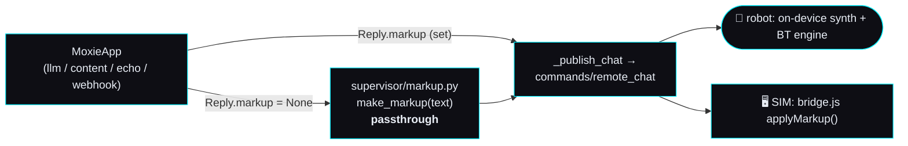

# 🎭 Expressiveness — the markup floor (ADOPT #3) and the behavior planner (BEYOND #1)

> **Backlog brief v1 · 2026-09-02.** Two build documents in one file, because they are **one seam at two
> depths**: §1 is a slice a build agent can execute as-is (a deterministic markup floor), §2 is the
> contract-level spec for the 10× version that replaces it *behind the same seam*. Ranked as ADOPT #3 and
> BEYOND #1 in the [OpenMoxie feature audit](../openmoxie-feature-audit.md) §4.1/§4.2.
>
> **Clean-room.** Every vocabulary, id and grammar below is taken from **our own** reverse-engineering
> pages (chiefly [`behavior-markup.md`](../../reverse-engineering/runtime/behavior-markup.md),
> [`behavior-tree-engine.md`](../../reverse-engineering/runtime/behavior-tree-engine.md),
> [`behavior-nodes.md`](../../reverse-engineering/runtime/behavior-nodes.md),
> [`remote-chat-protocol.md`](../../reverse-engineering/protocol/remote-chat-protocol.md)) — never from the
> vendor app. **OpenMoxie** (MIT, © Justin Beghtol) is read as prior art and cited by path: we describe what
> its engine *does* and port the **behaviors**, we do not copy its code.

## Why this is the next slice

Moxie's voice is synthesized **on the robot**, from markup. There is no TTS to improve
([`mqtt-and-conversation.md`](../mqtt-and-conversation.md) §5.3) — so *"better speech" is literally
"better markup"*, and markup is the only lever a cloud has over how alive the robot feels. The audit's
honest ledger puts it second on the list of places OpenMoxie is genuinely ahead of us: *"2,157 lines of
markup engine vs our passthrough plus one mood and one gesture."*

---

## 0. The seam as it stands today



| Where | File | What it does today |
|---|---|---|
| The seam | [`mqtt/supervisor/markup.py`](../../../mqtt/supervisor/markup.py) | `make_markup(text) -> text`. **Eight lines, a passthrough.** Its own docstring says the expressive engine plugs in here. |
| Called from | [`mqtt/supervisor/moxie_runtime.py`](../../../mqtt/supervisor/moxie_runtime.py) | two sites: the single-reply path (`markup = reply.markup if reply.markup is not None else make_markup(reply.text)`) and, since PR #17, the **per-chunk** streaming path in `_publish_stream_chunk`. So the seam runs **once per spoken chunk**, on the hot path between the first token and the first audio. |
| The one app that bypasses it | [`mqtt/moxie_sdk/apps/llm_app.py`](../../../mqtt/moxie_sdk/apps/llm_app.py) | `build_markup(text, mood, gesture)` emits exactly **two marks**: one `cmd:playback-mood` and one `cmd:behaviour-tree` carrying a `Gesture_*`, both chosen by the *model* from a 5-mood / 10-gesture menu. |
| Mid-stream | same file, `stream_style(text)` | while a reply is still streaming the model's `"mood"`/`"gesture"` have not arrived yet, so an in-flight chunk gets a punctuation-only guess (`?` → question, `!` → positive) and the **closing** chunk uses what the model actually chose. |
| Also emits marks | [`mqtt/moxie_sdk/filler.py`](../../../mqtt/moxie_sdk/filler.py) | the "let me think" lines ship hand-written mood + thinking-tree markup — the only place in the tree where markup is *authored* rather than generated. |
| Renders it | [`sim/web/bridge.js`](../../../sim/web/bridge.js) | `applyMarkup()` parses `cmd:playback-mood` → one of 11 faces, `Gesture_*` → arm poses, `Bht_*` → whole-body animations, `cmd:icons-v2` → screen badges. **Our only renderer we can assert against.** |
| Strips it | [`mqtt/moxie_sdk/tts.py`](../../../mqtt/moxie_sdk/tts.py) | `strip_markup()` drops `<mark/>`, all tags and emoji before the SIM's external TTS speaks the words. |

**What `build_markup` costs: nothing.** It is pure local string work — no model call, no I/O
([`mqtt-and-conversation.md`](../mqtt-and-conversation.md) §4.5, *"Markup costs no extra model call"*).
That is the budget the floor must also live inside: the seam is called per chunk, per turn, and any
latency it adds is latency a child waits through.

### The two gaps this file closes

1. **Every app except `LLMApp` speaks flat.** The content app, the echo app and the webhook app all leave
   `Reply.markup = None`, so they go through the passthrough and the robot reads them like a speaker.
2. **The scored output fields are never filled.** `Reply` carries `mood` and `dialog_act`
   ([`moxie_sdk/types.py`](../../../mqtt/moxie_sdk/types.py)), `build_chat_response` puts them on
   `RemoteChatOutput`, and the runtime passes them — but **no app ever sets them**, and `ReplyChunk` does
   not have the fields at all, so a *streamed* answer cannot carry them even in principle. The wire that
   [`ai-seam.md`](../ai-seam.md) §② specifies is plumbed and empty.

---

## 1. ADOPT #3 — the markup floor · 🟢 **SHIPPED 2026-09-02**

> **Built.** [`mqtt/moxie_sdk/automarkup.py`](../../../mqtt/moxie_sdk/automarkup.py) (the pure
> `annotate`) + [`mqtt/moxie_sdk/vocab.py`](../../../mqtt/moxie_sdk/vocab.py) (the frozen,
> doc-cited catalogs and the one place a mark is minted), behind the unchanged
> [`mqtt/supervisor/markup.py`](../../../mqtt/supervisor/markup.py) seam. Wired at both runtime
> call sites, in [`llm_app.py`](../../../mqtt/moxie_sdk/apps/llm_app.py) (`stream_style`
> deleted; the model's choice is now a *hint* into the same floor) and on the content app's
> authored-markup path. Pinned by
> [`sim/tests/test_automarkup.py`](../../../sim/tests/test_automarkup.py) (277 hermetic cases,
> 8 byte-exact goldens in [`sim/tests/goldens/annotate.json`](../../../sim/tests/goldens/annotate.json))
> and rendered by [`sim/test_automarkup_render.mjs`](../../../sim/test_automarkup_render.mjs)
> through the real browser bridge. Written up as built in
> [`mqtt-and-conversation.md` §4.6](../mqtt-and-conversation.md#46-the-markup-floor-built-v1-2026-09-02).
>
> **Four deliberate departures from the spec below, each for a stated reason.**
> 1. The module is `automarkup.py`, not `annotate.py` — the function is `annotate`.
> 2. **§1.6 G4** keeps the space between the two sentences that the shorthand elides: invariant
>    S2 (the spoken words never change) outranks the shorthand, and without it `strip_markup`
>    would fuse `amazing!You`. **§1.6 G8** places `Gesture_Point` *before* the line rather than
>    after, consistent with G1 and G6, which both pin a leading gesture mark; there is no rule
>    that distinguishes them. Both are recorded in the goldens fixture.
> 3. **§1.5 S3 is implemented as the strict form**: the mood mark is emitted on
>    `chunk_index == 0` and on no later chunk, ever — not "again if the scored mood changed".
>    A pure function with the signature this brief fixes cannot know the previously-emitted
>    mood, and §1.7 T5 demands *exactly one* mood mark per answer. The cost is real and is
>    recorded in Known gaps: on a streamed turn the model's own mood shapes the closing chunk's
>    gesture and never reaches the wire. Carrying it needs `ReplyChunk` to grow scored fields —
>    §2.3 C2/C4, the planner's change.
> 4. **`filler.py` is unchanged and byte-identical**, as §1.2 requires. Its markup is
>    hand-authored and `test_brain_latency.py` pins the spoken line as one contiguous run,
>    which a floor pass would thread a `<break>` through. It does now mint its marks through
>    `vocab`, so it is validated by the same catalog — as are the safety redirects.
>
> Two more rules were added that the brief did not name, both anti-twitch: a talking gesture is
> never placed inside the last two words of a sentence (which makes the effective floor an
> 8-word sentence, and is what keeps G2 gesture-free by rule rather than by luck), and a
> sentence that plays a whole-body tree gets no arm gesture stacked on it (which is what makes
> G3 come out right).

### 1.1 Goal

A **pure, deterministic** function that turns one spoken line into behavior markup drawn only from the
vocabularies we have actually recovered — good enough that a child watching the SIM sees a robot that
*performs* its line, cheap enough to run per streamed chunk, and boring enough that a golden test can pin
it byte-for-byte.

> **Decision: reimplement the behaviors, do not vendor the engine.** The audit's ADOPT #3 line says
> *"vendor `automarkup`"*. Building the floor ourselves is the better call, for four reasons: (a) their
> engine pulls a third-party dependency (`unidecode`) and a **170 KB** ML data table
> (`automarkup/ml/data/_mlprocesseddata.txt`) into an appliance we want small and auditable; (b) it is
> non-deterministic by design (`random.randint` gesture spacing, an 80 % gesture probability), which
> forecloses golden tests and per-chunk stability; (c) its gesture ids are **its own** (`AUTO_GESTURE_ME`,
> `Gesture_We`, `Gesture_Small`, `Gesture_Discard`) and several are *not* in our recovered catalog, so
> vendoring would ship ids we cannot justify from our own evidence; (d) our floor must sit behind the same
> seam the planner (§2) will replace, with the same signature. Vendoring stays available as a fallback if
> the floor under-delivers — it is MIT and we would ship its notice.

### 1.2 The seam it plugs into

Keep the existing entry point. `supervisor/markup.py` becomes a thin adapter over an SDK-level pure
module, so apps, tests and the SIM harness all share one implementation:

```python
# mqtt/moxie_sdk/annotate.py   (new — pure, stdlib only, no runtime imports)
def annotate(text: str, *, mood_hint: str | None = None,
             gesture_hint: str | None = None,
             turn_key: str = "", chunk_index: int = 0,
             icons: bool = False, sfx: bool = False) -> str: ...
```

- `mood_hint` / `gesture_hint` — what the *model* chose, when the app knows (LLMApp's expressive JSON).
  A hint wins over the rules; an **unknown** hint is dropped, never passed through.
- `turn_key` + `chunk_index` — chunk bookkeeping for stability (§1.5, rule S3). `turn_key` is the
  `event_id`; the caller passes it, `annotate` stays pure by taking the previously-emitted mood as part of
  the key rather than reading shared state — see the signature note in §1.5.
- `icons` / `sfx` — **off by default**; see the honest limits in §1.10.

Call sites change minimally:

| Site | Change |
|---|---|
| `supervisor/markup.py::make_markup(text, **kw)` | `return annotate(text, **kw)` — signature stays compatible so nothing else breaks. |
| `moxie_runtime.py` (2 sites) | pass `turn_key=event_id, chunk_index=n` so a streamed answer is stable across chunks. |
| `llm_app.py::build_markup` | becomes `annotate(text, mood_hint=mood, gesture_hint=gesture)` — the model's choice becomes a *hint into the same renderer* instead of a second, divergent generator. `stream_style()` collapses into the rules and is deleted. |
| `filler.py` | unchanged (hand-authored markup is already correct, and pinning it protects a shipped behavior). |

### 1.3 The vocabularies we may emit

**Closed sets, from our own pages.** Nothing outside this table may ever reach the wire.

| Slot | Values | Source |
|---|---|---|
| **Mark grammar** | `<mark name="cmd:VERB,data:{…}"/>` where the `data` object is JSON with `+` standing in for `"` | [`behavior-markup.md`](../../reverse-engineering/runtime/behavior-markup.md) §Shape, lines 16–27 |
| **Verbs** | 24 recovered; the floor uses exactly **three**: `playback-mood`, `behaviour-tree`, and (gated) `icons-v2` / `playaudio` | same, §"The command verbs (24)", lines 50–76 |
| **Mood** | `ePlaybackMood` **0–10**: `0 Neutral · 1 Happy · 2 Sad · 3 Angry · 4 Shy · 5 Surprised · 6 Afraid · 7 Concerned · 8 Confused · 9 Curious · 10 Embarrassed`, recovered by name **and value** from `Assembly-CSharp`; `intensity` 0–2 (`maxIntensity=2`) | same, §"Data schemas", lines 107–133 |
| **Gestures** | `Gesture_None · Gesture_Talk · Gesture_Think · Gesture_Think_Subtle · Gesture_Question · Gesture_Point · Gesture_Point_Right · Gesture_Self · Gesture_Higher · Gesture_Lower · Gesture_Large · Gesture_Celebrate` (12, hardcoded in the app) | same, §"Gestures — `Gesture_*`", lines 191–198 |
| **Behavior trees** | the 45 named `Bht_*` — 11 `Bht_Eyeseme_*` (one per mood), the idle/attention family, `Bht_Gesture_Greet`, `Bht_Talking_Poses`, `Bht_Talking_With_Gestures`, `Bht_Active_Thinking`, `Bht_Spin_360`, `Bht_Sign_off`, `Bht_Sleep_Anim`, … | [`behavior-tree-engine.md`](../../reverse-engineering/runtime/behavior-tree-engine.md) §"The 45 named behavior trees", lines 103–115 |
| **Vocal gestures (spurts)** | **52** ids in six families — laughs (`laugh`, `giggle`, …), thinking (`hmm thinking`, `umm`, `err`), breaths (`sigh happy`, `gasp`, `yawn`), affirmations (`oh positive`, `yay`), displeasure (`ugh`, `doh`), bodily (`tut`, `sniff`) — via `<spurt spurt_id="…"/>` or `cmd:vocal-gesture` | [`behavior-markup.md`](../../reverse-engineering/runtime/behavior-markup.md) §"Vocal gestures / spurts", lines 200–216 |
| **Voice (SSML)** | `<usel variant genre>` with `genre ∈ {none, question, motivational, intimate, excited}` and `variant` 0–8; `<break time>`; `<prosody pitch rate volume>`; `<emphasis level="strong">`; `<phoneme ph>`; `<say-as interpret-as>` (10 values) | same, §"Speech markup (SSML / CereVoice)", lines 35–43 |
| **Screen icons** | `cmd:icons-v2` — `command` (0 = show, 2 = clear), `index`, `transition`, `volume`, **four** `icon0..icon3 {iconType, value, background}` slots, `highlight`. Confirmed `value`s: **`School`, `Birthday`, `Medical`, `Learning_About_Family_03_Heart_Family`** | same, §"Data schemas", lines 139–159 |
| **SFX** | `cmd:playaudio` — `SoundToPlay`, `LoopSound`, `channel` (**`FX`=0 · `BackGround`=1 · `Stinger`=2 · `VocalGesture`=3**), `Volume`, `FadeInTime`/`FadeOutTime`; `cmd:stopaudio` with `scope` (`All`=0 / `Channel`=1). Confirmed asset ids: **only two** — `sfx_twinkly_upbeat_stinger_1`, `moxie_mu_cast_zarcona_theme_loop_v2` | same, lines 97–105 |
| **Gaze** | **there is no gaze verb.** Gaze is on-device (weighted interest points → `AttentionTarget` → IK look-at). A cloud reaches it only *indirectly*, by choosing a look-bearing tree (`Bht_Search`, `Bht_Idle_Curious`, `Bht_Idle_Listening`, `Bht_Idle_Near_Focused`) | [`gaze-and-attention.md`](../../reverse-engineering/runtime/gaze-and-attention.md); node side in [`behavior-nodes.md`](../../reverse-engineering/runtime/behavior-nodes.md) §"Gaze → where Moxie looks" |
| **Dialog acts** | `RemoteDialog.DialogAct` (22): `abandon, apology, apology_response, appreciation, backchannelling, closing, complaint, opinion, statement_non_opinion, factual_question, opinion_question, hold, opening, yes_no_question, pos_answer, neg_answer, other_answers, command, comment, thanking, other, timeout` | [`remote-chat-protocol.md`](../../reverse-engineering/protocol/remote-chat-protocol.md) §Taxonomies, lines 119–122 |
| **Signals** | `RemoteSignals.Signal` (9): `no_signal, closing, apology, interrupted_speech, complaint_clarification, confirmation_agreement, interest, non_interest, rejection_disagreement` | [`behavior-markup.md`](../../reverse-engineering/runtime/behavior-markup.md) lines 183–189 |

> **Independent corroboration.** OpenMoxie's `automarkup/markup_types/markup_mood.py` carries the *same*
> mood ids 0–10 in the same order as our `ePlaybackMood` — recovered by us from `Assembly-CSharp`, shipped
> by them from Embodied's own engine. Two independent sources agreeing is the strongest evidence we have
> for any enum in this project.

### 1.4 What OpenMoxie's engine does — and which behaviors to port

`site/hive/automarkup/` (2,157 LOC across 21 files; entry `automarkup.process(text, rules,
mood_and_intensity)`, invoked from `site/hive/mqtt/moxie_remote_chat.py::RemoteChat.make_markup` on every
AI line that lacks markup). Read, described, **not copied**:

| Their file | Behavior | Port? |
|---|---|---|
| `markup_types/markup_mood.py` | maps ~30 emotion labels (`joy`, `gratitude`, `annoyance`, `curiosity`, …) onto the 11 mood ids, each with a small **intensity step ladder** (`0 / 0.333 / 0.666`) | **Yes** — mood per clause + a bounded intensity, as ints 0–2 (our recovered `maxIntensity`) |
| `markup_types/markup_behavior.py` | gesture selection: change gesture **every sentence**; also every `GESTURE_CHANGE_WORDS_MIN..MAX` = **3–7** words; word classes drive the choice — self words (`i, me, us, my, mine, myself`), you words, question words (`please, who, what, where, how, curious, wondering, question`), spatial/high words (`up, above, higher, wow, great, amazing, awesome, yay, fun`); **end every line with a "none" gesture**; apply at 80 % probability so it is not mechanical | **Yes, the rules** — but deterministic (§1.5 D1) and remapped onto *our* 12 ids. Their `AUTO_GESTURE_ME`, `AUTO_GESTURE_YOU`, `Gesture_We`, `Gesture_Small`, `Gesture_Discard` are **not in our catalog** and must not be emitted |
| `markup_types/markup_pauses.py` | a `<break>` after a sentence-final period — **never on the last word**, "so as not to add delays in volleys/turn-taking"; acronyms (`G.R.L.`) skipped | **Yes, verbatim as a rule.** The trailing-break exclusion is load-bearing: a break after the final word delays the robot's turn hand-back |
| `markup_types/markup_voice.py` | `<usel genre>` per phrase — `question` on `?`, `excited`/`motivational` on `!`; `variant` clamped (`CLAMP_MAX_USEL_VARIANT = 3`); a synth-rate `<prosody>` for long text | **Yes** — genre only; we pin `variant="0"` (a variant is a recorded take, and we have no evidence about which take suits which line) |
| `markup.py::check_span_conflicts` + `remove_worst_offending_span` | detects badly-nested tag spans (`<a><b></a></b>`) and prunes the worst offender until the document is well-formed | **The invariant, not the algorithm.** Our floor emits marks only at token boundaries and wraps at most one span level, so conflicts are impossible by construction — and a test asserts the output parses |
| `markup_core/markup_xmlassembly.py` | final XML assembly | Ours is a single renderer function (§2.2) — one place marks are minted, so validation is total |
| `ml/mlrules.py` + `ml/data/_mlprocesseddata.txt` (170 KB) | a learned rule table over words/phrases → tags, plus `text_replacement.json` | **No** at P0. This is the part that makes their engine feel hand-tuned, and the part we cannot audit. It is the P2 conversation (§2.7) |
| — | rate limiting *in general*: one gesture per 3–7 words, one gesture change per sentence, a probability gate | **Yes, and stricter.** Twitchiness is the failure mode a child notices |

### 1.5 Design — a pure function

**D1 · Deterministic, no `random`, no clock, no network, no model call.** Where their engine rolls dice, we
take a stable digest: `blake2b(f"{turn_key}\x00{sentence_index}\x00{sentence_text}")`. Never Python's
`hash()` — it is salted per process and would break reproducibility across workers.

**D2 · Pipeline (per line).**

1. **Segment** into sentences with the existing pure segmenter
   ([`moxie_sdk/segment.py`](../../../mqtt/moxie_sdk/segment.py)) so the floor and the streamer agree on
   where a sentence ends; sub-split each sentence on `,` `;` `—` into clauses.
2. **Mood** — score the line: an explicit `mood_hint` wins; else the first matching cue class
   (apology/sorrow → `2 Sad`; surprise/`Oh!` → `5 Surprised`; mistake/`Oops` → `4 Shy`; thinking/uncertainty
   → `9 Curious`; puzzlement → `8 Confused`; praise/celebration/`!` → `1 Happy`); else `0 Neutral`.
   Intensity = `min(2, exclamation_count + emphatic_word_count)`.
3. **Voice** — wrap a `?` sentence in `<usel variant="0" genre="question">` and a `!` sentence in
   `<usel variant="0" genre="excited">`. Leave neutral sentences unwrapped (`genre="none"` is noise).
4. **Gestures** — one gesture at the first *carrying* word of a clause (word-class table, §1.4), then a
   `Gesture_Talk` every **5** words (fixed, not 3–7 random), and always a terminal `Gesture_None`.
5. **Trees** — a whole-body `Bht_*` only for a small closed set of line types: thinking →
   `Bht_Active_Thinking`, greeting → `Bht_Gesture_Greet`, sign-off → `Bht_Sign_off`. At most one per line.
6. **Pauses** — `<break time="0.35s"/>` at an internal sentence boundary and after a leading interjection
   comma ("Oh, " / "Hmm, "). **Never after the final word.**
7. **Icons / SFX** — gated off (§1.10).
8. **Validate** — every `mood`, `eventName`, `behaviour`, `spurt_id`, icon `value` and `SoundToPlay` is
   checked against the frozen catalog in a new `moxie_sdk/vocab.py`. An unknown id is **dropped**, and the
   drop is counted on a module-level counter a test can assert is zero.

**D3 · Rate limits (the anti-twitch rules).** At most: one mood mark per line *and only when the mood
changes*; one `<usel>` span per sentence; one gesture per 5 words; **3** gesture marks per sentence; **6**
per line; one tree per line; one `<break>` per internal boundary; total marks ≤ `1 + ceil(words / 5)`.
A line under 6 words gets *no* talking gesture at all — only the terminal `Gesture_None`.

**S1 · Idempotence.** If the input already contains a `<mark` or `<usel`, return it unchanged. The runtime
only calls the seam when `reply.markup is None`, but the content app may hand back authored markup and the
guard is free.

**S2 · The words are never changed.** `strip_markup(annotate(t)) == strip_markup(t)` for every input. The
floor may add marks and spans; it may not add, drop, reorder or substitute a single spoken word. This is
the invariant that makes the floor safe to turn on globally — whatever it does, the child hears exactly the
line the brain wrote.

**S3 · Per-chunk stability.** A streamed answer arrives as several `ReplyChunk`s
([`mqtt-and-conversation.md`](../mqtt-and-conversation.md) §4.5). The mood is emitted **once, on
`chunk_index == 0`**, and again on a later chunk only if the scored mood actually changed; every chunk ends
with its own `Gesture_None` (the body must return to rest between spoken segments, since the robot may
pause between chunks); gesture spacing restarts per chunk. Net effect: a four-sentence answer no longer
flips its face on every sentence.

**S4 · Budget.** Pure stdlib, no new dependency, p95 **< 1 ms** for a 300-character line. It runs on the
hot path that PR #17 bought down to a measured 1.52 s first-audio.

### 1.6 Golden examples

Shorthand used below (each token expands to exactly one construct; the first example is shown expanded):

```
[mood N i]   -> <mark name="cmd:playback-mood,data:{+mood+:N,+intensity+:i}"/>
[gest X]     -> <mark name="cmd:behaviour-tree,data:{+transition+:0.5,+duration+:1.0,+repeat+:1,
                 +blocking+:false,+action+:0,+eventName+:+X+,+category+:+BehaviourTree+,
                 +behaviour+:++,+Track+:++}"/>
[tree B]     -> the same mark with +eventName+:+Gesture_None+ and +behaviour+:+B+
[usel g]…[/] -> <usel variant="0" genre="g">…</usel>
[break t]    -> <break time="t"/>
[icons A]    -> <mark name="cmd:icons-v2,data:{+command+:0,+index+:0,+transition+:0.25,+volume+:1.0,
                 +icon0+:{+iconType+:1,+value+:+A+,+background+:+Null+},…,+highlight+:0}"/>
[icons off]  -> the same with +command+:2 and all four slots +iconType+:0,+value+:+Null+
```

**G1 — expanded in full**, `annotate("Hi! I am Moxie.")`:

```xml
<mark name="cmd:playback-mood,data:{+mood+:1,+intensity+:1}"/><usel variant="0" genre="excited">Hi!</usel><break time="0.35s"/><mark name="cmd:behaviour-tree,data:{+transition+:0.5,+duration+:1.0,+repeat+:1,+blocking+:false,+action+:0,+eventName+:+Gesture_Self+,+category+:+BehaviourTree+,+behaviour+:++,+Track+:++}"/> I am Moxie.<mark name="cmd:behaviour-tree,data:{+transition+:0.5,+duration+:1.0,+repeat+:1,+blocking+:false,+action+:0,+eventName+:+Gesture_None+,+category+:+BehaviourTree+,+behaviour+:++,+Track+:++}"/>
```

| # | Input line | Expected markup (shorthand) | Why — every id cited |
|--:|---|---|---|
| **G1** | `Hi! I am Moxie.` | `[mood 1 1][usel excited]Hi![/][break 0.35s][gest Gesture_Self] I am Moxie.[gest Gesture_None]` | `!` → Happy (mood 1) + `excited` genre; `I` is a self word → `Gesture_Self`; internal boundary → break; terminal `Gesture_None` |
| **G2** | `What do you want to play today?` | `[mood 9 1][usel question]What do you want to play today?[/][gest Gesture_Question][gest Gesture_None]` | `?` → `question` genre; an open question is Curious (mood 9); `what` is a question word → `Gesture_Question`. **No break** — it is the final word |
| **G3** | `Hmm, let me think about that.` | `[mood 9 1]Hmm,[break 0.35s] let me think about that.[tree Bht_Active_Thinking][gest Gesture_None]` | leading interjection comma → break; thinking cue → Curious + `Bht_Active_Thinking` (an app-hardcoded tree, and one the SIM renders) |
| **G4** | `That is amazing! You did it!` | `[mood 1 2][usel excited]That is amazing![/][gest Gesture_Higher][break 0.35s][usel excited]You did it![/][gest Gesture_Celebrate][gest Gesture_None]` | two `!` → intensity 2 (clamped at `maxIntensity`); `amazing` is a high word → `Gesture_Higher`; praise → `Gesture_Celebrate` |
| **G5** | `Oh! I did not know that.` | `[mood 5 1][usel excited]Oh![/][break 0.35s][gest Gesture_Self] I did not know that.[gest Gesture_None]` | mood **5 Surprised** is the value shipped content uses for exactly this — `"Oh!"`, 14 occurrences (`behavior-markup.md` line 122) |
| **G6** | `I am sorry that happened.` | `[mood 2 1][gest Gesture_Self]I am sorry that happened.[gest Gesture_None]` | mood **2 Sad** is what shipped content uses for `"I'm sorry…"`, 8 occurrences (line 119); no `!`/`?` → no `usel` |
| **G7** | `Oops.` | `[mood 4 1]Oops.[gest Gesture_None]` | mood **4 Shy** is shipped content's value for `"Oops."`, 2 occurrences (line 121) — and note the earlier *inferred* reading mislabeled 4 as "embarrassed". A one-word line is under the 6-word floor, so it gets **no** talking gesture: the anti-twitch rule in action |
| **G8** | `Your birthday is on Friday.` *(with `icons=True`)* | `[icons Birthday][mood 1 1]Your birthday is on Friday.[gest Gesture_Point][gest Gesture_None][icons off]` | `Birthday` is one of the four confirmed icon `value`s; a turn shows `command:0` before the line and clears with `command:2` after; `your` → point at the child (`Gesture_Point` — our catalog has no "you" gesture, so we do **not** borrow OpenMoxie's `AUTO_GESTURE_YOU`) |

### 1.7 Tests

New `sim/tests/test_annotate.py` (hermetic, no creds, runs in the fast CI tier):

| # | Test | Assertion |
|--:|---|---|
| T1 | **Goldens** | the 8 lines above render byte-exact; stored as a `sim/tests/goldens/annotate.json` fixture so a diff is readable in review |
| T2 | **Never an unknown asset id** | over a corpus (the 8 goldens + every line in `mqtt/content_modules/*.json` + every `filler.py` line + a 200-line generated sample), *every* `mood`, `eventName`, `behaviour`, `spurt_id`, icon `value` and `SoundToPlay` in the output is a member of the frozen catalog in `moxie_sdk/vocab.py`, and the module's dropped-id counter is **0** |
| T3 | **Words never change** | `strip_markup(annotate(t)) == strip_markup(t)` across the whole corpus |
| T4 | **Idempotence** | `annotate(annotate(t)) == annotate(t)`; text that already carries `<mark`/`<usel` is returned unchanged |
| T5 | **Per-chunk stability** | for a 4-sentence answer split by `SentenceSegmenter`, the concatenated chunk markups contain **exactly one** `cmd:playback-mood` mark, and each chunk ends with `Gesture_None` |
| T6 | **Purity / reproducibility** | the same input renders identically in three subprocesses launched with different `PYTHONHASHSEED`; a `sys.modules` guard asserts `annotate` imports nothing outside the stdlib |
| T7 | **Grammar** | every `data:{…}` payload, with `+` mapped back to `"`, parses as JSON; the whole output parses as XML once wrapped in a root element (no unbalanced `<usel>`) |
| T8 | **Rate limits** | on a 120-word paragraph: ≤ `1 + ceil(words/5)` marks, ≤ 6 gestures, ≤ 1 tree, ≤ 1 mood, no `<break>` after the final word |
| T9 | **The SIM can render it** | every id the corpus emits appears in `sim/web/bridge.js`'s `MOOD_TO_FACE` / `gesture()` / `behaviourTree()` switches, or is listed in an explicit `ROBOT_ONLY` allowlist with a reason |
| T10 | **Budget** | 1,000 annotations of a 300-char line complete under 1 s (p95 < 1 ms), so a regression that adds I/O fails loudly |

### 1.8 Acceptance criteria

1. `make_markup` returns **real markup** for every app that does not supply its own — the echo, content and
   webhook apps stop speaking flat; proven by a runtime test per app.
2. `LLMApp.build_markup` routes through `annotate`; there is exactly **one** markup generator in the tree
   (`stream_style` deleted, `filler.py`'s authored markup unchanged and pinned by a test).
3. T1–T10 green; **0** unknown ids over the corpus; **0** words changed.
4. A streamed 4-chunk answer emits one mood mark and one `Gesture_None` per chunk, and never a second
   different mood mid-answer (T5).
5. Deterministic across processes and hash seeds (T6).
6. p95 < 1 ms/line; no new dependency; `annotate` imports stdlib only (T10, T6).
7. The eight goldens play visibly differently in the browser SIM — a Playwright check that the avatar's
   face changes on G5/G6/G7 and the arms move on G4; a short screen capture attached to the PR.
8. The `sim/run_compose_smoke.sh` stack smoke still passes end to end.
9. This file's §1 status line flipped to shipped, and the audit's §4.1 ADOPT #3 status column updated in
   the same PR.

### 1.9 Files to touch · effort

**Effort: M (~2 days)** — the rules are small; the corpus, the goldens and the SIM check are the work.

| File | Change |
|---|---|
| `mqtt/moxie_sdk/automarkup.py` | **new** — the pure floor (built; named `automarkup.py`, function `annotate`) |
| `mqtt/moxie_sdk/vocab.py` | **new** — the frozen catalogs (moods, 12 gestures, 45 trees, 52 spurts, 4 icons, 2 SFX ids, 5 usel genres, 22 dialog acts, 9 signals), each entry carrying the doc + line it came from |
| `mqtt/supervisor/markup.py` | adapter over `annotate` (keep `make_markup`) |
| `mqtt/supervisor/moxie_runtime.py` | pass `turn_key`/`chunk_index` at the two call sites |
| `mqtt/moxie_sdk/apps/llm_app.py` | `build_markup` → `annotate` with hints; delete `stream_style` |
| `sim/tests/test_automarkup.py`, `sim/tests/goldens/annotate.json` | **new** (built) |
| `sim/test_automarkup_render.mjs` | the SIM render check (built — the goldens through the real `bridge.js`, no browser needed) |
| `docs/architecture/backlog/expressiveness.md`, `docs/architecture/openmoxie-feature-audit.md` | status |

### 1.10 Risks and honest limits

| Risk | Handling |
|---|---|
| **Twitchiness** — the failure mode a child actually notices | D3's hard caps, the 6-word floor, one mood per line; and a human watches the eight goldens on the SIM before merge (acceptance #7) |
| **No hardware in the loop** | No physical Moxie has ever played our markup. Everything about robot rendering is *inferred* from the recovered generators — the same standing caveat the streaming and filler slices recorded. The SIM is the only renderer we can assert against |
| **The asset namespace is bundle-defined** | `behavior-markup.md` lines 161–163 is explicit: the generators accept **any** id the loaded bundle defines, and our lists are the app-hardcoded subset. So the validator catches *our* typos; it cannot prove a given robot's bundle has an id. Whether a robot ignores an unknown mark or faults is **unknown** — which is why the floor sticks to app-hardcoded ids only |
| **SFX is effectively unusable today** | We have exactly **two** confirmed `SoundToPlay` ids. OpenMoxie ships `doc/AssetBundleMasterManifest.csv` — 188 KB listing every asset in the robot's bundle repository (labels, bundle names, types). Reading that **data** (MIT, not code) into our own catalog page is the cheapest way to widen this, and is the prerequisite for turning `sfx=True` on. Until then: gated off |
| **Spurts may double a written word** | "Hmm," in the text plus a `hmm thinking` spurt could read as "hmm… hmm". Unverifiable without hardware, and the SIM's external TTS strips the tag entirely so the SIM cannot answer it either (the one TTS divergence in [`sim-as-a-client.md`](../sim-as-a-client.md)). Gated off at P0; a hardware capture is the gate to turn it on |
| **Icons are calendar-shaped** | The four confirmed values are event cues; emitting them from generic chat would be guessing. Gated off; the natural first user is a schedule/reminder line, not free conversation |
| **Licence** | We describe OpenMoxie's behaviors and cite its paths; we copy nothing. If we ever vendor `automarkup` verbatim, its MIT notice ships with it |

---

## 2. BEYOND #1 — the behavior planner · **P1 🟢 SHIPPED 2026-09-03** (P2 open)

> The floor maps **words** to tags. The planner scores **the line's job** and stages a performance — then
> proves every asset it references exists before it ships, and lets an author watch it on the SIM before a
> child does.

> **Built (P1).** [`mqtt/moxie_sdk/performance.py`](../../../mqtt/moxie_sdk/performance.py) — the frozen
> `Beat`/`Performance` structure, a rule classifier over all 22 `RemoteDialog.DialogAct`s, the
> act→performance profile table, a total `validate()` against the frozen catalog, and the one
> `render()` that mints a mark — behind the unchanged
> [`supervisor/markup.py`](../../../mqtt/supervisor/markup.py) seam, which now answers with
> `perform()` (markup **and** score). Contract changes C1–C7 all landed; the preview hook is
> `MoxieRuntime.preview` → `POST /preview` → `POST /local/robots/{id}/preview`. Pinned by
> [`sim/tests/test_performance.py`](../../../sim/tests/test_performance.py) (124 hermetic cases,
> 22 dialog-act goldens in [`sim/tests/goldens/performance.json`](../../../sim/tests/goldens/performance.json)
> as **JSON `Performance` objects** plus the markup they render to) and by
> [`sim/test_performance_render.mjs`](../../../sim/test_performance_render.mjs), which plays all 22
> through the real `bridge.js` and writes the contact sheet. `MOXIE_EXPRESSIVE=planner|floor|off`.
>
> **Four things the build decided that this spec left open, each for a stated reason.**
> 1. **A `Beat` is a *run of words*, not only a clause.** Clauses are sub-split again at the
>    talking-gesture stride, so every mark falls at a beat boundary and `render()` never reaches
>    inside a beat's text. That is what makes rendering total — and it is why the terminal
>    `Gesture_None` and the `icons-v2` clear are *derived by* `render()` rather than carried as
>    beats: they are a rendering convention, not a decision.
> 2. **The words outrank the act for mood.** §2.1 reads as though the act picks the face, but the
>    floor's mood cues are not guesses — each is what shipped content actually used for that phrase
>    (`"Oops." → 4 Shy`, 2×; `"Oh!" → 5 Surprised`, 14×). An act profile that overrode them would
>    trade recovered evidence for a rule of ours, so the profile fills the **silence**: it supplies a
>    face for every line whose words score plain Neutral, which is most of them.
> 3. **`Performance` carries a line-level `mood`/`mood_intensity`** beside the per-beat ones. §2.2's
>    sketch has neither, but C1/C3 need a single value for `RemoteChatOutput.mood`, and beat moods
>    drive face *changes*. Mood marks are capped at **2 per line** (initial + one transition, §2.5's
>    "one mood transition at most") and a chunk past the first plans **no** mood at all.
> 4. **Two wishes in §2.1 have no id behind them and were written down instead of invented.**
>    "An apology lowers the gaze": nothing in the 24 recovered verbs or the 4 look-bearing trees
>    lowers a gaze, so an apology gets `Bht_Idle_Listening`, the least-searching tree we have.
>    "Backchannelling gets a subtle nod": there is no nod id either, so backchannelling is rendered
>    as the assertable half — **no arm gesture at all** plus the attentive tree.
>
> **Proven in both directions.** [`sim/tools/performance_mutation_check.py`](../../../sim/tools/performance_mutation_check.py)
> breaks one guard at a time and requires a test to go red: **39/39 caught**. The first run
> caught 24/34, and two of the misses were holes in the *code*, not the tests — an app's own
> scored fields were overlaid onto `RemoteChatOutput` **without** passing the catalog (so a brain
> could have authorized `dialog_act: "smalltalk"` simply by setting the field), and an
> uncatalogued `emotion`/`signal` hint blanked the field instead of falling through to the rules.
> Both are fixed and both now have a mutation.
>
> **Still open, honestly.** Icons and SFX stay gated off (the four confirmed icons are calendar cues;
> one of the two confirmed sounds is a music bed) and spurts are never populated — the `Beat` slots
> exist and validate, and nothing turns them on. `auto_tags[]`, `sentiment` and `perplexity` remain
> empty on the wire. The act classifier is a rule engine and says so: it cannot read context or
> sarcasm and calls an unfamiliar declarative `statement_non_opinion`. **P2 is unchanged and open.**

### 2.1 What "10×" means, from the child's side

| | Today | The floor (§1) | The planner |
|---|---|---|---|
| Face | one mood the model picked for the whole answer | a mood per line, stable across a streamed answer | a mood per **clause**, chosen from the line's dialog act and the child's own scored emotion |
| Body | one arm gesture, or none | a gesture on the carrying words, capped so it is not twitchy | gesture **and** a look: an apology lowers the gaze, a question holds it, a story looks away and back |
| Screen | nothing | nothing | an icon when the line is *about* something the screen can show |
| Sound | nothing | nothing | a stinger on a win, a breath before a hard thing |
| Failure | a mark the robot cannot play just… does something, or nothing | validated ids | validated **and rehearsed** — an author saw this exact performance on the SIM |

Concretely: a `factual_question` gets a head tilt and a held gaze; an `apology` gets Shy plus a lowered
gaze; `appreciation` gets Celebrate; `backchannelling` ("mm-hm", "I see") gets a subtle nod and **no arm
gesture at all**. A child reads intent off the body before the words land — that is the difference between
a speaker that talks and a robot that is listening to them.

### 2.2 The `Performance` object — one structured thing, one renderer

The planner does **not** emit strings. It emits a validated structure, and exactly one function renders it
to markup — so validation is total and goldens are readable JSON rather than tag soup.

```python
@dataclass(frozen=True)
class Beat:                       # one clause of the line
    text: str
    mood: int | None              # ePlaybackMood 0-10
    mood_intensity: int = 0       # 0-2
    gesture: str | None = None    # Gesture_*  (our 12)
    tree: str | None = None       # Bht_*      (our 45)
    gaze: str | None = None       # a look-bearing tree; see the honest note below
    icon: str | None = None       # icons-v2 value (4 confirmed)
    sfx: str | None = None        # SoundToPlay id + channel
    spurt: str | None = None      # one of the 52
    usel: str | None = None       # none|question|motivational|intimate|excited
    break_after: float | None = None

@dataclass(frozen=True)
class Performance:
    beats: list[Beat]
    dialog_act: str | None        # one of the 22
    emotion: str | None           # EmotionState (7)
    signal: str | None            # RemoteSignals.Signal (9)

def plan(text, *, ctx) -> Performance: ...     # scores
def validate(p) -> Performance: ...            # drops/raises on any unknown id
def render(p) -> str: ...                      # the ONLY place a mark is minted
```

> **Honest note on `gaze`.** There is **no gaze verb** in the 24 recovered markup commands. Gaze lives
> on-device: weighted interest points → `AttentionTarget` → IK look-at with saccades
> ([`gaze-and-attention.md`](../../reverse-engineering/runtime/gaze-and-attention.md)), driven from trees by
> `RobotBT_GazeControlTarget` / `RobotBT_GazeControlManualTarget` / `RobotBT_GazeDisabler`
> ([`behavior-nodes.md`](../../reverse-engineering/runtime/behavior-nodes.md)). The only cloud-side handle
> is **choosing a look-bearing behavior tree** (`Bht_Search`, `Bht_Idle_Curious`, `Bht_Idle_Listening`,
> `Bht_Idle_Near_Focused`). The `gaze` slot is therefore a **closed 4-value enum over trees**, not a
> direction — and the spec says so rather than inventing a verb. Widening it needs either a new markup verb
> we have not found or an IPC path (`LookAtMeRequest{user, bot}`,
> [`perception-pipeline.md`](../../reverse-engineering/runtime/perception-pipeline.md)), which is robot-side,
> not cloud-side. **Open question, recorded, not papered over.**

### 2.3 Contract changes — exactly what is added

[`ai-seam.md`](../ai-seam.md) §② already specifies the destination fields: `RemoteChatOutput` carries
`markup`, `mood`, `mood_intensity`, and optionally `dialog_act`, `emotion`, `sentiment` (+ scores),
`signals`, `auto_tags[]`. **The wire needs nothing new.** What changes is our side of it:

| # | Change | Where | Why |
|--:|---|---|---|
| C1 | `Reply` gains `mood_intensity`, `gesture`, `gaze`, `icon`, `sfx`, `signal`, and `performance: Performance \| None` | `moxie_sdk/types.py` | `Reply` has `mood` and `dialog_act` today and nothing else scored |
| C2 | **`ReplyChunk` gains `mood`, `dialog_act`, `mood_intensity`, `signal`, `performance`** | same | `ReplyChunk` has **none** of them, so a *streamed* answer cannot carry scored output even in principle — the gap PR #17 opened |
| C3 | `build_chat_response` accepts and emits `mood_intensity`, `emotion`, `signals` alongside the existing `mood`/`dialog_act` | `moxie_sdk/wire.py` | it already emits two of the five; the rest are one `if` each |
| C4 | `_publish_stream_chunk` passes the chunk's scored fields through | `supervisor/moxie_runtime.py` | today it passes text + markup + actions only, so scored output is silently dropped on the streaming path |
| C5 | **Someone actually sets them.** `LLMApp` fills `mood`/`dialog_act` from the planner (or from its own expressive JSON) on every reply and chunk | `moxie_sdk/apps/llm_app.py` | today **no app sets `Reply.mood` or `Reply.dialog_act`** — the plumbing exists end to end and is never fed |
| C6 | `markup` is derived, never authored: `Reply.markup = render(validate(plan(text)))` | the seam | one renderer ⇒ one validator ⇒ the "no unknown id" guarantee holds for every path |
| C7 | The preview hook (§2.4) | `supervisor/` + console | rehearsal |

`ai-seam.md` §② itself needs **one added line** (the `Performance` → scored-output mapping) and no field
changes — the point of building to the contract is that a 10× feature turns out to be a fill-in, not a
redesign.

### 2.4 The SIM as the preview client

`sim-as-a-client.md`'s guarantee is that the SIM is *not a special case* — it is another client of the same
contracts. The preview hook must honor that: **there is no SIM-specific API.**

- The console (or a CLI) posts a line to `POST /local/preview {device_id, text}`.
- The supervisor plans it, validates it, and publishes an ordinary
  `/devices/<preview-device>/commands/remote_chat` with `result=SUCCESS` and the rendered markup — the
  identical message a real turn produces. No turn is recorded, no history is written, no brain is called.
- Any client subscribed as that device renders it: the browser SIM, `virtual_moxie.py`, or a real robot
  paired as a rehearsal device.
- The console shows the `Performance` JSON beside the SIM canvas: mood, act, gesture, gaze, icon, SFX per
  beat, with any dropped id flagged in red.

This is what makes the planner *authorable*: a content author can iterate on a line and watch the
performance, which is the audit's stated 10× ("so authors *see* the performance before a child does").

### 2.5 How it is tested

| Layer | Test |
|---|---|
| **Planner (hermetic)** | goldens as **JSON `Performance` objects** — readable diffs, and independent of rendering. Table-driven over one line per dialog act (22 cases) |
| **Validator** | property test: for randomly mutated `Performance`s, `validate` never lets a non-catalog id through, and drops rather than raises on the hot path |
| **Renderer** | reuses §1's T1/T3/T7/T8 unchanged — the floor's invariants are the planner's invariants |
| **Streaming** | a 4-chunk answer carries scored fields on every chunk (C2/C4) and one mood transition at most |
| **SIM preview harness** | Playwright: publish the 22 act goldens through the preview hook; assert the avatar reaches the expected face for each and that motors moved for the gesture-bearing ones; capture a contact sheet as a CI artifact |
| **Live A/B** | same 20 prompts, same persona, `MOXIE_EXPRESSIVE=floor` vs `planner`, recorded through the real gateway. Mechanical scores: marks/minute, distinct moods used, unknown ids (must be 0), first-audio latency (must not regress past the measured 1.52 s). Human score: a 1–5 "does it feel alive" on blind-ordered clips |

### 2.6 Degradation — always down to the floor

One function, three outcomes: `plan()` returns a `Performance`, returns `None`, or blows its budget. In the
last two the seam calls `annotate()` and the wire shape is **identical** — the child never notices which
one answered. `MOXIE_EXPRESSIVE=floor|planner|off` pins the choice (`off` = today's passthrough, kept so a
regression has a one-variable rollback). A fault-injection test asserts every planner exception path lands
on the floor and still emits valid markup. **A planner must never add a model call to the hot path**: it
scores from the completion the brain already made, or from a local classifier with a hard millisecond
budget; when the budget blows, the floor answers.

### 2.7 Phases

| Phase | Scope | Acceptance |
|---|---|---|
| **P0 · the floor** | §1 in full — `annotate` + `vocab` behind `make_markup` | §1.8, all nine criteria |
| **P1 · the planner** 🟢 **SHIPPED 2026-09-03** | `Performance` + `plan`/`validate`/`render`; C1–C7; the preview hook; scored output on both the single and the streamed path. **Deterministic, still no model call** — it scores from the model's own mood/act when present and from rules otherwise | (a) ✅ 22 dialog-act goldens green, as JSON *and* as markup; (b) ✅ **0** unknown ids over a 300-line corpus (goldens + every content module + every filler + 260 generated lines) — the ≥500 **live** lines are P2's bar and were not run here; (c) ✅ scored fields on 100 % of published turns, streamed included, asserted through the real runtime; (d) ✅ all **22** acts render on the SIM through the real `bridge.js` (8 distinct faces, 21 moving the body) with `sim/artifacts/performance-contact-sheet.html` uploaded by the fast tier; (e) ✅ fault injection at `plan`/`validate`/`render` + a budget breaker, each proven to land on the floor; (f) ✅ measured p95 **0.25 ms** on a 140-char line and **0.56 ms** on a 248-char one, against the floor's 0.15 / 0.29 — inside the floor's own 1 ms budget, and ~0.3 ms against a measured **1.52 s** first-audio, so no regression a child could perceive. **Honest caveat:** this is a bench measurement of the seam, not a re-run of the first-audio experiment; (g) ✅ `ai-seam.md` §② carries the mapping |
| **P2 · learned / model-assisted** | the brain returns the performance itself (the expressive JSON envelope grows `dialog_act`, `gesture`, `gaze`, `icon`, `sfx`), or a small **local** classifier scores the line. Same validator, same renderer, same budget. This is where OpenMoxie's ML rule table would be answered properly — with something we can audit and a child's data that never leaves the house | (a) beats P1 on the blind human score in the live A/B; (b) 0 unknown ids over ≥500 live lines; (c) first-audio latency unchanged; (d) the classifier runs locally with a hard budget and the floor still answers when it blows; (e) every model-chosen id passes the same `validate` — a brain may *suggest*, it may never *authorize* |

**Not in scope, and why.** Barge-in and STT partials (audit §3.2) touch the same turn but are a different
seam. Visemes / `TTSMark[]` (BEYOND #8) are the *TTS* side of expressiveness — `marks` is plumbed through
`moxie_sdk/tts.py` and never populated — and belong with the voice slice, not here.

---
📖 [Docs index](../../README.md) · [Backlog briefs](README.md) · [OpenMoxie feature audit](../openmoxie-feature-audit.md) · [AI seam](../ai-seam.md) · [Behavior markup (RE)](../../reverse-engineering/runtime/behavior-markup.md)
