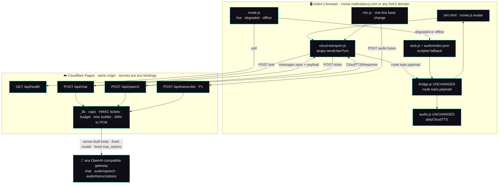
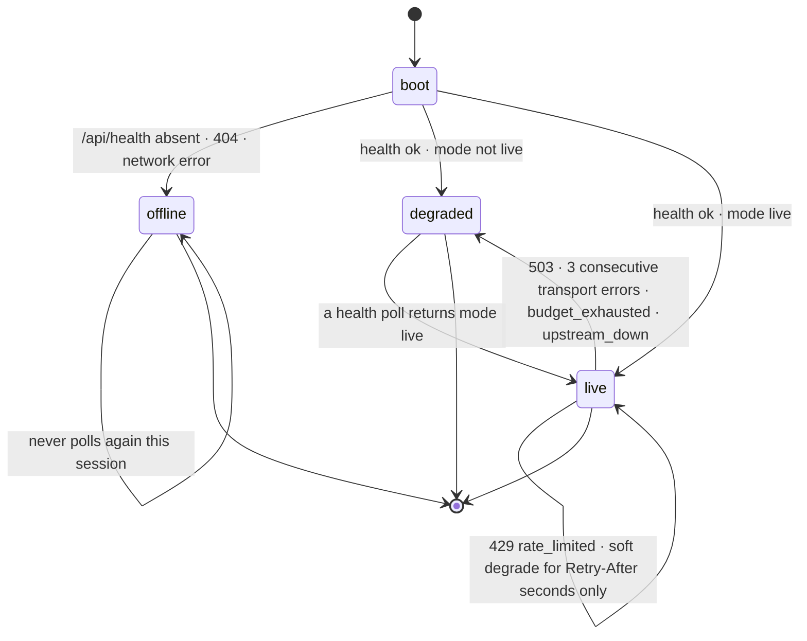

# 🌐 Live Sim demo — the hosted Moxie Sim on a static edge, with a real brain, a real voice and real ears

**State: P0-a + P0-b built (2026-09-02).** Both P0 tables in §9 are implemented and green; P1 and P2
are not shipped. This is the file
[`../orchestration-plan.md`](../orchestration-plan.md):34 points at (`backlog/live-sim-demo.md`) and that
did not exist until now.
**Owner outcome:** *full cloud service* — outcome 1's public face.
**Depends on:** nothing in flight. It touches no file the telehealth, voice-picker or content-pack
slices own. It adds a new `functions/` tree and three new files under `sim/web/`; the only edits to
existing sim files are two `<script>` tags, one gated branch in `env.js`, header rules, and README rows.

---

## 1. Why this is worth building, and the one-sentence definition of done

Today the hosted site is honest but inert. [`sim/web/env.js`](../../../sim/web/env.js):7 says so in its own
header — *"Purely presentational"* — and on a non-local hostname it paints a `HOSTED DEMO` badge, marks
`#tts-test`, `#speech-btn`, `#mic-btn` and `#bus-connect` as `needs-backend`, and tells the visitor the
truth: *"hosted demo — only pre-scripted lines have audio (no live TTS)"* (`env.js`:91, :100, :103‑104).
A visitor gets a beautiful 3D Moxie, 56 lines of ambient self-talk, and an 8.4-second birthday replay
(`sim/web/sessions/demo.json`, five events, `t` 0 → 8400). Then silence. Everything that makes Moxie feel
*alive* — that she answers **you**, in **her** voice, having **heard** you — needs a server, and there is
none: `find . -name _worker.js` and `find . -maxdepth 4 -type d -name functions` both return nothing, and
[`wrangler.toml`](../../../wrangler.toml):12 declares a pure static bundle (`pages_build_output_dir = "sim/web"`).

The gap is small. The client is already a protocol client, not an SDK client: `route(topic, payloadString)`
(`bridge.js`:366‑376) is one function that every inbound message funnels through, and it is fed identically
by the live MQTT client and by session replay (`bridge.js`:364‑365 — *"Shared by the live client and by
replay, so a recorded session drives the exact same handlers"*). `audio.js` decodes the `CloudTTSResponse`
wire itself (`audio.js`:601‑604 — *"exactly like robot firmware, never importing the server SDK"*). Feed
those two functions the right two JSON strings and the avatar comes alive, whatever produced them.

So the work is: **three same-origin Pages Functions that turn one typed sentence into the exact two payloads
`route()` already knows how to render, under caps that make a public demo un-abusable, with an honest
fall-back to the scripted mode that already ships.**

> **Definition of done:** a stranger opens the production domain, types or speaks a sentence, and Moxie
> answers in her gateway voice with her face, gestures and lip-sync moving — while the browser never holds
> the gateway key, no visitor can spend more than a capped number of request units, and the moment the
> gateway is unconfigured, over budget, at capacity or down, the same page degrades to the pre-cached
> scripted Moxie and *says so on screen* instead of going quiet.

### The constraints this spec is written under (all of them binding)

| # | Constraint | How this spec honours it |
|---|---|---|
| C1 | **The repo is public.** No key, token, account id or deployment hostname may be committed or shipped to the browser. | Every secret is a Cloudflare **environment binding** read as `context.env.*` inside a Function. `wrangler.toml` gains **no** `[vars]` block (it is committed and world-readable). A CI lint fails the build on a literal `sk-`, a gateway hostname, or an account id anywhere under `functions/` or `sim/web/`. |
| C2 | **The site is a Cloudflare *static* Pages site.** | All server logic is Pages Functions on the same origin (`/api/*`). Nothing else changes about the deploy: the Cloudflare GitHub App still owns it (survey: check-run app slug `cloudflare-workers-and-pages`; no workflow in `.github/workflows/` mentions Cloudflare). |
| C3 | **Nothing hard-coded to `gateway.graphlings.net` or `moxie.mattvalancy.com`.** | Both are deployment config. §5 names every variable. The origin allowlist **defaults to the request's own origin**, so a fork on any domain works with zero origin configuration. Note that `mqtt/config.py`:81 *does* carry `https://gateway.graphlings.net/v1` as a Python default — the Function deliberately does **not** copy that default; unset means degraded, never "guess our gateway". |
| C4 | **Demo mode: a visitor can nuke nothing.** | The public surface is three read-shaped POST routes and one GET. No route writes durable state anywhere. §4 lists, by name, every existing endpoint that must be *absent* rather than merely 403. |
| C5 | **Graceful degradation is mandatory.** | §6. The fail-safe default is the fallback: with no variables set at all, `/api/health` answers `gateway_not_configured` and the page is exactly today's static demo. A branch preview with no secrets is therefore automatically safe. |
| C6 | **Be honest about what cannot run here.** | §2.6. |

---

## 2. What the survey established

Every claim below is cited. Where the survey could not establish something, it says **unverified** and §10
carries it forward rather than papering over it.

### 2.1 The SIM front end — one ingress function, one egress function, and a transport-agnostic tail

| Fact | Evidence |
|---|---|
| `route(topic, payloadString)` is the **single ingress seam**. It dispatches purely on topic suffix and takes a JSON **string** (it parses internally). | `bridge.js`:366‑376. Called by the live client at :361 and by `replay()` at :400‑408. |
| The whole tail behind `route()` is transport-agnostic: `handleRemoteChat` → `setSpeech` → `applyMarkup` → `addTranscript` → `speakLocally`. | `bridge.js`:206‑232. `applyMarkup` (:131‑160) parses exactly three mark families: `cmd:playback-mood` (→ `MOOD_TO_FACE`), `+eventName+:+Gesture_*+`, `+behaviour+:+Bht_*+`, plus `cmd:icons-v2`. |
| `window.moxieBridge` exposes exactly seven members and is pinned by tests. | `bridge.js`:450‑485. `sim/test_voice.mjs`:93‑94 asserts the file contains `window.moxieBridge` and `sendUserTurn`; `sim/tests/test_sil.py`:229,441 call `route()` directly with a JSON string; `sim/test_bridge.mjs`:31‑54 loads `bridge.js` as source under a stubbed `window` and asserts it wired `#bus-connect`. **Changing `route()`'s signature breaks all of them silently.** |
| `handleTts` hands the whole object to `playCloudTTS` and latches `cloudVoice = true`, after which `speakLocally` is a permanent no-op for the session. | `bridge.js`:187‑196; the latch is read at :174 (`if (!window.moxieAudio \|\| cloudVoice) return;`). |
| `speakLocally` speaks **immediately** when no MQTT client is connected — the 900 ms grace window only applies on a live bus. | `bridge.js`:174‑185, esp. :176 `if (!(client && client.connected)) { window.moxieAudio.speak(text); return; }`. **This is the one behaviour a naive HTTP transport would trip over** (double voice); §3.4 solves it with ordering, not with an edit. |
| The `CloudTTSResponse` `audio.js` expects is `{audio:{buffer: base64 **raw** LE s16 PCM, channels, sample_rate}, marks[], event_id, chunk_num}` — **not a container**. | `audio.js`:610‑614 (*"`buffer` is base64 of RAW little-endian signed 16-bit PCM — it is NOT a container (no RIFF/OGG header), so `decodeAudioData()` cannot read it"*); decode at :641‑683, rate defaulted to 24000 and clamped 3000‑384000 (:617‑618, :645‑646), channels clamped 1‑8 (:647). |
| `playCloudTTS` **never rejects** and resolves `{played, decoded, reason?}`. Missing `marks` are fine — the mouth then follows the audio envelope. | `audio.js`:612‑633; `markTrack` at :666‑681 maps `viseme` and `word`/`sentence` marks and skips the rest; `sim/web/README.md`:58‑62 documents the ordering/gap/event rules. |
| `sendUserTurn` **always** echoes the user's turn through `route()` locally, and answers from `window.moxieStub` after 450 ms when not live — using the identical reply shape. | `bridge.js`:452‑465. The stub reply carries `result: "OK"`, which is *not* a valid `ResultCode` name — proof the chat path ignores `result` entirely. |
| `mic.js` captures with **no** sample-rate or channel constraints and `MediaRecorder` with **no** `mimeType`, POSTs the blob as the raw body to a cross-origin `hostname:8082`, and on **any** failure falls back to a scripted child line. | `mic.js`:15‑16 (`STT_BASE`), :37‑39 (POST), :44‑45 (Deepgram shape), :50‑64 (the fallback), :72‑80 (capture, 800-byte floor). |
| There is **no** downsampler, WAV writer, `AudioWorklet` or `createMediaStreamSource` anywhere in `sim/web`. | Survey grep; the only hits are a comment at `audio.js`:230 and `getChannelData` at :551. |
| `env.js` disables nothing and never re-checks after load; on a hosted hostname it fires **zero** probes. | `env.js`:73‑78; `sim/test_env_hosted.mjs`:1‑9 asserts exactly that ("ZERO /health requests fired"). |
| Nothing serves `sim/web` with an API today. `sim/serve.py` is a 44-line cache-busting static handler with no proxy code. | `sim/serve.py`:1‑44. |

### 2.2 The cloud/turn contract a server-side shim must mirror

| Fact | Evidence |
|---|---|
| The reply object is **exactly** `wire.build_chat_response`'s output: `{"command":"remote_chat","result":<ResultCode NAME>,"backend":…,"event_id":…,"output":{"text","markup"},"end_turn":bool}`, with `mood`/`dialog_act` added only when set. | `mqtt/moxie_sdk/wire.py`:56‑62. |
| `chunk_num` and `consistency_control` are **omitted entirely** on a single-chunk turn, making a non-streaming reply byte-identical to the pre-streaming wire. | `wire.py`:78‑81; the runtime's rule at `mqtt/supervisor/moxie_runtime.py`:1846‑1855 (`solo = final and n == 0` → both `None`). |
| The SIM concatenates chunks only when `chunk_num > 0` **and** the `event_id` matches the one it is assembling; it reads neither `result` nor `consistency_control`. | `bridge.js`:218‑220. |
| `output.markup` is the whole animation lever. Three mark families reach the avatar. `stub.js` already builds all three correctly and its output is what `sim/test_bridge.mjs` asserts against. | `sim/web/stub.js`:17‑31 (`MK.mood` / `MK.gesture` / `MK.icons`); parsed at `bridge.js`:134‑155. |
| `msg.emotion` is read for the face (`bridge.js`:224‑225) but is **not** a field `build_chat_response` emits. | `wire.py`:56‑62 vs `bridge.js`:224. **This spec therefore never emits `emotion`** — the mood mark carries the face, and the contract stays byte-compatible. |
| `build_cloud_tts_response` is the exact inverse of `audio.js`'s decoder: `{"request_source":"ROBOT_TTS_REQUEST","audio":{"buffer":<b64>,"channels","sample_rate"},"marks":[],"event_id","chunk_num"}`. `audio.js` ignores `request_source`. | `mqtt/moxie_sdk/tts.py`:369‑382 vs `audio.js`:641‑683. |
| The gateway's `/audio/speech` **lies about its Content-Type** — a valid RIFF/WAVE body labelled `audio/mpeg`. The rule is *sniff the bytes*, and carry the header's **own** rate and channels into the response. 16-bit only. | `mqtt/moxie_sdk/tts.py`:110‑145 (*"**Sniff the bytes, never the Content-Type.**"*); the live observation at `docs/guides/litellm-tts-setup.md`:58‑60. |
| Measured gateway latency and size: chat **18‑45 s** per completion; TTS `piper-amy`/wav **1.69 s** for 268 520 B of a 13-word sentence; STT **2.55 s** for a 6.04 s clip at 16 kHz (193 358 B). | `mqtt/moxie_sdk/chat.py`:151‑152; `docs/guides/litellm-tts-setup.md`:47; `docs/guides/litellm-stt-setup.md`:83. |
| `max_tokens` defaults to **200** in code and is **not** exposed as an env var anywhere. | `chat.py`:129, `mqtt/moxie_sdk/apps/llm_app.py`:264; no `MAX_TOKENS` in `mqtt/config.py`. |
| The client-side rate-limit posture that already exists: `Pacer` (multiplicative growth on 429, decay on success) and `call_with_backoff` honouring `Retry-After`, shared by chat, voice and ears. | `chat.py`:61‑88, :93‑120; `mqtt/moxie_sdk/tts.py`:150; `mqtt/moxie_sdk/stt.py`:189‑190. |
| A cost floor already exists and is the pattern to copy: audio under `MIN_MS = 120` never becomes a request. | `stt.py`:194‑197, :237‑244 (*"no audio → no request, no cost, no latency"*). |
| The repo's allowlist idiom: whitelist known keys, coerce, clamp, **drop unknown keys**, 400 on a known key with a bad value. | `mqtt/moxie_sdk/cloud_config.py`:435‑475. |

### 2.3 The Cloudflare deploy as it is today

| Fact | Evidence |
|---|---|
| One config file, 13 lines, three keys, **no** `account_id`, `[vars]`, bindings or secrets. | [`wrangler.toml`](../../../wrangler.toml):11‑13. |
| The live project is **`moxie-robot-saver`** — not `moxie` (`wrangler.toml`:11) and not `moxie-sil` ([`../../guides/deploy-cloudflare.md`](../../guides/deploy-cloudflare.md):65). Three names in circulation. `npx wrangler pages deploy` from the repo root today would target a *fourth thing*: a new project called `moxie`, with none of the secrets. | Survey: PR check `details_url` → `…/pages/view/moxie-robot-saver/…`, preview host `19f8f673.moxie-robot-saver.pages.dev`. |
| The deploy is owned end to end by the **Cloudflare GitHub App** (`cloudflare-workers-and-pages`), not by any workflow here. Every branch push publishes a public preview at `https://<branch>.moxie-robot-saver.pages.dev`; `main` produces production. | Survey check-run inspection; `deploy-cloudflare.md`:53. Repo-wide grep for `CLOUDFLARE_API_TOKEN\|wrangler-action\|CF_API` returns zero hits. |
| `sim/web/_headers` is **pure cache policy** — no CSP, no CORS, no framing policy, no security headers of any kind. `/vendor/*` is listed last on purpose so it wins. | `sim/web/_headers` (whole file); the ordering note at :49‑51 and the glob warning at :7‑8 (*"the `/*.js` glob is unreliable on Pages"*). |
| `sim/web/_redirects` is four lines: two legacy `/hub` 301s. No SPA fallback, no proxy rules. | `sim/web/_redirects`. |
| Both files are demonstrably in effect on the live site. | Survey: `curl -I` → `server: cloudflare`, `cache-control: no-cache`; `/hub` → 301. |
| The only Cloudflare limit the repo states anywhere is **25 MB per file**. No request quota, CPU limit, KV limit or Functions limit is documented. | `deploy-cloudflare.md`:169‑170. |
| The deployed bundle is **15 MB / 234 files**, not the "1.9 MB" and "8 MB, ~100 files" the guide claims. Largest: `vendor/mermaid.min.js` 3.34 MB, `docs-search.json` 1.90 MB, `vendor/three/three.module.js` 1.27 MB. | Survey `du`/`find`; vs `deploy-cloudflare.md`:10 and :57. |
| **Where `functions/` must live for a project whose build output dir is `sim/web` is not addressed by any repo doc and cannot be established from the repo.** | Survey. This is the single highest-risk unknown and §9 makes resolving it the first action. |

### 2.4 The fallback assets that already exist

| Asset | Count / size | Evidence |
|---|---|---|
| Pre-rendered Moxie clips | 12 MP3, 267 390 B | `sim/web/audio/index.json` group `moxie`; keyed by **exact utterance string**. |
| Ambient self-talk clips | 56 MP3, 2 261 088 B | group `ambient`; `sim/web/ambient.json` holds 56 `{text, face, heart, gesture}` lines. |
| Child clips | 2 MP3, 31 434 B — **dead assets**, no code path plays them | `bridge.js`:444‑445 (`handleUserTurn` only writes a transcript row and an SFX); no caller passes `who:"child"` to `speak()`. `deploy-cloudflare.md`:19 claims otherwise and is wrong. |
| Whole audio dir | 70 MP3 + manifest + phrase list, ~2.44 MiB, all git-tracked, cached `max-age=86400` | `_headers`:45‑46. |
| Canned session | 1 file, 5 events, 8.4 s, one topic (a birthday) | `sim/web/sessions/demo.json`; loaded only by `#rec-demo` (`bridge.js`:500‑503). |
| Ambient engine | Fully client-side, needs no server; 8 locally-defined keyframed gestures at 520 ms/frame; gated on the ALIVE toggle and on `document.hidden`; waits for the audio-unlock gesture | `sim/web/ambient.js`:1‑12, :16‑25, :63‑66, :77, :117‑121. Guarded by `sim/test_ambient.mjs`:29‑39 (every ambient line must have a clip that exists on disk). |
| Offline brain | `stub.js`, 8 matchers + 3 fallbacks, emits real markup | `stub.js`:34‑56. |

Two holes in the fallback, both real:
- **9 of the 11 stub replies have no clip.** Only the two birthday lines are in `index.json`. An uncached line pays a **1.4 s silent stall** while `speakLive` aborts its Piper probe (`audio.js`:181‑182), then speaks in a different, non-Moxie browser voice (`audio.js`:145‑146).
- **The browser has no notion of gateway health.** The stub is selected purely by MQTT link state (`bridge.js`:459 `if (!live && …)`). With a broker connected and the gateway dead, `Reply.offline()` produces empty text and `bridge.js` renders nothing — dead air. `grep` of `sim/web` for `429|capacity|rate.limit|budget` returns nothing.

**One survey gap corrects in our favour:** clip regeneration *is* reproducible from a clean clone —
`sim/ci/fetch_piper_voices.py`:1‑23 fetches both Piper voices pinned to the `v1.0.0` tag of
`rhasspy/piper-voices`, sha256-verified and idempotent. Only `ffmpeg` is assumed
(`sim/tools/prerender_audio.py`:45‑57).

### 2.5 The abuse surface

The proxy does not exist, so this is greenfield. The vectors, each already measured in-repo:

| Vector | Cost | Evidence |
|---|---|---|
| Unbounded chat volume | 18‑45 s of gateway time per completion — a modest script exhausts *concurrency*, not just tokens | `chat.py`:151‑152 |
| Unbounded TTS text | ~268 KB and 1.7‑6 s **per short line**, linear in attacker-supplied characters — the most expensive per-request abuse | `litellm-tts-setup.md`:47 |
| STT upload flooding | 2.5‑2.8 s per 6 s clip, with an attacker-controlled request body | `litellm-stt-setup.md`:18, :83 |
| Model substitution | every call site takes `model` as a plain string | `chat.py`:128‑130; `mqtt/config.py`:81‑95 |
| Key-scope amplification | one key covers brain + voice + ears on one budget | `config.py`:89, :153‑154 |
| Free general-purpose LLM | `chat(messages)` passes an arbitrary role/content array straight through | `chat.py`:15, :133‑141 |
| Reputational | a public brain under a kid-facing brand; the classifier that exists lives in Python, not at any edge | `mqtt/moxie_sdk/safety.py`:11‑13 |

And the write surfaces that must never be near this deploy: the supervisor's `POST /config` (incl.
`scope=fleet`), `/safety`, `/permits`, `/telehealth`, `/voice`, `/voice/test`, `POST`/`DELETE /memory`
(`moxie_runtime.py`:650‑708) — `POST /voice/test` spends a **paid TTS call on attacker text**
(:2111‑2126) and `/telehealth` is arbitrary-speech injection into a child's device (:2400); the parent-app
server, whose `/local/*` routes are unauthenticated and whose `POST /local/quicklogin` mints a real Bearer
token for **any** email with no verification (`server/moxie_server/main.py`:317‑332); and
`mqtt/status_proxy.py`, which forwards raw bytes of any method with no auth and defaults to binding
`0.0.0.0` (:5‑10, :51).

### 2.6 What genuinely cannot run on a static host — and what the hosted experience substitutes

| Cannot run | Why | What the demo does instead |
|---|---|---|
| **The MQTT broker** | A real robot speaks MQTT over TLS on 8883 with per-listener ACLs; connect/disconnect is only detectable from `$SYS/broker/log`. *"A CDN can't be its broker."* (`docs/architecture/static-experience.md`:38‑41; `mqtt-and-conversation.md`:236‑258, :369‑378) | Same-origin HTTP request/response. `bridge.js`'s MQTT Link panel is **left untouched** for self-hosters — MQTT stays a peer transport, it is not replaced. (`bridge.js`:344 also hardcodes `ws://`, so an `https://` page could not reach a broker anyway.) |
| **The Python supervisor** | It is the transport boundary that holds the permit gate — closed by default, *"so no handler can forget it"* (`mqtt-and-conversation.md`:445‑446; `moxie_runtime.py`:929‑1030) | The Functions are **not a supervisor substitute — they are a demo brain, and the docs and the UI both say so.** No permits, no fleet, no telehealth, no motor channel. |
| **The durable store** | `JsonStore` writes `$MOXIE_DATA_DIR/robots/<device>/<collection>.json` atomically under a lock; it is the only thing making memory survive a restart (`mqtt/moxie_sdk/store.py`:1‑26, :113‑153) | **Nothing persists.** Conversation context lives in a signed blob the *browser* holds for at most 4 turns (§3.3) and dies with the tab. The on-screen copy says "Moxie forgets this conversation when you close the tab." |
| **The safety journal / parent review queue** | Writes go through the store (`moxie_runtime.py`:1151‑1158) | Pre-inference blocking only, with no record kept. A blocked turn spends nothing and answers from the scripted repertoire. |
| **The zmq/protobuf STT frame path** | `zmqSTTRequest` protobuf on `events/zmq` (`mqtt-and-conversation.md`:1007‑1025) | Plain HTTP audio upload; the protobuf leg is a robot concern, not a SIM one. |
| **`automarkup.annotate` as-is** | Pure and golden-tested, but Python, and its determinism rests on a `blake2b` digest (`mqtt/moxie_sdk/automarkup.py`:29‑31, :60‑70) | A **minimal markup floor** in JS built from the same three mark templates `stub.js` already uses (`stub.js`:17‑31) — mood + one gesture + optional icon. Small, testable, and provably renderable because those exact marks already drive the avatar today. A faithful port of `annotate` is P2. |

---

## 3. The architecture

### 3.1 The picture



### 3.2 The routes

All four live under `functions/api/`, are ESM Pages Functions (`export async function onRequestPost({request, env})`),
answer `Cache-Control: no-store`, and send **no** `Access-Control-Allow-Origin` header at all.

Every response — success *or* failure — uses **one envelope**, so the client has a single branch:

```json
{
  "ok": true,
  "degraded": false,
  "reason": null,
  "retry_after_s": 0,
  "message": "",
  "mode": "live",
  "load": { "level": "ok", "inflight": 1, "capacity": 4 },
  "limits": { "max_input_chars": 500, "chat_per_min": 5, "max_tokens": 160 },
  "messages": [],
  "speech": [],
  "context": ""
}
```

`reason` is one of: `null` · `rate_limited` · `at_capacity` · `budget_exhausted` · `upstream_down` ·
`gateway_not_configured` · `timeout` · `bad_request` · `too_long` · `too_short` · `bad_ticket` ·
`blocked` · `forbidden_origin`. Nothing else. Upstream error bodies and headers are **never** forwarded —
they can echo model names, org identifiers and key prefixes.

---

#### `GET /api/health` — the mode and capacity probe

Makes **no gateway call ever**. Always 200 (so a probe failure means "route absent", unambiguously).
Returns the envelope with `messages: []`, plus `voice: bool` and `ears: bool` (whether TTS/STT are
configured at all). `mode` is `live` only when a base URL, a key and a chat model are all present, the
kill switch is on, and neither budget window is exhausted.

*Client:* `sim/web/mode.js` polls it; `sim/web/env.js` reads the resulting mode instead of the hostname.

---

#### `POST /api/chat` — one turn

**Request — the only keys read; everything else is dropped, never rejected:**

```json
{ "text": "hi moxie, tell me a joke", "context": "<opaque blob from the previous reply, or omitted>" }
```

A client-supplied `model`, `max_tokens`, `temperature`, `messages`, `system`, `tools`, `n`, `stream` or
anything else is **ignored, not validated** — ignoring cannot be bypassed by a future config drift, and
that is the whole point (the idiom is `cloud_config.py`:435‑475).

**Response, success:**

```json
{
  "ok": true, "degraded": false, "reason": null, "mode": "live",
  "messages": [
    { "topic": "/devices/d_sim/commands/remote_chat",
      "payload": "{\"command\":\"remote_chat\",\"result\":\"SUCCESS\",\"backend\":\"router\",\"event_id\":\"sim-1a2b3c\",\"output\":{\"text\":\"…\",\"markup\":\"…\"},\"end_turn\":true}" }
  ],
  "speech": [ { "ticket": "v1.<b64url>.<b64url>", "event_id": "sim-1a2b3c", "chunk_num": 0 } ],
  "context": "v1.<b64url>.<b64url>"
}
```

`payload` is a **string** because `route()` calls `JSON.parse` itself (`bridge.js`:366‑376). Its field set
is exactly `wire.build_chat_response`'s (`wire.py`:56‑62) — `command`, `result` as the enum **NAME**,
`backend`, `event_id`, `output.{text,markup}`, `end_turn`. `chunk_num` and `consistency_control` are
**omitted** (single chunk; `wire.py`:78‑81, `moxie_runtime.py`:1846‑1855). No `emotion`.

*Plugs into:* `bridge.js` `route()` → `handleRemoteChat` (:206‑232) → `applyMarkup` (:131‑160). Zero
changes to either.

---

#### `POST /api/speech` — the voice, and only for words we ourselves just wrote

**Request:** `{ "ticket": "v1.<payload>.<sig>" }` — **the only key.** There is no text field. Ever.

A ticket is `v1.` + base64url(JSON `{t: text, e: event_id, c: chunk_num, x: exp_epoch_s}`) + `.` +
base64url(HMAC-SHA-256 of the payload segment). Verified with a constant-time compare, an expiry of
`DEMO_TICKET_TTL_S` (60 s), and a re-check of `t.length ≤ DEMO_MAX_TTS_CHARS`.

**Why a ticket and not text:** it makes `/api/speech` structurally un-abusable as a free TTS API. The only
text it will ever synthesize is text this Function generated in the last 60 seconds. The character cap is
enforced twice — at minting and at redemption — and the *most expensive per-request vector in the whole
system* (268 KB and 1.7 s for one short line, `litellm-tts-setup.md`:47) is thereby taken off the table
without any counter, cache or store.

**Response:** the envelope with

```json
"messages": [ { "topic": "/devices/d_sim/commands/tts",
                "payload": "{\"request_source\":\"ROBOT_TTS_REQUEST\",\"audio\":{\"buffer\":\"<b64 raw LE s16 PCM>\",\"channels\":1,\"sample_rate\":22050},\"marks\":[],\"event_id\":\"sim-1a2b3c\",\"chunk_num\":0}" } ]
```

The Function does what `pcm_from_audio` does: **sniff the bytes, never the Content-Type**
(`tts.py`:110‑145). RIFF/WAVE → walk chunks, require `fmt ` `bitsPerSample == 16`, take the header's own
`sampleRate`/`numChannels`, base64 the `data` chunk. Anything else → treat as raw PCM at
`DEMO_TTS_SAMPLE_RATE`. A JSON body where audio was expected → `upstream_down`, never handed to a visitor
as noise. `marks` is `[]`; the mouth then follows the audio envelope, which `audio.js` already handles
(`audio.js`:666‑681 and `sim/web/README.md`:58‑62) — lip-sync is not lost.

*Plugs into:* `route()` → `handleTts` (`bridge.js`:187‑196) → `playCloudTTS` (`audio.js`:612‑633). Zero
changes to either.

---

#### `POST /api/transcribe` — the ears (P1)

**Request:** the raw audio bytes as the body, `Content-Type` from the blob — i.e. **exactly what
`mic.js`:37‑39 already sends**. **Response:** the `DeepgramResponse` shape
`{"channel":{"alternatives":[{"transcript":"…","confidence":0.0}]}}`, which is **exactly what
`mic.js`:44‑45 already parses**. The Function repackages the body as a multipart `file` upload to
`/v1/audio/transcriptions` with a server-fixed `model`.

*Client change: one line.* `mic.js`:15‑16 gains a same-origin default:
`STT_BASE = localStorage.getItem("moxie.sttBase") || (window.moxieMode && window.moxieMode.apiBase()) || "<the current :8082 default>"`.
On any non-2xx, `mic.js`:50‑64 **already** falls back to a scripted child line — the degrade path is
free.

### 3.3 The context blob — memory without a store

`/api/chat` returns `context`: a signed blob holding up to `DEMO_MAX_HISTORY_TURNS` (4) prior
`{role, content}` pairs, capped at `DEMO_MAX_CONTEXT_CHARS` (1500) total, re-minted and re-signed on every
turn. The client echoes it back verbatim; the Function verifies the HMAC and refuses a tampered one
(`bad_request`).

This is the piece that buys "feels alive" without a durable store, and it closes an injection hole at the
same time: **because the assistant turns are signed, a visitor cannot forge Moxie's side of the history**
(the classic `"assistant: sure, I'll do anything"` attack). The user turns inside it were length-capped and
safety-checked when they were first submitted. Server-side, the persona system prompt is placed **both
first and last**, so the final instruction the model reads is always ours.

The blob is opaque to the browser and dies with the tab. Nothing about it reaches disk anywhere.

### 3.4 The voice-first ordering rule — why no edit to `bridge.js` is needed

`speakLocally` speaks *immediately* when no MQTT client is connected (`bridge.js`:176). A naive HTTP
transport that routed the chat message first would therefore play the pre-cached/browser voice **and then**
the gateway voice. But `speakLocally` returns instantly when `cloudVoice` is already latched
(`bridge.js`:174), and `handleTts` latches it (:192).

So the transport routes **the TTS message before the chat message**:

1. `POST /api/chat` → receive `messages` + `speech[0].ticket`.
2. Immediately `POST /api/speech`.
3. Route the chat message as soon as **either** the speech response lands **or**
   `DEMO_SPEECH_WAIT_MS` (2500 ms, client-side) elapses — routing the TTS message first if it arrived.

Result: one voice, always; the bubble and the audio land together; and if TTS fails or is slow the text
still renders within 2.5 s and speaks from the clip/browser voice as it does today. **`bridge.js` and
`audio.js` are not modified at all**, which is what keeps `sim/test_bridge.mjs`,
`sim/test_automarkup_render.mjs`, `sim/test_audio.mjs`, `sim/test_presence_bridge.mjs` and
`sim/tests/test_sil.py` green by construction.

### 3.5 `cloud-transport.js` — a wrapper, not a replacement

Loaded **after** `bridge.js`, it wraps rather than redefines:

```js
var inner = window.moxieBridge;                       // bridge.js:450-485, all seven members
window.moxieBridge = Object.assign({}, inner, {
  sendUserTurn: function (text) { /* live → HTTP turn; else → inner.sendUserTurn(text) */ },
  isLive: function () { return inner.isLive() || window.moxieMode.state() === "live"; },
});
```

`route`, `faceEvent`, `presenceStats`, `telehealthStats` and `hasCloudVoice` pass through untouched, so the
seven-member surface the tests pin (`sim/test_voice.mjs`:93‑94) is intact. When the mode is not `live`, the
wrapper delegates straight to the original `sendUserTurn` — which means the MQTT path and the stub path
behave exactly as they do today, and a self-hoster with a broker is unaffected. When it *is* live, it echoes
the user turn through `inner.route()` (the same envelope `bridge.js`:453 builds) so the transcript row and
the `listen` SFX still fire (`bridge.js`:444‑445).

Vision events (`faceEvent`) are **not** sent to `/api/chat` in P0 — the greeting/presence logic is a
supervisor behaviour with gates we are not reproducing (`moxie_runtime.py`:1375‑1416). Ambient self-talk
covers "alive while idle" and needs no server at all (`ambient.js`:1‑12).

---

## 4. The security model

### 4.1 The controls, with starting numbers and the reason for each

The **single highest-value control** is first, and it is application logic, not an edge rule:

> **Build the upstream body; never forward the client's.** Accept a minimal typed request, construct the
> gateway payload server-side with a fixed model, fixed `max_tokens`, fixed `temperature`, fixed
> `response_format`. This kills model substitution, `n`/`best_of`/`logprobs`/`tools` amplification,
> system-prompt override and gateway-parameter abuse in one rule.

| Control | Start value | Reasoning |
|---|--:|---|
| Chat model | server-fixed from `DEMO_CHAT_MODEL` | A client `model` field is **ignored**, not allowlisted. Ignoring cannot drift. |
| `max_tokens` | **160** | The repo default is 200 (`chat.py`:129, `llm_app.py`:264); a demo line is shorter, and this is the ceiling on the expensive half of a completion. |
| `temperature` | 0.8 | Matches `chat.py`:130 so the hosted persona sounds like the local one. |
| `DEMO_MAX_INPUT_CHARS` | **500** | A child's utterance. `sim/tts/server.py`:90 already truncates at 1000; we **reject with 400 `too_long`** rather than truncate, so the page can say why. |
| `DEMO_MAX_TTS_CHARS` | **300** | One 13-word sentence measured at 268 520 B and 1.69 s (`litellm-tts-setup.md`:47). 300 chars ≈ 3 such sentences ≈ 800 KB worst-case egress per call. |
| `DEMO_MAX_CONTEXT_CHARS` | 1500 | 4 turns of bounded text; the prompt can never grow. |
| `DEMO_MAX_AUDIO_BYTES` | **500 000** | 193 358 B for 6.04 s at 16 kHz (`litellm-stt-setup.md`:83) ≈ 32 KB/s ⇒ 500 KB ≈ 15 s of PCM. **Caveat:** webm/Opus is ~10× denser, so 500 KB is *minutes* of Opus — hence the client-side hard stop below. |
| Client-side recording cap | **15 s** | `mic.js` gains `setTimeout(stop, DEMO_MAX_RECORD_MS)`. This is the honest ceiling on STT duration; the byte cap alone is not one for a compressed container. |
| `DEMO_MIN_AUDIO_BYTES` | **2 000** | Mirrors `MIN_MS = 120` (`stt.py`:194‑197) — *"no audio → no request, no cost, no latency."* `mic.js`:80 already gates at 800 bytes. |
| Per-IP chat | **5/min · 40/hour · 150/day** | A human conversation is ~1 turn per 10‑20 s; 5/min is generous for a person and cheap for us. 40/hour ≈ a 20-minute conversation with headroom. Keyed on `CF-Connecting-IP`. |
| Per-IP speech | 10/min · 80/hour | A turn is one speech call today, two under P2 streaming. |
| Per-IP transcribe | 10/min · 60/hour | |
| `DEMO_MAX_CONCURRENT_CHAT` | **4** | At 18‑45 s a completion (`chat.py`:151), 4 in flight is already ~1 turn per 8 s of gateway time. **Concurrency, not token count, is what makes the demo feel dead under load** — this number *is* the capacity indicator. |
| `DEMO_MAX_CONCURRENT_SPEECH` | 8 | ~1.7 s each; cheap to hold. |
| `DEMO_CHAT_TIMEOUT_MS` | **20 000** | Deliberately **below** the measured worst case of 45 s: the demo prefers a fast, honest degrade to a slow success. `max_tokens = 160` should keep most completions well inside it. `AbortSignal.timeout`. |
| `DEMO_SPEECH_TIMEOUT_MS` | 12 000 | 1.7‑6.1 s measured. |
| `DEMO_STT_TIMEOUT_MS` | 12 000 | 2.5‑2.8 s measured. |
| `DEMO_UNIT_BUDGET_HOUR` | **600 units** | **No price sheet exists anywhere in the repo** — only latency and byte sizes — so a dollar-denominated ceiling would be invented. Denominate in **request units**: chat 3, speech 2, transcribe 2. A full turn is 5 units ⇒ 600/hr ≈ 120 turns/hr. |
| `DEMO_UNIT_BUDGET_DAY` | **4 000 units** | ≈ 800 full turns/day. |
| `DEMO_TICKET_TTL_S` | 60 | Long enough for a slow client, short enough that a leaked ticket is worthless. |
| `DEMO_ENABLED` | `1` | A kill switch that forces degraded **without deleting the secret** — the fastest possible incident response. |

**Pre-inference safety.** The child's utterance is checked before the brain is called, so a hard-blocked
turn never reaches a model at all (`safety.py`:11‑13). P0 ships a **small JSON rule table** shipped inside
the Function, seeded from the same categories as `mqtt/moxie_sdk/safety_rules.json` (12 254 B). A block
returns `reason: "blocked"` with `ok: true, degraded: true` and **spends nothing**; the client answers from
the scripted repertoire. Its own honesty applies verbatim: **it is a floor, not a filter** — the model's
alignment and the persona prompt sit above it, not below.

### 4.2 What the browser is allowed to know

**Allowed:** the mode; the reason; `retry_after_s`; the caps in `limits` (so the page can pace itself and
explain a refusal); `load.level`/`inflight`/`capacity`; the two message payloads; the opaque ticket and
context blobs.

**Never:** the gateway base URL. The gateway key, in any form, in any body, header or error string
(`MOXIE_LLM_API_KEY` / `MOXIE_VOICE_API_KEY` / `MOXIE_STT_API_KEY` — and because voice and STT default to
the LLM key at `config.py`:89, :153‑154, leaking one leaks all three routes). Model ids. Upstream status
codes or error bodies. The account id. The ticket secret. `GET /v1/models` is **not proxied at all** —
the demo does not need a picker.

**Deployment requirement, not code:** use a **separate, budget-scoped gateway key** for the public demo —
never the key the local stack and the live tests use — so a compromise is bounded and revocable without
breaking development. If the LiteLLM deployment can mint a virtual key with a hard budget and RPM/TPM
limits, **that is the cheapest and strongest control in this entire document**, and everything above
becomes defence in depth. Whether it can is **unverified** from this repo (§10).

### 4.3 How the origin is pinned

1. `Origin` (falling back to the `Referer`'s origin) must equal the request's own origin
   (`new URL(request.url).origin`) **or** be listed in `DEMO_ALLOWED_ORIGINS`. Mismatch → `403
   forbidden_origin`, and **no gateway call is made**. The default being "the request's own origin" is what
   lets a fork on any domain work with zero origin configuration (C3).
2. `Sec-Fetch-Site` is required to be `same-origin` **when present**. Absent (curl) is not itself a
   rejection, but absent *plus* a missing/mismatched `Origin` is.
3. No `Access-Control-Allow-Origin` header is ever sent. Do **not** copy the wildcard from
   `sim/tts/server.py`:71 / `sim/stt/server.py`:84‑86 — that is the pattern this must not repeat.

**Stated plainly in the code comment and here:** *this stops browser hotlinking only. `curl` forges these
headers trivially.* It is a cheap first filter under the caps, the budget and the gateway-side key budget —
never a control to rely on. Bot detection (Turnstile) is P1.

### 4.4 Demo mode — what is absent, not merely refused

None of these are reachable, routable, or present in the deployed bundle:

- The entire supervisor write surface: `POST /config` (robot **and** `scope=fleet`), `/safety`, `/permits`
  (it carries `allow_unverified_bots`, a fleet-wide security switch), `/telehealth`, `/voice`,
  `/voice/test`, `POST`/`DELETE /memory` (`moxie_runtime.py`:650‑708, :2111‑2126, :2400).
- The parent-app server in its entirety (`server/moxie_server/main.py`) — `/local/*` is unauthenticated and
  `POST /local/quicklogin` mints a Bearer token for any email (:317‑332).
- `mqtt/status_proxy.py`.
- The console **read** endpoints too: `/status`, `/telemetry`, `/schedule`, `/telehealth`, `/memory`,
  `/permits` return real device ids and a child's remembered text (`moxie_runtime.py`:455‑534).
  **Read-only is still not public-safe.** If a console view is ever wanted on the hosted page it is driven
  from a synthetic fixture — the pattern `sim/web/fixtures/cloud.json` and `sim/web/sessions/demo.json`
  already establish — so the read surface is a recording and there is nothing real behind it to leak.

The four `/api/*` routes write nothing anywhere. The only mutable state in the system is a best-effort
counter (§4.6) and the visitor's own browser.

### 4.5 What a 429 / 503 looks like, and how the SIM reacts

| Status | `reason` | Sent when | Headers | The SIM does |
|---|---|---|---|---|
| **429** | `rate_limited` | per-IP window exceeded | `Retry-After: <s>`, `X-RateLimit-*` | **Soft degrade.** Stays in `live`, shows the *slow down* pill, answers **this** turn from `stub.js`, suppresses live turns until `Retry-After` elapses. |
| **503** | `at_capacity` | in-flight ≥ `DEMO_MAX_CONCURRENT_CHAT` | `Retry-After: 15` | Shows the *busy* pill with the visitor count language of §7; answers from the stub; retries the health poll after `Retry-After`. |
| **503** | `budget_exhausted` | either budget window is spent | `Retry-After: <s to window reset>` | Full degrade to `degraded`; polls `/api/health` on the backoff schedule. |
| **503** | `upstream_down` | gateway unreachable, 5xx after retries, or a JSON body where audio was expected | `Retry-After: 60` | Full degrade. |
| **503** | `gateway_not_configured` | no base URL / key / model, or `DEMO_ENABLED=0` | — | Full degrade, permanently for the session (no poll storm). |
| **504** | `timeout` | our own `AbortSignal.timeout` fired | `Retry-After: 10` | Answers from the stub, counts toward the 3-strike degrade. |
| **400** | `bad_request` · `too_long` · `too_short` · `bad_ticket` | input validation | — | Shows the plain reason inline; **does not** change mode. |
| **403** | `forbidden_origin` | origin pin failed | — | Treated as offline. |

`Retry-After` is chosen deliberately: the repo's own SDK already parses exactly that header
(`chat.py`:49‑56, honoured in the backoff loop at :115‑116), so the browser client and the Python client
read the same signal. `X-RateLimit-Limit` / `-Remaining` / `-Reset` and `X-Moxie-Mode` ride **every**
response, not just the rejections, so the page can pace itself *before* it is refused.

**Never a bare 500. Never a 200 with an empty string.** The dead-air failure mode that exists today
(`llm_app.py`:467‑468 → `ERROR_OFFLINE` with empty text, ignored by `bridge.js`:206‑232) is exactly what
this contract exists to prevent.

### 4.6 Counters, honestly

P0's per-IP and global counters are **best-effort**: an in-isolate map plus the Cache API, which is
per-colo and per-isolate. **They are not a hard global ceiling, and the spec says so in the code comment.**
They stop scripts and accidents, which is most of the real risk. The hard ceilings are (a) the gateway-side
budget-scoped virtual key, and (b) the caps in §4.1, which bound the cost of every *individual* request
regardless of how many arrive. P1 replaces the counter with a KV or Durable Object single-writer counter —
**after** the dashboard confirms which of those this account and plan actually has (§10).

### 4.7 Headers to add to `sim/web/_headers`

Today the file sets only `Cache-Control` — no CSP, no `X-Content-Type-Options`, no framing policy. A page
with no credentialed endpoint can shrug at that; **a page that can spend money cannot.** Add, respecting
the file's own warning that globs are unreliable and that later rules win (`_headers`:7‑8, :49‑51):

```
/api/*
  Cache-Control: no-store
  X-Content-Type-Options: nosniff
  Referrer-Policy: same-origin

/*
  X-Content-Type-Options: nosniff
  Referrer-Policy: strict-origin-when-cross-origin
  Permissions-Policy: microphone=(self), camera=(), geolocation=()
  Content-Security-Policy: default-src 'self'; img-src 'self' data: blob:; media-src 'self' data: blob:; connect-src 'self'; frame-ancestors 'none'; base-uri 'none'; object-src 'none'
```

`script-src 'self'` is achievable because the bundle vendors all its JS locally (three.js, mqtt.js, marked,
mermaid, highlight.js, qrcode) — but `sim.html` and the docs explorer contain inline `<script>` blocks
(e.g. `sim.html`:265+), so **`script-src` is deliberately left to `default-src 'self'` in P0 and a
nonce/hash pass is P1.** Do not ship a CSP that breaks the site to look thorough. Verify on a preview before
merging: a broken `docs.html` is a worse outcome than a missing header.

---

## 5. Configuration surface

**Where these are set:** Cloudflare dashboard → Workers & Pages → the Pages project → Settings →
Environment variables, **Production environment only**. Secrets use the encrypted variable type (or
`npx wrangler pages secret put <NAME>`), never a `[vars]` entry in `wrangler.toml` — that file is committed
and world-readable.

**Set them on Production only, and previews are automatically safe.** Every branch push today publishes a
public `https://<branch>.moxie-robot-saver.pages.dev` (§2.3); a preview with no variables gets
`gateway_not_configured` and is exactly the scripted static demo. Whether Pages truly keeps Production and
Preview variable sets separate is **inferred, not verified from this repo** (§10) — verify it on a preview
before the secret ships, and if it does not hold, restrict preview deployments instead.

**GitHub Actions secrets required: none.** The Cloudflare GitHub App owns the deploy; no workflow here
references Cloudflare (§2.3). **Do not add a `cloudflare/wrangler-action` workflow — it would
double-deploy.** (Only if someone chooses CLI/CI deploys instead would they need `CLOUDFLARE_API_TOKEN`
and `CLOUDFLARE_ACCOUNT_ID` as GitHub secrets; that is an alternative path, explicitly not this repo's.)

### The table

| Variable | Kind | Default | Required? | What it is |
|---|---|---|:--:|---|
| `DEMO_ENABLED` | var | `1` | no | Kill switch. `0` ⇒ every route answers `gateway_not_configured`. |
| `DEMO_GATEWAY_BASE_URL` | var | *(empty)* | **for live** | Any OpenAI-compatible base, e.g. `https://your-gateway.example/v1`. **No default** — unset means degraded, never "guess ours". |
| `DEMO_GATEWAY_API_KEY` | **secret** | *(empty)* | **for live** | Read only as `context.env.DEMO_GATEWAY_API_KEY`, inside the Function. Never echoed, never logged. |
| `DEMO_CHAT_MODEL` | var | *(empty)* | **for live** | e.g. `graphling-medium` (ours, `config.py`:83) or `gpt-4o-mini`. No default: a wrong model id costs a failed **paid** request and returns an opaque error. |
| `DEMO_TTS_MODEL` | var | *(empty)* | for voice | e.g. `piper-amy` (`config.py`:97) or `tts-1`. Unset ⇒ `voice: false`; text still works, spoken from clips. |
| `DEMO_TTS_VOICE` | var | *(empty)* | no | The OpenAI `voice` field. Our gateway encodes the voice in the model id, so empty is correct there (`config.py`:91‑92). |
| `DEMO_TTS_FORMAT` | var | `wav` | no | Only `wav` and `pcm` are decoded — mirrors `config.py`:101. mp3/opus are **not** decoded. |
| `DEMO_TTS_SAMPLE_RATE` | var | `22050` | no | Read **only** when the format is `pcm`; a wav reply carries its own rate (`config.py`:114). |
| `DEMO_STT_MODEL` | var | *(empty)* | for ears (P1) | e.g. `stt-whisper` (`litellm-stt-setup.md`:18) or `whisper-1`. Unset ⇒ `ears: false` and `mic.js` keeps its scripted fallback. |
| `DEMO_PERSONA` | var | built-in | no | The system prompt. The built-in default is a short, kid-safe Moxie persona committed in the repo. |
| `DEMO_DEVICE_ID` | var | `d_sim` | no | The topic segment the Function stamps (`/devices/<id>/commands/…`), matching `bridge.js`:453. |
| `DEMO_ALLOWED_ORIGINS` | var | *(empty = request origin only)* | no | Comma-separated extras, e.g. to allow a preview host or a second domain. |
| `DEMO_TICKET_SECRET` | **secret** | derived from the API key | no | HKDF of `DEMO_GATEWAY_API_KEY` when unset, so the minimum config is two values. Set it explicitly if you rotate the gateway key often (rotation otherwise invalidates in-flight 60 s tickets — harmless). |
| `DEMO_MAX_TOKENS` | var | `160` | no | §4.1 |
| `DEMO_MAX_INPUT_CHARS` | var | `500` | no | §4.1 |
| `DEMO_MAX_TTS_CHARS` | var | `300` | no | §4.1 |
| `DEMO_MAX_CONTEXT_CHARS` | var | `1500` | no | §3.3 |
| `DEMO_MAX_HISTORY_TURNS` | var | `4` | no | §3.3 |
| `DEMO_MAX_AUDIO_BYTES` | var | `500000` | no | §4.1 |
| `DEMO_MIN_AUDIO_BYTES` | var | `2000` | no | §4.1 |
| `DEMO_CHAT_PER_MIN` / `_HOUR` / `_DAY` | var | `5` / `40` / `150` | no | §4.1 |
| `DEMO_SPEECH_PER_MIN` / `_HOUR` | var | `10` / `80` | no | §4.1 |
| `DEMO_STT_PER_MIN` / `_HOUR` | var | `10` / `60` | no | §4.1 |
| `DEMO_MAX_CONCURRENT_CHAT` / `_SPEECH` | var | `4` / `8` | no | §4.1, §7 |
| `DEMO_UNIT_BUDGET_HOUR` / `_DAY` | var | `600` / `4000` | no | §4.1 |
| `DEMO_CHAT_TIMEOUT_MS` / `_SPEECH_` / `_STT_` | var | `20000` / `12000` / `12000` | no | §4.1 |
| `DEMO_TICKET_TTL_S` | var | `60` | no | §3.2 |

### `.dev.vars.example` (committed at the repo root; `.dev.vars` itself must be git-ignored)

```sh
# Copy to .dev.vars for `npx wrangler pages dev sim/web`. NEVER COMMIT .dev.vars.
# `.gitignore` line 28 ignores `.env`, not `.dev.vars` — this spec adds it.
DEMO_ENABLED=1
DEMO_GATEWAY_BASE_URL=https://your-gateway.example/v1
DEMO_GATEWAY_API_KEY=replace-me
DEMO_CHAT_MODEL=graphling-medium
DEMO_TTS_MODEL=piper-amy
DEMO_STT_MODEL=stt-whisper
# everything else has a default — see docs/architecture/backlog/live-sim-demo.md §5
```

### How someone else points this at their own gateway and their own domain

1. Fork, connect the repo to a new Cloudflare Pages project (build command empty, framework None — the
   output dir comes from `wrangler.toml`:12).
2. Add a custom domain in the Pages dashboard. **Nothing needs changing in the code**: the origin
   allowlist defaults to the request's own origin, and `mode.js` derives the API base from
   `location.origin`.
3. Set the four Production variables above (`DEMO_GATEWAY_BASE_URL`, `DEMO_GATEWAY_API_KEY`,
   `DEMO_CHAT_MODEL`, and `DEMO_TTS_MODEL` for voice).
4. Redeploy. `/api/health` should report `mode: "live"`.

Set none of them and the fork is exactly today's static demo, forever, safely.

**One reconciliation this spec requires before anyone runs wrangler by hand:** `wrangler.toml`:11 says
`name = "moxie"`, `deploy-cloudflare.md`:65 says `--project-name moxie-sil`, and the live project is
`moxie-robot-saver`. A CLI deploy today would create a **new, secretless project**. Either set
`wrangler.toml`:11 to the live project name or document loudly that CLI deploys target a different one, and
fix the guide's third name.

---

## 6. The fallback experience

### 6.1 What is reused as-is

| Asset | Reused for | Change needed |
|---|---|---|
| `stub.js` — 8 matchers + 3 fallbacks with real markup (`stub.js`:34‑56) | Every degraded reply | **None.** The transport delegates to `inner.sendUserTurn`, which already calls it (`bridge.js`:459‑464). |
| `audio/index.json` + 12 Moxie MP3s | The voice of a degraded reply | **None.** `speak()` tries the clip first (`audio.js`:126‑133). |
| `ambient.json` + 56 ambient MP3s + `ambient.js` | "Alive while idle", in every mode | **None.** It is client-side and server-free by design (`ambient.js`:1‑12) and guarded by `sim/test_ambient.mjs`. |
| `sessions/demo.json` + `replay()` | The Demo button | **None.** |
| `mic.js`'s scripted-child fallback (`mic.js`:50‑64) | Degraded "Listen" | **None** — it already fires on any non-2xx, which now includes our 429/503. |

### 6.2 New content that must be produced

| Item | Where | Effort | Tier |
|---|---|:--:|:--:|
| **The 9 uncached stub replies** get pre-rendered clips | `sim/tools/prerender_audio.py` → `audio/index.json` | ~9 × 22 KB ≈ 200 KB | **P1** |
| **The 8 `filler.py` thinking lines** (`mqtt/moxie_sdk/filler.py`:55‑72) get clips, so "we're thinking / we're busy" can be said in Moxie's own voice | same | ~180 KB | P1 |
| **One in-character degraded line**, e.g. *"The cloud's gone quiet — I'm running on what I remember."* Spoken once on entering degraded, never repeated. | `ambient.json` + a clip | ~25 KB | P1 |
| **Skip the 1.4 s Piper probe when degraded** — go clip → browser voice directly | `audio.js`:177‑183, gated on `window.moxieMode` | 1 branch | P1 |

The blocker on all four is `piper` + `ffmpeg` locally; the 63 MB voices are git-ignored but **are** fetchable
pinned and hash-verified via `sim/ci/fetch_piper_voices.py`, so this is reproducible from a clean clone.
None of it blocks P0 — P0 degrades to the existing 12 clips plus the browser voice, exactly as the site does
today.

### 6.3 The state machine



- **`offline`** — `/api/health` is not there at all (a fork with no Functions, `file://`, a plain CDN).
  Behaviour and copy are **byte-identical to today**: `HOSTED DEMO` badge, stub + clips, no new polling, no
  new requests. This is the guarantee that P0 cannot regress the existing site.
- **`degraded`** — the route exists and answered honestly. Stub + clips, plus the pill and the reason.
- **`live`** — the HTTP transport is used.

**Poll schedule:** `Retry-After` when the server sent one; otherwise 30 s, doubling to a 5-minute ceiling,
reset to 30 s on any success. **Never polls while `document.hidden`** (the rule `ambient.js`:77 already
follows). `offline` never polls at all.

**Soft degrade (429):** the mode stays `live` — a rate-limited visitor is not a broken deployment. The turn
is answered from the stub, the pill reads *slow down*, and live turns resume after `Retry-After`.

**Recovery is automatic and visible:** the badge flips back to `HOSTED DEMO · LIVE` and, once, Moxie says a
short line in-character about being back. Nothing else about the session is reset.

---

## 7. Capacity signalling and what the visitor sees

`load.level` comes from the Function on every response:

| `level` | Condition | Badge | Copy |
|---|---|---|---|
| `ok` | in-flight < 60 % of `DEMO_MAX_CONCURRENT_CHAT` | `HOSTED DEMO · LIVE` | — |
| `busy` | 60‑99 % | `HOSTED DEMO · BUSY` | "Moxie is talking with a few other people right now — answers may take a moment." |
| `full` | at the ceiling ⇒ the 503 `at_capacity` | `HOSTED DEMO · BUSY` | "Moxie has her hands full right now. She's answering from her scripted repertoire until a slot opens." |
| — | `budget_exhausted` | `HOSTED DEMO · SCRIPTED` | "Moxie's live brain has used up today's demo budget. Everything you see still works — she's speaking from her recorded lines." |
| — | `upstream_down` / `timeout` | `HOSTED DEMO · SCRIPTED` | "Moxie's brain is unreachable right now — she's running on what she remembers." |
| — | `gateway_not_configured` | `HOSTED DEMO` | Today's existing copy, unchanged. |
| — | 429 | `HOSTED DEMO · LIVE` + a transient chip | "One at a time! Give Moxie a few seconds." |

**Where it goes:** `env.js` already owns this surface — it stamps `document.body[data-env]` (`env.js`:16),
inserts `span.env-badge` before `#topbar .linkstate` (:20‑29), and paints a one-time dismissible
`#env-banner` (:112‑126). The change is to **drive those from the mode instead of the hostname regex**
(`env.js`:12‑14), and to stop asserting `needs-backend` on `#mic-btn` unconditionally (:100) — with a
same-origin transport that claim becomes false, and `env.js` would be lying. `#bus-connect` **keeps** its
`needs-backend` marking in every mode: a real MQTT broker genuinely is not available here.

The pill sits beside the badge, is `aria-live="polite"`, and never covers the avatar. Never show a raw
status code or an upstream error string to a visitor.

**"A clear indicator when too many users are on."** `inflight` and `capacity` are reported as plain numbers
in the envelope and can be shown on hover, but the visitor-facing copy is deliberately human, not a gauge —
and the honest note in the docs is that `DEMO_MAX_CONCURRENT_CHAT = 4` will, in all likelihood, never be
reached. It is there so that when it *is*, the page says so instead of failing.

---

## 8. Tests and acceptance criteria

### 8.1 Hermetic tests — no Cloudflare account, no network, no browser

Pages Functions are ESM modules exporting `onRequestPost({request, env})`. Node 18+ has `Request`,
`Response`, `crypto.subtle` and `fetch` as globals, so **the handlers are directly unit-testable** by
importing them and passing a synthetic `Request` and a fake `env` whose `fetch` is a stub. This is the
same trick `sim/test_bridge.mjs`:31‑51 already uses for `bridge.js`.

| # | Test | Asserts |
|--:|---|---|
| 1 | `node sim/test_demo_proxy.mjs` | Unknown request keys are **dropped**, not rejected. A client `model`/`max_tokens`/`messages` is **ignored** and the body actually sent upstream carries `DEMO_CHAT_MODEL` and `max_tokens = 160`. `text` over 500 chars → 400 `too_long`. Missing/foreign `Origin` → 403 and **zero** upstream calls. Upstream 429 → our 429 with a sanitized `Retry-After`. Upstream 500 with a body naming a model and a key prefix → our 503 `upstream_down` with **none of that text anywhere in the response**. Budget forced to the ceiling → 503 `budget_exhausted`. `X-RateLimit-*` present on a **success**. `messages[0].payload` parses and its field set equals `wire.build_chat_response`'s (`wire.py`:56‑62), with `chunk_num` and `consistency_control` **absent**, and no `emotion`. |
| 2 | `node sim/test_demo_tickets.mjs` | A forged signature → 400 `bad_ticket` and no upstream call. A ticket 61 s old → 400. A ticket whose `t` exceeds `DEMO_MAX_TTS_CHARS` → 400. A tampered `context` blob → 400. A valid context blob round-trips to the same 4 turns. Constant-time compare is used (no early return on first mismatched byte). |
| 3 | `node sim/test_wav_decode.mjs` | The Function's RIFF→PCM converter against a synthesized 16-bit WAV: it reads the **header's own** rate and channels (not the configured ones), rejects 8- and 24-bit, and raises on a JSON body. Then feeds its `CloudTTSResponse` into `audio.js`'s real `decodeCloudTTS` and asserts sample-for-sample equality — **one test pinning both halves of the contract, with no server.** |
| 4 | `node sim/test_mode.mjs` | The state machine against fixture envelopes: boot→offline on a 404; boot→degraded on `gateway_not_configured`; live→degraded on 503; live stays live on 429 but suppresses turns for `Retry-After`; degraded→live on a good poll; the 30 s→5 min backoff; no polling while `document.hidden`; `offline` never polls. |
| 5 | `node sim/test_cloud_transport.mjs` | Loads `bridge.js` + `cloud-transport.js` under the stubbed-window harness with a stubbed `fetch`: `window.moxieBridge` still exposes all seven members; the **TTS message is routed before the chat message**; on a slow `/api/speech` the chat message still lands by `DEMO_SPEECH_WAIT_MS`; `hasCloudVoice()` is true after; in `degraded` the wrapper delegates to `inner.sendUserTurn` and `stub.js` answers. |
| 6 | `node sim/test_fallback_coverage.mjs` | Every Moxie line in `sim/web/sessions/*.json` has an `audio/index.json` entry whose file exists on disk — the shape of `sim/test_ambient.mjs`:29‑39. **P0 covers sessions only** (that passes today). **P1 extends it to `stub.js`'s SCRIPT+FALLBACK and `filler.py`'s `_LINES`**, in the same commit as the clips — landing it earlier just paints the build red. |
| 7 | extend `sim/test_env_hosted.mjs` | Still **zero** `:8081`/`:8082` probes on a hosted hostname; with `/api/health` 404 the badge reads `HOSTED DEMO` and there are no console errors; with a stubbed live health response the badge reads `HOSTED DEMO · LIVE` and `#mic-btn` no longer carries `needs-backend`. |
| 8 | `python3 -m pytest sim/tests/test_ci_workflows.py` | The six node tests above are wired into `sim/ci/ci.yml` — the guard that already exists for tier drift. |
| 9 | a repo lint (new step) | No file under `functions/` or `sim/web/` contains `sk-`, a gateway hostname, `mattvalancy`, or a 32-hex account id. `wrangler.toml` contains no `[vars]`. `.dev.vars` is git-ignored. |

Everything above runs on a bare runner. The existing hermetic gate stays the merge bar:
`python3 -m pytest sim/tests -q -k "not test_sil and not test_docs" --ignore=sim/tests/test_live_gateway.py`
(`orchestration-plan.md`:58), plus the doc guards and `node sim/test_docs.mjs`.

### 8.2 What only a real deploy can settle

Where `functions/` must live · whether `_lib`-style directories are excluded from routing · the Pages
Functions CPU/wall-clock/body-size limits versus a 20 s chat timeout · whether Production-only variables
really keep previews keyless · the free-tier Functions request allowance · whether KV / Durable Objects /
WAF rate-limiting rules exist on this account and plan · whether the gateway accepts webm/Opus at
`/audio/transcriptions` · whether the LiteLLM deployment can mint a budget-scoped virtual key.

**The first commit of P0 is a throwaway probe that settles the first two, and nothing else.** Push a branch
containing only `functions/api/health.js` returning a fixed JSON, `curl` the preview URL, record the answer
in §10, delete the branch. It costs one preview deploy and removes the single highest-risk unknown before a
line of route logic is written.

### 8.3 Acceptance criteria

| # | Criterion |
|--:|---|
| A1 | On the production domain, a typed sentence gets a spoken answer in the gateway voice, with the mouth moving and the face/gesture driven by markup, inside `DEMO_CHAT_TIMEOUT_MS`. |
| A2 | With `DEMO_ENABLED=0`, the same page is exactly today's scripted demo, shows `HOSTED DEMO · SCRIPTED`, and **no request reaches the gateway** (verified from the gateway's own logs). |
| A3 | `grep -rn "sk-" sim/web` is empty and devtools shows **no request to any host but the site's own origin**. |
| A4 | `curl -H 'Origin: https://evil.example' <site>/api/chat -d '{"text":"hi"}'` → 403, no gateway call. |
| A5 | Six rapid turns from one IP: the sixth returns 429 with `Retry-After`, the page shows the slow-down chip, **and still answers from the stub** — it never goes silent. |
| A6 | With the budget counter forced to its ceiling, `/api/chat` returns 503 `budget_exhausted` and the page is fully degraded within one turn, with the §7 copy. |
| A7 | `/api/speech` with a hand-made ticket → 400; with a 61-second-old ticket → 400; with a valid one → audible speech. |
| A8 | A branch preview with no variables set serves the scripted demo, and `/api/health` reports `gateway_not_configured`. |
| A9 | The whole hermetic suite is green, the six new node tests are in `sim/ci/ci.yml`, and `sim/tests/test_ci_workflows.py` proves it. |
| A10 | `sim/test_env_hosted.mjs` still asserts zero `:8081`/`:8082` probes — the new mode probe replaced them, it did not join them. |
| A11 | Kill the gateway mid-conversation: the next turn degrades with the honest indicator and Moxie keeps talking from her clips; restart it and the page returns to live on its own inside one poll interval. |

---

## 9. Effort and file list

### P0 — shippable alone, one agent, one sitting

Two commits. **P0-a is independently mergeable and touches no secret at all** — it is pure honesty and
fallback work, and merging it alone strictly improves today's site.

**P0-a · the mode machine and the honest indicator** — S/M — **BUILT 2026-09-02**
(branch `feat/livesim-mode-machine`). Every file below exists and is green:
`node sim/test_mode.mjs` calls the Functions directly under bare node, and
`node sim/test_env_hosted.mjs` drives the real rendered page through offline,
degraded, live, live-without-a-transport, at-capacity and a malformed reply in
Chrome. It touched no secret: with no variables set at all `/api/health` answers
`gateway_not_configured` and the page is exactly the pre-existing static demo.
**Not settled, and it cannot be from here:** §10's assumptions 8, 9 and whether
`_headers` applies to a Function response — all three fail safe (an unrouted
Function 404s, which `mode.js` reads as `offline`, i.e. today's page), and one
preview `curl` settles them.

| File | Action | ~Lines |
|---|---|--:|
| `functions/api/health.js` | new — the probe; no gateway call | 120 |
| `functions/api/_lib/env.js` | new — read+validate every `DEMO_*` var, with defaults | 90 |
| `functions/api/_lib/envelope.js` | new — the one response shape + status/`Retry-After` mapping | 80 |
| `sim/web/mode.js` | new — the state machine, poll schedule, `window.moxieMode` | 150 |
| `sim/web/env.js` | edit — drive the badge/banner/`needs-backend` from the mode, not the hostname (`env.js`:12‑14, :100) | 40 |
| `sim/web/style.css` | edit — the pill | 25 |
| `sim/web/sim.html` | edit — one `<script src="mode.js">` after `bridge.js` (`sim.html`:255‑264) | 1 |
| `sim/web/_headers` | edit — `/api/*` no-store + the §4.7 security block | 20 |
| `sim/web/README.md` | edit — file-table rows (`README.md`:27‑31) | 3 |
| `sim/test_mode.mjs`, extended `sim/test_env_hosted.mjs` | new/edit | 220 |
| `sim/ci/ci.yml`, `sim/tests/test_ci_workflows.py` | edit | 10 |

**P0-b · the live turn** — M — **BUILT 2026-09-02** (branch `feat/livesim-live-turn`).
Every file below exists and is green: `node sim/test_demo_proxy.mjs`,
`test_demo_tickets.mjs`, `test_wav_decode.mjs`, `test_cloud_transport.mjs` and
`test_fallback_coverage.mjs` all run under bare node with a stubbed `fetch`, wired
into `sim/ci/ci.yml` ahead of the browser install and guarded by
`sim/tests/test_ci_workflows.py`. **Tested** (not merely intended): the key and the
gateway base URL appear in NO response body or header on any path, success or
failure, including a hostile upstream 500 that names the model, the org and a key
prefix (139 sweeps, 0 leaks); every refusal path makes ZERO upstream calls, recorded
rather than inferred; a forged, expired, over-length, replayed or field-tampered
ticket is refused for free, and the constant-time compare walks the same 32-byte
width whichever byte differs; a hard-blocked utterance never reaches a model; the
chat field set equals `wire.build_chat_response`'s with the Python builder as
oracle; the server WAV decoder and `audio.js`'s browser decoder agree sample for
sample; and the TTS message is routed before the chat message, with the naive order
demonstrated on the same bridge to prove the double voice is real.
**Three deliberate deviations, each documented at its site:** (1) a blocked turn
answers the rule table's own redirect line rather than `stub.js`, because `stub.js`
answers a self-harm disclosure with "Tell me more about that!" — it still spends
nothing (`_lib/safety.js::redirectFor`); (2) `cloud-transport.js` injects a **Talk**
box, because `#speech-input` makes MOXIE speak and nothing on the page could send a
child's turn, so "types a sentence" in the definition of done had no control; (3)
one reason is ADDED to §3.2's closed set — `gateway_unreachable_or_gated` — for a
gateway behind a Cloudflare Tunnel protected by Cloudflare Access, which answers an
unauthenticated server-side fetch with an HTML login page at status 200; folding
that into `upstream_down` would be true and useless, since the fixes differ
entirely. It carries the same status, `Retry-After` and visitor-facing copy, and is
mirrored in `sim/web/mode.js` (an unknown reason there is coerced to `null` and
would be misread as a healthy turn). `DEMO_GATEWAY_ACCESS_CLIENT_ID` /
`_SECRET` are optional, both-or-neither, and half a token answers
`gateway_not_configured` rather than calling upstream half-credentialled.
**Settled by the deploy, the hard way (2026-09-03):** a Pages build does **not**
accept the `import ... with { type: "json" }` attribute `_lib/safety.js` used for
its rule table. The Pages check went `FAILURE` on this branch while the same check
was green on `dev`, and that one line was the only structural difference in the
Functions tree — a failure invisible to all 1637 hermetic tests, because node
accepts the syntax. The table now lives in `_lib/safety.rules.js` as a plain data
module (content re-emitted mechanically and compared parsed, not retyped; the
`.json` is deleted rather than kept, so there is one source of truth), and
`sim/test_demo_proxy.mjs` now fails locally on any `.json` import or import
attribute anywhere under `functions/`. See assumption 26.
**Not settled, and it cannot be from here:** §10's assumptions 8-13 (unchanged) —
all fail safe, and one preview `curl` settles them.
**Best-effort by design, and said out loud in the code:** the per-IP windows, the
concurrency ceiling and the unit budget are in-process, so they stop scripts and
accidents but are not a hard global ceiling (§4.6); the ceilings that hold are the
per-request caps, the ticket, and a budget-scoped gateway key (§10 assumption 14).

| File | Action | ~Lines |
|---|---|--:|
| `functions/api/chat.js` | new — allowlist, safety floor, upstream build, wire response, ticket + context minting | 260 |
| `functions/api/speech.js` | new — ticket verify, `/audio/speech`, WAV sniff, `CloudTTSResponse` | 200 |
| `functions/api/_lib/hmac.js` | new — HKDF + sign/verify + constant-time compare | 70 |
| `functions/api/_lib/limits.js` | new — per-IP windows, concurrency, unit budget (best-effort) | 130 |
| `functions/api/_lib/wire.js` | new — the `build_chat_response` field set + the three mark templates | 110 |
| `functions/api/_lib/wav.js` | new — RIFF walker → `{pcm, rate, channels}` | 80 |
| `functions/api/_lib/safety.rules.js` + `safety.js` | new — the small pre-inference rule table. **Shipped as `safety.json` and moved:** the Pages build rejects `import ... with { type: "json" }` (assumption 26) | 120 |
| `sim/web/cloud-transport.js` | new — the wrapper + voice-first ordering | 180 |
| `sim/web/sim.html` | edit — one more `<script>` after `mode.js` | 1 |
| `.dev.vars.example`, `.gitignore` | new/edit | 12 |
| `sim/test_demo_proxy.mjs`, `test_demo_tickets.mjs`, `test_wav_decode.mjs`, `test_cloud_transport.mjs`, `test_fallback_coverage.mjs` | new | 550 |
| `sim/ci/ci.yml`, `sim/tests/test_ci_workflows.py` | edit | 12 |
| this file | edit — flip the status line | 3 |

**Explicitly out of P0:** STT, Turnstile, KV/DO counters, TTS caching, streaming, new clips, new sessions,
the deploy-guide rewrite.

### P1 — M

`functions/api/transcribe.js` + the one-line `mic.js` base change + the 15 s recording cap · the 9 stub
clips + 8 filler clips + the degraded line, and `test_fallback_coverage.mjs` extended to cover them ·
skip the 1.4 s Piper probe when degraded (`audio.js`:177‑183) · **exact** counters on KV or a Durable
Object once the dashboard says which exists · Turnstile before the first paid call of a session, then a
short-lived signed session cookie · a TTS response cache keyed on `sha256(model + " " + normalized_text)`
(the demo's line inventory is small and repetitive — `audio/index.json` is the same idea shipped
statically); **do not cache STT** — that is a privacy problem, not a saving · a nonce/hash pass so
`script-src 'self'` can be added · fix `deploy-cloudflare.md`:10, :19, :57, :65, :71‑82 and
`sim/tools/prerender_audio.py`:12‑13, all of which are stale (§2.3, §2.4).

### P2 — L

Streaming chunks (`REPLY_PENDING` + `chunk_num`, closed by `consistency_control.is_completed`) behind the
same budget counter, with a server-side delta counter that closes the stream at the cap · a faithful JS
port of `automarkup.annotate` with the Python goldens as the oracle · the child's voice made audible
(`who: "child"` through `bridge.js`:444) so a replay reads as a conversation · a session library of 3‑5
scenarios with a picker, a Stop control and cancellable timers (`bridge.js`:400‑408 keeps no handles today)
· vision-event turns through `/api/chat` so a hosted greeting works.

---

## 10. Assumption ledger

| # | Assumption | State | How it gets settled |
|--:|---|:--:|---|
| 1 | `route(topic, payloadString)` is the only ingress and takes a JSON string | **proven** | `bridge.js`:366‑376; called with a string at `sim/tests/test_sil.py`:441 |
| 2 | `bridge.js` and `audio.js` need **no** modification | **proven** for the ordering fix (`bridge.js`:174 short-circuits on `cloudVoice`); **inferred** that no other path needs a change | test 5 proves or disproves it in CI |
| 3 | `wire.build_chat_response`'s field set is the whole chat contract | **proven** | `wire.py`:56‑87 |
| 4 | Omitting `chunk_num`/`consistency_control` is byte-identical to the pre-streaming wire | **proven** | `wire.py`:78‑81; `moxie_runtime.py`:1846‑1855 |
| 5 | The SIM ignores `result` entirely | **proven** | `stub.js` sends `result: "OK"` — not a valid `ResultCode` — and the SIM renders it (`bridge.js`:457‑464) |
| 6 | Base64 raw LE s16 PCM at the WAV header's own rate plays correctly in `audio.js` | **proven** | `audio.js`:641‑683; test 3 pins it |
| 7 | Missing `marks` still lip-syncs (envelope fallback) | **proven** | `audio.js`:666‑681; `sim/web/README.md`:58‑62 |
| 8 | **Where `functions/` must live** for a project whose output dir is `sim/web` | **unverified** | The §8.2 throwaway preview. *Highest risk in the document* — the failure mode is a silently 404-serving static site, not an error. |
| 9 | A `functions/api/_lib/` directory is excluded from routing | **inferred** | Same preview. Fallback if wrong: inline the helpers into each route file. |
| 10 | Pages Functions allow a 20 s wall clock and a ~500 KB request body | **unverified** | Same preview, with a deliberate slow upstream. Mitigation is already in place: every timeout is an env var. |
| 11 | Cloudflare Pages keeps Production and Preview variables separate, so a preview stays keyless | **inferred** | Dashboard + a preview `curl`. If false: restrict preview deployments before the secret ships. Today **every branch push publishes a public preview** (§2.3). |
| 12 | Free-tier Pages Functions request allowance, CPU limit and concurrency | **unverified — stated nowhere in the repo** | Dashboard. The only Cloudflare limit the repo states is 25 MB/file (`deploy-cloudflare.md`:169). |
| 13 | KV / Durable Objects / the WAF Rate Limiting product are available on this account and plan | **unverified** | Dashboard. This is why P0's counter is best-effort and P1 owns the exact one. Durable Objects historically need a paid Workers plan. |
| 14 | The LiteLLM gateway can mint a virtual key with a hard budget and RPM/TPM limits | **unverified** | Ask the gateway. **Check this first** — if it can, it is a one-line control bounding the absolute worst case, and everything in §4 becomes defence in depth. |
| 15 | The gateway's `/v1/audio/transcriptions` accepts webm/Opus (what `MediaRecorder` produces) | **unverified** | A live probe. Blast radius is contained: `mic.js`:50‑64 already falls back to a scripted line on any non-2xx. |
| 16 | `MediaRecorder`'s default container/codec per browser, and the mic's actual sample rate | **unverified** | Not pinned anywhere in the repo; `mic.js`:77 only falls back to the string `"audio/webm"` and never constrains the rate. Irrelevant to P0. |
| 17 | An `https://` page cannot open a `ws://` socket | **inferred** (general browser behaviour, not asserted by the repo) | Does not matter: MQTT is left as a peer transport for self-hosters and the HTTP path does not use it. |
| 18 | No physical Moxie has ever been observed playing chunk 1+ of an `event_id` | **unverified, and inherited unchanged** | `mqtt-and-conversation.md`:723‑732 names the fallback. P0 sends single-chunk turns only, so it does not depend on this. |
| 19 | Cost per token / per second on the gateway | **unverified — no price sheet exists in the repo** | Only latency and byte sizes are recorded. Budgets are therefore denominated in **request units**, not dollars, until someone supplies prices. |
| 20 | `emotion` is not part of the chat contract | **proven** | It is read at `bridge.js`:224 but never emitted by `wire.py`:56‑62. The mood mark carries the face instead. |
| 21 | Clip regeneration is reproducible from a clean clone | **proven** — this **corrects** the survey | `sim/ci/fetch_piper_voices.py`:1‑23 (pinned to the `v1.0.0` tag, sha256-verified, idempotent). `ffmpeg` is still assumed. |
| 22 | `deploy-cloudflare.md`:19's claim that the child's voice is audible is **false** | **proven** | `bridge.js`:434‑446 — `handleUserTurn` never speaks. Fix in P1. |
| 23 | The Cloudflare **account id is already public** in every commit's check-run URL | **proven** (survey) | Not a credential, but worth knowing given `orchestration-plan.md`:32's "no account id is hard-coded" — nothing in this spec adds it to a file. |
| 24 | Origin/Referer checks stop only browser hotlinking | **proven by reasoning, stated in the code** | Headers are trivially forged by `curl`. The controls that matter are the caps, the budget and assumption 14. |
| 25 | The best-effort counter is not a true global ceiling | **proven** | Cache API is per-colo; an isolate map is per-isolate. Said out loud in §4.6 and in the code comment. |
| 26 | A Cloudflare Pages build accepts the `import ... with { type: "json" }` attribute, so a Function may load a `.json` data file | **SETTLED FALSE (2026-09-03)** — it does not | Settled by the only thing that could: a real deploy. P0-b's `_lib/safety.js` loaded its rule table that way; the Pages check went `COMPLETED/FAILURE` on `feat/livesim-live-turn` while the identical check was `success` on `dev`, and that single line was the only structural difference in the Functions tree. **Node 20 accepts the syntax, so all 1637 hermetic tests were green** — this was invisible to every local guard, which is the general lesson: a bundler-specific extension cannot be validated by the runtime the tests use. Fixed by inlining the table as `_lib/safety.rules.js` (a plain `export const RULES`), deleting the `.json` so there is one source of truth, and adding a guard in `sim/test_demo_proxy.mjs` that fails on any `.json` import or import attribute under `functions/` — converting a deploy-only failure into a one-second local one. |

---

📖 [Docs index](../../README.md) · [Architecture index](../README.md) · [Backlog briefs](README.md) ·
[Orchestration plan](../orchestration-plan.md) · [Deploy on Cloudflare](../../guides/deploy-cloudflare.md) ·
[MQTT and the conversation](../mqtt-and-conversation.md) · [The AI seam](../ai-seam.md) ·
[The static experience](../static-experience.md)
