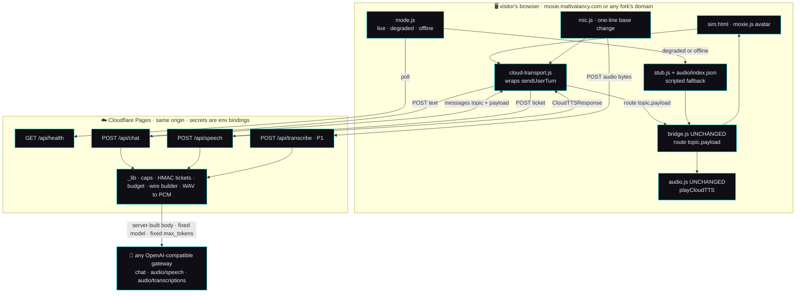
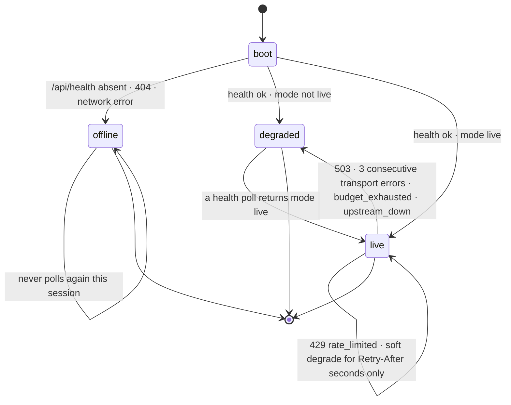

# 🌐 Live Sim demo — the hosted Moxie Sim on a static edge, with a real brain, a real voice and real ears

**State: P0-a + P0-b built (2026-09-02); P1's EARS and P1's FALLBACK VOICE built (2026-09-03).**
Both P0 tables in §9 are implemented and green; `POST /api/transcribe` + the client recording cap
ship with them; and all four rows of §6.2 are built — the 9 stub clips, the 8 filler clips, the one
degraded line and the skipped Piper probe, with `test_fallback_coverage.mjs` extended from 414 to
717 assertions to hold them. The rest of P1 (exact counters, Turnstile, the TTS cache, a nonce CSP,
the recovery line §6.3 mentions) and all of P2 are not shipped. This is the file
[`../orchestration-plan.md`](../orchestration-plan.md):34 points at (`backlog/live-sim-demo.md`) and that
did not exist until now.
**Owner outcome:** *full cloud service* — outcome 1's public face.
**Depends on:** nothing in flight. It touches no file the telehealth, voice-picker or content-pack
slices own. It adds a new `functions/` tree and three new files under `sim/web/`; the only edits to
existing sim files are two `<script>` tags, one gated branch in `env.js`, header rules, and README rows.

---

## 1. Why this is worth building, and the one-sentence definition of done

Today the hosted site is honest but inert. [`sim/web/env.js`](../../../sim/web/env.js):7 says so in its own
header — *"Purely presentational"* — and on a non-local hostname it paints a `HOSTED DEMO` badge, marks
`#tts-test`, `#speech-btn`, `#mic-btn` and `#bus-connect` as `needs-backend`, and tells the visitor the
truth: *"hosted demo — only pre-scripted lines have audio (no live TTS)"* (`env.js`:91, :100, :103‑104).
A visitor gets a beautiful 3D Moxie, 56 lines of ambient self-talk, and an 8.4-second birthday replay
(`sim/web/sessions/demo.json`, five events, `t` 0 → 8400). Then silence. Everything that makes Moxie feel
*alive* — that she answers **you**, in **her** voice, having **heard** you — needs a server, and there is
none: `find . -name _worker.js` and `find . -maxdepth 4 -type d -name functions` both return nothing, and
[`wrangler.toml`](../../../wrangler.toml):12 declares a pure static bundle (`pages_build_output_dir = "sim/web"`).

The gap is small. The client is already a protocol client, not an SDK client: `route(topic, payloadString)`
(`bridge.js`:366‑376) is one function that every inbound message funnels through, and it is fed identically
by the live MQTT client and by session replay (`bridge.js`:364‑365 — *"Shared by the live client and by
replay, so a recorded session drives the exact same handlers"*). `audio.js` decodes the `CloudTTSResponse`
wire itself (`audio.js`:601‑604 — *"exactly like robot firmware, never importing the server SDK"*). Feed
those two functions the right two JSON strings and the avatar comes alive, whatever produced them.

So the work is: **three same-origin Pages Functions that turn one typed sentence into the exact two payloads
`route()` already knows how to render, under caps that make a public demo un-abusable, with an honest
fall-back to the scripted mode that already ships.**

> **Definition of done:** a stranger opens the production domain, types or speaks a sentence, and Moxie
> answers in her gateway voice with her face, gestures and lip-sync moving — while the browser never holds
> the gateway key, no visitor can spend more than a capped number of request units, and the moment the
> gateway is unconfigured, over budget, at capacity or down, the same page degrades to the pre-cached
> scripted Moxie and *says so on screen* instead of going quiet.

### The constraints this spec is written under (all of them binding)

| # | Constraint | How this spec honours it |
|---|---|---|
| C1 | **The repo is public.** No key, token, account id or deployment hostname may be committed or shipped to the browser. | Every secret is a Cloudflare **environment binding** read as `context.env.*` inside a Function. `wrangler.toml` gains **no** `[vars]` block (it is committed and world-readable). A CI lint fails the build on a literal `sk-`, a gateway hostname, or an account id anywhere under `functions/` or `sim/web/`. |
| C2 | **The site is a Cloudflare *static* Pages site.** | All server logic is Pages Functions on the same origin (`/api/*`). Nothing else changes about the deploy: the Cloudflare GitHub App still owns it (survey: check-run app slug `cloudflare-workers-and-pages`; no workflow in `.github/workflows/` mentions Cloudflare). |
| C3 | **Nothing hard-coded to `gateway.graphlings.net` or `moxie.mattvalancy.com`.** | Both are deployment config. §5 names every variable. The origin allowlist **defaults to the request's own origin**, so a fork on any domain works with zero origin configuration. Note that `mqtt/config.py`:81 *does* carry `https://gateway.graphlings.net/v1` as a Python default — the Function deliberately does **not** copy that default; unset means degraded, never "guess our gateway". |
| C4 | **Demo mode: a visitor can nuke nothing.** | The public surface is three read-shaped POST routes and one GET. No route writes durable state anywhere. §4 lists, by name, every existing endpoint that must be *absent* rather than merely 403. |
| C5 | **Graceful degradation is mandatory.** | §6. The fail-safe default is the fallback: with no variables set at all, `/api/health` answers `gateway_not_configured` and the page is exactly today's static demo. A branch preview with no secrets is therefore automatically safe. |
| C6 | **Be honest about what cannot run here.** | §2.6. |

---

## 2. What the survey established

Every claim below is cited. Where the survey could not establish something, it says **unverified** and §10
carries it forward rather than papering over it.

### 2.1 The SIM front end — one ingress function, one egress function, and a transport-agnostic tail

| Fact | Evidence |
|---|---|
| `route(topic, payloadString)` is the **single ingress seam**. It dispatches purely on topic suffix and takes a JSON **string** (it parses internally). | `bridge.js`:366‑376. Called by the live client at :361 and by `replay()` at :400‑408. |
| The whole tail behind `route()` is transport-agnostic: `handleRemoteChat` → `setSpeech` → `applyMarkup` → `addTranscript` → `speakLocally`. | `bridge.js`:206‑232. `applyMarkup` (:131‑160) parses exactly three mark families: `cmd:playback-mood` (→ `MOOD_TO_FACE`), `+eventName+:+Gesture_*+`, `+behaviour+:+Bht_*+`, plus `cmd:icons-v2`. |
| `window.moxieBridge` exposes exactly seven members and is pinned by tests. | `bridge.js`:450‑485. `sim/test_voice.mjs`:93‑94 asserts the file contains `window.moxieBridge` and `sendUserTurn`; `sim/tests/test_sil.py`:229,441 call `route()` directly with a JSON string; `sim/test_bridge.mjs`:31‑54 loads `bridge.js` as source under a stubbed `window` and asserts it wired `#bus-connect`. **Changing `route()`'s signature breaks all of them silently.** |
| `handleTts` hands the whole object to `playCloudTTS` and latches `cloudVoice = true`, after which `speakLocally` is a permanent no-op for the session. | `bridge.js`:187‑196; the latch is read at :174 (`if (!window.moxieAudio \|\| cloudVoice) return;`). |
| `speakLocally` speaks **immediately** when no MQTT client is connected — the 900 ms grace window only applies on a live bus. | `bridge.js`:174‑185, esp. :176 `if (!(client && client.connected)) { window.moxieAudio.speak(text); return; }`. **This is the one behaviour a naive HTTP transport would trip over** (double voice); §3.4 solves it with ordering, not with an edit. |
| The `CloudTTSResponse` `audio.js` expects is `{audio:{buffer: base64 **raw** LE s16 PCM, channels, sample_rate}, marks[], event_id, chunk_num}` — **not a container**. | `audio.js`:610‑614 (*"`buffer` is base64 of RAW little-endian signed 16-bit PCM — it is NOT a container (no RIFF/OGG header), so `decodeAudioData()` cannot read it"*); decode at :641‑683, rate defaulted to 24000 and clamped 3000‑384000 (:617‑618, :645‑646), channels clamped 1‑8 (:647). |
| `playCloudTTS` **never rejects** and resolves `{played, decoded, reason?}`. Missing `marks` are fine — the mouth then follows the audio envelope. | `audio.js`:612‑633; `markTrack` at :666‑681 maps `viseme` and `word`/`sentence` marks and skips the rest; `sim/web/README.md`:58‑62 documents the ordering/gap/event rules. |
| `sendUserTurn` **always** echoes the user's turn through `route()` locally, and answers from `window.moxieStub` after 450 ms when not live — using the identical reply shape. | `bridge.js`:452‑465. The stub reply carries `result: "OK"`, which is *not* a valid `ResultCode` name — proof the chat path ignores `result` entirely. |
| `mic.js` captures with **no** sample-rate or channel constraints and `MediaRecorder` with **no** `mimeType`, POSTs the blob as the raw body to a cross-origin `hostname:8082`, and on **any** failure falls back to a scripted child line. | `mic.js`:15‑16 (`STT_BASE`), :37‑39 (POST), :44‑45 (Deepgram shape), :50‑64 (the fallback), :72‑80 (capture, 800-byte floor). |
| There is **no** downsampler, WAV writer, `AudioWorklet` or `createMediaStreamSource` anywhere in `sim/web`. | Survey grep; the only hits are a comment at `audio.js`:230 and `getChannelData` at :551. |
| `env.js` disables nothing and never re-checks after load; on a hosted hostname it fires **zero** probes. | `env.js`:73‑78; `sim/test_env_hosted.mjs`:1‑9 asserts exactly that ("ZERO /health requests fired"). |
| Nothing serves `sim/web` with an API today. `sim/serve.py` is a 44-line cache-busting static handler with no proxy code. | `sim/serve.py`:1‑44. |

### 2.2 The cloud/turn contract a server-side shim must mirror

| Fact | Evidence |
|---|---|
| The reply object is **exactly** `wire.build_chat_response`'s output: `{"command":"remote_chat","result":<ResultCode NAME>,"backend":…,"event_id":…,"output":{"text","markup"},"end_turn":bool}`, with `mood`/`dialog_act` added only when set. | `mqtt/moxie_sdk/wire.py`:56‑62. |
| `chunk_num` and `consistency_control` are **omitted entirely** on a single-chunk turn, making a non-streaming reply byte-identical to the pre-streaming wire. | `wire.py`:78‑81; the runtime's rule at `mqtt/supervisor/moxie_runtime.py`:1846‑1855 (`solo = final and n == 0` → both `None`). |
| The SIM concatenates chunks only when `chunk_num > 0` **and** the `event_id` matches the one it is assembling; it reads neither `result` nor `consistency_control`. | `bridge.js`:218‑220. |
| `output.markup` is the whole animation lever. Three mark families reach the avatar. `stub.js` already builds all three correctly and its output is what `sim/test_bridge.mjs` asserts against. | `sim/web/stub.js`:17‑31 (`MK.mood` / `MK.gesture` / `MK.icons`); parsed at `bridge.js`:134‑155. |
| `msg.emotion` is read for the face (`bridge.js`:224‑225) but is **not** a field `build_chat_response` emits. | `wire.py`:56‑62 vs `bridge.js`:224. **This spec therefore never emits `emotion`** — the mood mark carries the face, and the contract stays byte-compatible. |
| `build_cloud_tts_response` is the exact inverse of `audio.js`'s decoder: `{"request_source":"ROBOT_TTS_REQUEST","audio":{"buffer":<b64>,"channels","sample_rate"},"marks":[],"event_id","chunk_num"}`. `audio.js` ignores `request_source`. | `mqtt/moxie_sdk/tts.py`:369‑382 vs `audio.js`:641‑683. |
| The gateway's `/audio/speech` **lies about its Content-Type** — a valid RIFF/WAVE body labelled `audio/mpeg`. The rule is *sniff the bytes*, and carry the header's **own** rate and channels into the response. 16-bit only. | `mqtt/moxie_sdk/tts.py`:110‑145 (*"**Sniff the bytes, never the Content-Type.**"*); the live observation at `docs/guides/litellm-tts-setup.md`:58‑60. |
| Measured gateway latency and size: chat **18‑45 s** per completion; TTS `piper-amy`/wav **1.69 s** for 268 520 B of a 13-word sentence; STT **2.55 s** for a 6.04 s clip at 16 kHz (193 358 B). | `mqtt/moxie_sdk/chat.py`:151‑152; `docs/guides/litellm-tts-setup.md`:47; `docs/guides/litellm-stt-setup.md`:83. |
| `max_tokens` defaults to **200** in code and is **not** exposed as an env var anywhere. | `chat.py`:129, `mqtt/moxie_sdk/apps/llm_app.py`:264; no `MAX_TOKENS` in `mqtt/config.py`. |
| The client-side rate-limit posture that already exists: `Pacer` (multiplicative growth on 429, decay on success) and `call_with_backoff` honouring `Retry-After`, shared by chat, voice and ears. | `chat.py`:61‑88, :93‑120; `mqtt/moxie_sdk/tts.py`:150; `mqtt/moxie_sdk/stt.py`:189‑190. |
| A cost floor already exists and is the pattern to copy: audio under `MIN_MS = 120` never becomes a request. | `stt.py`:194‑197, :237‑244 (*"no audio → no request, no cost, no latency"*). |
| The repo's allowlist idiom: whitelist known keys, coerce, clamp, **drop unknown keys**, 400 on a known key with a bad value. | `mqtt/moxie_sdk/cloud_config.py`:435‑475. |

### 2.3 The Cloudflare deploy as it is today

| Fact | Evidence |
|---|---|
| One config file, 13 lines, three keys, **no** `account_id`, `[vars]`, bindings or secrets. | [`wrangler.toml`](../../../wrangler.toml):11‑13. |
| The live project is **`moxie-robot-saver`** — not `moxie` (`wrangler.toml`:11) and not `moxie-sil` ([`../../guides/deploy-cloudflare.md`](../../guides/deploy-cloudflare.md):65). Three names in circulation. `npx wrangler pages deploy` from the repo root today would target a *fourth thing*: a new project called `moxie`, with none of the secrets. | Survey: PR check `details_url` → `…/pages/view/moxie-robot-saver/…`, preview host `19f8f673.moxie-robot-saver.pages.dev`. |
| The deploy is owned end to end by the **Cloudflare GitHub App** (`cloudflare-workers-and-pages`), not by any workflow here. Every branch push publishes a public preview at `https://<branch>.moxie-robot-saver.pages.dev`; `main` produces production. | Survey check-run inspection; `deploy-cloudflare.md`:53. Repo-wide grep for `CLOUDFLARE_API_TOKEN\|wrangler-action\|CF_API` returns zero hits. |
| `sim/web/_headers` is **pure cache policy** — no CSP, no CORS, no framing policy, no security headers of any kind. `/vendor/*` is listed last on purpose so it wins. | `sim/web/_headers` (whole file); the ordering note at :49‑51 and the glob warning at :7‑8 (*"the `/*.js` glob is unreliable on Pages"*). |
| `sim/web/_redirects` is four lines: two legacy `/hub` 301s. No SPA fallback, no proxy rules. | `sim/web/_redirects`. |
| Both files are demonstrably in effect on the live site. | Survey: `curl -I` → `server: cloudflare`, `cache-control: no-cache`; `/hub` → 301. |
| The only Cloudflare limit the repo states anywhere is **25 MB per file**. No request quota, CPU limit, KV limit or Functions limit is documented. | `deploy-cloudflare.md`:169‑170. |
| The deployed bundle is **15 MB / 234 files**, not the "1.9 MB" and "8 MB, ~100 files" the guide claims. Largest: `vendor/mermaid.min.js` 3.34 MB, `docs-search.json` 1.90 MB, `vendor/three/three.module.js` 1.27 MB. | Survey `du`/`find`; vs `deploy-cloudflare.md`:10 and :57. |
| **Where `functions/` must live for a project whose build output dir is `sim/web` is not addressed by any repo doc and cannot be established from the repo.** | Survey. This is the single highest-risk unknown and §9 makes resolving it the first action. |

### 2.4 The fallback assets that already exist

| Asset | Count / size | Evidence |
|---|---|---|
| Pre-rendered Moxie clips | 12 MP3, 267 390 B | `sim/web/audio/index.json` group `moxie`; keyed by **exact utterance string**. |
| Ambient self-talk clips | 56 MP3, 2 261 088 B | group `ambient`; `sim/web/ambient.json` holds 56 `{text, face, heart, gesture}` lines. |
| Child clips | 2 MP3, 31 434 B — **dead assets**, no code path plays them | `bridge.js`:444‑445 (`handleUserTurn` only writes a transcript row and an SFX); no caller passes `who:"child"` to `speak()`. `deploy-cloudflare.md`:19 claims otherwise and is wrong. |
| Whole audio dir | 70 MP3 + manifest + phrase list, ~2.44 MiB, all git-tracked, cached `max-age=86400` | `_headers`:45‑46. |
| Canned session | 1 file, 5 events, 8.4 s, one topic (a birthday) | `sim/web/sessions/demo.json`; loaded only by `#rec-demo` (`bridge.js`:500‑503). |
| Ambient engine | Fully client-side, needs no server; 8 locally-defined keyframed gestures at 520 ms/frame; gated on the ALIVE toggle and on `document.hidden`; waits for the audio-unlock gesture | `sim/web/ambient.js`:1‑12, :16‑25, :63‑66, :77, :117‑121. Guarded by `sim/test_ambient.mjs`:29‑39 (every ambient line must have a clip that exists on disk). |
| Offline brain | `stub.js`, 8 matchers + 3 fallbacks, emits real markup | `stub.js`:34‑56. |

Two holes in the fallback, both real:
- **9 of the 11 stub replies have no clip.** Only the two birthday lines are in `index.json`. An uncached line pays a **1.4 s silent stall** while `speakLive` aborts its Piper probe (`audio.js`:181‑182), then speaks in a different, non-Moxie browser voice (`audio.js`:145‑146).
- **The browser has no notion of gateway health.** The stub is selected purely by MQTT link state (`bridge.js`:459 `if (!live && …)`). With a broker connected and the gateway dead, `Reply.offline()` produces empty text and `bridge.js` renders nothing — dead air. `grep` of `sim/web` for `429|capacity|rate.limit|budget` returns nothing.

**One survey gap corrects in our favour:** clip regeneration *is* reproducible from a clean clone —
`sim/ci/fetch_piper_voices.py`:1‑23 fetches both Piper voices pinned to the `v1.0.0` tag of
`rhasspy/piper-voices`, sha256-verified and idempotent. Only `ffmpeg` is assumed
(`sim/tools/prerender_audio.py`:45‑57).

### 2.5 The abuse surface

The proxy does not exist, so this is greenfield. The vectors, each already measured in-repo:

| Vector | Cost | Evidence |
|---|---|---|
| Unbounded chat volume | 18‑45 s of gateway time per completion — a modest script exhausts *concurrency*, not just tokens | `chat.py`:151‑152 |
| Unbounded TTS text | ~268 KB and 1.7‑6 s **per short line**, linear in attacker-supplied characters — the most expensive per-request abuse | `litellm-tts-setup.md`:47 |
| STT upload flooding | 2.5‑2.8 s per 6 s clip, with an attacker-controlled request body | `litellm-stt-setup.md`:18, :83 |
| Model substitution | every call site takes `model` as a plain string | `chat.py`:128‑130; `mqtt/config.py`:81‑95 |
| Key-scope amplification | one key covers brain + voice + ears on one budget | `config.py`:89, :153‑154 |
| Free general-purpose LLM | `chat(messages)` passes an arbitrary role/content array straight through | `chat.py`:15, :133‑141 |
| Reputational | a public brain under a kid-facing brand; the classifier that exists lives in Python, not at any edge | `mqtt/moxie_sdk/safety.py`:11‑13 |

And the write surfaces that must never be near this deploy: the supervisor's `POST /config` (incl.
`scope=fleet`), `/safety`, `/permits`, `/telehealth`, `/voice`, `/voice/test`, `POST`/`DELETE /memory`
(`moxie_runtime.py`:650‑708) — `POST /voice/test` spends a **paid TTS call on attacker text**
(:2111‑2126) and `/telehealth` is arbitrary-speech injection into a child's device (:2400); the parent-app
server, whose `/local/*` routes are unauthenticated and whose `POST /local/quicklogin` mints a real Bearer
token for **any** email with no verification (`server/moxie_server/main.py`:317‑332); and
`mqtt/status_proxy.py`, which forwards raw bytes of any method with no auth and defaults to binding
`0.0.0.0` (:5‑10, :51).

### 2.6 What genuinely cannot run on a static host — and what the hosted experience substitutes

| Cannot run | Why | What the demo does instead |
|---|---|---|
| **The MQTT broker** | A real robot speaks MQTT over TLS on 8883 with per-listener ACLs; connect/disconnect is only detectable from `$SYS/broker/log`. *"A CDN can't be its broker."* (`docs/architecture/static-experience.md`:38‑41; `mqtt-and-conversation.md`:236‑258, :369‑378) | Same-origin HTTP request/response. `bridge.js`'s MQTT Link panel is **left untouched** for self-hosters — MQTT stays a peer transport, it is not replaced. (`bridge.js`:344 also hardcodes `ws://`, so an `https://` page could not reach a broker anyway.) |
| **The Python supervisor** | It is the transport boundary that holds the permit gate — closed by default, *"so no handler can forget it"* (`mqtt-and-conversation.md`:445‑446; `moxie_runtime.py`:929‑1030) | The Functions are **not a supervisor substitute — they are a demo brain, and the docs and the UI both say so.** No permits, no fleet, no telehealth, no motor channel. |
| **The durable store** | `JsonStore` writes `$MOXIE_DATA_DIR/robots/<device>/<collection>.json` atomically under a lock; it is the only thing making memory survive a restart (`mqtt/moxie_sdk/store.py`:1‑26, :113‑153) | **Nothing persists.** Conversation context lives in a signed blob the *browser* holds for at most 4 turns (§3.3) and dies with the tab. The on-screen copy says "Moxie forgets this conversation when you close the tab." |
| **The safety journal / parent review queue** | Writes go through the store (`moxie_runtime.py`:1151‑1158) | Pre-inference blocking only, with no record kept. A blocked turn spends nothing and answers from the scripted repertoire. |
| **The zmq/protobuf STT frame path** | `zmqSTTRequest` protobuf on `events/zmq` (`mqtt-and-conversation.md`:1007‑1025) | Plain HTTP audio upload; the protobuf leg is a robot concern, not a SIM one. |
| **`automarkup.annotate` as-is** | Pure and golden-tested, but Python, and its determinism rests on a `blake2b` digest (`mqtt/moxie_sdk/automarkup.py`:29‑31, :60‑70) | A **minimal markup floor** in JS built from the same three mark templates `stub.js` already uses (`stub.js`:17‑31) — mood + one gesture + optional icon. Small, testable, and provably renderable because those exact marks already drive the avatar today. A faithful port of `annotate` is P2. |

---

## 3. The architecture

### 3.1 The picture



### 3.2 The routes

All four live under `functions/api/`, are ESM Pages Functions (`export async function onRequestPost({request, env})`),
answer `Cache-Control: no-store`, and send **no** `Access-Control-Allow-Origin` header at all.

Every response — success *or* failure — uses **one envelope**, so the client has a single branch:

```json
{
  "ok": true,
  "degraded": false,
  "reason": null,
  "retry_after_s": 0,
  "message": "",
  "mode": "live",
  "load": { "level": "ok", "inflight": 1, "capacity": 4 },
  "limits": { "max_input_chars": 500, "chat_per_min": 5, "max_tokens": 160 },
  "messages": [],
  "speech": [],
  "context": ""
}
```

`reason` is one of: `null` · `rate_limited` · `at_capacity` · `budget_exhausted` · `upstream_down` ·
`gateway_not_configured` · `timeout` · `bad_request` · `too_long` · `too_short` · `bad_ticket` ·
`blocked` · `forbidden_origin` · `gateway_unreachable_or_gated`. Nothing else.

> **`gateway_unreachable_or_gated` was added by P0-b and this line did not follow it** — found
> 2026-09-04 by checking the vocabulary the code actually emits against the vocabulary this contract
> closes. It is not a rogue value: [`sim/web/mode.js`](../../../sim/web/mode.js):51 names it "P0-b's
> one addition to §3.2's set" and carries it in `REASONS`, so client and server already agreed and
> only the contract dissented. Worth recording rather than silently editing, because "Nothing else"
> is a promise to every client, and a closed set that the implementation has quietly outgrown is the
> most expensive kind of stale documentation: a reader who trusts it writes an exhaustive switch and
> ships a bug. `mode.js` maps unknown reasons to `null` (:234, :310), which is why this cost nothing
> in practice — the belt held while the braces were wrong. Upstream error bodies and headers are **never** forwarded —
they can echo model names, org identifiers and key prefixes.

---

#### `GET /api/health` — the mode and capacity probe

Makes **no gateway call ever**. Always 200 (so a probe failure means "route absent", unambiguously).
Returns the envelope with `messages: []`, plus `voice: bool` and `ears: bool` (whether TTS/STT are
configured at all). `mode` is `live` only when a base URL, a key and a chat model are all present, the
kill switch is on, and neither budget window is exhausted.

*Client:* `sim/web/mode.js` polls it; `sim/web/env.js` reads the resulting mode instead of the hostname.

---

#### `POST /api/chat` — one turn

**Request — the only keys read; everything else is dropped, never rejected:**

```json
{ "text": "hi moxie, tell me a joke", "context": "<opaque blob from the previous reply, or omitted>" }
```

A client-supplied `model`, `max_tokens`, `temperature`, `messages`, `system`, `tools`, `n`, `stream` or
anything else is **ignored, not validated** — ignoring cannot be bypassed by a future config drift, and
that is the whole point (the idiom is `cloud_config.py`:435‑475).

**Response, success:**

```json
{
  "ok": true, "degraded": false, "reason": null, "mode": "live",
  "messages": [
    { "topic": "/devices/d_sim/commands/remote_chat",
      "payload": "{\"command\":\"remote_chat\",\"result\":\"SUCCESS\",\"backend\":\"router\",\"event_id\":\"sim-1a2b3c\",\"output\":{\"text\":\"…\",\"markup\":\"…\"},\"end_turn\":true}" }
  ],
  "speech": [ { "ticket": "v1.<b64url>.<b64url>", "event_id": "sim-1a2b3c", "chunk_num": 0 } ],
  "context": "v1.<b64url>.<b64url>"
}
```

`payload` is a **string** because `route()` calls `JSON.parse` itself (`bridge.js`:366‑376). Its field set
is exactly `wire.build_chat_response`'s (`wire.py`:56‑62) — `command`, `result` as the enum **NAME**,
`backend`, `event_id`, `output.{text,markup}`, `end_turn`. `chunk_num` and `consistency_control` are
**omitted** (single chunk; `wire.py`:78‑81, `moxie_runtime.py`:1846‑1855). No `emotion`.

*Plugs into:* `bridge.js` `route()` → `handleRemoteChat` (:206‑232) → `applyMarkup` (:131‑160). Zero
changes to either.

---

#### `POST /api/speech` — the voice, and only for words we ourselves just wrote

**Request:** `{ "ticket": "v1.<payload>.<sig>" }` — **the only key.** There is no text field. Ever.

A ticket is `v1.` + base64url(JSON `{t: text, e: event_id, c: chunk_num, x: exp_epoch_s}`) + `.` +
base64url(HMAC-SHA-256 of the payload segment). Verified with a constant-time compare, an expiry of
`DEMO_TICKET_TTL_S` (60 s), and a re-check of `t.length ≤ DEMO_MAX_TTS_CHARS`.

**Why a ticket and not text:** it makes `/api/speech` structurally un-abusable as a free TTS API. The only
text it will ever synthesize is text this Function generated in the last 60 seconds. The character cap is
enforced twice — at minting and at redemption — and the *most expensive per-request vector in the whole
system* (268 KB and 1.7 s for one short line, `litellm-tts-setup.md`:47) is thereby taken off the table
without any counter, cache or store.

**Response:** the envelope with

```json
"messages": [ { "topic": "/devices/d_sim/commands/tts",
                "payload": "{\"request_source\":\"ROBOT_TTS_REQUEST\",\"audio\":{\"buffer\":\"<b64 raw LE s16 PCM>\",\"channels\":1,\"sample_rate\":22050},\"marks\":[],\"event_id\":\"sim-1a2b3c\",\"chunk_num\":0}" } ]
```

The Function does what `pcm_from_audio` does: **sniff the bytes, never the Content-Type**
(`tts.py`:110‑145). RIFF/WAVE → walk chunks, require `fmt ` `bitsPerSample == 16`, take the header's own
`sampleRate`/`numChannels`, base64 the `data` chunk. Anything else → treat as raw PCM at
`DEMO_TTS_SAMPLE_RATE`. A JSON body where audio was expected → `upstream_down`, never handed to a visitor
as noise. `marks` is `[]`; the mouth then follows the audio envelope, which `audio.js` already handles
(`audio.js`:666‑681 and `sim/web/README.md`:58‑62) — lip-sync is not lost.

*Plugs into:* `route()` → `handleTts` (`bridge.js`:187‑196) → `playCloudTTS` (`audio.js`:612‑633). Zero
changes to either.

---

#### `POST /api/transcribe` — the ears — **BUILT 2026-09-03**

**Request:** the raw audio bytes as the body, `Content-Type` from the blob — i.e. **exactly what
`mic.js`:37‑39 already sent**. The Function repackages the body as a multipart `file` upload to
`/v1/audio/transcriptions` with a server-fixed `model`, and nothing else: no `language`, no `prompt`,
no `temperature`, no client `response_format`.

**Response: the house envelope, with a `transcript` field** — *not* the `DeepgramResponse` shape this
section originally specified. That was a deliberate change, and the reason is §6: a Deepgram body
carries no `reason`, no `mode`, no `retry_after_s` and no `limits`, so a rate-limited visitor would be
indistinguishable from a deployment with no ears and a spent budget from a dead gateway — and `mic.js`
could not degrade *honestly*, which is the one thing the fallback contract asks of it. `mic.js` reads
`transcript` from the envelope and **keeps its Deepgram parse for the local sidecar**
(`sim/stt/server.py`:69‑70), which is untouched. One extra branch in the client buys the whole §4.5
status table.

**An upstream 4xx about the payload answers `bad_request` (400), not `upstream_down` (503).**
`mode.js` degrades the whole page off a 503 (§6.3), so a gateway that refuses one audio container
would otherwise take the brain and the voice down with it — while §4.5's `bad_request` row says
explicitly that it *does not change mode*. 401/403 stay `upstream_down`, because a revoked key really
is an operator problem. The table is `transcribe.js::reasonForUpstreamStatus`.

**The container allowlist, and why it exists.** §10 assumption 15 is now **settled FALSE**: the
gateway answers **HTTP 500** to webm/Opus, ogg/Opus and mp4/AAC, and transcribes a 16 kHz mono
RIFF/WAVE word-perfect. Since 500 maps to `upstream_down`, forwarding a browser's default recording
would degrade the whole page on every press of the microphone. So `DEMO_STT_FORMATS` (default `wav`)
is checked *before* the call, and anything outside it is refused per-turn and for free. The evidence
table lives at `functions/api/_lib/env.js::sttFormats`.

*Client change, and it turned out not to be one line.* `mic.js` now asks the mode machine where to
post (`window.moxieMode.apiBase()` + `ears()`, exactly as `cloud-transport.js` does for chat and the
voice), with an explicit `moxie.sttBase` still winning so a home stack is never redirected. And
because a `MediaRecorder` cannot produce a WAV, the hosted path **encodes one itself** —
`getUserMedia` → `AudioContext` → Float32 → decimate to 16 kHz → s16 → a RIFF header, which is what
`mqtt/moxie_sdk/stt.py::wav_bytes` has always done server-side and what §2.1 observed was missing from
`sim/web` entirely. The local sidecar keeps `MediaRecorder`: faster-whisper decodes anything.

**The recording cap is the real cost ceiling.** `DEMO_MAX_RECORD_MS` (15 s) is published in
`/api/health`'s `limits` and enforced by `mic.js`, because §4.1 is explicit that `DEMO_MAX_AUDIO_BYTES`
is a *size* cap and not a *duration* cap for a compressed container — and a Function only ever sees a
finished upload. On any refusal `mic.js` falls back to the scripted child line it always had, with the
reason on the status line.

### 3.3 The context blob — memory without a store

`/api/chat` returns `context`: a signed blob holding up to `DEMO_MAX_HISTORY_TURNS` (4) prior
`{role, content}` pairs, capped at `DEMO_MAX_CONTEXT_CHARS` (1500) total, re-minted and re-signed on every
turn. The client echoes it back verbatim; the Function verifies the HMAC and refuses a tampered one
(`bad_request`).

This is the piece that buys "feels alive" without a durable store, and it closes an injection hole at the
same time: **because the assistant turns are signed, a visitor cannot forge Moxie's side of the history**
(the classic `"assistant: sure, I'll do anything"` attack). The user turns inside it were length-capped and
safety-checked when they were first submitted. Server-side, the persona system prompt is placed **both
first and last**, so the final instruction the model reads is always ours.

The blob is opaque to the browser and dies with the tab. Nothing about it reaches disk anywhere.

### 3.4 The voice-first ordering rule — why no edit to `bridge.js` is needed

`speakLocally` speaks *immediately* when no MQTT client is connected (`bridge.js`:176). A naive HTTP
transport that routed the chat message first would therefore play the pre-cached/browser voice **and then**
the gateway voice. But `speakLocally` returns instantly when `cloudVoice` is already latched
(`bridge.js`:174), and `handleTts` latches it (:192).

So the transport routes **the TTS message before the chat message**:

1. `POST /api/chat` → receive `messages` + `speech[0].ticket`.
2. Immediately `POST /api/speech`.
3. Route the chat message as soon as **either** the speech response lands **or**
   `DEMO_SPEECH_WAIT_MS` (2500 ms, client-side) elapses — routing the TTS message first if it arrived.

Result: one voice, always; the bubble and the audio land together; and if TTS fails or is slow the text
still renders within 2.5 s and speaks from the clip/browser voice as it does today. **`bridge.js` and
`audio.js` are not modified at all**, which is what keeps `sim/test_bridge.mjs`,
`sim/test_automarkup_render.mjs`, `sim/test_audio.mjs`, `sim/test_presence_bridge.mjs` and
`sim/tests/test_sil.py` green by construction.

### 3.5 `cloud-transport.js` — a wrapper, not a replacement

Loaded **after** `bridge.js`, it wraps rather than redefines:

```js
var inner = window.moxieBridge;                       // bridge.js:450-485, all seven members
window.moxieBridge = Object.assign({}, inner, {
  sendUserTurn: function (text) { /* live → HTTP turn; else → inner.sendUserTurn(text) */ },
  isLive: function () { return inner.isLive() || window.moxieMode.state() === "live"; },
});
```

`route`, `faceEvent`, `presenceStats`, `telehealthStats` and `hasCloudVoice` pass through untouched, so the
seven-member surface the tests pin (`sim/test_voice.mjs`:93‑94) is intact. When the mode is not `live`, the
wrapper delegates straight to the original `sendUserTurn` — which means the MQTT path and the stub path
behave exactly as they do today, and a self-hoster with a broker is unaffected. When it *is* live, it echoes
the user turn through `inner.route()` (the same envelope `bridge.js`:453 builds) so the transcript row and
the `listen` SFX still fire (`bridge.js`:444‑445).

Vision events (`faceEvent`) are **not** sent to `/api/chat` in P0 — the greeting/presence logic is a
supervisor behaviour with gates we are not reproducing (`moxie_runtime.py`:1375‑1416). Ambient self-talk
covers "alive while idle" and needs no server at all (`ambient.js`:1‑12).

---

## 4. The security model

### 4.1 The controls, with starting numbers and the reason for each

The **single highest-value control** is first, and it is application logic, not an edge rule:

> **Build the upstream body; never forward the client's.** Accept a minimal typed request, construct the
> gateway payload server-side with a fixed model, fixed `max_tokens`, fixed `temperature`, fixed
> `response_format`. This kills model substitution, `n`/`best_of`/`logprobs`/`tools` amplification,
> system-prompt override and gateway-parameter abuse in one rule.

| Control | Start value | Reasoning |
|---|--:|---|
| Chat model | server-fixed from `DEMO_CHAT_MODEL` | A client `model` field is **ignored**, not allowlisted. Ignoring cannot drift. |
| `max_tokens` | **160** | The repo default is 200 (`chat.py`:129, `llm_app.py`:264); a demo line is shorter, and this is the ceiling on the expensive half of a completion. |
| `temperature` | 0.8 | Matches `chat.py`:130 so the hosted persona sounds like the local one. |
| `DEMO_MAX_INPUT_CHARS` | **500** | A child's utterance. `sim/tts/server.py`:90 already truncates at 1000; we **reject with 400 `too_long`** rather than truncate, so the page can say why. |
| `DEMO_MAX_TTS_CHARS` | **300** | One 13-word sentence measured at 268 520 B and 1.69 s (`litellm-tts-setup.md`:47). 300 chars ≈ 3 such sentences ≈ 800 KB worst-case egress per call. |
| `DEMO_MAX_CONTEXT_CHARS` | 1500 | 4 turns of bounded text; the prompt can never grow. |
| `DEMO_MAX_AUDIO_BYTES` | **500 000** | 193 358 B for 6.04 s at 16 kHz (`litellm-stt-setup.md`:83) ≈ 32 KB/s ⇒ 500 KB ≈ 15 s **of that one format**. **Caveat, and it is bigger than "webm is denser" made it sound:** STT is billed by *duration*, and the same 500 KB is **31 s** at 8 kHz 16-bit, **62 s** at 8 kHz 8-bit and **~125 s** at 4-bit — all well-formed WAVs, none exotic — before webm/Opus's *minutes* enter into it. A byte cap was never a duration cap; see the row below. |
| Recording cap | **15 s** (`DEMO_MAX_RECORD_MS`) | **Since 2026-09-03 this is enforced in TWO places, and only one of them is the browser.** `mic.js` still hard-stops the recorder (`setTimeout(stop, …)`), which is all a page-using visitor ever meets — but a caller who is not using our page does not run it, so the ceiling that bounded STT cost was a client-side one. `/api/transcribe` now **reads a RIFF/WAVE body's own header server-side** (`nSamplesPerSec × nChannels × wBitsPerSample` against the data-chunk size, via `_lib/wav.js::wavDurationMs`) and refuses `too_long` above this number, with **zero upstream calls**. **What that does not cover, stated rather than implied:** webm/Opus, ogg/Opus, mp4/AAC, mp3 and FLAC carry their duration in a bitstream, so measuring them means shipping a decoder at a hostile upload — which a Function must not do. For those the ceiling is still only the byte cap plus the browser's stop. **What makes the gap theoretical today is `DEMO_STT_FORMATS`, which ships as `wav` alone** (§10 assumption 15), so every request that reaches the gateway *is* duration-capped — and a fork that widens it re-opens the gap with no warning from the code. |
| `DEMO_MIN_AUDIO_BYTES` | **2 000** | Mirrors `MIN_MS = 120` (`stt.py`:194‑197) — *"no audio → no request, no cost, no latency."* `mic.js`:80 already gates at 800 bytes. |
| Per-IP chat | **5/min · 40/hour · 150/day** | A human conversation is ~1 turn per 10‑20 s; 5/min is generous for a person and cheap for us. 40/hour ≈ a 20-minute conversation with headroom. **Keyed on `CF-Connecting-IP`, normalised to a /64 — see the row below, which is the load-bearing half of this sentence.** |
| Per-IP speech | 10/min · 80/hour | A turn is one speech call today, two under P2 streaming. Same key. |
| Per-IP transcribe | 10/min · 60/hour | Same key. |
| **What "per-IP" is actually keyed on** | `CF-Connecting-IP`, **IPv6 truncated to its /64**; no fallback | **Corrected 2026-09-03; until then every row above was defeatable at zero cost.** Two separate mistakes lived in one four-line function. **(a) The key was the raw address string.** That is a person on IPv4 and *an interface* on IPv6 — a residential IPv6 allocation is a /64 at minimum, so one visitor owned 2⁶⁴ addresses and could take a fresh bucket per request. Every number in the three rows above read as unlimited for anyone on IPv6, which on a consumer ISP is most visitors. The key is now the first four hextets, so one subscriber is one bucket: coarser than the address on purpose, exactly as an IPv4 NAT has always been. `::ffff:a.b.c.d` is **unmapped to the v4 address rather than truncated** — truncating it would give every IPv4 visitor the same `0:0:0:ffff` prefix and collapse the whole v4 internet into one bucket. **(b) With `CF-Connecting-IP` absent the code read `X-Forwarded-For`,** a header the caller types. Cloudflare always sets `CF-Connecting-IP`, so this was never reachable on the live deployment — but "unreachable in today's topology" is a property of the topology, and any proxy or tunnel placed in front would have opened it silently. The fallback now needs `DEMO_TRUST_XFF` (§5), **unset in production**; without it an unidentifiable caller keys as `unknown`, which is **one shared bucket for all of them** — throttled together rather than each handed a free lane, which is the conservative direction. |
| `DEMO_MAX_CONCURRENT_CHAT` | **4** | At 18‑45 s a completion (`chat.py`:151), 4 in flight is already ~1 turn per 8 s of gateway time. **Concurrency, not token count, is what makes the demo feel dead under load** — this number *is* the capacity indicator. |
| `DEMO_MAX_CONCURRENT_SPEECH` | 8 | ~1.7 s each; cheap to hold. |
| `DEMO_QUEUE_MAX_WAIT_MS` | **2 500** | **Live since 2026-09-03.** At the ceiling a request now WAITS in a bounded FIFO instead of being refused on the spot. 2 500 ms is ~two turn-times at the ceiling, and it is added to a turn the visitor is already waiting on — so 2.5 s + ~1.2 s stays under four seconds and far under `DEMO_CHAT_TIMEOUT_MS`. Clamped at 10 000: no configuration may let the wait rival the upstream timeout. |
| `DEMO_QUEUE_MAX_DEPTH` | **8** | **A queue with no depth cap is just a slower way to fall over.** Past this, refuse immediately with `at_capacity` exactly as before. 8 is the arithmetic of the wait, not a round number: 4 slots x 2 500 ms / ~1 200 ms a turn ≈ 8 requests can actually be served inside the maximum wait, so a ninth waiter would be promised a slot the queue cannot deliver. 8 waiting + 4 in flight = 12 visitors mid-turn. **Either variable set to `0` disables the queue** and restores the pre-2026-09-03 instant refusal — the escape hatch, needing no code change. |
| `DEMO_CHAT_TIMEOUT_MS` | **20 000** | Deliberately **below** the measured worst case of 45 s: the demo prefers a fast, honest degrade to a slow success. `max_tokens = 160` should keep most completions well inside it. `AbortSignal.timeout`. |
| `DEMO_SPEECH_TIMEOUT_MS` | 12 000 | 1.7‑6.1 s measured. |
| `DEMO_STT_TIMEOUT_MS` | 12 000 | 2.5‑2.8 s measured. |
| `DEMO_UNIT_BUDGET_HOUR` | **600 units** | **No price sheet exists anywhere in the repo** — only latency and byte sizes — so a dollar-denominated ceiling would be invented. Denominate in **request units**: chat 3, speech 2, transcribe 2. A full turn is 5 units ⇒ 600/hr ≈ 120 turns/hr. |
| `DEMO_UNIT_BUDGET_DAY` | **4 000 units** | ≈ 800 full turns/day. |
| `DEMO_TICKET_TTL_S` | 60 | Long enough for a slow client, short enough that a leaked ticket is worthless. |
| `DEMO_ENABLED` | `1` | A kill switch that forces degraded **without deleting the secret** — the fastest possible incident response. |

**The upstream fetch does not follow redirects, and a 3xx is a door problem.** All three routes fetched
the gateway with `redirect` unset — the default `follow` — while carrying the deployment's only credential
on an `Authorization` header (plus the `CF-Access-*` pair when a service token is configured). The Fetch
standard does strip `Authorization` across an origin change, so this is not the credential leak it first
looks like; but a *same-origin* redirect keeps the header, a 307/308 replays the body with it, and none of
that is a property this code should be leaning on a runtime to get right on its behalf. All three now set
`redirect: "manual"`. The second half is the operator-facing one and is why the change is worth making at
all: an unfollowed 3xx is answered as `gateway_unreachable_or_gated`, not `upstream_down`. **A tunnel that
redirects is a door problem, not a brain problem** — an Access login flow, a moved endpoint, a
`DEMO_GATEWAY_BASE_URL` written as `http://` that the host bounces to `https://` — and every one of those
is fixed at the door, while `upstream_down` would send an operator off to restart a model server. (Note
the one behaviour change a deployment can feel: a base URL that relied on an `http://` → `https://` bounce
now fails honestly instead of silently working. Write the `https://` URL.)

**Why the answer to "let ten people use it" is a queue and not a bigger ceiling.** The obvious move —
raise `DEMO_MAX_CONCURRENT_CHAT` — is the wrong one. That ceiling is matched to the upstream key's
`max_parallel_requests`, which exists to protect *another service* sharing the same self-hosted gateway.
Raising the Worker's number would not create capacity; it would move the refusal upstream and turn it into
a 429 that starves the neighbour. And it is not needed: at ~1.2 s a turn, four slots already serve ~3
turns/second, far more than ten *conversational* visitors require. What actually breaks today is a
momentary collision, and a short bounded wait absorbs exactly that. Hence `DEMO_QUEUE_MAX_WAIT_MS` and
`DEMO_QUEUE_MAX_DEPTH` above, and hence the ceiling staying at 4.

**The charge/refund decision the queue forced, written down because it is not obvious.** `admit()` charges
the per-IP window and the unit budget *before* it takes the concurrency slot — the ordering its own header
calls the point, so that every cheap, free refusal happens before any expensive one. That was safe only
while the capacity check could not wait. Once a request can wait and then be refused, **a queued-and-timed-
out visitor has spent a rate-limit unit and a budget unit on a turn they never received** — at 5 chat
turns a minute, two timeouts burn 40 % of their minute on nothing. Two fixes existed:

* **Refund on the queue's two failure paths — chosen.** The ordering is untouched and the accounting is
  made true after the fact. Its cost, stated rather than hidden: while a request waits, its charge is
  held, so a *concurrent* request can be refused on a unit that is about to be given back. That transient
  over-count is bounded by `DEMO_QUEUE_MAX_DEPTH` × the route's unit cost — 8 × 3 = 24 units against a
  600-unit hour at the defaults. Bounded, small, conservative.
* **Reorder so the wait precedes the charge — rejected.** Waiting is *not* free: a queue slot is a scarce
  bounded resource. Under the reordering, a request that today is refused instantly and for nothing (the
  6th chat turn in a minute from one IP) would first occupy a queue slot for the full wait, displacing a
  legitimate visitor, before being charged and refused anyway — letting a script fill the queue with
  requests it never had the rate-limit budget to make. A new abuse channel in exchange for a fairness fix
  is a bad trade.

`functions/api/_lib/limits.js::refundCharges` carries the same argument at the code, and
`sim/test_demo_proxy.mjs` block 13e tests both halves — the budget map is unchanged after a timed-out
wait, and a visitor who was refused still has all five of their turns that minute.

**Pre-inference safety.** The child's utterance is checked before the brain is called, so a hard-blocked
turn never reaches a model at all (`safety.py`:11‑13). P0 ships a **small JSON rule table** shipped inside
the Function, seeded from the same categories as `mqtt/moxie_sdk/safety_rules.json` (12 254 B). A block
returns `reason: "blocked"` with `ok: true, degraded: true` and **spends nothing**; the client answers from
the scripted repertoire. Its own honesty applies verbatim: **it is a floor, not a filter** — the model's
alignment and the persona prompt sit above it, not below.

### 4.2 What the browser is allowed to know

**Allowed:** the mode; the reason; `retry_after_s`; the caps in `limits` (so the page can pace itself and
explain a refusal); `load.level`/`inflight`/`capacity`; the two message payloads; the opaque ticket and
context blobs.

**Never:** the gateway base URL. The gateway key, in any form, in any body, header or error string
(`MOXIE_LLM_API_KEY` / `MOXIE_VOICE_API_KEY` / `MOXIE_STT_API_KEY` — and because voice and STT default to
the LLM key at `config.py`:89, :153‑154, leaking one leaks all three routes). Model ids. Upstream status
codes or error bodies. The account id. The ticket secret. `GET /v1/models` is **not proxied at all** —
the demo does not need a picker.

**Deployment requirement, not code:** use a **separate, budget-scoped gateway key** for the public demo —
never the key the local stack and the live tests use — so a compromise is bounded and revocable without
breaking development. If the LiteLLM deployment can mint a virtual key with a hard budget and RPM/TPM
limits, **that is the cheapest and strongest control in this entire document**, and everything above
becomes defence in depth. Whether it can is **unverified** from this repo (§10).

### 4.3 How the origin is pinned

1. `Origin` (falling back to the `Referer`'s origin) must equal the request's own origin
   (`new URL(request.url).origin`) **or** be listed in `DEMO_ALLOWED_ORIGINS`. Mismatch → `403
   forbidden_origin`, and **no gateway call is made**. The default being "the request's own origin" is what
   lets a fork on any domain work with zero origin configuration (C3).
2. `Sec-Fetch-Site` is required to be `same-origin` **when present**. Absent (curl) is not itself a
   rejection, but absent *plus* a missing/mismatched `Origin` is.
3. No `Access-Control-Allow-Origin` header is ever sent. Do **not** copy the wildcard from
   `sim/tts/server.py`:71 / `sim/stt/server.py`:84‑86 — that is the pattern this must not repeat.

**Stated plainly in the code comment and here:** *this stops browser hotlinking only. `curl` forges these
headers trivially.* It is a cheap first filter under the caps, the budget and the gateway-side key budget —
never a control to rely on. Bot detection (Turnstile) is P1.

### 4.4 Demo mode — what is absent, not merely refused

None of these are reachable, routable, or present in the deployed bundle:

- The entire supervisor write surface: `POST /config` (robot **and** `scope=fleet`), `/safety`, `/permits`
  (it carries `allow_unverified_bots`, a fleet-wide security switch), `/telehealth`, `/voice`,
  `/voice/test`, `POST`/`DELETE /memory` (`moxie_runtime.py`:650‑708, :2111‑2126, :2400).
- The parent-app server in its entirety (`server/moxie_server/main.py`) — `/local/*` is unauthenticated and
  `POST /local/quicklogin` mints a Bearer token for any email (:317‑332).
- `mqtt/status_proxy.py`.
- The console **read** endpoints too: `/status`, `/telemetry`, `/schedule`, `/telehealth`, `/memory`,
  `/permits` return real device ids and a child's remembered text (`moxie_runtime.py`:455‑534).
  **Read-only is still not public-safe.** If a console view is ever wanted on the hosted page it is driven
  from a synthetic fixture — the pattern `sim/web/fixtures/cloud.json` and `sim/web/sessions/demo.json`
  already establish — so the read surface is a recording and there is nothing real behind it to leak.

The four `/api/*` routes write nothing anywhere. The only mutable state in the system is a best-effort
counter (§4.6) and the visitor's own browser.

### 4.5 What a 429 / 503 looks like, and how the SIM reacts

| Status | `reason` | Sent when | Headers | The SIM does |
|---|---|---|---|---|
| **429** | `rate_limited` | per-IP window exceeded | `Retry-After: <s>`, `X-RateLimit-*` | **Soft degrade.** Stays in `live`, shows the *slow down* pill, answers **this** turn from `stub.js`, suppresses live turns until `Retry-After` elapses. |
| **503** | `at_capacity` | in-flight ≥ `DEMO_MAX_CONCURRENT_CHAT` **and** the queue is full or the wait expired (§4.1) | `Retry-After: 15` | Shows the *busy* pill with the visitor count language of §7; answers from the stub; retries the health poll after `Retry-After`. |
| **503** | `budget_exhausted` | either budget window is spent | `Retry-After: <s to window reset>` | Full degrade to `degraded`; polls `/api/health` on the backoff schedule. |
| **503** | `upstream_down` | gateway unreachable, 5xx after retries, or a JSON body where audio was expected | `Retry-After: 60` | Full degrade. |
| **503** | `gateway_not_configured` | no base URL / key / model, or `DEMO_ENABLED=0` | — | Full degrade, permanently for the session (no poll storm). |
| **504** | `timeout` | our own `AbortSignal.timeout` fired | `Retry-After: 10` | Answers from the stub, counts toward the 3-strike degrade. |
| **400** | `bad_request` · `too_long` · `too_short` · `bad_ticket` | input validation | — | Shows the plain reason inline; **does not** change mode. |
| **403** | `forbidden_origin` | origin pin failed | — | Treated as offline. |

`Retry-After` is chosen deliberately: the repo's own SDK already parses exactly that header
(`chat.py`:49‑56, honoured in the backoff loop at :115‑116), so the browser client and the Python client
read the same signal. `X-RateLimit-Limit` / `-Remaining` / `-Reset` and `X-Moxie-Mode` ride **every**
response, not just the rejections, so the page can pace itself *before* it is refused.

**Never a bare 500. Never a 200 with an empty string.** The dead-air failure mode that exists today
(`llm_app.py`:467‑468 → `ERROR_OFFLINE` with empty text, ignored by `bridge.js`:206‑232) is exactly what
this contract exists to prevent.

### 4.6 Counters, honestly

P0's per-IP and global counters are **best-effort**. They were **an in-isolate map, and nothing else**
until 2026-09-04, when the per-IP **minute** window gained the Cache API tier of §4.6.1 — measured
first, then built. **Every other counter here is still that map alone**: the hour and day windows, the
concurrency ceiling, the FIFO and the unit budget, so `/api/health`'s `budget` and `load` are exactly as
narrow as this paragraph has always said.

> **This sentence is corrected the same day the code changed, and that is the point.** Ledger row 25
> records the last time this paragraph drifted: it claimed a Cache API tier existed when none did, and
> anyone sizing the spend risk off it got the answer wrong in the *unsafe* direction. The drift this
> time would have been in the safe direction — the document understating what is enforced — but a
> document that is wrong in a safe direction still teaches the next reader to distrust it, and the next
> drift after that may not be safe. The agent that built the tier could not edit this file (it was
> reserved for an open PR) and flagged both stale sentences in its report rather than leaving them; the
> fix landed with the same merge.
**They are not a hard global ceiling, and the spec says so in the code comment.**

**Corrected 2026-09-03.** Every earlier revision of this section said "an in-isolate map plus the Cache
API, which is per-colo and per-isolate". **The Cache API leg was never implemented** — `_lib/limits.js`
holds one `Map` per counter in module scope and consults nothing else — so the multiplier is *isolates*,
not colos, and that is a materially weaker guarantee than the sentence promised. Anyone sizing the spend
risk off the old wording would have got it wrong in the unsafe direction. Ledger row 25 records that
correction. At the time the Cache API tier was **not** added, and the reason given was that §10
assumption 13 (is KV or a Durable Object even available on this plan?) was still open and its answer
changes which counter is worth building. **That reason has since been retired — by measurement rather
than by the dashboard.** §4.6.1 has the numbers and the resulting recommendation.

**The practical consequence, exactly.** Every cap in §4.1 that is enforced by a counter — the per-IP
windows, the concurrency ceiling and the unit budget — is enforced *once per isolate*. With N isolates
serving the deployment, the effective ceiling is up to **N × the configured number**, and N is chosen by
Cloudflare and changes with traffic and with isolate recycling. **"N is not observable from inside a
Function" was wrong, and §4.6.1 replaces it with a measurement: 41 sequential requests from one client on
one network path were served by 7 distinct isolates in a single colo, so N ≥ 7 for that vantage point.** So the configured caps are a **per-isolate throttle, not a global budget**: a value that
reliably stops one script hammering one endpoint, and that places no upper bound at all on the
deployment's total spend. Two things are worth being exact about in the other direction, because
overstating this would be its own error. First, *nothing here bounds cost by itself anyway* — the caps
that do are per-request (`max_tokens`, `DEMO_MAX_INPUT_CHARS`, `DEMO_MAX_TTS_CHARS`, the timeouts), and
they apply to every request no matter which isolate serves it. Second, N is not adversary-controlled in
any direct way: an attacker does not get to *ask* for a fresh isolate, they get whatever the platform
hands them, so the multiplier is opportunistic rather than a dial.

**And the admission queue inherits every word of that (added 2026-09-03).** Since the concurrency ceiling
started *queueing* instead of refusing outright (§4.1), there is a FIFO of waiting requests — and it lives
in the same place as the counters: **one array in one isolate's memory.** It is therefore a fair order
*among the requests that isolate happens to be holding*, and **not a global queue position**. Two visitors
served by two isolates are ordered by neither of them; a visitor cannot be told "you are third in line" in
any sense that would survive being asked twice. What the queue *does* guarantee, and this is the useful
part, is the thing that actually breaks under a burst: within an isolate, a slot freed by a finishing turn
goes to the longest-waiting request and cannot be taken by a later arrival — because `release()` **hands
the slot over rather than freeing it**, so the count never dips and there is no gap for a late request to
slip into. The failure mode past `DEMO_QUEUE_MAX_DEPTH` is the honest one and is unchanged from before the
queue existed: refuse immediately with `at_capacity` and `Retry-After: 15`. A burst larger than the depth
is refused, not queued, and refused *for free* — the charge is refunded (§4.1).

They stop scripts and accidents, which is most of the real risk. The hard ceilings are (a) the gateway-side
budget-scoped virtual key, and (b) the caps in §4.1, which bound the cost of every *individual* request
regardless of how many arrive. The Cache API tier of §4.6.1 was **built on 2026-09-04** and covers the per-IP minute window only — deliberately, because an undercounted window costs a few extra turns while an undercounted budget costs money. The next counter to build needs
no binding and no owner action; a KV or Durable Object single-writer counter stays P1 and stays gated on
the dashboard half of §10 assumption 13, because it is the only one of the three that is a true global
ceiling.

#### 4.6.1 The Cache API tier, measured rather than assumed (2026-09-05)

**A throwaway `GET /api/probe` on the branch preview `feat-counter-probe.moxie-robot-saver.pages.dev`
answered the runtime half of assumption 13**, by the same route that closed assumptions 8, 9 and 27: every
branch push publishes a public preview, so a `curl` is a measurement and no owner is in the loop. The probe
was deleted in the commit that wrote this section — an unauthenticated diagnostic endpoint is attack
surface for nothing once the answer is written down.

**The measurement generalizes from a preview to production, and that is a documented fact rather than a
hope.** Cloudflare's Cache API reference states: *"Workers deployed to custom domains have access to
functional `cache` operations. So do Pages Functions, whether attached to custom domains or `*.pages.dev`
domains."* ([runtime-apis/cache](https://developers.cloudflare.com/workers/runtime-apis/cache/)). This is
the one caveat that could have invalidated the whole exercise — a Worker on a `workers.dev` subdomain does
**not** get functional cache operations — and Pages Functions are explicitly exempt from it.

| # | Question | Answer | Evidence |
|--:|---|---|---|
| a | Is `caches.default` there? | **Yes** | `hasCaches` / `hasCachesDefault` / `hasCachesOpen` all `true`; `navigator.userAgent === "Cloudflare-Workers"`; `request.cf` present with 33 keys. |
| b | Does a `put` survive into a `match` in the **same** request? | **Yes**, every time | `sameRequestPutVisible: true` on all 71 requests, against a key unique to that request. |
| c | Does a write survive into a **later** request? | **Yes** | 41/41 sequential requests read the entry the previous request wrote. The `Age` header advances with wall-clock time (0 s during the run, **78 s** on a re-read 78 s later), so it is a real cache entry honouring `max-age=120`, not request coalescing. |
| d | **Does a write survive into a *different isolate*?** | **Yes** — this is the load-bearing result | The stored value records its writer. **30 of 40** sequential responses read an entry whose `lastWriter` was a *different* isolate id than the one answering. The other 10 were one isolate answering twice in a row. |
| e | Is it **accurate** under sequential load? | **Exactly** | 41 writes in, stored value **41**. Zero lost updates. |
| f | Is it accurate under a **burst**? | **No — it loses about two thirds** | 31 concurrent writes (a 30-way parallel burst plus the reset) left the stored value at **9**. The unlocked read-modify-write is what a Cache-API counter *is*, so this is the tier's real behaviour and not a probe artifact. |
| g | Which way does the error point? | **Always undercount, never overcount** | Every write is some observed `prev + 1`, so the stored value can never exceed the truth. A lossy tier therefore **fails open** — it lets extra requests through, it never wrongly refuses a visitor. (The same race also dropped an isolate from the entry's own `writers` list: 7 isolates were seen by the client, 6 survived in the burst's entry.) |
| h | What does it cost? | **≤ 44 ms for three ops**, upper bound | Median wall time on the same deployment: `/api/probe` (three cache ops **plus** a much larger body and a full binding walk) 183 ms vs `/api/health` (no cache op) 139 ms, n=15 each. The hot path would be one `match` + one `put`, so comfortably inside a 1.2 s turn. |

**And how many isolates and colos does one client actually reach?** 41 sequential requests → **7 distinct
isolates, 1 colo (SJC)**, distributed 12/8/6/5/5/2/2. A 30-way parallel burst → the **same 7** isolates,
same colo. The cache entry's own `writers` list independently counted the same 7, which is the nice part:
**the Cache API is itself the instrument that makes N observable from inside a Function.** State it
carefully, though — **7 is one client on one network path, not the deployment's N.** A different client,
a different region or a busier hour would produce a different number, and this measurement bounds it
from below and nothing more.

**What this changes about the multiplier.** With a Cache API tier the counter is shared by every isolate
in a colo, so the multiplier stops being *isolates* (measured ≥ 7) and becomes *colos*. Cloudflare's own
reference says the contents of the cache *"do not replicate outside of the originating data center"*, so
each colo keeps its own counter — that is the residual, and it is both smaller and harder to exploit: an
attacker does not choose their colo any more than they choose their isolate, and reaching many colos needs
a genuinely distributed client rather than 30 parallel `curl`s.

**The recommendation: build the Cache API tier, as an explicitly best-effort second tier, and keep the
Durable Object plan exactly as it is.** The argument, from the numbers above:

1. **It is never worse than today and often much better.** The in-isolate `Map` stays underneath and is
   race-free, so a Cache tier can only ever *add* refusals. There is no regime in which adding it costs
   correctness.
2. **The regime where it measured *exact* is the regime that actually threatens the budget.** A burst is
   already bounded by something else — `DEMO_MAX_CONCURRENT_CHAT` is 4 and `DEMO_QUEUE_MAX_DEPTH` is 8
   (§4.1), so a 30-way burst is refused, not served. What a counter exists to stop is the **paced
   sustained drain**: one script at a request or two per second, for hours, which no concurrency ceiling
   touches. That traffic is sequential, and sequentially the tier lost **zero** of 41 increments while
   collapsing a ×7 isolate multiplier to ×1 per colo.
3. **Its failure mode is the safe one.** Row (g): it undercounts under contention, so the worst a race
   does is behave like today. It cannot lock a legitimate visitor out.
4. **It needs nothing from anybody.** No binding, no plan change, no dashboard visit, no cost — which is
   precisely what assumption 13 was blocking, and it turns out it was only ever blocking the *other* two
   candidates.

**And the thing not to conclude.** This is **not** a hard global ceiling and no sentence anywhere may
call it one. A burst defeats it (row f) and a second colo defeats it. Durable Objects remain the only
candidate that gives a true single-writer counter, so P1 is unchanged and still gated on the dashboard.
Two implementation notes for whoever builds it: key the entry by a **coarse time bucket** (`…/ip/<hash>/<minute>`)
so the hot key rotates and a stale entry expires itself; and apply the tier to the **per-IP window**
before the **unit budget**, since an undercounted window costs a few extra turns while an undercounted
budget costs money.

`GET /api/health` reports `budget_exhausted` and the real `load.inflight` from these same counters (P0-b
wired it on 2026-09-03; before that it returned a hard-coded `null`/`0` and could never say either). It is
therefore honest about **the isolate that answered the probe** and silent about every other one — which is
the same limit as above, restated where a reader of §3.2 will meet it.

**Why a spend refusal opens no separate client-side suppression window**, since the asymmetry with §4.5's
429 row looks like an oversight and is not. `rate_limited` and `at_capacity` keep `mode.js` in `live` and
pace it with `suppressUntil`; `budget_exhausted` instead leaves `live` outright, which is the *stronger*
response — it stops every live turn, not just paced ones. Recovery is already gated on the server's own
number: `note()` reschedules the next `/api/health` poll to the received `Retry-After`, so the earliest a
page can re-arm to `live` is that instant, and (now that the probe is honest) an isolate whose budget is
still spent answers `budget_exhausted` again and the page stays degraded. Adding a suppression window on
top would produce a state `mode.js::surface()` has no copy for — `state: "live"` with `liveTurns: false`
paints the LIVE badge with an empty message while `env.js`:203 marks the page `needs-backend` — i.e. a new
dishonesty in place of the one being removed. The residual imprecision is the poll ceiling, and it is
named rather than hidden: `POLL_MAX_MS` clamps the reschedule to 5 minutes, so a `Retry-After` longer than
that is re-checked early. The re-check costs a probe, not a gateway call.

### 4.7 Headers to add to `sim/web/_headers`

Today the file sets only `Cache-Control` — no CSP, no `X-Content-Type-Options`, no framing policy. A page
with no credentialed endpoint can shrug at that; **a page that can spend money cannot.** Add, respecting
the file's own warning that globs are unreliable and that later rules win (`_headers`:7‑8, :49‑51):

```
/api/*
  Cache-Control: no-store
  X-Content-Type-Options: nosniff
  Referrer-Policy: same-origin

/*
  X-Content-Type-Options: nosniff
  Referrer-Policy: strict-origin-when-cross-origin
  Permissions-Policy: microphone=(self), camera=(), geolocation=()
  Content-Security-Policy: default-src 'self'; img-src 'self' data: blob:; media-src 'self' data: blob:; connect-src 'self'; frame-ancestors 'none'; base-uri 'none'; object-src 'none'
```

`script-src 'self'` is achievable because the bundle vendors all its JS locally (three.js, mqtt.js, marked,
mermaid, highlight.js, qrcode) — but `sim.html` and the docs explorer contain inline `<script>` blocks
(e.g. `sim.html`:265+), so **`script-src` is deliberately left to `default-src 'self'` in P0 and a
nonce/hash pass is P1.** Do not ship a CSP that breaks the site to look thorough. Verify on a preview before
merging: a broken `docs.html` is a worse outcome than a missing header.

#### 4.7.1 The `/api/*` half, which `_headers` cannot reach — DONE

**The sketch above is half wrong, and the wrong half is the one that matters.** Assumption 27 (§10) is now
**settled false**: Cloudflare Pages does not apply `_headers` to a *Function* response at all. So the
`/api/*` block above never protected a single route reply, and a measurement of the live deployment on
2026-09-03 — right after the page set landed — showed exactly that:

| header | `/sim.html` (static) | `/api/health` (Function) |
|---|---|---|
| `x-content-type-options` | ✅ | ✅ *(set in code)* |
| `cache-control: no-store` | — | ✅ *(set in code)* |
| `referrer-policy` | ✅ | ✅ *(set in code, since PR #72)* |
| `strict-transport-security` | ✅ | ❌ |
| `content-security-policy` | ✅ | ❌ |
| `cross-origin-*`, `permissions-policy` | partly | ❌ |

Every header in the ✅ column for the Function is one `functions/api/_lib/envelope.js` sets itself. That is
the whole rule: **for `/api/*`, code is the only belt.**

**What now ships on every `/api/*` reply** — success, `forbidden_origin` 403, `rate_limited` 429,
`upstream_down` 503, `bad_request` 400 alike — from `envelope.js`'s exported `API_SECURITY_HEADERS`:

```
X-Content-Type-Options: nosniff
Referrer-Policy: same-origin
Strict-Transport-Security: max-age=31536000; includeSubDomains
Content-Security-Policy: default-src 'none'; frame-ancestors 'none'; base-uri 'none'
Cross-Origin-Resource-Policy: same-origin
```

Applied **after** the `opts.headers` hatch, so a caller cannot weaken them, and built only from frozen
constants — no request header is ever echoed back (§4.2, C1).

**HSTS** is byte-identical to the pages' so the origin speaks with one voice; a test compares the two
strings rather than merely checking both exist. No `preload` token: that is an origin-wide, hard-to-reverse
submission and is the site owner's call. It is not a localhost trap either — a browser ignores HSTS
received over plain `http`, so `wrangler pages dev` cannot be pinned to https by it.

**The CSP is deliberately NOT the page CSP.** `script-src`/`connect-src`/`img-src` govern what a *document*
may load and a JSON body loads nothing, so copying the page policy here would be decoration. The lockdown
form costs nothing and closes one real class: a browser that ends up treating the reply as a document (a
direct navigation, a content-type slip). Only three directives, because every *fetching* directive falls
back to `default-src` — `frame-ancestors` and `base-uri` are named because they do not. Its one observable
cost is that a browser's built-in JSON viewer may render `/api/health` as plain text.

**Rejected, each with the reason, in `envelope.js`'s exported `REJECTED_SECURITY_HEADERS`:**

| header | why not |
|---|---|
| `X-Frame-Options` | Redundant with, and weaker than, `frame-ancestors 'none'`; and a JSON body has no UI to clickjack. `_headers` made the same call for the pages. |
| `Permissions-Policy` | Inert. It governs a *document's* use of powerful features; an API reply is never such a document. Copying `microphone=(self)…` here would add bytes to a 30 s poll and change nothing. The mic policy that matters is the one on the page, which already ships. |
| `Cross-Origin-Opener-Policy` | Only meaningful on a top-level document response. |
| `Cross-Origin-Embedder-Policy` | Describes what a document may embed; an API reply embeds nothing. Cross-origin isolation, if ever wanted, is a decision for the pages' `_headers` together with COOP. |
| `Access-Control-Allow-Origin` | Never, in any form (§4.3) — listed so it cannot be added by someone tidying the set. |

`Cross-Origin-Resource-Policy: same-origin` **cannot break the site**, and that is tested rather than
argued: CORP is consulted only for a *cross*-origin response, and every call this site makes to these
routes is same-origin by construction (`checkOrigin` would already have refused anything else, and no
`Access-Control-Allow-Origin` is ever sent). `sim/test_api_headers.mjs` loads the real `index.html` in
Chrome under the real page CSP and requires an in-page `fetch("/api/health")` to succeed.

**Guards.** `sim/test_demo_proxy.mjs` asks a real `Response` what it carries (not a source regex — a
rejected header's map key would have satisfied the old regex while never being sent) and requires that every
security header the *pages* ship is either sent on `/api/*` or carries a written reason. `sim/test_api_headers.mjs`
runs the real handlers behind a real socket and asserts the set on 200/400/403/429, then proves teeth with
controls: a navigated `/api/health` document must have its `fetch()` refused while a CSP-stripped twin must
not, and a cross-origin page must load a bare PNG but be refused the CORP-pinned one.

**What `sim/web/_headers` would gain, if it were not owned by another change in flight.** Nothing
functional — the `/api/*` block there is inert. Only the comment above it, which currently says the API
headers "need to be set in `functions/api/_lib/envelope.js` — reported as a follow-up, not done here", is
now stale and should say *done*, naming `API_SECURITY_HEADERS`. Deliberately **not** proposed: adding HSTS,
CSP or CORP lines to that `/api/*` block. They would be inert, and an inert line that looks live is the
exact trap assumption 27 cost this repo two passes to escape.

---

## 5. Configuration surface

**Where these are set:** Cloudflare dashboard → Workers & Pages → the Pages project → Settings →
Environment variables, **Production environment only**. Secrets use the encrypted variable type (or
`npx wrangler pages secret put <NAME>`), never a `[vars]` entry in `wrangler.toml` — that file is committed
and world-readable.

**Set them on Production only, and previews are automatically safe.** Every branch push today publishes a
public `https://<branch>.moxie-robot-saver.pages.dev` (§2.3); a preview with no variables gets
`gateway_not_configured` and is exactly the scripted static demo. Whether Pages truly keeps Production and
Preview variable sets separate is **inferred, not verified from this repo** (§10) — verify it on a preview
before the secret ships, and if it does not hold, restrict preview deployments instead.

**GitHub Actions secrets required: none.** The Cloudflare GitHub App owns the deploy; no workflow here
references Cloudflare (§2.3). **Do not add a `cloudflare/wrangler-action` workflow — it would
double-deploy.** (Only if someone chooses CLI/CI deploys instead would they need `CLOUDFLARE_API_TOKEN`
and `CLOUDFLARE_ACCOUNT_ID` as GitHub secrets; that is an alternative path, explicitly not this repo's.)

### The table

| Variable | Kind | Default | Required? | What it is |
|---|---|---|:--:|---|
| `DEMO_ENABLED` | var | `1` | no | Kill switch. `0` ⇒ every route answers `gateway_not_configured`. |
| `DEMO_GATEWAY_BASE_URL` | var | *(empty)* | **for live** | Any OpenAI-compatible base, e.g. `https://your-gateway.example/v1`. **No default** — unset means degraded, never "guess ours". |
| `DEMO_GATEWAY_API_KEY` | **secret** | *(empty)* | **for live** | Read only as `context.env.DEMO_GATEWAY_API_KEY`, inside the Function. Never echoed, never logged. |
| `DEMO_CHAT_MODEL` | var | *(empty)* | **for live** | e.g. `graphling-medium` (ours, `config.py`:83) or `gpt-4o-mini`. No default: a wrong model id costs a failed **paid** request and returns an opaque error. |
| `DEMO_TTS_MODEL` | var | *(empty)* | for voice | e.g. `piper-amy` (`config.py`:97) or `tts-1`. Unset ⇒ `voice: false`; text still works, spoken from clips. |
| `DEMO_TTS_VOICE` | var | *(empty)* | no | The OpenAI `voice` field. Our gateway encodes the voice in the model id, so empty is correct there (`config.py`:91‑92). |
| `DEMO_TTS_FORMAT` | var | `wav` | no | Only `wav` and `pcm` are decoded — mirrors `config.py`:101. mp3/opus are **not** decoded. |
| `DEMO_TTS_SAMPLE_RATE` | var | `22050` | no | Read **only** when the format is `pcm`; a wav reply carries its own rate (`config.py`:114). |
| `DEMO_STT_MODEL` | var | *(empty)* | for ears | e.g. `stt-whisper` (`litellm-stt-setup.md`:18) or `whisper-1`. Unset ⇒ `ears: false`, `/api/transcribe` answers `gateway_not_configured` and makes **no upstream call**, and `mic.js` keeps its scripted fallback. **Setting it is necessary but not sufficient: `cfg.ears` is `configured && !!sttModel`, and `configured` requires `DEMO_CHAT_MODEL` too** (`_lib/env.js::readConfig` puts it in `missing`) — so a deployment with a transcriber and no chat model has NO EARS and answers `gateway_not_configured`, which reads like a missing key. Cost 2026-09-05: the first live run of `test_live_hosted_ears.py` against the real gateway got a 503 for exactly this, spending zero gateway calls to find out. |
| `DEMO_STT_FORMATS` | var | `wav` | no | The containers this gateway accepts at `/audio/transcriptions`. **The default is a measurement, not caution** — see §10 assumption 15. Anything outside it is refused per-turn, for free, *before* the call. Widen it for a more capable gateway: `wav,webm,ogg,mp4,mp3,flac`. |
| `DEMO_TRUST_XFF` | var | *(off)* | no | **Leave it unset. Setting it on a public deployment gives away the per-IP tier.** The rate-limit key is `CF-Connecting-IP`, which Cloudflare sets and overwrites on the way in. This switch — and only this switch — lets `_lib/limits.js::clientIp` fall back to `X-Forwarded-For` when that header is absent, which is a string the caller types: wherever the fallback is reachable, one process rotates the header and holds an unbounded supply of buckets. It exists for a local `wrangler pages dev`, where there is no Cloudflare in front and nobody hostile behind. Off, an unidentifiable caller keys as `unknown` — **one bucket shared by all of them** (§4.1). |
| `DEMO_MAX_RECORD_MS` | var | `15000` | no | §4.1's recording cap. Published in `/api/health`'s `limits`, hard-stopped by `mic.js`, and — since 2026-09-03 — **enforced server-side for RIFF/WAVE** by `/api/transcribe` reading the upload's own header before forwarding it. **This, not `DEMO_MAX_AUDIO_BYTES`, is the ceiling on what the ears can cost**; for the containers whose duration cannot be read without a decoder it is still only a browser-side stop, which `DEMO_STT_FORMATS=wav` is what makes moot. |
| `DEMO_PERSONA` | var | built-in | no | The system prompt. The built-in default is a short, kid-safe Moxie persona committed in the repo. |
| `DEMO_DEVICE_ID` | var | `d_sim` | no | The topic segment the Function stamps (`/devices/<id>/commands/…`), matching `bridge.js`:453. |
| `DEMO_ALLOWED_ORIGINS` | var | *(empty = request origin only)* | no | Comma-separated extras, e.g. to allow a preview host or a second domain. |
| `DEMO_TICKET_SECRET` | **secret** | derived from the API key | no | HKDF of `DEMO_GATEWAY_API_KEY` when unset, so the minimum config is two values. Set it explicitly if you rotate the gateway key often (rotation otherwise invalidates in-flight 60 s tickets — harmless). |
| `DEMO_MAX_TOKENS` | var | `160` | no | §4.1 |
| `DEMO_MAX_INPUT_CHARS` | var | `500` | no | §4.1 |
| `DEMO_MAX_TTS_CHARS` | var | `300` | no | §4.1 |
| `DEMO_MAX_CONTEXT_CHARS` | var | `1500` | no | §3.3 |
| `DEMO_MAX_HISTORY_TURNS` | var | `4` | no | §3.3 |
| `DEMO_MAX_AUDIO_BYTES` | var | `500000` | no | §4.1 |
| `DEMO_MIN_AUDIO_BYTES` | var | `2000` | no | §4.1 |
| `DEMO_CHAT_PER_MIN` / `_HOUR` / `_DAY` | var | `5` / `40` / `150` | no | §4.1 |
| `DEMO_SPEECH_PER_MIN` / `_HOUR` | var | `10` / `80` | no | §4.1 |
| `DEMO_STT_PER_MIN` / `_HOUR` | var | `10` / `60` | no | §4.1 |
| `DEMO_MAX_CONCURRENT_CHAT` / `_SPEECH` | var | `4` / `8` | no | §4.1, §7 |
| `DEMO_QUEUE_MAX_WAIT_MS` / `_MAX_DEPTH` | var | `2500` / `8` | no | §4.1, §4.6 |
| `DEMO_UNIT_BUDGET_HOUR` / `_DAY` | var | `600` / `4000` | no | §4.1 |
| `DEMO_CHAT_TIMEOUT_MS` / `_SPEECH_` / `_STT_` | var | `20000` / `12000` / `12000` | no | §4.1 |
| `DEMO_TICKET_TTL_S` | var | `60` | no | §3.2 |

### `.dev.vars.example` (committed at the repo root; `.dev.vars` itself must be git-ignored)

```sh
# Copy to .dev.vars for `npx wrangler pages dev sim/web`. NEVER COMMIT .dev.vars.
# `.gitignore` line 28 ignores `.env`, not `.dev.vars` — this spec adds it.
DEMO_ENABLED=1
DEMO_GATEWAY_BASE_URL=https://your-gateway.example/v1
DEMO_GATEWAY_API_KEY=replace-me
DEMO_CHAT_MODEL=graphling-medium
DEMO_TTS_MODEL=piper-amy
DEMO_STT_MODEL=stt-whisper
# everything else has a default — see docs/architecture/backlog/live-sim-demo.md §5
```

### How someone else points this at their own gateway and their own domain

1. Fork, connect the repo to a new Cloudflare Pages project (build command empty, framework None — the
   output dir comes from `wrangler.toml`:12).
2. Add a custom domain in the Pages dashboard. **Nothing needs changing in the code**: the origin
   allowlist defaults to the request's own origin, and `mode.js` derives the API base from
   `location.origin`.
3. Set the four Production variables above (`DEMO_GATEWAY_BASE_URL`, `DEMO_GATEWAY_API_KEY`,
   `DEMO_CHAT_MODEL`, and `DEMO_TTS_MODEL` for voice).
4. Redeploy. `/api/health` should report `mode: "live"`.

Set none of them and the fork is exactly today's static demo, forever, safely.

**One reconciliation this spec requires before anyone runs wrangler by hand:** `wrangler.toml`:11 says
`name = "moxie"`, `deploy-cloudflare.md`:65 says `--project-name moxie-sil`, and the live project is
`moxie-robot-saver`. A CLI deploy today would create a **new, secretless project**. Either set
`wrangler.toml`:11 to the live project name or document loudly that CLI deploys target a different one, and
fix the guide's third name.

---

## 6. The fallback experience

### 6.1 What is reused as-is

| Asset | Reused for | Change needed |
|---|---|---|
| `stub.js` — 8 matchers + 3 fallbacks with real markup (`stub.js`:34‑56) | Every degraded reply | **None.** The transport delegates to `inner.sendUserTurn`, which already calls it (`bridge.js`:459‑464). |
| `audio/index.json` + 12 Moxie MP3s | The voice of a degraded reply | **None.** `speak()` tries the clip first (`audio.js`:126‑133). |
| `ambient.json` + 56 ambient MP3s + `ambient.js` | "Alive while idle", in every mode | **None.** It is client-side and server-free by design (`ambient.js`:1‑12) and guarded by `sim/test_ambient.mjs`. |
| `sessions/demo.json` + `replay()` | The Demo button | **None.** |
| `mic.js`'s scripted-child fallback (`mic.js`:50‑64) | Degraded "Listen" | **None** — it already fires on any non-2xx, which now includes our 429/503. |

### 6.2 New content that must be produced — **ALL FOUR BUILT 2026-09-03** (branch `feat/fallback-voice`)

| Item | Where | Actual | Tier | State |
|---|---|:--:|:--:|:--:|
| **The 9 uncached stub replies** get pre-rendered clips | `sim/tools/prerender_audio.py` → `audio/index.json` | 232 358 B (est. ~200 KB) | **P1** | ✅ |
| **The 8 `filler.py` thinking lines** (`mqtt/moxie_sdk/filler.py`:55‑72) get clips, so "we're thinking / we're busy" can be said in Moxie's own voice | same | 179 025 B (est. ~180 KB) | P1 | ✅ |
| **One in-character degraded line**, spoken once on entering degraded, never repeated | `ambient.json` (a top-level `degraded` key, **outside `lines[]`**) + a clip in the manifest's `moxie` group; wired in `ambient.js` | 41 213 B (est. ~25 KB) | P1 | ✅ |
| **Skip the 1.4 s Piper probe when degraded** — go clip → browser voice directly | `audio.js::skipProbe`, gated on `window.moxieMode` | 1 branch | P1 | ✅ |

**452 596 bytes total**, all rendered with local Piper (`en_US-amy-medium`, mono 22050 Hz 64 kbit MP3) and
**zero gateway calls**. The one row that missed its estimate is the degraded line, by 16 KB, because it is
5.05 s of speech; the estimate assumed a shorter sentence.

**How the four turned out differently from this brief, and why:**

1. **The degraded line lives outside `lines[]`.** This section said "`ambient.json` + a clip", which read
   naturally as an ambient entry — but `ambient.js` draws `lines[]` at random, so Moxie would have announced
   a dead cloud as a quip at a perfectly healthy moment. It is a sibling key, `degraded`, which the shuffled
   bag cannot reach, and its clip is in the manifest's **`moxie`** group rather than `ambient` because
   `playClip` falls back `moxie → child` and never to `ambient`.
2. **It fires on the transition and excludes `offline`.** §6.3 promises a deployment with no Functions is
   byte-identical to today's page, and a new spoken line would break exactly that. `degraded` means
   `/api/health` answered honestly, so only that state speaks. It also *arms* rather than fires when autoplay
   is still locked, the tab is hidden, or the visitor unticked liveness, and lands on the next of those
   events.
3. **The probe skip is `degraded` only, not "not live".** `offline` is precisely what a self-hoster running
   `sim/serve.py` gets, and their local Piper on :8081 is the entire reason the probe exists. An explicit
   `moxie.ttsBase` beats the mode in every state.
4. **`prerender_audio.py` had a live bug that this work tripped.** Its manifest merge named `moxie` and
   `child`, so any run without `--ambient` rewrote `audio/index.json` with **no `ambient` key at all** — 56
   committed MP3s orphaned on disk, the whole self-talk layer muted, no error printed. The merge now carries
   every group it finds, and `test_fallback_coverage.mjs` fails on both the tool shape and the artefact.

`sim/test_fallback_coverage.mjs` went 414 → **717 assertions**: one inventory of the **78** lines the
degraded page can utter (11 stub · 8 filler · 56 ambient · 1 degraded · 2 session), each requiring a clip, so
a new uncached line anywhere turns the build red; plus two behavioural harnesses that load the real
`ambient.js` and the real `audio.js` under a stubbed window and assert on what came out, not on what the
source says. Ten mutations were checked to turn it red.

The tooling blocker this section named is real and unchanged: `piper` + `ffmpeg` locally, with the 63 MB
voices git-ignored but fetchable pinned and hash-verified via `sim/ci/fetch_piper_voices.py`, so the render
is reproducible from a clean clone.
None of it blocked P0 — P0 degraded to the existing 12 clips plus the browser voice, exactly as the site did
until now.

### 6.3 The state machine



- **`offline`** — `/api/health` is not there at all (a fork with no Functions, `file://`, a plain CDN).
  Behaviour and copy are **byte-identical to today**: `HOSTED DEMO` badge, stub + clips, no new polling, no
  new requests. This is the guarantee that P0 cannot regress the existing site.
- **`degraded`** — the route exists and answered honestly. Stub + clips, plus the pill and the reason.
- **`live`** — the HTTP transport is used.

**Poll schedule:** `Retry-After` when the server sent one; otherwise 30 s, doubling to a 5-minute ceiling,
reset to 30 s on any success. **Never polls while `document.hidden`** (the rule `ambient.js`:77 already
follows). `offline` never polls at all.

**Soft degrade (429):** the mode stays `live` — a rate-limited visitor is not a broken deployment. The turn
is answered from the stub, the pill reads *slow down*, and live turns resume after `Retry-After`.

**Recovery is automatic and visible:** the badge flips back to `HOSTED DEMO · LIVE` and, once, Moxie says a
short line in-character about being back. Nothing else about the session is reset.

---

## 7. Capacity signalling and what the visitor sees

`load.level` comes from the Function on every response:

| `level` | Condition | Badge | Copy |
|---|---|---|---|
| `ok` | in-flight < 60 % of `DEMO_MAX_CONCURRENT_CHAT` | `HOSTED DEMO · LIVE` | — |
| `busy` | 60‑99 % | `HOSTED DEMO · BUSY` | "Moxie is talking with a few other people right now — answers may take a moment." |
| `full` | at the ceiling ⇒ the 503 `at_capacity` | `HOSTED DEMO · BUSY` | "Moxie has her hands full right now. She's answering from her scripted repertoire until a slot opens." |
| — | `budget_exhausted` | `HOSTED DEMO · SCRIPTED` | "Moxie's live brain has used up today's demo budget. Everything you see still works — she's speaking from her recorded lines." |
| — | `upstream_down` / `timeout` | `HOSTED DEMO · SCRIPTED` | "Moxie's brain is unreachable right now — she's running on what she remembers." |
| — | `gateway_not_configured` | `HOSTED DEMO` | Today's existing copy, unchanged. |
| — | 429 | `HOSTED DEMO · LIVE` + a transient chip | "One at a time! Give Moxie a few seconds." |

**Where it goes:** `env.js` already owns this surface — it stamps `document.body[data-env]` (`env.js`:16),
inserts `span.env-badge` before `#topbar .linkstate` (:20‑29), and paints a one-time dismissible
`#env-banner` (:112‑126). The change is to **drive those from the mode instead of the hostname regex**
(`env.js`:12‑14), and to stop asserting `needs-backend` on `#mic-btn` unconditionally (:100) — with a
same-origin transport that claim becomes false, and `env.js` would be lying. `#bus-connect` **keeps** its
`needs-backend` marking in every mode: a real MQTT broker genuinely is not available here.

The pill sits beside the badge, is `aria-live="polite"`, and never covers the avatar. Never show a raw
status code or an upstream error string to a visitor.

**"A clear indicator when too many users are on."** `inflight` and `capacity` are reported as plain numbers
in the envelope and can be shown on hover, but the visitor-facing copy is deliberately human, not a gauge —
and the honest note in the docs is that `DEMO_MAX_CONCURRENT_CHAT = 4` will, in all likelihood, never be
reached. It is there so that when it *is*, the page says so instead of failing.

---

## 8. Tests and acceptance criteria

### 8.1 Hermetic tests — no Cloudflare account, no network, no browser

Pages Functions are ESM modules exporting `onRequestPost({request, env})`. Node 18+ has `Request`,
`Response`, `crypto.subtle` and `fetch` as globals, so **the handlers are directly unit-testable** by
importing them and passing a synthetic `Request` and a fake `env` whose `fetch` is a stub. This is the
same trick `sim/test_bridge.mjs`:31‑51 already uses for `bridge.js`.

| # | Test | Asserts |
|--:|---|---|
| 1 | `node sim/test_demo_proxy.mjs` | Unknown request keys are **dropped**, not rejected. A client `model`/`max_tokens`/`messages` is **ignored** and the body actually sent upstream carries `DEMO_CHAT_MODEL` and `max_tokens = 160`. `text` over 500 chars → 400 `too_long`. Missing/foreign `Origin` → 403 and **zero** upstream calls. Upstream 429 → our 429 with a sanitized `Retry-After`. Upstream 500 with a body naming a model and a key prefix → our 503 `upstream_down` with **none of that text anywhere in the response**. Budget forced to the ceiling → 503 `budget_exhausted`. `X-RateLimit-*` present on a **success**. `messages[0].payload` parses and its field set equals `wire.build_chat_response`'s (`wire.py`:56‑62), with `chunk_num` and `consistency_control` **absent**, and no `emotion`. |
| 2 | `node sim/test_demo_tickets.mjs` | A forged signature → 400 `bad_ticket` and no upstream call. A ticket 61 s old → 400. A ticket whose `t` exceeds `DEMO_MAX_TTS_CHARS` → 400. A tampered `context` blob → 400. A valid context blob round-trips to the same 4 turns. Constant-time compare is used (no early return on first mismatched byte). |
| 3 | `node sim/test_wav_decode.mjs` | The Function's RIFF→PCM converter against a synthesized 16-bit WAV: it reads the **header's own** rate and channels (not the configured ones), rejects 8- and 24-bit, and raises on a JSON body. Then feeds its `CloudTTSResponse` into `audio.js`'s real `decodeCloudTTS` and asserts sample-for-sample equality — **one test pinning both halves of the contract, with no server.** |
| 4 | `node sim/test_mode.mjs` | The state machine against fixture envelopes: boot→offline on a 404; boot→degraded on `gateway_not_configured`; live→degraded on 503; live stays live on 429 but suppresses turns for `Retry-After`; degraded→live on a good poll; the 30 s→5 min backoff; no polling while `document.hidden`; `offline` never polls. |
| 5 | `node sim/test_cloud_transport.mjs` | Loads `bridge.js` + `cloud-transport.js` under the stubbed-window harness with a stubbed `fetch`: `window.moxieBridge` still exposes all seven members; the **TTS message is routed before the chat message**; on a slow `/api/speech` the chat message still lands by `DEMO_SPEECH_WAIT_MS`; `hasCloudVoice()` is true after; in `degraded` the wrapper delegates to `inner.sendUserTurn` and `stub.js` answers. |
| 6 | `node sim/test_fallback_coverage.mjs` | Every Moxie line in `sim/web/sessions/*.json` has an `audio/index.json` entry whose file exists on disk — the shape of `sim/test_ambient.mjs`:29‑39. **P0 covers sessions only** (that passes today). **P1 extends it to `stub.js`'s SCRIPT+FALLBACK and `filler.py`'s `_LINES`**, in the same commit as the clips — landing it earlier just paints the build red. |
| 7 | extend `sim/test_env_hosted.mjs` | Still **zero** `:8081`/`:8082` probes on a hosted hostname; with `/api/health` 404 the badge reads `HOSTED DEMO` and there are no console errors; with a stubbed live health response the badge reads `HOSTED DEMO · LIVE` and `#mic-btn` no longer carries `needs-backend`. |
| 6b | `node sim/test_demo_ears.mjs` | **The ears, both halves, hermetically.** Part A calls `functions/api/transcribe.js` with a synthetic `Request` and a stubbed `fetch`: both byte caps, with a clip under `DEMO_MIN_AUDIO_BYTES` making **zero** upstream calls; the per-IP windows and the unit budget; our own `AbortSignal` timeout and its env override; an unset `DEMO_STT_MODEL` and a foreign `Origin` each making zero upstream calls; a nine-row upstream-status table proving a payload 4xx is per-turn while 401/403/5xx degrade; the container allowlist refusing webm/ogg/mp4/mp3/flac with a **400 and no call** (asserting explicitly that it is *not* a 503); and a hostile upstream body naming the model and a key prefix swept out of every response and every header. Part B evaluates the **real `sim/web/mic.js`** under a stubbed window with a virtual clock and a **fake recorder** — no microphone is opened — and proves the 15 s hard stop actually stops a recorder (still running at 14 999 ms, stopped at 15 001 ms), that the mode machine picks the target, that an explicit `moxie.sttBase` still wins, that every refusal reason still answers with a scripted child line, and that the browser's own WAV encoder produces a file the **server's** RIFF walker reads back at 16 kHz mono 16-bit. |
| 8 | `python3 -m pytest sim/tests/test_ci_workflows.py` | The six node tests above are wired into `sim/ci/ci.yml` — the guard that already exists for tier drift. |
| 9 | a repo lint (new step) | No file under `functions/` or `sim/web/` contains `sk-`, a gateway hostname, `mattvalancy`, or a 32-hex account id. `wrangler.toml` contains no `[vars]`. `.dev.vars` is git-ignored. |

Everything above runs on a bare runner. The existing hermetic gate stays the merge bar:
`python3 -m pytest sim/tests -q -k "not test_sil and not test_docs" --ignore=sim/tests/test_live_gateway.py`
(`orchestration-plan.md`:58), plus the doc guards and `node sim/test_docs.mjs`.

### 8.2 What only a real deploy can settle

Where `functions/` must live · whether `_lib`-style directories are excluded from routing · the Pages
Functions CPU/wall-clock/body-size limits versus a 20 s chat timeout · whether Production-only variables
really keep previews keyless · the free-tier Functions request allowance · whether KV / Durable Objects /
WAF rate-limiting rules exist on this account and plan · whether the gateway accepts webm/Opus at
`/audio/transcriptions` · whether the LiteLLM deployment can mint a budget-scoped virtual key.

**The first commit of P0 is a throwaway probe that settles the first two, and nothing else.** Push a branch
containing only `functions/api/health.js` returning a fixed JSON, `curl` the preview URL, record the answer
in §10, delete the branch. It costs one preview deploy and removes the single highest-risk unknown before a
line of route logic is written.

### 8.3 Acceptance criteria

| # | Criterion |
|--:|---|
| A1 | On the production domain, a typed sentence gets a spoken answer in the gateway voice, with the mouth moving and the face/gesture driven by markup, inside `DEMO_CHAT_TIMEOUT_MS`. |
| A2 | With `DEMO_ENABLED=0`, the same page is exactly today's scripted demo, shows `HOSTED DEMO · SCRIPTED`, and **no request reaches the gateway** (verified from the gateway's own logs). |
| A3 | `grep -rn "sk-" sim/web` is empty and devtools shows **no request to any host but the site's own origin**. |
| A4 | `curl -H 'Origin: https://evil.example' <site>/api/chat -d '{"text":"hi"}'` → 403, no gateway call. |
| A5 | Six rapid turns from one IP: the sixth returns 429 with `Retry-After`, the page shows the slow-down chip, **and still answers from the stub** — it never goes silent. |
| A6 | With the budget counter forced to its ceiling, `/api/chat` returns 503 `budget_exhausted` and the page is fully degraded within one turn, with the §7 copy. |
| A7 | `/api/speech` with a hand-made ticket → 400; with a 61-second-old ticket → 400; with a valid one → audible speech. |
| A8 | A branch preview with no variables set serves the scripted demo, and `/api/health` reports `gateway_not_configured`. |
| A9 | The whole hermetic suite is green, the six new node tests are in `sim/ci/ci.yml`, and `sim/tests/test_ci_workflows.py` proves it. |
| A10 | `sim/test_env_hosted.mjs` still asserts zero `:8081`/`:8082` probes — the new mode probe replaced them, it did not join them. |
| A11 | Kill the gateway mid-conversation: the next turn degrades with the honest indicator and Moxie keeps talking from her clips; restart it and the page returns to live on its own inside one poll interval. |
| A12 | On the production domain, **real spoken words come back as those words**: a known sentence as 16 kHz mono WAV → `POST /api/transcribe` → the same sentence at word overlap ≥ 0.7, with the same transcript scoring below 0.35 against a sentence that was never spoken. Proven 2026-09-05 at **1.00 / 0.07** (`sim/tests/test_live_hosted_ears.py`, §10 row 29). **A12 is about the ROUTE, not about a person** — no human has yet spoken into the hosted microphone, and no test in this repo may open one (playbook rule 11). |

---

## 9. Effort and file list

### P0 — shippable alone, one agent, one sitting

Two commits. **P0-a is independently mergeable and touches no secret at all** — it is pure honesty and
fallback work, and merging it alone strictly improves today's site.

**P0-a · the mode machine and the honest indicator** — S/M — **BUILT 2026-09-02**
(branch `feat/livesim-mode-machine`). Every file below exists and is green:
`node sim/test_mode.mjs` calls the Functions directly under bare node, and
`node sim/test_env_hosted.mjs` drives the real rendered page through offline,
degraded, live, live-without-a-transport, at-capacity and a malformed reply in
Chrome. It touched no secret: with no variables set at all `/api/health` answers
`gateway_not_configured` and the page is exactly the pre-existing static demo.
**Not settled, and it cannot be from here:** §10's assumptions 8, 9 and whether
`_headers` applies to a Function response — all three fail safe (an unrouted
Function 404s, which `mode.js` reads as `offline`, i.e. today's page), and one
preview `curl` settles them.

| File | Action | ~Lines |
|---|---|--:|
| `functions/api/health.js` | new — the probe; no gateway call | 120 |
| `functions/api/_lib/env.js` | new — read+validate every `DEMO_*` var, with defaults | 90 |
| `functions/api/_lib/envelope.js` | new — the one response shape + status/`Retry-After` mapping | 80 |
| `sim/web/mode.js` | new — the state machine, poll schedule, `window.moxieMode` | 150 |
| `sim/web/env.js` | edit — drive the badge/banner/`needs-backend` from the mode, not the hostname (`env.js`:12‑14, :100) | 40 |
| `sim/web/style.css` | edit — the pill | 25 |
| `sim/web/sim.html` | edit — one `<script src="mode.js">` after `bridge.js` (`sim.html`:255‑264) | 1 |
| `sim/web/_headers` | edit — `/api/*` no-store + the §4.7 security block | 20 |
| `sim/web/README.md` | edit — file-table rows (`README.md`:27‑31) | 3 |
| `sim/test_mode.mjs`, extended `sim/test_env_hosted.mjs` | new/edit | 220 |
| `sim/ci/ci.yml`, `sim/tests/test_ci_workflows.py` | edit | 10 |

**P0-b · the live turn** — M — **BUILT 2026-09-02** (branch `feat/livesim-live-turn`).
Every file below exists and is green: `node sim/test_demo_proxy.mjs`,
`test_demo_tickets.mjs`, `test_wav_decode.mjs`, `test_cloud_transport.mjs` and
`test_fallback_coverage.mjs` all run under bare node with a stubbed `fetch`, wired
into `sim/ci/ci.yml` ahead of the browser install and guarded by
`sim/tests/test_ci_workflows.py`. **Tested** (not merely intended): the key and the
gateway base URL appear in NO response body or header on any path, success or
failure, including a hostile upstream 500 that names the model, the org and a key
prefix (139 sweeps, 0 leaks); every refusal path makes ZERO upstream calls, recorded
rather than inferred; a forged, expired, over-length, replayed or field-tampered
ticket is refused for free, and the constant-time compare walks the same 32-byte
width whichever byte differs; a hard-blocked utterance never reaches a model; the
chat field set equals `wire.build_chat_response`'s with the Python builder as
oracle; the server WAV decoder and `audio.js`'s browser decoder agree sample for
sample; and the TTS message is routed before the chat message, with the naive order
demonstrated on the same bridge to prove the double voice is real.
**Three deliberate deviations, each documented at its site:** (1) a blocked turn
answers the rule table's own redirect line rather than `stub.js`, because `stub.js`
answers a self-harm disclosure with "Tell me more about that!" — it still spends
nothing (`_lib/safety.js::redirectFor`); (2) `cloud-transport.js` injects a **Talk**
box, because `#speech-input` makes MOXIE speak and nothing on the page could send a
child's turn, so "types a sentence" in the definition of done had no control; (3)
one reason is ADDED to §3.2's closed set — `gateway_unreachable_or_gated` — for a
gateway behind a Cloudflare Tunnel protected by Cloudflare Access, which answers an
unauthenticated server-side fetch with an HTML login page at status 200; folding
that into `upstream_down` would be true and useless, since the fixes differ
entirely. It carries the same status, `Retry-After` and visitor-facing copy, and is
mirrored in `sim/web/mode.js` (an unknown reason there is coerced to `null` and
would be misread as a healthy turn). `DEMO_GATEWAY_ACCESS_CLIENT_ID` /
`_SECRET` are optional, both-or-neither, and half a token answers
`gateway_not_configured` rather than calling upstream half-credentialled.
**Settled by the deploy, the hard way (2026-09-03):** a Pages build does **not**
accept the `import ... with { type: "json" }` attribute `_lib/safety.js` used for
its rule table. The Pages check went `FAILURE` on this branch while the same check
was green on `dev`, and that one line was the only structural difference in the
Functions tree — a failure invisible to all 1637 hermetic tests, because node
accepts the syntax. The table now lives in `_lib/safety.rules.js` as a plain data
module (content re-emitted mechanically and compared parsed, not retyped; the
`.json` is deleted rather than kept, so there is one source of truth), and
`sim/test_demo_proxy.mjs` now fails locally on any `.json` import or import
attribute anywhere under `functions/`. See assumption 26.
**Not settled, and it cannot be from here:** §10's assumptions 8-13 (unchanged) —
all fail safe, and one preview `curl` settles them.
**Best-effort by design, and said out loud in the code:** the per-IP windows, the
concurrency ceiling and the unit budget are in-process, so they stop scripts and
accidents but are not a hard global ceiling (§4.6); the ceilings that hold are the
per-request caps, the ticket, and a budget-scoped gateway key (§10 assumption 14).

| File | Action | ~Lines |
|---|---|--:|
| `functions/api/chat.js` | new — allowlist, safety floor, upstream build, wire response, ticket + context minting | 260 |
| `functions/api/speech.js` | new — ticket verify, `/audio/speech`, WAV sniff, `CloudTTSResponse` | 200 |
| `functions/api/_lib/hmac.js` | new — HKDF + sign/verify + constant-time compare | 70 |
| `functions/api/_lib/limits.js` | new — per-IP windows, concurrency, unit budget (best-effort) | 130 |
| `functions/api/_lib/wire.js` | new — the `build_chat_response` field set + the three mark templates | 110 |
| `functions/api/_lib/wav.js` | new — RIFF walker → `{pcm, rate, channels}` | 80 |
| `functions/api/_lib/safety.rules.js` + `safety.js` | new — the small pre-inference rule table. **Shipped as `safety.json` and moved:** the Pages build rejects `import ... with { type: "json" }` (assumption 26) | 120 |
| `sim/web/cloud-transport.js` | new — the wrapper + voice-first ordering | 180 |
| `sim/web/sim.html` | edit — one more `<script>` after `mode.js` | 1 |
| `.dev.vars.example`, `.gitignore` | new/edit | 12 |
| `sim/test_demo_proxy.mjs`, `test_demo_tickets.mjs`, `test_wav_decode.mjs`, `test_cloud_transport.mjs`, `test_fallback_coverage.mjs` | new | 550 |
| `sim/ci/ci.yml`, `sim/tests/test_ci_workflows.py` | edit | 12 |
| this file | edit — flip the status line | 3 |

**Explicitly out of P0:** STT, Turnstile, KV/DO counters, TTS caching, streaming, new clips, new sessions,
the deploy-guide rewrite.

### P1 — M

**The ears are BUILT (2026-09-03, branch `feat/livesim-ears`).** `functions/api/transcribe.js`,
`DEMO_STT_FORMATS` + `DEMO_MAX_RECORD_MS` in `_lib/env.js`, `readAudioBody` in `_lib/limits.js`,
`transcript` in the envelope's key allowlist, the `mic.js` rewrite (mode-driven base, the 15 s hard
stop, the browser WAV encoder, honest per-reason degrade) and `sim/test_demo_ears.mjs` (1 324
assertions, 75 secret sweeps, 0 leaks), wired into the fast CI tier ahead of the browser install.
**Two things turned out differently from this brief and are documented at their sites:** the response
is the house envelope rather than a bare `DeepgramResponse` (§3.2), and the `mic.js` change was not
one line — the gateway rejects every compressed container, so the browser has to encode WAV itself
(§10 assumption 15). The remaining P1 items are untouched:

~~the 9 stub
clips + 8 filler clips + the degraded line, and `test_fallback_coverage.mjs` extended to cover them ·
skip the 1.4 s Piper probe when degraded~~ — **all four BUILT 2026-09-03** (branch `feat/fallback-voice`;
452 596 bytes of MP3, zero gateway calls, and see §6.2 for the four ways they turned out differently) ·
**exact** counters on KV or a Durable
Object once the dashboard says which exists · Turnstile before the first paid call of a session, then a
short-lived signed session cookie · a TTS response cache keyed on `sha256(model + " " + normalized_text)`
(the demo's line inventory is small and repetitive — `audio/index.json` is the same idea shipped
statically); **do not cache STT** — that is a privacy problem, not a saving · a nonce/hash pass so
`script-src 'self'` can be added · fix `deploy-cloudflare.md`:10, :19, :57, :65, :71‑82 and
`sim/tools/prerender_audio.py`:12‑13, all of which are stale (§2.3, §2.4).

### P2 — L

Streaming chunks (`REPLY_PENDING` + `chunk_num`, closed by `consistency_control.is_completed`) behind the
same budget counter, with a server-side delta counter that closes the stream at the cap · a faithful JS
port of `automarkup.annotate` with the Python goldens as the oracle · the child's voice made audible
(`who: "child"` through `bridge.js`:444) so a replay reads as a conversation · a session library of 3‑5
scenarios with a picker, a Stop control and cancellable timers (`bridge.js`:400‑408 keeps no handles today)
· vision-event turns through `/api/chat` so a hosted greeting works.

---

## 10. Assumption ledger

| # | Assumption | State | How it gets settled |
|--:|---|:--:|---|
| 1 | `route(topic, payloadString)` is the only ingress and takes a JSON string | **proven** | `bridge.js`:366‑376; called with a string at `sim/tests/test_sil.py`:441 |
| 2 | `bridge.js` and `audio.js` need **no** modification | **proven** for the ordering fix (`bridge.js`:174 short-circuits on `cloudVoice`); **inferred** that no other path needs a change | test 5 proves or disproves it in CI |
| 3 | `wire.build_chat_response`'s field set is the whole chat contract | **proven** | `wire.py`:56‑87 |
| 4 | Omitting `chunk_num`/`consistency_control` is byte-identical to the pre-streaming wire | **proven** | `wire.py`:78‑81; `moxie_runtime.py`:1846‑1855 |
| 5 | The SIM ignores `result` entirely | **proven** | `stub.js` sends `result: "OK"` — not a valid `ResultCode` — and the SIM renders it (`bridge.js`:457‑464) |
| 6 | Base64 raw LE s16 PCM at the WAV header's own rate plays correctly in `audio.js` | **proven** | `audio.js`:641‑683; test 3 pins it |
| 7 | Missing `marks` still lip-syncs (envelope fallback) | **proven** | `audio.js`:666‑681; `sim/web/README.md`:58‑62 |
| 8 | **Where `functions/` must live** for a project whose output dir is `sim/web` | **SETTLED TRUE (2026-09-03)** | A branch-preview `curl` answered it: `GET /api/health` on `feat-audit-6.moxie-robot-saver.pages.dev` returned **HTTP 200, `application/json`**, `{"reason":"gateway_not_configured","mode":"degraded"}` with the `DEFAULTS` caps echoed. `functions/` at the **repo root** is routed even though `pages_build_output_dir = sim/web`. The document's highest risk is closed, and it needed no owner — every branch push already publishes a preview, so any PR can re-check it. |
| 9 | A `functions/api/_lib/` directory is excluded from routing | **SETTLED TRUE (2026-09-03)** | `GET /api/_lib/env.js`, `/api/_lib/safety.rules.js` and `/api/_lib/hmac.js` on the same preview each returned the site's **static HTML fallback**, not module source and not a route — so the helpers are neither invocable nor readable. No need to inline them. (Note the status is 200-with-HTML, not 404: anything probing for a missing *route* must check the content type, not the status.) |
| 10 | Pages Functions allow a 20 s wall clock and a ~500 KB request body | **unverified** | Same preview, with a deliberate slow upstream. Mitigation is already in place: every timeout is an env var. |
| 11 | Cloudflare Pages keeps Production and Preview variables separate, so a preview stays keyless | **PARTIALLY settled (2026-09-03)** | The preview *is* keyless today — `/api/health` reports `gateway_not_configured`, so it holds no `DEMO_GATEWAY_*`. But that is **not yet proof of separation**, because Production holds none either: no variable is set anywhere. The real test is one `curl` of a preview **after** the owner sets Production-only variables; until then treat separation as unproven and remember **every branch push publishes a public preview** (§2.3). **Sharpened 2026-09-05:** the preview's keylessness is no longer inferred from a reason string — `/api/probe` enumerated `context.env` directly and found exactly five keys, all of them Pages' own (`ASSETS`, `CF_PAGES`, `CF_PAGES_BRANCH`, `CF_PAGES_COMMIT_SHA`, `CF_PAGES_URL`) and not one `DEMO_*`. The separation question is unchanged, because Production still holds none either. |
| 12 | Free-tier Pages Functions request allowance, CPU limit and concurrency | **unverified — stated nowhere in the repo** | Dashboard. The only Cloudflare limit the repo states is 25 MB/file (`deploy-cloudflare.md`:169). |
| 13 | KV / Durable Objects / the WAF Rate Limiting product are available on this account and plan | **SPLIT 2026-09-05. The half that was blocking a decision is SETTLED; the half that needs the dashboard is still open — and the two must not be confused.** | **(a) What the runtime reports, measured.** A throwaway `GET /api/probe` on the branch preview `feat-counter-probe.moxie-robot-saver.pages.dev` enumerated `context.env` (names, `typeof`, constructor and prototype method names — never a value, since a binding can be a secret). It holds **exactly five keys**: `ASSETS` (a `Fetcher`, methods `connect`/`fetch`) and the four string variables `CF_PAGES`, `CF_PAGES_BRANCH`, `CF_PAGES_COMMIT_SHA`, `CF_PAGES_URL`. **Zero** bindings of any stateful shape — no KV namespace, Durable Object namespace, D1, R2, Queue or rate-limiter. **Read that claim exactly as narrow as it is: "no such binding is CONFIGURED right now" is a different and much weaker statement than "this plan does not OFFER them," and a Function cannot see the second one.** Whether the account and plan carry KV, Durable Objects or the WAF Rate Limiting product is a dashboard fact, it stays **unverified**, and it still gates P1's single-writer counter. Durable Objects historically need a paid Workers plan. **(b) The half that was actually blocking a decision — settled, and the decision reversed.** Row 13 was cited in §4.6 as the reason not to build a Cache API counter tier, on the ground that its answer changes which counter is worth building. **The Cache API needs no binding at all, so it never depended on row 13, and it is now measured rather than assumed: cross-request and cross-isolate persistence both confirmed, exact under sequential load, lossy-but-fail-open under a burst.** §4.6.1 carries the numbers and the recommendation to build it. |
| 27 | **`sim/web/_headers` applies to a Pages *Function* response** | **SETTLED FALSE (2026-09-03)** | It does not, and the control is clean: the same preview served `/sim.html` with the `/*` block's `Referrer-Policy: strict-origin-when-cross-origin` — so `_headers` demonstrably works on that deployment — and served `/api/health` with **no `Referrer-Policy` at all**, neither the `/api/*` block's `same-origin` nor the `/*` fallback. The two headers the Function *did* carry (`Cache-Control: no-store`, `X-Content-Type-Options: nosniff`) are exactly the two `envelope.js` sets in code. **Consequence:** §4.7's security block never protected `/api/*`; the "belt and braces" was the only belt. `Referrer-Policy` now lives in `envelope.js`, and `sim/test_demo_proxy.mjs` fails if any header named in the `/api/*` block is not also set in code. |
| 14 | The LiteLLM gateway can mint a virtual key with a hard budget and RPM/TPM limits | **unverified** | Ask the gateway. **Check this first** — if it can, it is a one-line control bounding the absolute worst case, and everything in §4 becomes defence in depth. |
| 15 | The gateway's `/v1/audio/transcriptions` accepts webm/Opus (what `MediaRecorder` produces) | **SETTLED FALSE (2026-09-03)** — it does not, and neither ogg/Opus nor mp4/AAC | Settled by the only thing that could: real calls, through `sim/tools/probe_demo_gateway.mjs --only=stt`, which posts the body `transcribe.js::buildTranscribeForm` actually builds. One utterance (`sim/web/audio/moxie/03e31950df81e786.mp3`, *"Hi! I am Moxie. It is nice to meet you."*, transcoded with `ffmpeg`) in four containers against `stt-whisper`: **16 kHz mono RIFF/WAVE → 200, word-perfect, 2 582 ms; 48 kHz mono webm/Opus → 500; 48 kHz mono ogg/Opus → 500; 44.1 kHz mono mp4/AAC → 500** — the three failures carrying an identical 270-byte JSON error. Two codecs and three containers failing the same way says the deployment decodes PCM and nothing else, which is also why `mqtt/moxie_sdk/stt.py` never hit it: `wav_bytes` has always wrapped the robot's frames in RIFF first. (A fifth call, on mp3, came back **429** from the gateway's own limiter, so mp3 is **inconclusive** and is not claimed either way.) **Blast radius was NOT contained, which is the finding that mattered:** the gateway answers 500, not a 4xx, so it maps to `upstream_down` — a 503 — and §6.3 degrades the WHOLE PAGE on a 503. Forwarding a browser's default recording would have taken the brain and the voice down every time someone pressed the microphone, after paying 1.6‑4.3 s for it. Fixed in two places: `DEMO_STT_FORMATS` (default `wav`) refuses an unaccepted container *before* the call, per-turn and for free; and `sim/web/mic.js` now **encodes 16 kHz mono WAV in the browser** rather than shipping whatever `MediaRecorder` produced. |
| 16 | `MediaRecorder`'s default container/codec per browser, and the mic's actual sample rate | **SETTLED for the container family; the exact per-browser mime string and rate remain unverified** | Settled by consequence rather than by a browser: assumption 15's fix means the hosted path **no longer uses `MediaRecorder` at all**, so its default has stopped being load-bearing. What is established: it produces a *compressed* container and never a WAV (webm/Opus on Chrome and Firefox, mp4/AAC on Safari), which `mic.js`:77's old `rec.mimeType \|\| "audio/webm"` fallback had assumed; and all three of those are containers this gateway answers 500 to (row 15). The hosted path now pins the rate itself — `AudioContext` frames decimated to **16 000 Hz**, the rate `litellm-stt-setup.md`:*"The rate that matters is 16000"* names and the rate of the control clip that transcribed live. **Still unverified, and it cannot be settled from here:** the exact mime string and `AudioContext.sampleRate` each browser reports, which would need a real browser with a real microphone — something no test in this repo may open (playbook rule 11). It no longer changes any decision: the encoder reads whatever `ctx.sampleRate` says and writes the **true** rate into the header, never upsampling, so a 44.1 kHz box and a 48 kHz box both produce a correct file. The local sidecar still uses `MediaRecorder`, where the default is fine because faster-whisper decodes anything. |
| 17 | An `https://` page cannot open a `ws://` socket | **inferred** (general browser behaviour, not asserted by the repo) | Does not matter: MQTT is left as a peer transport for self-hosters and the HTTP path does not use it. |
| 18 | No physical Moxie has ever been observed playing chunk 1+ of an `event_id` | **unverified, and inherited unchanged** | `mqtt-and-conversation.md`:723‑732 names the fallback. P0 sends single-chunk turns only, so it does not depend on this. |
| 19 | Cost per token / per second on the gateway | **unverified — no price sheet exists in the repo** | Only latency and byte sizes are recorded. Budgets are therefore denominated in **request units**, not dollars, until someone supplies prices. |
| 20 | `emotion` is not part of the chat contract | **proven** | It is read at `bridge.js`:224 but never emitted by `wire.py`:56‑62. The mood mark carries the face instead. |
| 21 | Clip regeneration is reproducible from a clean clone | **proven** — this **corrects** the survey | `sim/ci/fetch_piper_voices.py`:1‑23 (pinned to the `v1.0.0` tag, sha256-verified, idempotent). `ffmpeg` is still assumed. |
| 22 | `deploy-cloudflare.md`:19's claim that the child's voice is audible is **false** | **proven** | `bridge.js`:434‑446 — `handleUserTurn` never speaks. Fix in P1. |
| 23 | The Cloudflare **account id is already public** in every commit's check-run URL | **proven** (survey) | Not a credential, but worth knowing given `orchestration-plan.md`:32's "no account id is hard-coded" — nothing in this spec adds it to a file. |
| 24 | Origin/Referer checks stop only browser hotlinking | **proven by reasoning, stated in the code** | Headers are trivially forged by `curl`. The controls that matter are the caps, the budget and assumption 14. |
| 25 | The best-effort counter is not a true global ceiling | **proven — and the *reason* given here was itself wrong until 2026-09-03** | Original wording: *"Cache API is per-colo; an isolate map is per-isolate."* **The Cache API leg was VERIFIED ABSENT from the shipped code on 2026-09-03** — `functions/api/_lib/limits.js` keeps one module-scope `Map` per counter (`state.windows`, `state.budget`, `state.inflight`) and consults no cache, no KV and no Durable Object; §4.6 and `functions/api/health.js`'s comment had both described a tier that was never built. The conclusion survives, the multiplier does not: it is **isolates, not colos**, so the effective ceiling is N × the configured number for an N chosen by the platform, and the configured caps are a per-isolate throttle rather than a global budget. Corrected in §4.6 and in the code comment on the same day. The Cache API tier was deliberately **not** added at the time, on the ground that assumption 13 was still open — **a reason retired on 2026-09-05**, when a preview probe established that the Cache API needs no binding, persists across requests and across isolates, and is exact under exactly the sequential traffic a counter exists to police (§4.6.1). The conclusion of this row is untouched: the shipped counter is still one `Map` and still not a global ceiling. |
| 28 | **A short bounded wait is a better answer to "ten people collided" than a bigger concurrency ceiling** | **proven by reasoning and by test; the *premise* remains unverified** | The reasoning: `DEMO_MAX_CONCURRENT_CHAT` is matched to the upstream key's `max_parallel_requests`, which protects a neighbouring service on the same self-hosted gateway, so raising it moves the refusal upstream instead of removing it — while 4 slots at ~1.2 s a turn already serve ~3 turns/second, far above what ten *conversational* visitors ask for. So the ceiling stays and a bounded FIFO sits behind it (§4.1, `_lib/limits.js`). **What is proven** is the mechanism, in `sim/test_demo_proxy.mjs` block 13: FIFO order under contention, no overtaking by a late arrival, the depth cap refusing immediately, the wait expiring into the existing `at_capacity` envelope, a slot released from a thrown path handed to the longest-waiting request, and the charge refunded on both failure paths. **What is NOT proven, and is the load-bearing premise:** the ~1.2 s turn time and the upstream key's actual parallel limit are both taken from earlier measurements and from the deployment's intent, not re-measured here — and if a turn is materially slower than 1.2 s, `DEMO_QUEUE_MAX_DEPTH = 8` promises more than 2 500 ms can deliver and the tail of the queue times out having waited for nothing (it is refunded, but it still waited). Both numbers are variables; re-measure the turn time under real load and re-derive the depth from it. |
| 26 | A Cloudflare Pages build accepts the `import ... with { type: "json" }` attribute, so a Function may load a `.json` data file | **SETTLED FALSE (2026-09-03)** — it does not | Settled by the only thing that could: a real deploy. P0-b's `_lib/safety.js` loaded its rule table that way; the Pages check went `COMPLETED/FAILURE` on `feat/livesim-live-turn` while the identical check was `success` on `dev`, and that single line was the only structural difference in the Functions tree. **Node 20 accepts the syntax, so all 1637 hermetic tests were green** — this was invisible to every local guard, which is the general lesson: a bundler-specific extension cannot be validated by the runtime the tests use. Fixed by inlining the table as `_lib/safety.rules.js` (a plain `export const RULES`), deleting the `.json` so there is one source of truth, and adding a guard in `sim/test_demo_proxy.mjs` that fails on any `.json` import or import attribute under `functions/` — converting a deploy-only failure into a one-second local one. |
| 29 | **`POST /api/transcribe` returns the words a visitor actually spoke** — not merely a 200 | **SETTLED TRUE (2026-09-05)** | Settled by the only thing that could: real speech, through the shipped route, twice. `sim/tests/test_live_hosted_ears.py` has the gateway voice speak a fixed 13-word line, resamples it to the **16 kHz mono RIFF/WAVE `sim/web/mic.js` encodes**, and posts it (a) to `functions/api/transcribe.js::onRequestPost` run against the real gateway and (b) over the network to the production domain. Both returned *"Hi Moxie, I built a really tall tower out of blue blocks today."* **verbatim — word overlap 1.00**, in 3.24 s and 2.73 s for a 4.79 s / 153 KB clip, with the route's own `_lib/limits.js` counter reporting **exactly one** upstream call. The same transcript scores **0.07** against a decoy sentence, and that control runs on every CI execution, so the 0.7 floor cannot be met by a route that returns anything at all. Mutation-checked: the same test fed a DIFFERENT shipped utterance transcribed it correctly (*"Hi, I am Moxie. It is nice to meet you."*) and went red at overlap 0.23. **Read the scope exactly:** this is the ROUTE hearing synthesised speech. **No human has ever spoken into the microphone on the hosted site**, so `getUserMedia`, the permission prompt, `mic.js::encodeWav` against a real device's 48 kHz, a child's voice in a real room, and the 15 s hard stop against a real recorder all remain unproven — see row 16, which this does not close. |
| 30 | A non-browser client (a probe, a monitor, a robot posting audio) can reach `/api/*` on the production domain | **SETTLED FALSE (2026-09-05)** — it cannot, and the refusal does not look like one | Found free of charge while building row 29, with a sub-floor clip the route refuses without calling anything. A default `Python-urllib/3.x` request to `https://moxie.mattvalancy.com/api/transcribe` never reaches the Function: **Cloudflare answers `403` with `error_code: 1010` / `browser_signature_banned`** — the browser integrity check — from the edge. The identical bytes with a desktop-Chrome `User-Agent` get the route's own `400 too_short`, which is the answer that proves §4.3's origin pin admitted us. **The trap is in the shape of the block:** with `Accept: application/json` the edge replies in RFC-7807 problem details, so it *parses* as JSON and, read as our envelope, looks like `403` with `reason: None` — a Function refusing speech for no stated cause, sending an operator to debug code that never ran. Every envelope this site emits carries `reason` (null on success), so its **absence** is the tell; `test_live_hosted_ears.py` checks for `reason` before it checks the status, and that branch is mutation-verified. Anyone writing a client against a deployment of this site needs a real `User-Agent`, and a health checker that gets a 403 here should suspect the edge before the route. |

---

📖 [Docs index](../../README.md) · [Architecture index](../README.md) · [Backlog briefs](README.md) ·
[Orchestration plan](../orchestration-plan.md) · [Deploy on Cloudflare](../../guides/deploy-cloudflare.md) ·
[MQTT and the conversation](../mqtt-and-conversation.md) · [The AI seam](../ai-seam.md) ·
[The static experience](../static-experience.md)
