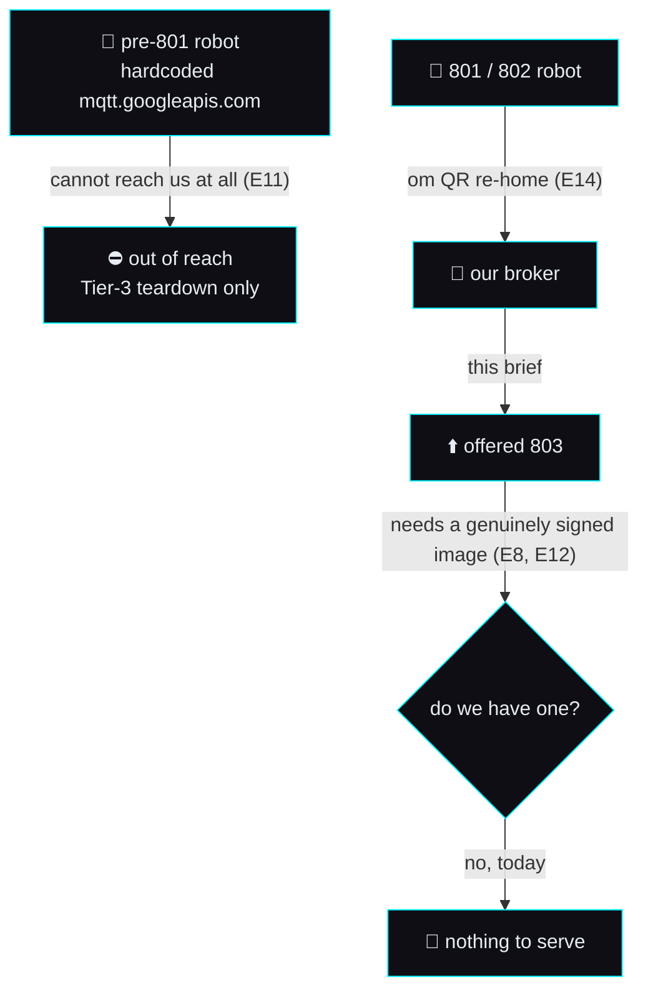
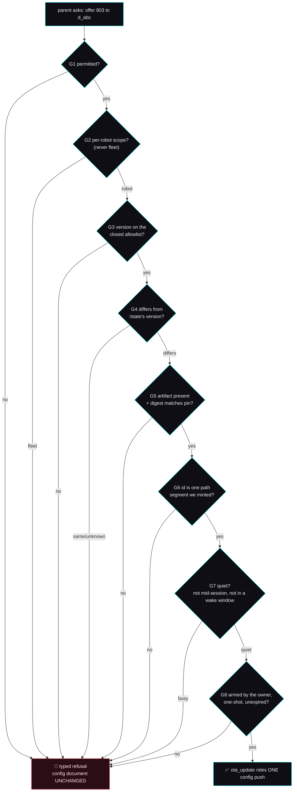

# 🔄 OTA push — the specification, and the argument for not building it yet

> **Backlog brief v1 · 2026-09-06 · SPECIFICATION ONLY.** The build document for the audit's
> [§3.1 *"OTA push (801→803 lever)"*](../openmoxie-feature-audit.md):629 — re-verified against the code the
> same day and still the cleanest genuinely-unbuilt row on that page:
> `grep -rn "ota_update\|forbid_otaver" mqtt/ server/ --include=*.py` returns **zero**.
>
> ## ⛔ NOTHING HERE IS BUILT, AND THAT IS DELIBERATE — 2026-09-06
>
> No code, no config key, no route, no test file was written with this brief. The tree is
> unchanged apart from this page and its two index entries. **Verify before assuming otherwise:**
> `ota_update` and `forbid_otaver` appear in [`cloud_config.py`](../../../mqtt/moxie_sdk/cloud_config.py)
> **zero** times, and `build_robot_cloud_config` (:102-115) has no OTA keyword to pass.
>
> This is the one item in the backlog that **mutates firmware on hardware nobody in this project
> owns**, cannot be exercised here, and whose worst case is a device that cannot be repaired without
> opening the shell. It gets a specification now and an implementation only under the owner's eye —
> and §9 argues, honestly, that *"specified, not built"* may be the correct permanent answer.

> **Clean-room.** Every claim about what a *real* Moxie does with an OTA is taken from **our own**
> reverse-engineering pages — chiefly
> [`ota-and-recovery.md`](../../reverse-engineering/firmware/ota-and-recovery.md),
> [`device-config-and-telemetry.md`](../../reverse-engineering/protocol/device-config-and-telemetry.md),
> [`network-trust.md`](../../reverse-engineering/protocol/network-trust.md) and the recovered protos —
> never from the vendor app or its decompiled output.
> **OpenMoxie** (MIT, © Justin Beghtol) is read as prior art and cited by path; its `doc/RemoteModuleAPI.md`
> is a **second-hand description of one person's successful upgrade**, not a capture, and every claim
> sourced from it is labelled as such below. We describe and credit; we never copy. Nothing is ported by
> this brief, so [`ATTRIBUTION.md`](../../../ATTRIBUTION.md) needs no new entry until code lands.

---

## 0. Why this one gets a spec first, when the other fourteen briefs got a build

Every other page in this folder specifies something whose worst failure is a bad reply, a lost setting or
a red test. This one's worst failure is **a robot that will not boot, owned by a stranger, repairable
only by disassembly** ([`flashing-runbook.md`](../../reverse-engineering/firmware/flashing-runbook.md):23 —
maskrom requires holding a test-point low *"needs the board open"*).

Three properties make it different in kind:

1. **It is unexercisable here.** Every gate, every refusal and every payload can be tested; the one thing
   that matters — what the robot *does* with the document — cannot. There is no fixture for
   "`update_engine` accepted a payload".
2. **It is asymmetric.** A wrong turn in the brain costs a turn. A wrong OTA costs the device.
3. **The dangerous half is trivially easy and the safe half is the work.** Adding `"ota_update":
   {"id": …, "version": …}` to the config document is *one dictionary key*. Everything in §5 exists to
   stop that key from reaching a robot by accident, and none of it is required to make the feature
   "work".

That third property is the whole argument for the split in §6: **P0 is the refusal machinery with no
transmitter attached.**

---

## 1. What is actually known, what is second-hand, and what is unknown

Nothing below is stated at uniform confidence. Every row carries a label, and the labels mean:

| Label | Meaning |
|---|---|
| **PROVEN** | Read from our own recovered artifacts — a proto descriptor, a decompiled string, a firmware property. Checkable in this repo. |
| **SECOND-HAND** | Described in OpenMoxie's `doc/RemoteModuleAPI.md` as prose by someone who did it once. Plausible, uncaptured, unverified by us. |
| **INFERRED** | Our reading of a PROVEN artifact, where the artifact gives the type but not the meaning. Reasoned, not established. |
| **UNKNOWN** | We have no evidence either way, and saying so is the finding. |

### 1.1 The ledger

| # | Claim | Label | Source |
|--:|---|---|---|
| **E1** | `RobotCloudConfig` carries `OtaUpdate ota_update = 13` and `string forbid_otaver = 17`. | **PROVEN** | [`Cloud.proto`](../../reverse-engineering/protocol/recovered-proto/embodied/logging/Cloud.proto):201, :205; catalogued at [`proto-catalog.md`](../../reverse-engineering/protocol/proto-catalog.md):361, :365 |
| **E2** | `OtaUpdate` has exactly two fields, both `optional string`: `id = 1`, `version = 2`. There is no digest, no URL, no size, no signature field. | **PROVEN** | [`Cloud.proto`](../../reverse-engineering/protocol/recovered-proto/embodied/logging/Cloud.proto):171-174 |
| **E3** | `RobotStatus` (up, on `/devices/{id}/state`) carries `bool ota_reboot_required = 13`. | **PROVEN** | [`device-config-and-telemetry.md`](../../reverse-engineering/protocol/device-config-and-telemetry.md):68; parsed today at [`cloud_config.py`](../../../mqtt/moxie_sdk/cloud_config.py):531-534 |
| **E4** | `CloudStatus.UserState` has `OTA_LOCK = 5`, *"held for an OTA (no user activity)"*. | **PROVEN** | [`device-config-and-telemetry.md`](../../reverse-engineering/protocol/device-config-and-telemetry.md):86 |
| **E5** | The robot emits `OTAStatus{timestamp, uint32 update_status, bool payload_complete, float update_percent, sint32 payload_result}`. | **PROVEN** (the shape) | [`SystemEvents.proto`](../../reverse-engineering/protocol/recovered-proto/embodied/system/SystemEvents.proto):21-29; [`proto-catalog.md`](../../reverse-engineering/protocol/proto-catalog.md):2429-2436 |
| **E6** | The robot's own firmware string is `v3.6.4-24_12_28-18_42-master-a90cfdee72-v24.10.803-rls-robot`, in the property `sys.embodied.otaver`. | **PROVEN** | [`firmware-803-reference.md`](../../reverse-engineering/firmware/firmware-803-reference.md):12; [`firmware-image.md`](../../reverse-engineering/firmware/firmware-image.md):204 |
| **E7** | OTA is stock Android **A/B seamless update**: `OSUpdate` waits for `/sdcard/update.zip`, unpacks `payload.bin`, calls `UpdateEngine.applyPayload()`; `update_engine` **writes the inactive slot** and `bootctl` switches on reboot. *"No partitions are touched in place; a bad update rolls back."* | **PROVEN** | [`ota-and-recovery.md`](../../reverse-engineering/firmware/ota-and-recovery.md):31-34 |
| **E8** | `update_engine` verifies every payload against `/system/etc/update_engine/update-payload-key.pub.pem` (2048-bit RSA). Only payloads signed by Embodied's private key apply. | **PROVEN** | [`ota-and-recovery.md`](../../reverse-engineering/firmware/ota-and-recovery.md):73-74, :81-83 |
| **E9** | `BoUpdater` stages to `/sdcard/EmbodiedData/otaImages/` with `otaInfo.txt` (target + **minimum** version), `otaLog.txt` and a **`DISABLE_OTA` sentinel file**; it enforces a min-version gate that *"can refuse downgrades"* and a ~200 MB data budget. | **PROVEN** | [`ota-and-recovery.md`](../../reverse-engineering/firmware/ota-and-recovery.md):25-27 |
| **E10** | The robot trusts servers by **ordinary CA-chain validation with no public-key pinning** — no `sha256//` pin, no `CURLOPT_PINNEDPUBLICKEY`. | **PROVEN** | [`network-trust.md`](../../reverse-engineering/protocol/network-trust.md):17-27 |
| **E11** | Pre-801 firmware **hardcodes** `mqtt.googleapis.com` and cannot be re-homed by QR; 801+ can. | **PROVEN** | [`ota-and-recovery.md`](../../reverse-engineering/firmware/ota-and-recovery.md):93-94; [`network-trust.md`](../../reverse-engineering/protocol/network-trust.md):79-90 |
| **E12** | We **do not have** a genuine Embodied-signed 803 `update.zip`. We have raw partition images, which is a different artifact. | **PROVEN** (by absence, stated in our own doc) | [`ota-and-recovery.md`](../../reverse-engineering/firmware/ota-and-recovery.md):95, :105 |
| **E13** | The robot requests HTTP tokens on the event `client-service-http-token`. | **PROVEN** (the event name) | [`cloud-protocol.md`](../../reverse-engineering/protocol/cloud-protocol.md):173; the constant already exists at [`tools/robot-toolkit/moxie_toolkit/cloud.py`](../../../tools/robot-toolkit/moxie_toolkit/cloud.py):78 |
| **E14** | `ServiceConfiguration2` (the `om` relocation QR payload) carries `webservice_root = 2` and `webservice_pin = 3` — so the REST base a robot uses **is settable from a QR**. | **PROVEN** | [`qr-commands.md`](../../reverse-engineering/protocol/qr-commands.md):173; [`cloud-protocol.md`](../../reverse-engineering/protocol/cloud-protocol.md):69 |
| **S1** | Setting `ota_update{id, version}` to a version differing from the robot's own makes the robot request an HTTP token and then `GET {webservice_root}/api/ota_updates/{id}/url?access_token=…&robot_id=…`, expecting `{"url": "<signed OTA image URL>"}`. | **SECOND-HAND** | OpenMoxie `doc/RemoteModuleAPI.md`, summarised in our own [`mqtt-and-conversation.md`](../mqtt-and-conversation.md):207-212 and [`openmoxie-feature-audit.md`](../openmoxie-feature-audit.md):173 |
| **S2** | The upgrade worked with `_PROVIDE_HTTP_TOKENS = True` and a server returning a **bogus** token (the literal `"notoken"`) — i.e. the robot does not validate the token it is handed. | **SECOND-HAND** | Same source, via [`mqtt-and-conversation.md`](../mqtt-and-conversation.md):210-211 |
| **S3** | The `url` endpoint can be a **static JSON file**; the maintainer hosted the genuine 803 image behind it. | **SECOND-HAND** | [`openmoxie-feature-audit.md`](../openmoxie-feature-audit.md):173 |
| **I1** | `OtaUpdate.version` is compared against the robot's `sys.embodied.otaver` string (E6), and *any* difference — not just "greater" — triggers the fetch. | **INFERRED** | S1 says *"when the version differs"*. Neither the comparison function nor its direction is recovered. See **U2**. |
| **I2** | `forbid_otaver` is a **single version string the robot must refuse to install** — a blocklist of one, the natural reading of a singular `string` beside a target. | **INFERRED** | E1 gives the type and the name; nothing gives the semantics. See **U1**. |
| **I3** | The `url` the robot fetches must chain to a CA in the device store, exactly like every other channel (E10) — a self-signed image host is not enough. | **INFERRED** | E10 is proven for REST/MQTT/STT; the OTA download path is not separately captured, but it uses the same libcurl/BoringSSL stack. |
| **U1** | **What `forbid_otaver` actually means.** One version, a prefix, a minimum, a comma list? Whether it is checked *before* or *after* the `url` fetch, and whether it beats `ota_update` when the two name the same string. | **UNKNOWN** | No capture, no decompiled handler in our corpus, and OpenMoxie never implemented it either ([`openmoxie-feature-audit.md`](../openmoxie-feature-audit.md):187 lists the config keys it exercises — `forbid_otaver` is not among them). |
| **U2** | **How `version` is compared, and whether a *downgrade* is reachable.** E9 proves `BoUpdater` holds a min-version gate that *"can refuse downgrades"* — *can*, on a value in `otaInfo.txt` that comes from the image, not from us. Whether a lower `ota_update.version` is refused, accepted, or accepted-then-rolled-back is not established. | **UNKNOWN** | The gate is named in [`ota-and-recovery.md`](../../reverse-engineering/firmware/ota-and-recovery.md):26-27; its threshold and its behaviour on our input are not. |
| **U3** | **What the numbers in `OTAStatus` mean, and whether they ever reach us.** `update_status` is a bare `uint32` and `payload_result` a bare `sint32` with **no enum recovered for either** — so "downloading", "verifying", "failed signature" and "succeeded" are indistinguishable integers. Worse: `OTAStatus` is documented as an on-device system event ([`power-and-system-events.md`](../../reverse-engineering/protocol/power-and-system-events.md):68), and **nothing in our corpus shows it republished to MQTT**. | **UNKNOWN** | This is the one that decides whether progress can be reported at all. See §3.4. |
| **U4** | **What the robot does with a URL it cannot fetch.** No evidence, of any kind, in either direction. | **UNKNOWN** | See §3.5 — it is answered structurally rather than empirically, and that distinction matters. |

### 1.2 Read the ledger before reading anything else

Six rows of this design rest on **one person's prose about one successful upgrade** (S1-S3). That is
better than nothing and much worse than a capture. It is the reason §6 puts the entire wire half behind
P1/P2 and gives P0 nothing to transmit with: **a plan built on S1 that turns out to be wrong fails at a
`GET` that 404s, which is harmless — unless we have already told a robot to go looking.**

---

## 2. Who this actually serves — and the correction the audit row invites

The row is titled *"the 801→803 lever"*, and that is exact. The framing it tends to attract — *"revive
stranded pre-801 robots without disassembly"* — is **not what this delivers**, and the brief says so on
its first screen because the mistake is easy and expensive.

**The population is: robots on 801 or 802, already re-homed to our broker, whose owner wants 803.**
Nobody in this project has one. The pre-801 robots — the ones the revival effort is actually chasing —
are unreachable over the network by construction (E11), and our own RE page already concluded it:
*"No no-open path found … so the route is Tier-3 (open + flash)"*
([`ota-and-recovery.md`](../../reverse-engineering/firmware/ota-and-recovery.md):102).

And even for that narrow population, **E12 is a hard stop**: there is no signed 803 payload in this
project to serve. The lever exists; the ammunition does not. §9 turns that into a decision rather than a
lament.

---

## 3. The contract touchpoints

### 3.1 Fields — down

Both live in the **one** config document, `RobotCloudConfig`, published on **`/devices/{id}/config`**
([`config-and-telemetry-contract.md`](../config-and-telemetry-contract.md):43). There is no separate OTA
topic and no OTA command:

| Field | Wire | Ours to set |
|---|---|---|
| `ota_update.id` | `optional string`, field 1 of `OtaUpdate` (E2) | The key the robot puts in `…/api/ota_updates/{id}/url` (S1). OpenMoxie used the literal `"rls"` ([`mqtt-and-conversation.md`](../mqtt-and-conversation.md):207). **Treat it as an opaque path segment we choose**, and validate it as one — see §5 G6. |
| `ota_update.version` | `optional string`, field 2 (E2) | The full `otaver` string (E6 shape). Not a semver; not parseable as one. |
| `forbid_otaver` | `optional string`, field 17 of `RobotCloudConfig` (E1) | **Meaning unknown (U1).** §5 uses it only in the direction that is safe under *every* reading — see G7. |

### 3.2 Fields — up

| Field | Topic | What it tells us |
|---|---|---|
| `RobotStatus.robot_firmware_version` | `/devices/{id}/state` | The version to compare against. **Already parsed** — [`cloud_config.py`](../../../mqtt/moxie_sdk/cloud_config.py):531-534, with `software_version` as a documented fallback at :541-543. |
| `RobotStatus.ota_reboot_required` | `/devices/{id}/state` | A payload is staged and the robot wants a reboot (E3). **Already parsed**, same tuple. |
| `CloudStatus.user_state == OTA_LOCK` (5) | the robot's own connection report | *"held for an OTA (no user activity)"* (E4) — the robot has quiesced itself. |

The contract already commits us to consuming both:
*"Tracks `CloudStatus.UserState` for pairing/OTA lifecycle"*
([`config-and-telemetry-contract.md`](../config-and-telemetry-contract.md):502).

### 3.3 Topics

**`/devices/{id}/config`** (down, the whole document, republished for any change) and
**`/devices/{id}/state`** (up). Plus one event, if P1 is ever built:
**`/devices/{id}/events/client-service-http-token`** (E13), answered the way every other event is —
by publishing to `…/commands/{command}` — the pattern the runtime already implements for
`query_result` at [`moxie_runtime.py`](../../../mqtt/supervisor/moxie_runtime.py):2510.

### 3.4 Result codes — and the honest answer is "there are none"

The prompt for this brief asked which `ResultCode`s apply. **None do, and that is a finding rather than an
omission.** `ResultCode` is the ten-value enum of `RemoteChatResponse` — `SUCCESS=0` … `REPLY_PENDING=9`
([`proto-catalog.md`](../../reverse-engineering/protocol/proto-catalog.md):2146) — and it governs a
conversation turn. It has nothing to say about an OTA.

The OTA result surface is three things, and **all three are weak**:

1. `RobotStatus.ota_reboot_required` — one bool, and it means *"staged"*, not *"succeeded"* (E3).
2. `CloudStatus.user_state == OTA_LOCK` — the robot is busy, not the robot is done (E4).
3. `OTAStatus.update_status` / `payload_result` — **U3**: bare integers with no recovered enum, on a
   message our corpus only ever shows on the on-device bus.

**Design consequence, and it is the same rule this repo already applies to `wakeup`:** the console must
report *offered*, never *installed*. The precedent is written down and enforced —
*"Never reports success for a command it did not send … a recovered command with no acknowledgement is
reported as **sent**, not as **done**"*
([`config-and-telemetry-contract.md`](../config-and-telemetry-contract.md):518-519), implemented for the
wake command at [`moxie_runtime.py`](../../../mqtt/supervisor/moxie_runtime.py):2548-2556. An OTA is that
rule at ten times the stakes: the only honest completion signal we can ever produce is
**`robot_firmware_version` changing on a later `/state`**, which is an observation, not an acknowledgement.

### 3.5 What the robot does with a URL it cannot fetch — **UNKNOWN (U4)**, and answered structurally

We have no evidence. What we have instead is a chain of proven facts that bounds the damage regardless of
the answer:

- The robot **downloads to `/sdcard` first** and stages it (E9). A fetch that fails leaves a partial file
  in a staging directory, not a partial partition.
- `update_engine` **verifies the signature before writing anything** (E8). A truncated, corrupt or
  substituted image fails verification and is never applied.
- Writes go to the **inactive A/B slot**; the running system is untouched and *"a bad update rolls back"*
  (E7).
- `BoUpdater` holds a **~200 MB data budget** (E9), so a pathological retry loop is bounded by the robot,
  not by us.

So the honest statement is: **we do not know what it logs or how often it retries, and the three layers
below it mean a failed fetch should be a non-event.** *Should* is doing real work in that sentence and it
is not upgraded to *is* anywhere in this brief. What we can control is that a robot is only ever pointed
at a URL we can already serve — which is gate **G5**.

---

## 4. The seam as it stands today

Everything an OTA would need already exists, which is precisely why the refusals have to be designed
first — the feature is one key away from working and one key away from being catastrophic.

| Seam | Where | State |
|---|---|---|
| Building the config document | [`cloud_config.py`](../../../mqtt/moxie_sdk/cloud_config.py):102-115 `build_robot_cloud_config` | Additive from a keyword whitelist. **No OTA keyword.** An unexpected kwarg raises `TypeError` rather than shipping — the docstring at :514-519 says this is on purpose. |
| Publishing it | [`moxie_runtime.py`](../../../mqtt/supervisor/moxie_runtime.py):2517-2540 `_push_config` | Publishes the whole document **on connect and on every edit**. See R1 — this is the stickiness hazard. |
| The parent's edit path | [`cloud_config.py`](../../../mqtt/moxie_sdk/cloud_config.py):437-506 `sanitize_config_overrides` | The single whitelist every console POST passes through. |
| The **fleet** edit path | [`moxie_runtime.py`](../../../mqtt/supervisor/moxie_runtime.py):1399-1401 | ⚠️ **`POST /config?scope=fleet` calls the *same* `sanitize_config_overrides`.** One key added to that whitelist is one POST away from every robot. See R2. |
| Keys that must not reach a robot | [`cloud_config.py`](../../../mqtt/moxie_sdk/cloud_config.py):514-529 `SERVER_ONLY_KEYS` / `robot_config_kwargs` | The existing, tested precedent for a config key that lives in the layers but is stripped before the wire. |
| The permit gate | [`moxie_runtime.py`](../../../mqtt/supervisor/moxie_runtime.py):2528-2534 | An unpermitted device gets `build_unpaired_cloud_config()` — no child data, no household settings. An OTA target must inherit this for free, and §5 G1 makes that explicit rather than incidental. |
| Reading the robot's version | [`cloud_config.py`](../../../mqtt/moxie_sdk/cloud_config.py):531-543 `parse_robot_status` | Already surfaces `robot_firmware_version` **and** `ota_reboot_required`. Nothing more is needed to *report*. |
| The HTTP-token event | [`tools/robot-toolkit/moxie_toolkit/cloud.py`](../../../tools/robot-toolkit/moxie_toolkit/cloud.py):78 | The constant exists in the toolkit; **no handler exists in the supervisor.** |
| The console's honest position today | [`config-and-telemetry-contract.md`](../config-and-telemetry-contract.md):484 | *"This appliance serves no `api/ota`, so it **never claims 'up to date'** — it reports what the robot said and says no update server is configured."* **P0 keeps this sentence true.** |

### Prior art — what OpenMoxie does, and what it does not

Upstream **does not implement this.** `doc/RemoteModuleAPI.md` records it as *notes* — the maintainer
added `webservice_root` to the endpoint QR, flipped `_PROVIDE_HTTP_TOKENS`, and served a static
`api/ota_updates/{id}/url` JSON file ([`openmoxie-feature-audit.md`](../openmoxie-feature-audit.md):173).
Its config model exercises `ota_update{id,version}` as a key its two-level merge can carry
([`openmoxie-feature-audit.md`](../openmoxie-feature-audit.md):187) and **not** `forbid_otaver`.

**Behaviours we would port:** the static-file shape of the `url` response (S3) and the observation that a
placeholder token sufficed (S2). **Behaviours we would not:** serving it fleet-wide, and returning a token
the server has not decided to issue. Nothing is copied; when code lands, `ATTRIBUTION.md` gains a row.

---

## 5. The refusals, designed before the happy path

An OTA target reaches the wire only by passing **eight independent gates**. They are ordered cheapest and
most-certain first, each one is a pure predicate over data we already hold, and **any gate that cannot
evaluate its input refuses** — there is no "assume it's fine" branch anywhere in this design.

| Gate | Rule | Why, and what it is anchored to |
|---|---|---|
| **G1 — permitted device only** | An unpermitted robot's document is `build_unpaired_cloud_config()` and can never carry an OTA key. | The gate already exists ([`moxie_runtime.py`](../../../mqtt/supervisor/moxie_runtime.py):2528-2534); this makes inheritance explicit and testable rather than a happy accident of ordering. |
| **G2 — per-robot scope, never fleet** | `ota_update` is **structurally excluded** from `sanitize_config_overrides`, and rides its own arm record. It must not be reachable from `POST /config` at either scope. | R2. `?scope=fleet` shares the whitelist ([`moxie_runtime.py`](../../../mqtt/supervisor/moxie_runtime.py):1399-1401). *"One robot at a time"* must be a property of the type, not of a reviewer's care. |
| **G3 — closed positive allowlist of versions** | The target must be one of a hard-coded set of known-good `otaver` strings. Today that set has **exactly one** member, E6's 803 string. An unrecognised string is refused even if it looks right. | The repo's own established pattern: the launch-card allowlist is derived rather than transcribed *"because a rotted allowlist rots in the permissive direction"* ([`openmoxie-feature-audit.md`](../openmoxie-feature-audit.md), PR #148 row). Here it must be **literal**, because there is no source to derive from. |
| **G4 — must differ from what the robot reported** | Compare against `robot_firmware_version` from a `/state` we have actually received. **No `/state` yet ⇒ refuse.** Equal ⇒ refuse. | I1/U2. Offering a robot the version it is already running is at best a no-op and at worst an unknown; and a robot we have never heard from is a robot whose version we are guessing. |
| **G5 — the artifact exists and its digest matches a pin** | The `url` endpoint answers only for an artifact already present in the local store whose SHA-256 equals a pinned manifest value. No digest, no serve. | E2 — `OtaUpdate` has **no** digest field, so the robot cannot check what we meant to send; only `update_engine`'s signature check protects it (E8). Our digest pin protects against *our own* store being wrong, which is the failure the robot's signature cannot distinguish from an attack. |
| **G6 — `id` is one path segment we minted** | `^[a-z0-9][a-z0-9_-]{0,31}$`, chosen from our own store's keys. Never parent-supplied text. | S1 puts `id` straight into a URL path. A parent-typed `id` is a path-traversal and SSRF primitive aimed at a device we cannot debug. |
| **G7 — quiet, or not at all** | Refuse while the robot's last `/state` shows an active session, while `user_state` is anything but `PAIRED_VALID`, and inside a configured bedtime/wake window. | E4 + `DisengageReason` ([`power-and-system-events.md`](../../reverse-engineering/protocol/power-and-system-events.md):81-87). **Read the limit honestly: we cannot make the robot wait.** `OTA_LOCK` is the robot quiescing *itself*, and `UnpairUserRequest`/`UnpairUserReady` bracket a graceful detach the robot drives. All we control is whether we *offer* — so the design declines to offer rather than pretending to schedule. |
| **G8 — one-shot arm, expiring, self-clearing** | An arm is an explicit owner action for one `device_id`, carries an expiry (default 1 h), survives exactly **one** config push, and is cleared when either the expiry passes or a later `/state` reports the target version. | **R1, the sharpest hazard in this seam.** `_push_config` republishes the whole document on connect and on every edit ([`moxie_runtime.py`](../../../mqtt/supervisor/moxie_runtime.py):2517-2540). A target stored as an ordinary config override would be re-asserted **forever, on every reconnect** — an accidental permanent instruction. The arm record is why the key is not a setting. |

### Three rules that sit above the gates

1. **We never build a path that weakens the robot's own verification.** No replacing
   `update-payload-key.pub.pem`, no touching `otacerts.zip`, no `--disable-verification` `vbmeta`, at any
   phase, for any reason. E8 is the only thing standing between a mistake and a brick, and it is *theirs*,
   not ours. Everything in [`firmware-image.md`](../../reverse-engineering/firmware/firmware-image.md):124-132
   describing how to disable AVB is **out of scope for this brief by construction** — it is a Tier-3
   bench procedure on a robot someone is physically holding, and it must never be reachable from a network
   service.
2. **`forbid_otaver` is only ever used in the direction that is safe under every reading of U1.** We set
   it to a version we want refused, never to the version we are offering, and never as a way to *permit*
   something. Under every candidate meaning — one version, a prefix, a minimum — that use is either
   correct or inert. There is no reading under which it becomes dangerous. When we cannot establish a
   semantic, we pick the use whose worst case is "it did nothing".
3. **Refusals are typed and logged; the document is never partially built.** A refused arm produces the
   *identical* config document the robot would have received anyway — byte-for-byte — not a document with
   a half-populated OTA block.

---

## 6. P0 / P1 / P2

### P0 — build the payload, validate it, and never send it · **S**

> **Ships nothing to any robot. Every line is provable on this machine.**

- A new pure module (`mqtt/moxie_sdk/ota.py`, stdlib only, importing no config) holding: the closed
  version allowlist (G3, one entry), the `id` pattern (G6), and one function that takes a proposed target
  plus the robot's last known `/state` and returns **either** a `{"ota_update": {...}}` fragment **or** a
  typed refusal naming the gate that stopped it.
- A guard test asserting that **no code path in the tree can put `ota_update` on the wire** — the
  fragment is built by tests and consumed by nothing. This is the test that makes "P0 is safe" checkable
  instead of asserted, and it is the one that must *fail* the day P2 lands.
- `ota_update` explicitly listed in `SERVER_ONLY_KEYS`-style prose so a future editor of
  `sanitize_config_overrides` meets a written refusal (G2) rather than an empty space.
- The console's read-only truth, which needs **no new parsing**: `robot_firmware_version` +
  `ota_reboot_required` are already in `_STATUS_FIELDS`. The card says what the robot reported and
  *"no update server is configured"* — keeping
  [`config-and-telemetry-contract.md`](../config-and-telemetry-contract.md):484 true rather than
  quietly falsifying it.

**Done looks like:** a parent can see what firmware their robot is running and that we are not offering
an update. An agent can construct a target and watch eight gates refuse it. Nothing can transmit.

### P1 — the serving half, with the transmitter still disconnected · **M**

> **Everything an OTA needs except the ability to start one.** Exercisable end-to-end against the SIL
> virtual robot; still incapable of changing a real device, because nothing puts `ota_update` in a
> published document.

- A local artifact store: an image file plus a pinned manifest (`{id, version, sha256, bytes}`). Serving
  is refused unless the digest recomputes (G5).
- `GET /api/ota_updates/{id}/url` on the supervisor's REST surface — answering **only** for a permitted,
  known `device_id`, **only** for a pinned artifact, and returning `{"url": …}` on our own origin (S1/S3
  shape). Every other request is a 404 that reveals nothing about what exists.
- A handler for the `client-service-http-token` event (E13). **We decide what a token is**; S2's report
  that a placeholder sufficed is treated as a convenience we do not rely on.
- The console's 🔄 card, read-only: robot version, available artifact, and the eight gates rendered as a
  checklist showing exactly which would refuse right now. **The Arm button is present, disabled, and says
  why.**

**Done looks like:** the SIL robot asks for a token and a URL and gets correct answers; a robot that is
not permitted, an `id` we did not mint, and an artifact whose digest drifted each get the right refusal.
Still zero risk to hardware — the robot is never *told* to ask.

### P2 — the arm · **M**, and **owner-gated, not agent-startable**

> **The only phase that can change a robot. Do not build it on an agent's judgement.**

- The one-shot arm record (G8) and the single `ota_update` key riding exactly one config push.
- `MOXIE_OTA_ARM` defaulting off, plus a typed confirmation in the console (the device id, retyped).
- Auto-clear on version match or expiry; an audit line per arm, per push and per clear.
- The P0 guard test inverts: the day this lands, *"nothing can transmit"* must go red and be replaced by
  *"only an armed, unexpired, single-shot record transmits"*.

**P2 is not scheduled by this brief.** It is described so the owner is choosing between designed
alternatives rather than an unknown, and so P0/P1 are built with the right shape underneath them.

---

## 7. How this is tested without a robot — and exactly where the ceiling is

| # | Test | Phase | Hermetic? |
|--:|---|:--:|:--:|
| T1 | Each of G1-G8 refuses in isolation, with the refusal naming its own gate | P0 | ✅ |
| T2 | A refused arm yields a config document **byte-identical** to the unarmed one | P0 | ✅ |
| T3 | The version allowlist rejects a near-miss (one character off E6's string) | P0 | ✅ |
| T4 | `id` rejects `../`, an absolute path, a URL, and 33 characters | P0 | ✅ |
| T5 | **The negative guard:** no reachable path emits `ota_update`; a planted call site turns it red | P0 | ✅ |
| T6 | `?scope=fleet` cannot carry an OTA key — asserted against the real sanitizer | P0 | ✅ |
| T7 | Digest mismatch ⇒ the `url` endpoint 404s and logs; a corrupted byte flips it | P1 | ✅ |
| T8 | An unpermitted `device_id` gets the same 404 as an unknown one (no oracle) | P1 | ✅ |
| T9 | SIL: the virtual robot requests a token and a URL over a real broker and is answered | P1 | ✅ (SIL) |
| T10 | A stale `/state` (no version, or older than a threshold) refuses at G4 | P1 | ✅ |
| T11 | An arm survives exactly one push, then clears; a reconnect does not re-assert it | P2 | ✅ |
| T12 | Expiry clears an unused arm; a `/state` reporting the target clears a used one | P2 | ✅ |

### ⛔ The ceiling, stated as plainly as the rest of this repo states its own

Every test above proves something about **our** software. **Not one of them proves anything about a
robot.** Specifically, and permanently until someone connects hardware:

- **U1** — no test can tell us what `forbid_otaver` does. We can only prove we set it in the direction
  that is inert under every reading.
- **U2** — no test can tell us whether a downgrade is refused, applied, or applied-then-rolled-back.
- **U3** — no test can decode `update_status`/`payload_result`, and none can establish that `OTAStatus`
  reaches MQTT at all. **If it does not, there is no progress reporting to build, ever.**
- **U4** — no test can observe what a robot does with an unfetchable URL.
- **S1-S3** — the entire wire interaction is second-hand. A test of our server proves our server matches
  *our reading of someone's prose*.
- **E12** — there is no signed artifact to serve, so even T7's fixture is a stand-in for a file that does
  not exist in this project.

This is the same ceiling every robot-side row on this page carries — *"no physical robot has ever sent us
a vision event"* ([`qr-launch-cards.md`](qr-launch-cards.md)'s honest ceiling), *"nothing on this
appliance has ever produced a `Packet`"* ([`insights.md`](insights.md)), A1-A4 in
[`security-broker-auth.md`](security-broker-auth.md). **This row's ceiling is the same height and the
consequence of ignoring it is not.**

---

## 8. The failure mode that matters

**Said plainly:** a robot that takes a bad OTA and will not boot is a robot whose owner cannot fix it.
Recovery means maskrom — holding a test-point low while powering, *"needs the board open"*
([`flashing-runbook.md`](../../reverse-engineering/firmware/flashing-runbook.md):23) — then
`rkdeveloptool` over USB. For the audience this project exists for, a parent with a child's robot on a
shelf, that is indistinguishable from destroying it.

**Now the part that is genuinely reassuring, and it is structural rather than hopeful.** Under the design
above, *we cannot cause that state*, because three of the protections are the robot's own and we never
touch them:

1. `update_engine` rejects anything not signed by Embodied's key (E8). **We do not have that key.** The
   worst artifact we could possibly serve — corrupt, truncated, hostile, the wrong image entirely — fails
   verification and is never written.
2. Writes go to the **inactive** slot and *"a bad update rolls back"* (E7). A payload that passes
   signature and still fails costs a reboot, not a device.
3. `BoUpdater` gates on a minimum version and a data budget (E9) — a second refusal we did not write and
   cannot accidentally remove.

**So the single mistake that reaches a brick is not a bad payload. It is defeating the signature gate** —
replacing `update-payload-key.pub.pem` or `otacerts.zip`, or flashing a `--disable-verification` vbmeta.
That is why rule 1 of §5 forbids it at every phase without exception, and why this brief treats *"can we
sign our own payloads"* as a Tier-3 bench topic for a robot someone is holding, never as a feature of a
network service.

The residual risks the design bounds rather than eliminates:

| # | Risk | Bound |
|---|---|---|
| **R1** | A target left in the config is re-asserted on every reconnect, forever | G8: an arm is not a setting; one push, expiring, self-clearing |
| **R2** | One fleet POST offers an OTA to every robot | G2: structurally unreachable from `sanitize_config_overrides`, at either scope |
| **R3** | An interrupted update lands mid-conversation with a child | G7 declines to offer; the robot's `OTA_LOCK` does the rest — **and we cannot do more than decline** |
| **R4** | A parent-supplied `id` becomes a URL | G6: one segment, from our own keys, pattern-checked |
| **R5** | We serve the wrong file | G5: digest pinned; mismatch is a refusal, not a warning |
| **R6** | The whole S1 flow is wrong and the robot does something else entirely | The reason P0 has no transmitter: a wrong S1 with nothing armed is a `GET` that never happens |
| **R7** | A future editor adds one key and silently unpicks all eight gates | T5 + T6 exist to go red for exactly that edit |

---

## 9. What the owner must decide before anyone builds this

Five questions. **The first is the one that matters, and the honest recommendation is at the bottom.**

1. **Is there an image at all?** E12: we do not have a genuine signed 803 `update.zip`. Without one, P1's
   store is empty and P2 has nothing to arm. *Is sourcing one — community mirror, a final Embodied OTA —
   something the owner wants pursued, and is redistributing it something they are willing to do?*
2. **Who hosts it, and under whose CA?** I3 says the robot needs a chain to a CA in its store; the
   appliance's self-signed posture is fine for MQTT (`disable_verify` in the relocation QR) and is
   **not** established for the OTA download. This may force a publicly-trusted certificate on a box that
   currently needs none.
3. **What is a token, to us?** S2 reports a placeholder sufficed. *Do we mint real per-device tokens for
   an interaction the robot may not check, or accept that the token is theatre and say so in the code?*
4. **Is `forbid_otaver` worth pinning down at all** (U1), or do we ship the inert use from §5 rule 2 and
   leave it unresolved permanently?
5. **Is this wanted for a fleet of nobody's robot?** The audit's own ranking already demotes robot-side
   work by the owner's steer — *"anything that makes a stranger's visit to `moxie.mattvalancy.com/sim`
   better, safer or cheaper outranks anything that serves a robot none of us has"*
   ([`openmoxie-feature-audit.md`](../openmoxie-feature-audit.md):875-876). The launch-card sheet is
   ranked #7 and explicitly demoted on those grounds. **This is that argument with higher stakes and a
   smaller population** (§2: 801/802 robots already re-homed to us, of which we know of none).

### The recommendation: **specify, do not build**

Not as a hedge — as a conclusion the evidence forces:

- The lever has **no ammunition** (E12). P1 would build a store with nothing to put in it.
- The population is **narrow and hypothetical** (§2), and it is *not* the stranded pre-801 robots the
  revival effort cares most about — those are unreachable by construction (E11) and our own RE page
  already concluded Tier-3 is their route.
- The whole wire interaction is **second-hand** (S1-S3) with **four labelled unknowns**, so a build now
  would encode one person's prose as our contract and then be untestable against the thing it models.
- The value of writing it down is nearly all of the value: the eight gates, R1 (the stickiness of a
  republished config), R2 (the shared fleet whitelist) and the §8 finding that *the payload is not the
  brick risk — defeating the signature gate is* — are **useful today**, to anyone who later touches this
  seam, without a single line shipping.

**P0 is the exception worth considering.** It ships no capability, keeps
[`config-and-telemetry-contract.md`](../config-and-telemetry-contract.md):484's promise true, gives a
parent an honest firmware readout from fields we already parse, and installs T5/T6 — the two guards that
make the *next* agent's accidental one-key OTA go red. If the owner wants anything here, it is that: the
refusals, with no transmitter, and a written reason.

---

## 10. Effort, files, risks

| Phase | Effort | Files it would touch |
|---|:--:|---|
| **P0** | **S** | `mqtt/moxie_sdk/ota.py` (new, pure) · `sim/tests/test_ota.py` (new) · a prose note beside `SERVER_ONLY_KEYS` in [`cloud_config.py`](../../../mqtt/moxie_sdk/cloud_config.py):514 · the console's read-only firmware line |
| **P1** | **M** | `mqtt/moxie_sdk/ota_store.py` (new) · a route on [`moxie_runtime.py`](../../../mqtt/supervisor/moxie_runtime.py) beside the existing table at :1359 · a `client-service-http-token` branch near `_on_event` :3565 · a console card · `sim/tests/test_ota_store.py`, `test_ota_sil.py` |
| **P2** | **M**, owner-gated | the arm record in the fleet store · one call in `_push_config` :2517 · `MOXIE_OTA_ARM` · inverting T5 |

**Risks are R1-R7 in §8.** The limits we could not establish from our own docs are **U1-U4 in §1**, and
they are limits, not omissions — four of them are unresolvable without hardware and one (U3) may mean a
whole sub-feature can never exist.

---

📖 [Backlog index](README.md) · [Architecture index](../README.md) ·
[OpenMoxie feature audit](../openmoxie-feature-audit.md) ·
[Config & telemetry contract](../config-and-telemetry-contract.md) ·
[OTA & recovery (RE)](../../reverse-engineering/firmware/ota-and-recovery.md) ·
[Network trust (RE)](../../reverse-engineering/protocol/network-trust.md) ·
[Docs index](../../README.md)
