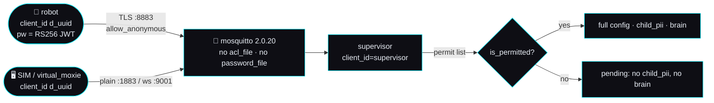
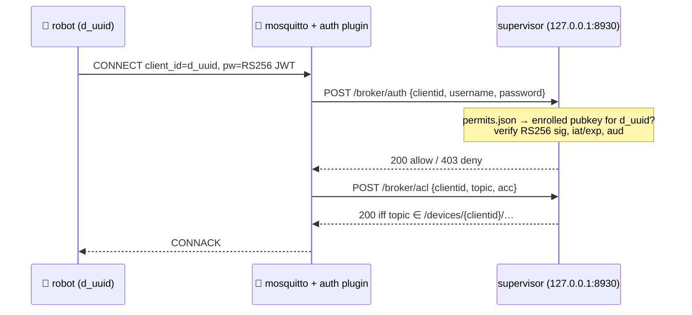

# 🔐 Broker authentication — from service refusal to identity, in three phases

> **Backlog brief v1 · 2026-09-02.** The build document for the audit's oldest honest gap:
> [§3.1 *"Robot identity / JWT"*](../openmoxie-feature-audit.md) — *"broker is anonymous; we don't verify
> JWTs either (deferred, §3b)"*, filed as **HAVE (parity — both punt)**. PR #27 shipped the
> [pairing gate](../mqtt-and-conversation.md#37-the-pairing-gate-which-robots-we-actually-serve-built-v1-2026-09-02)
> and recorded its own limit verbatim: *"service refusal, not authentication: an unpermitted device still
> connects, and a spoofed `d_<uuid>` is served as that robot; broker ACL/JWT still deferred."* This brief
> closes as much of that as can honestly be closed, in the order it can be closed, and says plainly where
> the wall is.
>
> **Clean-room.** Every claim about how a *real* Moxie authenticates is taken from **our own**
> reverse-engineering pages — chiefly
> [`cloud-protocol.md`](../../reverse-engineering/protocol/cloud-protocol.md),
> [`network-trust.md`](../../reverse-engineering/protocol/network-trust.md) and
> [`qr-commands.md`](../../reverse-engineering/protocol/qr-commands.md) — never from the vendor app.
> **OpenMoxie** (MIT, © Justin Beghtol) is read as prior art and cited by path; we describe what it does
> and we credit it, we never copy its code.

> ## ✅ P0 shipped — 2026-09-02
>
> §2 is built and merged; §3 (P1) and §4 (P2) are **unchanged** and still blocked on the
> A1–A4 ledger below. Proven against a real `eclipse-mosquitto:2.0.20` by
> [`sim/run_acl_proof.sh`](../../../sim/run_acl_proof.sh) (18/18 delivery-based checks) and
> by both modes of [`sim/run_compose_smoke.sh`](../../../sim/run_compose_smoke.sh).
> **P0 is containment, not authentication** — that sentence is now in the broker config,
> the ACLs, the broker README, the owner guide and §3.1 of the protocol doc.
>
> **What differs from this brief, and why.** Every deviation is a discovery made against a
> real broker while building, and each is also filed in the §0.4 ledger as **P1–P5**.
>
> | # | The brief said | What shipped | Why |
> |---|---|---|---|
> | **P1** | one `acl` file, all listeners | **two** files (`acl`, `acl-robot`) behind `per_listener_settings true` | On a listener with no `password_file`, mosquitto accepts **any username unchecked** and then matches it against the ACL's `user` blocks — so `user supervisor` on the robot listener hands the fleet to anyone who types the word. The robot listener cannot carry a password file (E3/E4: the robot's password is a JWT), so the supervisor's identity must live in a file only the credentialled listeners load. Measured, not assumed. |
> | **P2** | §2.5 "the real P0 breakage": the browser SIM loses its wildcards; recommends rewriting `bridge.js` (option b) | `bridge.js` is **untouched and unbroken** — `acl` grants an anonymous, read-only `topic read /devices/#` plus writes as the fixed `d_sim`, on the console-side listeners only | This is the brief's own option **(a)**, minus the credential the brief already called "not a secret" in a page served to a browser. It keeps the robot listener strictly confined (where a *real* child's `child_pii` is at stake) and needs no change to a shipped surface. `bridge.js` was also owned by another agent this cycle. **The residual exposure is written down:** a LAN client on `9001` can read `/devices/#`. |
> | **P3** | the plain listener gets `MOXIE_BIND_HOST_PLAIN`, and the compose smoke must opt out with `0.0.0.0` | the variable ships as specified; the smoke needs **no opt-out** | `sim/compose-smoke.env` already pins `MOXIE_BIND_HOST=127.0.0.1`, and the smoke drives the broker over loopback. It pins `MOXIE_BIND_HOST_PLAIN=127.0.0.1` explicitly so the intent is on the page. |
> | **P4** | §2.5: add a hardened variant to `sim/run_smoke.sh` | the SIL smoke and `sim/broker/ci-mosquitto.conf` are **untouched**; the hardened path is proven by the new [`sim/run_acl_proof.sh`](../../../sim/run_acl_proof.sh) instead | A dedicated proof asserts the *negatives* (a second client receives nothing) far more directly than a round-trip smoke can, and it does not put a credential in the CI broker. `run_smoke.sh` was owned by another agent this cycle. |
> | **P5** | `render_acl` "emits the static `pattern` floor above" | it emits the **strict** floor — the four patterns + `user supervisor` — which is `acl-robot` exactly, and `acl`'s first four lines | The shipped `acl` additionally carries the browser-SIM observer grant (P2), which is a console-listener decision, not a permit-list one. `test_the_shipped_robot_acl_is_exactly_the_rendered_floor` pins the two together. |
>
> **Two consequences a reader should know about**, both documented in
> [`mqtt/broker/README.md`](../../../mqtt/broker/README.md):
> a bare-metal `mosquitto.conf` now **will not start without `keys/passwd`** (run
> `gen-passwd.sh` once — the compose path mints it automatically); and the SIL-only motor
> path (`virtual_moxie.py --script` with `motors`) publishes to its own `commands/motor`,
> which the `%c` floor grants read but not write. It runs against the unhardened SIL
> broker, so nothing breaks today — but it is the first real evidence for risk **R6**.
>
> Not built, deliberately: **no JWT verification, no CONNECT refusal, no auth plugin, no
> `/broker/auth` endpoint, no key enrollment.** Those are P1/P2 and they need A1–A4.

## Why this is the next slice

Everything the appliance protects — the child's nickname and birthday, the microphone, the brain, the
memory — hangs off one question the broker never asks: *whose robot is this?* Today the answer is
**"whoever got to the port first."** The permit list makes that survivable (an unknown device is served
nothing), but it is a policy layered on an open door, and the door is the thing an attacker picks.

The gap is also the audit's most *misleadingly* scored row. **HAVE (parity — both punt)** is true and
useless: parity with a project that also punts is not a security property. This brief reprices it.

---

## 0. What our own corpus establishes — and what it leaves open

### 0.1 The robot's connect handshake

| # | Claim | Source, by line |
|---|---|---|
| E1 | On first boot `me.embodied.KeyMaker.provisionKeysCheck()` mints an **RSA keypair** and writes PEMs to `/sdcard/EmbodiedStaticData/PERSISTENT_DATA/rightpoint/RS256.key` (private) and `.key.pub` (public). `rightpoint` is Embodied's app codename. | [`cloud-protocol.md`](../../reverse-engineering/protocol/cloud-protocol.md) :277–279 |
| E2 | During pairing (`UserPairingRequest`, bound by the setup QR's `secret_key`) the **public key is registered with the backend** for that device. | same, :280–281 |
| E3 | On **every** MQTT connect the Paho `_auth_password` is a **JWT signed with the device's RS256 private key**, claims `{iat, exp, aud=project}`. REST/STT then use the resulting bearer token. | same, :282–284 |
| E4 | The username is not meaningful — *"username=anything and password = an **RS256 JWT** signed by that key, claims `{aud: gcp_project, iat, exp:+1h}`"*. | [`mqtt-and-conversation.md`](../mqtt-and-conversation.md) :375–379 |
| E5 | **The client id on the wire is `d_<uuid>`.** Field-proven twice: the connect/disconnect regexes a working server runs against the broker's own log are `r"connected from (.*) as (d_[a-f0-9-]+)"` / `r"Client (d_[a-f0-9-]+) …"`, and `{d_uuid}` is the device id *"always prefixed `d_`"*. | same, :246–248 and :279–288 |
| E6 | `client_id` is *also* documented as the Google-IoT **device path** (`…/registries/…/devices/{device_id}`) — the pre-migration form. | [`cloud-protocol.md`](../../reverse-engineering/protocol/cloud-protocol.md) :283–284 |
| E7 | Server-cert trust is **ordinary CA-chain + hostname validation** against the on-device store (961 roots + Google's). **No public-key pinning** — the `CURLE_SSL_PINNEDPUBKEYNOTMATCH` string is curl's built-in table, with no configured pin. | [`network-trust.md`](../../reverse-engineering/protocol/network-trust.md) :17–27 |
| E8 | For 801+ the MQTT auth column reads **anonymous**; per-robot auth is listed against *Google IoT* (the dead era). | same, :11–15 |
| E9 | An anonymous broker *"simply accepts the connection and never validates the JWT… A stricter server could instead verify the JWT against the registered public key."* Device identity **is** the on-device RSA key, not a shared secret. | [`cloud-protocol.md`](../../reverse-engineering/protocol/cloud-protocol.md) :286–290 |
| E10 | Clock skew breaks this: both TLS validity and the **RS256 JWT `iat`/`exp`** fail on a wrong clock, and a robot that boots offline has one until it reaches NTP (`sys.embodied.ntp_servers` overrides the servers). | [`network-trust.md`](../../reverse-engineering/protocol/network-trust.md) :92–108 |

> **E5 vs E6 is not a contradiction we need to resolve to build.** E6 is the Google-IoT-Core-era form; E5
> is what a broker serving 803 robots actually logs, and it is the string our own
> [`CONNECT_RE`](../../../mqtt/supervisor/moxie_runtime.py) already matches. Everything below keys on
> `d_<uuid>` and treats E6 as history.

### 0.2 What the endpoint QR can carry — and what it cannot

The `om` debug QR is the whole re-home lever: `{"debug":{"command":"om","param":"<base64(ServiceConfiguration2)>"}}`
→ `RightPoint::on_QRCommand` → `on_EndpointUpdate` → rewrite `cloud.json` → restart the logger
([`qr-commands.md`](../../reverse-engineering/protocol/qr-commands.md) :142–147, :160–169). The payload's
**14 fields are decoded exactly** in [`mqtt-and-conversation.md`](../mqtt-and-conversation.md) :100–127:

| Field | # | What it buys us |
|---|--:|---|
| `gcp_project` | 1 | *"MQTT client-id prefix / JWT audience."* Shortened to `"o"` for QR density, and explicitly *"cosmetic"* **because the broker is anonymous** (:152–160). |
| `webservice_root` | 2 | REST base URL for OTA / http-token. **The one field that could point the robot's own HTTP posts at us.** |
| `mqtt_host` · `override_port` | 8 · 11 | our broker's host and port |
| `disable_verify` | 12 | `CURLOPT_SSL_VERIFYPEER=0` → a self-signed broker cert is accepted. Gated to firmware ≥ 24.10.801 ([`qr-commands.md`](../../reverse-engineering/protocol/qr-commands.md) :182–185). |

**There is no field for an MQTT username or password.** Not one of the fourteen. That single fact
decides P1: *a shared secret cannot be delivered to a stock robot by QR*, because the wire schema the
firmware parses has nowhere to put it. Anything that claims otherwise is inventing a field.

The *pairing* QR (`PA` + `StartPairingQR`, :187–201) carries Wi-Fi, an Ed25519 `secret_key` and an
`IOTEndpoint` **enum** — a fixed profile name, not an arbitrary host, and no broker credential either
([`network-trust.md`](../../reverse-engineering/protocol/network-trust.md) :62–66).

### 0.3 The one route to a robot's public key that is not a hardware step

`report` is the third and last QR command ([`qr-commands.md`](../../reverse-engineering/protocol/qr-commands.md)
:144): `on_DiagnosticDataRequest` builds **`QRDiagnosticData{robot_uuid, rsa_pub, cloud_connected,
cloud_project}`** — the device UUID from `core::UUID::GetDevice()`, *"RSA pubkey via `Client::LoadFile`"* —
serializes it as `{"encoded_proto":"…"}` and **posts it on a worker thread** via
`RPTokenURL::post_diagnostics`. The same page also says the pair *"come back the other way — the
diagnostic screen displays them"* (:131–132).

So the robot **will hand out its own public key on demand, from a QR scan, with no cable**. What our
corpus does *not* establish is **where `RPTokenURL` posts** — whether it follows `webservice_root`
(field 2, which the `om` QR *can* set) or a compiled-in endpoint. That is assumption **A3** below, and it
is the single most valuable thing a hardware session could resolve.

### 0.4 The ledger — proven / assumed / unknown

| | Statement | Standing |
|---|---|---|
| ✅ | The robot presents an RS256 JWT as its MQTT password, keyed to an on-device RSA private key | **proven** (E3, E4) |
| ✅ | Its client id is `d_<uuid>` | **proven** (E5) |
| ✅ | It validates our server cert by CA chain, with no pin, and `disable_verify` can relax even that | **proven** (E7, and :56–75) |
| ✅ | `ServiceConfiguration2` carries no credential field | **proven** (§0.2) |
| ⚠️ **A1** | **Does an 803 robot present a TLS *client* certificate?** [`cloud-protocol.md`](../../reverse-engineering/protocol/cloud-protocol.md) :119–122 says *"Paho MQTT (C) over TLS with client certificates (the classic Google IoT-Core / AWS IoT pattern)"*; [`network-trust.md`](../../reverse-engineering/protocol/network-trust.md) :11–15 lists MQTT auth for 801+ as **anonymous** and trust as one-way. Our corpus disagrees with itself. **If A1 is true, `require_certificate true` + `use_identity_as_username` is a far better P1 than anything below.** | **open — settle before building P1** |
| ⚠️ **A2** | **What username does the robot actually send?** E4 says "anything"; that is a statement about what the *server* may ignore, not a capture of the string. A `password_file` keyed on username is therefore unbuildable for robots. | **assumed unusable** |
| ⚠️ **A3** | **Where does `report` POST `QRDiagnosticData`?** If it follows `webservice_root`, key enrollment is two QR scans and no cable. | **open — highest-value hardware question** |
| ⚠️ **A4** | **Is the robot's JWT self-describing?** A JOSE header carrying a `jwk`/`x5c` would allow trust-on-first-use. Nothing in our corpus claims one; E3 gives claims only. | **assumed absent ⇒ TOFU on the key alone is impossible** |

**Assumptions the P0 build had to make** (2026-09-02 — each is a decision taken *against a
real broker*, not a guess, and each is the "why" column of the shipped-note table above):

| | Statement | Standing |
|---|---|---|
| ✅ **P1** | On a listener with no `password_file`, mosquitto 2.0.20 accepts any username unchecked and matches it against the ACL's `user` blocks | **measured** — the reason for two ACL files; re-proven by `sim/run_acl_proof.sh` |
| ⚠️ **P2** | A LAN client on `9001` may read `/devices/#`. Accepted to keep the browser SIM's live view working (the brief's option (a)) | **deliberate, documented residual** — closing it needs the `bridge.js` rewrite of §2.5 option (b) |
| ⚠️ **P3** | A real robot needs no `/devices/%c/commands/#` **write**. Our own SIL double writes `commands/motor` in its scripted motor mode | **assumed** — R6 in miniature; only a robot settles it |
| ⚠️ **P4** | The `certs` container may `chown` the plaintext credential to uid `10001` (the supervisor image's user) | **holds today** — best-effort, falls back to root-owned `0600` if chown fails |
| ⚠️ **P5** | The compose healthcheck (`mosquitto_pub -t healthcheck -q 0`) still exits 0 under the ACL because MQTT 3.1.1 QoS 0 has no ack | **measured** — both compose smokes are green; a future MQTT-v5 healthcheck would need a grant |

---

## 1. The seam as it stands today



| Where | File | What it does today |
|---|---|---|
| Broker (compose) | [`mqtt/broker/compose-mosquitto.conf`](../../../mqtt/broker/compose-mosquitto.conf) | three listeners — `8883` TLS (robot), `1883` plain (supervisor/SIM/tests), `9001` websockets (browser UI) — **`allow_anonymous true` on all three**, `log_dest topic` for the connect watch. |
| Broker (bare metal) | [`mqtt/broker/mosquitto.conf`](../../../mqtt/broker/mosquitto.conf) | same model; `listener 1883 127.0.0.1` (already loopback-bound). |
| Broker (prebuilt) | [`docker-compose.images.yml`](../../../docker-compose.images.yml) | the same config **inlined** as a `configs:` block, kept byte-identical by the PR #34 drift guard. |
| Ports | [`docker-compose.yml`](../../../docker-compose.yml) | all three published on `${MOXIE_BIND_HOST:-0.0.0.0}` — **1883 and 9001 are LAN doors by default.** |
| Certs | [`gen-certs.sh`](../../../mqtt/broker/gen-certs.sh) + [`docker-certs-init.sh`](../../../mqtt/broker/docker-certs-init.sh) | a one-shot `certs` service mints a per-appliance CA + broker cert into the `moxie-certs` volume, idempotently. **The natural home for a per-appliance credential.** |
| Supervisor client | [`moxie_runtime.py`](../../../mqtt/supervisor/moxie_runtime.py) `_build_client` | `mqtt.Client(…, client_id="supervisor")` — **no `username_pw_set`**; subscribes `/devices/+/events/#`, `/devices/+/state`, `$SYS/broker/log/#`, `$SYS/broker/clients/#`. |
| SIL robot | [`sim/virtual_moxie.py`](../../../sim/virtual_moxie.py) | `client_id = f"d_{uuid.uuid4()}"`, no credentials — a faithful double of the anonymous robot. |
| Service gate | `moxie_runtime.py` `is_permitted` / `_serve_unpermitted` | the permit list, closed by default, on the transport boundary. |
| Store | `$MOXIE_DATA_DIR/fleet/permits.json` | `{"allow_unverified_bots": bool, "devices": {id: {permitted_at, label}}}` ([config contract](../config-and-telemetry-contract.md#the-pairing-gate-permits-and-what-a-pending-robot-is-sent)). |

**Repo-wide, `username_pw_set`, `password_file` and `acl_file` appear zero times.** There is no auth to
extend; there is auth to introduce.

### Prior art — what OpenMoxie does, and what it does not

- [`site/hive/mqtt/robot_credentials.py`](https://github.com/jbeghtol/openmoxie/blob/main/site/hive/mqtt/robot_credentials.py)
  mints the real thing: `create_jwt(project_id)` loads the PEM and signs `{aud, iat, exp:+1h}` with
  `alg='RS256'`; `bootstrap_keys()` shells out to **`adb pull`** for
  `…/PERSISTENT_DATA/uuid.txt` and `…/rightpoint/RS256.key`; `device_id` is literally `"d_" + uuid`.
  Their supervisor short-circuits all of it — `RobotCredentials(fake_monitor=True)` sets
  `device_uuid = "supervisor"` and `create_jwt()` returns the literal string `"supervisor"`.
- [`site/data/openmoxie.conf`](https://github.com/jbeghtol/openmoxie/blob/main/site/data/openmoxie.conf)
  is ten lines, `allow_anonymous true`, with the maintainer's own comment above it: *"Anyone can login,
  beware!"*
- **So the whole JWT apparatus upstream exists to let a *developer impersonate a robot*, never to
  authenticate one.** That is the honest reading of §3b's *"vestigial but harmless"*. We port the
  *verification* idea they never built; we credit them for the key paths and the `d_` convention. See
  [`ATTRIBUTION.md`](../../../ATTRIBUTION.md).

---

## 2. P0 — hardening we can ship now, with no robot change

> **Ships against a real, unmodified 803 robot. No new dependency, no new image, no firmware step.**

The robot's CONNECT is fixed: anonymous-acceptable, client id `d_<uuid>`, password a JWT nobody can check
yet. P0 changes nothing about that and still removes three real exposures.

### 2.1 A `pattern` ACL keyed on the client id

mosquitto's ACL `pattern` directives substitute **`%c` (client id)** and `%u` (username). `%c` needs no
credential — an anonymous client still has one — so a per-device confinement is available *today*:

```conf
# /mosquitto/config/acl        (new; mounted like the broker conf)
#
# Anonymous clients (every robot, the SIM, virtual_moxie) get NOTHING globally:
# no bare `topic` line appears before the first `user` block, so the only grants
# they receive are the %c patterns below — their own device subtree.
pattern write /devices/%c/events/#
pattern write /devices/%c/state
pattern read  /devices/%c/config
pattern read  /devices/%c/commands/#

# The supervisor is the one fleet-wide identity, and it must authenticate to get here.
user supervisor
topic readwrite /devices/#
topic read      $SYS/#
```

**What this actually buys, stated precisely:**

1. **Fleet enumeration closes.** Today any LAN device can subscribe to `$SYS/broker/log/#` and read every
   connect line — i.e. harvest every `d_<uuid>` on the appliance, which is exactly the input a spoof
   needs. After P0, `$SYS` is supervisor-only.
2. **Cross-device reads close.** A device can no longer subscribe to `/devices/+/…` and watch another
   child's config push (`child_pii` included) or another robot's replies.
3. **Blast radius, not identity.** A spoofed `d_<uuid>` is confined to *that robot's* subtree — which is
   the subtree it wanted. **P0 does not authenticate anything.** Say it in the release note.

> **An `acl_file` cannot allowlist client ids for anonymous clients.** ACLs govern topics, not
> connections, and a per-identity `user` block only matches an *authenticated* username. The
> permit-derived ACL the audit asks for therefore **cannot be enforcing in P0** — see §2.3.

### 2.2 A supervisor credential

`allow_anonymous true` and a `password_file` coexist: anonymous clients fall to the leading (empty)
section plus the patterns; a client that sends valid credentials matches its `user` block. So:

```conf
allow_anonymous true                       # robots — unchanged, still required (§0.2)
password_file /mosquitto/config/passwd     # the supervisor — one local identity
acl_file      /mosquitto/config/acl
```

- The **existing** `certs` one-shot mints it: `docker-certs-init.sh` grows a second idempotent step that,
  when `$CERT_DIR/passwd` is absent, generates 32 random bytes, writes `mosquitto_passwd -b`'s output,
  and drops `$CERT_DIR/supervisor.env` (`MOXIE_MQTT_USER=supervisor`, `MOXIE_MQTT_PASSWORD=…`) into the
  same `moxie-certs` volume both services already mount. **The owner's `docker compose up` is unchanged.**
- `mqtt/config.py` grows `MQTT_USERNAME` / `MQTT_PASSWORD` (`MOXIE_MQTT_USER` / `MOXIE_MQTT_PASSWORD`,
  both defaulting to empty); `_build_client` calls `username_pw_set` **only when both are set**, so a
  bare-metal dev broker with no passwd file keeps working byte-for-byte.
- `sim/virtual_moxie.py` takes the same two env vars, for the same reason: it is a client of the plain
  listener and must be able to speak to a hardened one.

### 2.3 The permit-derived ACL — generated now, inert until P1

`fleet/permits.json` is already the one place that says which robots are ours. P0 adds a pure function
and a writer:

```python
# mqtt/moxie_sdk/broker_acl.py  (new — pure, stdlib only)
def render_acl(permits: dict, *, supervisor_user: str = "supervisor") -> str: ...
```

It emits the static `pattern` floor above **plus** one `user d_<uuid>` block per permitted device.
`set_permit()` / `set_allow_unverified_bots()` re-render it and touch the file; the broker reloads an
`acl_file` on `SIGHUP`. In P0 no robot authenticates, so no `user` block ever matches and the file is
**documentation that compiles**. In P1 it becomes the enforcement point with no redesign — which is the
whole reason to write it now.

### 2.4 Bind the plain listener to loopback by default

`docker-compose.yml` publishes `1883` on `0.0.0.0` today; `compose-mosquitto.conf`'s own comment already
says *"bind it to 127.0.0.1 on an untrusted LAN."* P0 makes that the default by giving the plain listener
its own bind variable (`MOXIE_BIND_HOST_PLAIN`, default `127.0.0.1`) in **both** compose files.

**The honest cost:** `9001` (MQTT-over-WebSocket) must stay LAN-published, because that is how a phone or
tablet loads the browser SIM and the console's live view — and a secret embedded in a page served to a
browser is not a secret. So **9001 stays anonymous, confined only by the `%c` pattern**, and the
compose-smoke and any host-networking setup must pass `MOXIE_BIND_HOST_PLAIN=0.0.0.0` explicitly.

### 2.5 What breaks, and how it adapts

| Harness | Breaks how | Adaptation |
|---|---|---|
| [`sim/run_smoke.sh`](../../../sim/run_smoke.sh) | spins its own throwaway mosquitto from `sim/broker/ci-mosquitto.conf` — **untouched by P0**, so it passes as-is | add the ACL+passwd to that conf as a *second* smoke variant so the hardened path is exercised, not just the open one |
| [`sim/run_compose_smoke.sh`](../../../sim/run_compose_smoke.sh) | the supervisor now needs the credential from the volume | it already waits on `certs` completing; read `supervisor.env` in the compose `env_file` for `supervisor` |
| [`sim/compose-smoke.env`](../../../sim/compose-smoke.env) | binds shifted ports | add `MOXIE_BIND_HOST_PLAIN=0.0.0.0` (the smoke drives 1883 from the host) |
| [`sim/tests/test_compose.py`](../../../sim/tests/test_compose.py) | **PR #34's parity guards will fail the PR** unless the clone and prebuilt compose files change together, and unless the inlined broker config is updated byte-for-byte | that is the guard working; treat it as the checklist |
| `docker-compose.images.yml` | the inlined `configs:` block must gain the same three lines, and the ACL/passwd need a path inside the volume | mount them from `moxie-certs` exactly as the keys are |
| Browser SIM ([`bridge.js`](../../../sim/web/bridge.js)) | subscribes `/devices/+/commands/remote_chat`, `/commands/tts`, `/events/remote-chat`, `/+/config` — **all wildcards, all denied by the `%c` pattern** | 🔴 **the real P0 breakage.** See below. |

> **The browser SIM is the one genuine casualty, and it deserves a decision rather than a workaround.**
> `bridge.js` is a *console-side observer* as much as a robot double: it renders whatever robot is talking.
> Two options. **(a)** Give the WS listener its own `user sim` block with fleet-wide *read* and no write,
> credentialled from a value the console injects at page render — honest about being a LAN-visible
> observer credential, not a secret. **(b)** Make the SIM subscribe only to its own `d_sim` subtree and
> route real-robot mirroring through the console's HTTP API instead of the bus. **This brief recommends
> (b)**: it is the design the seam wanted anyway (the console already proxies everything else through
> `/local/*`), and it removes the last client that needs wildcard bus access. It is also the larger
> change, and it is why P0 is **M**, not **S**.

### 2.6 P0 contract touchpoints

- [`mqtt-and-conversation.md`](../mqtt-and-conversation.md) **§3.1** (the mosquitto config, currently
  quoted verbatim from OpenMoxie's) gains our own hardened config and the reason for each line; **§3b**'s
  *"Our takeaway: we replicate the anonymous LAN model"* is rewritten to say what is now enforced.
- [`config-and-telemetry-contract.md`](../config-and-telemetry-contract.md) — the permit-list section
  gains one line: the same record now also renders the broker ACL.
- [`RELEASING.md`](../../../RELEASING.md) — *"There is no `broker` image on purpose"* stays **true** in P0
  (config only, still upstream `eclipse-mosquitto:2.0.20`) and is the property P1 must fight for.
- [`one-command-stack.md`](../../guides/one-command-stack.md) — the port table gains the new bind
  variable. *(Owned by another agent this cycle; land it as a follow-up.)*

---

## 3. P1 — device credentials the broker actually verifies

> **Ships the mechanism. Whether it can be *turned on* for a given robot depends on getting that robot's
> public key — see §3.3, and be honest with the owner about it.**

### 3.1 Rejected options, and why (each rejection is evidence-backed)

| Option | Verdict |
|---|---|
| `password_file` per device | ❌ The robot sends a JWT as its password (E3/E4) and an unspecified username (**A2**). A password file cannot match either. **Correct for the supervisor and the SIL doubles; impossible for a robot.** |
| A secret in the endpoint QR | ❌ `ServiceConfiguration2` has no credential field (§0.2). Repurposing `gcp_project` only changes the JWT's `aud` claim — it is still carried *inside* the JWT, so a broker with no JWT parser learns nothing. |
| TLS client certificates | ⏸️ **Blocked on A1.** If an 803 robot does present one, `require_certificate true` + `use_identity_as_username` is strictly better than everything below — no plugin, no key enrollment, upstream mosquitto. **Settle A1 before building.** |
| Trust-on-first-use | ❌ Verifying an RS256 JWT requires the public key, and the JWT does not carry it (**A4**). TOFU can bind a *client id* to a first-connect window — which is what the permit list already does — but it cannot bootstrap a key. |
| A `deny` rule for unpermitted ids | ❌ ACLs govern topics, not connections, and cannot select on an anonymous client id beyond `%c` substitution (§2.1). |

### 3.2 The design: mosquitto asks the supervisor



- The broker gains **one** plugin — [`mosquitto-go-auth`](https://github.com/iegomez/mosquitto-go-auth)
  (MIT) in its **`http` backend**, whose entire job is to forward `auth` / `acl` / `superuser` questions
  to a URL. No Moxie logic lives in the plugin; all of it lives in code we already own.
- The endpoints join the existing **status HTTP server** in `moxie_runtime.py` (`_start_status_server`,
  the same handler that serves `/permits` and `/config`, bound to `127.0.0.1` — so in compose they reach
  the broker through the existing [`status_proxy.py`](../../../mqtt/status_proxy.py) pattern, on a second
  proxy port that is **never published to the host**).
- Verification is a new pure module, testable with no broker and no network:

```python
# mqtt/moxie_sdk/device_auth.py  (new — pure; one dependency, see risks)
def verify_device_jwt(token: str, pubkey_pem: str, *,
                      now: int, leeway_s: int = 300,
                      audience: str | None = None) -> tuple[bool, str]: ...
```

`leeway_s` defaults to **300** deliberately: E10 says a robot that boots offline has a wrong clock until
NTP lands, and an appliance that refuses its own child's robot after a power cut is a worse failure than
a five-minute replay window.

**One place stays the source of truth.** `fleet/permits.json` grows an optional `pubkey_pem` and
`require_key` per device; `render_acl` (§2.3) already reads that file, `/broker/auth` reads that file, and
the console's 🔐 card already writes it.

### 3.3 Getting the public key — three routes, ranked by honesty

1. **`report` QR → the robot posts its own key (no cable).** `on_DiagnosticDataRequest` builds
   `QRDiagnosticData{robot_uuid, rsa_pub, …}` and POSTs it (§0.3). **If** `RPTokenURL` follows
   `webservice_root` — settable by the same `om` QR we already generate — enrollment is: scan the
   endpoint QR (with `webservice_root` set to the appliance), scan `report`, done. Build the receiver
   regardless: `POST /permits/{id}/pubkey` accepting `{"encoded_proto": "…"}`, which costs almost nothing
   and is the only thing standing between us and a cable-free path. **Mark it experimental until A3 is
   settled on hardware.**
2. **On-screen diagnostic.** :131–132 says the diagnostic screen *displays* `QRDiagnosticData`. Whether
   that display is machine-readable (a QR our console camera could scan) is **not established**. Do not
   build for it; note it as the second hardware question.
3. **ADB pull.** `adb pull …/rightpoint/RS256.key.pub` — a **hardware step**: USB, developer mode, a
   laptop. This is the route OpenMoxie takes (`robot_credentials.py::bootstrap_keys`), and note that
   theirs pulls the **private** key because it wants to *impersonate* a robot; we need only `.key.pub`
   (E1), which is a strictly smaller ask. Ship a paste/upload box on the 🔐 card and a
   `tools/pairing/enroll_device_key.py` helper that reads the `.key.pub` and calls
   `POST /permits/{id}/pubkey`.

### 3.4 P1 is strictly additive — it cannot brick a fleet

A device with **no** enrolled key keeps connecting anonymously and stays service-gated exactly as it is
today. `/broker/auth` returns *allow* for it, and the permit list still decides what it is served. Only a
device with `require_key: true` is ever refused at CONNECT. An appliance-wide
`MOXIE_REQUIRE_DEVICE_AUTH=1` flips the default for owners who have enrolled everything.

---

## 4. P2 — spoof-proofing: `d_<uuid>` bound to a credential

P2 is a policy flip on P1's mechanism plus one guarantee written down:

- **The rule.** For a device with `require_key: true`, `/broker/auth` returns **403** unless the presented
  JWT verifies against that device's enrolled public key. A spoofed `d_<uuid>` is refused at CONNECT — it
  never reaches a topic, never appears in `$SYS/broker/log`, never becomes a `pending` row in the console.
- **This also closes the client-id collision DoS.** MQTT evicts an existing session when a new client
  connects with the same id — so today an attacker who knows a `d_<uuid>` can knock the real robot off the
  bus repeatedly, and the permit list cannot help because the eviction happens below it. Under P2 the
  attacker's CONNECT is denied *before* the collision. **P0 and P1 alone do not fix this; only requiring
  auth does.** That is the sentence to put in the release note.
- **The generated ACL becomes live** — `user d_<uuid>` blocks from `render_acl` now match a real
  authenticated identity, so confinement is enforced against *who you proved you are* rather than *what
  you claimed*.
- **The console tells the truth per robot.** The 🔐 Robot access card grows a third state beside
  Permitted / Pending: **Verified** (a key is enrolled and required), with a one-line explanation of what
  each state does and does not promise.

---

## 5. Tests

Hermetic first. Every row is a test a build agent writes; none of them needs a robot.

| # | Test | Kind | Asserts |
|--:|---|---|---|
| T1 | `test_broker_acl.py::test_pattern_floor` | hermetic, pure | `render_acl({})` emits the four `pattern` lines and the `user supervisor` block, and **no bare `topic` line before the first `user`** (the property that makes anonymous clients empty-handed) |
| T2 | `test_broker_acl.py::test_permit_derived` | hermetic, pure | one `user d_<uuid>` block per permitted device; revoking removes exactly that block; byte-stable output for a fixed permits dict (golden) |
| T3 | `test_broker_acl.py::test_no_injection` | hermetic, pure | a device id containing whitespace/newlines cannot forge an extra ACL line |
| T4 | `test_device_auth.py::test_verify_roundtrip` | hermetic, pure | a JWT signed with a generated RSA key verifies; a wrong key, a mangled signature, `alg:none`, and `alg:HS256`-signed-with-the-public-key **all fail** |
| T5 | `test_device_auth.py::test_clock` | hermetic, pure | expired and not-yet-valid tokens fail; a token 4 minutes in the future passes on the 300 s leeway and one 10 minutes out does not (E10) |
| T6 | `test_device_permits.py::test_broker_auth_endpoint` | hermetic (real `MoxieRuntime`, fake transport) | `POST /broker/auth` → allow for an unenrolled device, allow for a valid JWT, **403** for a bad JWT on a `require_key` device; `POST /broker/acl` → allow only within `/devices/{clientid}/…` |
| T7 | `test_device_permits.py::test_pubkey_enrollment` | hermetic | `POST /permits/{id}/pubkey` stores the PEM, survives a runtime restart, and a malformed PEM is rejected with 400 and stores nothing |
| T8 | `test_compose.py::test_broker_hardening` | hermetic (PyYAML, PR #34 guards) | both compose files declare the ACL + passwd mounts, the plain listener's bind variable, and the **inlined config matches `compose-mosquitto.conf` byte-for-byte** |
| T9 | `sim/run_smoke.sh` (hardened variant) | SIL, real broker | with the ACL loaded, `virtual_moxie` still completes `state → config → prompt → reply`, **and** a second client subscribing `/devices/+/config` receives nothing |
| T10 | `sim/run_compose_smoke.sh` | compose, both modes | the full stack comes up with the credential minted by `certs`, the supervisor authenticates, `/local/fleet` shows the robot; **and** an anonymous client cannot read `$SYS/broker/log/#` |
| T11 | `test_console_roundtrip.py::test_verified_state` | console↔supervisor | the 🔐 card renders Permitted / Pending / **Verified** from `/local/permits`, and enrolling a key flips the state without a restart |
| T12 | spoof case (P2) | SIL, real broker | with `require_key`, a second `virtual_moxie` reusing a verified device's id is **refused at CONNECT** and the original session survives — the test that fails on today's code and is the whole point of P2 |

---

## 6. Acceptance criteria

**P0**
- [ ] An anonymous client on any listener can read and write **only** `/devices/<its own client id>/…`; a subscription to `/devices/+/config`, `/devices/+/commands/#` or `$SYS/broker/log/#` returns no messages. Proven by T9/T10, not by reading the config.
- [ ] The supervisor authenticates with a **per-appliance** credential generated by the existing `certs` one-shot; the credential is never committed, never printed to logs, and lives only in the `moxie-certs` volume.
- [ ] `docker compose up` is still the whole install: no new manual step, no new prompt.
- [ ] The plain listener is loopback-bound by default in both compose files; the smoke opts out explicitly.
- [ ] `render_acl` output is byte-stable and regenerated on every permit change.
- [ ] The docs say, in one sentence and without hedging, that **P0 is containment, not authentication.**

**P1**
- [ ] `verify_device_jwt` is pure, has no network access, and rejects `alg:none` and algorithm-confusion.
- [ ] A device with no enrolled key behaves **exactly** as it does today — proven by re-running the untouched `test_device_permits.py` suite green.
- [ ] A key can be enrolled from the console with no cable **or** with a `.key.pub` file, and the console states which route was used.
- [ ] `fleet/permits.json` remains the single source of truth for service, ACL and broker auth.
- [ ] A1 is either resolved on hardware or the brief's client-cert row is restated as still-open in the PR.

**P2**
- [ ] With `require_key`, a spoofed client id is refused at CONNECT and the genuine robot's session is not disturbed (T12).
- [ ] `MOXIE_REQUIRE_DEVICE_AUTH=1` is documented with its failure mode: a robot whose key was never enrolled will not connect.
- [ ] The audit row for §3.1 no longer reads *"parity — both punt."*

---

## 7. Effort, files, risks

**Effort: P0 M · P1 M · P2 S** (P2 is small only because P1 built it). P0 is M rather than S entirely
because of the browser-SIM wildcard decision in §2.5.

| Phase | Files to touch |
|---|---|
| P0 | `mqtt/broker/{compose-mosquitto.conf,mosquitto.conf,acl,docker-certs-init.sh,README.md}` · `docker-compose.yml` · `docker-compose.images.yml` (inlined block) · `mqtt/config.py` · `mqtt/supervisor/moxie_runtime.py` (`_build_client`, permit writers) · **new** `mqtt/moxie_sdk/broker_acl.py` · `sim/virtual_moxie.py` · `sim/broker/ci-mosquitto.conf` · `sim/compose-smoke.env` · `sim/run_compose_smoke.sh` · `sim/web/bridge.js` · **new** `sim/tests/test_broker_acl.py` · `sim/tests/test_compose.py` · `docs/architecture/mqtt-and-conversation.md` §3.1/§3b |
| P1 | **new** `mqtt/moxie_sdk/device_auth.py` · `moxie_runtime.py` (status-server region: `/broker/auth`, `/broker/acl`, `POST /permits/{id}/pubkey`) · `mqtt/status_proxy.py` · broker image/compose for the plugin · **new** `tools/pairing/enroll_device_key.py` · `server/moxie_server/{main.py,fleet.py}` · `server/static/{index.html,app.js}` · **new** `sim/tests/test_device_auth.py` · `sim/tests/test_device_permits.py` · `docs/architecture/config-and-telemetry-contract.md` |
| P2 | `moxie_runtime.py` (the `require_key` branch) · `mqtt/moxie_sdk/broker_acl.py` · console states · `docs/architecture/openmoxie-feature-audit.md` §3.1 · `RELEASING.md` |

**Risks**

| # | Risk | Mitigation |
|--:|---|---|
| R1 | **P1 costs us the "no broker image" property.** `RELEASING.md` states the broker *is* upstream mosquitto; an auth plugin means a fourth published image and a fourth arch matrix. | Settle **A1** first — client certs need no plugin. Failing that, weigh a small MQTT front-door of our own against a third-party `.so`; either way the decision is recorded in `RELEASING.md`, not implied by a Dockerfile. |
| R2 | A JWT library is a new runtime dependency in an appliance we keep small and auditable. | Verification is ~40 lines against `cryptography` (already transitively present via TLS tooling) — no full JOSE stack. Pin the algorithm to `RS256` **in the verifier**, never from the token header. |
| R3 | **Locking an owner out of their own robot** by requiring a key that cannot be enrolled. | P1 is additive by construction (§3.4); `require_key` is per device and off by default; the 🔐 card explains the consequence before the toggle flips. |
| R4 | The browser SIM's wildcard subscriptions (§2.5) are load-bearing for the console's live view. | Option (b) routes it through `/local/*`, which the console already does for everything else — but it is a real change to a shipped surface and needs `test_bridge.mjs` + `test_sil.py` green. |
| R5 | **A3 may be false** and there may be *no* cable-free enrollment route. | The receiver endpoint costs ~20 lines; the ADB path ships alongside it. If A3 fails, P1/P2 remain honest and merely require a laptop once per robot. |
| R6 | ACL misconfiguration silently breaks a real robot in a way no test catches, because our doubles are not the firmware. | T9/T10 assert the *negative* (a second client sees nothing) as well as the positive; and every phase keeps the anonymous path working, so a bad ACL degrades to today's behavior rather than to silence. |
| R7 | Clock skew (E10) rejects a robot after a power cut. | 300 s leeway, and `/broker/auth` logs a distinguishable `clock_skew` reason so the console can say *"this robot's clock is wrong"* instead of *"denied."* |

---

## 8. What cannot be done without touching a physical robot

Stated plainly, because the rest of this document is only honest if this section exists.

1. **Settling A1** — whether an 803 robot presents a TLS client certificate. Our two RE pages disagree
   and no capture in the corpus decides it. One `tcpdump` of a real CONNECT settles it and would
   materially simplify P1.
2. **Settling A2** — the username string a real robot sends. "Anything" is a permission, not an
   observation.
3. **Settling A3** — where `RPTokenURL::post_diagnostics` sends `QRDiagnosticData`. This is the
   difference between cable-free enrollment and a laptop per robot.
4. **Whether the on-screen diagnostic is machine-readable** (route 2 in §3.3).
5. **That a real robot survives the P0 ACL.** Our SIL doubles are faithful to the *documented* topic map,
   but a firmware that subscribes something we did not recover would be denied silently. The ACL grants
   the entire `/devices/%c/#` subtree in every direction it needs, so the exposure is small — but it is
   not zero, and only a robot proves it.

Until those are answered, this brief's P0 is fully shippable, P1 ships as a mechanism with an honest
enrollment caveat, and P2 is a flip that only owners who cleared the caveat can use. **No phase claims
authentication it has not performed.**

---
📖 [Backlog index](README.md) · [OpenMoxie feature audit](../openmoxie-feature-audit.md) · [MQTT & conversation](../mqtt-and-conversation.md) · [Config & telemetry contract](../config-and-telemetry-contract.md) · [Network trust](../../reverse-engineering/protocol/network-trust.md) · [Cloud protocol](../../reverse-engineering/protocol/cloud-protocol.md) · [Docs index](../../README.md)
