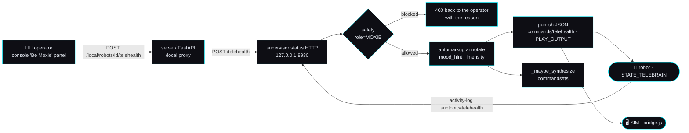

# 🩺 Telehealth — "Be Moxie": the operator drives the body (ADOPT #7)

> ## ✅ **Shipped — 2026-09-02.** Built as specified; this page stays as the design record.
>
> `mqtt/moxie_sdk/telehealth.py` (pure wire + vocabulary) · six runtime verbs and the
> `_on_activity` branch in `moxie_runtime.py` · `GET`/`POST /telehealth` on the status
> server · `fleet.normalize_telehealth` + `GET`/`POST /local/robots/{id}/telehealth` · the
> 🎭 **Be Moxie** console card · `bridge.js`'s `commands/telehealth` handler ·
> `virtual_moxie.py --telehealth` and `sim/run_smoke.sh --telehealth`. The built contract
> is [`mqtt-and-conversation.md` §3.9](../mqtt-and-conversation.md).
>
> **What differs from the brief below, and why.**
> 1. **Chunk bookkeeping (§2.3 step 4/6).** The brief passes `chunk_index=n` / `chunk_num=n`
>    for the *n*-th line of a session. Both are **0**, and the *line* is numbered inside the
>    key instead (`turn_key`/`event_id` = `"{session_id}#{n}"`). Two reasons, both hard:
>    `annotate` emits the mood mark **on chunk 0 only**, so numbering lines as chunks would
>    have left every line after the first with no face — and `sim/web/audio.js`'s ORDERING
>    rule requires an utterance's first chunk to be `chunk_num` 0, so a session-as-one-event
>    stream would stall. Telehealth never streams: one `PLAY_OUTPUT` per line, one utterance
>    per line. Pinned by `test_every_line_is_its_own_utterance_so_each_one_carries_its_mood`.
> 2. **`validate_mood` raises on an unknown label** instead of dropping it. A picker is a
>    closed vocabulary and there is a human at the keyboard; silently giving them a neutral
>    face with no explanation is the one thing worse than refusing.
> 3. **The state ring adopts a robot-reported `session_id` only from an `IN_SESSION`
>    report.** Found by the SIL run: an `EXITING` report arriving *after* `END_SESSION`
>    resurrected the session, and the next `disable` published a second `END_SESSION` at a
>    robot that had already torn down.
> 4. **`telehealth_view` 404s for a device we have never seen** (matching `safety_view` /
>    `memory_view`), while a robot that merely went offline keeps its transcript and reads
>    `online: false` — an operator whose robot dropped Wi-Fi should not be handed a blank
>    card.
> 5. **T13 is in `sim/test_bridge.mjs`** (headless node, recorded state via
>    `moxieBridge.telehealthStats()`), not in the Playwright suite; **T14** is
>    `sim/run_smoke.sh --telehealth`.
> 6. **Not done here:** the owner guide under `docs/guides/` (that folder is owned by
>    another agent this cycle, as the brief itself says), and the audit's §3.2 scorecard row
>    (a shared table another agent is editing this cycle — only ADOPT #7's status flipped).
>
> **Still unproven without a robot:** every item in §6 below. B1 (the mode is the trigger)
> is now observable in the SIL run only in the sense that the *config* really carries
> `moxie_mode:"TELEHEALTH"`; what the robot does with it remains field-proven, not
> capture-proven.

> **Backlog brief v1 · 2026-09-02.** The build document for
> [OpenMoxie feature audit](../openmoxie-feature-audit.md) **§4.1 ADOPT #7** — *"`moxie_mode:\"TELEHEALTH\"`
> + `PLAY_OUTPUT`/`INTERRUPT` makes Moxie a telepresence body — the single best demo, and a real
> accessibility feature. We already have the enum; we need the command path and a page."* — effort **M**.
> The §3.2 scorecard row is blunter: *"`MoxieMode.TELEHEALTH` exists in `cloud_config.py`; **no command
> path, no UI**."*
>
> **Clean-room.** The protocol below is taken entirely from **our own** recovered corpus — chiefly
> [`telehealth.md`](../../reverse-engineering/protocol/telehealth.md) (the
> `embodied.telehealth.TeleHealth.proto` recovered from the v24.10.803 image),
> [`boot-and-launcher.md`](../../reverse-engineering/firmware/boot-and-launcher.md) (the `STATE_TELEBRAIN`
> launcher state) and [`proto-catalog.md`](../../reverse-engineering/protocol/proto-catalog.md) — never
> from the vendor app. **OpenMoxie** (MIT, © Justin Beghtol) is read as prior art and cited by path: we
> describe what its puppet page *does* and port the behavior, we never copy its code.

## Why this is worth building

Every other feature in the backlog makes Moxie a better conversationalist. This one makes Moxie a
**second body for a person who is somewhere else** — a parent on a work trip, a grandparent two time
zones away, a speech therapist who needs the child to look at a friendly face instead of a video window.
The protocol for it already exists in the firmware, we have already recovered it, and the enum is already
in our config builder. What is missing is a publish call and a panel.

It is also the shortest path from *"our appliance talks to a robot"* to *"you can see it work in ten
seconds"* — which is the audit's own verdict on OpenMoxie's version: 🟢 *"the demo that sells it"*.

---

## 0. What our corpus establishes

### 0.1 The mode

| # | Claim | Source |
|---|---|---|
| E1 | **`enum MoxieMode { DEFAULT_MODE=0; TELEHEALTH=1; }`** lives in `embodied/logging/Cloud.proto`, and `RobotCloudConfig` carries it as **field 21**, `embodied.logging.MoxieMode moxie_mode = 21`. | [`proto-catalog.md`](../../reverse-engineering/protocol/proto-catalog.md) :212, :369 |
| E2 | Our config builder already emits it: `build_robot_cloud_config(..., moxie_mode: MoxieMode = MoxieMode.DEFAULT_MODE)` → `"moxie_mode": MoxieMode(moxie_mode).name`. | [`cloud_config.py`](../../../mqtt/moxie_sdk/cloud_config.py) |
| E3 | **`STATE_TELEBRAIN`** runs *"perception + MAINAPP, **no BRAIN**"* and is entered from `STATE_RUNNING` on a telehealth session. The camera and mic stay live; the on-device dialog engine does not. | [`boot-and-launcher.md`](../../reverse-engineering/firmware/boot-and-launcher.md) :48, :61 · [`telehealth.md`](../../reverse-engineering/protocol/telehealth.md) :12–14, :20–28 |
| E4 | *"Dropping the local ChatScript/LLM brain is the whole point: the remote human **is** the brain, so there's no on-device dialog engine to conflict with the operator's lines."* | [`telehealth.md`](../../reverse-engineering/protocol/telehealth.md) :26–28 |

### 0.2 The protocol — verbatim from the recovered `.proto`

[`telehealth.md`](../../reverse-engineering/protocol/telehealth.md) :30–58 gives the whole schema. The
parts a build agent needs:

```proto
enum Action     { UNKNOWN_ACTION=0; START_SESSION=1; PLAY_OUTPUT=2; END_SESSION=3; UPDATE_STATE=4; INTERRUPT=5; }
enum RobotState { UNKNOWN_STATE=0;  READY=1; IN_SESSION=2; EXITING=3; }

message Output {                       // one thing for Moxie to say / perform
  optional string line_id      = 1;    // id of a pre-authored line (or ad-hoc)
  repeated string line_params  = 2;    // fill-ins for a templated line
  optional string text         = 3;    // spoken text
  optional string markup       = 4;    // behavior markup — face/motion/audio
}
message TelehealthMessage {
  optional uint64      timestamp   = 1;  optional Action     action = 2;
  optional Output      output      = 3;  optional RobotState state  = 4;
  optional string      session_id  = 5;
  optional string software_version = 100;  optional string module_name = 101;
}
message TelehealthRobotCommand { optional string command = 1; optional TelehealthMessage message = 2; }  // cloud → robot
message TelehealthRobotEvent   { optional string subtopic = 1; optional TelehealthMessage message = 2; } // robot → cloud
```

**Transport** ([`telehealth.md`](../../reverse-engineering/protocol/telehealth.md) :81–91, cross-checked
against [`mqtt-and-conversation.md`](../mqtt-and-conversation.md) :290–300 and
[`cloud-protocol.md`](../../reverse-engineering/protocol/cloud-protocol.md) :144–150):

- **cloud → robot** `/devices/{device_id}/commands/telehealth` — a `TelehealthRobotCommand`, sent as
  **JSON** like every other `commands/{name}` payload (`remote_chat`, `query_result`, …).
- **robot → cloud** `events/client-service-activity-log` with **`subtopic: "telehealth"`** — a
  `TelehealthRobotEvent` carrying the robot's `state`. Our `_on_activity` already parses that topic and
  already knows about the `telehealth` subtopic *in a comment*; it has no branch for it.
- `Output.markup` is *"the full behavior language"* — **the exact grammar our automarkup floor already
  emits** ([`telehealth.md`](../../reverse-engineering/protocol/telehealth.md) :16–17, :89–91). That is
  the whole reason this brief is **M** and not **L**: the expressive half is already built and pinned by
  goldens.

**Session shape** (:66–79): `START_SESSION → (PLAY_OUTPUT | INTERRUPT)* → END_SESSION`, with the robot
reporting `READY → IN_SESSION → EXITING → READY`.

### 0.3 We already have wire-tested builders — for the *proto* form

[`tools/robot-toolkit/moxie_toolkit/cloud.py`](../../../tools/robot-toolkit/moxie_toolkit/cloud.py) ships
`telehealth_play_output(text, markup, …)`, `telehealth_session(action, …)`, `telehealth_command(message)`,
`telehealth_topic(device_id)` and `parse_telehealth_event(payload)`, round-tripped by
[`tools/robot-toolkit/test_telehealth.py`](../../../tools/robot-toolkit/test_telehealth.py) against the
compiled `TeleHealth_pb2`. **Those are protobuf builders and the runtime path is JSON**, so the runtime
does not import them — but they are the **schema oracle**: a hermetic test cross-checks our JSON keys
against the real proto's field names, so a typo cannot ship (§4, T3).

### 0.4 Observed vs. inferred — the robot's behavior in this mode

| | Statement | Standing |
|---|---|---|
| ✅ | The proto, its enum values and field numbers; `MoxieMode` and its field 21; `STATE_TELEBRAIN`'s component set; both transport topics | **recovered** from the v24.10.803 image |
| ⚠️ **B1** | **That pushing `moxie_mode:"TELEHEALTH"` in `/config` is what puts the robot into `STATE_TELEBRAIN`.** Our corpus says the state is *"entered from `STATE_RUNNING` when a telehealth session starts"* — it does not name the trigger. OpenMoxie's `views.py::puppet_api` does exactly this (`robot_config["moxie_mode"] = "TELEHEALTH"` → re-push config) in a server that drives real robots. **Field-proven, not capture-proven** — the same standing as `pairing_status:"unpairing"` ([config contract](../config-and-telemetry-contract.md#the-pairing-gate-permits-and-what-a-pending-robot-is-sent)). | **assumption, behind one constant** |
| ⚠️ **B2** | **What `INTERRUPT` looks like physically.** Our page reads it as *"cuts Moxie off mid-line (barge-in from the operator side)"* (:60–62). Nothing observed. | **inferred** |
| ⚠️ **B3** | **Whether a robot in TELEHEALTH still emits `events/remote-chat`.** With no BRAIN it probably has no dialog turn to request — but "probably" is not a capture. Our design must be correct either way (§2.5). | **unknown** |
| ⚠️ **B4** | **Whether bedtime suppresses `PLAY_OUTPUT`.** `weekday_bedtime_*` is enforced on the robot; nothing says how it interacts with a puppet line. | **unknown** |
| ⚠️ **B5** | **Whether `Output.line_id` / `line_params` resolve against on-board content.** The field comment says *"id of a pre-authored line"*; we have no catalog of those ids. | **unknown — do not emit them** |

---

## 1. The seam it plugs into



| Where | File | What exists today |
|---|---|---|
| The mode | [`moxie_sdk/cloud_config.py`](../../../mqtt/moxie_sdk/cloud_config.py) | `MoxieMode.TELEHEALTH = 1`, emitted as `"moxie_mode"` by `build_robot_cloud_config`. **Never set to anything but `DEFAULT_MODE`.** |
| Config push | [`moxie_runtime.py`](../../../mqtt/supervisor/moxie_runtime.py) `update_config` / `_push_config` | per-robot overrides, deep-merged over the fleet layer, re-pushed on change — **exactly the machinery the mode toggle needs**, no new plumbing |
| Command publish | same, `_publish_chat` / `_query_payload` / `feed_stt` | the file already publishes to `commands/remote_chat`, `commands/query_result`, `commands/tts`, `commands/zmq`. `commands/telehealth` is the one command in the recovered table with no publisher. |
| Robot → cloud | same, `_on_activity` | parses `client-service-activity-log`, handles `query` and `mentor_behavior`; **no `subtopic == "telehealth"` branch** |
| Markup | [`moxie_sdk/automarkup.py`](../../../mqtt/moxie_sdk/automarkup.py) `annotate` | pure, deterministic, mood/gesture hints, golden-pinned. p95 0.23 ms/line. |
| Vocabulary | [`moxie_sdk/vocab.py`](../../../mqtt/moxie_sdk/vocab.py) | the 11 `ePlaybackMood` names + values and `MAX_INTENSITY = 2`, cited to `behavior-markup.md`:107–133 |
| Safety | `moxie_runtime.py` `_assess` / `_record_safety` | a `MOXIE`-role classifier for text about to be spoken, plus the parent's review journal |
| Voice | same, `_maybe_synthesize` | renders a line to a `CloudTTSResponse` on `commands/tts` — how the SIM gets a voice |
| Transcript | same, `feed_stt` → `_note("stt", "👂 heard: …")` | the child's words already reach the supervisor as text; they land in a **global** 60-entry `recent` ring, not a per-device one |
| Console | [`server/moxie_server/main.py`](../../../server/moxie_server/main.py) + [`fleet.py`](../../../server/moxie_server/fleet.py) + [`server/static/`](../../../server/static/) | the four-file card pattern: runtime handler → pure `normalize_*` → `/local/*` route → card + `refresh*()` |
| SIM | [`sim/web/bridge.js`](../../../sim/web/bridge.js) | subscribes `commands/remote_chat`, `commands/tts`, `events/remote-chat`, `+/config`, `commands/motor`. **Not `commands/telehealth`.** |

### Prior art — OpenMoxie's puppet page

`views.py::puppet_api` (one view, ~35 lines) takes four commands — `enable` / `disable` (write
`robot_config["moxie_mode"]` and re-push), `speak` (`speech`, `mood`, `intensity`), `interrupt` — and its
GET returns `{online, puppet_state, puppet_enabled}` for a poll.
`moxie_server.py::send_telehealth_speech` builds the markup from `(mood, intensity)` and publishes
`{"command":"telehealth","message":{"action":"PLAY_OUTPUT","output":{"text","markup"}}}`;
`send_telehealth_interrupt` publishes `{"action":"INTERRUPT"}`. Their inbound branch stores the robot's
reported `state` (`put_puppet_state`). `templates/hive/puppet.html` is a text box, a mood `<select>`, an
intensity range slider, an Interrupt button and a jQuery poll.

**What we port:** the four verbs, the mood+intensity control, the state poll, and the insight that the
mode toggle is just a config write. **What we do differently, and why:** intensity is an **integer 0–2**
(the recovered `maxIntensity=2`, not a 0.0–1.0 float); the operator's line goes through **our safety
classifier and the parent's journal**; and a blocked line is **refused back to the operator** rather than
silently rewritten (§2.3). Credit is recorded in [`ATTRIBUTION.md`](../../../ATTRIBUTION.md).

---

## 2. The design

### 2.1 A pure wire module

```python
# mqtt/moxie_sdk/telehealth.py   (new — pure, stdlib only, no runtime imports)

ACTIONS = ("UNKNOWN_ACTION", "START_SESSION", "PLAY_OUTPUT",
           "END_SESSION", "UPDATE_STATE", "INTERRUPT")          # telehealth.md:35
STATES  = ("UNKNOWN_STATE", "READY", "IN_SESSION", "EXITING")   # telehealth.md:36

def build_telehealth_command(action: str, *, text: str = "", markup: str = "",
                             session_id: str = "", timestamp: int | None = None) -> dict:
    """A `TelehealthRobotCommand` as the JSON the robot's command handler reads.
    `output` is present only for PLAY_OUTPUT; `line_id`/`line_params` are never
    emitted (assumption B5 — we have no catalog of authored line ids)."""

def parse_telehealth_event(payload: dict) -> dict:
    """`{subtopic:"telehealth", message:{state, session_id, timestamp}}` -> a normalized
    `{state, session_id, at}`. An unknown state name is preserved verbatim and flagged,
    never coerced — a robot telling us something new must not be silently rounded off."""
```

Invariants worth pinning as tests: an action outside `ACTIONS` raises; `PLAY_OUTPUT` with empty text
raises; every other action emits **no** `output` key at all; the JSON keys are exactly the recovered
field names.

### 2.2 Runtime methods (`moxie_runtime.py`)

| Method | Does |
|---|---|
| `telehealth_enable(device_id, on)` | writes `moxie_mode` into this robot's config overrides and re-pushes `/config` — reusing `update_config`, so the fleet⊕robot merge, the console's layer labels and the existing config tests all apply unchanged |
| `telehealth_session(device_id, action)` | publishes `START_SESSION` / `END_SESSION` / `UPDATE_STATE`, mints and remembers a `session_id` on start, clears it on end |
| `telehealth_speak(device_id, text, *, mood=None, intensity=None, gesture=None)` | the hot path — §2.3 |
| `telehealth_interrupt(device_id)` | publishes `{"action": "INTERRUPT"}` |
| `telehealth_view(device_id)` | `{ok, enabled, session_id, state, state_at, online, in_bedtime, transcript[]}` |
| `_on_activity(...)` | **new branch**: `subtopic == "telehealth"` → `parse_telehealth_event` → store the reported state, `_note("telehealth", …)` |

All six refuse a device that is not on the permit list — see §2.4.

### 2.3 The speak path, in order

1. **Permit check.** Not permitted → `{"ok": False, "error": "not permitted"}`. No publish.
2. **Mode check.** `moxie_mode != TELEHEALTH` → refuse with a message the console can act on
   (*"turn on Be Moxie first"*). Publishing `PLAY_OUTPUT` at a robot running its own brain would put two
   voices in one mouth.
3. **Safety — and yes, the operator's text is checked.** `_assess(text, role=safety_seam.MOXIE)`, the same
   classifier that guards the brain's own output.

   > **The decision, and the argument for it.** It is tempting to exempt a human operator: a clinician is
   > not a language model. Three reasons not to. **(a)** The classifier's `MOXIE` role is defined as *text
   > about to be spoken to a child* — the author is not part of that definition, and the child cannot tell
   > the difference. **(b)** Telehealth's entire premise is that the operator is a **third party** — a
   > therapist, a remote relative, whoever the parent handed a link to. The appliance's promise is about
   > what the child hears, not about who typed it, and an unchecked channel is a hole a *social* attack
   > walks through, not a technical one. **(c)** The parent's safety journal is their record of what was
   > said to their child; a channel that bypasses it makes the journal a lie.
   >
   > **But the handling differs from the brain path, deliberately.** When a model produces an unsafe line
   > there is nobody to tell, so the runtime substitutes a redirect. Here a human is at the keyboard: a
   > **BLOCK returns 400 with the verdict's categories and speaks nothing**, so the operator can rephrase.
   > A FLAG passes through and is journaled. Substituting a redirect for a clinician's sentence would be
   > both useless and dishonest.
4. **Markup.** `annotate(text, mood_hint=mood, gesture_hint=gesture, intensity=intensity, turn_key=session_id, chunk_index=n)`.
   `intensity` is a **new keyword-only `int | None = None`** on `annotate` that overrides the
   punctuation-derived value from `_score_mood`; defaulting to `None` means **the 8 golden fixtures in
   `sim/tests/goldens/annotate.json` must stay byte-identical** — that is an acceptance criterion, not a
   hope. Out-of-range values clamp to `vocab.MAX_INTENSITY`; an unknown mood name is dropped by the
   existing alias rules rather than passed to the wire.
5. **Publish** `commands/telehealth` with `action: "PLAY_OUTPUT"`, `output: {text, markup}`.
6. **`_maybe_synthesize(device_id, markup, event_id=session_id, chunk_num=n)`** so the SIM (and any
   voice-enabled client) actually speaks it. A real robot self-synthesizes and ignores this
   ([`mqtt-and-conversation.md`](../mqtt-and-conversation.md) §5.3).
7. **Journal + transcript.** Append `{who: "operator", text, at}` to the per-device transcript ring and
   `_note("telehealth", f"🎭 said '{text[:40]}'")`.

### 2.4 How it interacts with everything already shipped

| Shipped feature | Interaction | Decision |
|---|---|---|
| **Pairing gate** (PR #27) | a pending robot must never be puppetable — it is by definition a device we have not identified | every `telehealth_*` method checks `is_permitted` first; the console hides the panel for a pending robot and says why |
| **Safety gate** (PR #20) | see §2.3 | operator text is checked as `MOXIE`; BLOCK → 400 to the operator, FLAG → journaled and spoken |
| **Streaming** (PR #17) | irrelevant here — there is no brain and no token stream; the operator's line is complete when they press send | telehealth never streams; one `PLAY_OUTPUT` per line. `INTERRUPT` is the barge-in primitive instead. |
| **Automarkup floor** (ADOPT #3) | the operator gets the same expressive engine the brain gets, for free | one new optional `intensity` parameter; goldens unchanged |
| **Bedtime** (`weekday_bedtime` / `weekend_bedtime`) | **B4 — unknown whether the robot suppresses `PLAY_OUTPUT` inside the window** | do **not** override bedtime and do **not** pretend to know: a pure `in_bedtime(cfg, now_local) -> bool` feeds a console warning — *"this robot is inside its bedtime window; the line may not be delivered"* — and the line is sent anyway. Guessing either way would be worse than telling the operator the truth. |
| **Memory** (BEYOND #4) | should a puppeted line become something Moxie "remembers"? | **no.** Memory is built by `session.summarize()` at end-of-conversation from a *brain* session; a telehealth session has no brain and no conversation object. Writing operator lines into the child's memory would make Moxie later "recall" things it never thought. The transcript is the record. |
| **Fleet config** (ADOPT #6) | `moxie_mode` is a per-robot override, never a fleet default | `telehealth_enable` writes the robot layer only; the ⚙️ form's *"Apply to all robots"* must not be able to put a whole fleet into puppet mode |

### 2.5 What the child says, and how it reaches the operator

The contract already carries it. `settings.props.stt = "4"` streams the robot's microphone to us over
ZMQ ([`mqtt-and-conversation.md`](../mqtt-and-conversation.md) :328–329); `handle_zmq` → `feed_stt`
transcribes it and already emits `👂 heard: …`. So the "live transcript" is a **read of data the runtime
already produces** — the only new code is a **per-device ring** (`deque(maxlen=200)` of
`{who: "child"|"operator", text, at}`) instead of the global 60-entry `recent`.

> **Decision: text only. No child audio and no video reach the operator, this phase.** Three reasons.
> **(a)** `LoggingPolicy` is the contract's own line between text and media (`NO_DATA` / `NO_MEDIA` /
> `FULL`), and nothing in it authorizes piping a live child microphone into a third party's browser.
> **(b)** The recovered protocol is *text out, status back* — `TelehealthMessage` has no audio field, so an
> audio return path would be **our** invention, not a recovered capability, and would need its own brief.
> **(c)** A transcript in a console and a live listen-in on a child's room are different products with
> different consent stories.
>
> **The honest limit:** a real clinician wants to *hear* the child, and this phase does not let them. That
> is a stated non-goal with a named place to argue it later (`LoggingPolicy.NO_MEDIA` and a parent-facing
> consent step), not an oversight.

**B3 — what if a robot in TELEHEALTH still sends `events/remote-chat`?** Unknown. The design is correct
either way: while a session is active the runtime **does not call the brain** for that device; it answers
nothing and records `_note("telehealth", "ignored a remote-chat during a session")`. A brain reply racing
the operator is the one failure mode that would look broken to a child, and one `if` prevents it.

### 2.6 The console page — 🎭 "Be Moxie"

A new card in the ✅ Your Moxie tab, following the `permits-card` / `memory-card` pattern exactly
(markup in [`server/static/index.html`](../../../server/static/index.html), a `refreshTelehealth(deviceId)`
in [`app.js`](../../../server/static/app.js) wired into `refreshLive()`'s chain):

| Element | Behavior |
|---|---|
| **Mode switch** | *Be Moxie: off / on.* On → `POST … {action:"enable"}` → config re-push → `START_SESSION`. The card states plainly what the switch does: **"Moxie stops thinking for herself and says only what you type."** |
| **Line box + Send** | a text field; Enter sends. Disabled with a reason when the robot is pending, offline, or the mode is off. |
| **Mood picker** | the **11 recovered `ePlaybackMood` names** from `vocab.MOODS` — neutral, happy, sad, angry, shy, surprised, afraid, concerned, confused, curious, embarrassed. Not a free-text box: the vocabulary is closed and the picker is where that is enforced for a human. |
| **Intensity** | three steps, **0 / 1 / 2** (`vocab.MAX_INTENSITY`), labelled *gentle / normal / strong* — not a 0–1 float, because 0–2 is what the robot's enum actually accepts. |
| **Interrupt** | one button, always enabled during a session; sends `{"action":"INTERRUPT"}` |
| **Live transcript** | the per-device ring, newest last, child lines and operator lines visually distinct; polls with the existing `refreshLive()` cadence — no new poller |
| **State line** | `READY` / `IN_SESSION` / `EXITING` as the *robot* reported it, with the timestamp, plus **"never reported"** when the robot has said nothing — the honest state, not an assumed one |
| **Bedtime warning** | inline, when `in_bedtime` is true (§2.4) |

The SIM gets the other half: `bridge.js` gains a `commands/telehealth` subscription and a
`handleTelehealth(payload)` that routes `message.output.{text, markup}` into the **existing**
`handleRemoteChat` rendering path (`setSpeech` → `applyMarkup` → gesture/tree/face). ~12 lines, and it is
what makes the SIM a faithful robot double for this channel rather than a special case.

---

## 3. Tests

Hermetic first; nothing here needs a robot.

| # | Test | Kind | Asserts |
|--:|---|---|---|
| T1 | `test_telehealth.py::test_build_command` | hermetic, pure | JSON shape per action; `output` present **only** for `PLAY_OUTPUT`; `line_id`/`line_params` never emitted; unknown action raises; empty `PLAY_OUTPUT` text raises |
| T2 | `test_telehealth.py::test_parse_event` | hermetic, pure | the four `RobotState` names parse; an unknown state is preserved and flagged, not coerced; a malformed payload returns a safe empty view rather than raising |
| T3 | `test_telehealth.py::test_schema_matches_proto` | hermetic (skips if protobuf absent) | every JSON key we emit is a real field name on `TeleHealth_pb2.TelehealthMessage` / `Output`, and every action string is a real `Action` enum name — the recovered proto as the oracle (§0.3) |
| T4 | `test_telehealth_runtime.py::test_speak_roundtrip` | hermetic (real `MoxieRuntime`, fake transport) | `telehealth_speak` publishes exactly one `commands/telehealth` PLAY_OUTPUT **and** one `commands/tts`; the markup validates against `vocab.validate_markup`; the mood picked is the mood on the wire |
| T5 | `test_telehealth_runtime.py::test_mode_gate` | hermetic | speaking with `moxie_mode = DEFAULT_MODE` refuses and publishes **nothing**; `telehealth_enable` flips `moxie_mode` in the pushed `/config` and only in the robot layer |
| T6 | `test_telehealth_runtime.py::test_permit_gate` | hermetic | every `telehealth_*` method on a pending device refuses and publishes nothing |
| T7 | `test_telehealth_runtime.py::test_safety` | hermetic | a blocked operator line → `ok: False` + the verdict categories, **nothing published**, one journal row; a flagged line → published **and** journaled |
| T8 | `test_telehealth_runtime.py::test_no_brain_during_session` | hermetic | an `events/remote-chat` arriving during an active session produces no `commands/remote_chat` (B3) |
| T9 | `test_telehealth_runtime.py::test_state_ingest` | hermetic | an activity-log event with `subtopic:"telehealth"` updates `telehealth_view`'s state and timestamp |
| T10 | `test_automarkup.py` (existing) + goldens | hermetic | **unchanged and byte-identical** — proof the new `intensity` parameter is additive |
| T11 | `test_telehealth_view.py` | hermetic, pure | `fleet.normalize_telehealth` renders enabled/disabled, never-reported state, bedtime warning, and an empty transcript without throwing |
| T12 | `test_console_roundtrip.py::test_telehealth` | console ↔ supervisor | `GET`/`POST /local/robots/{id}/telehealth` round-trip against a real supervisor: enable → speak → interrupt → disable |
| T13 | `sim/test_bridge.mjs` | node, real `bridge.js` | a `commands/telehealth` PLAY_OUTPUT drives `setSpeech` + `applyMarkup` identically to the equivalent `remote_chat` payload |
| T14 | `sim/virtual_moxie.py --telehealth` in `sim/run_smoke.sh` | SIL, real broker | the SIL robot receives the operator's `PLAY_OUTPUT` with the expected text, replies with a `subtopic:"telehealth"` state event, and the supervisor's `/telehealth` shows `IN_SESSION` — **the end-to-end check that the SIM speaks the operator's line** |

---

## 4. Acceptance criteria

- [ ] An operator types a line in the console and the SIM **speaks it with a mood the operator chose** —
      demonstrated by T14 in CI, not by hand.
- [ ] The published payload's keys and action strings are the recovered proto's, proven by T3 against
      `TeleHealth_pb2` rather than by review.
- [ ] `INTERRUPT` publishes a message with **no** `output` key.
- [ ] Turning the mode on and off is a config write through the existing override path; the fleet layer
      cannot set `moxie_mode`.
- [ ] A **pending** robot cannot be puppeted, and the console says why rather than showing a dead control.
- [ ] An unsafe operator line is **refused to the operator with its reason** and is never spoken; a flagged
      line is spoken and appears in the parent's safety journal.
- [ ] `sim/tests/goldens/annotate.json` is byte-identical to its pre-change contents.
- [ ] The transcript shows what the child said **as text only**; no audio path is added and the docs say so.
- [ ] The card never displays an invented robot state: with no `subtopic:"telehealth"` event received it
      reads *"never reported"*.
- [ ] **B1 is written into the code as one constant with the assumption beside it**, in the shape
      `UNPAIRED_PAIRING_STATUS` set — so a contradicting capture is a one-line fix.
- [ ] `docs/architecture/mqtt-and-conversation.md` §3.5 gains the built `telehealth` command row, and the
      audit's ADOPT #7 and §3.2 rows flip in the same PR.

---

## 5. Effort, files, risks

**Effort: M.** The protocol is recovered, the markup engine is built, the config machinery exists and the
console card pattern is four known files. The work is breadth, not depth: one pure module, six runtime
methods, one status verb, one proxy route, one card, one SIM handler, fourteen tests.

**Files to touch**

- **New:** `mqtt/moxie_sdk/telehealth.py` · `sim/tests/test_telehealth.py` ·
  `sim/tests/test_telehealth_runtime.py` · `sim/tests/test_telehealth_view.py`
- `mqtt/supervisor/moxie_runtime.py` — the six methods, the `_on_activity` branch, the per-device
  transcript ring, and `GET`/`POST /telehealth` in the **status HTTP region** (`_start_status_server`,
  alongside `/permits` and `/memory`)
- `mqtt/moxie_sdk/automarkup.py` — one optional keyword-only `intensity`
- `mqtt/moxie_sdk/cloud_config.py` — a pure `in_bedtime(cfg, now_local)`
- `server/moxie_server/fleet.py` — `normalize_telehealth`
- `server/moxie_server/main.py` — `GET`/`POST /local/robots/{device_id}/telehealth`
- `server/static/index.html` + `server/static/app.js` — the 🎭 card and `refreshTelehealth()`
- `sim/web/bridge.js` — the `commands/telehealth` subscription and handler
- `sim/virtual_moxie.py` + `sim/run_smoke.sh` — the `--telehealth` mode
- `sim/test_bridge.mjs` · `sim/tests/test_console_roundtrip.py`
- Docs: `docs/architecture/mqtt-and-conversation.md` §3.5 · `docs/architecture/openmoxie-feature-audit.md`
  §3.2 + §4.1 · a short owner guide under `docs/guides/` *(that folder is owned by another agent this
  cycle — land the guide as a follow-up)*

**Risks**

| # | Risk | Mitigation |
|--:|---|---|
| R1 | **B1 is wrong** and `moxie_mode` is not the trigger for `STATE_TELEBRAIN`. Then the toggle is cosmetic and `PLAY_OUTPUT` may arrive at a robot still running its own brain. | One constant, one assumption note, same pattern as `"unpairing"`. The mode gate in §2.3 step 2 means we never publish a line we believe the robot is unprepared for — and if B1 is wrong, the observable symptom is *two voices*, which is loud, not silent. |
| R2 | **Two voices** more generally: an operator line racing a brain reply. | The §2.5 rule (no brain calls during a session) plus the mode gate. T8 pins it. |
| R3 | A puppet channel is a **social** attack surface — whoever can reach the console can speak to the child in Moxie's voice. | The safety classifier applies (§2.3); every line is journaled with `who: "operator"`; the panel is behind the console's existing auth and the permit gate. **This is the feature's inherent risk and the docs must name it, not bury it** — the mitigation is that a parent can read every line afterwards. |
| R4 | `line_id` / `line_params` (**B5**) look useful and someone will be tempted to guess ids. | The builder refuses to emit them. An id we cannot cite is an id we do not send. |
| R5 | Bedtime (**B4**) — the operator sends a line that silently never plays. | Warn, send, and show the robot's own reported state; never claim delivery we cannot observe. |
| R6 | The per-device transcript ring is a new store of a child's words. | It is **in-memory and bounded** (200 entries), not written through `store.py`, and it is subject to the same `LoggingPolicy` check the safety journal uses — under `NO_DATA` the ring keeps operator lines only. |
| R7 | `bridge.js` and `virtual_moxie.py` changes touch the SIL harness that gates every other PR. | T13/T14 are the same shape as the existing bridge/SIL tests; the new subscription is additive and the old topics are untouched. |

---

## 6. What only a physical robot can settle

1. **B1** — that `moxie_mode:"TELEHEALTH"` in `/config` is what enters `STATE_TELEBRAIN`.
2. **B2** — what `INTERRUPT` does to a line already in the air (clean cut, fade, or ignored mid-phoneme).
3. **B3** — whether a brain-less robot still emits `events/remote-chat`.
4. **B4** — whether bedtime suppresses `PLAY_OUTPUT`.
5. **B5** — whether `line_id` resolves against on-board authored content, and what those ids are.
6. **Whether the robot reports `IN_SESSION` at all** on the activity-log subtopic, or only on state change
   — our view renders "never reported" honestly either way, but the difference decides whether the poll is
   informative or decorative.

Everything else in this brief is executable today against the SIM, and the SIM check (T14) is a real
proof: a person types a sentence in a browser and a robot-shaped thing says it, with the face the person
picked, through the same markup a real Moxie would perform.

---
📖 [Backlog index](README.md) · [OpenMoxie feature audit](../openmoxie-feature-audit.md) · [Telehealth protocol (RE)](../../reverse-engineering/protocol/telehealth.md) · [Boot & launcher](../../reverse-engineering/firmware/boot-and-launcher.md) · [MQTT & conversation](../mqtt-and-conversation.md) · [Config & telemetry contract](../config-and-telemetry-contract.md) · [Docs index](../../README.md)
