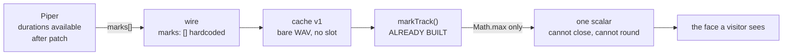

# 👄 `TTSMark[]` visemes — the research slice, and what the row turns out to be about

> **Research brief v1 · 2026-09-06 · SPECIFICATION ONLY.** The answer to the audit's §4.4 **#4**
> [*"`TTSMark[]` visemes"*](../openmoxie-feature-audit.md):969, whose own last words are
> **_"Send a research slice, not a build agent."_** This page is that slice. It answers the two
> questions that row left open, names every field that would change, and argues — with numbers — that
> the row as written is **not** the 10× it looks like, and that the cheap half of it is.
>
> ## ⛔ NOTHING HERE IS BUILT, AND THAT IS THE ASSIGNMENT — 2026-09-06
>
> No code, no config key, no route, no test file was written with this brief. The tree is unchanged
> apart from this page and its two index entries. **Verify before assuming otherwise:**
> `marks` is still constructed empty at [`tts.py`](../../../mqtt/moxie_sdk/tts.py):378 and hardcoded
> `marks: []` at [`functions/api/_lib/wire.js`](../../../functions/api/_lib/wire.js):132, and the SIL
> robot's counter at [`sim/virtual_moxie.py`](../../../sim/virtual_moxie.py):488 still prints `0`.

> **Clean-room.** Every claim below was read from **this repository** and from the **installed Piper
> package on the build box**, on 2026-09-06. Nothing is taken from the vendor Android app or its
> decompiled output. The `TTSMark` shape is our own recovered proto, already published at
> [`ai-seam.md`](../ai-seam.md):356. **OpenMoxie** (MIT, © Justin Beghtol) has no viseme implementation
> to read: it is not prior art for this row, and nothing is ported by this brief, so
> [`ATTRIBUTION.md`](../../../ATTRIBUTION.md) needs no new entry until code lands. **Piper**
> (`piper1-gpl`, the OHF-voice fork) is described by the behaviour of the installed package and cited by
> file and line in its own tree; no Piper source is copied here.

---

## 0. Why this row got a research slice

The audit ranked #4 above every robot-side item *on the steer* — it serves the public page, which is
where a stranger forms their whole opinion of this project — and below the three above it *on
readiness*, because one load-bearing question was unanswered: **can Piper emit the alignment we need?**

That question is now answered (§2). But answering it turned up something the row did not anticipate,
and which changes what the row is for. The short version, before the detail:

> **The consumer is already built. The producer is missing. And neither of those is the bottleneck —
> the *renderer* is.** Moxie's mouth has exactly **one** externally drivable degree of freedom, and the
> rule that combines a mark track with the audio envelope can only ever open her mouth further, never
> close it. Feed a perfect phoneme track into today's face and you get a differently-timed version of
> the same one-dimensional animation. §4 shows this at the line level; §5 prices it.

---

## 1. What is known, what is measured, what is inferred, and what is unknown

Nothing below is stated at uniform confidence. Every row carries a label:

| Label | Meaning |
|---|---|
| **PROVEN** | Read from a file in this repo, at the line cited, on 2026-09-06. |
| **MEASURED** | Executed on the build box on 2026-09-06 and the output observed. Reproducible; not committed. |
| **INFERRED** | Our reading of a PROVEN or MEASURED fact, where the fact gives the mechanism but not the consequence. Reasoned, not established. |
| **UNKNOWN** | We have no evidence either way, and saying so is the finding. |

### 1.1 The ledger

| # | Claim | Label | Source |
|--:|---|---|---|
| **E1** | The wire shape is `TTSMark { uint32 time; uint32 start; uint32 end; string type; string value }`, carried as `repeated TTSMark marks` on `CloudTTSResponse`. | **PROVEN** | [`tts.py`](../../../mqtt/moxie_sdk/tts.py):12-14; [`ai-seam.md`](../ai-seam.md):356-358 |
| **E2** | `marks` is a parameter of `build_cloud_tts_response` and is written straight through: `"marks": list(marks or [])`. | **PROVEN** | [`tts.py`](../../../mqtt/moxie_sdk/tts.py):369-381, the field at :378 |
| **E3** | `synthesize_cloud_tts` — the only caller of E2 in the SDK — **never passes `marks`**. It calls `synth.synthesize(text)` and forwards audio, rate and channels only. | **PROVEN** | [`tts.py`](../../../mqtt/moxie_sdk/tts.py):408-421 |
| **E4** | The `Synthesizer` interface has no channel for alignment at all: `synthesize(self, text, voice=None) -> bytes`. Every backend returns bare PCM. | **PROVEN** | [`tts.py`](../../../mqtt/moxie_sdk/tts.py):52-59 (the base), :192-206 (gateway), :262-263 (Piper), :288 (tone) |
| **E5** | The SIL robot decodes and counts marks, and logs the count. | **PROVEN** | [`sim/virtual_moxie.py`](../../../sim/virtual_moxie.py):484-488 |
| **E6** | The browser **already** maps marks to a mouth track: `VISEME_OPEN` is a 17-entry viseme→openness table and `markTrack()` turns `TTSMark[]` into a time-sorted `{t, open}` list, handling `viseme`, `word` and `sentence` types and skipping the rest. | **PROVEN** | [`sim/web/audio.js`](../../../sim/web/audio.js):507-510 (`VISEME_OPEN`), :551-566 (`markTrack`) |
| **E7** | In the playback loop the mark track is combined with the envelope as `open = Math.max(open, track[mi].open)` — **the track can only raise the mouth, never lower it.** | **PROVEN** | [`sim/web/audio.js`](../../../sim/web/audio.js):867 |
| **E8** | The face exposes exactly one lip-sync input, a scalar: `setMouthOpen(v)` writes `mouthDrive.v`, and the renderer combines it as `open = Math.max(P.mouthOpen, mouthDrive.v)`. `mouthWidth`, `mouthCurve` and `mouthX` come from the **expression preset only** and no lip-sync path touches them. | **PROVEN** | [`sim/web/moxie.js`](../../../sim/web/moxie.js):1677-1681 (the setter), :1377 (the combine), :1383-1385 (the untouched three) |
| **E9** | All three `AnalyserNode`s in the audio layer call `getByteTimeDomainData` only. `getByteFrequencyData` is **never called anywhere in the file** — the FFT the node already computes is discarded. | **PROVEN** | [`sim/web/audio.js`](../../../sim/web/audio.js):211, :462, :859; `fftSize = 256` at :206, :456, :819 |
| **E10** | The hosted path builds its `CloudTTSResponse` with `marks: []` **hardcoded** — not defaulted, not parameterised. | **PROVEN** | [`functions/api/_lib/wire.js`](../../../functions/api/_lib/wire.js):122-135, the field at :132 |
| **E11** | Since PR #152 a cache hit returns audio synthesised earlier. The stored body is a **bare 16-bit RIFF/WAVE and nothing else**; there is no envelope, no sidecar and nowhere in the entry to put a mark. | **PROVEN** | [`functions/api/_lib/ttscache.js`](../../../functions/api/_lib/ttscache.js) — the "THE STORED BODY IS A WAV" rule in its header; `writeCachedAudio` builds it with `writeWav`, `readCachedAudio` decodes with `pcmFromAudio` |
| **E12** | The cache key is length-prefixed and version-tagged with a literal `lp("v1")`, whose stated meaning is **the entry format**: *"If what is stored ever stops being a 16-bit RIFF/WAVE, old entries must not be read as if it were. Bumping this abandons them all."* | **PROVEN** | [`functions/api/_lib/ttscache.js`](../../../functions/api/_lib/ttscache.js), `ttsCacheKey` and its `"v1"` bullet |
| **E13** | The **local browser Piper path** is a third producer, and it has no envelope at all: `GET /tts?text=…` returns `audio/wav` bytes directly. There is no JSON wrapper in which a mark could travel. | **PROVEN** | [`sim/tts/server.py`](../../../sim/tts/server.py):52-64; fetched at [`sim/web/audio.js`](../../../sim/web/audio.js):441 |
| **E14** | The gateway voice is an **OpenAI-compatible `/v1/audio/speech` call** whose response is `resp.content` — audio bytes. That protocol has no alignment field, so the gateway cannot return marks without a new, non-standard endpoint. | **PROVEN** | [`tts.py`](../../../mqtt/moxie_sdk/tts.py):192-206 |
| **E15** | Our shipped voices are `phoneme_type: espeak`, 22 050 Hz, with a 154-entry `phoneme_id_map` over **IPA**, and VITS inference params `{noise_scale: 0.667, length_scale: 1, noise_w: 0.8}`. | **PROVEN** | [`sim/tts/voices/en_US-amy-medium.onnx.json`](../../../sim/tts/voices/en_US-amy-medium.onnx.json) |
| **E16** | The `.onnx` weights are **not in this repository**. `sim/tts/voices/` holds two `.onnx.json` configs and a README. CI cannot synthesize with a real Piper voice without downloading one. | **PROVEN** (by absence) | `sim/tts/voices/`, three files |
| **E17** | `faster-whisper` is already a (lazy, optional) project dependency for STT. | **PROVEN** | [`mqtt/moxie_sdk/stt.py`](../../../mqtt/moxie_sdk/stt.py):92-113 |
| **M1** | **A stock Piper `.onnx` has ONE output tensor: the waveform.** Measured on `en_US-amy-medium.onnx`: inputs `input`, `input_lengths`, `scales`; output `output` only. Durations are computed inside the graph and discarded. | **MEASURED** | onnxruntime session inspection, build box, 2026-09-06 |
| **M2** | **Piper *can* expose per-phoneme durations, after a one-line graph patch.** Piper ships the patcher: `patch_voice_with_alignment.add_alignment_output()` finds the VITS duration predictor's `Ceil` node — this is `w_ceil` — and appends its output to `graph.output`. Patched, the model reports a second output `/Ceil_output_0`. | **MEASURED** | The patch applied by hand, in memory, on the build box; patched outputs observed as `output` + `/Ceil_output_0` |
| **M3** | **The durations are exact, not estimated.** With the patch, `piper.voice` converts frames to samples as `result[1].squeeze() * hop_length` (`hop_length` 256 by default, absent from our configs). Measured on *"Hello Moxie, how are you today?"*: 75 phoneme ids, per-phoneme sample counts **summing exactly to the 42 496 audio samples** (1.9273 s). | **MEASURED** | Piper 1.7.0 in `/tmp/piper-venv`, `en_US-lessac-medium`, build box |
| **M4** | The alignments come from the **same inference run** as the audio, so they always describe the waveform actually produced — which matters, because `noise_w = 0.8` makes the duration predictor **stochastic**: a second run of the same sentence measured 1.9621 s. | **MEASURED** | Two runs, same text, same model |
| **M5** | The **phoneme sequence** is available with no model, no patch and no extra dependency, via Piper's bundled espeak bridge. Output is **IPA, NFD-decomposed** — stress and length marks (`ˈ`, `ˌ`, `ː`) arrive as separate symbols. | **MEASURED** | `EspeakPhonemizer.phonemize("en-us", …)` → `['h','ə','l','ˈ','o','ʊ',' ','m','ˈ','ɑ','ː','k','s','i', …]` |
| **M6** | **Word timings are not emitted, but are derivable**: the phoneme stream contains explicit `' '` separator phonemes carrying their own duration. Piper never maps phonemes back to source-text character offsets, so a phoneme→*original word* mapping must be reconstructed by us. | **MEASURED** | The `' '` entries appear in the M3 dump with real durations |
| **M7** | The Piper **CLI has no alignment flag** (`-m -c -i -f -d --output-raw -s --length-scale --noise-scale --noise-w-scale --cuda --sentence-silence --volume --no-normalize --data-dir --debug`). But `piper.http_server` already serves alignments: it loads with `include_alignments=True` and returns `{"phonemes": [...], "alignments": [{"phoneme": …, "seconds": …}]}`. | **MEASURED** | The installed package's `__main__` argument parser and `http_server` |
| **M8** | The in-memory patch route needs the full `onnx` pip package, which is **not installed in the venv this repo uses** (`/tmp/piper-venv`). Piper degrades with a warning and silently yields no alignments. The offline route — patch once, ship the patched `.onnx` — needs `onnx` only at patch time, and a patched model still loads normally for audio-only use. | **MEASURED** | `ModuleNotFoundError: No module named 'onnx'` in that venv; the degrade path in `piper/voice.py` |
| **I1** | Because of E7 and E8, populating `marks[]` **alone** cannot make a bilabial closure (`p`/`b`/`m`) visible. `VISEME_OPEN` already assigns `p: 0.06`, but `Math.max` with a loud envelope discards it. Her lips cannot meet on *"mama"* however good the track is. | **INFERRED** | E7 + E8 + the `VISEME_OPEN` values at [`audio.js`](../../../sim/web/audio.js):507-510 |
| **I2** | Because of E8, `/i/` ("ee": wide, nearly closed) and `/u/` ("oo": rounded, nearly closed) are **the same picture**. `VISEME_OPEN` already encodes the collapse — `i`, `r` and `S` are all `0.30`. One scalar cannot carry a two-dimensional shape. | **INFERRED** | E8 + [`audio.js`](../../../sim/web/audio.js):507-510 |
| **I3** | On the hosted demo there is **no Python, no Piper and no espeak** — Pages Functions are JavaScript at the edge, and the voice is a remote gateway (E14). Every producer-side option there is therefore either "the gateway learns a new protocol" or "somebody re-derives the timing without the synthesizer". | **INFERRED** | E10 + E11 + E14 |
| **U1** | **Whether a visitor can tell.** No one has ever put a viseme-driven mouth and an envelope-driven mouth side by side on this project, and no measurement exists. §5 argues from mechanism; it does not claim an observation. This is the single unknown that should gate P2. | **UNKNOWN** | Named, not guessed |
| **U2** | **Whether anything but our SIM will ever read our `marks`.** A real robot synthesizes on-device ([`tts.py`](../../../mqtt/moxie_sdk/tts.py):6-7), so it never receives them. If the answer stays "only our SIM", the viseme alphabet is a private detail; if it does not, it is a frozen compatibility surface. §9 asks the owner. | **UNKNOWN** | No evidence either way |

### 1.2 Four citations that had rotted, found while writing this

The audit row confesses that it cited `virtual_moxie.py:374` for weeks after that line became
`_note_subscription` — *"a citation that rotted silently because nobody re-opened the file."* Re-opening
the files for this brief found **four more of the same defect**, all pointing at the viseme consumer:

| Where | Cites | Actually at | What is at the cited lines today |
|---|---|---|---|
| [`functions/api/_lib/wire.js`](../../../functions/api/_lib/wire.js):113 | `audio.js`:260-282 for `decodeCloudTTS` | :525-548 | a `#tts-status` text setter |
| [`functions/api/_lib/wire.js`](../../../functions/api/_lib/wire.js):114 | `audio.js`:610-614 for the "not a container" comment | :838-848 | blank line + `openUtterance()` |
| [`functions/api/_lib/wire.js`](../../../functions/api/_lib/wire.js):120 | `audio.js`:666-681 for `markTrack` | :551-566 | the chunk-stats comment |
| [`live-sim-demo.md`](live-sim-demo.md):87, :339-340 | `audio.js`:612-633 + `markTrack` at :666-681; `sim/web/README.md`:58-62 | :551-566; `sim/web/README.md`:100-101 | as above; a CSP paragraph |

None of these is caught by CI. `scripts/check-doc-consistency.py` validates conflict markers, a
stale-claim denylist scoped to `docs/reverse-engineering/`, and a version stamp — **it does not open a
cited file and check the line**. Nothing in this repo does. The `file:line` discipline is enforced
socially, by [`README.md`](README.md):74's *"Cite by line"* rule, which is exactly why it rots. **Every
citation on this page was verified by opening the file on 2026-09-06.** They will rot too.

---

## 2. The two questions the row exists to answer

### 2.1 Can Piper emit the alignment we need? — **YES, exactly, after a one-time model patch**

This was the load-bearing unknown and it has a clean answer, measured rather than reasoned (M1-M8):

| What we want | Available? | How, and what it costs |
|---|---|---|
| **Phoneme sequence** | **Yes, free.** | Piper's bundled espeak bridge. No model, no patch, no new dependency (M5). |
| **Per-phoneme durations** | **Yes, and they are exact** — they sum to the sample count, because they come from the same inference that made the audio (M3, M4). | The stock `.onnx` has one output and drops them (M1). Piper's own `patch_voice_with_alignment` appends the duration predictor's `Ceil`/`w_ceil` tensor as a second graph output (M2). Patch **once, offline**, ship the patched voice; a patched model still loads for audio-only use (M8). Then `synthesize(..., include_alignments=True)`. |
| **Word timings** | **Not emitted; derivable.** | The phoneme stream carries `' '` separators with real durations (M6). Piper gives no phoneme→source-character mapping, so word *identity* must be reconstructed by us. |

Two consequences worth stating plainly, because they are the sort of thing that turns into a bug:

1. **Durations are stochastic** (`noise_w = 0.8`, E15/M4). The same sentence yields a different timing
   each run. This is *fine* — the marks always match the audio they shipped with — but it means marks
   can never be regenerated later and reattached to earlier audio. **This is what kills option (b) in
   §2.2**, and it is a fact about the model, not about our plumbing.
2. **The alphabet does not match our consumer.** Piper speaks IPA, NFD-decomposed (M5); `VISEME_OPEN`
   (E6) is a 17-key Polly-ish alphabet. Something has to map 154 IPA symbols onto a viseme set, and
   diacritics (`ˈ`, `ː`, `ˌ`) must be folded into the phoneme they modify rather than becoming mouth
   shapes of their own. That mapping is a contract artifact, not an implementation detail (§3.6).

The CLI cannot do this (M7) — which matters, because [`sim/tts/server.py`](../../../sim/tts/server.py):57
shells out to `python -m piper`. That path would have to move to the Python API or to
`piper.http_server`, which already serves alignments (M7).

### 2.2 Where would marks come from, post-#152?

Three options. The cache (E11, E12) forces the question because a hit returns audio nobody is
synthesizing at that moment.

| # | Option | What it costs | Verdict |
|--:|---|---|---|
| **(a)** | **Cached alongside the audio.** Bump `lp("v1")` → `"v2"` and make the stored body a container carrying WAV **and** marks. | Abandons every existing entry — which is the documented, intended meaning of that field (E12), not a side effect. The entry stops being a plain `audio/wav`. The module's stated core invariant — *"the hit path decodes with `pcmFromAudio`, the **same** function the miss path decodes with"*, so byte-identity is a property of one decoder — must be preserved for the audio half. Needs an agent in `functions/api/`. | **The only correct option**, and it is P2. |
| **(b)** | **Regenerated on a hit** from the text. | Needs a phonemizer *and a duration model* at the edge, where there is no Python, no Piper, no espeak (I3). And it cannot work even in principle: durations are stochastic (M4), so regenerated timings describe a **different** utterance than the cached bytes. This is the failure mode where her mouth is confidently, precisely wrong. | **Never.** |
| **(c)** | **Derived from the audio** by forced alignment. `faster-whisper` with word timestamps is already a dependency (E17). | Cannot run on Pages Functions at all. Costs an ASR inference per synthesis — more than the ~1 091 ms TTS it would be annotating. | **Not a producer. It is the right *test oracle*** — see §7. |

**The decisive argument for (a) over any parallel-entry scheme** is the one `ttscache.js` already made
for itself when it refused to truncate its digest: a collision there *"would hand one child the audio of
somebody else's sentence, in the wrong words."* Marks in a separately-keyed, separately-evictable entry
have exactly that shape — audio from one sentence, mouth from another. Marks must live **inside the same
entry, under the same key**, or not exist.

---

## 3. The contract touchpoints — fields, not intentions

### 3.1 `mqtt/moxie_sdk/tts.py` — the `Synthesizer` interface

The blocker is E4: `synthesize() -> bytes` has nowhere to put alignment. Two shapes, and the second is
the one that does not break every existing backend:

```
# NOT this — it changes the return type of every Synthesizer:
def synthesize(self, text, voice=None) -> bytes

# This — an opt-in sibling with a default implementation that returns no marks:
def synthesize_aligned(self, text, voice=None) -> tuple[bytes, list[dict]]
    # base class: return self.synthesize(text, voice=voice), []
```

`PiperSynthesizer` overrides it (:217-270). `OpenAIVoiceSynthesizer` (:146-206) does not, and inherits
`[]` — which is correct and permanent (E14). `ToneSynthesizer` and `FallbackSynthesizer` inherit `[]`.
`FallbackSynthesizer` needs one extra rule: **on downgrade the marks must be dropped, not carried** —
the standby's audio must never be described by the primary's alignment.

`synthesize_cloud_tts` (:408-421) then passes them through to the `marks=` parameter that has been
waiting at :369-381 since the file was written.

**The mark record.** `TTSMark` is `{time, start, end, type, value}` (E1). Filled for a viseme:

| Field | Type | Value |
|---|---|---|
| `time` | `uint32` | ms from the start of **this chunk's** audio. Not from the turn — chunks are played independently ([`sim-as-a-client.md`](../sim-as-a-client.md):101). |
| `start` | `uint32` | character offset into the **spoken text** (post-`strip_markup`), or `0`. Piper gives no phoneme→character map (M6); an honest `0` beats a fabricated offset. |
| `end` | `uint32` | as `start`. |
| `type` | `string` | `"viseme"`. `markTrack` matches on substring (E6), and `word`/`sentence` are already understood. |
| `value` | `string` | a viseme id from the frozen table in §3.6 — **not** a raw IPA symbol. |

### 3.2 The wire — `functions/api/_lib/wire.js`

`buildCloudTtsResponse` (:122-135) hardcodes `marks: []` (E10). It gains one optional input, `o.marks`,
defaulting to `[]`. Nothing else in that function changes. Its docstring at :113-121 must be rewritten
anyway — three of its citations have rotted (§1.2).

`functions/api/speech.js` (:230-240) passes it. **RESERVED — another agent is live under
`functions/api/`; this brief names the field and touches nothing.**

### 3.3 The cache entry — `functions/api/_lib/ttscache.js`

Per §2.2(a), and only at P2:

- `ttsCacheKey`: `lp("v1")` → `lp("v2")`. Nothing else in the key changes: marks are a function of
  `(model, voice, text)`, all of which are already components.
- `writeCachedAudio`: the stored body becomes a container carrying the WAV **and** a marks blob. The
  cheapest shape that keeps the module's decoder invariant is a **RIFF `LIST`/custom chunk appended to
  the WAV** — the audio half still decodes with an unmodified `pcmFromAudio`, and a reader that ignores
  the extra chunk gets today's behaviour exactly.
- `readCachedAudio`: returns `{pcm, sampleRate, channels, marks}`. A body with no marks chunk returns
  `marks: []` and is **not** `corrupt` — that is a `v1`-shaped entry under a `v2` key, which cannot
  happen, or a future writer that chose not to emit them, which is legal.
- The `stats` counters gain nothing. Marks are not a decision.

### 3.4 `sim/web/audio.js` — the mouth driver

`markTrack` (:551-566) already produces `{t, open}`. It gains a second field:

```
{ t: <ms>, open: <0..1>, wide: <0..1>, authoritative: <bool> }
```

and the combine rule at **:867** changes from

```
if (track[mi] && track[mi].t <= ms) open = Math.max(open, track[mi].open);
```

to a rule where a present track **replaces** the envelope rather than flooring it, with a short attack
so a step function does not read as a twitch. **This is the single most important line in the brief.**
Until it changes, no viseme work is visible (I1).

`decodeCloudTTS` (:525-548) already carries `marks` through untouched. No change.

### 3.5 `sim/web/moxie.js` — the renderer, and the second degree of freedom

E8 is the ceiling. The face gains one method beside the existing one:

```
moxie.setMouthShape({ open: 0..1, wide: 0..1 })   // new
moxie.setMouthOpen(v)                              // kept — equivalent to {open: v, wide: 0.5}
```

`wide` drives `mouthWidth` at :1384 under lip-sync, the way `mouthDrive.v` drives `open` at :1377.
`getMouthShape()` joins `getMouthOpen()` (:1685) so the tests can read back what was rendered rather
than what was computed — the property the existing test already relies on.

### 3.6 The viseme alphabet — the one new frozen artifact

154 IPA symbols (E15) must map to a small viseme set. The set that already exists in the consumer is
`VISEME_OPEN`'s 17 keys (E6), and keeping it means the wire vocabulary does not change. It gains a
second column, which is the whole point of §3.5:

| viseme | `open` | `wide` | IPA folded in (illustrative, not the full table) |
|---|--:|--:|---|
| `p` | 0.00 | 0.4 | `p b m` — **closed**, which E7 makes unreachable today |
| `f` | 0.10 | 0.4 | `f v` |
| `i` | 0.15 | **1.0** | `i ɪ iː` — wide and nearly shut |
| `u` | 0.20 | **0.0** | `u ʊ uː w` — rounded and nearly shut |
| `a` | 0.80 | 0.6 | `ɑ æ aɪ aʊ` |
| `sil` | 0.02 | 0.5 | silence, `' '`, `^`, `$` |

Note `i` and `u` — same openness, opposite width. Under today's renderer they are the same frame (I2);
that is what a second dimension buys, and it is the only thing that makes phoneme data *look* different
from amplitude data. **Diacritics (`ˈ ˌ ː`) fold into the preceding phoneme and never emit a mark.**

Whether this table is a frozen compatibility surface or a private detail is **U2**, and §9 asks it.

---

## 4. The finding: the consumer is built, and the renderer is the bottleneck

The audit's framing — *"her mouth is animated by amplitude, not phonemes"* — is true and is not the
whole shape of the problem. Reading the three files end to end gives a different picture:



Three things follow, and they reorder the work:

1. **`markTrack` and `VISEME_OPEN` already exist** (E6). The row reads as though the browser needs
   teaching; it does not. This is a producer problem, not a consumer problem.
2. **The combine rule forbids the most legible viseme there is** (E7, I1). Bilabial closure — lips
   meeting on *m*, *b*, *p* — is the one mouth shape a person can identify without hearing the audio.
   `Math.max` against a loud envelope makes it unrepresentable. `VISEME_OPEN` even *has* the right value
   (`p: 0.06`); it is thrown away every frame.
3. **One scalar cannot carry a viseme** (E8, I2). Openness alone maps `/i/` and `/u/` to the same
   picture. And openness alone is *correlated with loudness* — vowels are the loud parts and the open
   parts — which is precisely why the envelope has worked well enough to go unquestioned.

And a fourth, from E9: the `AnalyserNode` is already computing an FFT every frame and the code throws
the spectrum away. Low-band vs high-band energy separates an open vowel from a fricative from a closure
— on **every** path, including cache hits, the gateway, pre-recorded clips and the tone synthesizer, with
no wire change, no cache change and no new dependency. That is not phonemes. It is strictly more than
amplitude, and it is currently free and unclaimed.

---

## 5. Is this 10×? — honestly, **the row as written is not; the cheap half is**

The steer is about what a visitor experiences. So price it against what a visitor actually gets.

**What a visitor actually hears.** `DEMO_MAX_TTS_CHARS` is **300** and one 13-word sentence measured
**1.69 s** ([`live-sim-demo.md`](live-sim-demo.md):467). So a typical reply is **1.7–3 s**, roughly
**7–13 words**, ~20–35 phonemes, perhaps **12–20 merged visemes** — displayed across ~100–180 frames.

**The argument that it is not 10×.** Over 15-odd mouth targets in three seconds, on a face with one
degree of freedom, a viseme track and an envelope produce *similar traces*, because the correlation is
real: vowels are both the loud parts and the open parts. The envelope is not a wrong signal, it is a
**noisy proxy for the right one**. Where it visibly fails is consonant closure — which E7 forbids the
mark track from expressing anyway. So "populate `marks[]`" on today's face buys a differently-timed
version of the same animation: call it **1.2×**, not 10×. An expensive change a visitor cannot
distinguish is worth naming as such, and this is one.

**The argument that part of it is 10×.** The step-change is not marks. It is the mouth being able to
**close** when it should and **round** when it should — §3.4's combine rule and §3.5's second
dimension. Those two changes are what make lip-sync read as *speech* rather than as *a mouth reacting
to volume*, and — the part that decides the ordering — **neither of them needs marks, a wire change, a
cache change, or the gateway**. They can be driven from the spectrum already being computed (E9) on
every path Moxie ever speaks on, including the hosted demo where none of the producer options are
available (I3).

**So the honest ranking is the inverse of the row.** The expensive, contract-touching, cache-flushing
half (real phoneme marks) is the *smaller* visible win and depends on the renderer work to be visible at
all. The renderer work is cheap, universal, and is the precondition for the rest. **U1 stands**: nobody
has measured whether a visitor can tell, and §7's A/B is how that becomes a number instead of an
argument.

---

## 6. P0 / P1 / P2

### P0 — give the mouth the ability to be wrong · **S**

Make the mouth two-dimensional and give a track the authority to close it, then drive it from the
spectrum the `AnalyserNode` already computes (E9).

- §3.5's `setMouthShape({open, wide})` + `getMouthShape()`; `setMouthOpen` kept as a shim.
- §3.4's combine rule: an authoritative track replaces the envelope instead of flooring it (E7).
- A spectral estimator: two or three band-energy ratios → `{open, wide}`. Not phonemes; strictly more
  than a peak.

**Why this is the smallest thing that is provable and useful on its own:** it is testable today against
synthetic mark tracks with no producer at all; it improves every path including the hosted demo, cache
hits and pre-recorded clips; it does not touch `functions/api/` (RESERVED) or the wire; and **without it
P1 is invisible** (I1, I2). Acceptance: the closure test in §7 — currently unpassable by construction.

### P1 — real marks on the local Piper path only · **M**

Where Python runs. Patch the voices offline (M2, M8), add §3.1's `synthesize_aligned`, map IPA →
§3.6's alphabet, populate `marks` at [`tts.py`](../../../mqtt/moxie_sdk/tts.py):418.
[`sim/virtual_moxie.py`](../../../sim/virtual_moxie.py):488 stops printing `0`. The hosted path is
untouched; `sim/tts/server.py` moves off the CLI (M7) or is left on the P0 estimator.

Acceptance: §7's discrimination and mutation suites, plus the A/B that answers **U1** with a number.

### P2 — carry marks to the hosted demo · **L**, and gated on P1's measured verdict

§2.2(a): cache `v2`, a container body, `wire.js` and `speech.js` plumbing, and a gateway that can return
alignment at all (E14 — a new endpoint, not a flag). **Do not start this until P1's A/B says a visitor
can tell.** It costs a full cache flush, an agent in RESERVED territory, and a non-standard extension to
a protocol we do not own.

---

## 7. How this is tested — an ordering, not a magnitude

This project has already learned this lesson once and wrote the scar down. The first version of the
microphone's audio assertion demanded an **absolute correlation floor**, passed on a developer's box at
0.955–0.991, and failed in CI because the runner's own capture saturates
([`sil-and-cicd.md`](../sil-and-cicd.md):360-385). What survived was the **ordering**: in every case,
including the saturated ones, *the clip actually played out-scored the other one.*

A viseme test must be built the same way. **A test that asserts `marks.length > 0` is exactly the check
this project has spent a day learning to distrust** — it passes against a track that is shuffled,
reversed, constant, or 400 ms late.

**T1 · Discrimination, not magnitude.** Build the mouth track for sentence **A**. Score it against A's
own phoneme ground truth and against sentence **B**'s. **A must win.** No absolute floor is asserted.

**T2 · The mutation suite — five ways to be wrong, each of which must redden.** Against the unmutated
track: (i) time-reverse it; (ii) shift it +200 ms; (iii) shuffle the values, keeping the times;
(iv) replace every value with one constant; (v) substitute another sentence's track of the same length.
Each must score *worse*. A non-empty-array assertion survives all five, which is the point.

**T3 · The closure test — the one that cannot pass today.** For a line containing *"mama"* or *"puppy"*,
assert at least one rendered frame where the mouth is **closed** (`open < 0.1`) **while the audio
envelope is loud**. By E7 this is unpassable by construction on today's code, which makes it the exact
acceptance criterion for P0 — a red-first test that proves the change did something.

**T4 · The width test.** The rendered `wide` for an `/i/` mark and a `/u/` mark must differ by more than
some margin at equal `open`. By E8 this is unpassable today (I2). Second red-first test for P0.

**T5 · Read back what was *rendered*.** Every assertion reads `moxie.getMouthShape()`, never the value
the audio layer computed — the discipline [`sim/test_audio.mjs`](../../../sim/test_audio.mjs):322-323
already follows, and the reason its existing viseme assertion is honest: the analyser stub fills `148`
(peak 20 → envelope 0.5) and the test demands `>= 0.79`, so the mark genuinely had to raise the mouth.
That test proves **value mapping**. Nothing today proves **alignment**, and T1–T4 are that gap.

**The oracle.** §2.2(c): `faster-whisper` with word timestamps (E17) is the right ground truth for
T1/T2 — too expensive to ship, correct to test with, and *independent of the thing under test*, which is
what makes it an oracle rather than a tautology.

### ⛔ The ceiling, stated as plainly as the rest of this repo states its own

**CI cannot synthesize with a real Piper voice.** The `.onnx` weights are not in the repo (E16), and
adding a 63 MB binary to make a test run is not a trade this project should take. So T1/T2 must run
against a **committed golden**: one short WAV plus its phoneme timing, generated once on a box that has
the model and checked in. That golden is a fixture, not a proof that Piper still behaves — and since
durations are stochastic (M4), a golden can never be regenerated and compared byte-for-byte. Any test
that appears to verify live Piper alignment in CI is testing a downloader. T3/T4 have no such ceiling:
they run against synthetic tracks and are fully exercisable today.

---

## 8. The fallback path — design it first, because it is the common case for years

On the hosted demo, **the fallback is the only path** until P2 ships, and P2 may never ship. It is not a
degradation; it is the product. Four rules:

1. **Marks are an enhancement layer, never a precondition.** `playCloudTTS` must never reject, stall or
   fall silent for want of marks. Already true and already specified
   ([`live-sim-demo.md`](live-sim-demo.md):87) — it must stay true through every change here.
2. **The no-marks path is the P0 estimator, not "the envelope".** There is exactly one mouth driver with
   two inputs, one of which is optional. There must be **no branch that only runs in one deployment** —
   that is how a path nobody exercises rots, and the hosted demo is the path with the most visitors and
   the least local testing.
3. **A partial track degrades locally, not globally.** Marks covering chunk 0 of a three-chunk turn
   drive chunk 0 and leave chunks 1–2 on the estimator. The seam must not be visible as a mouth that
   freezes or snaps. Per-chunk `time` (§3.1) is what makes this well-defined.
4. **Stale marks are worse than no marks.** A cache hit that returned audio for one sentence with marks
   for another is the lip-sync form of the wrong-voice hazard `ttscache.js` designed its whole key
   around. Hence §2.2's verdict: same entry, same key, or nothing. And hence §2.2(b) is refused outright
   — regenerated timings are *precisely* wrong, and a confidently wrong mouth reads worse than a vague
   one.

**Concretely, per path, after P0:** local Piper via the SDK → real marks (P1). Local Piper via
[`sim/tts/server.py`](../../../sim/tts/server.py) → estimator (no envelope in the route to carry marks,
E13). Gateway → estimator, permanently (E14). Hosted, cache miss → estimator until P2. Hosted, cache hit
→ estimator until P2. Pre-cached clips and the tone synthesizer → estimator. **The estimator is the
default and the marks are the exception**, which is the correct way round for something that will be
true for a long time.

---

## 9. What the owner must decide

1. **Does the mouth get a second dimension?** Everything else follows from this. If the answer is no,
   then §5's argument is the end of the row: amplitude is the answer, P0 shrinks to the combine-rule fix
   alone, and BEYOND #8's viseme half should be **closed as "not worth it"** on the audit page rather
   than left open as a permanent 🟠.
2. **Is `marks` a private detail or a compatibility surface?** (**U2**.) A real robot synthesizes
   on-device and never receives ours. If only our SIM will ever read them, §3.6's table can change
   freely. If not, it must be frozen and published in [`ai-seam.md`](../ai-seam.md) §③ before P1 ships.
3. **Is P2 worth a `v1`→`v2` cache flush and a non-standard gateway endpoint**, for a difference §5
   argues a visitor may not be able to detect? Recommended answer: **not until P1's A/B says so.**
4. **May a patched `.onnx` be shipped?** P1 needs the alignment-patched voice as an artifact (M2, M8).
   That is a binary in the release path and a build step that needs the `onnx` package. If the answer is
   no, P1 is limited to phoneme *sequence* without true durations, which is materially weaker.

### The recommendation: **build P0, specify P1, do not build P2**

P0 is small, provable today with red-first tests (T3, T4), improves every path including the one with
the most visitors, and needs nothing from `functions/api/`. P1 is now fully specified and unblocked —
§2.1 answered the question that was holding it. P2 should stay on this page until **U1** is a number
rather than an argument.

---

## 10. Effort, files, risks

| Phase | Files | Effort | Risk |
|---|---|--:|---|
| **P0** | [`sim/web/moxie.js`](../../../sim/web/moxie.js) (:1377, :1384, :1677-1685), [`sim/web/audio.js`](../../../sim/web/audio.js) (:551-566, :859-868), [`sim/test_audio.mjs`](../../../sim/test_audio.mjs) | **S** | A mouth that now *closes* can look wrong in a new way — the attack/decay constants are a judgement call and need eyes, not just tests. |
| **P1** | [`mqtt/moxie_sdk/tts.py`](../../../mqtt/moxie_sdk/tts.py) (:52-59, :217-270, :408-421), a new IPA→viseme table, [`sim/virtual_moxie.py`](../../../sim/virtual_moxie.py) assertions, patched voices | **M** | The patched-`.onnx` artifact (owner Q4). Stochastic durations mean no byte-exact golden (M4). |
| **P2** | `functions/api/_lib/ttscache.js`, `_lib/wire.js`, `speech.js` — **all RESERVED** | **L** | A full cache flush, plus a gateway protocol extension we do not own (E14). |

**The risk that matters most is not technical.** It is building P1 and P2 first, on the strength of the
row's framing, and discovering afterwards that a visitor watching a three-second reply cannot tell —
having flushed the cache and extended a protocol to get there. §5 is the argument for doing the cheap,
universal half first and making U1 a measurement before spending the rest.

---

📖 [Backlog index](README.md) · [Architecture index](../README.md) ·
[OpenMoxie feature audit](../openmoxie-feature-audit.md) ·
[AI seam](../ai-seam.md) · [The SIM as a client](../sim-as-a-client.md) ·
[Expressiveness](expressiveness.md) · [Live Sim demo](live-sim-demo.md) ·
[OTA push — the other spec-only brief](ota-push.md) ·
[Docs index](../../README.md)
