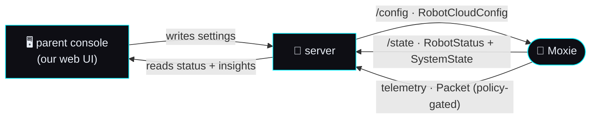

# ⚙️ Config & telemetry contract — what the server manages on the robot

> **Spec version 1 · robot side stamped to firmware v3.6.4-Zephyr / OTA v24.10.803.**
> The *implementation-facing* contract for the robot's **remotely-managed state**: the one config
> document the server pushes **down**, the status the robot reports **up**, and the telemetry +
> privacy-policy gate between them. This is the data model behind the **parent console** (bedtime,
> volume, alarms, OTA, privacy) and the robot-health view. Reads standalone; cites the study for
> provenance. Source: [`device-config-and-telemetry.md`](../reverse-engineering/protocol/device-config-and-telemetry.md),
> [`cloud-protocol.md`](../reverse-engineering/protocol/cloud-protocol.md),
> [`crypto-and-keys.md`](../reverse-engineering/phone/crypto-and-keys.md).

## The loop

Config/telemetry rides the same MQTT transport as the conversation ([Channel 2](mqtt-and-conversation.md)),
but it is a **separate concern** from the [AI seam](ai-seam.md): it's device management, not dialog.



Two MQTT topics carry it ([topic map](../reverse-engineering/protocol/cloud-protocol.md#exact-topic-map-google-iot-core-convention-kept-post-migration)):
**`/devices/{id}/config`** (down) and **`/devices/{id}/state`** (up); telemetry `Packet`s upload as events.

---

## ① `/config` down — `RobotCloudConfig` (the thing the server must produce)

One document is the robot's entire remotely-managed runtime state. Change any knob = re-publish it.

| Group | Fields |
|---|---|
| **Child / user** | `child` (`ChildEncrypted` ciphertext), `child_pii` (`ChildDecrypted` plaintext), `secret_key` (pairing seed), `num_children`, `max_children`, `switch_user_config` |
| **Quiet hours** | `privacy_mode_enabled`, `weekday_bedtime_enabled` + `…_starts_at`/`…_ends_at`, `weekend_bedtime_*` |
| **Wake / alarms** | `alarms` (`WakeSchedule{ WakeEntry{days[], time}…, enabled }`), `wake_button_enabled`, `audio_wake_set`, `touch_wake_enabled`, `schedule_preferences` (`ParentRequest{module_id, scheduled_at}`) — **all built**, see [§Wake alarms & scheduled activities](#wake-alarms-scheduled-activities-the-json-we-emit) |
| **Device** | `audio_volume`, `screen_brightness`, `timezone_id`, `settings` (`DeviceSettings` k/v) |
| **OTA** | `ota_update {id, version}`, `forbid_otaver` |
| **Mode / privacy** | `moxie_mode` (`DEFAULT_MODE`/`TELEHEALTH`), `data_sharing`, `grl_connected`, `rc_topic` |
| **Meta** | `last_updated_at`, `timestamp` |

### Wake alarms & scheduled activities — the JSON we emit

Two of the parent's most visible settings — *"wake Moxie at 7:15 on school days"* and *"do the
drawing activity after school"* — are the config's `alarms` and `schedule_preferences`. Both are
**built** (`mqtt/moxie_sdk/cloud_config.py`: `build_robot_cloud_config(alarms=…,
schedule_preferences=…)`, `normalize_wake_schedule`, `normalize_schedule_preferences`) and both are
parent-editable through the console's ⚙️ Settings form.

The shapes are ours, from the recovered protos —
[`Cloud.proto`](../reverse-engineering/protocol/recovered-proto/embodied/logging/Cloud.proto):113-127
(catalogued in [`proto-catalog.md`](../reverse-engineering/protocol/proto-catalog.md):286-296),
carried by `RobotCloudConfig.alarms = 24` and `RobotCloudConfig.schedule_preferences = 28`:

```proto
message WakeSchedule {
  message WakeEntry { repeated uint32 days = 1; optional string time = 2; }
  repeated WakeEntry wakes = 1;  optional bool enabled = 2;
}
message SchedulePreferences {
  message ParentRequest { optional string module_id = 1; optional uint64 scheduled_at = 2; }
  repeated ParentRequest parent_requests = 1;
}
```

so the JSON on `/devices/{id}/config` is:

```json
"alarms": { "wakes": [ { "days": [0, 2, 4], "time": "07:15" } ], "enabled": true },
"schedule_preferences": { "parent_requests": [ { "module_id": "DRAW", "scheduled_at": 1788422400 } ] }
```

> **Three honest assumptions.** The protos give the *types*, not the *encodings*, and no capture of a
> real alarms push survives in our corpus (OpenMoxie never implemented these fields either, so there is
> no field-proven shape to follow). We chose, and isolated each choice behind one constant so it is a
> one-line change if a capture ever contradicts it:
> - **`days`** is `repeated uint32`, so 0-6 — we emit **0 = Monday … 6 = Sunday** (`datetime.weekday()`,
>   the convention the rest of this repo dates by). The single source is `cloud_config.WAKE_DAY_NAMES`;
>   the console's day checkboxes are ordered to match it.
> - **`time`** is a `string` beside the config's other wall-clock strings
>   (`weekday_bedtime_starts_at`, …), so **`"HH:MM"` local time**, validated by the same regex. The robot
>   resolves it against `timezone_id` — `TimeZoneInfo` → `UserAlarmRequest`
>   ([power & system events](../reverse-engineering/protocol/power-and-system-events.md)).
> - **`scheduled_at`** is a `uint64` with no stated unit — we emit **epoch seconds**, the unit this repo
>   already renders timestamps in (`Packet.recorded_at`). A value that is plainly milliseconds is divided
>   down rather than accepted at face value.
>
> `module_id` is *not* assumed: it is validated against the one on-board activity catalog
> (`moxie_sdk/schedule.py::ONBOARD_MODULES`), so a parent can only ask for an activity the robot has.

### Fleet defaults ⊕ per-robot overrides

One appliance can drive several robots, so the config the server pushes is layered
**`builder defaults ⊕ fleet ⊕ per-robot`** (`cloud_config.merge_config_layers`, a pure function):
nested objects merge key-by-key (`settings.props`, `alarms.enabled`), scalars and lists replace, and an
explicit `null` from the robot layer clears an inherited value. The fleet layer is one durable record,
`$MOXIE_DATA_DIR/fleet/config.json` (`store.py::read_shared`/`write_shared`), written by
`POST /config?scope=fleet` on the supervisor (the console's `POST /local/fleet/config`, the ⚙️ form's
*"Apply to all robots"*) and re-pushed to every connected robot at once. With no fleet record the push
is byte-for-byte what it was before the layer existed. *Credit:* the idea is OpenMoxie's
`HiveConfiguration` + `robot_data.py::build_config` deep-merge (MIT) — see `ATTRIBUTION.md`.

### The child-PII encryption boundary — and the revival shortcut
The child appears twice: **`child`** = `ChildEncrypted` (every field a `*_encrypted` blob +
`checksum`), **`child_pii`** = `ChildDecrypted` (plaintext `first_name`, `birthday`, `therapy_needs[]`,
…). The encrypted fields are unsealed with the pairing **`secret_key`** seed
([crypto](../reverse-engineering/phone/crypto-and-keys.md)) — the encryption exists to blind Embodied's
cloud, not the robot's own paired backend.

> **A self-hosted server IS the key-holder** (it ran pairing), so it can populate **`child_pii`
> directly and leave `child` empty**. You do not need to reproduce the E2E sealing to drive your own
> robot — that's a Channel-1 concern for blinding a third-party cloud.

---

## ② `/state` up — `RobotStatus` (the robot's self-report)

Published on `/devices/{id}/state`:

| | |
|---|---|
| `embodied_robot_id`, `mac` | `robot_firmware_version`, `android_version` |
| `battery_level`, `audio_volume`, `screen_brightness` | `wifi_ssid`, `mode` |
| `last_back_up_at`, `ota_reboot_required` | `public_key`, `user_id_encrypted` |
| `settings` (`DeviceSettings`) | `last_updated_at`, `timestamp` |

Live health rides separately as **`SystemState{CPULoad, RAMFree, DiskFree, Uptime, Temperature,
Battery, WifiRssi}`** ([health telemetry](../reverse-engineering/protocol/cloud-protocol.md#health-telemetry-backup-robot-cloud)).
Together these feed the console's "is my robot online / charged / up to date" view.

### `CloudStatus.UserState` — the pairing/OTA lifecycle the console shows
`CloudStatus{connected, user_state, endpoint}`; `user_state` ∈ `UNKNOWN`(0), `NONE`(1, unpaired),
`PAIRED_PENDING`(2), `PAIRED_VALID`(3, operating), `UNPAIR_REQUESTED`(4), `OTA_LOCK`(5),
`UNPAIR_WITH_RFS`(6, unpair+wipe), `USER_DATA_UPDATE`(7). This is the authoritative state a console
renders for "pairing status" and gates actions on.

---

## ③ Telemetry — `Packet` envelope + the privacy gate

Analytics/events upload inside a generic envelope:

```proto
message Packet {
  enum Model { UNKNOWN=0; SessionLog=1; Device=2; Event=3; Raw=4; }
  Model model = 1; uint32 version = 2; uint64 recorded_at = 3;
  string moxie_id = 4; string moxie_session_id = 5; string user_id = 6;
  string event_name = 7; bytes event_data = 8;   // typed payload
}
```

Scoped wrappers: **`LogDevice{deviceUUID, eventArgsTypename, eventArgs}`** and **`LogUser`** (adds
`userUUID`) — a self-describing typed-event pattern; **`LogcatTrace{…}`** carries raw Android logcat for
remote debugging. A minimal server may **ignore all telemetry**; a full one persists `Packet`s
per robot/session for the insights dashboard.

### `LoggingPolicy` — the privacy contract a server MUST honor
What may leave the device is gated by consent, **not** optional:
**`NO_DATA`(0)** · **`NO_MEDIA`(1)** (everything but audio/video) · **`FULL`(2)**. Tied to the account's
`RobotCloudConfig.data_sharing`. The recording session runs `LoggingState` `START→STARTED→STOP→STOPPED`
via `LoggingStateChangeRequest{state, path}`, reporting back the effective `upload_policy`.

> **This is the child-privacy contract, not a cosmetic flag.** A server (or custom firmware) MUST honor
> `NO_DATA`/`NO_MEDIA`. Staged files land under `/sdcard/EmbodiedData` and upload only per policy.

---

## What the parent console reads/writes (feature → field map)

| Console feature | Mechanism |
|---|---|
| Bedtime / quiet hours | `RobotCloudConfig` weekday/weekend bedtime windows + `privacy_mode_enabled` |
| Volume / brightness | `audio_volume`, `screen_brightness` (down); echoed in `RobotStatus` (up) |
| Wake alarms & wake toggles | `alarms` (`WakeSchedule`) + `wake_button_enabled`/`touch_wake_enabled`/`audio_wake_set` — weekday checkboxes + a time in the ⚙️ form |
| Timezone | `timezone_id` |
| Scheduled activities | `schedule_preferences` (`ParentRequest{module_id, scheduled_at}`) — module picker fed by the on-board catalog |
| House rules for every robot | the **fleet** layer: `POST /config?scope=fleet` → `fleet/config.json`, merged under each robot's own overrides |
| OTA target / hold | `ota_update{id,version}`, `forbid_otaver`; status via `ota_reboot_required` + `OTA_LOCK` |
| Privacy / data sharing | `data_sharing` → `LoggingPolicy` gate |
| Pairing status | `CloudStatus.UserState` |
| Robot health | `RobotStatus` + `SystemState` |
| Insights / activity history | persisted `Packet` telemetry |

The console UI is the [REST/Channel-1 server](rest-api-contract.md)'s web surface; the settings it
writes become a `RobotCloudConfig` push, and the status it shows comes from `/state` + telemetry.

## Minimum viable vs full

- **Minimum:** publish a valid `RobotCloudConfig` on connect (with `child_pii`, `timezone_id`, volume,
  and `data_sharing=NO_DATA`), consume `/state` to know the robot is alive, and honor the logging
  policy (upload nothing). This is enough to operate a robot.
- **Full:** the whole console feature map above + persisted telemetry for an insights dashboard.

## Conformance checklist

- [ ] Publishes a well-formed `RobotCloudConfig` on `/devices/{id}/config` (populates `child_pii` directly as the key-holder).
- [ ] Re-publishes the config to change any managed setting (bedtime, volume, alarms, OTA, timezone).
- [ ] Emits `alarms` / `schedule_preferences` in the shapes above when a parent sets them (and omits them when unset).
- [ ] Consumes `RobotStatus` + `SystemState` from `/devices/{id}/state`.
- [ ] Tracks `CloudStatus.UserState` for pairing/OTA lifecycle.
- [ ] Honors `LoggingPolicy` (`NO_DATA`/`NO_MEDIA`/`FULL`) before uploading or staging any telemetry.

Where it lives: [`../../mqtt/`](../../mqtt/) (publishes config, consumes state/telemetry) +
[`../../server/`](../../server/) (the console that reads/writes it).

---
📖 [Docs index](../README.md) · [REST contract (Channel 1)](rest-api-contract.md) · [MQTT & conversation (Channel 2)](mqtt-and-conversation.md) · [AI seam](ai-seam.md)
