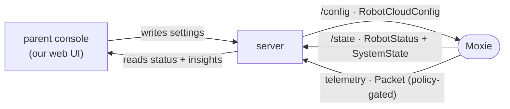

# Config and telemetry contract — what the server manages on the robot

> **Spec version 1 · robot side stamped to firmware v3.6.4-Zephyr / OTA v24.10.803.**
> The robot's remotely managed state: the one config document the server pushes **down**, the status
> the robot reports **up**, and the telemetry and privacy gate between them. This is the data model
> behind the parent console (bedtime, volume, alarms, OTA, privacy) and robot health. Sources: [`device-config-and-telemetry.md`](../reverse-engineering/protocol/device-config-and-telemetry.md),
> [`cloud-protocol.md`](../reverse-engineering/protocol/cloud-protocol.md),
> [`crypto-and-keys.md`](../reverse-engineering/phone/crypto-and-keys.md).

## The loop

Config/telemetry rides the same MQTT transport as the conversation ([Channel 2](mqtt-and-conversation.md)),
but it is a **separate concern** from the [AI seam](ai-seam.md): it's device management, not dialog.


```mermaid
flowchart LR
  console["parent console<br/>(our web UI)"] -->|"writes settings"| server["server"]
  server -->|"/config · RobotCloudConfig"| robot(["Moxie"])
  robot -->|"/state · RobotStatus + SystemState"| server
  robot -->|"telemetry · Packet (policy-gated)"| server
  server -->|"reads status + insights"| console
```

Two MQTT topics carry it ([topic map](../reverse-engineering/protocol/cloud-protocol.md#exact-topic-map-google-iot-core-convention-kept-post-migration)):
**`/devices/{id}/config`** (down) and **`/devices/{id}/state`** (up); telemetry `Packet`s upload as events.

---

## ① `/config` down — `RobotCloudConfig` (the thing the server must produce)

One document is the robot's entire remotely-managed runtime state. Change any knob = re-publish it.

| Group | Fields |
|---|---|
| **Child / user** | `child` (`ChildEncrypted` ciphertext), `child_pii` (`ChildDecrypted` plaintext — incl. **`face_options`**, the child's chosen appearance, see [§Appearance](#appearance-the-childs-chosen-face)), `secret_key` (pairing seed), `num_children`, `max_children`, `switch_user_config` |
| **Quiet hours** | `privacy_mode_enabled`, `weekday_bedtime_enabled` + `…_starts_at`/`…_ends_at`, `weekend_bedtime_*` |
| **Wake / alarms** | `alarms` (`WakeSchedule{ WakeEntry{days[], time}…, enabled }`), `wake_button_enabled`, `audio_wake_set`, `touch_wake_enabled`, `schedule_preferences` (`ParentRequest{module_id, scheduled_at}`) — see [§Wake alarms & scheduled activities](#wake-alarms-scheduled-activities-the-json-we-emit) |
| **Device** | `audio_volume`, `screen_brightness`, `timezone_id`, `settings` (`DeviceSettings` k/v) |
| **OTA** | `ota_update {id, version}`, `forbid_otaver` |
| **Mode / privacy** | `moxie_mode` (`DEFAULT_MODE`/`TELEHEALTH`), `data_sharing`, `grl_connected`, `rc_topic` |
| **Meta** | `last_updated_at`, `timestamp` |

### Wake alarms & scheduled activities — the JSON we emit

*"Wake Moxie at 7:15 on school days"* and *"do the drawing activity after school"* are the config's
`alarms` and `schedule_preferences` (`mqtt/moxie_sdk/cloud_config.py`: `build_robot_cloud_config(alarms=…,
schedule_preferences=…)`, `normalize_wake_schedule`, `normalize_schedule_preferences`), editable in the
console's Settings form. The shapes come from the recovered protos —
[`Cloud.proto`](../reverse-engineering/protocol/recovered-proto/embodied/logging/Cloud.proto):113-127
(catalogued in [`proto-catalog.md`](../reverse-engineering/protocol/proto-catalog.md):286-296),
carried by `RobotCloudConfig.alarms = 24` and `RobotCloudConfig.schedule_preferences = 28`:

```proto
message WakeSchedule {
  message WakeEntry { repeated uint32 days = 1; optional string time = 2; }
  repeated WakeEntry wakes = 1;  optional bool enabled = 2;
}
message SchedulePreferences {
  message ParentRequest { optional string module_id = 1; optional uint64 scheduled_at = 2; }
  repeated ParentRequest parent_requests = 1;
}
```

so the JSON on `/devices/{id}/config` is:

```json
"alarms": { "wakes": [ { "days": [0, 2, 4], "time": "07:15" } ], "enabled": true },
"schedule_preferences": { "parent_requests": [ { "module_id": "DRAW", "scheduled_at": 1788422400 } ] }
```

> **Assumptions.** The protos give types, not encodings, and no capture of a real alarms push exists
> (OpenMoxie does not implement these fields). Each choice sits behind one constant:
> - **`days`** is `repeated uint32`, so 0-6 — we emit **0 = Monday … 6 = Sunday** (`datetime.weekday()`,
>   the convention the rest of this repo dates by). The single source is `cloud_config.WAKE_DAY_NAMES`;
>   the console's day checkboxes are ordered to match it.
> - **`time`** is a `string` beside the config's other wall-clock strings
>   (`weekday_bedtime_starts_at`, …), so **`"HH:MM"` local time**, validated by the same regex. The robot
>   resolves it against `timezone_id` — `TimeZoneInfo` → `UserAlarmRequest`
>   ([power & system events](../reverse-engineering/protocol/power-and-system-events.md)).
> - **`scheduled_at`** is a `uint64` with no stated unit — we emit **epoch seconds**, the unit this repo
>   already renders timestamps in (`Packet.recorded_at`). A value that is plainly milliseconds is divided
>   down rather than accepted at face value.
>
> `module_id` is *not* assumed: it is validated against the one on-board activity catalog
> (`moxie_sdk/schedule/catalog.py::ONBOARD_MODULES`), so a parent can only ask for an activity the robot has.

### Appearance: the child's chosen face

Moxie's face is a composite of independent layers, and which layers it wears is part of the child
profile. Appearance rides down inside `child_pii`, in `ChildDecrypted.face_options` — `repeated string`,
field **17** ([`Cloud.proto`](../reverse-engineering/protocol/recovered-proto/embodied/logging/Cloud.proto):166;
the sealed twin `ChildEncrypted.face_options = 16` is Cloud.proto:144). It is clear metadata, not one of
the encrypted fields ([`device-config-and-telemetry.md`](../reverse-engineering/protocol/device-config-and-telemetry.md):52-54,
[`crypto-and-keys.md`](../reverse-engineering/phone/crypto-and-keys.md):358-362), so a server fills it
directly.

**The 14 layers** (`MoxieCustomizationType`,
[`unity-face-animation.md`](../reverse-engineering/runtime/unity-face-animation.md):34-42):

| Slot(s) | |
|---|---|
| `EyeColor` · `EyeDesign` · `EyeLid` | the eyes |
| `Brows` · `Mouth` · `Nose` · `Mustache` | brows and lower-face features |
| `FaceColor` · `FaceDesign` | base head colour and pattern |
| `Hair` · `Glasses` · `Stickers` · `Extras` · `Misc` | cosmetic add-ons |

**The options.** Two sources, each tagged per option with its `origin` in
[`mqtt/moxie_sdk/faces.py`](../../mqtt/moxie_sdk/faces.py) — 72 options across 11 of the 14 slots, no
invented ids:

- `recovered-enum` — 12 options with hex, the only previewable ones (from the parent app's
  `Robot.java` constants; see [`robot-lifecycle.md`](../features/robot-lifecycle.md)). On Channel 1
  they are `ChildrenModel.eye-color`/`face-color` → `PUT children/{id}`, gated by the account flags
  `supports-eye-color`/`supports-face-color`.
  - `EyeColor{green 42D02B, blue 8491EF, purple 9437DE, brown 443319, gold F4BF03, teal 38ADAE}`
  - `FaceColor{blue BBCFE1, yellow F0F055, green 9BDB9B, teal 7ED6DD, pink E1A2A2, purple C395D4}`
- `openmoxie-manifest` — 60 `MX_<nnn>_<Group>_<Detail>` ids transcribed (strings only) from OpenMoxie's
  `site/hive/content/data.py::MOXIE_CUSTOMIZATIONS` into
  [`mqtt/moxie_sdk/face_assets.json`](../../mqtt/moxie_sdk/face_assets.json), which carries the full
  citation. Each has `caution: true`, because upstream notes some of them crash Unity without saying which.

Our own corpus cannot supply the other ids: the art streams from `REMOTE_ASSETBUNDLES`, not the APK
([`content-delivery.md`](../reverse-engineering/runtime/content-delivery.md):79), and the generators
accept any id the bundle defines ([`behavior-markup.md`](../reverse-engineering/runtime/behavior-markup.md):161-163).
`Stickers`, `Extras` and `Misc` stay empty (`cited: false`); a parent who knows real labels supplies
them verbatim through `face.custom`, which is never rewritten.

**Wire spelling.** A `recovered-enum` option joins slot and member (`EyeColor_teal`); an
`openmoxie-manifest` option is already a whole label and travels verbatim (`MX_010_Eyes_Hazel`).
Credits: `ATTRIBUTION.md`.

So the JSON on `/devices/{id}/config` is:

```json
"child_pii": { "nickname": "Sam",
               "face_options": ["EyeColor_teal", "FaceColor_pink"],
               "id": "a6f3609a-0e20-512c-ae72-a16153adf140" }
```

**Layering.** The parent-facing override is `face`, an object, so `merge_config_layers` deep-merges it
per slot: a fleet look survives a per-robot edit of one slot, a robot-layer `null` on a slot clears that
layer, and `face: null` clears the whole selection (beating an inherited fleet look). With no face
chosen, neither `face_options` nor `id` is emitted.

> **Assumptions**, each behind one function in [`mqtt/moxie_sdk/faces.py`](../../mqtt/moxie_sdk/faces.py),
> neither observed on a physical robot:
>
> - **Label format.** Nothing records what `face_options` strings look like. `face_option_label()` joins
>   the cited slot name and member name as `"EyeColor_teal"`. `face.custom` bypasses it.
> - **Cache-buster.** The robot composites the face into a texture, and our corpus does not record the
>   cache key. OpenMoxie's face editor (a server that drives real robots) writes a fresh id into
>   `child_pii.id` on every save, so we take that mechanism as field-proven. Ours is deterministic:
>   `face_child_id()` is a UUIDv5 over the child key + rendered layers, so the same look re-pushes the same
>   id and any change yields a new one.

**Surface.** Supervisor: `POST /config?device_id=…` (or `?scope=fleet`) with `{"face": {…}}`, the same
whitelisted path every other setting uses; `GET /status` publishes `face_catalog` (the SDK's catalog, so
the console never keeps a second copy) and each robot's `face_cache_id`. Console: the Moxie's look
card in the Moxie tab, per-robot with the fleet look underneath. Owner guide:
[`../guides/moxies-look.md`](../guides/moxies-look.md).

### Fleet defaults ⊕ per-robot overrides

One appliance can drive several robots, so the config the server pushes is layered
**`builder defaults ⊕ fleet ⊕ per-robot`** (`cloud_config.merge_config_layers`, a pure function):
nested objects merge key-by-key (`settings.props`, `alarms.enabled`), scalars and lists replace, and an
explicit `null` from the robot layer clears an inherited value. The fleet layer is one durable record,
`$MOXIE_DATA_DIR/fleet/config.json` (`store.py::read_shared`/`write_shared`), written by
`POST /config?scope=fleet` on the supervisor (the console's `POST /local/fleet/config`, the Settings
form's *"Apply to all robots"*) and re-pushed to every connected robot at once. *Credit:* the idea is OpenMoxie's
`HiveConfiguration` + `robot_data.py::build_config` deep-merge (MIT) — see `ATTRIBUTION.md`.

The per-robot layer is durable too: `$MOXIE_DATA_DIR/robots/<id>/config.json`, rewritten by every
per-robot edit and read back once when the supervisor starts, so a restart re-pushes each robot's own
settings ([production hardening §8](backlog/production-hardening.md#8-phases-and-risks)). A robot
whose saved data-sharing choice cannot be read (a damaged record, or a stored `logging_policy` the
whitelist refuses) **fails closed**: it runs under `NO_DATA`, so nothing new is kept, until a parent
saves a setting for that robot again, and the console's activity feed says so in one line. That
`NO_DATA` is not a parent's choice, so it erases nothing already stored
([below](#how-this-server-persists-telemetry)). Its other settings come from what can still be read,
or from the layers underneath. A per-robot edit the store refuses still applies, but its answer says
`saved: false` and the console says the change will be lost on a restart.

### The pairing gate — permits, and what a *pending* robot is sent

Our broker accepts anonymous connections ([mqtt §3b](mqtt-and-conversation.md)), so the
config push needs its own answer to *"is this my child's robot?"*. It is a **permit list,
closed by default** — `$MOXIE_DATA_DIR/fleet/permits.json`, beside `fleet/config.json`:

```jsonc
{ "allow_unverified_bots": false,                       // the appliance-wide switch
  "devices": { "d_<uuid>": { "permitted_at": 1788353318, "label": "Sam's Moxie" } } }
```

* **Permitted** (or `allow_unverified_bots`) → the full `RobotCloudConfig` above:
  `pairing_status:"paired"` + `child_pii` + the parent's layers.
* **Not permitted** → the robot is *pending* and gets `build_unpaired_cloud_config()`:

```jsonc
{ "pairing_status": "unpairing",       // not "paired" ⇒ the robot does not run a session
  "data_sharing": "NO_DATA",           // LoggingPolicy shut: it may upload nothing to us
  "settings": { "props": { "gcp_upload_disable": "1", "default_loglevel": "warning" } } }
```

  **No `child_pii`, no `child`, no household settings, and no `stt` prop** (we never ask a
  device we do not know for its microphone). The document is written out in full in
  `cloud_config.py` rather than built by deleting keys from the paired one — a subtractive
  build is one forgotten key away from a leak. Everything else a pending robot asks for is
  refused or answered empty ([mqtt §3.7](mqtt-and-conversation.md)).

> **Assumption: the un-paired value is field-proven, not capture-proven.** No capture shows
> Embodied's cloud pushing a non-`paired` `pairing_status`. We push `"unpairing"` because OpenMoxie
> (which drives real robots) writes it and reads it back as "Unpaired/Blocked"
> (`site/hive/models.py::MoxieDevice.is_paired`). What a physical Moxie shows is not verified. It sits
> behind one constant, `UNPAIRED_PAIRING_STATUS`.

*Credit:* the idea is OpenMoxie's `MoxieDevice.permit` + `HiveConfiguration.allow_unverified_bots`
(MIT — see `ATTRIBUTION.md`); no code was copied, and note that upstream stores the flag but
never enforces it on the MQTT path, so the enforcement here is ours.

**Switches.** `MOXIE_ALLOW_UNVERIFIED_BOTS=1` (env) serves every robot; `0` pins the gate shut. Precedence: constructor argument →
env → the stored fleet flag → **closed**. The console shows the flag *as enforced*
alongside the stored one, so an appliance opened by the environment cannot look closed.

**The same record also renders the broker ACL.** `mqtt/moxie_sdk/broker_acl.py::render_acl`
turns this file into a mosquitto ACL — the `%c` device floor plus one `user d_<uuid>` block
per permitted device. It is generated but inert: robots do not authenticate, so no `user` block
can match yet ([`backlog/security-broker-auth.md`](backlog/security-broker-auth.md) §2.3). When
the broker can verify a device, `permits.json` stays the single source of which robots are ours.

**Surface.** Supervisor: `GET /permits`, `POST /permits {device_id, permitted, label}` or
`{allow_unverified_bots}`. Console: `GET /local/permits`, `POST /local/robots/{id}/permit`,
`POST /local/fleet/permits`; `GET /local/fleet` gains `allow_unverified_bots`, `pending[]`,
`pending_count`, and `permitted`/`pending`/`permit_label` per robot. Permitting a pending
robot re-pushes its full config immediately — no reconnect, no restart. Owner guide:
[`../guides/permitting-a-robot.md`](../guides/permitting-a-robot.md).

### The child-PII encryption boundary — and the revival shortcut
The child appears twice: **`child`** = `ChildEncrypted` (every field a `*_encrypted` blob +
`checksum`), **`child_pii`** = `ChildDecrypted` (plaintext `first_name`, `birthday`, `therapy_needs[]`,
…). The encrypted fields are unsealed with the pairing **`secret_key`** seed
([crypto](../reverse-engineering/phone/crypto-and-keys.md)) — the encryption exists to blind Embodied's
cloud, not the robot's own paired backend.

> **A self-hosted server IS the key-holder** (it ran pairing), so it can populate **`child_pii`
> directly and leave `child` empty**. You do not need to reproduce the E2E sealing to drive your own
> robot — that's a Channel-1 concern for blinding a third-party cloud.

### The child's name: the parent's record, per robot

This server does populate it. `child_pii.nickname` is the name Moxie says, and it comes from the
**parent's account**: the child record the web app's Wi-Fi tab names (`children.attributes`:
`nickname`, else `child-first-name`). The console sends it to the supervisor as `child: {nickname,
birthday?}` on that robot's own layer (`POST /config?device_id=…`;
[`server/moxie_server/child_profile.py`](../../server/moxie_server/child_profile.py)) when a robot is
added to the account, when the child is renamed, and when **Permit** lets in a robot an account's
record names. `MOXIE_CHILD_NICKNAME` (default `friend`) is only the **fallback** for a robot no account
names. The pairing placeholder `Moxie Kid` is never sent, so it is never said: when the account names
no child, or names one the rule below refuses, a robot joining it (the claim, Simulate robot scan,
Permit) gets `child: null` instead and says the fallback, never a name an earlier record left on it.
A house rule (`?scope=fleet`) cannot carry a child: that is a `400`.

**One name rule**, shared with the Try it card (`cloud_config.check_name`):

1. **Its shape.** The name is NFC-normalized first, so a decomposed `José` is the same name and is
   kept composed. Then it is up to 40 letters, digits, spaces, periods, apostrophes or hyphens on
   one line. A letter may carry combining marks (an accent, a Devanagari vowel sign), so names in
   scripts that write vowels as marks work; a mark anywhere else is refused.
2. **Moxie's safety rules.** The name goes through the same classifier and table the runtime uses
   for every turn ([`safety.py`](../../mqtt/moxie_sdk/safety.py) over
   [`safety_rules.json`](../../mqtt/moxie_sdk/safety_rules.json), or `MOXIE_SAFETY_RULES`), on the
   child's side, where every category either blocks or flags. A name the table blocks **or flags**
   is refused: a flag lets a word through once and tells a parent, but Moxie says a name at every
   hello. So every word the table lists is refused, a single profanity included. This check runs
   even when `MOXIE_SAFETY=0` turns off the per-turn check. A table that cannot be read refuses
   every name until it can (Moxie says the fallback meanwhile).

`<exit>`, `{{ x }}`, a line break, a blank name, 41 characters or a word the safety rules list are
a `400` that changes nothing. Its reason says why in plain words and never repeats the name.
`child: null` clears the name. The console asks the supervisor before it saves a typed name
(`POST /child-name`, which saves nothing), so a refused name is a `400` there too, and the Wi-Fi
tab shows the reason. When the supervisor cannot be asked, the record is saved, and the name is
judged when it is sent. A name already saved is checked again whenever it is read: one the rules
now refuse (an older build wrote it, the table changed) is dropped at load and never said.

A real name the table lists is refused too: the Swedish name Gun is on its violent-talk list. The
table is a file the owner can edit (`MOXIE_SAFETY_RULES`).

**The hello is checked when it is said, too.** The walk-back-in hello passes the same output check
as every other line Moxie says (the brain's answers, a rehearsal, telehealth). This is defence in
depth for a name that never met the rule above: the appliance's own `MOXIE_CHILD_NICKNAME`, which
is the owner's and is not checked, or a file an older build wrote. A hello the rules block becomes
the generic one ("Oh! Hi friend! …"). Only the parent hears why: the block goes in the safety
review queue, with the name masked, plus one activity-feed line. A hello the rules only flag is
said and recorded, as a flagged answer is.

**Where the name goes.** A child's first name is personal data, so this is the whole list:

| Place | What |
|---|---|
| The console's database | The account's child record (`moxie.db`). Kept on unpair ([robot lifecycle](../features/robot-lifecycle.md#built-here-unpair-and-factory-reset) §2) until the parent deletes the profile. |
| The supervisor's disk | `robots/<id>/config.json` (the robot's saved settings), and the day plan's stored "why" lines (`robots/<id>/schedule_explain.json`), which are dropped when the name changes or is cleared. |
| The robot | `child_pii.nickname` (and `birthday` when the record has one) in its `/config`, over your MQTT broker like every other setting. Pushed now if it is connected, else on its next connect. |
| The brain | Every brain prompt for that robot: the `llm` brain's system prompt ("You are talking to …"), the `content` brain's `volley.config.child_pii` (a module's prompt renders `nickname`), the `webhook` brain's request (its `child` object, with `birthday_iso` when the record has a birthday). **These requests go to the endpoint you configured (`MOXIE_LLM_BASE_URL`, `MOXIE_WEBHOOK_ENDPOINT`), which may be a cloud service.** |
| The voice | Any line Moxie says that contains the name (the hello, the opener, an answer) is sent to the speech endpoint you configured when this appliance synthesizes speech. |
| The supervisor's `/status` | The robot's `child` field, its config layers and its face cache id (`child_pii.id`, a UUIDv5 of the name and the look, so a list of first names recovers the name from it). The supervisor's own status server asks no one to sign in: compose publishes it (`MOXIE_PORT_STATUS`, `8931`) on `MOXIE_BIND_HOST`, which `.env.example` sets to `0.0.0.0`, so with that `.env` anyone on your network can read the name there. |
| The console's views of `/status` | `/local/fleet`, `/local/broker/status` and a robot's config answer name a robot's child (and keep its face cache id) only for a caller with a token for the account that has that robot, and mask the other child names in the activity feed. That keeps the name off what any device on your network can poll without asking; it is not a lock, because this console gives a token to anyone who types the account's email (`POST /local/quicklogin`, no password). |
| The safety review queue | A short excerpt of a line the safety rules flagged or blocked, its trigger words masked, kept for the parent unless data sharing is `NO_DATA`. A line the child said can carry the name there. A blocked or flagged hello is kept with the name masked. |

**Not in the supervisor's log or the activity feed.** Their lines that change the name give only the
key (`config updated: child`), never a value. Every activity-feed line is masked, whoever writes
it, and so are the supervisor's log lines that carry something said or heard: the hello, an
exchange (both what the child said and what Moxie answered), a queued hello, a content pack's
answer, a rehearsal and a stale answer (in the feed also what the ears heard, a voice test and a
telehealth line). `[child]` stands where the name was. The masked names are every name Moxie calls
a child on this appliance: each robot's record, connected or away, `MOXIE_CHILD_NICKNAME` (the
generic `friend` is a word, not a name, and stays), and any name renamed or cleared away since the
supervisor started, because a conversation's history can bring one back (that list is kept in RAM
only, so a restart forgets it). Each is matched in any case, with or without its accents, whole or
by part (`Mary-Kate` is also `Mary` and `Kate`). The name is masked before a feed line is cut
short, so a cut never leaves its first letters behind. The robot still hears the real name: only
these copies are masked. A name the supervisor has not been told yet (the child says it before the
parent saves it) cannot be masked then: saving the name masks the feed's lines again, but the
supervisor's log has already printed that line. The console's brain, Try it and Today's
plan cards show the robot's child to anyone who can open the console on your network, as every
console card shows the child's data today.

**The remaining exposure, plainly.** The supervisor's status port has no sign-in, and
`.env.example`'s `MOXIE_BIND_HOST=0.0.0.0` publishes it on your network. The console's sign-in is
an email address alone. So anyone on your network can read the child's name, from `/status` or
from the console. Whether to require a real sign-in, or to keep that port on the appliance, is
owner question OQ3. This slice does not change the bind.

**Unpair and factory reset** clear the robot's copy (`child: null`) before the record is deleted and
before the permit is revoked; the robot then falls back to `MOXIE_CHILD_NICKNAME`, and its saved
settings keep no `child` key. **The revoke takes the name off as well**: a robot this appliance no
longer lets in keeps no child's name (`POST /permits` with `permitted: false` drops `child` from
`robots/<id>/config.json`, and its answer says `child_cleared`). So when only the clear is lost,
the unpair's own revoke takes the name off. When neither reaches the supervisor, the answer says
so (`child_cleared: false`) and how to try again: **Revoke** in Robot access, which takes the name
off then. A change the supervisor applies but cannot save (its answer says `saved: false`) is not
reported as done either: a clear or a revoke is then not `child_cleared`, because the name is still
in the robot's saved settings and a restart brings it back, and a name sent on a claim or a rename
is not `child_pushed`, with the reason. A write for a
robot that is away is kept: a robot on the permit list or in the roster has it saved (`online: false,
pushed: false`: no connected robot heard it) and the settle pushes it when the robot connects
(OpenMoxie keeps an offline robot's edit the same way: `site/hive/mqtt/moxie_server.py:284-290`).

> **Unverified on a physical Moxie.** Whether a real robot re-reads `child_pii.nickname` from a config
> push without reconnecting, and where it says it, has not been observed by this project. OpenMoxie
> (MIT), which drives real robots, sets the same field per device from its dashboard and re-pushes the
> config (`site/hive/views.py:186-193`).

### The house's clock: `timezone_id`

Every push names the house's time zone, `timezone_id` (an IANA name): this robot's own zone, else
the house rule, else `MOXIE_TIMEZONE` (the bottom layer, for an install nobody opens the console
on), else `America/Los_Angeles` (`cloud_config.DEFAULT_TIMEZONE_ID`). A parent sets it in ⚙️
Settings → **Time zone**, for one robot or, with *Apply to all robots*, as a house rule. While no
zone is set and the parent's phone is in another one, the robot card names both and offers the
phone's zone in one click, saved as a house rule (`js/settings.js`).

The whitelist (`sanitize_config_overrides` → `check_timezone`) accepts only a name this server's tz
database knows, and forgives case (`america/new_york` is stored as `America/New_York`). A typo such
as `Mars/Olympus` is a 400 with the reason, and is never stored or pushed. An empty value is no edit.
A host with no tz database at all (neither the system's nor the `tzdata` package, which
`mqtt/requirements.txt` pins for the slim image) can only check a name's shape. A robot's saved
record holding a name the whitelist now refuses loses that key when the supervisor starts (one line).

The appliance keeps time in the same zone, never on its container's clock (no compose file sets
`TZ`, so a container runs on UTC):

| What | Where |
|---|---|
| The hello's bedtime silence, and the Be Moxie bedtime warning | `presence.py::_in_bedtime`, on `house_now` |
| The day plan: its date, its slots and their part of the day, bedtime per slot, which parent requests are due today | `schedule.py::plan_schedule_for` passes `now=house_now(...)` |
| "What time is it", and any content program's `clock.local` | `ext_host.py::_clock_local(now, zone)`, in the zone the robot's last push named (`robot.extra["timezone_id"]`); the Try it card uses the same zone |
| Insights: the day each activity is filed under, and the history's today | `telemetry.py::packet_day(..., tz=...)` and `telemetry_view` |
| The robot card's `mic asked HH:MM ZONE` | `server/moxie_server/fleet/robots.py::_asked_at`, from `config_effective.timezone_id` (labelled UTC while no zone is chosen) |

A stored zone this server cannot read (an old typo, or no tz database) runs on UTC, labelled:
`house_zone` never raises, and the activity feed says so once per robot and name. Not in the
house's zone yet: the `date` stamped on what Moxie remembers (`content/memory.py::provenance`) is
still the container's date; its exact instant, `at`, is right.

> **Recovered, not observed.** That a physical Moxie resolves its own wake alarms and bedtime
> against `timezone_id` comes from the recovered protos (`TimeZoneInfo` → `UserAlarmRequest`,
> [above](#wake-alarms-scheduled-activities-the-json-we-emit)); no robot has been watched doing
> it. This section covers what the appliance computes and pushes.

---

## ② `/state` up — `RobotStatus` (the robot's self-report)

Published on `/devices/{id}/state`:

| | |
|---|---|
| `embodied_robot_id`, `mac` | `robot_firmware_version`, `android_version` |
| `battery_level`, `audio_volume`, `screen_brightness` | `wifi_ssid`, `mode` |
| `last_back_up_at`, `ota_reboot_required` | `public_key`, `user_id_encrypted` |
| `settings` (`DeviceSettings`) | `last_updated_at`, `timestamp` |

Live health rides separately as **`SystemState{CPULoad, RAMFree, DiskFree, Uptime, Temperature,
Battery, WifiRssi}`** ([health telemetry](../reverse-engineering/protocol/cloud-protocol.md#health-telemetry-backup-robot-cloud)).
Together these feed the console's "is my robot online / charged / up to date" view.

### `CloudStatus.UserState` — the pairing/OTA lifecycle the console shows
`CloudStatus{connected, user_state, endpoint}`; `user_state` ∈ `UNKNOWN`(0), `NONE`(1, unpaired),
`PAIRED_PENDING`(2), `PAIRED_VALID`(3, operating), `UNPAIR_REQUESTED`(4), `OTA_LOCK`(5),
`UNPAIR_WITH_RFS`(6, unpair+wipe), `USER_DATA_UPDATE`(7). This is the authoritative state a console
renders for "pairing status" and gates actions on.

---

## ③ Telemetry — `Packet` envelope + the privacy gate

Analytics/events upload inside a generic envelope:

```proto
message Packet {
  enum Model { UNKNOWN=0; SessionLog=1; Device=2; Event=3; Raw=4; }
  Model model = 1; uint32 version = 2; uint64 recorded_at = 3;
  string moxie_id = 4; string moxie_session_id = 5; string user_id = 6;
  string event_name = 7; bytes event_data = 8;   // typed payload
}
```

Scoped wrappers: **`LogDevice{deviceUUID, eventArgsTypename, eventArgs}`** and **`LogUser`** (adds
`userUUID`) — a self-describing typed-event pattern; **`LogcatTrace{…}`** carries raw Android logcat for
remote debugging. A minimal server may **ignore all telemetry**; a full one persists `Packet`s
per robot/session for the insights dashboard.

### `LoggingPolicy` — the privacy contract a server MUST honor
What may leave the device is gated by consent, **not** optional:
**`NO_DATA`(0)** · **`NO_MEDIA`(1)** (everything but audio/video) · **`FULL`(2)**. Tied to the account's
`RobotCloudConfig.data_sharing`. The recording session runs `LoggingState` `START→STARTED→STOP→STOPPED`
via `LoggingStateChangeRequest{state, path}`, reporting back the effective `upload_policy`.

> **This is the child-privacy contract, not a cosmetic flag.** A server (or custom firmware) MUST honor
> `NO_DATA`/`NO_MEDIA`. Staged files land under `/sdcard/EmbodiedData` and upload only per policy.

### How this server persists telemetry

A `Packet` that reaches us has already passed the gate on the robot. The server then decides whether
it goes to disk, and with or without its payload.

**Two records per robot, not one**, because a parent asks two different questions and only one of
them needs the packets ([`moxie_sdk/telemetry.py`](../../mqtt/moxie_sdk/telemetry.py) owns both
shapes, both caps and the filter; the runtime is the only thing that touches disk):

| record | what it is | answers |
|---|---|---|
| `robots/<id>/telemetry_packets.json` | a ring of the newest `Packet` envelopes | *"what just happened"* — the event list + the by-event roll-up |
| `robots/<id>/telemetry_daily.json` | one row per **local calendar day**: a count, counts by `event_name`, and the day's first/last stamp | *"what has been happening"* — a week, a month |

**The daily roll-up is a view over the ring, not a second counter.** Every stored envelope carries a
monotonic **`seq`** (stamped by the server after the privacy gate; `storable_packet` keeps only wire
fields, so a robot cannot forge one), and the roll-up carries **`through_seq`**, the highest `seq` it has
folded. `reconcile_rollup` replays whatever the roll-up is missing, and the roll-up is written **before**
the ring, so no reader can observe an under-count and a crash between the two writes costs at most one
envelope from the ring, never the lifetime count. `seq` and `through_seq` are server bookkeeping, not
wire fields.

**A third file is under the same switch, and it is not a telemetry record.**
`robots/<id>/mentor_behaviors.json` is the durable per-child behavioural log — which activity
was finished, which was quit, which was refused, with a timestamp on each — written by
`MoxieRuntime.ingest_mentor_behavior` and read by the schedule recommender. It is gated on
`telemetry_policy` rather than `memory_policy` because a `MentorBehavior` is a *report the robot
uploads* on `client-service-activity-log` — the same kind of thing as a `Packet`, and the thing
`LoggingPolicy` is about — rather than a fact a content module chose to remember (that is
`MemoryStore`, and see the [content-module contract](content-module-contract.md)). Both resolve
the parent's one `logging_policy` field either way; only their defaults are separate. Together
the three files are this appliance's **activity record**, and one switch and one erase cover all
three.

**The policy filter** (`storable_packet`) **fails closed**:

| `LoggingPolicy` | what is written |
|---|---|
| **`NO_DATA`** (0) | **nothing.** No packet, no count, no day row, no behaviour record. A restart finds an empty store — and *moving the switch to `NO_DATA` erases what is already there* (below). |
| **`NO_MEDIA`** (1) | the envelope, with `event_data` **removed** and `event_data_withheld:"NO_MEDIA"` in its place |
| **`FULL`** (2) | the whole envelope, `event_data` truncated at 2 KB so one packet cannot blow the ring |

> **Why `NO_MEDIA` withholds *every* payload, not just the media ones.** `Packet.event_data` is
> declared `bytes` and our corpus recovers **no** typed-payload vocabulary — the same gap
> [`moxie_sdk/schedule.py`](../../mqtt/moxie_sdk/schedule/)`::telemetry_signals` records for
> `event_name`. Nothing available to us proves a given blob is not audio or video, and a store that
> guessed would be a **privacy incident, not a bug**. So the rule is the payload, never the event's
> name. **Assumption:** we have never seen a real robot's `event_data`, so we do not know
> what proportion of it is media; withholding all of it is the conservative reading of the contract.

**The default is `NO_MEDIA`**, not `NO_DATA`, and that is deliberate: `RobotCloudConfig`'s own
default for `data_sharing` **is** `NO_DATA`, which is about what the *robot uploads to us* — inheriting
it here would mean the feature never stored anything at all. This matches the safety journal and long-term memory
(`SAFETY_JOURNAL_POLICY`, `MEMORY_POLICY` in `mqtt/supervisor/moxie_runtime/`). A parent who explicitly sets `logging_policy` — per robot **or** fleet-wide — wins,
in both directions.

**Bounded, because this is an appliance and not a warehouse.** The store rewrites the whole file on
every append, so each cap is also a write cost:

| cap | default | why | override |
|---|--:|---|---|
| raw envelopes per robot | **500** | ~60 KB of JSON; a rewrite stays well under a millisecond, and the daily roll-up is what answers "last week", so the ring can stay small | `MOXIE_TELEMETRY_MAX_PACKETS` |
| daily rows per robot | **35** | a month **plus a week**, so "last week" is still whole when a parent looks on the 1st; ~200 bytes a row | `MOXIE_TELEMETRY_MAX_DAYS` |
| distinct `event_name`s in one day | **24** | `event_name` is a free string, so a robot (or a bug) can mint unbounded names; the overflow is counted under `(other)` rather than dropped | — |

`total` in the roll-up is a **lifetime** count and does not slide with the window — it is the one
number that stays true after a day ages out, and the console labels it *"all time"* next to the
retained count so the two are never confused. A day whose `recorded_at` is missing, unparseable,
before 2020 or more than a day in the future is filed under **arrival** time: device clocks lie and
the field is optional.

**Reads survive a restart.** The in-memory buffer is a cache of the ring, hydrated from disk on first
touch — so `telemetry_count` in the console snapshot, the insights
view and the schedule planner's signals all see history rather than only this process, with no second
place to forget to load it. A robot **known to the store but not currently connected** still answers:
a parent asking about last week should not need the robot to be on the broker.

**Erasing it.** Two paths, neither policy-gated (an erase works under `NO_DATA`, `NO_MEDIA` and `FULL`):

| the parent does | what happens |
|---|---|
| presses **Erase history** on the Insights card (`DELETE /telemetry?device_id=…` → `MoxieRuntime.erase_telemetry`) | all three files go, and the in-RAM cache goes with them so the console cannot serve a stale hydrate of what was just erased |
| moves **data sharing to `NO_DATA`** (per robot or fleet-wide) | the same erase runs for every robot the switch now covers — `purge_telemetry`, at boot and on any config edit that could have moved it |

A robot whose saved data-sharing choice cannot be read runs under `NO_DATA` until a parent saves
again ([above](#fleet-defaults-per-robot-overrides)), so nothing new is stored, but its activity
record is **not** erased: that `NO_DATA` is a settings file that could not be read, not a parent's
choice, so `purge_telemetry` (at boot and after any config edit) passes the robot over, and the
Insights card says the history stored before is kept. The parent's next save puts a parent's choice
back in force and runs the sweep, so a parent's `NO_DATA` erases it then
([production hardening §8](backlog/production-hardening.md#8-phases-and-risks)).

> **Why a switch to `NO_DATA` erases this retroactively, when memory items do not.** The
> [content-module contract](content-module-contract.md) keeps a robot's stored `MemoryStore` items
> across a flip to `NO_DATA` on purpose: a memory item is a sentence about the child that a parent
> may want to read, correct or pin, and there is a UI for exactly that. The activity record has
> neither property. It is machine events in a bounded ring, the table above promises an empty store
> under `NO_DATA`, and the Insights card already tells a parent under `NO_DATA` that nothing is
> being saved — so a surviving ring would make both the table and the card lie. The rolling
> transcript is erased on the same reasoning. A parent who wants the history gone **without**
> changing the policy presses the explicit erase, which is why the flip is not the only way.
>
> The erase is deliberately **not carved finer** than "this robot's activity record". A `Packet`
> envelope has no per-item meaning to a parent the way one remembered sentence does, and a partial
> erase of a bounded ring is a promise nobody could check.

---

## What the parent console reads/writes (feature → field map)

| Console feature | Mechanism |
|---|---|
| Bedtime / quiet hours | `RobotCloudConfig` weekday/weekend bedtime windows + `privacy_mode_enabled` |
| Volume / brightness | `audio_volume`, `screen_brightness` (down); echoed in `RobotStatus` (up) |
| Wake alarms & wake toggles | `alarms` (`WakeSchedule`) + `wake_button_enabled`/`touch_wake_enabled`/`audio_wake_set` — weekday checkboxes + a time in the Settings form |
| Time zone | `timezone_id` — ⚙️ Settings → **Time zone** (per robot, or a house rule) and the one-click offer of the phone's zone; `MOXIE_TIMEZONE` underneath. The appliance keeps bedtime, the day plan, "what time is it" and the Insights days in it; see [§The house's clock](#the-houses-clock-timezone_id) |
| Scheduled activities | `schedule_preferences` (`ParentRequest{module_id, scheduled_at}`) — module picker fed by the on-board catalog |
| Moxie's look (the child's face) | `child_pii.face_options` (14 layers, 72 cited options across 11) + the `child_pii.id` cache-buster — the Moxie's look card; see [§Appearance](#appearance-the-childs-chosen-face) |
| The name Moxie says | `child_pii.nickname` from the account's child record (the Wi-Fi tab's name field renames it); `MOXIE_CHILD_NICKNAME` is the fallback; the live box's "Moxie calls your child" row — see [§The child's name](#the-childs-name-the-parents-record-per-robot) |
| House rules for every robot | the **fleet** layer: `POST /config?scope=fleet` → `fleet/config.json`, merged under each robot's own overrides |
| OTA target / hold | `ota_update{id,version}`, `forbid_otaver`; status via `ota_reboot_required` + `OTA_LOCK` |
| Privacy / data sharing | `data_sharing` → `LoggingPolicy` gate |
| Pairing status | `CloudStatus.UserState` |
| Which robots may be served | the **permit list** — `fleet/permits.json` + `allow_unverified_bots`; the Robot access card lists pending robots and permits them in one click |
| Robot health | `RobotStatus` + `SystemState` |
| Insights / activity history | persisted `Packet` telemetry — a bounded ring + daily roll-ups, [above](#how-this-server-persists-telemetry) |
| Erase that history | **Erase history** on the Insights card → `DELETE /telemetry?device_id=…` — the ring, the day rows and the behaviour log, never policy-gated |
| Wake a sleeping Moxie | `{"command":"wakeup"}` on `/devices/{id}/commands/wakeup` ([MQTT §3.5](mqtt-and-conversation.md)) — publishes for real; **no acknowledgement exists**, so the console reports *sent*, never *awake* |
| Reboot the robot | ❌ **not supported.** No cloud→robot reboot command is recovered ([power & system events](../reverse-engineering/protocol/power-and-system-events.md): `STATE_SILENT_REBOOT` is an on-device power state, `ShutdownRequest`/`SystemShutdown` are events the robot *emits*). The console shows the button as unavailable and the endpoint answers **501** rather than inventing a payload |
| Firmware / OTA status | `robot_firmware_version` + `ota_reboot_required` from `/state`. This appliance serves no `api/ota`, so it **never claims "up to date"** — it reports what the robot said and says no update server is configured |

The console UI is the [REST/Channel-1 server](rest-api-contract.md)'s web surface; the settings it
writes become a `RobotCloudConfig` push, and the status it shows comes from `/state` + telemetry.

## Minimum viable vs full

- **Minimum:** publish a valid `RobotCloudConfig` on connect (with `child_pii`, `timezone_id`, volume,
  and `data_sharing=NO_DATA`), consume `/state` to know the robot is alive, and honor the logging
  policy (upload nothing). This is enough to operate a robot.
- **Full:** the whole console feature map above + persisted telemetry for an insights dashboard.

## Conformance checklist

- [ ] Publishes a well-formed `RobotCloudConfig` on `/devices/{id}/config` (populates `child_pii` directly as the key-holder).
- [ ] Re-publishes the config to change any managed setting (bedtime, volume, alarms, OTA, timezone).
- [ ] Emits `alarms` / `schedule_preferences` in the shapes above when a parent sets them (and omits them when unset).
- [ ] Consumes `RobotStatus` + `SystemState` from `/devices/{id}/state`.
- [ ] Tracks `CloudStatus.UserState` for pairing/OTA lifecycle.
- [ ] **Serves the child's config only to a permitted device** — an unknown robot gets the
      un-paired document with no `child_pii`, and nothing else.
- [ ] Carries the child's chosen appearance in `child_pii.face_options`, and **changes
      `child_pii.id` whenever those layers change** so the robot cannot serve a stale face texture.
- [ ] Honors `LoggingPolicy` (`NO_DATA`/`NO_MEDIA`/`FULL`) before uploading or staging any telemetry.
- [ ] **Honors it on the way to disk as well** — `NO_DATA` persists nothing at all, `NO_MEDIA`
      persists no `event_data` payload, and a policy it cannot read fails closed rather than open.
      "Nothing at all" covers the whole **activity record**, the behaviour log included, not only
      the two files named `telemetry_*`.
- [ ] **Gives the parent a way to take it back.** A gate on new writes is half a promise: there is
      an erase for the stored activity record (`DELETE /telemetry`), it is never policy-gated, and
      moving the switch to `NO_DATA` runs it for every robot the switch now covers rather than
      leaving yesterday's packets where they are.
- [ ] Keeps telemetry **durably and boundedly** if it keeps it at all: a history that dies with the
      process cannot answer "last week", and one that grows without limit is a bug on an appliance.
- [ ] **Never reports success for a command it did not send.** Publish and say so, or refuse and say
      why; a recovered command with no acknowledgement is reported as *sent*, not as *done*.

Where it lives: [`../../mqtt/`](../../mqtt/) (publishes config, consumes state/telemetry) +
[`../../server/`](../../server/) (the console that reads/writes it).

---
[Docs index](../README.md) · [REST contract (Channel 1)](rest-api-contract.md) · [MQTT & conversation (Channel 2)](mqtt-and-conversation.md) · [AI seam](ai-seam.md)
