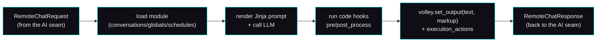

# 🧩 Content-module contract — activities, the volley API, execution actions

> **Spec version 1 · robot side stamped to firmware v3.6.4-Zephyr / OTA v24.10.803.**
> The *implementation-facing* contract for the **content layer** — how a server defines the activities
> Moxie runs and drives each turn. This sits **on top of** the [AI seam](ai-seam.md): the AI seam is
> the per-turn RemoteChat RPC; a content module is the *server-side logic* that answers it. Reads
> standalone; cites the study for provenance. Source:
> [`content-and-conversation.md`](../reverse-engineering/runtime/content-and-conversation.md),
> [`content-delivery.md`](../reverse-engineering/runtime/content-delivery.md).

## Where this fits

The [AI seam](ai-seam.md) says: per turn, a `RemoteChatRequest` comes in and a `RemoteChatResponse`
goes out. **A content module is how the server decides that response.** The brain loads a module,
renders its prompt, calls an LLM, runs the module's `code` hooks, and returns text + markup + actions.
Activities are therefore **pure server-side modules** — no firmware change needed to add one.



## The module format (what a server serves)

A module is JSON with three optional sections:

### `conversations[]` — LLM-driven chats
```json
{ "name":"Basic Memory Chat", "module_id":"OPENMOXIE_CHAT", "content_id":"memory",
  "max_history":40, "max_volleys":40,
  "opener":"Let's have a chat.|Anything on your mind?<opener>",
  "prompt":"You are Moxie talking to {{volley.config.child_pii.nickname}}. FACTS:\n{{volley.persist_data.memory_chat.facts}}",
  "model":"gpt-4o", "max_tokens":100, "temperature":0.5,
  "code":"def post_process(volley, session): ..." }
```
- **`prompt`** is **Jinja2-templated** over `volley`/`session` (`{{…}}`, `` — see
  [how a prompt is rendered](#how-a-prompt-is-rendered)). Common vars:
  `volley.config.child_pii.nickname`, `volley.persist_data.*`, `session.overflow`.
- **`opener`** supports `|`-alternatives and inline tags (`<opener>`, `<exit>`, `<sleep>`, `<launch:XX>`).
- **`code`** defines Python hooks run around each turn: `pre_process`, `post_process`,
  `complete_handler`, `notify_handler` (and `handle_volley` for globals).
- `model`/`max_tokens`/`temperature` are the LLM knobs — served to *your* [AI-seam brain](ai-seam.md),
  not a hardcoded vendor.

#### How a prompt is rendered

`mqtt/moxie_sdk/content/render.py` renders `prompt` and `opener` through a **sandboxed** Jinja2
environment (`jinja2.sandbox.SandboxedEnvironment`, `ChainableUndefined`, no autoescape). The
sandbox is not decoration: a `prompt` travels inside an importable [content pack](#content-packs-moving-content-between-machines-p0-built-2026-09-02),
so it is *untrusted input*, and under a plain `jinja2.Environment` a template is server-side code
execution. Every refusal is counted in `render.BLOCKED`; a hostile template comes back inert and
the turn is never interrupted (`sim/tests/test_render_sandbox.py`).

**The container has jinja2** — `mqtt/requirements.txt` lists `jinja2>=3.0` and `mqtt/Dockerfile`
installs from that file, so the appliance runs the form this page documents. Measured in the real
`mqtt/` image (2026-09-02, jinja2 3.1.6): with `presence.face_present` true and false,

```
template : You are Moxie. Sam is here. Say hi to {{ nickname }}.
true     : You are Moxie. Sam is here. Say hi to Sam.
false    : You are Moxie. Say hi to Sam.
```

Shipping jinja2 into the image costs **+437 KB** (57.31 MB → 57.75 MB, +0.8%) and is safe *only*
because the renderer is sandboxed — the two changes are a package, not a coincidence.

A **bare-metal** install can still lack jinja2 (`pip install moxie-cloud-sdk` without the
`content` extra — `mqtt/pyproject.toml` keeps it there on purpose so the SDK imports with no heavy
dependencies). On that path `render_prompt` uses a dependency-free fallback — see below.

#### What the dependency-free fallback does

Without jinja2, `render_prompt` falls back to `_minimal_render`. Its **one hard rule** is
that nothing template-shaped may reach the brain: the output is a *system prompt*, so a
leftover `` is not a cosmetic glitch — it is
instructions-shaped noise in the place the model takes its instructions from. (Until
2026-09-02 the fallback passed block tags through verbatim, and every deployment ran the
fallback. That is the bug this section documents the fix for.)

One principle decides every case: **resolve what you can, and treat everything else as
absent** — empty string, false, empty sequence. That is not a new rule; it is what a
missing dotted path already resolved to, and what jinja2's own `ChainableUndefined` gives
an undefined name, so the fallback is a *subset* of the real renderer rather than a
divergent dialect.

| Construct | Fallback | Same as jinja2? |
|---|---|---|
| `{{ dotted.path }}` | resolved | ✅ |
| `{{ … }}` naming a segment that starts with `_` | **refused** → `""`, counted in `BLOCKED` | ✅ (the sandbox refuses it too) |
| `` / `` / `` / `` / `` | **evaluated** — the taken branch is kept | ✅ (`true`/`false`/`none` handled as literals) |
| `{# comment #}` | removed | ✅ |
| ``, `{{- … -}}` whitespace control | honoured | ✅ |
| `{{ … }}` with a filter, subscript, call, literal or arithmetic | removed → `""` | ❌ counted |
| `` | condition treated **false** — `if` body out, `` body kept | ❌ counted |
| `` | sequence treated **empty** — loop body out, `` body kept | ❌ counted |
| `…` | block removed whole | ❌ counted |
| any other block tag (`filter`, `with`, `macro`, `block`, …) | block removed whole | ❌ counted |
| any other bodyless tag (`set`, `do`, `include`, …) | tag removed | ❌ counted |
| unbalanced or unterminated syntax | removed | ❌ counted |

Three choices in that table are worth their reasons:

- **An unevaluable `` is false, not "render the body anyway".** Dropping the tags
  and keeping the body renders the branch *unconditionally*, which tells the brain
  *"Sam is here"* when nobody is. A conditional whose condition is unknown must never be
  reported to the model as a fact. Keeping the `` body is what stops an
  `if`/`else` from emptying the prompt.
- **A `` body is dropped, not emitted once.** The body is a *per-item* fragment,
  so `{{ loop.index }}. {{ f }}` emitted once becomes a dangling `". "` describing an item
  that does not exist. Iterating for real would mean loop variables and nested scopes —
  i.e. a second template engine.
- **A `_`-leading path segment is refused, and that is a security boundary.** The walk is
  `getattr` over the live `volley` / `session` / `presence` objects, and a `prompt` is
  untrusted input — it arrives inside an importable pack — so "a bare dotted path" was, until
  2026-09-03, an attribute-chain escape:
  `{{ session.__class__.__repr__.__globals__.inspect.os.environ }}` rendered this process's
  whole environment, `MOXIE_LLM_API_KEY` included, into the system prompt. Only the
  jinja2-less path was ever exposed (`SandboxedEnvironment` already refuses underscore-leading
  attributes, which is why the shipped container was not); the fallback now matches it, and
  counts each refusal in `BLOCKED` rather than `STRIPPED` because the question it answers is
  *did somebody try?*, not *is this install missing a dependency?*. The guard is the **first
  character of a segment**, so `child_pii` and friends keep resolving.
  Fenced by `sim/tests/test_content_pack_sandbox.py`.

Every ❌ row increments **`render.STRIPPED`**, the sibling of `render.BLOCKED`. The
degradation is invisible in the output *by design*, so the counter is the only thing that
separates "working fine" from "quietly serving thinner prompts". A non-zero `STRIPPED`
means one thing: **this process has no jinja2 and is rendering content that needs it** —
`pip install moxie-cloud-sdk[content]`. Constructs jinja2 would also have removed
(comments) are deliberately not counted, so the number stays a signal.

**For a module author:** everything in this page works on the appliance. If you also want
your module to work on a bare-metal SDK install, keep to `{{ dotted.path }}` and
`` — the two forms this contract documents — and it renders identically
in both. Every module in `mqtt/content_modules/` does, and
`sim/tests/test_render_fallback.py` fails the day one stops.

### `globals[]` — regex-triggered commands (always on)
```json
{ "name":"Timer Start",
  "pattern":"^(moxie|moxy) (start|set) a? timer for? (\\d+) (minute|hour|second)s?$",
  "entity_groups":"3,4", "action":4, "code":"def handle_volley(volley): ..." }
```
Regex over the utterance; capture groups become `volley.entities`. `action` selects how the match is
handled; `code` builds the response and fires execution actions. Globals run regardless of the active
activity (timers, "stop", wake words for commands).

### `schedules[]` — what to offer when
```json
{ "name":"moxie_go_hub_timers",
  "schedule":{ "provided_schedule":[{"module_id":"ENROLLCONVO"},{"module_id":"DM"}],
    "generate":{"chat_count":2,"module_count":6,"chat_modules":[...]},
    "hub_config":{"hubs":[{"module_id":"MOXIE_GO","content_id":"default"}]},
    "alarm_module":{"module_id":"ALARM","content_id":"fire"} } }
```
Mirrors `embodied.robotbrain.ContentSchedule` (`ScheduleConfig.day_one_schedule`, `promoted_content`,
`MissionConfig`, `RewardsConfig`, `EndOfSessionConfig`) — the day's plan of activities.

#### How a `schedules[]` entry becomes the day the robot runs

The robot **pulls** its plan at the start of every session — `client-service-activity-log` with
`subtopic:"query"`, `query:"schedule"` — and will not enter a session without an answer
([`mqtt-and-conversation.md`](mqtt-and-conversation.md) §`client-service-activity-log`). The answer is a
`CloudQueryResponse` whose field 6 is a `ContentSchedule`
([`Cloud.proto`](../reverse-engineering/protocol/recovered-proto/embodied/logging/Cloud.proto):343). A
`schedules[]` entry here is the **authoring template** for that answer, not the answer itself:

| In the module JSON | What the server does with it |
|---|---|
| `provided_schedule[]` | the pinned spine of the day, in order. Kept as authored — a fixture like `DM` (Daily Missions) is *meant* to recur. First-time-user modules (`WELCOME`, `TNT`, `SYSTEMSCHECK`) are the exception: they drop out once the child's `mentor_behaviors` say they're done, so onboarding ends |
| `generate{chat_count, module_count, chat_modules[], extra_modules[], excluded_module_ids[]}` | a **server-side authoring key**, not a `ContentSchedule` field. The server expands it into extra `provided_schedule` entries — a variety rotation of on-board activities that prefers ones this robot has **not** completed, with `chat_modules` interleaved between them — then **strips it**. It never goes on the wire |
| `chat_request`, `wake_module`, `alarm_module`, `hub_config`, `end_of_session`, `config`, `rewards`, `mission_config`, `tags`, `restricted_modules` | passed through as the matching `ContentSchedule` field |
| anything else | dropped — the served object contains only `ContentSchedule` fields, and each entry only `Recommendation` fields (`module_id`, `content_id`, `entry_line`, `module_name`, `module_description`, `seen`, `skip_hub`) |

Progress comes back the other way: the robot **reports** each finished or abandoned activity as a
`mentor_behavior` on that same topic (an `ActivityUpdate`, `Cloud.proto`:241, carrying a
[`MentorBehavior`](../reverse-engineering/protocol/recovered-proto/embodied/robotbrain/MentorBehavior.proto)
`{module_id, content_id, content_day, timestamp, action, instance_id, ended_reason}`). The server stores
that history per robot and answers `query:"mentor_behaviors"` with it — which is what lets the next day's
plan skip what's already done. Where it lives: [`../../mqtt/moxie_sdk/schedule.py`](../../mqtt/moxie_sdk/schedule.py)
(the builder) and [`../../mqtt/moxie_sdk/store.py`](../../mqtt/moxie_sdk/store.py) (the history).

#### The recommender: history + preferences + the clock → today's plan *(2026-09-02)*

The builder used to be a `(device_id, day)` rotation. It is still **deterministic** — the same
inputs produce byte-identical bytes, in any process, under any `PYTHONHASHSEED` — but it is now a
*scored* recommender ([`openmoxie-feature-audit.md`](openmoxie-feature-audit.md) §4.2 row 7).
Two pure functions, both in [`../../mqtt/moxie_sdk/schedule.py`](../../mqtt/moxie_sdk/schedule.py):

- **`plan_inputs(device_id, now, …)`** gathers the signals — the `schedules[]` template, the
  robot's `mentor_behaviors`, its effective config, its telemetry, the clock — into one JSON-safe
  object. That object is the plan's audit trail: it is exactly what `GET /schedule` shows a parent.
- **`plan_day(inputs) -> (ContentSchedule, explanations)`** scores, orders and explains. It reads
  nothing but `inputs`, so a plan can be replayed from a stored one.

**The signals, and where each comes from**

| signal | source | how it is read |
|---|---|---|
| what the child has done | `mentor_behaviors` (`MentorBehavior{module_id, timestamp, action}`) | `COMPLETED` = finished, `QUIT`/`REFUSED` = abandoned, anything else = merely offered |
| what the parent asked for | `RobotCloudConfig.schedule_preferences.parent_requests[]` (`{module_id, scheduled_at}`, field 28 — see [config contract](config-and-telemetry-contract.md)) | a request dated **today** is pinned to the slot nearest its `scheduled_at` |
| when the child must be asleep | `weekday_bedtime` / `weekend_bedtime` in the effective config | a hard exclusion; windows may wrap midnight |
| the time of day | the caller's `now` (injected — the planner never reads a clock of its own) | slot *i* is notionally at `now + i × SLOT_MINUTES` (10 min, **ours**: `CSData.module_started_ts` shows the robot time-boxes activities but our corpus does not recover the limit) |
| what the module offers | the module's own `schedules[]` | an entry named after the current bucket (`morning`/`afternoon`/`evening`/`night`) is preferred, so a module can ship a wind-down day; otherwise the first entry |
| telemetry | `Packet` (`event_name`, `recorded_at`, `moxie_session_id`) | **context only** — see the honesty note below |

**Constraints** (applied before scoring): nothing is ever planned into bedtime, and a candidate
whose `ModuleCategory` matches the previous pick is filtered out unless nothing else remains
(the same no-two-in-a-row rule the rotation had).

**Weights** (summed; every term is returned in `factors` so the arithmetic is inspectable):

| factor | weight | what it does |
|---|---|---|
| parent request | +4000 | outranks everything, including the template's own `excluded_module_ids` |
| FTUE still running | +2000 | unfinished onboarding goes first |
| coverage | −1000 × times seen (capped at 5) | the "nothing repeats until the catalog is exhausted" invariant, kept as the dominant term |
| recency | −300 today / −100 within 3 days | do not re-offer yesterday's activity |
| completion affinity | +10 … +200 (neutral 100) | `COMPLETED ÷ (COMPLETED + QUIT/REFUSED)`. A repeatedly-abandoned module is demoted **to the floor, never to zero** — it comes back around once the rest of the catalog has had its turn |
| time-of-day fit | −60 … +120 | the slot's clock time vs. the category's energy (below) |
| category spread | −90 × prior uses today | keeps the day broad rather than five games in a row |
| tiebreak | 0…31 | `blake2b(device_id\|day\|module_id)` — stable for a day, different tomorrow, and independent of the interpreter's hash salt |

Because coverage outranks affinity **by design**, a favourite waits its turn behind an activity the
child has never seen; affinity ranks modules with *equal* exposure, which after a few days is all
of them.

**Time-of-day mapping.** Buckets are `morning` 05:00-11:59, `afternoon` 12:00-16:59, `evening`
17:00-20:59, `night` 21:00-04:59. Energy is assigned per **category**, not per module, from the
recovered `ModuleDetail.ModuleCategory` enum
([`ContentModule.proto`](../reverse-engineering/protocol/recovered-proto/embodied/robotbrain/ContentModule.proto):46-60
· [`proto-catalog.md`](../reverse-engineering/protocol/proto-catalog.md):1675):

| energy | categories | best slot |
|---|---|---|
| energetic | `MOVEMENT`, `PLAYFUL_GAME` | morning (+120), never negative except at night (−60) |
| neutral | `CREATIVITY`, `FUN_TIDBIT`, `PUZZLE_GAME`, `MISSION`, `CONVERSATION` | afternoon (+120) |
| calm | `REGULATION`, `LISTENING`, `READING` | evening and night (+120) |

Anything unclassified (`UNASSIGNED`, `UTILITY`, `OTHER`, an authored `USER` category) is neutral.
Nothing is *forbidden* by time of day — a child who wants to dance at 8 pm still can; it is just no
longer the top pick.

**Honesty note — what telemetry does *not* carry.** The recovered envelope is
`embodied.logging.Packet{model, version, recorded_at, moxie_id, moxie_session_id, user_id,
event_name, event_data}`
([`device-config-and-telemetry.md`](../reverse-engineering/protocol/device-config-and-telemetry.md)
§"The telemetry envelope"). `event_name` is a **free string** and `event_data` is opaque serialized
bytes: our RE corpus establishes **no module-scoped event vocabulary**, so there is no "module
launched" or "module exited" event to count. Completion-vs-abandonment therefore comes from
`mentor_behaviors` alone. Telemetry contributes only what the envelope really carries — a packet
count, the event-name histogram, distinct session ids, and a `recorded_at` histogram of when this
robot is awake — reported to the parent as context. `inputs.telemetry.carries_module_signal` is
`false` and says why.

#### The explanation — "why this activity today"

`plan_day` returns a second list, one entry per `provided_schedule` entry, **in the same order**:

```json
{"module_id": "SCAVENGERHUNT", "slot": 6, "at": "07:58",
 "reason_codes": ["parent_request", "unseen", "time_of_day"],
 "line": "Requested by a parent for 8:01 am — Scavenger hunt is pinned to that slot.",
 "score": 4291, "factors": {"coverage": 0, "recency": 0, "affinity": 100,
                            "time_of_day": 120, "category_spread": 0, "tiebreak": 11,
                            "parent_request": 4000}}
```

`reason_codes` are for machines (`parent_request`, `ftue`, `fixture`, `chat`, `unseen`, `finishes`,
`abandons`, `just_played`, `played_recently`, `rested`, `time_of_day`, `variety`); `line` is the one
sentence a parent reads. Labels come from `Recommendation.module_name` when the template supplies
one, else a small table of plain-English names — a module id we have no English name for (`RDL`,
`FF`, `AB`) is printed verbatim rather than given an invented product name. **None of this reaches
the robot**: the served `ContentSchedule` still contains only `ContentSchedule` fields, and each
entry only `Recommendation` fields. It is stored at `robots/<device_id>/schedule_explain.json` and
served by `GET /schedule?device_id=…`
([`mqtt-and-conversation.md` §3.8](mqtt-and-conversation.md#38-the-schedule-query-the-day-plan-and-the-parents-read-of-it-adaptive-2026-09-02)).

##### In the console

The parent reads it on the **📅 Today's plan** card: `GET /local/robots/{device_id}/schedule` is a
thin proxy of the runtime's `GET /schedule` ([`../../server/moxie_server/main.py`](../../server/moxie_server/main.py)),
normalized by the pure `normalize_schedule_view`
([`../../server/moxie_server/fleet.py`](../../server/moxie_server/fleet.py)) into one row per served
entry — clock time, name, and the `line` above it in muted text — plus a footer carrying the
constraints the payload reports: the bedtime window and how many slots it cost, each pinned parent
request, and *"no telemetry module signal — finish/abandon comes from the robot's reports"* whenever
`inputs.telemetry.carries_module_signal` is `false`. Rows are paired to `provided_schedule` by
position (the contract above) and re-paired by `module_id` if a payload ever breaks that order.
Three things the card refuses to invent: a **name** (`Recommendation.module_name` when the template
supplies one, else the id verbatim — the plain-English table lives in the SDK and is not copied
across the seam), a **clock time** (the authored spine is ordered, not timed, and shows `—`), and a
**telemetry signal**. The card is **read-only**: a day is changed from ⚙️ Settings (bedtime,
`schedule_preferences.parent_requests`), never from here. Tested pure in
[`../../sim/tests/test_schedule_view.py`](../../sim/tests/test_schedule_view.py) against a recorded
real payload, and across the seam in
[`../../sim/tests/test_console_roundtrip.py`](../../sim/tests/test_console_roundtrip.py).

## The `volley` / `session` API (per-turn hooks)

Each turn hands the module's `code` a **`volley`** (this exchange) and **`session`** (the conversation):

| Call | Effect |
|---|---|
| `volley.set_output(text, markup)` | Set spoken text + optional `<mark cmd:…>` markup ([behavior-markup](../reverse-engineering/runtime/behavior-markup.md)) → the RemoteChatResponse output |
| `volley.entities` | Regex capture groups (for globals) |
| `volley.persist_data` | **Cross-session storage** — durable, module-namespaced, bounded, erasable. See [Memory](#memory-persist_data-sessionsummarize) below |
| `volley.local_data` | This-turn scratch. Never written anywhere |
| `volley.request.get("input_vars", {})` | Inbound vars (maps to `RemoteChatRequest.input_vars`) |
| `volley.add_execution_action(name, args)` | Ask the robot to *do* something (bridge to native) |
| `volley.update_subscriptions([...])` | Subscribe to robot events for later turns |
| `session.summarize(...)` | LLM-summarize the transcript into structured, kid-safe facts (memory). See below |
| `session.total_volleys`, `session.is_empty()`, `session.overflow` | Turn accounting |

`volley.config.child_pii` is the decrypted child profile from the
[config contract](config-and-telemetry-contract.md) — the personalization source for the prompt.

## Memory — `persist_data` + `session.summarize()`

**Built 2026-09-02.** A conversation that ends is summarized into a few durable facts; the
next conversation reads them back. Where it lives:
[`moxie_sdk/store.py`](../../mqtt/moxie_sdk/store.py) (`MemoryStore` — the storage),
[`moxie_sdk/content/memory.py`](../../mqtt/moxie_sdk/content/memory.py) (the summarizer),
[`content_app.py`](../../mqtt/moxie_sdk/content/content_app.py) (the wiring).

### The store

One `memory.json` per robot under the data dir (`robots/<device_id>/memory.json`), a dict
of **namespaces** — one per content module, so two activities never overwrite each other:

```json
{ "memory_chat": {
    "facts": [
      {"id": "3e55e000", "text": "Puppy sleeps on my bed",
       "_provenance": {"at": 1788352646.864, "date": "2026-09-02",
                       "module_id": "MEMORY_CHAT", "content_id": "default",
                       "turns": 2, "reason": "exit"},
       "use_count": 3, "last_used_at": 1788439046.1,
       "pinned": true, "edited_at": 1788356679.372},
      {"id": "22960260", "text": "In second grade", "_provenance": {"...": "..."}}
    ],
    "preferences": [], "open_threads": [], "summaries": [],
    "_meta": {"summarized_through": 4},
    "_provenance": [{"at": 1788352646.864, "date": "2026-09-02",
                     "module_id": "MEMORY_CHAT", "content_id": "default",
                     "conversation_id": "", "turns": 2, "reason": "exit",
                     "source": "session.summarize"}] } }
```

Each remembered thing is a **record**, not a bare sentence, because a parent has to be
able to act on exactly one of them:

| Field | Why it is there |
|---|---|
| `id` | 8 hex of `blake2b(namespace \| kind \| text)`, taken at creation and then **carried** — an edit keeps it. It is what `DELETE …&item=` and the console's per-item ✕/✏️ address. Because it is derived, a `memory.json` written before ids existed reads back with exactly the ids it will be written back with (`normalize_items` on read, persisted on the next merge) |
| `_provenance` | The merge's attribution stamped **on the item** — so two conversations' facts in one activity no longer share one date. The namespace-level `_provenance` log keeps the full record (conversation id, source) for back-compat |
| `use_count` / `last_used_at` | Decay's clock (below) |
| `pinned` / `edited_at` | A parent corrected this line. Pinned items are never aged out |

A bare string is still read (and still renders); it simply has no id until the next merge.

- **Bounded** — caps on namespaces (32), items per list (25), item length (240 chars) and
  total file size (64 KB; it was 16 KB before items grew ids and provenance — the byte cap
  drops whole trailing namespaces, so leaving it would have halved how many activities a
  robot can remember). An unbounded memory is both a prompt-cost bug and a privacy one.
- **Provenance per item *and* per merge** — which module, which day, how many turns and
  *why* the conversation ended. `_`-prefixed keys are the engine's; they never appear in
  the parent-facing `data`, except `_meta`, which `view()` now surfaces as `meta` so the
  console can show how far a transcript was actually written down.
- **JSON-safe** — anything a module or a model produces that will not serialize is dropped,
  never stored as junk.
- **List merges prepend and de-duplicate** (newest first, case-insensitive), so a second
  conversation adds to what the first learned instead of replacing it. Scalars overwrite.
  Re-learning something already stored keeps the newest provenance but **inherits the old
  item's id, pin and use clock** — hearing a fact again must not undo a parent's correction.
- **Prompts never see any of this.** `wrap_facts` renders an item as its sentence, so
  `{{ volley.persist_data.memory_chat.facts }}` is the same `- ` bullet list it always was.
- **`LoggingPolicy.NO_DATA` means no memory is written.** Reads and erase always work, so a
  parent can still inspect and delete what was stored before the switch was flipped. The
  default is `NO_MEDIA` (writing allowed) for the same reason the safety journal's is: the
  `RobotCloudConfig` default of `NO_DATA` governs what the *robot uploads*, and memory is
  text our own server derives from turns that already reached it. Setting `logging_policy`
  to `NO_DATA` is an explicit parent choice and it switches writing off — read from the
  **effective** config (`fleet ⊕ per-robot`, see the
  [config contract](config-and-telemetry-contract.md)), so one house rule covers every
  robot on the appliance and a single robot can still be set apart.

  **The switch covers both memories, and saying so is the point.** This section is about
  the durable *facts* (`MemoryStore`), but the appliance keeps a second thing on disk: the
  **rolling conversation transcript**, `MoxieRuntime.history` written to
  `MOXIE_MEMORY_DIR/<device>.json` after every turn. Both compose files set that variable
  (`/data/memory`), so on a shipped appliance that path is on by default — and until the
  gate landed it was guarded by nothing but "is the directory configured", which made the
  sentence above false on the one file that holds the child's words verbatim. It is now
  resolved through the *same* `memory_policy` callable, so there is one parent switch and
  not two that could disagree:

  | | `NO_DATA` | `NO_MEDIA` (default) | `FULL` |
  |---|---|---|---|
  | durable facts (`memory.json`) | not written | written | written |
  | rolling transcript (`MOXIE_MEMORY_DIR`) | not written, **and the stored file is deleted** | written | written |
  | in-memory history (RAM) | kept | kept | kept |

  Three things that table is deliberately saying:

  - **`NO_MEDIA` writes the transcript.** It is the value that withholds an opaque
    *payload* — telemetry's `event_data`, which could be audio (see the
    [config contract](config-and-telemetry-contract.md) §③). A transcript has no payload
    to withhold; it is entirely text the process is already holding to make conversation
    work. So the choice is binary and it matches the facts store's.
  - **Flipping to `NO_DATA` removes the transcript already on disk.** Refusing new writes
    while yesterday's file stays is a half-guarantee, erase is never policy-gated, and
    that file is not merely stored — the next boot reads it back into RAM and into the
    next prompt. The sweep runs at startup and on any config edit that could have moved
    the switch, so the file is gone when the parent presses the button, not at the next
    turn. (The *facts* store keeps what it stored before the flip, so a parent can still
    read and erase it; the transcript has no per-item read/erase UI to keep it for.)
  - **In-memory history is untouched.** This is a persistence gate. A robot that could not
    remember the previous sentence would not be more private — nothing leaves the process
    either way — it would just be unable to hold a conversation.

### `session.summarize(...)`

At the end of a conversation the brain is asked — through the same injected
`chat(messages)` seam as any turn, wrapped in `call_with_backoff` — for a short
**structured** account:

```json
{"facts": [], "preferences": [], "open_threads": [], "summary": ""}
```

Structured, not OpenMoxie's summary string, because a parent has to be able to read *and
delete one item*. Parsing is tolerant (fenced JSON, JSON with prose around it, or a plain
sentence all work). Two things are never remembered: anything the
[safety classifier](ai-seam.md) would **block** (a memory file is the one place an unsafe
line would live forever and be re-injected into every later prompt), and the **child's own
words** — the prompt forbids quoting and a shingle check enforces it. A brain failure
returns `None` and **nothing is written**: a missing fact is recoverable, a wrong one is not.

### Decay (`MOXIE_MEMORY_MAX_AGE_DAYS`)

A floor, not a product. Every time a module's prompt is rendered, the store marks the
items whose sentence appears in it (`MemoryStore.note_used`, called in one line from
`content_app.py`'s render path): `use_count += 1`, `last_used_at = now`. At **merge time**
— the file's one maintenance window — items nothing has used for `MOXIE_MEMORY_MAX_AGE_DAYS`
(default **90**, `0` = off) are dropped.

Three deliberate refusals, because a memory that silently forgets the wrong thing is worse
than one that forgets nothing:

- **Pinned items never decay.** A parent's edit pins the item; a human decision outranks a
  clock.
- **An item we cannot date is never pruned.** No `last_used_at` and no `_provenance.at`
  looks identical to "unused since 2019", so it is left alone.
- **It cannot judge importance.** It knows only whether a prompt has rendered a line
  lately, never whether "Sam's grandad died" matters more than "Sam liked the blue crayon"
  — and the use test is a substring match, so a truncated or reworded render is missed.
  It stops a stale fact being re-injected forever. It does not curate.

Under `LoggingPolicy.NO_DATA` both halves stop: nothing is merged, so nothing is pruned,
and the use clocks freeze.

### Declaring it (the `memory` block)

Module `code` strings are deliberately never executed (sandboxing — see
[`content_app.py`](../../mqtt/moxie_sdk/content/content_app.py)), so what OpenMoxie's
MemoryChat expresses as a `complete_handler` is **declared** here instead:

```json
"memory": {"namespace": "memory_chat", "summarize": true, "min_volleys": 2,
           "max_items": 5, "prompt": "<optional instruction override>"}
```

`namespace` alone makes `{{ volley.persist_data.<namespace>.* }}` resolve in the prompt (a
list of facts renders as `- ` bullets in both the Jinja2 and the dependency-free renderer).
The **end of a conversation** — an `<exit>`/EXIT action, a module switch, or the robot going
offline — fires `MoxieApp.on_session_end(robot, history, reason)`, which summarizes the part
of the transcript not yet summarized (`_meta.summarized_through`, so a switch back and forth
never re-summarizes, or re-pays for, the same turns) and merges it in.

### What a parent can do

The supervisor's localhost status server serves the memory
([`moxie_runtime.py`](../../mqtt/supervisor/moxie_runtime.py), the memory region):

| Endpoint | Effect |
|---|---|
| `GET /memory?device_id=…` | Everything Moxie remembers, by namespace: every item with its **id**, its own provenance, its use count and whether it is pinned, plus `meta.summarized_through`, the byte size, and whether writing is currently allowed |
| `DELETE /memory?device_id=…&namespace=…&item=…` | Forget exactly **one item** |
| `DELETE /memory?device_id=…[&namespace=…]` | Forget one namespace, or all of it |
| `POST /memory?device_id=…` `{"erase":"<ns>"\|"all"}` | The same erase, for clients that cannot send DELETE |
| `POST /memory?device_id=…` `{"edit":{"namespace","item","text"}}` | **Correct** one item in place. Keeps its id, pins it, and re-runs the safety classifier + the no-verbatim check against that robot's recent transcript; a refusal is a 400 with the reason |

Erasure is never policy-gated — a parent must always be able to delete — and neither is the
edit: fixing a nearly-right line must work on a `NO_DATA` robot too, where the only
alternative is deleting it. The parent console drives all of it from the
🧠 **What Moxie remembers** card ([`server/static/app.js`](../../server/static/app.js)
`refreshMemory` → `normalize_memory` → `GET`/`DELETE /local/robots/{id}/memory[/{namespace}[/{item}]]`
and `POST …/memory/{namespace}/{item}`; the parent-facing guide is
[`what-moxie-remembers.md`](../guides/what-moxie-remembers.md)).

### Honest limits

The model can be wrong, and a wrong fact is **sticky** — it goes back into every later
prompt until someone corrects or erases it (our own live run turned "sleeps on my bed" into
"Puppy sleeps on **his** bed", inventing a pronoun; that exact line is now a per-item edit
away from being right). The verbatim check is a floor, not a guarantee: a *paraphrase* can
still carry something private. Decay is a clock, not a judgement — see above for the three
things it deliberately will not decide. That is exactly why the facts are few, bounded,
attributed per item, correctable and erasable one line at a time.

## Execution actions (content → robot bridge)

Named actions the brain asks the robot to perform, e.g.:
- `eb_timer_request [id, expiration_ms]` — set/cancel a timer (fires a wake event on expiry).
- `eb_enable_qr [true]` — turn on the camera QR scanner for this activity.
- `eb_wake` — wake state.

They map to the AI seam's `RemoteChatAction` / `execute_returns` plumbing — the same
`activity_ids`/`input_vars` the proto exposes. This is why a module can move Moxie between activities
and drive device functions, not just speak.

### QR inside content
Content can request a scan and read the value (activities ship their own "launch cards"):
```python
volley.add_execution_action('eb_enable_qr', ['true'])
volley.update_subscriptions(['eb-qr-event'])
# next turn:
qr = volley.request["input_vars"].get("$eb_qr_value", "")
if qr.startswith("GO"): volley.set_output(f"You got it!{qr[2:]}", None)
```
These are ordinary content QRs (a text payload the vision pipeline decodes) — distinct from the
setup/`bo-wifi` grammar in [`qr-commands.md`](../reverse-engineering/protocol/qr-commands.md); same
camera, different consumer.

## Content packs — moving content between machines *(P0 built 2026-09-02)*

A module is a file in a git repository, which makes authoring content a developer activity.
A **pack** is the distribution unit that fixes that: one JSON file a parent, a teacher or a
speech therapist can be handed, reviewed item by item before it changes anything, and undone
afterwards. Design record and the full assumption ledger:
[`backlog/content-packs.md`](backlog/content-packs.md) (audit
[ADOPT #5](openmoxie-feature-audit.md)). Implementation:
[`../../mqtt/moxie_sdk/content/packs.py`](../../mqtt/moxie_sdk/content/packs.py) — pure,
stdlib only, no store and no clock except an injected `now`.

### The file

```jsonc
{"pack_format": 1,                          // reader contract; an unknown number is refused readably
 "id": "bedtime-wind-down",                 // [a-z0-9-], <= 64
 "name": "Bedtime wind-down", "details": "", "author": "",
 "pack_version": 3,                         // the PACK's own release counter (display only)
 "created_at": "2026-09-02T19:40:00Z", "generator": "moxie-cloud",
 "items": [{"kind": "conversation", "key": "FREE_CHAT/default",
            "source_version": 3, "data": { /* the allowlist, below */ }}],
 "signatures": [],                          // reserved, unread
 "digest": "sha256:9f2c…"}
```

`items[]` is **flat and keyed**, not three sections: every operation here (review state,
diff, selection, conflict, provenance) is per item, so "import exactly these" is a set of
`kind:key` ids rather than three parallel arrays of indexes. Identity is upstream's:
conversation = `module_id/content_id`, global = `name`, schedule = `name`.

The **digest** is `sha256` over the canonical serialization of the whole object with
`digest` and `signatures` removed (`json.dumps(sort_keys=True, separators=(",", ":"),
ensure_ascii=False)`), so it survives pretty-printing and key reordering and fails on any
content edit. `parse_pack` reports `ok` / `mismatch` / `absent`; a mismatch is **not** fatal
— a hand-written pack is legitimate — but then **nothing is pre-selected** in the review.

**Checksummed, deliberately not signed.** A detached signature is only worth something
against a known publisher, which needs key distribution, trust roots and revocation; a LAN
appliance with no account system can honestly provide none of the three, and a signature
verified against a key that arrived in the same file reads as a guarantee it is not.
`signatures: []` is reserved so adding one later is not a format break, and the property
packs actually need is delivered structurally instead: **an imported pack cannot execute
anything** (see the `code` row below).

### What travels — a positive allowlist

| Kind | Fields in `data` |
|---|---|
| `conversation` | `name`, `module_id`, `content_id`, `prompt`, `opener`, `model`, `max_tokens`, `temperature`, `max_history`, `max_volleys`, `code`, `memory`, `extension` |
| `global` | `name`, `pattern`, `entity_groups`, `action`, `code`, `extension` |
| `schedule` | `name`, `schedule` |

An allowlist, never a denylist — a denylist leaks the first time somebody adds a field, and
on a child's appliance that is not an acceptable failure mode. `packs.FIELDS` is pinned
against `dataclasses.fields()` by `sim/tests/test_content_packs.py`, so a new field on
`Conversation` fails a test rather than quietly shipping in everybody's packs. `Global._rx`
(the compiled pattern) is derived state and never travels; `source_version` is the *item's*
field, not content, which is what makes a version bump distinguishable from an edit.

**Never in a pack:** child PII, anything Moxie remembers, telemetry, safety events,
telehealth transcripts, device ids, permits, config overrides, or any credential — none of
them has a field here to ride out on. The one **residual leak, named honestly:** a parent may
have edited a prompt to include their child's name, and the exporter cannot know a string is
PII by looking at it. `scan_outgoing` checks outgoing text against the nicknames the
appliance currently knows and flags a hit, so the console can say *"this prompt mentions
Ada — edit it or export anyway"*. **It catches the names we know and nothing else.**

**`code` is data, never behaviour.** The engine has never executed a module's `code`
([`content_app.py`](../../mqtt/moxie_sdk/content/content_app.py)), and packs make that a
security property rather than a deferral: a `code` string round-trips as an opaque field,
the review marks the item ⚠️ *"carries a `code` block, which this appliance never runs"*, and
it stays in the store so a future sandboxed runtime (audit BEYOND #6) could start running it
behind a capability declaration without a re-import. The honest cost: importing upstream's
`MoxieTime` or `MoxieTimers` gives you a global that matches an utterance and then does
nothing, because their behaviour *is* the `code`.

**That is still true, and it is now true on purpose rather than by deferral.** The
sandboxed runtime landed (2026-09-03, BEYOND #6 P0) and it did **not** start running
`code` — it added a *different field*, [`extension`](#extensions-a-pack-that-can-do-something),
which carries a small total program instead of a Python string. `code` keeps its ⚠️, its
wording is now *"carries a `code` block (Python), which this appliance never runs — see
`extension` for behaviour this appliance can run"*, and compiling one into the other is
explicitly out of scope: a Python-to-AST compiler is a parser for a Turing-complete
language living in the trusted half of the system, whose failure mode is a program that
means something other than what the reviewer read. Six upstream hooks is a hand-port
([`ext_conformance.json`](../../sim/tests/data/ext_conformance.json)), not a compiler.

### Extensions — a pack that can *do* something

*(BEYOND #6 P0, built 2026-09-03. Design:
[`backlog/sandboxed-extensions.md`](backlog/sandboxed-extensions.md). Code:
[`ext.py`](../../mqtt/moxie_sdk/content/ext.py). Tests:
[`test_ext_escapes.py`](../../sim/tests/test_ext_escapes.py) ·
[`test_ext.py`](../../sim/tests/test_ext.py).)*

A conversation or a global may carry an **`extension`**: a small, total, capability-scoped
program the appliance actually runs. It is what lifts a pack from a prompt library to a
platform — a pack can now **check the clock**, **count something** and **remember a
score** — while keeping the property packs were unsigned *because of*: an imported pack
cannot express the harm.

```json
{"kind": "global", "key": "What Time Is It", "source_version": 1,
 "data": {"name": "What Time Is It", "pattern": "what time is it",
   "extension": {
     "ext_format": 1,
     "capabilities": ["clock", "handled", "say"],
     "on": "global",
     "rules": [
       {"let": {"h24": {"get": [{"clock.local": []}, "hour", 0]},
                "h12": {"if": [{"==": [{"%": [{"var": "h24"}, 12]}, 0]},
                               12, {"%": [{"var": "h24"}, 12]}]}},
        "do": [{"say": {"concat": ["The time is ", {"str": [{"var": "h12"}]}]}},
               {"handled": true}]}]}}}
```

**The shape.** A rule list over a JSON expression language. An expression is a JSON
scalar, `{"lit": …}`, `{"var": "<dotted path>"}`, or `{"<op>": [args]}` — 53 operators,
frozen as a literal in the escape suite so adding one takes a test edit and a reviewer.
Rules run in order; the **first** whose `when` is truthy runs its `do` and the extension
stops. `let` is an ordered map of value bindings, which is what removes the need for loops
— and there are none: no loop, no user function, no recursion, no `exec`, no parser, and
**no name that resolves to a host object**.

`on` selects the hook. P0 ships `global` (a matched pattern, before the conversation — the
socket a registered Python handler fills) and `turn.before` (before the prompt renders; may
set `handled` and suppress the model). `turn.after` and `session.end` are P1.

**Capabilities.** An extension **declares** what it needs, and the declared set must
**equal** the set the AST actually uses — using more is a load refusal, and declaring more
is *also* a load refusal, so the list a parent reads is provably what the program can do.

| Capability | Grants | Default |
|---|---|:--:|
| `say` | Set the spoken line (post-safety, post-automarkup) | **granted** |
| `handled` | Suppress the model call for this turn | **granted** |
| `session` | `total_volleys`, `is_empty`, `overflow` | **granted** |
| `child.nickname` | The child's first name only | **granted** |
| `child.profile` | Pronouns, birthday, your notes | refused |
| `clock` | `clock.ms`, `clock.local{hour,minute,weekday,iso}` | refused |
| `random` | `random.int`, `random.pick`, from a **seeded** PRNG | refused |
| `memory.read` / `memory.write` | Its **own namespace** of `persist_data` | refused |
| `presence` | `face_present`, `line` | refused |
| `markup` | Author behaviour markup (catalogue-validated) | refused |
| `act.<name>` · `subscribe` · `brain` · `schedule.request` | robot actions, events, a model call, a schedule request | **P1 — refused at load** |

The default-granted set is exactly those four, and widening it is a code change: there is
deliberately no env var and no console control at P0. Shipped-by-us activities get a wider
set (`content_app.SHIPPED_EXTRA_GRANTS`) anchored to the **digest of the program** — so an
imported pack overriding a shipped item's key does *not* inherit its grants.

**What no grant level reaches.** There is no operator, statement or path that names the
network, the filesystem, a subprocess, an environment variable, any credential, another
device's store, another module's namespace, the safety rule table, `LoggingPolicy`, or the
host's own clock and entropy (both are injected). The complete set of strings that resolve
to anything is the operator table plus the fact base, and both are enumerated in
[`ext.py`](../../mqtt/moxie_sdk/content/ext.py).

**The fact base** is a plain-JSON dict the host builds before a single node is evaluated —
`speech`, `entities`, `input_vars`, `child`, `memory` (its own namespace only), `scratch`,
`session`, `presence`. The evaluator never sees a `Volley`, a `Session` or a `MemoryStore`,
so an attribute walk has nothing to walk to. A path segment beginning `_` is refused at
load, so `__class__` and `_meta` are not *blocked* — they are not valid programs.

**Effects are collected, never applied during the program.** `say`, `markup`, `remember`,
`forget`, `scratch`, `note` (and P1's `act`/`subscribe`/`brain`) append to a list the host
applies afterwards — through the same output-safety classifier and the same `annotate`
floor a model's line goes through, with the memory namespace supplied by the host. So a
breach mid-program leaves **nothing** half-applied.

**The limits**, all env vars in [`config.py`](../../mqtt/config.py):

| Limit | Env var | Default |
|---|---|:--:|
| Steps | `MOXIE_EXT_MAX_STEPS` | 10000 |
| Wall clock | `MOXIE_EXT_BUDGET_S` | 0.25 s |
| Value size | `MOXIE_EXT_MAX_VALUE_BYTES` | 16384 |
| Total allocation | `MOXIE_EXT_MAX_TOTAL_BYTES` | 262144 |
| Breaches per session | `MOXIE_EXT_MAX_BREACHES` | 3 |
| Expression depth · nodes | (load-time) | 32 · 4096 |

`MOXIE_EXT_BUDGET_S` must be **strictly less** than `MOXIE_BRAIN_BUDGET_S`, asserted at
startup: an extension gets a slice of a child's patience (4 % of a turn), not a claim on
it. Every number is chosen rather than measured, which is why every one is an env var.

**Failure is boring and total.** On any breach the effect list is discarded whole and
`ContentApp` proceeds exactly as it does today: a failed `global` **falls through to the
conversation**, a failed `turn.before` is skipped and the model runs, nothing is written,
and **the child hears no error text**. The parent hears it once, in plain language, through
a bounded `ext_events` ring (*"it took too long"*, *"it tried to build something too
big"*); after three breaches the extension is quarantined for the session.

**Two renderings a parent reads, both pure functions of the AST.** `ext.grant_list()` is
one sentence per capability from a fixed table (never author-supplied text, which would be
a place to lie); `ext.explain()` is one English sentence per rule — *"Whenever this
activity is triggered: tells your child 'The time is …' and answers without asking the
AI."* Both appear in the pack review beside the diff.

**Capability escalation.** An incoming item declaring a capability the installed version
did not is defaulted **un-ticked** whatever its state, with its own sentence — *"This
update asks for more than the version you have: it now wants to remember things from this
activity."* The comparison is over the capability set alone, independent of
`source_version` and of whether the parent edited anything, so a pack cannot escalate by
bumping a version number. A *shrinking* set is not a conflict.

**Shipped example:** the `What Time Is It` global in
[`starter.json`](../../mqtt/content_modules/starter.json) — a hand-port of OpenMoxie's
`MoxieTime` (MIT, © Justin Beghtol; re-authored, never copied), answering with no model
call.

### `source_version`, `local_rev`, and the review that does not clobber

Every record — shipped or imported — carries **`source_version`**, an integer the *author*
owns and bumps (default 1; the shipped modules under
[`../../mqtt/content_modules/`](../../mqtt/content_modules/) now state it explicitly). Every
installed item also carries provenance:

```jsonc
"provenance": {"pack_id": "bedtime-wind-down", "pack_version": 3, "source_version": 2,
               "imported_at": 1788400000, "imported_rev": "sha256:1a3f…",
               "origin": "pack" | "shipped" | "local"}
```

`local_rev = sha256(canonical(the data as it stands now))`. **`local_rev != imported_rev`
means the item was edited on this appliance** — and that one comparison is the whole
difference from upstream, whose review compares two `source_version` integers and therefore
cannot see your edit at all. The review state is a 2×2:

| incoming vs installed | local untouched | **locally edited** |
|---|---|---|
| not installed | `NEW` — pre-selected | *(n/a)* |
| `source_version` greater | `UPGRADE` — pre-selected | ⚠️ `CONFLICT` — not selected |
| equal, same bytes as imported | `SAME` | `KEEP LOCAL` |
| equal, different bytes | `FORK` — *same version number, different content* | `FORK` |
| `source_version` lower | `DOWNGRADE` | `DOWNGRADE` + conflict |

Only `NEW` and a clean `UPGRADE` are ever ticked by default, and nothing at all is ticked
when the digest does not verify. `FORK` exists because "authors bump `source_version`" is an
assumption, not a guarantee. **Re-importing the same pack after a local edit never clobbers
it**, and a parent who accepts anyway has one-slot `undo`.

### Storage, the overlay, and the reload

Three fleet-scoped [`JsonStore`](../../mqtt/moxie_sdk/store.py) collections:

| File | Holds |
|---|---|
| `fleet/content_items.json` | the installed **overlay** — `{"items": {"conversation:FREE_CHAT/default": {"data", "provenance"}, …}}` |
| `fleet/content_packs.json` | the ledger the 📦 card lists (one row per installed pack) |
| `fleet/content_backup.json` | the one-slot pre-import snapshot, for `undo` |

**Effective content = shipped defaults, then the overlay by `kind:key`.**
`build_content_app()` loads `MOXIE_CONTENT_MODULE` as it always did, then applies the
overlay; an appliance that has never imported behaves exactly as it did before. Because
shipped records carry a version, upgrading *our* content across a release obeys the identical
rule as a stranger's pack — and a shipped item a parent edited is not silently taken back.
Only accepted items are written to the overlay, never the merged view, so a later release's
improved starter chat is still an upgrade rather than something the overlay shadows. The
overlay never deletes: P0 has no remove-item operation.

An import ends in `reload_content()`, which reassigns **one attribute** (`self.app.module`).
The next turn renders the new prompt; a turn already in flight finishes on the module object
it started with, and a conversation session keeps its `Conversation` for that session. There
is no lock in the turn loop — the same rule the voice picker adopted for engine swaps — and
that is documented behaviour, not an oversight.

### The routes

Supervisor status HTTP (localhost-only), all fleet-level — content is a property of the
appliance, not of one robot:

| Route | Body / query | Answers |
|---|---|---|
| `GET /content` | — | inventory + pack ledger + `undo_available` |
| `GET /content/export` | `?items=<kind:key,…>&name=…&id=…` | the pack JSON itself |
| `POST /content/review` | the pack file's own bytes | per-item rows + `expect_digest`; **writes nothing** |
| `POST /content/import` | `{"pack", "accept": ["kind:key", …], "expect_digest"}` | the applied/skipped summary, or **409** |
| `POST /content/undo` | — | what was restored |
| `POST /content/item` | `{"kind", "data", "phrases", "key", "local_rev"}` | ✍️ one authored item saved — see *Authoring* below |
| `POST /content/render` | `{"kind": "conversation", "data", "context"}` | ✍️ a draft prompt resolved; **no model call, no write** |

`pack` may be the parsed object **or the file's raw text**, and the console sends the text:
re-encoding in a browser turns `1.0` into `1` and would make a good file report as tampered.
A body over `MOXIE_PACK_MAX_BYTES` (default 1 MiB) is **413**, refused before it is buffered.
The **409** closes the review-one-file-import-another gap: the pack is re-sent between the two
calls because the server holds no session state, so they can genuinely be different files.
The console proxies these at `/local/content{,/export,/review,/import,/undo}` behind the 📦
card. Nothing here touches the wire — a pack is server-side data, and `_push_config` and
`RobotCloudConfig` are untouched (which is why face/config packs are a later slice).

**Unsettled without hardware:** a pack-authored `schedules[]` entry is the one thing that
reaches the robot (as `ContentSchedule`). No physical robot has ever been served one, so what
a real robot does with an entry naming a module its firmware lacks — ignore it, skip the day,
or fail the query — is **unobserved**; the review warns on any `module_id` outside the
recovered on-board catalog rather than refusing it.

### Authoring — writing an item instead of importing one *(P0 built 2026-09-04)*

Packs made content **shippable**; these two routes make it **writable**. The design is
[`backlog/content-authoring.md`](backlog/content-authoring.md); what a module author needs to
know is here.

**The rule the whole surface rests on: an authored item is exactly as untrusted as an imported
one, because it enters through the same functions.** There is no "we wrote this one, so it is
fine" branch anywhere. `POST /content/item` runs `normalize_data` (the positive allowlist) and
`validate_item` (identity, the `pattern` cap and `re.compile`, `ext.validate`, `source_version`)
before it writes — the second of those explicitly, because `packs.mark_edited` normalizes and
does **not** validate, and a `pattern` that does not compile would otherwise reach
`Global.from_dict`, which compiles at *load*, and take down the next `reload_content()`.
A save then snapshots into the same one-slot backup an import uses, writes the overlay once
and reloads, so `POST /content/undo` restores an authored save with no new mechanism.

**What an author may write, and what the editor refuses:**

| Kind | Written | Shown, never written | Refused |
|---|---|---|---|
| `conversation` | `name`, `module_id`/`content_id` (locked after the first save), `opener`, `prompt`, `model`, `max_tokens`, `temperature`, `max_history`, `max_volleys`, `memory` | `code`, `extension` | — |
| `global` | `name`, `pattern` (as a **phrase list**, or as a regex under Advanced), `entity_groups`, `action` | `code`, `extension` | — |
| `schedule` | — | — | **the whole kind** |

`code` and `extension` **round-trip a save byte-identical**, and changing either is a refusal
rather than a warning: this appliance never executes `code` in any phase, and the text→AST
surface for extensions belongs to [`backlog/sandboxed-extensions.md`](backlog/sandboxed-extensions.md),
not to a second compiler here. A **schedule** is refused by kind for the reason directly above
this section — it is the one item kind that reaches the robot, and no physical Moxie has ever
been served a pack-authored one.

**The chip list is closed, and closed at exactly the two portable forms.** The prompt box
offers four insert-chips, and each writes either a bare `{{ dotted.path }}` or an
``:

| Chip | Inserts |
|---|---|
| the child's name | `{{ volley.config.child_pii.nickname }}` |
| what Moxie remembers | `{{ volley.persist_data.<ns>.facts }}` (`<ns>` is the item's own memory namespace) |
| someone is in the room | ` … ` |
| the chat has run long | ` … ` |

That is not an arbitrary restriction: those two forms are the intersection the dependency-free
fallback renders **identically** to the jinja2 sandbox (*For a module author*, above). So a
prompt written with the chips renders the same on this appliance and on a bare
`pip install moxie-cloud-sdk` without the `content` extra — by construction, not by discipline.
Anything richer is allowed and not prevented; `POST /content/render` renders the draft through
*both* renderers and answers `portable_identical: false` when they disagree, which is the only
honest way to report it (reading `render.STRIPPED` around the real call reports zero on every
appliance that ships jinja2, i.e. all of them). Those counts stay **advisory**: `BLOCKED` and
`STRIPPED` are process-global and the turn loop moves them too.

**A command's precedence is its name.** `match_global` returns the first pattern that fires and
`module_data` sorts by `kind:key`, so globals are tried **alphabetically by `name`** — a command
called *Ask the time* beats one called *Time*, and nothing on screen would otherwise say so. On
save, `packs.shadow_check` runs the author's own phrase list against every installed global that
sorts earlier and names the one that would answer first. It is **exact for the phrases typed and
claims nothing more**: whether two arbitrary regular expressions overlap is not a question this
appliance answers.

**What authoring does not have, stated so nobody looks for it:** no history (`undo` is one slot,
so saving twice loses the first version), no second author and no collaboration (two tabs are
detected by `local_rev` and answered with a **409**, never merged), no deletion (`merge_items`
only adds or replaces), and no authoring on the hosted Sim at all — that tier is stateless and
childless by design, so a visitor hears authored content and never writes it.

## Content delivery (assets)

Activities that ship art/audio pull **dynamic AssetBundles** via `RobotAssetBundleSource` +
`EBAssetBundleFileManifest` (24 content-type processors). A revival server hosts the bundles it
references; a text-only activity needs none. Detail:
[`content-delivery.md`](../reverse-engineering/runtime/content-delivery.md).

## Minimum viable vs full

- **Minimum:** one `conversations[]` module (a prompt + an LLM call) answered through the AI seam — a
  working open-ended chat, no schedules, no assets, no execution actions.
- **Full:** globals (timers/commands), a daily `schedules[]` plan, `persist_data` memory
  (built — see [Memory](#memory-persist_data-sessionsummarize)), execution actions
  (timers/QR), and hosted asset bundles for rich activities.

## Conformance checklist

- [ ] Loads a module and renders its Jinja `prompt` over `volley`/`session`.
- [ ] Runs the `code` hooks (`pre_process`/`post_process`/`handle_volley`) and returns the result via `volley.set_output(text, markup)`.
- [ ] Answers through the [AI seam](ai-seam.md) as a `RemoteChatResponse` (text + markup + optional actions).
- [ ] Supports `globals[]` regex commands alongside the active activity.
- [ ] (Full) honors `schedules[]`, execution actions, and hosts referenced asset bundles.
- [x] `persist_data` + `session.summarize()`: durable module-namespaced memory, summarized at
      the end of a conversation with provenance, `NO_DATA`-gated, and readable/erasable by a
      parent over `/memory`.
- [x] Content packs: a versioned, digest-checked pack file exported from a positive field
      allowlist; import-with-review whose per-item state is a 2×2 over `source_version` **and**
      a `local_rev` digest, so a locally edited item is never silently replaced; one-slot undo;
      shipped defaults ⊕ the imported overlay, live on the next turn with no restart.

Where it lives: [`../../mqtt/`](../../mqtt/) (the `MoxieApp` brain that loads modules + answers turns);
new activities are pure server-side modules — no firmware change.

---
📖 [Docs index](../README.md) · [AI seam](ai-seam.md) · [Config & telemetry](config-and-telemetry-contract.md) · [MQTT & conversation](mqtt-and-conversation.md)
