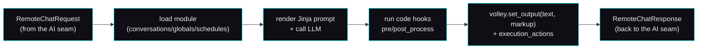

# 🧩 Content-module contract — activities, the volley API, execution actions

> **Spec version 1 · robot side stamped to firmware v3.6.4-Zephyr / OTA v24.10.803.**
> The *implementation-facing* contract for the **content layer** — how a server defines the activities
> Moxie runs and drives each turn. This sits **on top of** the [AI seam](ai-seam.md): the AI seam is
> the per-turn RemoteChat RPC; a content module is the *server-side logic* that answers it. Reads
> standalone; cites the study for provenance. Source:
> [`content-and-conversation.md`](../reverse-engineering/runtime/content-and-conversation.md),
> [`content-delivery.md`](../reverse-engineering/runtime/content-delivery.md).

## Where this fits

The [AI seam](ai-seam.md) says: per turn, a `RemoteChatRequest` comes in and a `RemoteChatResponse`
goes out. **A content module is how the server decides that response.** The brain loads a module,
renders its prompt, calls an LLM, runs the module's `code` hooks, and returns text + markup + actions.
Activities are therefore **pure server-side modules** — no firmware change needed to add one.



## The module format (what a server serves)

A module is JSON with three optional sections:

### `conversations[]` — LLM-driven chats
```json
{ "name":"Basic Memory Chat", "module_id":"OPENMOXIE_CHAT", "content_id":"memory",
  "max_history":40, "max_volleys":40,
  "opener":"Let's have a chat.|Anything on your mind?<opener>",
  "prompt":"You are Moxie talking to {{volley.config.child_pii.nickname}}. FACTS:\n{{volley.persist_data.memory_chat.facts}}",
  "model":"gpt-4o", "max_tokens":100, "temperature":0.5,
  "code":"def post_process(volley, session): ..." }
```
- **`prompt`** is **Jinja2-templated** over `volley`/`session` (`{{…}}`, ``). Common vars:
  `volley.config.child_pii.nickname`, `volley.persist_data.*`, `session.overflow`.
- **`opener`** supports `|`-alternatives and inline tags (`<opener>`, `<exit>`, `<sleep>`, `<launch:XX>`).
- **`code`** defines Python hooks run around each turn: `pre_process`, `post_process`,
  `complete_handler`, `notify_handler` (and `handle_volley` for globals).
- `model`/`max_tokens`/`temperature` are the LLM knobs — served to *your* [AI-seam brain](ai-seam.md),
  not a hardcoded vendor.

### `globals[]` — regex-triggered commands (always on)
```json
{ "name":"Timer Start",
  "pattern":"^(moxie|moxy) (start|set) a? timer for? (\\d+) (minute|hour|second)s?$",
  "entity_groups":"3,4", "action":4, "code":"def handle_volley(volley): ..." }
```
Regex over the utterance; capture groups become `volley.entities`. `action` selects how the match is
handled; `code` builds the response and fires execution actions. Globals run regardless of the active
activity (timers, "stop", wake words for commands).

### `schedules[]` — what to offer when
```json
{ "name":"moxie_go_hub_timers",
  "schedule":{ "provided_schedule":[{"module_id":"ENROLLCONVO"},{"module_id":"DM"}],
    "generate":{"chat_count":2,"module_count":6,"chat_modules":[...]},
    "hub_config":{"hubs":[{"module_id":"MOXIE_GO","content_id":"default"}]},
    "alarm_module":{"module_id":"ALARM","content_id":"fire"} } }
```
Mirrors `embodied.robotbrain.ContentSchedule` (`ScheduleConfig.day_one_schedule`, `promoted_content`,
`MissionConfig`, `RewardsConfig`, `EndOfSessionConfig`) — the day's plan of activities.

## The `volley` / `session` API (per-turn hooks)

Each turn hands the module's `code` a **`volley`** (this exchange) and **`session`** (the conversation):

| Call | Effect |
|---|---|
| `volley.set_output(text, markup)` | Set spoken text + optional `<mark cmd:…>` markup ([behavior-markup](../reverse-engineering/runtime/behavior-markup.md)) → the RemoteChatResponse output |
| `volley.entities` | Regex capture groups (for globals) |
| `volley.persist_data` / `volley.local_data` | Cross-session / this-turn scratch storage |
| `volley.request.get("input_vars", {})` | Inbound vars (maps to `RemoteChatRequest.input_vars`) |
| `volley.add_execution_action(name, args)` | Ask the robot to *do* something (bridge to native) |
| `volley.update_subscriptions([...])` | Subscribe to robot events for later turns |
| `session.summarize(...)` | LLM-summarize the transcript (memory) |
| `session.total_volleys`, `session.is_empty()`, `session.overflow` | Turn accounting |

`volley.config.child_pii` is the decrypted child profile from the
[config contract](config-and-telemetry-contract.md) — the personalization source for the prompt.

## Execution actions (content → robot bridge)

Named actions the brain asks the robot to perform, e.g.:
- `eb_timer_request [id, expiration_ms]` — set/cancel a timer (fires a wake event on expiry).
- `eb_enable_qr [true]` — turn on the camera QR scanner for this activity.
- `eb_wake` — wake state.

They map to the AI seam's `RemoteChatAction` / `execute_returns` plumbing — the same
`activity_ids`/`input_vars` the proto exposes. This is why a module can move Moxie between activities
and drive device functions, not just speak.

### QR inside content
Content can request a scan and read the value (activities ship their own "launch cards"):
```python
volley.add_execution_action('eb_enable_qr', ['true'])
volley.update_subscriptions(['eb-qr-event'])
# next turn:
qr = volley.request["input_vars"].get("$eb_qr_value", "")
if qr.startswith("GO"): volley.set_output(f"You got it!{qr[2:]}", None)
```
These are ordinary content QRs (a text payload the vision pipeline decodes) — distinct from the
setup/`bo-wifi` grammar in [`qr-commands.md`](../reverse-engineering/protocol/qr-commands.md); same
camera, different consumer.

## Content delivery (assets)

Activities that ship art/audio pull **dynamic AssetBundles** via `RobotAssetBundleSource` +
`EBAssetBundleFileManifest` (24 content-type processors). A revival server hosts the bundles it
references; a text-only activity needs none. Detail:
[`content-delivery.md`](../reverse-engineering/runtime/content-delivery.md).

## Minimum viable vs full

- **Minimum:** one `conversations[]` module (a prompt + an LLM call) answered through the AI seam — a
  working open-ended chat, no schedules, no assets, no execution actions.
- **Full:** globals (timers/commands), a daily `schedules[]` plan, `persist_data` memory,
  execution actions (timers/QR), and hosted asset bundles for rich activities.

## Conformance checklist

- [ ] Loads a module and renders its Jinja `prompt` over `volley`/`session`.
- [ ] Runs the `code` hooks (`pre_process`/`post_process`/`handle_volley`) and returns the result via `volley.set_output(text, markup)`.
- [ ] Answers through the [AI seam](ai-seam.md) as a `RemoteChatResponse` (text + markup + optional actions).
- [ ] Supports `globals[]` regex commands alongside the active activity.
- [ ] (Full) honors `schedules[]`, `persist_data`, execution actions, and hosts referenced asset bundles.

Where it lives: [`../../mqtt/`](../../mqtt/) (the `MoxieApp` brain that loads modules + answers turns);
new activities are pure server-side modules — no firmware change.

---
📖 [Docs index](../README.md) · [AI seam](ai-seam.md) · [Config & telemetry](config-and-telemetry-contract.md) · [MQTT & conversation](mqtt-and-conversation.md)
