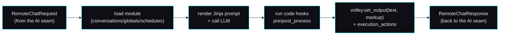

# 🧩 Content-module contract — activities, the volley API, execution actions

> **Spec version 1 · robot side stamped to firmware v3.6.4-Zephyr / OTA v24.10.803.**
> The *implementation-facing* contract for the **content layer** — how a server defines the activities
> Moxie runs and drives each turn. This sits **on top of** the [AI seam](ai-seam.md): the AI seam is
> the per-turn RemoteChat RPC; a content module is the *server-side logic* that answers it. Reads
> standalone; cites the study for provenance. Source:
> [`content-and-conversation.md`](../reverse-engineering/runtime/content-and-conversation.md),
> [`content-delivery.md`](../reverse-engineering/runtime/content-delivery.md).

## Where this fits

The [AI seam](ai-seam.md) says: per turn, a `RemoteChatRequest` comes in and a `RemoteChatResponse`
goes out. **A content module is how the server decides that response.** The brain loads a module,
renders its prompt, calls an LLM, runs the module's `code` hooks, and returns text + markup + actions.
Activities are therefore **pure server-side modules** — no firmware change needed to add one.



## The module format (what a server serves)

A module is JSON with three optional sections:

### `conversations[]` — LLM-driven chats
```json
{ "name":"Basic Memory Chat", "module_id":"OPENMOXIE_CHAT", "content_id":"memory",
  "max_history":40, "max_volleys":40,
  "opener":"Let's have a chat.|Anything on your mind?<opener>",
  "prompt":"You are Moxie talking to {{volley.config.child_pii.nickname}}. FACTS:\n{{volley.persist_data.memory_chat.facts}}",
  "model":"gpt-4o", "max_tokens":100, "temperature":0.5,
  "code":"def post_process(volley, session): ..." }
```
- **`prompt`** is **Jinja2-templated** over `volley`/`session` (`{{…}}`, ``). Common vars:
  `volley.config.child_pii.nickname`, `volley.persist_data.*`, `session.overflow`.
- **`opener`** supports `|`-alternatives and inline tags (`<opener>`, `<exit>`, `<sleep>`, `<launch:XX>`).
- **`code`** defines Python hooks run around each turn: `pre_process`, `post_process`,
  `complete_handler`, `notify_handler` (and `handle_volley` for globals).
- `model`/`max_tokens`/`temperature` are the LLM knobs — served to *your* [AI-seam brain](ai-seam.md),
  not a hardcoded vendor.

### `globals[]` — regex-triggered commands (always on)
```json
{ "name":"Timer Start",
  "pattern":"^(moxie|moxy) (start|set) a? timer for? (\\d+) (minute|hour|second)s?$",
  "entity_groups":"3,4", "action":4, "code":"def handle_volley(volley): ..." }
```
Regex over the utterance; capture groups become `volley.entities`. `action` selects how the match is
handled; `code` builds the response and fires execution actions. Globals run regardless of the active
activity (timers, "stop", wake words for commands).

### `schedules[]` — what to offer when
```json
{ "name":"moxie_go_hub_timers",
  "schedule":{ "provided_schedule":[{"module_id":"ENROLLCONVO"},{"module_id":"DM"}],
    "generate":{"chat_count":2,"module_count":6,"chat_modules":[...]},
    "hub_config":{"hubs":[{"module_id":"MOXIE_GO","content_id":"default"}]},
    "alarm_module":{"module_id":"ALARM","content_id":"fire"} } }
```
Mirrors `embodied.robotbrain.ContentSchedule` (`ScheduleConfig.day_one_schedule`, `promoted_content`,
`MissionConfig`, `RewardsConfig`, `EndOfSessionConfig`) — the day's plan of activities.

#### How a `schedules[]` entry becomes the day the robot runs

The robot **pulls** its plan at the start of every session — `client-service-activity-log` with
`subtopic:"query"`, `query:"schedule"` — and will not enter a session without an answer
([`mqtt-and-conversation.md`](mqtt-and-conversation.md) §`client-service-activity-log`). The answer is a
`CloudQueryResponse` whose field 6 is a `ContentSchedule`
([`Cloud.proto`](../reverse-engineering/protocol/recovered-proto/embodied/logging/Cloud.proto):343). A
`schedules[]` entry here is the **authoring template** for that answer, not the answer itself:

| In the module JSON | What the server does with it |
|---|---|
| `provided_schedule[]` | the pinned spine of the day, in order. Kept as authored — a fixture like `DM` (Daily Missions) is *meant* to recur. First-time-user modules (`WELCOME`, `TNT`, `SYSTEMSCHECK`) are the exception: they drop out once the child's `mentor_behaviors` say they're done, so onboarding ends |
| `generate{chat_count, module_count, chat_modules[], extra_modules[], excluded_module_ids[]}` | a **server-side authoring key**, not a `ContentSchedule` field. The server expands it into extra `provided_schedule` entries — a variety rotation of on-board activities that prefers ones this robot has **not** completed, with `chat_modules` interleaved between them — then **strips it**. It never goes on the wire |
| `chat_request`, `wake_module`, `alarm_module`, `hub_config`, `end_of_session`, `config`, `rewards`, `mission_config`, `tags`, `restricted_modules` | passed through as the matching `ContentSchedule` field |
| anything else | dropped — the served object contains only `ContentSchedule` fields, and each entry only `Recommendation` fields (`module_id`, `content_id`, `entry_line`, `module_name`, `module_description`, `seen`, `skip_hub`) |

Progress comes back the other way: the robot **reports** each finished or abandoned activity as a
`mentor_behavior` on that same topic (an `ActivityUpdate`, `Cloud.proto`:241, carrying a
[`MentorBehavior`](../reverse-engineering/protocol/recovered-proto/embodied/robotbrain/MentorBehavior.proto)
`{module_id, content_id, content_day, timestamp, action, instance_id, ended_reason}`). The server stores
that history per robot and answers `query:"mentor_behaviors"` with it — which is what lets the next day's
plan skip what's already done. Where it lives: [`../../mqtt/moxie_sdk/schedule.py`](../../mqtt/moxie_sdk/schedule.py)
(the builder) and [`../../mqtt/moxie_sdk/store.py`](../../mqtt/moxie_sdk/store.py) (the history).

Today's builder is **deterministic** — seeded on `(device_id, day)` — so a plan is stable for a day and
different tomorrow. An adaptive, explainable recommender is a later slice
([`openmoxie-feature-audit.md`](openmoxie-feature-audit.md) §4.2 row 7).

## The `volley` / `session` API (per-turn hooks)

Each turn hands the module's `code` a **`volley`** (this exchange) and **`session`** (the conversation):

| Call | Effect |
|---|---|
| `volley.set_output(text, markup)` | Set spoken text + optional `<mark cmd:…>` markup ([behavior-markup](../reverse-engineering/runtime/behavior-markup.md)) → the RemoteChatResponse output |
| `volley.entities` | Regex capture groups (for globals) |
| `volley.persist_data` | **Cross-session storage** — durable, module-namespaced, bounded, erasable. See [Memory](#memory-persist_data-sessionsummarize) below |
| `volley.local_data` | This-turn scratch. Never written anywhere |
| `volley.request.get("input_vars", {})` | Inbound vars (maps to `RemoteChatRequest.input_vars`) |
| `volley.add_execution_action(name, args)` | Ask the robot to *do* something (bridge to native) |
| `volley.update_subscriptions([...])` | Subscribe to robot events for later turns |
| `session.summarize(...)` | LLM-summarize the transcript into structured, kid-safe facts (memory). See below |
| `session.total_volleys`, `session.is_empty()`, `session.overflow` | Turn accounting |

`volley.config.child_pii` is the decrypted child profile from the
[config contract](config-and-telemetry-contract.md) — the personalization source for the prompt.

## Memory — `persist_data` + `session.summarize()`

**Built 2026-09-02.** A conversation that ends is summarized into a few durable facts; the
next conversation reads them back. Where it lives:
[`moxie_sdk/store.py`](../../mqtt/moxie_sdk/store.py) (`MemoryStore` — the storage),
[`moxie_sdk/content/memory.py`](../../mqtt/moxie_sdk/content/memory.py) (the summarizer),
[`content_app.py`](../../mqtt/moxie_sdk/content/content_app.py) (the wiring).

### The store

One `memory.json` per robot under the data dir (`robots/<device_id>/memory.json`), a dict
of **namespaces** — one per content module, so two activities never overwrite each other:

```json
{ "memory_chat": {
    "facts": ["Has a beagle named Pepper", "In second grade"],
    "preferences": ["Likes drawing"], "open_threads": ["Ask how the play went"],
    "summaries": ["Conversation about Sam's new puppy"],
    "_meta": {"summarized_through": 4},
    "_provenance": [{"at": 1788352646.864, "date": "2026-09-02",
                     "module_id": "MEMORY_CHAT", "content_id": "default",
                     "conversation_id": "", "turns": 2, "reason": "exit",
                     "source": "session.summarize"}] } }
```

- **Bounded** — caps on namespaces (32), items per list (25), item length (240 chars) and
  total file size (16 KB). An unbounded memory is both a prompt-cost bug and a privacy one.
- **Provenance on every merge** — `_provenance` records which module, which day, how many
  turns and *why* the conversation ended. `_`-prefixed keys are the engine's; they never
  appear in the parent-facing `data`.
- **JSON-safe** — anything a module or a model produces that will not serialize is dropped,
  never stored as junk.
- **List merges prepend and de-duplicate** (newest first, case-insensitive), so a second
  conversation adds to what the first learned instead of replacing it. Scalars overwrite.
- **`LoggingPolicy.NO_DATA` means no memory is written.** Reads and erase always work, so a
  parent can still inspect and delete what was stored before the switch was flipped. The
  default is `NO_MEDIA` (writing allowed) for the same reason the safety journal's is: the
  `RobotCloudConfig` default of `NO_DATA` governs what the *robot uploads*, and memory is
  text our own server derives from turns that already reached it. Setting a device's
  `logging_policy` to `NO_DATA` is an explicit parent choice and it switches writing off.

### `session.summarize(...)`

At the end of a conversation the brain is asked — through the same injected
`chat(messages)` seam as any turn, wrapped in `call_with_backoff` — for a short
**structured** account:

```json
{"facts": [], "preferences": [], "open_threads": [], "summary": ""}
```

Structured, not OpenMoxie's summary string, because a parent has to be able to read *and
delete one item*. Parsing is tolerant (fenced JSON, JSON with prose around it, or a plain
sentence all work). Two things are never remembered: anything the
[safety classifier](ai-seam.md) would **block** (a memory file is the one place an unsafe
line would live forever and be re-injected into every later prompt), and the **child's own
words** — the prompt forbids quoting and a shingle check enforces it. A brain failure
returns `None` and **nothing is written**: a missing fact is recoverable, a wrong one is not.

### Declaring it (the `memory` block)

Module `code` strings are deliberately never executed (sandboxing — see
[`content_app.py`](../../mqtt/moxie_sdk/content/content_app.py)), so what OpenMoxie's
MemoryChat expresses as a `complete_handler` is **declared** here instead:

```json
"memory": {"namespace": "memory_chat", "summarize": true, "min_volleys": 2,
           "max_items": 5, "prompt": "<optional instruction override>"}
```

`namespace` alone makes `{{ volley.persist_data.<namespace>.* }}` resolve in the prompt (a
list of facts renders as `- ` bullets in both the Jinja2 and the dependency-free renderer).
The **end of a conversation** — an `<exit>`/EXIT action, a module switch, or the robot going
offline — fires `MoxieApp.on_session_end(robot, history, reason)`, which summarizes the part
of the transcript not yet summarized (`_meta.summarized_through`, so a switch back and forth
never re-summarizes, or re-pays for, the same turns) and merges it in.

### What a parent can do

The supervisor's localhost status server serves the memory
([`moxie_runtime.py`](../../mqtt/supervisor/moxie_runtime.py), the memory region):

| Endpoint | Effect |
|---|---|
| `GET /memory?device_id=…` | Everything Moxie remembers, by namespace, with provenance, the byte size, and whether writing is currently allowed |
| `DELETE /memory?device_id=…[&namespace=…]` | Forget one namespace, or all of it |
| `POST /memory?device_id=…` `{"erase":"<ns>"\|"all"}` | The same erase, for clients that cannot send DELETE |

Erasure is never policy-gated — a parent must always be able to delete. **A browser UI over
these endpoints is not built yet**: today it is `curl`, which is why
[`openmoxie-feature-audit.md`](openmoxie-feature-audit.md) §4.2 BEYOND #4 stays open.

### Honest limits

The model can be wrong, and a wrong fact is **sticky** — it goes back into every later
prompt until someone erases it (our own live run turned "sleeps on my bed" into "Puppy
sleeps on **his** bed", inventing a pronoun). The verbatim check is a floor, not a
guarantee: a *paraphrase* can still carry something private. That is exactly why the facts
are few, bounded, attributed, and erasable.

## Execution actions (content → robot bridge)

Named actions the brain asks the robot to perform, e.g.:
- `eb_timer_request [id, expiration_ms]` — set/cancel a timer (fires a wake event on expiry).
- `eb_enable_qr [true]` — turn on the camera QR scanner for this activity.
- `eb_wake` — wake state.

They map to the AI seam's `RemoteChatAction` / `execute_returns` plumbing — the same
`activity_ids`/`input_vars` the proto exposes. This is why a module can move Moxie between activities
and drive device functions, not just speak.

### QR inside content
Content can request a scan and read the value (activities ship their own "launch cards"):
```python
volley.add_execution_action('eb_enable_qr', ['true'])
volley.update_subscriptions(['eb-qr-event'])
# next turn:
qr = volley.request["input_vars"].get("$eb_qr_value", "")
if qr.startswith("GO"): volley.set_output(f"You got it!{qr[2:]}", None)
```
These are ordinary content QRs (a text payload the vision pipeline decodes) — distinct from the
setup/`bo-wifi` grammar in [`qr-commands.md`](../reverse-engineering/protocol/qr-commands.md); same
camera, different consumer.

## Content delivery (assets)

Activities that ship art/audio pull **dynamic AssetBundles** via `RobotAssetBundleSource` +
`EBAssetBundleFileManifest` (24 content-type processors). A revival server hosts the bundles it
references; a text-only activity needs none. Detail:
[`content-delivery.md`](../reverse-engineering/runtime/content-delivery.md).

## Minimum viable vs full

- **Minimum:** one `conversations[]` module (a prompt + an LLM call) answered through the AI seam — a
  working open-ended chat, no schedules, no assets, no execution actions.
- **Full:** globals (timers/commands), a daily `schedules[]` plan, `persist_data` memory
  (built — see [Memory](#memory-persist_data-sessionsummarize)), execution actions
  (timers/QR), and hosted asset bundles for rich activities.

## Conformance checklist

- [ ] Loads a module and renders its Jinja `prompt` over `volley`/`session`.
- [ ] Runs the `code` hooks (`pre_process`/`post_process`/`handle_volley`) and returns the result via `volley.set_output(text, markup)`.
- [ ] Answers through the [AI seam](ai-seam.md) as a `RemoteChatResponse` (text + markup + optional actions).
- [ ] Supports `globals[]` regex commands alongside the active activity.
- [ ] (Full) honors `schedules[]`, execution actions, and hosts referenced asset bundles.
- [x] `persist_data` + `session.summarize()`: durable module-namespaced memory, summarized at
      the end of a conversation with provenance, `NO_DATA`-gated, and readable/erasable by a
      parent over `/memory`.

Where it lives: [`../../mqtt/`](../../mqtt/) (the `MoxieApp` brain that loads modules + answers turns);
new activities are pure server-side modules — no firmware change.

---
📖 [Docs index](../README.md) · [AI seam](ai-seam.md) · [Config & telemetry](config-and-telemetry-contract.md) · [MQTT & conversation](mqtt-and-conversation.md)
