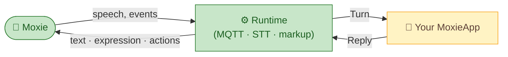

# 🎭 Moxie as a platform — the SDK

The bigger idea: **Moxie is an embodied avatar that any AI can drive.** Once a robot is on your
network and pointed at your server, it becomes a friendly physical body — eyes, voice, expression,
presence — that a game, an agent, or any service can speak and act through. This project turns that
into a clean SDK so building "a thing that lives through Moxie" is easy.

> A revived robot is the floor, not the ceiling. The point is a **framework for apps to *be* Moxie.**

## The one interface that matters: `MoxieApp`

"Being Moxie" means implementing one small interface. The runtime handles the hard parts (MQTT, TLS,
protobufs, speech-to-text, behavior markup, the robot's quirks); your app just decides what Moxie
says and does.

```python
from moxie_sdk import MoxieApp, Turn, Reply

class MyApp(MoxieApp):
    def respond(self, turn: Turn) -> Reply:
        return Reply(text=f"You said: {turn.speech}")
```

- **`Turn`** — what reached Moxie: the recognized `speech`, the `child` profile, conversation
  `history`, the current module, scanned QR values. Transport-free.
- **`Reply`** — what Moxie should do: `text` (spoken), optional `markup` (expression; auto-generated
  if omitted), and structured `actions` (launch a module, enable QR scanning, sleep…).



## Three ways to be Moxie (all ship in the SDK)

| App | For | How |
|-----|-----|-----|
| **`LLMApp`** (default) | a conversational companion | any OpenAI-compatible endpoint (local LiteLLM/vLLM/Ollama/LM Studio); set a persona + model |
| **`WebhookApp`** | an **external** game or service | the runtime POSTs each `Turn` as JSON to your endpoint; you return a `Reply`. Your code never lives in this repo. |
| **`EchoApp`** | testing | echoes speech; proves the loop |

### Driving Moxie from an external app (the avatar bridge)
`WebhookApp` is the clean, language-agnostic boundary for any external system to embody a character
through Moxie. Point it at your service and that service *becomes* Moxie's brain:

```
POST <your-endpoint>            →  { "device_id","speech","child":{…},"history":[…],"input_vars":{…} }
response                        ←  { "text":"…", "markup":"…?", "end_turn":false,
                                     "actions":[{"type":"launch","module_id":"…"}] }
```

A game engine, an agent framework, or any AI service in any language can implement that one endpoint
and drive the robot — no coupling to this codebase, no shared source. Your world's characters get a
body in the real room.

## Why this shape
- **Separation of concerns.** The *runtime* owns the robot protocol; the *app* owns behavior. Either
  can evolve independently.
- **Local-first, no lock-in.** The default brain is a local model; swapping models or going fully
  offline is config, not code.
- **Composable.** Multiple apps can coexist (route by module, by robot, by context) — a companion by
  default, a game when launched, a tutor on schedule.

## Where it lives
- SDK: [`mqtt/moxie_sdk/`](../../mqtt/moxie_sdk/) — `MoxieApp`, `Turn`/`Reply`, and the built-in apps.
- Runtime: [`mqtt/supervisor/`](../../mqtt/supervisor/) — the MQTT protocol → `MoxieApp` calls.
- Protocol reference: [`mqtt-and-conversation.md`](mqtt-and-conversation.md).

---
📖 [Docs index](../README.md) · [← Architecture overview](overview.md) · [MQTT & conversation spec →](mqtt-and-conversation.md)
