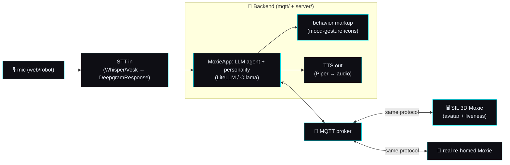

# 🌐 The Moxie ecosystem — master build plan (~1 week)

> **Goal.** A complete, self-hostable **Moxie ecosystem**: a real backend "brain" that runs a full
> **conversational, expressive, alive** Moxie — and connects to **either the [SIL](../../sim/) 3D
> avatar OR a real re-homed robot**, over the exact protocol reverse-engineered from firmware
> **v3.6.4-Zephyr / OTA v24.10.803**. You talk to it (mic), it thinks (LLM agent + personality), speaks
> (Piper), and moves/emotes (behavior markup + liveness). Built end-to-end, driven by the
> [layered session loops](sil-and-cicd.md#the-layered-session-timers).

This supersedes the narrow "SIL web-UI" scope: the SIL is now the **display/test surface** for a real
ecosystem, not the deliverable itself.

## The stack (one backend, two robots)

**Principle:** the backend speaks only the RE'd MQTT/JSON/markup protocol, so the **SIL and a real
robot are interchangeable clients.** Everything proven in the sim works on hardware.

## Workstreams

### 1 · Avatar (3D) — *Fable 5*
Accurate two-part model (separate **head** + cylinder **body**, forehead camera, half-cylinder arms,
single-finger hands — see [visual reference](sil-and-cicd.md#visual-reference-the-3d-model-from-the-fcc-external-photos)),
the 7-DOF `libmotionlib` rig, the control-room HUD ([style guide](../design/style-guide.md)).

### 2 · Liveness / animation system
Moxie **acts alive**: breathing, natural blinks, micro head-sways, glances, weight-shifts, and idle
behaviors mirroring the real set (`Bht_Idle_Curious`, `Bht_Idle_Active_Listening`, `Bht_Active_Thinking`
— [behavior-markup](../reverse-engineering/behavior-markup.md)). Layered *over* commanded motion; damps
out when the brain drives a gesture. Expressive during conversation (gesture + mood + icons from markup).

### 3 · Voice — TTS out (Piper)
The backend **synthesizes speech with [Piper](https://github.com/rhasspy/piper)** (server-side, matching
the real robot's `CloudTTSResponse` → PCM). Audio is delivered to the client and played with **mouth /
viseme sync**. Guide users to Piper (offline) & Ollama; the author's local run uses their own LiteLLM.

### 4 · Voice — STT in (talk to Moxie)
**Web mic capture** → STT (faster-whisper / Vosk, or a Deepgram-compatible service) → the
[`DeepgramResponse`](../reverse-engineering/perception-pipeline.md#stt-response-wire-format-deepgramresponse)
shape → the chat loop. `speech_final` ends the turn. So you actually **converse** with Moxie in the
browser (and the same STT serves a real robot's `events/zmq` audio).

### 5 · Brain — LLM agent + personality
`MoxieApp` (in [`mqtt/moxie_sdk`](../../mqtt/)) becomes a real **agent**: connects to an OpenAI-compatible
LLM (**LiteLLM** or **Ollama**, env-configured), with a **Moxie personality** (warm, playful, kid-safe
SEL mentor), conversation **memory**, content/agent behaviors, and — crucially — it **emits behavior
markup** (`playback-mood`, `behaviour-tree`/`Gesture_*`, `icons-v2`) so the avatar *acts* while it talks.
Backend config is generic in the repo (Ollama/LiteLLM); no private endpoints/keys are committed.

### 6 · Backend — full app (sim **or** real)
`mqtt/` (broker + supervisor + brain + TTS + STT) + `server/` (accounts/REST/UI) as one cohesive,
one-command stack that a **SIL virtual robot or a real re-homed Moxie** connects to identically.

### 7 · Packaging & docs ✅ (core)
`docker compose -f sim/docker-compose.yml up` = broker + supervisor + web; `--profile voice` adds
Piper TTS + whisper STT; `--profile demo` adds a virtual robot. Config guides for **Ollama** (recommended
offline) and **LiteLLM**. HUD polish. Everything version-stamped, self-contained (vendored deps).

## Phases (rough week)

- **Phase 0 — Foundations (DONE):** protocol SIL + CI, 3D Moxie v1, live MQTT-WS bridge, markup→
  animation, record/replay, docker package, control-room HUD, vendored deps, Piper verified.
- **Phase 1 — Real model + voice loop (DONE):** ① two-part model + liveness (Fable, running);
  ③ Piper TTS audible in the web; ④ STT via web mic; wire ⑤ the LLM brain to LiteLLM/Ollama.
- **Phase 2 — Agent + personality + expression:** Moxie converses with a personality, remembers, and
  drives mood/gesture/icons markup so the avatar emotes; STT↔TTS↔LLM full duplex; liveness integrated.
- **Phase 3 — Sim-or-real + packaging:** one-command full stack; confirm a real robot path; Ollama +
  LiteLLM guides; polish; release tag.

## Immediate queue (Phase 1)
- [x] **Piper audible on the web** — `sim/tts/server.py` (Piper, amy voice) + `sim/web/audio.js`
  (speech + synthesized SFX + envelope-driven mouth sync). ⏳ bubble restyle folded into the layout pass.
- [x] **STT in** — `sim/stt/server.py` (faster-whisper → real `DeepgramResponse` shape) + `sim/web/mic.js`
  (MediaRecorder → STT → publishes a child utterance on the bus). TTS→STT round-trip verified.
- [x] **LLM brain** — `LLMApp` is now an **expressive agent**: model returns `{say, mood, gesture}` →
  translated into real behavior markup (`playback-mood` + `Gesture_*`), verified to parse through the SIL
  bridge. Moxie persona authored from firmware cues (GRL, kid-safe SEL mentor). Config via gitignored
  `mqtt/.env` (Ollama default; any OpenAI-compatible/LiteLLM endpoint). ⏳ next: point it at a live
  endpoint + full STT↔LLM↔TTS duplex.
- [x] **Two-part model + liveness** — Fable 5 (running).

> Config note: private LLM endpoints/keys live only in a local, git-ignored `.env` (never committed).
> The repo ships Ollama/LiteLLM examples with placeholders.

---
📖 [SIL & CI/CD](sil-and-cicd.md) · [Design language](../design/style-guide.md) · [Cloud protocol](../reverse-engineering/cloud-protocol.md) · [Perception (STT/TTS)](../reverse-engineering/perception-pipeline.md) · [Behavior markup](../reverse-engineering/behavior-markup.md)
