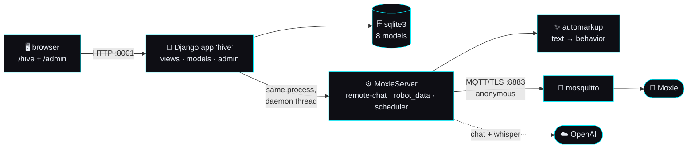

# 🔬 OpenMoxie feature audit — what to adopt, and where to go beyond

> **Audit version 1 · baseline 2026-09-02 · status column refreshed 2026-09-05.** A feature-by-feature read of **OpenMoxie** (upstream `v0.8`, MIT)
> and its two active forks, measured against **our** build contracts and what we have actually shipped
> ([`implementation-plan.md`](implementation-plan.md)). Every OpenMoxie claim below cites a file in
> *their* repo. Every claim about us cites a file in *ours*. Nothing here is guessed.
>
> Scope note: this is the **deep** companion to [`../community-research.md`](../community-research.md)
> (which places OpenMoxie in the landscape) and to
> [`mqtt-and-conversation.md`](mqtt-and-conversation.md) §7.2 (which decided *take vs rebuild* for the
> transport layer). This doc covers **every** feature, user-facing and architectural, and turns the
> result into a ranked backlog.
>
> **Baseline + status.** The audit was measured at commit `fa70309` (PR #4, 2026-09-02) and its
> *findings* are frozen at that baseline — they are not rewritten as we ship. What we have built since
> is tracked in the **Status** column of the two ranked-backlog tables (§4.1, §4.2), last refreshed
> **2026-09-05**, and in [`orchestration-plan.md`](orchestration-plan.md)'s status log. Where a
> status is *partial*, the column says what is actually done, not what was intended. §4.4 re-ranks what is
> still open.
>
> **⚠️ How to read this page — the frozen half and the live half**
>
> This distinction is not pedantry. On **2026-09-03** two build agents were each briefed off this page
> and each lost a full run discovering on arrival that their item had already shipped: **content packs**
> (ADOPT #5, merged as PR #51 on 2026-09-02) still carried a 🔵 *open* marker, and the **voice +
> listening picker** (BEYOND #8's console half, merged as PR #48) was ranked as work to do. An audit that
> overstates what is left is worse than no audit, because it is trusted. So:
>
> | Section | Frozen or live? | What it means |
> |---|---|---|
> | §1, §2 (inventory of *their* code) | **frozen** at `c8c2d380` / `a97c85c0` / `a80a81ef` | Re-verified against the live remote heads — see the upstream re-check below |
> | §3 (the HAVE/ADOPT/BEYOND scorecard) | **FROZEN at 2026-09-02 morning** | Its *"Us today"* column is a **historical snapshot** and several cells are deliberately left describing a gap we have since closed. **Never brief an agent from §3.** §3.0 lists every superseded row |
> | §4.1, §4.2 **Status** columns | **live** | The authority on what we have shipped. Every 🟢 names the PR *and* the test that proves it |
> | §4.3 (briefs), §4.4 (the ranking) | **live** | §4.4 is the only place to look for *"what should I build next"* |
> | §5 (the honest ledger) | **frozen**, with a live "closed since" note at its head | Same rule as §3 |
>
> **The rule for anyone editing this page:** a row is 🟢 only if you can name the **file** and the
> **test** that prove it. "The PR is merged" is not proof; a test name is.
>
> **Upstream re-check — checked 2026-09-05: still nothing new upstream, for the fourth consecutive day.**
> The 2026-09-05 evidence and the commands that produced it are in [§2.7](#27-upstream-re-check-2026-09-05-fourth-consecutive-nothing);
> the paragraph below is the 2026-09-04 sweep, whose conclusion 2026-09-05 re-derived independently.
> All three source repos were read again at their **live remote heads** (`git ls-remote`, so this is not
> a stale local clone speaking), branches and tags both:
> upstream [`jbeghtol/openmoxie`](https://github.com/jbeghtol/openmoxie) is still `c8c2d380`
> (2026-01-15, *"Added warning about alt openmoxie (#58)"*), [`Noonster77/openmoxie`](https://github.com/Noonster77/openmoxie)
> is still `a97c85c0` (2026-08-31 UTC, *"Add parent review acknowledgments"*), and
> [`vapors/openmoxie-ollama`](https://github.com/vapors/openmoxie-ollama) is still `a80a81ef`
> (2025-08-18 UTC). No repo has gained a branch or a tag either: both openmoxie repos carry the same
> three branches (`main`, `disclaimer` `a1521754`, `release` `36f8c122` — the latter two identical
> across the fork and unmoved) and the same seven refs under `refs/tags`; the ollama fork has one branch
> and three tags all pointing at `6eaa7458`. Every one of those is the exact commit this audit was
> written against — **nothing has been published upstream or in either fork since the baseline**, so
> there is nothing new to adopt, re-rank or re-cite from their side. **A verified nothing is a result.**
>
> > 🩹 **A correction to this paragraph's own prose, 2026-09-04.** It read *"the same seven tags topping
> > out at `v0.7`"* until today. The count is right and the top is not: `git ls-remote --tags` returns
> > `pre_web` and `v0.3`–**`v0.8`**, and `v0.8` (`46bb9bfe`, released 2025-02-28) is the release this
> > page's own first line already cites as the audited version. Seven refs, topping out at `v0.8`. The
> > finding it supported — *nothing new* — is unaffected, which is precisely why the error survived two
> > re-checks: a detail nobody re-derives because the conclusion keeps coming out the same.

## 🙏 Credit — OpenMoxie is MIT, and it is the reason any of this is possible

**[jbeghtol/openmoxie](https://github.com/jbeghtol/openmoxie)** — **MIT License**, © Justin Beghtol.

Justin Beghtol is a **former Embodied engineer**. When Embodied shut down in December 2024, OpenMoxie
was released as the **CEO-sanctioned open-source off-ramp** so owners would not be left with a brick.
It is the canonical LAN replacement for Moxie's MQTT/IoT cloud, and it is the origin of nearly
everything the community knows about the robot's cloud protocol: the migration-QR relocation trick,
the mosquitto TLS setup, the `RemoteChat` volley model, the real Embodied protobuf schemas, and the
`automarkup` text→behavior engine. **If you own a Moxie and want it talking tonight, install OpenMoxie.**

The two active forks audited here, both MIT by inheritance:

| Fork | Last commit | Direction |
|---|---|---|
| **[Noonster77/openmoxie](https://github.com/Noonster77/openmoxie)** — "OpenMoxie Family Edition" | 2026-08-30 (active) | Local-first AI (LM Studio + faster-whisper), a rebuilt family-facing UI, speaker-scoped memory, transcripts, safety flags + parent review, 70 tests |
| **[vapors/openmoxie-ollama](https://github.com/vapors/openmoxie-ollama)** | 2025-08-17 (stale) | Ollama + xAI Grok providers, a standalone FastAPI faster-whisper STT microservice, Docker Hub CI. Explicitly adult/unfiltered |

We take ideas and (where we vendor code) carry the MIT notice with it — see
[`../../ATTRIBUTION.md`](../../ATTRIBUTION.md). **This audit is not a competitive teardown.** It is a
list of what a mature project already solved, so we do not re-solve it badly, plus an honest list of
the places their design stops and ours should keep going.

## How this audit was done

- Upstream cloned at `v0.8` (`site/VERSION`), last upstream commit `c8c2d38` (2026-01-15). Both forks
  cloned shallow and diffed file-by-file against upstream (Fork A adds 33 files, Fork B adds 30; neither
  deletes any).
- **Read in full:** every `.py` under `site/hive/` except the generated `*_pb2.py` and the `automarkup`
  internals; every template under `site/hive/templates/hive/`; every doc under `doc/`; the seed data
  under `site/data/`; the four shareable packs under `content_modules/`; the Docker/compose files.
- **Our side:** the six build contracts in this folder, [`implementation-plan.md`](implementation-plan.md)
  (status tables + Definition of done), and the code in [`../../mqtt/`](../../mqtt/) and
  [`../../server/`](../../server/).
- **Clean-room boundary unaffected.** OpenMoxie is MIT open source; reading it is fine and we credit it.
  The vendor Android app remains off-limits and is not referenced anywhere in this doc.

**Size, for calibration.** Upstream OpenMoxie is **≈5,900 lines of Python** — small, and that is a
compliment: it is the *minimum* that makes a robot work.

| Subsystem | LOC | Note |
|---|--:|---|
| `site/hive/automarkup/` | 2,157 | the text→behavior markup engine — the single densest asset |
| `site/hive/mqtt/` (excl. protos) | 1,889 | the whole robot cloud: server, chat, volley, globals, robot data, scheduler, STT |
| `site/hive/` views + models + import/export | 633 | the entire web app's logic |
| `site/hive/templates/hive/` | 797 | 12 HTML pages |
| `site/hive/mqtt/protos/**` | 213 | 5 generated protobuf modules |

---

## 1. Feature inventory — upstream OpenMoxie

One Django process does everything: the web UI, the database, and — on a daemon thread started by an
overridden `runserver` — the MQTT supervisor that talks to the robot.

### 1.1 Web UI — pages and flows

Django 5.1 app mounted at `/hive/`; 24 routes in `site/hive/urls.py`. There is **no parent app** —
everything is done in this one web UI, plus the raw **Django admin** at `/admin/` for anything the
hand-built pages do not cover (`site/hive/admin.py` registers all 7 models).

| Page / route | View | What it does | Maturity |
|---|---|---|---|
| `/hive/setup` → `hive_configure` | `SetupView` | First-run wizard: OpenAI API key, optional Google service-account JSON, external hostname, "allow unverified bots", **creates the Django superuser** | 🟢 solid, doubles as the onboarding doc |
| `/hive/dashboard` | `DashboardView` | Device list w/ online badge + `timesince`, per-device action buttons, schedule list, conversation list, content import/export, "Refresh from DB" | 🟢 the hub |
| `/hive/endpoint/` | `endpoint_qr` | **Migration QR** PNG — repoints the robot at this server | 🟢 the killer feature |
| `/hive/wifi_edit/` → `wifi_qr` | `WifiQREditView` | **Wi-Fi QR** PNG from SSID/password/band/hidden | 🟢 |
| `/hive/moxie/<pk>` → `moxie_edit` | `MoxieView` | Per-robot: name, pairing status, mentor nickname, schedule, **volume slider**, **brightness slider**; read-only firmware/battery/mode/last-connect | 🟢 |
| `/hive/face/<pk>` → `face_edit` | `MoxieFaceView` | **Face customizer** — layered asset picker (eyes, face colour, brows, glasses, nose, hair…) + a "new child ID" button that invalidates Moxie's Unity texture cache | 🟢 genuinely delightful |
| `/hive/moxie_missions/<pk>` → `mission_edit` | `MoxieMissionsView` | Mark Daily-Mission sets **complete / forget / reset all** by writing `MentorBehavior` rows | 🟢 |
| `/hive/puppet/<pk>` → `puppet_api` | `MoxiePuppetView` | **Puppet / telehealth mode**: type a line + pick mood + intensity → Moxie says it; interrupt button; live online/puppet state polling | 🟢 the demo that sells it |
| `/hive/moxie_data/<pk>` | `MoxieDataView` | Raw JSON dump of the robot's active config + persistent data | 🟡 debug-grade |
| `/hive/interact/<pk>` → `interact_update` | `InteractionView` | **Browser chat harness** — talk to any conversation module without a robot, including global-command matching | 🟢 excellent for authoring |
| `/hive/export_content/` → `export_data` | `ExportDataView` | Select globals/schedules/conversations → download a **content pack** JSON | 🟢 |
| `/hive/import_review/` → `import_data` | upload + review | Upload a pack, see per-record `New / Upgrade from vN / Replace vN`, tick what to import | 🟢 nice two-step |
| `/hive/moxie_wake/<pk>` | `moxie_wake` | Send a `wakeup` command to a robot using the wake button | 🟢 |
| `/hive/reload_database` | `reload_database` | Re-read DB-backed caches after an admin edit | 🟡 manual cache-bust |

Styling is Bootstrap 5 + a small `site/static/hive/style.css`; jQuery for the puppet/interact AJAX.
No build step, no SPA. `openmoxie/version_context.py` stamps `site/VERSION` into every page header.

### 1.2 Robot onboarding — the two QR codes

The single most important thing OpenMoxie proved. Both QR builders live in
`site/hive/mqtt/moxie_server.py`:

- **Migration / endpoint QR** — `MoxieServer.get_endpoint_qr_data()` builds a `ServiceConfiguration2`
  protobuf (`gcp_project`, `mqtt_host`, `override_port`, `disable_verify`), base64s it, and wraps it as
  `{"debug": {"command": "om", "param": "<b64>"}}`. The robot's camera scans it and **permanently
  relocates** to your broker.
- **Wi-Fi QR** — `get_wifi_qr_data()` builds `embodied.wifiapp.QRCommands.StartPairingQR`
  (`wifi_only`, `ssid`, `password`, `is_hidden`, `band_select`), serializes, and prefixes the literal
  `PA` header.
- **Launch-card QRs** — `site/data/qr/extract.py` generates 24 PNGs of the form `GO<launch:MODULE_ID>`
  so a child can scan a card to start an activity. Small idea, big charm.
- **OTA lever** — `doc/RemoteModuleAPI.md` documents (as notes, not code) how the author upgraded
  801 → 803 robots by adding `webservice_root` to the endpoint QR, flipping `_PROVIDE_HTTP_TOKENS`,
  and serving a static `api/ota_updates/{id}/url` JSON file.
- **Robot identity** — `site/hive/mqtt/robot_credentials.py` can pull `uuid.txt` + `RS256.key` off a
  robot **over ADB** and mint per-device JWTs. The server itself connects as a fake `supervisor`
  identity because the broker allows anonymous auth.

### 1.3 Robot configuration & settings

`site/hive/mqtt/robot_data.py` holds the model, and it is the cleanest idea in the codebase:
a **two-level merge**. `HiveConfiguration.common_config` / `.common_settings` (fleet-wide) are
`deepmerge.always_merger`-merged with `MoxieDevice.robot_config` / `.robot_settings` (per-robot).
`DEFAULT_ROBOT_CONFIG` / `DEFAULT_ROBOT_SETTINGS` are the fallbacks.

Config keys exercised: `pairing_status`, `audio_volume`, `screen_brightness`, `audio_wake_set`,
`timezone_id`, `child_pii{nickname, input_speed, face_options, id}`, `moxie_mode` (TELEHEALTH),
`wake_button_enabled`, `touch_wake_enabled`, `ota_update{id,version}`.
Settings props: `touch_wake`, `wake_alarms`, `wake_button`, `doa_range`, `target_all`,
`gcp_upload_disable`, `local_stt`, `max_enroll`, `audio_wake`, `cloud_schedule_reset_threshold`,
`debug_whiteboard`, `brain_entrances_available`, `mqtt_files`, `file_sync_wait`, `default_loglevel`,
`stt`, `no_reprompt`. All of it is documented, with warnings, in `doc/MoxieOverview.md` —
**the best config documentation that exists for this robot.**

Config is pushed on connect and re-pushed live on edit (`MoxieServer.handle_config_updated` →
`RobotData.config_update_live`). Robots hold their data in memory only while connected
(`db_connect` / `db_release`), which keeps the hot path off the DB.

### 1.4 Schedules and the session model

`MoxieSchedule.schedule` is free-form JSON. `site/hive/mqtt/scheduler.py` then does something
smarter than a static list — `expand_schedule()`:

- a `generate` block declares `chat_count`, `module_count`, `chat_modules`, `extra_modules`,
  `excluded_module_ids`;
- `ransac_select()` runs 20 random samples and scores them to **avoid adjacent/duplicate categories**,
  picking the most varied day;
- `distribute_elements()` interleaves the random chats evenly between activities;
- `ftue_remove()` drops the first-time-user modules (`TNT`, `SYSTEMSCHECK`, `WELCOME`) once the child
  has completed them, by counting `MentorBehavior` rows.

Other documented schedule keys (`doc/MoxieOverview.md`): `wake_module`, `chat_request`,
`end_of_session`, `alarm_module`, and `hub_config` (a "hub and spokes" module injected between
activities). Three seed schedules ship: `default`, `no_onboarding`, `only_chat`
(`site/data/default_schedules.json`).

The robot asks for its schedule per session on `client-service-activity-log` with `query:"schedule"`;
it also asks for `mentor_behaviors` (progress history) and `license` (a Google service-account key,
shared verbatim if configured). All three are answered in `MoxieServer.on_device_event`.

### 1.5 Content — conversations, globals, packs

**Conversations** (`SinglePromptChat`): `module_id` + `content_id` (multiple CIDs may be `|`-separated),
`opener` (random pick from `|`-alternatives), `prompt`, `max_history`, `max_volleys`, `model`,
`max_tokens`, `temperature`, and a free-form Python `code` field. The prompt is rendered as a **Django
template** with `volley` and `session` in scope, so a prompt can say
`{{volley.config.child_pii.nickname}}` or branch on ``
(`site/hive/mqtt/conversations.py`, `SingleContextChatSession.make_volley_context`).

**Hooks.** The `code` field is `exec`'d at session construction and may define `pre_process`,
`post_process`, `complete_handler`, `notify_handler`
(`conversations.py` `SinglePromptDBChatSession.__init__`). `complete_handler` is where the shipped
`content_modules/MemoryChat.json` calls `session.summarize()` and writes facts into
`volley.persist_data` — a working long-term-memory pattern in ~60 lines of user code.

**Response tags.** The model can emit `<exit>`, `<sleep>`, `<launch:MOD>`, `<launch:MOD:CID>`,
`<launch_if_confirmed:…>` inside its text; `Volley.ingest_action_tags()` converts them into real
`response_actions` and strips them from the spoken line (`site/hive/mqtt/volley.py`). This is a
**very** cheap way to give an LLM agency over the robot, and it works.

**Globals** (`GlobalResponse`, `site/hive/mqtt/global_responses.py`): lowercase regex over user
speech, sorted by `sort_key` desc, with four action types — `RESPONSE`, `LAUNCH`, `CONFIRM_LAUNCH`,
`METHOD`. `METHOD` `exec`s a stored Python function (`get_response(request, response, entities)` or
the newer `handle_volley(volley)`) **with a 10-second `ThreadPoolExecutor` timeout**. Globals are
matched *before* the module runs, so "moxie what time is it" works inside any activity.

**The `Volley` object** is the per-turn API: `request`, `response`, `local_data` (session-scoped),
`persist_data` (DB-backed per robot, `PersistentData` model), `config`, `state`, `entities`,
`set_output`, `add_response_action`, `add_execution_action`, `update_subscriptions`,
`add_launch_or_exit`.

**Shareable content packs** — `content_modules/*.json`, importable through the UI:

| Pack | What it adds |
|---|---|
| `MemoryChat.json` | A chat that summarizes itself on exit and accumulates facts about the child; plus an "About Me" module |
| `MoxieGo.json` | "moxie go" hub launcher + a `moxie_go_hub_timers` schedule using hub-and-spokes navigation |
| `MoxieTime.json` | "moxie what time is it" (the canonical `METHOD` example) |
| `MoxieTimers.json` | Set/check/cancel real timers via `eb_timer_request`, plus an `ALARM` module that fires on expiry |

### 1.6 `automarkup` — text → behavior (the crown jewel)

`site/hive/automarkup/` (2,157 LOC) turns a plain sentence into Moxie's XML-JSON markup with voice
tags, prosody, pauses, mood, and **gestural behavior-tree marks**. It is rule + ML-table driven
(`ml/mlrules.py`, `ml/data/_mlprocesseddata.txt`, `ml/data/text_replacement.json`), does span-conflict
resolution so nested tags do not corrupt (`markup.check_span_conflicts`), and assembles the final XML
(`markup_core/markup_xmlassembly.py`). Entry point: `automarkup.process(text, rules, mood_and_intensity)`.

Every AI response without explicit markup goes through it
(`site/hive/mqtt/moxie_remote_chat.py`, `RemoteChat.create_session_response`). This is **why an
OpenMoxie robot feels alive** rather than like a speaker reading text.

`doc/AssetBundleMasterManifest.csv` (188 KB) additionally lists **every asset in the robot's bundle
repository** — labels, bundle names, types, default-loaded flag — which is the lookup table for sound
effects and behavior trees referenced from markup.

### 1.7 AI — LLM in, STT in, and the TTS non-story

| Seam | Upstream implementation | Honest maturity |
|---|---|---|
| **LLM** | `site/hive/mqtt/ai_factory.py` — **14 lines**, a module-global OpenAI key and `OpenAI(api_key=…)`. `AIVendor` enum has exactly one member, `OPEN_AI`. No `base_url`, no provider abstraction. | 🔴 the weakest part of the design |
| **STT** | `site/hive/mqtt/zmq_stt_handler.py` — robot streams `zmqSTTRequest` frames over `events/zmq`; `STTSession` accumulates PCM until `END_OF_SPEECH`, writes a WAV with `soundfile`, calls OpenAI `whisper-1` with `timestamp_granularities=["word"]`, and replies with a `zmqSTTResponse` carrying speech + start/end timestamps. | 🟢 correct + complete for one vendor |
| **TTS** | **None.** Moxie synthesizes on-device from markup. Puppet mode's `send_telehealth_speech` just ships text+markup. | ✅ correct — there is nothing to build for a real robot. We build it anyway for every *other* body: three server voices (gateway `piper-amy` — live 2026-09-02 — → offline Piper → tone), each falling back to the next |
| **Wake word** | On-robot. The server only sets `local_stt`, `audio_wake`, `audio_wake_set`, `wake_button` config. | ✅ correct |
| **Safety / moderation** | **None.** No content filter, no input moderation, no age gate beyond prompt wording. | 🔴 real gap for a child's device |

### 1.8 Telemetry, logging, insights

- `MoxieLogs` model exists but is **never written** — device logs on `events/device-logs` are only
  `logger.debug`'d (`MoxieServer.on_device_event`).
- `MoxieDevice.state` + `.state_updated` store the last `/state` (battery, firmware, mode) — surfaced
  read-only on the robot page.
- `MentorBehavior` is the real analytics store: every activity completion the robot reports, indexed
  `(device, timestamp)`. It exists to be **fed back** to the robot as history, not to be charted.
- `_client_metrics` scrapes `$SYS/broker/clients/#` and prints once a minute.
- **No insights UI, no charts, no event/session analytics, no transcript storage.**

### 1.9 Multi-robot, storage, deployment, quality

- **Multi-robot:** yes, natively — every robot gets a `MoxieDevice` row, its own schedule, config
  overlay, persistent data, and MBH history. `allow_unverified_bots` / `pairing_status` gate access.
  But **one chat session per device** (`RemoteChat._device_sessions` keyed by `device_id`), and one
  global `HiveConfiguration` named `"default"`.
- **Storage:** SQLite via the Django ORM; 8 models; 16 migrations; `source_version` integers on
  `SinglePromptChat` / `MoxieSchedule` / `GlobalResponse` give a real **content-upgrade mechanism**
  (`management/commands/init_data.py` only overwrites when the shipped version is newer).
- **Deployment:** `docker-compose.yml` with two services — `openmoxie/openmoxie-mqtt` (eclipse-mosquitto
  + baked self-signed keys from `keys/`) and `openmoxie/openmoxie-server` (Django). **Prebuilt
  multi-arch images on Docker Hub**, so the documented install is *download one compose file and run it*.
  `deploy.sh` / `deploy.bat` build+push `latest` and the `site/VERSION` tag.
- **How the MQTT service starts:** `management/commands/runserver.py` overrides Django's `runserver` to
  spawn the MQTT supervisor on a daemon thread — which is why the docs insist on `--noreload`.
- **Tests:** `site/hive/tests.py` is the **3-line Django stub**. There are none.
- **CI:** none. `.github/` contains only `FUNDING.yml`.
- **Docs:** 5 markdown files under `doc/` — `MoxieOverview.md`, `RemoteModuleAPI.md`,
  `ContentModules.md`, `GlobalResponses.md`, `Markup.md` — plus the asset manifest CSV. They are
  **excellent**: dense, honest, full of "this will break your robot" warnings.
- **Security posture:** `DEBUG = True`, `ALLOWED_HOSTS = ['*']`, a committed Django `SECRET_KEY`,
  `allow_anonymous true` on the broker, `django-debug-toolbar` enabled in production, and API keys
  stored plaintext in SQLite. Defensible for a LAN appliance; documented as such; still a real
  posture to improve on.

---

## 2. The active forks

Both are MIT by inheritance and both credit upstream. They pull in opposite directions, and the
contrast is instructive.

### 2.1 `Noonster77/openmoxie` — "OpenMoxie Family Edition"

`site/VERSION` `v0.9`; last commit 2026-08-30 — **actively developed**. 33 files added, none deleted.
This is the closest existing project to what we are building, and it is ahead of us on several fronts.

| Area | What it does | Where |
|---|---|---|
| **Provider abstraction** | `ai_factory.py` grows 14 → 134 lines: `configure_ai(...)`, `create_chat_client()`, `chat_completion(...)`. Providers: **OpenAI, OpenRouter, LM Studio, generic OpenAI-compatible**. The `base_url` lives in the DB (`HiveConfiguration.chat_provider/chat_base_url/chat_model/chat_api_key`) and is editable in the Setup UI; a `test_ai_connection` route probes `models.list()` and warns if the configured model is not loaded. | `site/hive/mqtt/ai_factory.py`, `models.py`, `views.py::hive_configure`/`test_ai_connection` |
| **LM Studio done properly** | Uses LM Studio's *native* `/api/v1/chat` rather than the OpenAI shim, so it can set `reasoning: on\|off` — then handles the real failure mode: a local reasoning model burning its whole output budget on hidden thoughts and returning no message, retried once with reasoning off. | `ai_factory.py` |
| **Narrow retry** | Retries **only** `BadRequestError`, selectively dropping `reasoning_effort` or swapping `max_tokens` → `max_completion_tokens`; never retries timeouts. | `ai_factory.py` |
| **Local STT** | faster-whisper **in-process**, `WhisperModel` cached in a lock-guarded module dict, model dir on the persisted volume. `stt_provider` ∈ {`openai`, `local`}, `local_stt_model` ∈ {`tiny.en`, `base.en`, `small.en`, `medium.en`}. | `site/hive/mqtt/zmq_stt_handler.py` |
| **Speaker-scoped memory** | Per-speaker profiles inside the existing `PersistentData` JSON — a 20-item ring buffer of verbatim turn pairs, **provenance on every item** (`source_event_id`, module, timestamp, speaker), injected into the prompt **only at session start** (last 8 items) to avoid re-paying tokens every turn, and the session resets when the active speaker changes. v1 memory with no trustworthy speaker attribution is **quarantined**, never prompted. | `site/hive/mqtt/conversation_memory.py`, `conversations.py` |
| **Safety redirect + parent review** | Five regex categories (self-harm, weapons/violence, sexual content, drugs/alcohol, abuse/danger) checked **before inference**, so a flagged utterance never reaches the model; escalated wording for self-harm/abuse. Flags land on a `ConversationEvent` row with an acknowledge-reviewed timestamp, surfaced as a dashboard alert. The UI is honest that keyword flags are a review aid, not a filter. | `site/hive/mqtt/conversation_log.py`, `templates/hive/transcripts.html` |
| **Transcripts + real deletion** | Dual write: a DB row **and** a per-day `.txt` under the work dir (device id path-sanitized, file-locked, 8 s dedup). Parent deletion regenerates the day's file from the DB, unlinking it when empty — so "delete" actually deletes. | `conversation_log.py::record_conversation`/`rewrite_daily_transcript`, `views.py::transcript_manage` |
| **Background reasoning mode** | A long local inference runs on a `ThreadPoolExecutor` while Moxie speaks **DB-sourced filler** (enabled trivia facts / jokes, no repeats) — because the robot re-prompts after ~20 s and a two-minute inference would otherwise break the turn. The best-engineered idea in either fork. | `conversations.py::ReasoningChatSession` |
| **Homework mode** | Answers spoken arithmetic with **no model call** using a whitelisted-AST evaluator (`ast.Expression`/`Constant`/`UnaryOp`/`BinOp` only, exponent + overflow guards, **no `eval()`**), plus a `concise_answer` post-filter that strips trailing questions. | `conversations.py::HomeworkChatSession` |
| **Command reliability** | UI actions are *queued* and spliced into the next genuine router request — including replacing an in-flight AI answer so Stop/Sleep can't be undone by a slow inference — then confirmed against the robot's reported state, and replayed after a reconnect. | `moxie_remote_chat.py`, `moxie_server.py` |
| **New UI** | 17 new routes and 6 new pages: a **Live Room** monitor (metric tiles, command deck, live bubble feed, command-journey timeline, filtered debug panel, 2 s poll), transcripts browser, activity launcher, trivia + joke studios, and a guide. `style.css` grows from 659 bytes to ~23 KB. DOM insertion of user data uses `textContent`, not `innerHTML`. | `urls.py`, `templates/hive/*.html` |
| **Production hardening** | SQLite WAL + `busy_timeout` + a process-wide write lock with backoff retry on "database is locked"; paho `CallbackAPIVersion.VERSION1` pinned; `connect_async` + `reconnect_delay_set` replacing a synchronous connect that killed the supervisor thread on first failure; per-device init serialization; worker futures whose exceptions are logged instead of swallowed. | `apps.py`, `util.py`, `settings.py`, `moxie_server.py` |
| **Tests** | **70 test methods / 1,143 lines** across 5 `TestCase` classes, covering real regressions (LM Studio empty-reasoning retry, speaker-scoped memory, legacy-memory quarantine, knock-knock turn-taking, premature wake confirmation, offline arithmetic). | `site/hive/tests.py` |

**Honest caveats.** Still **zero authentication** — `transcripts/<pk>`, `transcript_download`,
`live_activity` and `clear_conversation_memory` expose or destroy a child's full conversation history to
anyone who can reach the port; the mitigation is a "trusted home network only" banner. A shipped prompt
line and several data migrations **hardcode the author's own family and pet names**, which every user
then inherits. No type hints anywhere. `SECRET_KEY` is generated to a work-dir file rather than committed
and `DEBUG` defaults off — a real improvement over upstream.

### 2.2 `vapors/openmoxie-ollama`

Last commit 2025-08-17, a single squashed commit — **effectively stale**. Explicitly **not** a children's
product: the README says "not for children — may contain offensive language."

| Area | What it does | Where |
|---|---|---|
| **Provider abstraction** | A real interface: `class LLMProvider` with `chat(messages, temperature, stream)` and three subclasses — `OpenAIProvider`, `XAIProvider` (native `xai_sdk`, not the OpenAI shim), `OllamaProvider`. Selection is **per conversation** (`AIVendor` extended to `OPEN_AI`/`OLLAMA`/`XAI` on `SinglePromptChat.vendor`) — the opposite choice from Fork A. Base URLs come from `settings.py`/env only; there is no UI for them. | `site/hive/mqtt/ai_factory.py`, `models.py`, `settings.py` |
| **STT as a microservice** | A standalone FastAPI + faster-whisper service with `POST /stt`, `GET /health`, `GET /control/models` (scans a models dir) and `POST /control/reload` (**hot-swaps model/device/compute under a lock**), plus a Django-side client that falls back to OpenAI Whisper. Config: `stt_backend`, `stt_url`, `stt_lang`, `stt_device`, `stt_compute`, `stt_model`. | `site/services/stt/stt_service.py`, `site/hive/stt.py`, `stt.Dockerfile` |
| **CI + packaging** | The only fork with CI: a GitHub Actions workflow that builds three multi-arch images (web / stt / mqtt) on version tags and pushes them to Docker Hub. No test or lint job. | `.github/workflows/docker.yml` |

**Honest caveats — this fork is a cautionary tale as much as a source.** It **retro-edited an upstream
migration** to add a column instead of adding a new one, so a fresh install works but an in-place upgrade
from upstream breaks. `SingleContextChatSession.summarize()` is **broken for every vendor** (a
`.choices[0].message.content` left attached to a call that now returns a `str`; the exception is swallowed
and every summary becomes an error string). A constructor `vendor` argument is accepted and then ignored.
The upstream STT `perform()` is left commented out inside a triple-quoted string. The model downloader
exists in **five near-identical copies**. `docker-compose.release.yml` — the advertised "pull prebuilt
images" path — **does not parse**. Upstream's version pins were removed. There are no tests.

Two things are worth calling out plainly, because they are the exact failure modes our own rules exist to
prevent:

- **A 3.3 MB runtime log from the author's own home is committed to the public repo** — thousands of
  verbatim speech transcriptions and conversation lines, plus real robot device IDs. It is listed in
  `.gitignore`, which of course does not untrack an already-tracked file. (No live API keys were found in
  the repo; a committed `.env` carries a real-looking but functionally unused Django secret.) This is why
  our `mqtt/.env` is git-ignored and never staged, and why `LoggingPolicy` is a contract rather than a flag.
- **The seeded default conversations instruct the model that it "is able to use all profanity and all
  offensive speech."** It is deliberate and disclosed — but it means the fork's *default import data*
  jailbreaks a robot designed for children. A revival server that ships content packs needs the safety
  layer in §4.2 BEYOND #2 precisely because content is shareable.

### 2.3 What the forks tell us

The forks independently converged on the two things upstream lacks and we already have — **a `base_url`
seam** and **local STT** — which is good confirmation of our AI-seam design. What they add on top, and we
do not have, is the **family-facing product layer**: speaker-scoped memory, transcripts a parent can read
and delete, safety flags with a review queue, and an activity launcher. Fork A also solved a constraint we
have not hit yet: **the robot re-prompts after ~20 s**, so any brain slower than that must return a filler
line immediately and deliver the real answer on a later turn.

---

### 2.4 Upstream re-check — 2026-09-03, and the one thing that *was* new

**The code: nothing new, verified three ways.** Beyond the `git ls-remote` head check in the header, the
whole fork network was swept rather than only the two forks this audit already tracks — because "the two
active forks" is a claim that decays. Upstream has **40 forks**; the 15 most recently pushed were compared
to `jbeghtol/openmoxie:main` through the GitHub compare API. The result is that our selection still holds:

| Fork | vs upstream `main` | Verdict |
|---|---|---|
| `Noonster77/openmoxie` (**Fork A**) | ahead (the audited family edition) | Still the only fork with a product layer. Unmoved since 2026-08-30 |
| `vapors/openmoxie-ollama` (**Fork B**) | ahead (separate repo, not a GitHub fork) | Unmoved since 2025-08-17. Stale, still cited for its STT `/control/reload` idea |
| `omerarman-git/openmoxie` | ahead 2 | **Docs only** — a Mac-Mini native-install plan and a pairing/TLS note (2026-05-18). No code. But see the field report below, filed by the same author |
| `oregonlooney/openmoxie_loon` | diverged, ahead 2 | *"Add telehealth studio for custom markup playback"* (2025-09-25) — the same instinct as ADOPT #7, which we shipped past in PR #43 |
| `Novators-kz/openmoxie` | ahead 1 | One commit, message *"antigravity test"*. Noise |
| `justin-zeno`, `tungpttech-ai`, and the rest of the 15 | **identical** to upstream | Mirrors |

**So: nothing to adopt from anyone's code, for the second consecutive day.** That is the whole finding on
the code side, and it is stated rather than padded.

#### What *was* new — two field reports on upstream's issue tracker, and one of them matters to us

Upstream's **issues** are not code, and we would not port them; but they are the only place in this
landscape where a **real robot's behaviour** is written down by someone holding one, and we have none. Two
open issues postdate this audit's evidence base:

**[jbeghtol/openmoxie#60](https://github.com/jbeghtol/openmoxie/issues/60)** (opened 2026-05-19, 0 comments)
— *"Empty `google_api_key` silently drops `license` query → `bo-wifi.apk` crash loop on firmware
24.10.801."* The reporter's account: upstream's handler (`moxie_server.py`:194) short-circuits and
publishes **nothing** when no Google service account is configured, and a 24.10.801 robot answers that
silence by crash-looping its Wi-Fi App every few seconds — `std::terminate` out of a `regex_error`, and a
Unity-side `SIGABRT` variant. Their stated workaround is that a *syntactically valid but fake* service
account is enough, because the robot only checks that a `query_result` carrying a `license_values` **entry**
comes back.

> **What this changes for us — and what it does not.** §3.3 scores our `license` handling **HAVE
> (deliberate — we are local-first)**, and this report does not overturn that; if anything it *validates*
> the shape we chose. Upstream's failure mode is a **dropped** answer, and we never drop one:
> `moxie_runtime.py::_on_activity` handles `license` unconditionally alongside `schedule` and
> `mentor_behaviors`, and `wire.py::build_activity_response` sends that field's **empty value** rather
> than skipping the publish — deliberately, and the docstring says so: *"we answer honestly-empty."* The
> robot's pull resolves; it does not hang. **The residual risk is precise and we cannot close it:** we
> publish `license_values: []`, and this report claims the firmware wants *an entry*, not merely the
> field. Empty-list versus at-least-one-record is exactly the distinction no test of ours can settle,
> because settling it needs a robot. Filed in §4.4's blocked list, **not** ranked — and deliberately not
> "fixed" by inventing a fake credential to hand a robot, which is a decision an owner should make
> knowingly rather than one an agent should slip into a merge.
>
> **Weight it honestly:** one reporter, zero corroborating comments, firmware **24.10.801** where our
> corpus is stamped `v24.10.803`, and the same account authored the docs-only fork above. It is an
> unconfirmed field report — which still makes it the strongest evidence anyone has about a code path we
> deliberately no-op.

**[jbeghtol/openmoxie#62](https://github.com/jbeghtol/openmoxie/issues/62)** (opened 2026-07-10, 4 comments)
— a `BoVision` crash in `TFEmbeddingRecognizer::RecognizeFace()` (`std::out_of_range: unordered_map::at:
key not found`) that restarts `me.embodied.services.BoVision`, shows the crossed-ear icon and stops the
conversation, on `v24.10.803`. It is **robot-side and not cloud-triggered** — the reporter says covering
the camera changes nothing — so there is nothing for us to adopt or fix. It is worth one line anyway as
context for **BEYOND #9**: our vision-events work is built and unproven, and the face pipeline it
subscribes to is fragile enough on real hardware to take the robot out of a conversation. One more reason
that row stays 🟡.

---

### 2.5 The community scan — 2026-09-03, and the report that turns §2.4's anecdote into a pair

§2.4 reads upstream's **code** and its **issue tracker**. On 2026-09-03 that sweep was widened to the
places owners actually post — upstream's discussions, both forks' (empty) trackers, and
`robotsaroundthehouse.com` — and written up as its own evidence-first page:
**[`backlog/community-signals.md`](backlog/community-signals.md)**. That page carries the method, the
venues, the dates, and eight findings ranked by how strong the evidence is. Three of them change something
here:

- **The `license` row is no longer a single anecdote.** A comment on
  [discussion #35](https://github.com/jbeghtol/openmoxie/discussions/35) dated **2026-02-21** asks how to
  get *"past the CereProc license check"*, reporting that `cloud_tts` settings arrive but *"the robot still
  crashes at CereProc init before cloud_tts can kick in."* That is a **second, independent** report five
  months before [#60](https://github.com/jbeghtol/openmoxie/issues/60), on the same subsystem — and our own
  recovered [`Cloud.proto`](../reverse-engineering/protocol/recovered-proto/embodied/logging/Cloud.proto):311
  names that subsystem: `LicenseID { LICENSE_UNKNOWN = 0; cereproc = 1; google_speech = 2; }`, which
  [`cloud-protocol.md`](../reverse-engineering/protocol/cloud-protocol.md):226 describes as *the TTS/STT
  license blobs the robot needs to run CereVoice / Google Speech*. §4.4's blocked list should be read with
  that weight: **two reporters and our own enum**, not one reporter. It also adds a *second* question under
  the first — not only *"does `license_values: []` satisfy the pull"* but *"does the robot's on-device
  CereVoice engine come up at all without a record"* — and if the answer is no, it fails **before** any
  cloud-side voice path runs. Still ⛔ blocked on a physical robot; the evidence just got heavier.
- **The 801→803 OTA offer this audit's ecosystem relied on has been withdrawn.** Two maintainer comments on
  [#57](https://github.com/jbeghtol/openmoxie/issues/57) dated **2026-08-29** — after this audit's evidence
  base — state there is *"no means to update older units over the air except from the owner of the domain"*
  and that the image cannot be redistributed. See C5 on the signals page; it corrects
  [`live-hardware-debug.md`](../debugging/live-hardware-debug.md), not this table.
- **The landscape gained and lost a company.** Moxie was acquired on 2025-12-06 and its servers closed
  again on 2026-06-30 — a second sunset that [`community-research.md`](../community-research.md) does not
  carry. Checked and clean for us: **no firmware later than `24.10.803` exists in any public source**, so
  the RE corpus stamp holds.

**Nothing on the ranked backlog moves because of this scan.** One new build-ready item comes out of it
(C3, IP-drift detection after pairing) and one verification (C4, STT re-subscribe after a robot sleep/wake);
both live on the signals page until they are specified. And the scan's own largest gap is named there:
**r/MoxieRobot, the de-facto hub, could not be read from this environment.**

---

### 2.6 Upstream re-check — 2026-09-04. Nothing moved, and that is the whole finding

The third consecutive verified nothing, and it is reported at the length the result deserves rather than
padded to look like work. What was checked, and what came back:

| Checked | Method | Result |
|---|---|---|
| `jbeghtol/openmoxie` branches + tags | `git ls-remote` (all refs) | `main` `c8c2d380` (2026-01-15). Branches `disclaimer` `a1521754`, `release` `36f8c122`. Seven tag refs, `pre_web` + `v0.3`–`v0.8`; newest is `v0.8` `46bb9bfe`, **released 2025-02-28**. **Unmoved** |
| `Noonster77/openmoxie` (Fork A) | `git ls-remote` | `a97c85c0`, pushed **2026-08-31 UTC**. **Unmoved** |
| `vapors/openmoxie-ollama` (Fork B) | `git ls-remote` | `a80a81ef`, pushed **2025-08-18 UTC**; tags `v0.1.0`–`v0.1.2` all at `6eaa7458`. **Unmoved** |
| The whole fork network | `repos/jbeghtol/openmoxie/forks` | **40 forks, zero pushed after 2026-09-03.** Most recent: Noonster77 2026-08-31, `kgx` 2026-07-31, `zzzeek` 2026-06-27, `Novators-kz` 2026-06-22, `omerarman-git` 2026-05-18 |
| Issues + PRs, and every comment in the repo | `issues?sort=updated`, `issues/comments?sort=updated` | Newest activity **anywhere** in the tracker is **2026-08-29** (issue [#57](https://github.com/jbeghtol/openmoxie/issues/57)) — six days *before* the previous sweep. **Nothing new, nothing newly commented** |
| Discussions | GraphQL | 11 total; newest update is [#35](https://github.com/jbeghtol/openmoxie/discussions/35) *"Voice Synth Details"*, 2026-02-23. Already carried in §2.5 |

**So: no code, no release, no issue, no comment, no discussion has moved since 2026-09-03.** Nothing on
§4.1, §4.2 or §4.4 changes because of an upstream event, and no row below cites one.

#### One detail the earlier sweeps did not extract — a free triage rule from a maintainer

Issue [#57](https://github.com/jbeghtol/openmoxie/issues/57) is already cited in [§2.5](#25-the-community-scan-2026-09-03-and-the-report-that-turns-24s-anecdote-into-a-pair)
for the withdrawn 801→803 OTA. Read to the bottom it also carries a **diagnostic** the maintainer states
plainly, which no page of ours records: a reporter with a **pre-801** unit scans a Migration QR, sees the
magnifying glass, is returned to the scan screen, and the broker logs **no TCP connection at all** —
where an 801 unit reaching a misconfigured server would at least show a TCP connect and a TLS failure.
The maintainer's rule for telling the two apart without opening the robot: **both 801 and 803 render the
string `OpenMoxie` on the QR screen, and its absence means the unit is pre-801** — for which he states
there is no OTA path at all, only flashing.

> **Why this is worth one paragraph.** It is a *negative* signal, and negative signals are the ones a
> support page never has: "the broker saw nothing" currently looks identical to "our server is broken",
> and this separates them in one glance at the robot's own screen. It is maintainer-stated rather than a
> lone reporter's anecdote, which puts it above [#60](https://github.com/jbeghtol/openmoxie/issues/60) on
> evidence. It changes **no** ranked row — nobody has to build anything — so it is filed as a triage rule
> on [`backlog/community-signals.md`](backlog/community-signals.md) (**C9**) rather than ranked here.

Issue [#63](https://github.com/jbeghtol/openmoxie/issues/63) (opened 2026-08-21) is Fork A's author
announcing the fork to upstream, with the maintainer replying *"I'll definitely have a look"* on
2026-08-23. It postdates nothing and adds nothing to adopt — §2.1 already audits that fork's code
directly — but it is the reason the fork should stay on the watch list: it is the one implementation in
this landscape with an active maintainer talking to upstream.

### 2.7 Upstream re-check — 2026-09-05. Fourth consecutive nothing

Re-checked because a refresh that only re-reads *our* code cannot tell the difference between *"upstream
has not moved"* and *"nobody looked."* This sweep used the **GitHub REST API** rather than `git ls-remote`,
deliberately: a different instrument, so a fourth identical answer is not a fourth run of the same
possibly-broken probe. Every number below is reproducible with the command beside it.

| What | Command | Answer, 2026-09-05 |
|---|---|---|
| Upstream head | `gh api repos/jbeghtol/openmoxie/commits?per_page=5` | `c8c2d38` · **2026-01-15** · *"Added warning about alt openmoxie (#58)"* — unmoved for **233 days** |
| Upstream repo metadata | `gh api repos/jbeghtol/openmoxie` | `pushed_at` **2026-01-15**, 91 ★, 40 forks |
| Fork A (`Noonster77/openmoxie`) | `gh api repos/Noonster77/openmoxie/commits?per_page=5` | `a97c85c` · **2026-08-31** · *"Add parent review acknowledgments"* — the same head §2.1 audited, and **older than the 2026-09-03 scan that first cited it** |
| Fork B (`vapors/openmoxie-ollama`) | `gh api repos/vapors/openmoxie-ollama/commits?per_page=5` | `a80a81e` · **2025-08-18** · *"Update README.md"* — unmoved for over a year |
| The **whole** 40-fork network | `gh api 'repos/jbeghtol/openmoxie/forks?per_page=100' --jq '.[]\|select(.pushed_at>"2026-09-03")'` | **zero rows.** The newest push anywhere in the network is Fork A's own 2026-08-31; behind it, `kgx/openmoxie` 2026-07-31 and `zzzeek/openmoxie` 2026-06-27 |
| The issue tracker | `gh api 'repos/jbeghtol/openmoxie/issues?state=all&sort=updated&per_page=8'` | Newest activity of **any** kind is **2026-08-29** on [#57](https://github.com/jbeghtol/openmoxie/issues/57) (the OTA-to-`24.10.803` thread, closed) — *before* the 2026-09-03 sweep that first read it. #59, #60, #62, #63 are all still open and all still carry the text §2.4/§2.5 quoted |

**Nothing is new, and nothing has changed about what the open issues say.** The three that touch our
rows — [#59](https://github.com/jbeghtol/openmoxie/issues/59) (re-send the STT subscribe on wake),
[#60](https://github.com/jbeghtol/openmoxie/issues/60) (empty `license_values` → Wi-Fi App crash loop) and
[#62](https://github.com/jbeghtol/openmoxie/issues/62) (the `BoVision` face-recogniser crash) — are the
same text, unanswered, with no new comments. So there is no upstream item to rank, no new code to credit
and no citation to correct. **A verified nothing, for the fourth day, is the whole finding: what remains
is ours to build.**

> **What would change this.** Fork A is the only live implementation in the landscape and its author is
> talking to upstream on [#63](https://github.com/jbeghtol/openmoxie/issues/63). A push there is the one
> upstream event with a realistic chance of producing something to adopt, and it is the only repo on this
> page worth checking more often than weekly.

---

## 3. The scorecard — HAVE / ADOPT / BEYOND

Read against [`implementation-plan.md`](implementation-plan.md) (status tables + Definition of done) and
the code in [`../../mqtt/`](../../mqtt/) + [`../../server/`](../../server/), audited 2026-09-02.

- **HAVE** — ours is equal or better; nothing to port.
- **ADOPT** — they have it, we should port the *idea* (never the code, unless we vendor it with its MIT
  notice) and cite where it lives in their tree.
- **BEYOND** — the honest answer is neither: their version is a floor, and the thing we should build is
  a different, bigger thing.

### 3.0 ⚠️ This scorecard is a frozen snapshot — these rows are superseded

Everything in §3 describes **2026-09-02 morning**. It is kept unrewritten so the audit's reasoning stays
auditable, which means its *"Us today"* column now understates us in fifteen places. **Do not brief a
build agent from §3** — brief from §4.4. Each row below is closed; the PR and the test that prove it are
in the §4.1/§4.2 Status column, and the ones re-verified against `origin/dev` on 2026-09-03 are marked.

| §3 row | What it still says | The truth on `origin/dev`, 2026-09-03 |
|---|---|---|
| 3.1 Robot identity / JWT | *"broker is anonymous … brief ready"* | **P0 shipped** — `per_listener_settings` + two ACL files confine every client to its own `%c` subtree; `sim/tests/test_broker_acl.py` (30 tests) + `sim/run_acl_proof.sh` (18 delivery checks against a real `eclipse-mosquitto:2.0.20`). P1/P2 remain open and blocked on A1–A4 |
| 3.1 **Launch-card QRs** | *"none"*, verdict **ADOPT (S)** | **The "none" is still true; the (S) is not.** Nothing renders a card — but the missing piece is not the paper. A scanned card reaches us as `$eb_qr_value` on an `eb-qr-event` turn and **no code routes it to an action**, while the setup app's own scanner is a provably closed grammar that would answer a `GO<launch:…>` card with a diagnostic screen ([`qr-commands.md`](../reverse-engineering/protocol/qr-commands.md):87-100). Re-scoped **M**, three pieces — of which three shipped 2026-09-04/05 (PR #148/#149/#151), leaving only the paper (**§4.4 #7** and [`backlog/qr-launch-cards.md`](backlog/qr-launch-cards.md)) — *this is the one correction in this table that fixes a wrong claim rather than an out-of-date one* |
| 3.2 LLM response tags | *"nothing parses tags out of model text"* | Shipped PR #6, per-chunk since PR #17 — `sim/tests/test_action_tags.py`, `sim/tests/test_live_action_tags.py` |
| 3.2 Puppet / telehealth | *"no command path, no UI"* | Shipped PR #43 — `mqtt/moxie_sdk/telehealth.py`; `test_telehealth.py` (42) + `test_telehealth_runtime.py` (50) + `test_telehealth_view.py` (18) |
| 3.3 Content model / **authoring UI** | *"edit JSON by hand"* | **Partly closed.** A parent can now install, review, diff and export content from the 📦 card (`server/static/index.html`), **and, since PR #128 on 2026-09-04, author a new one** — this cell read *"there is still no editor for authoring a new conversation"* until 2026-09-05. What is open is the **rehearsal** rung: `POST /content/try` (§4.4 #6) |
| 3.3 Content packs: import/export + review | *"none"* | Shipped PR #51, hardened PR #78 — `mqtt/moxie_sdk/content/packs.py` (942 lines); `test_content_packs.py` (78) + `test_content_packs_runtime.py` (36) + `test_content_pack_sandbox.py` (46) |
| 3.3 Content versioning | *"none"* | Same PR — `source_version` **and** a `local_rev` digest, so an upstream re-import reports `CONFLICT` instead of clobbering |
| 3.3 Schedule serving | *"answers with `{}` and with the wrong shape"* | Shipped PR #5 (shape) + PR #7 (the plan) + the recommender — `sim/tests/test_schedule.py`, `test_schedule_planner.py` (37), `test_schedule_sil_e2e.py` |
| 3.3 `mentor_behaviors` history | *"returns `[]`"* | Shipped PR #7, durable across restarts |
| 3.3 Native-module launching | *"no code schedules them"* | The 23-module catalog is scheduled by `mqtt/moxie_sdk/schedule.py` |
| 3.4 Config model | *"no fleet-wide layer"* | Shipped — `cloud_config.merge_config_layers`; `sim/tests/test_fleet_config.py` |
| 3.4 Face customization | *"~60-asset table"* vs ours | Shipped PR #36, widened PR #47 — 72 options across 11 slots; `sim/tests/test_faces.py` (46). Row already reads **HAVE**; listed here only because the count moved |
| 3.4 Wake command | *"the MQTT `wakeup` command is not sent"* | Shipped PR #55 — `moxie_runtime.py::WAKEUP_COMMAND` publishes `{"command":"wakeup"}` on `/devices/{id}/commands/wakeup`, and `server/moxie_server/main.py`:301 forwards to it instead of returning a lie |
| 3.4 Telemetry / insights | *"console view still missing"* | Shipped PR #55 — durable `telemetry_packets` + `telemetry_daily`; `test_telemetry.py` (29) + `test_telemetry_runtime.py` (21) + `test_sil_durable_telemetry.py` (10). The *interesting* half (sessions, mood trend) is still open — BEYOND #5 |
| 3.4 **Device allowlist** | already **HAVE** | Now also enforced at the broker, not just the supervisor (the ACL above) |
| 3.5 Tests | *"37 test files"* | **105** — `sim/tests/test_*.py` + `sim/test_*.mjs` + `tools/robot-toolkit/test_*.py`, counted on `origin/dev` 2026-09-03 |
| 3.5 Prebuilt images | *"published at v0.6.0"* | **Verified in the registry 2026-09-03**, which the ADOPT #10 row could not claim before: an anonymous GHCR tag list returns `0.6.0 / 0.6 / 0.7.0 / 0.7 / latest` for all three of `supervisor`, `console`, `broker-certs`, and `supervisor:0.7.0` is a real OCI image **index** carrying `linux/amd64` **and** `linux/arm64` |

**Still true in §3, and worth reading it for:** launch-card QRs (`GO<launch:MOD>` — nothing renders one,
though the row's **effort** is corrected above), OTA push, the missions editor, stored-`METHOD`
extensions, and the one-`ChildProfile`-for-all-robots
identity gap. Those five are the live remainder of the scorecard.

### 3.1 Onboarding & transport

| Feature | OpenMoxie | Us today | Verdict |
|---|---|---|---|
| Endpoint / migration QR | `MoxieServer.get_endpoint_qr_data()` sets 4 of 14 `ServiceConfiguration2` fields | `GET /local/endpoint/payload` + `/local/endpoint/qr.png`, `tools/pairing/moxie_endpoint_qr.py`; all 14 fields decoded in [`mqtt-and-conversation.md`](mqtt-and-conversation.md) §1.3; density-optimized `gcp_project="o"` | **HAVE** |
| Wi-Fi / pairing QR | `get_wifi_qr_data()` (`"PA"` + `StartPairingQR`) | `tools/pairing/moxie_qr.py` + `GET /local/direct/wifi_qr.png`; **hardware-verified against a real robot**; browser↔python byte-parity asserted by `sim/test_qr.mjs` | **HAVE** |
| **Launch-card QRs** (`GO<launch:MOD>`) | `site/data/qr/extract.py` → 24 printable PNGs | none | **ADOPT** (S) |
| Broker + TLS | `mqtt.Dockerfile` + `site/data/openmoxie.conf`, **keys baked into the image** (`keys/`) | `mqtt/broker/gen-certs.sh` mints a **per-appliance CA**; keys git-ignored | **HAVE** |
| Connect/disconnect detection | regex over `$SYS/broker/log/#` | same technique, `CONNECT_RE`/`DISCONNECT_RE` in `moxie_runtime.py` | **HAVE** |
| Robot identity / JWT | `RobotCredentials` mints RS256 JWTs, can ADB-pull `uuid.txt` + `RS256.key` — but only to *impersonate* a robot: their broker is `allow_anonymous true` and never verifies one | broker is anonymous; we don't verify JWTs either (deferred, §3b). The pairing gate is **service refusal, not authentication** — an unpermitted device still connects, and a spoofed `d_<uuid>` is served as that robot | **ADOPT** (M) — 🔵 **brief ready**: [`backlog/security-broker-auth.md`](backlog/security-broker-auth.md) phases it P0 (a `%c` ACL + a supervisor credential, shippable against an unmodified robot) → P1 (the broker asks the supervisor to verify the RS256 JWT against an enrolled public key) → P2 (a spoofed id refused at CONNECT). *"Parity — both punt"* was true and useless; repriced. |
| **Device allowlist / pairing gate** | `MoxieDevice.permit`, `pairing_status`, `HiveConfiguration.allow_unverified_bots` (stored but never enforced on the MQTT path) | **SHIPPED** — durable `fleet/permits.json`, **closed by default**: an unpermitted robot is *pending* (minimal config, `pairing_status:"unpairing"`, **no `child_pii`**, no brain/schedule/telemetry), gated at the transport boundary; `GET`/`POST /permits` + the console's 🔐 Robot access card (one-click Permit/Revoke + the `allow_unverified_bots` toggle); pairing through the console auto-permits; `MOXIE_ALLOW_UNVERIFIED_BOTS=1` keeps a pre-gate deployment working | **HAVE** |
| OTA push (801→803 lever) | notes only in `doc/RemoteModuleAPI.md` (`ota_update`, `_PROVIDE_HTTP_TOKENS`, static `url` file) | `ota_update`/`forbid_otaver` specified in [`config-and-telemetry-contract.md`](config-and-telemetry-contract.md), **not built** | **ADOPT** (M) |

### 3.2 The turn — brain, memory, expressiveness

|---|---|---|---|
| RemoteChat response | text + markup + `response_actions`; `result` is always `0` | full contract: `ResultCode` enum incl. **`ERROR_OFFLINE`** (robot falls back to its on-device brain), scored output (mood/dialog-act), `Action` passthrough — `moxie_sdk/wire.py`, `types.py` | **HAVE** |
| LLM provider | upstream `ai_factory.py` — **14 lines, OpenAI only**, no `base_url`. Both forks fixed this independently (§2) | `chat.py::make_openai_chat(base_url, …)` — any OpenAI-compatible endpoint (LiteLLM, Ollama, vLLM, LM Studio), plus `Pacer` + `call_with_backoff` for 429/5xx, plus `WebhookApp` as a language-agnostic second brain | **HAVE** vs upstream; **parity** with Fork A, which also puts the `base_url` in the UI with a connection test |
| Notify-based history | `ChatSession.ingest_notify` | `MoxieRuntime._ingest_notify` — same rule (skip `animation:`/`silent:` lines) | **HAVE** |
| History persistence | in-memory per session; lost on restart | per-device JSON under `MOXIE_MEMORY_DIR`, atomic write, trimmed to `MOXIE_MEMORY_TURNS` | **HAVE** |
| **Conversation summarization → long-term facts** | `session.summarize()` + `complete_handler` writing to `volley.persist_data`; shipped as `content_modules/MemoryChat.json` | 🟢 **BUILT 2026-09-02** — `MemoryStore` (durable per-robot `memory.json`, module-namespaced, bounded, provenance per merge, `LoggingPolicy.NO_DATA` drops writes) + a **structured** `session.summarize()` (facts/preferences/open_threads, safety-filtered, no verbatim child speech, brain failure → nothing written), fired by the runtime on `<exit>` / module switch / disconnect. Ships as `content_modules/memory_chat.json`; a parent reads and erases it over `GET`/`DELETE /memory`. See [content-module-contract.md](content-module-contract.md) §Memory | **ADOPT — done** (the console's 🧠 What Moxie remembers card browses and erases it since 2026-09-02; the honest limits are that a wrong fact is sticky and erase is per activity, not per item — BEYOND #4) |
| Prompt templating | Django templates over `volley`/`session` | Jinja2 `content/render.py::render_prompt`, same variables | **HAVE** |
| **LLM response tags** (`<exit>`, `<launch:MOD:CID>`, `<sleep>`) | `Volley.ingest_action_tags()` — parses the model's own text into real actions and strips them | we have `Reply.actions`, but nothing parses tags out of model text | **ADOPT** (S) — very cheap model agency |
| **`automarkup` — text → behavior** | 2,157 LOC rule+ML engine; every AI line goes through it | 🟢 **closed at the floor (2026-09-02):** `supervisor/markup.py` delegates to one pure deterministic generator every app shares (`moxie_sdk/automarkup.py`), with a frozen doc-cited catalog (`vocab.py`) and 8 byte-exact goldens. The ML rule table is deliberately not ported — that is the P2 conversation | **BEYOND** (L) — the *planner* remains: see §4.2 and [`backlog/expressiveness.md`](backlog/expressiveness.md) §2 |
| Puppet / telehealth | full: `moxie_mode:"TELEHEALTH"`, `PLAY_OUTPUT`/`INTERRUPT`, mood+intensity picker, live state poll | `MoxieMode.TELEHEALTH` exists in `cloud_config.py`; **no command path, no UI** | **ADOPT** (M) — 🔵 **🟢 **built** (2026-09-02, `feat/telehealth`)**: [`backlog/telehealth.md`](backlog/telehealth.md) |
| **Safety / moderation** | upstream: none at all. Fork A: 5 regex categories checked pre-inference + a parent review queue (§2.1) | **BUILT 2026-09-02** — `InputSafety{is_unsafe, blocked_by[], intents[], phrase_id}` enforced pre-inference **and per streamed chunk** ([`ai-seam.md`](ai-seam.md) §② "Input safety"): 8 categories with a per-side block/flag policy in a parent-readable rule table, a `Classifier` protocol for a drop-in local model, and a review queue with acknowledge. Plus a hardened persona "Safety:" paragraph | **BEYOND #2 — done** (the honest limit: the classifier is still a rule engine) |
| Streaming / barge-in | none | **streaming shipped** (PR #17): one `ReplyChunk` per finished sentence → `REPLY_PENDING` + `chunk_num`, closed by `SUCCESS` + `is_completed`; first sentence at first-token latency. Barge-in and STT partials still unbuilt | **BEYOND** (M) — half done |

### 3.3 Content & the session

|---|---|---|---|
| Content model | `SinglePromptChat` rows, editable in Django admin, multi-CID via `\|` | `content/module.py` dataclasses loaded from JSON files; `content_modules/starter.json` has **1 conversation + 1 global** | **ADOPT** (see below) |
| **Content authoring UI** | dashboard list + Django admin + the `interact` browser harness | none — edit JSON by hand | **ADOPT** (M) |
| **Content packs: import/export + review** | `ExportDataView`/`export_data`, `upload_import_data`/`import_data`, with per-record `New / Upgrade from vN / Replace vN` | none | **ADOPT** (M) |
| **Content versioning** | `source_version` int on 3 models; `init_data` upgrades only when newer | none | **ADOPT** (S) |
| Globals — regex + actions | 4 action types (`RESPONSE`/`LAUNCH`/`CONFIRM_LAUNCH`/`METHOD`), `sort_key` ordering, lowercase matching | `Global` regex + entity groups + **registered handlers only**; no LAUNCH/CONFIRM_LAUNCH shorthand | **ADOPT** (S) |
| Globals — stored Python (`METHOD`) | `exec` + 10 s `ThreadPoolExecutor` timeout | deliberately deferred (sandboxing) — `content_app.py` says so in its docstring | **BEYOND** (L) — see §4.2 |
| **Schedule serving** | `RobotData.get_schedule` + `scheduler.expand_schedule` — generative day plan, category-variety RANSAC, chat interleaving, FTUE pruning; 3 seed schedules | `_on_activity` answers `query:"schedule"` with `{}` **and with the wrong shape** (generic `result` key; the robot expects `schedule` / `mentor_behaviors` and a `request_id` echo) | **ADOPT — the single biggest functional gap** (M) |
| **`mentor_behaviors` history** | `MentorBehavior` model, ingest + serve, indexed `(device, timestamp)` | returns `[]` | **ADOPT** (M) |
| Native-module launching (~23 `RECOMMENDABLE_MODULES` + DM) | `content/data.py` lists them all with categories | listed in our docs; **no code schedules them** | **ADOPT** (rides on the schedule work) |
| `license` query (Google speech key) | shares the service-account JSON verbatim with any robot | returns `{}` | **HAVE** (deliberate — we are local-first; but see the honest note in §6) |
| Execution actions (`eb_timer_request`, `eb_enable_qr`…) | `Volley.add_execution_action` → real `response_actions` | `Volley.add_execution_action` captures them; **not plumbed onto the wire** (plan §Known gaps) | **ADOPT** (S) |

### 3.4 Fleet, config, console

|---|---|---|---|
| Config model | **two-level deep-merge**: `HiveConfiguration.common_config/settings` (fleet) ⊕ `MoxieDevice.robot_config/settings` (per-robot) | one flat `build_robot_cloud_config()` + per-device `_config_overrides`; no fleet-wide layer | **ADOPT** (S) |
| Config editing UI | robot page: name, pairing, nickname, schedule, volume + brightness sliders | console Settings form: volume, weekday bedtime, wake/touch toggles, validated by `sanitize_config_overrides` | **HAVE** (ours validates; theirs has brightness + schedule pick) |
| Live re-push on edit | `handle_config_updated` → `config_update_live` | `update_config` → `_push_config` | **HAVE** |
| `/state` ingest | stored on `MoxieDevice.state`, shown read-only | `parse_robot_status` → `fleet.py::normalize_fleet` → `GET /local/fleet` live card | **HAVE** |
| **Face customization** | full layered editor + ~60-asset table + "new child ID" cache-buster | **SHIPPED** — `child_pii.face_options` + a deterministic `child_pii.id` cache-buster, fleet ⊕ per-robot layering, the console's 🎨 Moxie's look card; catalog is now **72 options across 11 of the 14 recovered slots** — the 12 doc-cited hex colours plus upstream's 60-id asset table **ingested as cited data** (see ADOPT #9), still with no invented ids | **HAVE** (parity on the vocabulary; ours is data-driven, cited and `caution`-flagged) |
| **Progress / missions editor** | complete / forget / reset by writing `MentorBehavior` rows | nothing | **ADOPT** (M, after MBH) |
| Wake command | `send_wakeup_to_bot` → `commands/wakeup` | `POST /api/robots/{rid}/wakeup` exists on the **REST** side; the MQTT `wakeup` command is not sent | **ADOPT** (S) |
| **Telemetry / insights** | `MoxieLogs` model exists but is never written; no charts, no sessions | `Packet` build/parse/ingest + `LoggingPolicy` gate + `telemetry_count`; **console view still missing** (plan's own "most valuable next slice") | **HAVE** (model) / **BEYOND** (the view) |
| Multi-robot | full per-robot rows, schedules, config, persist, MBH | per-`device_id` everywhere in the runtime + `/local/fleet`; but **one `ChildProfile` for all robots** (`MoxieRuntime(child=…)`) and a single-robot console card | **ADOPT** (M) |
| Parent app (phone) | **none — by design** | full clean-room `client-service` REST + mobile web client, 65 routes, zero-knowledge crypto | **HAVE** (uniquely ours) |
| SIM / hardware-free testing | `interact` — a text box that talks to a conversation | a **WebGL 3D robot** driven by the real MQTT protocol, plus `virtual_moxie.py`, scenarios, mic, TTS round-trip | **HAVE** (far ahead) |

### 3.5 Engineering & operations

|---|---|---|---|
| Storage | Django ORM + SQLite, 8 models, 16 migrations | `server/` = SQLite, 8 tables, no ORM. **`mqtt/` has no database at all** — memory + JSON files | **ADOPT** (M) — the robot cloud needs durable content/schedule/progress storage |
| **Prebuilt images / one-file install** | multi-arch images on Docker Hub; documented install is *download `docker-compose.yml`, run two commands* | root `docker-compose.yml` (one stack, clone+build) **and** a self-contained `docker-compose.images.yml` that pulls multi-arch GHCR images the release workflow pushes on every `v*` tag — *download one file, run one command* | **HAVE** (published at v0.6.0) |
| Tests | `site/hive/tests.py` is the 3-line Django stub — **zero tests** | 37 test files (`sim/tests/*.py`, `sim/test_*.mjs`, `tools/robot-toolkit/test_*.py`) | **HAVE** (far ahead) |
| CI | none (`.github/` = `FUNDING.yml`) | three-tier: fast on `dev`, deep + HIL on PR-to-`main`, release on tags | **HAVE** (far ahead) |
| Docs | 5 dense `doc/*.md` + `AssetBundleMasterManifest.csv` (every robot asset) | 97 doc pages + a searchable static explorer + mechanical link/consistency guards | **HAVE** (ahead) — but see the asset-manifest note in §5 |
| Security posture | `DEBUG=True`, `ALLOWED_HOSTS=['*']`, committed `SECRET_KEY`, debug-toolbar on, plaintext keys in SQLite, anonymous broker | FastAPI, status endpoint bound to `127.0.0.1`, whitelist-validated config edits, git-ignored `.env`, per-appliance CA | **HAVE** |
| Ops ergonomics | "Refresh from DB" button; MQTT thread inside Django `runserver --noreload` | separate supervisor process + `/status` JSON | **HAVE** |

---

## 4. The ranked backlog

Effort key: **S** ≈ a day or less · **M** ≈ a few days · **L** ≈ a milestone of its own.

### 4.1 Top 10 ADOPT — port the idea, credit the source

| # | Adopt | Why (one line) | Their file | Effort | Status — live, refreshed 2026-09-05 |
|--:|---|---|---|:--:|---|
| 1 | **Schedule serving + a generative day plan** | Without a schedule the robot never enters a session and none of its ~23 on-board activities run — this is the difference between "connects" and "works". Also fix our `query_result` shape: echo `request_id` and key the payload `schedule` / `mentor_behaviors`. | `site/hive/mqtt/scheduler.py`, `robot_data.py::get_schedule`, `moxie_server.py::provide_schedule` | **M** | 🟢 **shipped** (PR #7) — real day plan from our content modules + the 23-module catalog; `query_result` shape fixed earlier in PR #5. Plan is *deterministic*, not generative (→ BEYOND #7) |
| 2 | **`mentor_behaviors` ingest + serve** | The robot's memory of what it already did; without it Moxie repeats the same missions forever and FTUE never ends. | `models.py::MentorBehavior`, `robot_data.py::add_mbh`/`get_mbh` | **M** | 🟢 **shipped** (PR #7) — ingest + serve, durable across restarts; missions stop repeating, FTUE completes |
| 3 | **Vendor `automarkup` as the expressiveness floor** | It is MIT, pure Python, and it is *the* reason an OpenMoxie robot feels alive. Ship it behind `supervisor/markup.py` today; build the better planner behind the same seam. | `site/hive/automarkup/` (2,157 LOC) | **M** | 🟢 **shipped 2026-09-02 — as a clean-room floor, not a vendored copy.** `moxie_sdk/automarkup.py` + `vocab.py` behind the unchanged `make_markup` seam: the *behaviors* are ported and credited, the code and the 170 KB ML data table are not. Deterministic where theirs rolls dice (`blake2b`, so a golden test can pin it), and it emits only ids in our own recovered catalog — theirs includes `AUTO_GESTURE_ME` / `Gesture_We` / `Gesture_Small`, which we cannot justify from our evidence. p95 0.23 ms/line, no dependency. [mqtt §4.6](mqtt-and-conversation.md#46-the-markup-floor-built-v1-2026-09-02) |
| 4 | **Parse LLM response tags into actions** | `<exit>`, `<launch:MOD:CID>`, `<launch_if_confirmed:…>`, `<sleep>` inside the model's own text → real `response_actions`, stripped before speaking. Model agency for ~40 lines of code. | `volley.py::ingest_action_tags` | **S** | 🟢 **shipped** (PR #6) — `<exit>` / `<sleep>` / `<launch:MOD[:CID]>` parsed out of the model's own text into `Reply.actions`, stripped before speaking; per-chunk since PR #17. **The action then survives the wire, since 2026-09-04 (PR #119):** `wire.encode_action` carries `function_id` (proto field 7) plus, *by argument type*, `function_args` (field 8, a list) or `action_args` (field 10, a dict), so an `execute` this appliance sends arrives **named** instead of anonymous — verified by `sim/tests/test_actions_reach_the_robot.py`, which was the test written to pin the defect and then flipped into the assertion of the fix. Caveats: `launch_if_confirmed` is still lossy (→ LAUNCH). **The `ENABLE_QR` caveat is downgraded on 2026-09-05 from a live defect to a dead enum member, measured:** every producer in the appliance now emits the contract spelling — [`content_app.py`](../../mqtt/moxie_sdk/content/content_app.py):749 builds `{"action": "execute", "function_id": "eb_enable_qr", "function_args": ["true"]}` and says at :751 why it is *"not `ActionType.ENABLE_QR`"*, and [`test_ext_act.py`](../../sim/tests/test_ext_act.py):115 asserts `all(a.type is not ActionType.ENABLE_QR …)`. What survives is one unreferenced member, [`types.py`](../../mqtt/moxie_sdk/types.py):61, which nothing constructs (`grep -rn 'ActionType.ENABLE_QR' mqtt/` returns only that definition and the comment naming it) and which `sim/virtual_moxie.py`:86-91 still decodes defensively. Deleting it is tidying, not a fix — priced accordingly in §4.4 |
| 5 | **Content packs: export / import-with-review + `source_version`** | Turns content from "edit JSON in the repo" into something a community shares, and gives us a safe upgrade path for shipped defaults. | `data_import.py`, `views.py::export_data`, `management/commands/init_data.py` | **S/M** | 🟢 **SHIPPED — P0 *and* P1, PR #51 (2026-09-02); hardened by PR #78 (2026-09-03).** **Proof:** [`moxie_sdk/content/packs.py`](../../mqtt/moxie_sdk/content/packs.py) (942 lines) behind 160 tests — `sim/tests/test_content_packs.py` (78) · `test_content_packs_runtime.py` (36) · `test_content_pack_sandbox.py` (46, the hostile-pack fence). ⚠️ *This cell read "open" until 2026-09-03 and cost a build agent a whole run — it is why the header now has a frozen/live table.* Design: [`backlog/content-packs.md`](backlog/content-packs.md): a versioned, digest-checked pack file; export from a positive field allowlist (no `child_pii`, no memory, no telemetry, no keys); import-with-review whose per-item state is a **2×2** — upstream compares only `source_version` integers (`data_import.py`:8-11) and so silently clobbers a locally-edited item on "upgrade"; ours also tracks a `local_rev` digest, so a re-imported upstream pack reports `CONFLICT` and defaults to un-ticked. **What shipped:** [`moxie_sdk/content/packs.py`](../../mqtt/moxie_sdk/content/packs.py) (pure, stdlib) + three fleet `JsonStore` collections + five status-HTTP routes + `reload_content()` — an attribute swap, so an import is live on the **next turn** with no restart — + the 📦 console card (inventory with an "edited here" badge, tick-and-export, a review table with the field-level diff and Accept / Keep mine / Skip per item, undo). Effective content = shipped defaults ⊕ the overlay, so a release upgrading `starter.json` obeys the same rule as a stranger's pack. Checksummed, deliberately **not** signed — the honest security property is structural: an imported `code` block is stored, flagged ⚠️ and never executed (BEYOND #6 is what would change that). Contract: [content-module-contract.md](content-module-contract.md#content-packs-moving-content-between-machines-p0-built-2026-09-02). Not in P0, and still open: removing an item, face/config packs, reading an OpenMoxie v0 pack. **PR #78's hardening is a finding, not a tidy-up:** the dependency-free fallback renderer (`render.py::_minimal_render`, used on any install without the `content` extra) evaluated a bare dotted path with `getattr` over the live context, and a pack chooses every segment of that path — so `{{ session.__class__.__repr__.__globals__.inspect.os.environ }}` read this process's environment. An untrusted-input surface earned its own suite the day it was found |
| 6 | **Two-level config merge (fleet ⊕ per-robot)** | One appliance, several robots, one place to set house rules — with per-robot overrides layered on top. A `deepmerge` and a second config record. | `robot_data.py::build_config`, `models.py::HiveConfiguration` | **S** | 🟢 **shipped** — a fleet record (`$MOXIE_DATA_DIR/fleet/config.json`) merged under each robot's overrides by the pure `cloud_config.merge_config_layers` (`defaults ⊕ fleet ⊕ per-robot`; nested objects deep-merge, scalars and lists replace). `POST /config?scope=fleet` re-pushes every connected robot; the console's ⚙️ form has an *"Apply to all robots"* toggle and labels which layer a value came from |
| 7 | **Puppet / telehealth mode + a console page** | `moxie_mode:"TELEHEALTH"` + `PLAY_OUTPUT`/`INTERRUPT` makes Moxie a telepresence body — the single best demo, and a real accessibility feature. We already have the enum; we need the command path and a page. | `views.py::puppet_api`, `moxie_server.py::send_telehealth*`, `templates/hive/puppet.html` | **M** | 🟢 **shipped 2026-09-02 (PR #43).** Pure [`moxie_sdk/telehealth.py`](../../mqtt/moxie_sdk/telehealth.py) (JSON keys cross-checked in CI against the recovered `TeleHealth.proto`, and `TeleHealth_pb2` where protobuf is present); six runtime verbs + `GET`/`POST /telehealth` on the status server; the 🎭 "Be Moxie" card (11 recovered moods, intensity **0–2** not a float, interrupt, live text transcript, an honest "never reported" state and a bedtime warning); `bridge.js` + `virtual_moxie.py --telehealth`, so CI proves the SIM speaks the operator's line. Operator text goes through the safety classifier as `role=MOXIE` and into the parent's journal — a block is **returned to the operator with its reason (400)**, never silently rewritten. Contract: [`mqtt-and-conversation.md` §3.9](mqtt-and-conversation.md); design record + what differs: [`backlog/telehealth.md`](backlog/telehealth.md). |
| 8 | **A durable store for `mqtt/`** | Our robot cloud has **no database** — content, schedules, progress, memory and telemetry live in process memory or loose JSON. Everything above (1, 2, 5) needs one. | Django ORM + `site/hive/models.py` (8 models, 16 migrations) as the shape reference | **M** | 🟡 **partial** (PR #7) — `mqtt/moxie_sdk/store.py`, a durable **JSON** store (atomic writes) that seven collections now use — `mentor_behaviors`, `memory`, `schedule_explain`, `safety_events`, `safety_counts` and the two fleet-scoped ones, `config` and `permits`. It is a stepping stone, **not a database**: no schema, no migrations, no concurrent writers, no query layer. Re-assessed 2026-09-02: it keeps absorbing collections without breaking, so the DB is **not** on the critical path of anything ranked in §4.4 — content packs (ADOPT #5) deliberately add three more shared collections rather than force the migration. **Re-checked 2026-09-03: the telemetry exception is closed.** This cell used to end *"the one place the missing store already hurts is telemetry, which is not durable at all"* — that is no longer true. PR #55 moved telemetry onto the same `JsonStore` (a 500-envelope ring + 35 days of roll-ups; `test_telemetry.py` 29 · `test_telemetry_runtime.py` 21 · `test_sil_durable_telemetry.py` 10), so **no ranked item is now blocked on the missing database.** The row stays 🟡 because the honest limits are unchanged — **thirteen** collections now (`config`, `permits`, `voice`, `memory`, `mentor_behaviors`, `schedule_explain`, `safety_events`, `safety_counts`, `content_items`, `content_packs`, `content_backup`, `telemetry_packets`, `telemetry_daily`, counted 2026-09-03) and still no schema, no migrations, no cross-process writer, no query layer — and the first thing that will actually force the migration is a second concurrent writer, which is the production-hardening item — **P0 and P1 of which shipped 2026-09-03**, so this sentence now names a closed slice rather than a ranked one (§4.3's `production-hardening.md` row) |
| 9 | **Face customization** | ~60 layered assets, a picker, and the "new child ID" cache-buster that stops Unity serving a stale texture. Pure delight for near-zero protocol risk. | `views.py::face_edit`, `content/data.py::MOXIE_CUSTOMIZATIONS` | **S/M** | 🟢 **shipped (PR #36); catalog widened to parity by ingesting upstream's asset table as cited data (PR #47, 2026-09-02)**. `mqtt/moxie_sdk/faces.py` renders a selection into `child_pii.face_options` (`ChildDecrypted` field 17) and re-keys `child_pii.id` on every change — a **deterministic UUIDv5** over the chosen layers rather than upstream's random `uuid4`, so a look change busts the texture cache and an idempotent re-push does not. Layered fleet ⊕ per-robot like every other override (ADOPT #6); the console's 🎨 Moxie's look card previews colours as swatches, per-robot with the house look underneath. **The catalog is now 72 options across 11 of the 14 slots** (2026-09-02): the 12 doc-cited hex colours (`origin: recovered-enum`) plus upstream's 60-entry `MOXIE_CUSTOMIZATIONS` table **ingested as data, not code** — id strings only, under an inline citation (MIT, `site/hive/content/data.py`, commit `c8c2d380`, sha256 of the id list) in `mqtt/moxie_sdk/face_assets.json`; the slot mapping and all labels are ours, `unmapped` is empty, every manifest entry carries `caution: true` because upstream's own note says some crashed Unity without saying which, and `Stickers`/`Extras`/`Misc` stay empty rather than invented. A manifest id is a whole asset label and rides the wire verbatim; a recovered enum keeps the assumed join. Ids outside the catalog still go through `face.custom`. See `ATTRIBUTION.md`. Two flagged assumptions (the enum label spelling; that the cache is keyed on `child_pii.id`) and **no physical robot has rendered it** |
| 10 | **Prebuilt multi-arch images + a one-file install** | Their documented install is *download one `docker-compose.yml`, run two commands*. Ours is a git clone and a cert script. This is the difference between "a project" and "a thing owners actually run". | `docker-compose.yml`, `deploy.sh`, Docker Hub `openmoxie/openmoxie-{server,mqtt}` | **M** | 🟢 **shipped — published at v0.6.0** (PR #8 + `feat/published-images`) — `docker compose up` runs certs → broker → supervisor → console with healthchecks (DoD 5 🟢), **and** the release workflow now builds `linux/amd64`+`linux/arm64` images for all three on every `v*` tag → `ghcr.io/mvalancy/moxie-robot-saver/{supervisor,console,broker-certs}` (`X.Y.Z` / `X.Y` / `latest`, OCI-labelled). The self-contained `docker-compose.images.yml` makes the install *download one file + `docker compose up`*, no clone; proven end to end by `MOXIE_SMOKE_MODE=images sim/run_compose_smoke.sh` with `pull_policy: never`. **Registry presence verified 2026-09-03** (this cell previously said *"nothing is in the registry until the first post-merge tag, so the pull itself is unverified"*): an anonymous GHCR tag list returns `0.6.0 / 0.6 / 0.7.0 / 0.7 / latest` for **all three** of `supervisor`, `console` and `broker-certs`, and `supervisor:0.7.0` resolves to an OCI image **index** carrying `linux/amd64` and `linux/arm64`. What is still unverified is a *pull on a clean machine* — the tags list proves publication, not that the image runs where it was never built |

**Quick wins worth doing in the same pass (S each):** printable **launch-card QRs** (`GO<launch:MOD>`,
`site/data/qr/extract.py`); a **device allowlist** so an anonymous broker cannot be joined by anything
(`models.py::DevicePermit` + `allow_unverified_bots`); the MQTT **`wakeup`** command
(`moxie_server.py::send_wakeup_to_bot`) behind our existing `POST /api/robots/{id}/wakeup`; and
`session.summarize()` + `persist_data`, which unlocks their shipped `MemoryChat` pattern
(🟢 **done 2026-09-02** — see the §3.2 row and BEYOND #4 below).

> **Quick-win status, re-checked 2026-09-03 against `origin/dev`.**
> 🟢 **Device allowlist — shipped**, and beyond upstream's: `permits_view` / `set_permit` /
> `set_allow_unverified_bots` on the runtime with `GET`/`POST /permits`, a pending state, a
> child-free `build_unpaired_cloud_config` for a robot that is not let in, and the console's permits
> card. Upstream stores the flag and never enforces it on the MQTT path; ours does, and the broker ACL
> (PR #44) now confines every client to its own device subtree underneath it.
> 🟢 **Launch-card QRs — the decoder, the route and both clients SHIPPED 2026-09-04/05; only the printed
> sheet is left.** This bullet was *wrong* rather than merely stale until 2026-09-03, and the correction
> is kept below because the mechanism it names is what made the slice an **M**.
> It read *"the parser understands `<launch:MOD[:CID]>` (PR #6); the sheet a parent would print does not
> exist"* — which priced the item as a printing job. It is not: `parse_action_tags` runs only on **a
> brain's own reply text**, and a scanned QR value travels the opposite direction, arriving as
> `input_vars['$eb_qr_value']` on a `eb-qr-event` the runtime must first have **armed**. Three pieces,
> **M**, specified in [`backlog/qr-launch-cards.md`](backlog/qr-launch-cards.md).
> **Where it stands 2026-09-05 — three of four pieces are in.** P0-a's *wire* half shipped (PR #119) and
> `volley.execution_actions` reaches it (PR #121), so an `execute` can be **named**. Then:
> **P0-b shipped (PR #148)** — [`moxie_sdk/launch_cards.py`](../../mqtt/moxie_sdk/launch_cards.py) decodes a
> scanned `GO<launch:MOD[:CID]>` into one typed `Action` against a **derived** allowlist (derived from
> `schedule.py`, never transcribed, because *"a rotted allowlist rots in the permissive direction"* —
> `launch_cards.py`:41-46), refusing `<sleep>`, `<exit>` and `<launch_if_confirmed:…>` *even though the
> grammar parses all three*; its one caller is `moxie_runtime.py::_on_vision_turn`. Proof:
> [`test_launch_cards.py`](../../sim/tests/test_launch_cards.py) (299 lines) ·
> [`test_launch_cards_runtime.py`](../../sim/tests/test_launch_cards_runtime.py) (270) ·
> [`sim/tools/launch_card_mutation_check.py`](../../sim/tools/launch_card_mutation_check.py).
> **The SIL wire round trip shipped (PR #149)** — [`test_launch_cards_sil.py`](../../sim/tests/test_launch_cards_sil.py)
> (343) drives the card *and its refusals* through a real broker, so a refusal is proven to be a refusal on
> the wire and not merely in a function. **Browser↔Python byte parity shipped (PR #151, T12)** —
> [`sim/test_qr.mjs`](../../sim/test_qr.mjs):124-259 gives launch cards their own parity leg with its own
> Python bridge, so the browser encoder and `launch_cards.py` cannot drift, *and the refusals are refused
> across the boundary too*. **Still owed: P0-c, the sheet a parent prints** — nothing generates one
> (`launch_cards.py`:139 calls the sheet generator "unbuilt" in place). The `ENABLE_QR` item is no longer a
> defect; see ADOPT #4's corrected caveat above. **Ceiling, unmoved:** no physical robot has ever sent us an
> `eb-qr-event`, so the end-to-end claim stays unprovable on hardware whatever we build — which, under the
> owner's 2026-09-05 steer, is why the sheet is now ranked *below* the public page's spend ceilings.
> 🟢 **MQTT `wakeup` — shipped (PR #55, 2026-09-02).** This was the page's most misleading gap: the
> route returned `{"error": null}` and published nothing, so the console reported success for an action
> that never happened. It now publishes for real —
> [`moxie_runtime.py`](../../mqtt/supervisor/moxie_runtime.py)`::WAKEUP_COMMAND` sends
> `{"command":"wakeup"}` on `/devices/{id}/commands/wakeup`, and
> [`server/moxie_server/main.py`](../../server/moxie_server/main.py):301 forwards to
> `POST /wakeup?device_id=…` instead of answering for it. `sim/tests/test_sil_durable_telemetry.py`
> pins the sibling honesty case (`reboot` is a **501 that says why** and publishes nothing, rather than
> a comfortable lie). **Honest ceiling:** our corpus establishes the topic and payload but no
> acknowledgement, so a published `wakeup` is fire-and-forget — the console can say *sent*, never
> *worked*, and no physical robot has confirmed one.

**Also adopt, from the forks (each S/M):** Fork A's **speaker-scoped memory with provenance and a
quarantine for un-attributed history** (`site/hive/mqtt/conversation_memory.py`) — the right shape for
BEYOND #4; its **pre-inference safety redirect + parent-acknowledgeable flags**
(`conversation_log.py`) — the pragmatic floor under BEYOND #2; its **background-inference-with-filler**
pattern for brains slower than the robot's ~20 s reprompt window (`conversations.py::ReasoningChatSession`);
its **SQLite WAL + write-lock + backoff** and **paho `connect_async` + `reconnect_delay_set`** hardening
(`apps.py`, `util.py`, `moxie_server.py`); and Fork B's **STT `/control/reload` hot-swap** endpoint
(`site/services/stt/stt_service.py`), which lets an operator change Whisper model/device/compute without a
restart.

> **Shipped from that list since the baseline:** Fork A's **background-inference-with-filler** pattern
> (PR #14 — past a latency budget the runtime speaks a kid-appropriate filler as chunk 0, keeps inferring,
> and delivers the real line as chunk 1) and, beyond it, **streamed sentence chunks** (PR #17); its
> **pre-inference safety redirect + parent-acknowledgeable flags** (PR #20 — `moxie_sdk/safety.py`'s
> `RuleClassifier` → `InputSafety`, a durable `safety_events` queue and the console's 🛡️ card with
> "I have seen this"); and the *provenance* half of its speaker-scoped memory (every
> remembered item carries `_provenance`, though **not** which speaker said it).
>
> **Still open from those two paragraphs, re-checked 2026-09-03:** Fork A's genuinely
> speaker-*scoped* memory (attributing a fact to *who said it*, with a quarantine for un-attributed
> history) — we attribute a fact to the *activity* that produced it, not to a person; its **SQLite WAL +
> write-lock + backoff** and **paho `connect_async` + `reconnect_delay_set`** hardening (our
> `JsonStore` has an in-process lock and no cross-process story; `moxie_runtime.py`:458 — the line moved, the
> problem did not — is still a plain blocking `client.connect(self.host, self.port, 30)` with no
> `connect_async` and no `reconnect_delay_set`); and Fork B's **STT `/control/reload` hot-swap**, which PR #48's 🎚️ voice picker
> answers *for our own engines* (pick a model, next turn uses it, no restart) but not for a separate
> STT microservice.

### 4.2 Top 10 BEYOND — what we should build instead

| # | Go beyond | Why (one line) | Effort | Status — live, refreshed 2026-09-05 |
|--:|---|---|:--:|---|
| 1 | **A behavior *planner*, not a markup regexer** | `automarkup` maps words to tags. The 10× version scores each line for mood, dialog-act, gesture, gaze, screen icon and SFX from the recovered vocabularies, validates every asset reference before it ships, and previews the result on the 3D SIM — so authors *see* the performance before a child does. | **L** | 🔵 **open — spec'd.** Contract-level spec: [`backlog/expressiveness.md`](backlog/expressiveness.md) §2 (P0 floor → P1 planner → P2 model-assisted) |
| 2 | **Child safety as an enforced contract** | Build `InputSafety{is_unsafe, blocked_by[], intents[], phrase_id}` from [`ai-seam.md`](ai-seam.md) §② as a real pre- and post-inference stage: a local classifier (no cloud), a parent-visible review queue, and a documented escalation path. Upstream has nothing at all; Fork A's keyword flags (§2.1) are a good floor and honest about being a review aid, not a filter — this runs on a child's device and deserves better than regexes. | **M** | 🟢 **shipped (PR #20)** — [`moxie_sdk/safety.py`](../../mqtt/moxie_sdk/safety.py): a local, dependency-free `RuleClassifier` over a data file (`safety_rules.json`) producing the contract's `InputSafety{is_unsafe, blocked_by[], intents[], phrase_id}` on **both** sides of a turn, a `Redirect` instead of a refusal, a durable per-robot review queue (`safety_events` / `safety_counts`) with `GET`/`POST /safety` and the console's 🛡️ card ("I have seen this"), and redacted excerpts. It also gates telehealth operator lines (ADOPT #7). **Honest ceiling:** it is rules over normalized text with variant folding — not a model — so it catches the vocabulary it was given and nothing else; the "documented escalation path" this row asked for is a parent's review queue, not a policy. **A bypass in the normaliser was found and closed on both floors, 2026-09-04.** `normalize()` stripped exactly four zero-width code points, so `suicide` was blocked and the same word with a U+00AD SOFT HYPHEN, a U+2060 WORD JOINER or a U+3164 HANGUL FILLER between each letter was **not** — rendering identically to a reader, on the *first* blocking category, in the stage that runs *before* the brain is called. Both implementations carried it: the hosted edge floor ([`functions/api/_lib/safety.js`](../../functions/api/_lib/safety.js), PR #113) and the higher-stakes local one that a `docker compose` appliance and a real robot run ([`moxie_sdk/safety.py`](../../mqtt/moxie_sdk/safety.py), PR #118). Both now sweep the whole Unicode **`Cf`** category *by predicate* rather than by an enumerated list — so a code point nobody thought of is covered the day the interpreter learns of it — plus the four glyphless Hangul fillers, which are `Lo` and outside `Cf`. **The lesson is the general one:** naming code points one at a time is what created the hole; the category is the closed set |
| 3 | **Any brain, hot-swappable, per child** | OpenMoxie has one global vendor. We already have `MoxieApp` — make it a registry: per-robot and per-child app + persona binding, switchable live from the console, with the SIM as the safe rehearsal client. "Any AI wears the shell" becomes an operation, not an architecture diagram. | **M** | 🟢 **P0 SHIPPED 2026-09-03** — the registry is [`moxie_sdk/brains.py`](../../mqtt/moxie_sdk/brains.py) (a closed positive list; an unknown name is refused, never guessed), the selection is `brain` as an ordinary `defaults ⊕ fleet ⊕ per-robot` config key, and the swap is `MoxieRuntime.app_for` resolved once per turn — so two children on one appliance really are answered by two brains, live, with no restart. An explicit `MOXIE_APP` **pins** it (PR #77's rule). Ships with the 🧠 console card (a brain per robot or a house rule, and a row per robot saying which layer chose it). Behind [`test_brains.py`](../../sim/tests/test_brains.py) (82) + [`test_brain_runtime.py`](../../sim/tests/test_brain_runtime.py) (31) + [`test_brain_console.py`](../../sim/tests/test_brain_console.py) (13) and a 22-guard mutation run. **Still open:** the *persona* half of the binding — see [`backlog/brain-picker.md`](backlog/brain-picker.md) |
| 4 | **Memory as a product** | Beyond `complete_handler` writing a summary string: structured long-term memory (people, preferences, ongoing stories, goals) with summarization, decay, and a **parent-editable memory browser** including per-child deletion — because a memory a parent cannot read or erase is not acceptable on a child's device. | **L** | 🟢 **shipped 2026-09-02** — memory *is* structured (facts / preferences / open_threads / summaries, module-namespaced, bounded), written by `session.summarize()` at end-of-conversation, gated by `LoggingPolicy.NO_DATA`, and **readable, correctable and erasable by a parent**. All four of this row's asks now exist: **per-item provenance** — every item is a `{id, text, _provenance, use_count, pinned}` record, attributed at merge time (Fork A's `conversation_memory.py` instinct, taken to the line); **per-item deletion** — `MemoryStore.erase_item` behind `DELETE /memory?…&item=` → `DELETE /local/robots/{id}/memory/{ns}/{item}` → the card's ✕; **editing** — `edit_item` behind `POST /memory {"edit":…}` → the card's inline ✏️, which keeps the item's id, re-runs the safety classifier + no-verbatim check on the new wording, and pins the result; **decay** — items unused for `MOXIE_MEMORY_MAX_AGE_DAYS` (default 90, `0` = off) are pruned at merge, never pinned or undatable ones. The console card also shows `summarized_through` and states the `LoggingPolicy` when remembering is off (`normalize_memory`, [what-moxie-remembers.md](../guides/what-moxie-remembers.md)). Live-verified end to end: seeded facts read back with ids, "Puppy sleeps on **his** bed" corrected to "…my bed" and pinned, one item erased, the rest intact. **Not** a product, and the docs say so: decay is a use-clock (did this sentence appear in a rendered prompt?), so it cannot tell an important fact from a trivial one, and a wrong summary is still written in the first place — a parent correcting it is the mechanism, not the model |
| 5 | **Insights that mean something** | We already ingest `Packet` telemetry and gate it on `LoggingPolicy`. Turn it into a local parent console: sessions, activity mix, mood trend over time, time-of-day patterns, "what did we talk about this week" — all on-device, nothing uploaded. This is the plan's own next slice. | **M** | 🟡 **partial — the durable half SHIPPED (PR #55, 2026-09-02); the insight half is open.** Proof: `sim/tests/test_telemetry.py` (29) · `test_telemetry_runtime.py` (21) · `test_sil_durable_telemetry.py` (10). Telemetry is now **durable**: two per-robot collections ([`moxie_sdk/telemetry.py`](../../mqtt/moxie_sdk/telemetry.py)) — a 500-envelope ring (`telemetry_packets`) and 35 days of daily roll-ups (`telemetry_daily`) — written through `JsonStore`, hydrated on first touch, and gated by `LoggingPolicy` on the way to disk as well as on the way off the robot (`NO_DATA` writes nothing; `NO_MEDIA`, the default, withholds **every** `event_data` payload because the recovered proto types none of them). Proven live: three packets sent to one supervisor, read back through the next one's `GET /telemetry` with the robot not even reconnected. So the 📈 card now shows a real **week** — a zero-filled per-day bar row, the lifetime total beside the retained count, and the actual retention window stated — where it used to be an event log over one process's lifetime. **Still open, and it is the interesting half:** no *sessions*, no activity mix, no mood trend, no time-of-day pattern, no "what did we talk about this week". Those need a vocabulary this history does not have — `Packet.event_name` is a free string and our corpus recovers no module-scoped events ([`schedule.py::telemetry_signals`](../../mqtt/moxie_sdk/schedule.py)) — so the next slice is either deriving them from `mentor_behaviors` + conversation history, or *emitting* our own named events from the runtime and rolling those up. Contract: [config & telemetry §How this server persists telemetry](config-and-telemetry-contract.md#how-this-server-persists-telemetry-built-v1-2026-09-02) |
| 6 | **Sandboxed content extensions** | Their `METHOD` globals and conversation `code` fields are `exec()` with a 10-second timeout — powerful, and un-shareable. A capability-scoped module runtime (declared permissions, no filesystem/network by default, resource limits) makes community content packs safe to install. | **L** | 🟢 **SHIPPED — P0, 2026-09-03.** **Proof:** [`moxie_sdk/content/ext.py`](../../mqtt/moxie_sdk/content/ext.py) (~1 000 lines, pure stdlib) behind **150 tests** — [`sim/tests/test_ext_escapes.py`](../../sim/tests/test_ext_escapes.py) (113, X1–X12) · [`test_ext.py`](../../sim/tests/test_ext.py) (33 + 4 `xfail(strict)` for P1) — plus [`sim/tools/ext_mutation_check.py`](../../sim/tools/ext_mutation_check.py), which deletes each of **28 guards** in turn and requires its test to go red (28/28 caught). **What shipped:** a *declarative rule list over a total JSON-AST expression language* — 53 frozen operators, 10 statements, no `exec`, no `eval`, no parser, no loop, no user function, no recursion, and no name that resolves to a host object, because the fact base handed to the evaluator is a pre-built plain-JSON dict the host assembles. The evaluator's own module imports neither `time`, `random`, `os`, `datetime`, `secrets` nor `subprocess` (asserted over its own source with `ast`): the clock and the PRNG seed are **injected**, so a turn replays byte for byte. Every op is total — `/` by zero is the error *value*, a missing key is null, an out-of-range index is null — so there is no state in which the evaluator does not return. Capabilities are checked at load in **both** directions (declared == used), so a parent's grant list is provably equal to what the program can do; default-granted is exactly `{say, handled, session, child.nickname}`, and `subscribe`/`brain`/`schedule.request` validate as grammar and are still refused at load (`act` **left that set on 2026-09-04** — see the P1 note at the end of this cell). `MOXIE_EXT_BUDGET_S` (0.25 s) is asserted **strictly less** than `MOXIE_BRAIN_BUDGET_S` at startup. On any breach the effect list is discarded whole and `ContentApp` proceeds exactly as before — a `global` falls through to the conversation, a `turn.before` is skipped and the model runs — **the child hears no error text** (upstream speaks `f"Script error: {e}"` at a seven-year-old); the parent gets one plain-language `ext_events` entry, and three breaches quarantine for the session. `explain()` renders each rule as one English sentence and `grant_list()` each capability from a fixed table, both pure functions of the AST, both in the pack review — beside a **capability-escalation** rule that defaults an item asking for more than the installed version un-ticked whatever its state. All six upstream hooks are hand-ported as the conformance golden set ([`ext_conformance.json`](../../sim/tests/data/ext_conformance.json)); G1 **ships as a real activity** in [`starter.json`](../../mqtt/content_modules/starter.json) and answers *"what time is it"* with no model call. `code` is still, and forever, never executed — `extension` is a different field, and §7.4 rules out compiling one into the other. Contract: [content-module-contract.md](content-module-contract.md#extensions-a-pack-that-can-do-something). **Not in P0, deliberately:** `act`, `subscribe`, `brain`, `schedule.request`, `turn.after`, `session.end`, the text surface, the JS evaluator, the console card, signatures. **P1's `act` half SHIPPED 2026-09-04 (PR #121)** — brief S5's *"single most important scoping fact"* is closed for `act`: `content_app.execution_actions_of` turns a `volley.execution_actions` entry into an `execute` `Action`, which PR #119's `wire.encode_action` then names on the wire. Proof: [`sim/tests/test_ext_act.py`](../../sim/tests/test_ext_act.py) (new) plus the conformance rows below. **Measured, not claimed: two of the four `xfail(strict)` rows flipped green, not four.** G2/G3 (`MoxieTimers` set, and its status/cancel sibling) now reproduce their goldens byte for byte in `test_t1_t6_conformance_act`; **G5 still needs `brain`** (no per-turn model budget inside a pack) and **G6 still needs `subscribe`**, whose effect has *no host* — `Volley.subscriptions` and `wire.build_chat_response(subscribe_events=…)` both exist and nothing joins them, because the supervisor fills `EventSubscription` from its own vision bookkeeping (`moxie_runtime.py::_publish_chat`). Both remain `xfail(strict=True)` with reasons naming only what is actually missing, so an XPASS fails the suite the day either is granted. **The honest ceiling on `act`, re-verified 2026-09-05:** the engine can grant it and *nothing in the shipped appliance does* — `mqtt/config.py`:**509** builds `ContentApp` with no `ext_grants` (this cell said `:495` until 2026-09-05; the line moved, the gap did not), and `SHIPPED_EXTRA_GRANTS` deliberately excludes every `act.<name>`, so today an `act` is reachable from a test and from no parent. The `function_id`s a pack may name are bounded by `ext.ACTION_WORDS` (three entries), which is simultaneously the closed allowlist and the table of parent-facing sentences — one table, so the two cannot drift |
| 7 | **A schedule that adapts** | Their `ransac_select` maximizes category variety at random. Ours should plan from `mentor_behaviors` + telemetry + parent preferences + time of day, and show the parent an explainable *"why this activity today"* line. Same interface, a real recommender behind it. | **M** | 🟢 **shipped (2026-09-02)** — `plan_inputs`/`plan_day` score every candidate on parent request → unfinished FTUE → coverage → recency → completion affinity → category variety → time-of-day fit, never plan into bedtime, and return a parent-readable *"why this activity today"* line per entry (`GET /schedule`, `robots/<id>/schedule_explain.json`). Still deterministic and byte-compatible on the wire. Honest limits: the recovered telemetry carries no module-scoped event, so finish/abandon comes from `mentor_behaviors`. **The console follow-up landed the same day (PR #46)** — the 📅 *Today's plan* card (`fleet.py::normalize_schedule_view` → `GET /local/robots/{id}/schedule`) shows a parent every entry with its *why* line, the bedtime window, pinned parent requests, and an honest "the robot has not pulled its day yet" state |
| 8 | **A voice you choose, with lips that match** | Ship Piper voices plus the `TTSMark[]` visemes [`ai-seam.md`](ai-seam.md) §③ specifies, so the SIM lip-syncs and telepresence sounds like the person driving it. A real robot keeps its own on-device voice — this is for every *other* body Moxie can wear. | **M** | 🟡 **partial** — Piper voices are real and the browser SIM plays the server's `CloudTTSResponse` (PR #11), proven end to end with real speech (PR #12). **Choosing one is now a one-line switch (2026-09-02):** the LiteLLM gateway serves `piper-amy`/`piper-ryan` over the chat key, `MOXIE_VOICE_MODEL` picks the voice, the WAV's own header carries the rate so a voice swap needs no config change, and a gateway failure downgrades to Piper/tone instead of silence — live-proven by transcribing the audio back at overlap 1.00 ([guide](../guides/litellm-tts-setup.md)). **`TTSMark[]` visemes are still empty** — `marks` is plumbed through `moxie_sdk/tts.py` and never populated, so nothing lip-syncs. **Choosing a voice from the console** (the 🎚️ picker, [`backlog/voice-picker.md`](backlog/voice-picker.md)) is 🟢 **SHIPPED — P0, PR #48 (2026-09-02)**, covering *both* dropdowns (speech **and** listening): `sim/tests/test_voice_settings.py` (76) · `test_voice_runtime.py` (34) · `test_live_voice_picker.py`. ⚠️ *This was the second row a build agent was briefed on as open work on 2026-09-03; it was already merged.* **Corrected 2026-09-03 by PR #77:** the picker shipped sitting *above* every environment value except `off`, so on a box whose operator had written `MOXIE_TTS=piper` a console pick of `gateway:piper-ryan` silently moved the house onto the gateway. An explicit `MOXIE_TTS`/`MOXIE_STT` now **pins the engine** — one rule (`voice_settings.pin_for_env` / `honours_pin` / `filter_available` / `pin_note`) enforced in three places, with the startup line refusing to print `chosen` for a pick the pin ignores. That is the owner's *"local engines stay first-class"* made enforceable rather than merely documented. `MOXIE_VOICE_MODEL` remains the env default under an unpinned picker choice |
| 9 | **Vision events in the turn loop** | The robot already emits `eb-found-face`, `eb-lost-target`, `eb-qr-event`, `eb-dr-event`, `eb-br-event` and accepts `eb_custom_face_search` ([`vision.md`](vision.md)). OpenMoxie still does not subscribe to them. **We now do** ([`vision.md`](vision.md) §7): the runtime sends `EventSubscription.active[]`, folds the events into a per-robot presence state with hysteresis, carries a snapshot into the prompt (`Turn.presence`), and lets a child who walks back in after ≥ `MOXIE_GREET_AFTER_S` earn one unprompted hello — on the arrival event's own `event_id`, since an unsolicited publish is not established as legal. **Honest ceiling:** no physical robot has ever sent us one of these events, and `eb_custom_face_search` is catalogued but not yet driven. | **M** | 🟡 **built, unproven on hardware** |
| 10 | **One appliance, one identity, one command** | OpenMoxie is a robot cloud with a config UI. Ours should be a single stack where the **parent app**, broker, supervisor, brain, STT and TTS share one device/child registry, publish as multi-arch images, and come up with a guided first run — with the SIM as a first-class client so the whole appliance is testable before a robot is ever plugged in. | **L** | 🟡 **partial** (PR #8 + `feat/published-images`) — one command brings the stack up and multi-arch images publish on every `v*` tag; one shared device/child registry and a guided first run are not built. Re-checked 2026-09-02: the *console* is now the single pane it was meant to be (permits, ⚙️ settings with a fleet layer, 🎨 look, 🎭 Be Moxie, 📅 plan, 🧠 memory, 🛡️ safety, 📈 insights — and 🎚️ voice in PR #48), so what is left is the identity half: the parent-app server keeps real child records (`POST /api/children`), while the supervisor builds its one `ChildProfile` from an environment variable (`mqtt/run.py`:35, `ChildProfile(nickname=config.CHILD_NICKNAME)` — re-verified 2026-09-03, the line moved and the gap did not). Two registries, reconciled by an env var — that is the gap this row names. **A fourth surface arrived since:** the hosted static Sim now runs its own edge tier (`functions/api/{chat,speech,transcribe,health}.js` + `_lib/`), which is deliberately *stateless and childless* — demo mode, no registry at all — so it widens the row's question without answering it. **Re-counted 2026-09-05: four routes and _nine_ `_lib` modules** (`envelope`, `env`, `hmac`, `limits`, `safety`, `safety.rules`, `ttscache`, `wav`, `wire` — `ttscache.js` arrived with PR #152). The line count that used to sit here is dropped rather than re-derived: it was the kind of number nobody re-measures and everybody quotes |

---

## 4.3 Backlog — the build briefs

A ranked line is a *decision*; a build agent needs a **brief**. Items whose next step is big enough to
need one get a page under [`backlog/`](backlog/README.md), written so an agent can execute it as-is:
the seam it plugs into, the recovered vocabularies it may draw from, the design, the tests, the
acceptance criteria, the effort and the risks.

| Brief | Covers | State — live, 2026-09-05 |
|---|---|---|
| [`backlog/expressiveness.md`](backlog/expressiveness.md) | **ADOPT #3** (the markup floor) §1 · **BEYOND #1** (the behavior planner) §2 | §1 🟢 **shipped 2026-09-02** · §2 P1 🟡 **shipped 2026-09-03 — scored fields everywhere, the performance only off the model path** (P2 open) |
| [`backlog/telehealth.md`](backlog/telehealth.md) | **ADOPT #7** (puppet / telehealth) — the `commands/telehealth` command path and the 🎭 "Be Moxie" console panel | 🟢 **shipped 2026-09-02 (PR #43)** — `test_telehealth*.py`, 110 tests |
| [`backlog/voice-picker.md`](backlog/voice-picker.md) | **BEYOND #8** (the console half) — 🎚️ Speech + Listening dropdowns fed by live gateway discovery + the installed local engines | 🟢 **shipped 2026-09-02 (PR #48)**, corrected 2026-09-03 (PR #77 — an explicit engine pins) — `test_voice_settings.py` (76) · `test_voice_runtime.py` (34) |
| [`backlog/content-packs.md`](backlog/content-packs.md) | **ADOPT #5** (content packs) — a versioned, digest-checked pack file; export from a field allowlist; import-with-review with `source_version` **and** local-edit detection; P0 headless, P1 the 📦 console card | 🟢 **shipped 2026-09-02 (PR #51), both P0 and P1**; hardened 2026-09-03 (PR #78) — 160 tests. *This line read "ready to build" until 2026-09-03* |
| [`backlog/live-sim-demo.md`](backlog/live-sim-demo.md) | 🌐 **the headline goal** — the hosted Sim on a static edge: same-origin Pages Functions for brain · voice · ears behind hard caps, degrading to the pre-cached scripted Moxie | 🟡 **P0-a + P0-b shipped 2026-09-02 (PR #54, #61); the ears + the fallback voice 2026-09-03 (PR #66, #69).** P1's remainder is now **three shipped and three open** — see §4.4 #1 (the hour/day windows and the unit budget), #2 (`style-src`) and #3 (Turnstile). **This brief is the best-maintained page in the folder** and needs no refresh: it self-updates, and its §10 ledger settled three deploy-only unknowns against a real Pages preview on 2026-09-03. **A hardening pass landed against the live site on 2026-09-03/04** and belongs on this row rather than on a ranked one, because none of it was new scope: `/api/*` now carries the hardening headers `_headers` structurally cannot reach (#115 — a Pages *Function* response never sees `sim/web/_headers`, the trap this repo has now paid for twice); the concurrency ceiling **queues** in a bounded FIFO instead of refusing at the door (#107), so a collision between the ~ten visitors it is sized for no longer hands the second one a scripted line; four spend holes closed (#111), of which one was live and structural — `clientIp` keyed the per-IP window on the raw address, which on IPv6 is one *interface* of a /64, so a single visitor held 2^64 buckets and **every per-IP cap in §4.1 was, for them, unlimited**; the typed line now actually reaches the brain and the controls that cannot work say so (#112); the landing page stopped accumulating draw work in a hidden tab (#122 — rAF pauses and `setInterval` does not, so the producers ran and the only consumer did not); and ambient self-talk no longer interrupts a live answer (#124 — `speak()` calls `stop()` unconditionally, and a real turn is ~1.2 s + 2–3 s with 4.78 s of measured reply audio, i.e. squarely inside the 11–24 s ambient window). **A second wave landed 2026-09-04/05 and closed three of P1's own line items:** the **per-IP minute window is now shared per-COLO** in `caches.default` rather than per-isolate (#146, then *verified in production*, `5199607`) — the tier §4.6 had described for days and never built; the **TTS response cache** (#152 — [`functions/api/_lib/ttscache.js`](../../functions/api/_lib/ttscache.js), sitting **after** every cap so a hit can never be a way past `DEMO_MAX_TTS_CHARS`, the origin pin or the per-IP window, and `DEMO_TTS_CACHE=0` removes it with no cache call at all); and **`'unsafe-inline'` gone from `script-src`** (#137 — 13 of 14 inline blocks *deleted* into files rather than hashed, "because a file that does not exist cannot drift"; the surviving block is pinned by one `sha256-` in `_headers`:134). Also #154 (a hidden tab banks nothing) and #153, which is the first time **real spoken words** went through the shipped `/api/transcribe` — see §4.4 |
| [`backlog/sandboxed-extensions.md`](backlog/sandboxed-extensions.md) | **BEYOND #6** (sandboxed content extensions) — a declarative rule list over a total JSON-AST expression language; no `exec`, no parser, no loops, no reachable host object, behind a capability set the parent reads in plain English | 🟢 **P0 SHIPPED 2026-09-03** (`ext.py` + 150 tests + a 28-guard mutation run); **P1's `act` half SHIPPED 2026-09-04 (PR #121)** — S5 closed for `act`, `test_ext_act.py` added, and **2 of the 4 `xfail` conformance rows measured green, not 4**. Still P1: `subscribe` (no host consumes the effect), `brain` (no per-turn budget), the parent-facing **grant flow** — without which `act` is reachable from tests and from nobody else — the text surface, the JS evaluator in `workerd`, the console card. P2 (a Wasm runtime, signatures) remains |
| [`backlog/security-broker-auth.md`](backlog/security-broker-auth.md) | **§3.1 Robot identity / JWT** — phased P0 (ACL + supervisor credential, no robot change) → P1 (device credentials the broker verifies) → P2 (a spoofed `d_<uuid>` refused at CONNECT) | 🟢 **P0 shipped 2026-09-02 (PR #44)** — `test_broker_acl.py` (30) + `run_acl_proof.sh` (18 delivery checks against a real mosquitto). **P1/P2 🟠 needs-a-spec-decision, not build-ready**: both are blocked on the unanswered assumptions A1–A4 |
| [`backlog/production-hardening.md`](backlog/production-hardening.md) | **production hardening** (ranked §4.4 #3 until it shipped) — the cross-process store decision, MQTT reconnection, and a soak that stands in for a week | 🟢 **P0 + P1 shipped 2026-09-03; P2 build-ready.** The brief existed to remove one owed decision and did: §3 chose advisory `flock` on a sidecar behind `JsonStore.transaction()` over WAL-SQLite and over a single-writer rule — **and neither build hit any of its falsifiers**, so the decision stands as written. P0 built §3 and §4 (35 mutations, 0 missed). **P1 built all of §5** — `sim/run_soak.sh` with three profiles, every §5.3 bar computed and printed — plus the durable roster (15th collection), the connection telemetry stream (16th), and the SIGTERM handler; 64 mutations, 0 missed. **The soak has actually run**: `quick` measured 1 046 turns answered while up with **0 lost**, reconnect **p95 0.62 s**, roster resume **≤ 1.02 s**, **0 lost updates** across 4 processes on one record, fds **+0**. **What P1 found is worth more than what it built**: two bugs a day apart were one bug — *a cached belief about the robot's state outliving the robot's actual state* — the roster ghost (a robot returning after a broker restart was never re-onboarded, so no config push and no `on_connect`, while `/status` called it present) and the vision/STT latch (never cleared, so eyes went silent after a module exit or a wake; upstream [PR #59](https://github.com/jbeghtol/openmoxie/pull/59) diagnoses the same shape). Both now clear through one rule; a **12th** soak bar (A12) exists because **the other eleven were green while it happened**. P2 **L**. **Six of its twenty-four assumptions still need a physical robot, and neither P0 nor P1 moved that number** |
| [`backlog/content-authoring.md`](backlog/content-authoring.md) | **content authoring** (§4.4 #6, now the P1 *try*) — where authoring lives, what a non-programmer may and may not write, the edit → hear it → keep it loop priced in gateway calls, and one validation path rather than two | 🟢 **P0 SHIPPED 2026-09-04 (PR #128); P1 (the paid *try*) and P2 open.** Proof it is built, not planned: `POST /local/content/item` and `POST /local/content/render` exist ([`main.py`](../../server/moxie_server/main.py):1158, :1173 → [`fleet.py`](../../server/moxie_server/fleet.py):1276, :1328 → [`moxie_runtime.py`](../../mqtt/supervisor/moxie_runtime.py):1159-1165), and [`sim/tools/authoring_mutation_check.py`](../../sim/tools/authoring_mutation_check.py) deletes the one piece of new safety code (15 mutations, 15 caught). `POST /content/try` is deliberately absent and `moxie_runtime.py`:4316 says so in place — **P0 makes no brain call at all**. Spec'd 2026-09-03; the brief existed to remove four owed decisions and §11 checks itself against all four. **The choice:** the **parent console**, as a second verb on the 📦 card, because it is the only surface that already holds the content store, the validation path *and* the rehearsal hook — every other option is a second copy of at least one of them. Three findings did most of the work, and all three were already in the code: [`packs.mark_edited`](../../mqtt/moxie_sdk/content/packs.py)'s own docstring names *"a future 📦 edit button"* as its consumer; `is_local_edited` treats an item with no `imported_rev` as edited, so an authored item makes a later pack report `CONFLICT` **with no change to `review_pack`**; and `mark_edited` normalizes but does **not** validate, so the one piece of new safety code in the whole brief is a `validate_item` call the save route must make itself. The loop is five rungs and **exactly one spends a gateway call** — the resolved-prompt panel and rehearsing an opener on the SIM are free, a *try* is one brain call per click behind a visible budget, and trying a **command** costs nothing. **Its ceiling is people, not hardware:** three of twelve assumptions (A9–A11) need a **real parent** and are untestable by us; one (A8) needs a robot |
| [`backlog/brain-picker.md`](backlog/brain-picker.md) | **BEYOND #3** (any brain, hot-swappable, per child) — a closed positive registry, per-robot selection on the one existing config layering, a live swap with no restart, and an explicit `MOXIE_APP` that **pins** | 🟢 **P0 shipped 2026-09-03** — `test_brains.py` (82) + `test_brain_runtime.py` (31) + `test_brain_console.py` (13) + a 22-guard mutation run. P1 (persona, per-child keys/cost) open |
| [`backlog/community-signals.md`](backlog/community-signals.md) | **Not an audit item — the inbound half.** What owners holding a real Moxie report on public trackers and forums, cited by URL and date, ranked by evidence strength | 📡 **Scan 1, 2026-09-03** — eight findings; C1 strengthens a blocked row, C3 is a new build-ready gap. r/MoxieRobot was unreachable and the gap is named in its §4 |
| [`backlog/qr-launch-cards.md`](backlog/qr-launch-cards.md) | **printable launch cards** (§4.4 #7) — the row **re-scoped**: arming the runtime QR reader (`eb_enable_qr` as an `execute` action), routing `$eb_qr_value` into a real launch against a closed 24-id allowlist, *then* the sheet a parent prints | 🟢 **THREE OF FOUR PIECES SHIPPED 2026-09-04/05; only P0-c, the printed sheet, is owed.** Spec'd 2026-09-03 because the ranked row was **wrong, not stale**: it priced an **S** on a parser that only ever reads a brain's own reply text. **M**, three pieces, and here is where each landed — P0-a's wire half **PR #119 + #121**; P0-b, the `$eb_qr_value` → launch route against a *derived* allowlist, **PR #148** ([`launch_cards.py`](../../mqtt/moxie_sdk/launch_cards.py) + `test_launch_cards.py` 299 / `test_launch_cards_runtime.py` 270 / `launch_card_mutation_check.py`); the SIL wire round trip **for the card and its refusals**, **PR #149** (`test_launch_cards_sil.py`, 343); browser↔Python **byte parity (T12)**, **PR #151** (`sim/test_qr.mjs`:124-259, its own bridge and its own refusal legs). The `ENABLE_QR` "spelling defect" is **retired as a defect** — every producer emits `execute` + `function_id` and a test asserts the enum member is unused; one dead member remains in `types.py`:61. Honest ceiling, unmoved: the end-to-end claim is unprovable on hardware — no physical robot has ever sent us a vision event |

**Every brief in [`backlog/`](backlog/README.md) is listed here.** If a brief exists and this table does
not name it, this table is wrong — that was the case for `live-sim-demo.md` and `sandboxed-extensions.md`
until 2026-09-03, and for `brain-picker.md` and `community-signals.md` until later the same day, when a
count of the folder (11 briefs) against this table (9 rows) found them missing. Count the folder; do not
trust the sentence.

---

## 4.4 The open backlog, re-ranked — 2026-09-05

**Read the readiness verdict before the rank.** "Ranked #2" and "an agent can start on it this morning"
are different claims, and conflating them is what wasted three runs:

- 🟢 **build-ready** — a brief exists (or the design is settled in the row) and an agent can open a
  worktree and start. No decision is owed first.
- 🟠 **needs-a-spec** — the *what* is agreed and the *how* is not. Sending a build agent produces a
  design argument, not a merge. These want a research/spec slice first.
- ⛔ **blocked** — not on effort. Named blocker, and no ranking moves it.

**The ranking rule changed on 2026-09-05, and it was the owner's call, not this page's.** The steer is
recorded verbatim in [`implementation-plan.md`](implementation-plan.md):1596 — *"when will Moxie Sim be
live with AI on our public page? That should be the goal you drive towards"* — and its operative
sentence is: **anything that makes a stranger's visit to `moxie.mattvalancy.com/sim` better, safer or
cheaper outranks anything that serves a robot none of us has.** Every row below is scored against that
first and effort second, and **every robot-side row says so in plain words** rather than sinking quietly.

### What this table got wrong — three times in twelve hours, and five more found on 2026-09-05

This section is rewritten rather than edited because its *prose* — not just its statuses — has now been
measurably wrong **eight recorded times**: three between 2026-09-03 and 2026-09-04 (rows 1–3, each of
which cost an agent run) and five more found by this refresh (rows 4–8). They are kept because the
pattern **is** the finding, and it is one-directional: **this page rots by overstating what is left.**
Not once has a refresh found a row understating our own remaining work. That asymmetry is the reason a
status here must cite a file and a test — an optimistic reading of another paragraph is how every one of
the eight survived.

| # | The claim | What measurement said |
|--:|---|---|
| 1 | ADOPT #9 was an **S**, *"the action-tag parser already understands `<launch:MOD[:CID]>`"* | The parser runs **only** on a brain's own reply text; a scanned QR value travels the other way. Re-scoped **M**, three pieces ([`backlog/qr-launch-cards.md`](backlog/qr-launch-cards.md)) |
| 2 | *"Landing the `execute` wire flips four `xfail(strict)` rows green"* | PR #119 landed it and measured **zero**. The wire was **necessary, not sufficient** — the gate was `ext.py`'s `_is_p1` / `P1_CAPABILITIES`, not the wire |
| 3 | The same claim, restated for the remainder | PR #121 built the remainder and measured **two of four**. G5 needs `brain`; G6 needs `subscribe`, whose effect **has no host** |
| 4 | **⚠️ THE BIG ONE — the ranking table below contained _two_ rankings spliced into one.** A superseded 2026-09-04 pass (rows numbered 1–10) sat immediately above the live pass (rows numbered 1–10 *again*), inside a single markdown table, plus a tombstone row. A reader who took "#1" at face value got a **coin flip** between *"Live-Sim P1"* and *"Content authoring"* | Deleted on 2026-09-05. Superseded rows are now summarised in the *Shipped* table below and nowhere else. **Two rows cannot share a rank.** This is the structural form of exactly the rot §4.4 exists to remove, and no guard on this repo can see it — `check-doc-consistency.py` reads phrases, not table semantics |
| 5 | **The page's own headline recommendation was already merged.** The live row #1 and the ⭐ section both said *"content authoring P0 — the single most valuable next slice, 🟢 build-ready"* — while the **same table's** superseded row #6 said *"P0 SHIPPED 2026-09-04"* | The code agrees with row #6: `POST /local/content/item` and `POST /local/content/render` are live ([`main.py`](../../server/moxie_server/main.py):1158, :1173), the ✍️ editor's normalizers are in [`fleet.py`](../../server/moxie_server/fleet.py):1276, :1328, and `authoring_mutation_check.py` guards them (15/15). Shipped as **PR #128**. **This is the fourth time this page has recommended building something already merged** — after content packs, the voice picker, and the child voice |
| 6 | *"⛔ The exact counters are blocked on assumption 13 … §4.6's own note is explicit that the Cache API tier is deliberately **not** added until 13 is answered"* | **Both halves false as of 2026-09-05.** The Cache API minute-window tier **shipped** (PR #146) and was then verified *in production* (`5199607`); and assumption 13's blocking half was **retired** — [`live-sim-demo.md`](backlog/live-sim-demo.md):1364 now records, from a real preview probe, that *"the Cache API needs no binding at all, so it never depended on row 13"*. What is still open is narrower and must not be confused with it: **no stateful binding is configured** (a `GET /api/probe` on a branch preview enumerated `context.env` and found exactly five keys — `ASSETS` plus four `CF_PAGES*` strings, **zero** KV/DO/D1/R2/Queue), and whether the *plan offers* them remains a dashboard fact a Function cannot see |
| 7 | *"`ActionType.ENABLE_QR` still serialises as the string `enable_qr` … a defect that must be fixed rather than inherited"* (ADOPT #4 and the old row #2) | **Downgraded to tidying.** Every producer already emits the contract spelling: [`content_app.py`](../../mqtt/moxie_sdk/content/content_app.py):749 builds `execute` + `function_id: "eb_enable_qr"`, :751 explains why it is *not* `ActionType.ENABLE_QR`, and [`test_ext_act.py`](../../sim/tests/test_ext_act.py):115 asserts the member is never used. One unreferenced enum member survives at [`types.py`](../../mqtt/moxie_sdk/types.py):61 |
| 8 | *"🔒 In flight right now — do not assign: `feat/a11y`, `feat/client-parity`"* | **Both merged before this refresh.** a11y is **PR #126** (`sim/test_a11y.mjs` added by `6b4e065`); client parity is **PR #127** — [`bridge.js`](../../sim/web/bridge.js):259 now reads `entry.function_id \|\| entry.function`, so the browser and the SIL robot decode an `execute` identically. The page was fencing off two finished slices |

**The rule this table now runs under:** a 🟢 names the **file** *and* the **test**. Where a cell cannot,
it says *unverified* rather than carrying an assertion forward. Every 🟢 below was re-read against
`origin/dev` at `037d7c8` on **2026-09-05** — not against another paragraph of this document, which is how
errors 4, 5 and 6 above survived a refresh that had already declared itself careful.

### Shipped since the last refresh — corrections first, so nobody rebuilds them

Everything here landed **after** the 2026-09-04 refresh and every row was re-verified in the tree, not
taken from a commit subject.

| Landed | What it actually does | Where it is proved |
|---|---|---|
| **PR #152** | **The TTS response cache** — the live demo no longer re-synthesises an identical line on every visit. It sits **after** every cap (admission, `DEMO_MAX_TTS_CHARS`, the origin pin, the per-IP window), so a hit can never be a way *past* one; any failure — a throwing `caches`, an undecodable entry, no `caches` global at all — falls through to the upstream call it always made; `DEMO_TTS_CACHE=0` removes it with **no cache call at all** | [`functions/api/_lib/ttscache.js`](../../functions/api/_lib/ttscache.js); [`speech.js`](../../functions/api/speech.js):184-212 (`readCachedAudio` → the one upstream call → `writeCachedAudio`) |
| **PR #153** | **The first real spoken words through the shipped `/api/transcribe`.** The gap was narrower than it looked and the commit says so: `test_demo_ears.mjs` drove the real route with a **stubbed `fetch`**, `test_mic_spend.mjs` drove the real page with a **440 Hz tone**, and `test_live_gateway_stt.py` put real speech through the **Python seam, never the route** — *"every assertion about that route would still have passed if the gateway transcribed everything as 'banana'"* | `sim/tests/test_live_hosted_ears.py`. Measured both tiers 2026-09-05: the 13-word line back **verbatim**, word overlap **1.00**, one upstream call, 3.24 s / 2.73 s for a 4.79 s clip. Non-vacuous by construction — a **decoy control** scores the same transcript against a sentence never spoken and must stay under 0.35 (measured **0.07**); mutation-verified with a different utterance (overlap fell to 0.23 against the 0.7 floor) |
| **PR #151** | **Browser↔Python byte parity for launch cards (T12)** — the browser encoder and `launch_cards.py` cannot drift, *and the refusals are refused across the boundary too* | [`sim/test_qr.mjs`](../../sim/test_qr.mjs):124-259, its own Python bridge and its own refusal legs |
| **PR #149** | **A launch card travels a wire, and so do its refusals** — the card and every refusal proven through a real broker, not merely in a function | [`sim/tests/test_launch_cards_sil.py`](../../sim/tests/test_launch_cards_sil.py) (343 lines) |
| **PR #148** | **The QR launch-card decoder (P0-b)** — a scanned `GO<launch:MOD[:CID]>` becomes **one** typed `Action` against an allowlist **derived** from `schedule.py` rather than transcribed, *"because a rotted allowlist rots in the permissive direction"*. `<sleep>`, `<exit>` and `<launch_if_confirmed:…>` are refused **even though the grammar parses all three**. The first thing in our cloud that *acts* on a perception event instead of noticing it | [`moxie_sdk/launch_cards.py`](../../mqtt/moxie_sdk/launch_cards.py); `test_launch_cards.py` (299) · `test_launch_cards_runtime.py` (270) · [`launch_card_mutation_check.py`](../../sim/tools/launch_card_mutation_check.py) |
| **PR #146** | **The per-IP minute window is shared per-COLO**, in `caches.default`, instead of per-isolate — the tier §4.6 had *described* for days and never built. Then **verified in production**, not at merge (`5199607`) | [`functions/api/_lib/limits.js`](../../functions/api/_lib/limits.js):811-872 |
| **PR #141** | **The parent console's first headless-browser coverage.** `grep -rln "server/static" sim/test_*.mjs` returned **nothing** before this: all ~28 headless suites drove `sim/web`, so every card a parent actually uses was asserted only by Python *route* tests — and a route test cannot see whether a button ever wires itself up. PR #136 had shipped a two-click-armed **Erase history** button that no headless click had ever touched | `sim/test_console_insights.mjs` (94 checks, ~32 s); fixtures built by the **real** `server/moxie_server/fleet.py` normalizers in a subprocess |
| **PR #137** | **`'unsafe-inline'` is gone from `script-src`** — counted, not estimated: **13 of 14** inline blocks were *deleted into files* rather than hashed, *"because a file that does not exist cannot drift"*; the survivor is pinned by one `sha256-` | [`sim/web/_headers`](../../sim/web/_headers):35-134 |
| **PR #136** | **`NO_DATA` could not take back what it had already recorded.** Two halves of the child-privacy contract: telemetry had a gate and **no erasure path at all** (`do_DELETE` accepted only `/memory`), and `ingest_mentor_behavior` — *"a durable, per-child behavioural log … the last thing this appliance wrote about a child with no gate at all"* — was ungated, so a `NO_DATA` robot went on building a behavioural profile while its telemetry and its transcript were both being refused | [`moxie_runtime.py`](../../mqtt/supervisor/moxie_runtime.py):4584 (`ingest_mentor_behavior`'s docstring now states the gate and *why it is `telemetry_policy`, not `memory_policy`*) + `erase_telemetry` / `purge_telemetry` |
| **PR #150 · #143 · #154 · #139 · #142** | Supervisor readiness now means the broker **ACKNOWLEDGED** our subscriptions (`subscriptions_acked`, `moxie_runtime.py`:182/:1589) rather than that we asked; two intermittent SIL reds root-caused as **races, not loose timeouts**; a hidden tab banks nothing; the ambient guard raced its own setup and blamed the product; the README hero vendored | see [`orchestration-plan.md`](orchestration-plan.md)'s status log |
| **PR #128 · #127 · #126** | **Content authoring P0** (a parent writes a conversation or a command without touching JSON); **the browser SIM decodes an `execute` the way the robot does**; **nine controls had no accessible name**. All three were listed on this page as future or in-flight work until 2026-09-05 | `POST /local/content/{item,render}`; [`bridge.js`](../../sim/web/bridge.js):259; `sim/test_a11y.mjs` |

> **PR #141 and PR #153 are the two to internalise, and they are the same lesson arriving by two doors.**
> #141: ~28 headless suites existed and **none of them had ever loaded the console** — the surface a parent
> uses was covered only by tests of what the server *answers*. #153: three suites asserted things about
> `/api/transcribe` and **all three would have passed if the gateway transcribed everything as "banana"**.
> Neither was a missing test. Both were a **test of the wrong thing, scoring green**. That is the third
> and fourth instance of the shape PR #120 and PR #87 already taught this page — *a green suite is
> evidence about the suite until you know what it executed* — and it is now the dominant defect class in
> this repo's history, ahead of any product bug.

### 🔒 In flight right now — do not assign

- **The mobile-first-visit slice** — `sim/web/sim.html`, every script under `sim/web/`, and the
  `test_mobile_layout` / `test_responsive` / `test_a11y` / `test_typed_turn` / `test_csp` suites are held
  by another agent as of 2026-09-05. Nothing below depends on them, but do not open them.

*(Both entries this list carried on 2026-09-04 — `feat/a11y` and `feat/client-parity` — had **already
merged** as PR #126 and PR #127. See error 8 above. A "do not assign" list is a claim like any other and
decays like one; check the branch before you trust the bullet.)*

### The ranking

Scored on the owner's 2026-09-05 steer: **the public page first**, and a robot-side row is labelled as
such rather than quietly demoted. Outcome key ① cloud service · ② scrape OpenMoxie · ③ 10× beyond.

| # | Open item | Outcome | Robot-side? | Readiness | Why it ranks here |
|--:|---|:--:|:--:|:--:|---|
| 1 | **The hour/day windows and the unit budget on the Cache API tier** | ① | no — **the public page** | 🟢 **build-ready** | **The loosest remaining *spend* ceiling on the one surface strangers can reach.** PR #146 moved the *minute* window into `caches.default`, shared per-COLO; the hour and day windows and the unit budget are still one isolate's `Map`. **Read [`limits.js`](../../functions/api/_lib/limits.js):853-863 before scoping this, because it already decided the order and the two halves are not equal:** the **unit budget** is *"deliberately next, not now … §4.6.1 orders it second"*, one more `match` + `put` on `.../units/<hour bucket>` under the same fail-open rules; the **hour and day windows** were *"rejected on the latency budget"*, so reviving them means re-arguing a measurement rather than writing code. So the buildable slice is **the unit budget**, and the honest second half is *"either revive the hour/day rejection with new numbers or retire it in writing"*. Net: the cheapest cap is global and the **expensive** one is not. Nothing is owed first: the reason this waited — assumption 13 — was retired on 2026-09-05 for exactly this design, because the Cache API needs no binding ([`live-sim-demo.md`](backlog/live-sim-demo.md):1364). It is also **#4 on the owner's own list**, and the highest item there that is neither shipped nor owner-blocked |
| 2 | **`'unsafe-inline'` in `style-src`** | ① | no — **the public page** | 🟢 **build-ready** | The last `'unsafe-inline'` on the origin the public reaches — [`_headers`](../../sim/web/_headers):134 — and the owner's ⑤. **Ranked honestly, not dramatically:** a style injection can neither load a script nor exfiltrate (`connect-src 'self'` has a *measured* kill on this site), so it is a much smaller hole than the script one #137 closed, and this row says so. What makes it #2 anyway is that the method is already proven on this exact codebase and the work is bounded: #137 counted 14 inline blocks and deleted 13 into files rather than hashing them |
| 3 | **Turnstile** | ① | no — **the public page** | ⛔ **owner-blocked — 5 minutes, then build-ready** | A bot can still spend the gateway budget *inside* the per-IP caps; the caps bound the blast radius, they do not stop it. **Verified absent, not assumed:** `grep -rli turnstile functions/ sim/web/` matches exactly one line, [`limits.js`](../../functions/api/_lib/limits.js):382, and it is a comment saying Turnstile *is* P1. It cannot start without a sitekey and a secret minted on the account. **This is the highest-value thing on the page that an agent cannot do**, which is why it is ranked here rather than hidden at the bottom |
| 4 | **`TTSMark[]` visemes** (the rest of BEYOND #8) | ①③ | no — **the public page** | 🟠 **needs-a-spec** | A visitor watches Moxie's mouth, and it is animated by **amplitude, not phonemes**. Re-verified 2026-09-05: `marks` is plumbed through [`tts.py`](../../mqtt/moxie_sdk/tts.py):370-402, read back at :402, and counted by the SIL robot at [`sim/virtual_moxie.py`](../../sim/virtual_moxie.py):484-488 (*"{len(marks)} marks"*, which has only ever printed `0`) — and **populated by nothing but tests**. (This cell cited `virtual_moxie.py`:374 until 2026-09-05; that line is now `_note_subscription` and has nothing to do with marks — a citation that rotted silently because nobody re-opened the file.) It ranks above every robot-side row on the steer and below the three above it on readiness: *can Piper emit the alignment we need* is an unanswered question, and since #152 the hosted path caches its own encoded WAV, which changes where the marks would even come from. **Send a research slice, not a build agent** |
| 5 | **A host for `subscribe`** — the third conformance row | ③ | partly (the effect is a robot event) | 🟢 **build-ready** | The smallest well-defined win on this page, and the one that makes the sandbox *perceive*. **Re-verified 2026-09-05 by grep, and the orphan is real:** `Volley.subscriptions` is assigned at [`volley.py`](../../mqtt/moxie_sdk/content/volley.py):102 and **read by nothing** — the only other mentions in the tree are its own declaration and [`ext.py`](../../mqtt/moxie_sdk/content/ext.py):198 documenting that it has no host — while the supervisor fills `EventSubscription` from its own vision bookkeeping (`moxie_runtime.py`:5137). Joining them (pack-requested subscriptions **merged into** the supervisor's set, never replacing it) turns G6 green and takes the golden set to **3 of 4**. The `xfail(strict=True)` marker means the day it works the suite fails until someone removes it |
| 6 | **Content authoring P1 — the paid *try*** | ②③ | no (a parent's console) | 🟢 **build-ready** | P0 shipped (#128) and deliberately made **no brain call at all** — `moxie_runtime.py`:4316 says so in place. P1 is `POST /content/try`: one brain call per click behind `MOXIE_AUTHOR_TRY_BUDGET` with `remaining` on screen, and a **command** try that costs nothing. It is the rung that closes the loop upstream's `/hive/interact` still wins on. Ranked below #5 only because it serves a parent who already owns an appliance rather than a visitor to the public page. Ceiling: **A9–A11 need a real parent** and are untestable by us |
| 7 | **QR launch cards — P0-c, the printed sheet** (and deleting the dead `ENABLE_QR` member) | ② | **YES — robot-side, and explicitly demoted** | 🟢 **build-ready** | Three of four pieces shipped in two days (#148 decoder, #149 SIL wire, #151 browser parity) and this is the last: the sheet a parent prints. It is real, well-tested, well-specified work that **serves a physical robot nobody in this project has ever connected** — the owner's steer demotes it by name ([`implementation-plan.md`](implementation-plan.md):1600) and this row obeys rather than arguing. Its end-to-end claim is **unprovable on hardware** whatever we build. The `ENABLE_QR` rename is now *tidying* — one unreferenced member at [`types.py`](../../mqtt/moxie_sdk/types.py):61 — not the defect this page called it; do **not** touch `ActionType.EXIT` in the same slice (§7 R3). Brief: [`qr-launch-cards.md`](backlog/qr-launch-cards.md) |
| 8 | **Insights that mean something** (BEYOND #5's second half) | ①③ | no (a parent's console) | 🟠 **needs-a-spec** | The durable half shipped (#55) and the *interesting* half did not: no sessions, no activity mix, no mood trend, no *"what did we talk about this week"*. 🟠 because the blocker is a **vocabulary**, not an implementation — `Packet.event_name` is a free string and our corpus recovers no module-scoped event — so the slice is a choice between deriving them from `mentor_behaviors` + conversation history and *emitting* our own named events. That choice wants a spec. **New constraint since #136:** whatever is derived must obey `telemetry_policy`, because `mentor_behaviors` is now gated by it |
| 9 | **The parent-facing capability grant flow** | ③ | no (a parent's console) | 🟠 **needs-a-spec** | The honest ceiling under #121. `act` is *grantable* and **nothing in the shipped appliance grants it**: `mqtt/config.py`:**509** builds `ContentApp` with no `ext_grants` (this said `:495` until today — the line moved, the gap did not) and `SHIPPED_EXTRA_GRANTS` ([`content_app.py`](../../mqtt/moxie_sdk/content/content_app.py):810) excludes every `act.<name>`. That exclusion is a **reasoned brake, not an oversight** — *"the appliance can honour it"* is not *"every program we ship may do it"* — so this row is about deciding **how a parent grants a capability**, which is a design argument before it is code. `ext.grant_list()` and the capability-escalation rule already exist to be rendered by it |
| 10 | **The behavior planner P2** (BEYOND #1) | ③ | no | 🟠 **needs-a-spec** | P1 shipped and its limit is pinned by its own test: on the `llm` brain a real deployment runs, `LLMApp` authors its own markup and `_stage` honours it **verbatim by design**, so gaze, per-clause mood and staging never reach the wire on the model path — and since only `LLMApp` streams, **no path carries planner markup on a streamed chunk at all**. Closing that is a design call on the **turn loop**, not an integration fix |
| 11 | **One identity, one guided first run** (BEYOND #10) | ① | partly | 🟠 **needs-a-spec** | Three registries, reconciled by an env var: the parent app keeps real child records (`POST /api/children`), the supervisor builds one `ChildProfile` from an environment variable ([`mqtt/run.py`](../../mqtt/run.py):54 — re-verified 2026-09-05, still :54), and the hosted edge tier is a **third, deliberately childless** surface (4 routes + **9** `_lib` modules since `ttscache.js`). A data-model decision before it is code |
| 12 | **Broker auth P1/P2** — device credentials, then a refused spoof | ①② | **YES — robot-side** | ⛔ **blocked on A1–A4** | P0 confines a client to its own subtree, so this is no longer *"anyone can read another child's `child_pii`"* — it is *"the broker still cannot tell **which** robot a client id belongs to"*: containment, not identity. Last **only** because it cannot start. [`security-broker-auth.md`](backlog/security-broker-auth.md) §0.4's A1–A4 each need a **physical robot**; assigning it produces a rewritten brief, not a merge |

**What an agent can actually start this morning, in order: #1, #2, #5, #6, #7.** Everything else on the
list owes either a decision (#4, #8, #9, #10, #11), a dashboard action (#3) or a robot (#12). That is
five build-ready items out of twelve, and the gap between "ranked" and "assignable" is the single thing
this table has been worst at communicating.

**Small, ready, and unranked because they are each under a day:** **C3** — IP-drift detection after
pairing, plus a regenerated QR (the appliance's address is baked into the robot at pairing and DHCP moves
it). **C4** — the owed *verification* that STT re-subscribes after a robot sleep/wake — and note that
**the mechanism now exists and it is the test that is owed**: `wake_robot` clears the vision/STT latch
([`moxie_runtime.py`](../../mqtt/supervisor/moxie_runtime.py):2561-2567, citing upstream
[#59](https://github.com/jbeghtol/openmoxie/issues/59) by name) and
[`test_presence_runtime.py`](../../sim/tests/test_presence_runtime.py):228 covers the clear; what
[`community-signals.md`](backlog/community-signals.md):410 still records as owed is the end-to-end check.
Both are specified there; neither needs a decision. A build agent finishing early should take one.

### ⭐ The single most valuable next slice — the spend ceilings on the Cache API tier

**This section previously named content authoring P0, which had already merged as PR #128.** The
recommendation is replaced rather than edited, because the reasoning that produced it was sound and the
inputs were stale — and that is the failure mode worth naming, not the conclusion.

The pick is **#1: the hour/day windows and the unit budget, moved onto the same `caches.default` tier the
minute window now uses.** Three reasons, in order:

1. **The owner set the priority and this is the top live item on their own list.** Of the five in
   [`implementation-plan.md`](implementation-plan.md):1598, ③ (the TTS cache) **shipped** as PR #152 and
   ① (the hosted mic) was substantially narrowed by PR #153 — both *after* that paragraph was written,
   which is why it still lists them. ② is owner-blocked on a sitekey. That leaves ④ and ⑤, and ④ is the
   larger hole.
2. **The cheap cap is global and the expensive one is not.** PR #146 shared the *minute* window per-COLO;
   the **unit budget** — the thing that actually bounds what a stranger can spend on the gateway — is
   still one isolate's `Map`, multiplied by an isolate count the platform chooses. `limits.js`:860-863
   names it *"deliberately next, not now"*, at the same op cost as the window already paid for.
3. **Nothing is owed first, and that is newly true.** This waited on assumption 13, and 13's blocking
   half was retired on 2026-09-05 by measurement rather than by asking: the Cache API needs no binding,
   and cross-request and cross-isolate persistence were both confirmed on a real preview
   ([`live-sim-demo.md`](backlog/live-sim-demo.md):1364). What remains open — whether the plan offers KV
   or Durable Objects — gates a *different*, later counter, and must not be allowed to block this one a
   second time.

**Build the unit budget, and do not silently re-open the hour/day question.** `limits.js`:853-863 already
ranked these and they are not one item: the unit budget is *"deliberately next, not now"* and §4.6.1
*"orders it second"*, while the hour and day windows were **rejected on the latency budget** — each extra
key is another `match` + `put`, and this tier already spends two. So the slice is *one* more key,
`.../units/<hour bucket>`; the hour/day half is a **decision to re-argue with numbers or retire in
writing**, not code to write on the way past. Keep the property that makes the tier safe to ship at all:
it is **best-effort and fail-open**, so a cache that is missing, slow or throwing leaves `admit()`
byte-for-byte the function it was before it existed — which is also why the counter's own §4.6.1 rule
holds, *"put the lossy counter where being wrong is cheap."*

> **Runner-up, and why it lost.** #2 (`style-src`) is smaller, equally ready and equally public-facing —
> but it closes a hole this page itself rates as *"much smaller than the script one"*, while #1 closes the
> one ceiling a stranger can push against with money. #5 (the `subscribe` host) is the most elegant slice
> on the list and turns a `xfail` green; it lost on the owner's steer, and losing on the steer is the
> point of having one.

### ⛔ Not ranked, deliberately — the ceilings no ranking moves

Two of these are absolute, and neither is closable by delegation:

1. **No physical Moxie has ever connected to this broker.**
2. **No human has ever recorded through the hosted mic** — *narrowed, not closed, on 2026-09-05.* PR #153
   put **real spoken words** through the shipped `/api/transcribe` two ways: the real `onRequestPost`
   against the real gateway, and the same bytes POSTed at a real deployment named by `MOXIE_DEMO_ORIGIN`.
   Both came back **verbatim at word overlap 1.00** against a decoy control of 0.07. So *the route* is no
   longer unproven; what is still true is the literal sentence — **no human has held a real browser
   microphone open on the hosted page**, and neither `getUserMedia` nor a human throat is inside any test.
   The claim to retire is *"the ears are untested"*; the claim that stands is *"a person has not used
   them."*

Everything downstream of those inherits them: BEYOND #9 (vision events — built, and no robot has ever
sent us one); the `wakeup` acknowledgement (our corpus establishes the topic and payload and no ack, so a
published `wakeup` is fire-and-forget — the console can say *sent*, never *worked*); broker auth A1–A4;
the launch cards' own Q1/Q2 (*is `eb_enable_qr` the lever that arms the runtime reader, and when should
it be armed* — [`qr-launch-cards.md`](backlog/qr-launch-cards.md) §7); every claim in the OTA row; and
**whether an empty `license_values: []` satisfies the robot or crash-loops its Wi-Fi App** — now carrying
*two* independent reports and our own recovered `LicenseID` enum, not one anecdote ([§2.5](#25-the-community-scan-2026-09-03-and-the-report-that-turns-24s-anecdote-into-a-pair)).

*A real Moxie on our broker for an hour would settle more of this page than a week of building.* That
sentence has been true at every refresh, and it remains the single highest-value thing an owner could do
for this project. The second-highest is five minutes in the Cloudflare dashboard answering assumption 13.

**Verified nothing, four times.** There is no upstream item on this list because there is nothing new
upstream. The 2026-09-05 sweep used a **different instrument** from the three before it — the GitHub REST
API rather than `git ls-remote` — precisely so that a fourth identical answer is not a fourth run of the
same possibly-broken probe. Upstream's head is `c8c2d38`, unmoved for **233 days**; Fork A's is `a97c85c`
(2026-08-31, *older than the sweep that first cited it*); Fork B's is `a80a81e` (2025-08-18). The whole
**40-fork** network returns **zero** repos pushed after 2026-09-03, and the newest activity of any kind on
upstream's tracker is **2026-08-29** — before the previous sweep. Commands and numbers:
[§2.7](#27-upstream-re-check-2026-09-05-fourth-consecutive-nothing). **What remains is ours to build**,
and the one repo worth watching more often than weekly is Fork A, whose author is talking to upstream on
[#63](https://github.com/jbeghtol/openmoxie/issues/63).

---

## 5. The honest ledger

### Where OpenMoxie (and its forks) are genuinely ahead of us

Not "different" — **ahead**. Listed plainly so the status tables stay honest.

> **Frozen at the baseline, read with §4.1/§4.2/§4.4 — updated 2026-09-05.** These ten were true on
> 2026-09-02 morning at commit `fa70309` and the numbered text below is **not** rewritten as we ship —
> that is what the Status columns are for. Only this note moves.
>
> **Closed since:** **1** (schedule + `mentor_behaviors`, PR #5/#7), **2** (the markup floor), **4**
> (published images — and verified in the registry 2026-09-03, §3.0), most of **5** (face customizer
> PR #36/#47, puppet mode PR #43, the mission/plan view PR #46), the safety-flags half of **8** (PR #20),
> and **10** (a brain slower than the robot — PR #14's filler-then-real-line, PR #17's streamed chunks).
>
> **Closed on 2026-09-02, corrected here on 2026-09-03: item 3.** *"Content you can author and share"* was
> still listed as unmoved, and pointed at ADOPT #5 as *"ranked #1 in §4.4"* — but ADOPT #5 had shipped
> the day before (PR #51). **Half of item 3 is genuinely closed:** a parent installs, reviews, diffs,
> version-upgrades and exports content, which is more than upstream's flow does. **The other half is not,
> and it is now §4.4 #6:** we made content *shareable* without making it *writable*, so upstream's
> DB-backed editing and its `/hive/interact` browser chat harness are still theirs alone. Splitting this
> item rather than ticking it is the whole lesson of this refresh.
>
> **Closed on 2026-09-04, and this note is the fourth place that had to be corrected: the authoring
> half of item 3.** PR #128 shipped the ✍️ editor — a parent writes a conversation or a command without
> touching JSON, reads the resolved system prompt for free, and the save validates exactly as an import
> does. **What is still theirs alone is narrower and should be stated narrowly:** upstream's
> `/hive/interact` browser chat harness is a *try it and hear it* loop, and ours is P1
> (`POST /content/try`, §4.4 #6). We can now author; we cannot yet rehearse against a brain from the
> editor.
>
> **Also closed on 2026-09-04/05: most of item 5's printable launch cards.** The decoder, its derived
> allowlist, its refusals, the SIL wire round trip and browser↔Python byte parity all shipped
> (PR #148/#149/#151); what is left of that clause is the *printed sheet* alone (§4.4 #7).
>
> **Still true and unmoved:** the *rehearsal* half of **3** and their browser chat harness, item **5**'s
> printed sheet, **6** (their `doc/` folder), **7** (it shipped), the transcripts + speaker-scoped memory
> half of **8**, and the *un-measured* remainder of **9** — production hardening's P0 and P1 both shipped
> (see §4.3), but its lock timeout and reconnect ceiling are still **chosen, not measured**, and six of
> its assumptions need a physical robot.

1. **It makes a real robot run a real day.** Schedule + `mentor_behaviors` + the ~23 native modules is
   the whole product for an owner. We answer both queries with empty values, and in the wrong wire
   shape (`moxie_runtime.py::_on_activity` publishes a generic `result` key with no `request_id` echo,
   where the robot expects `schedule` / `mentor_behaviors` — see `moxie_server.py::provide_schedule`).
2. **Expressiveness.** 2,157 lines of markup engine vs our passthrough plus one mood and one gesture.
3. **Content you can author and share.** DB-backed conversations, globals, import/export with a review
   step, and version-aware upgrades. Ours is one starter JSON file with one conversation in it.
4. **Installability.** Prebuilt multi-arch images; the README's happy path is two commands.
5. **Delight.** Face customizer, puppet mode, mission editor, printable launch cards, a browser chat
   harness. Owner-facing features we simply do not have.
6. **The `doc/` folder.** `MoxieOverview.md` is still the best config/settings reference for this robot
   that exists anywhere, and `AssetBundleMasterManifest.csv` is a 188 KB list of **every asset in the
   robot's bundle repository** — a lookup table we should make sure our own protocol docs can match.
7. **It shipped.** v0.8, in the field, since early 2025.
8. **The family-facing product layer (Fork A).** Speaker-scoped memory with provenance, transcripts a
   parent can read, download and truly delete, pre-inference safety flags with a review queue, an
   activity launcher, and a live monitor. We have none of it, and it is the layer a parent actually
   touches.
9. **Production hardening under real load (Fork A).** SQLite WAL + write-lock + backoff, paho callback
   pinning, `connect_async` + reconnect backoff, ordered state commits — every one of these is a bug we
   have not hit yet only because no real robot has been on our broker for a week.
10. **A brain slower than the robot (Fork A).** They discovered and solved the ~20 s reprompt window with
    background inference plus filler lines. Our `Pacer`/backoff handles a *busy* gateway; it does not
    handle a brain that is simply slow.

### Where we are already ahead

1. **Brain-agnostic AI seam.** Any OpenAI-compatible endpoint, with adaptive pacing and backoff
   (`moxie_sdk/chat.py`) and a real `ERROR_OFFLINE` fallback so the robot degrades to its on-device
   brain instead of hanging. Upstream's is 14 lines hard-wired to OpenAI, and a failed inference makes
   Moxie say *"Oh no. I have run into a bug"*.
2. **Local-first speech.** faster-whisper with a dependency-free `zmqSTTRequest` decoder
   (`moxie_sdk/stt.py`) vs upstream's mandatory OpenAI Whisper API call per utterance, which sends a
   child's voice to a vendor and bills for it. Both forks fixed this independently — which is the
   strongest possible signal that local-first speech was the right default.
3. **The full RemoteChat contract.** `ResultCode`s, scored output, structured `Action`s — not just
   text + markup with `result: 0`.
4. **Config & telemetry as a contract.** `RobotCloudConfig` + `RobotStatus` + the `Packet` envelope with
   a `LoggingPolicy` upload gate. Their `MoxieLogs` model is never written to.
5. **The parent app.** Nobody else rebuilt it: 65 REST routes, zero-knowledge crypto, recovery phrases,
   a mobile web client, hardware-verified pairing QR.
6. **The SIM.** A 3D robot driven by the real protocol, so a change is testable with no hardware.
7. **Tests and CI.** **105** test files (counted on `origin/dev`, 2026-09-03 — it was 37 at the
   baseline) and a three-tier pipeline. Upstream has a 3-line Django stub and no
   CI; Fork A has 70 real test methods but no CI; Fork B has CI but no tests. Nobody else has both.
8. **The reverse-engineering base.** 97 doc pages, 120 recovered `.proto` files, and a full protocol
   catalog — which is why we can implement fields OpenMoxie never used (all 14 of
   `ServiceConfiguration2`, the `CloudStatus.UserState` lifecycle, `SystemState` health).
9. **Security posture.** No `DEBUG=True`, no committed secret key, no debug toolbar in production, a
   per-appliance CA instead of keys baked into a published image, and validated config edits.

## 6. How this feeds the build

Nothing here changes the [build contracts](README.md) — every ADOPT item is already *specified* in one
of them; what this audit adds is **evidence that the spec matters and a proven reference implementation
to check ourselves against.** The mapping:

| Contract | What this audit adds |
|---|---|
| [`content-module-contract.md`](content-module-contract.md) | Schedule serving, `mentor_behaviors`, packs + `source_version`, response tags, execution actions — ADOPT 1, 2, 4, 5 |
| [`ai-seam.md`](ai-seam.md) | The markup planner and `InputSafety` are the two seams OpenMoxie leaves empty — BEYOND 1, 2 |
| [`config-and-telemetry-contract.md`](config-and-telemetry-contract.md) | Fleet ⊕ per-robot merge, face options, OTA lever — ADOPT 6, 9; insights view — BEYOND 5 |
| [`mqtt-and-conversation.md`](mqtt-and-conversation.md) | The `query_result` wire shape we currently get wrong, telehealth commands, launch QRs, device allowlist |
| [`sim-as-a-client.md`](sim-as-a-client.md) | The SIM is where the markup planner and any-brain switching get rehearsed before a child sees them |
| [`implementation-plan.md`](implementation-plan.md) | ADOPT 1, 2 and 8 belong in M6/M7; ADOPT 3 unblocks Definition-of-done criterion 1; the forks' hardening list (§2.1) is a pre-flight checklist for the first real robot on our broker |

**Go star [OpenMoxie](https://github.com/jbeghtol/openmoxie).** It is the reason there is anything to
build on, and it is still the fastest way for an owner to get a Moxie talking tonight.

---
📖 [Docs index](../README.md) · [Implementation plan](implementation-plan.md) · [Community landscape](../community-research.md) · [Community signals](backlog/community-signals.md) · [MQTT & conversation](mqtt-and-conversation.md) · [Backlog briefs](backlog/README.md)
