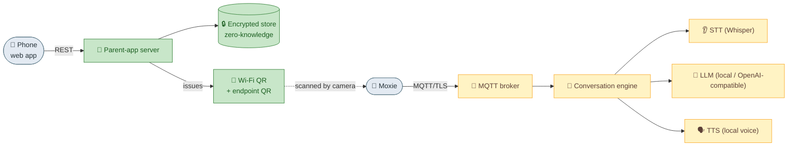

# Architecture overview

## The problem
A Moxie robot needed two separate internet services to work. Embodied ran both; both are gone.
This project replaces both, locally.

## Two independent channels

```
        REST / HTTPS                                   MQTT / TLS
 phone ───────────────► Parent-app server        Moxie ───────────────► MQTT broker
 (web app)              (client-service-*)        (robot)                (IoT endpoint)
   account, child,       ◄── this repo, Phase 1     conversations,        ◄── this repo, Phase 2–3
   pairing, Wi-Fi,           server/ + tools/        activities, STT/         mqtt/ + ai/
   robot settings                                    LLM/TTS ("talking")
```

These never talked to each other directly at Embodied, and they don't here either. They meet only
at two points: the **pairing QR** (the app hands the robot Wi-Fi + a key) and the shared **account
identity** (which child/robot a conversation belongs to).

### Channel 1 — Parent app (the "control plane")
Pure REST to `client-service-api.embodied.com`. No MQTT, no websockets, no realtime SDK. It handles
account, child profiles, pairing-QR issuance, Wi-Fi provisioning, robot settings, insights display,
and E2E-encrypted backups. **Reimplemented in `server/` (Phase 1, working).**

### Channel 2 — Robot cloud (the "experience")
The robot connects to an MQTT/IoT broker for the live experience — speech in, LLM reasoning, behavior
markup, speech out, activities. This is what makes Moxie *Moxie*. **Being built in `mqtt/` + `ai/`
(Phases 2–3);** the community's OpenMoxie proves the approach.

## Data flow at a glance



## Components (all on one machine)

| Component | Dir | Role |
|-----------|-----|------|
| Parent-app server | `server/` | REST API + mobile web client; issues QR codes; stores account/child/robot |
| Pairing tools | `tools/pairing/` | Clean-room QR codec + CLI |
| MQTT broker | `mqtt/` | TLS :8883 endpoint the robot connects to (self-signed CA; works on firmware 803) |
| Conversation engine | `mqtt/` | Turns robot audio → text → LLM → behavior markup → speech |
| Local AI | `ai/` | STT (Whisper), LLM (any OpenAI-compatible endpoint), TTS — local first |

## The build contracts — what to implement, in order

Those components are built from **six versioned, standalone specs** (this folder). They chain in
runtime order — build them roughly in this sequence, each usable once the ones above it exist:

| # | Contract | Builds | Chains to |
|--:|---|---|---|
| 1 | [`rest-api-contract.md`](rest-api-contract.md) | Channel 1: account/child/pairing REST → issues the pairing QR | sets `iot-endpoint` → #2 |
| 2 | [`mqtt-and-conversation.md`](mqtt-and-conversation.md) | Channel 2: the broker, endpoint QR, topics, the turn loop | carries #3–#5 |
| 3 | [`config-and-telemetry-contract.md`](config-and-telemetry-contract.md) | `/config` down + `/state`/telemetry up (the parent console's data model) | the robot is now managed |
| 4 | [`ai-seam.md`](ai-seam.md) | the STT / brain-RemoteChat / TTS interface any AI fills | answers each turn on #2 |
| 5 | [`content-module-contract.md`](content-module-contract.md) | the activity/volley format — what Moxie *does* | the brain's per-turn logic, on #4 |
| 6 | [`sim-as-a-client.md`](sim-as-a-client.md) | the SIM as a drop-in client of #1–#5 | test surface = production surface |

Minimum talking loop = **#1 → #2 → #4** (pair, connect, answer a turn). Add #3 for the parent
console, #5 for real activities, #6 to develop against the sim instead of hardware. Each contract
reads standalone and cites the [reverse-engineering study](../reverse-engineering/README.md) for its facts.

## The appliance
The whole stack targets **one machine with a CUDA GPU** — a gaming PC, a home server, or a Jetson
Orin. The control plane (parent-app server + web UI) is light and cross-platform; the AI layer wants
a GPU. Everything runs offline; an OpenAI-compatible endpoint is an optional LLM fallback, never a
dependency.

## Data & privacy
The original app **end-to-end encrypts** all child PII: one 32-byte seed (derived from the recovery
phrase) is the symmetric key, and the server only ever stores opaque ciphertext and sealed copies of
the seed. We preserve that exactly — the server is **zero-knowledge**, and the owner holds the keys.
See [`../reverse-engineering/crypto-and-keys.md`](../reverse-engineering/phone/crypto-and-keys.md).

---
📖 [Docs index](../README.md) · [Architecture: revival path →](revival-path.md)
