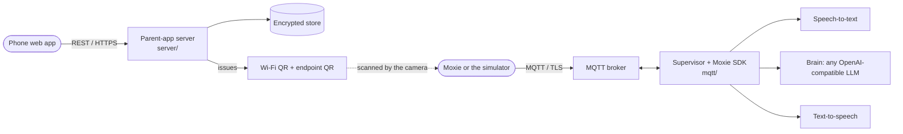

# Architecture overview

## The problem

A Moxie robot depended on two separate internet services. Embodied ran both, and both are gone. This
project replaces both, on a machine you own.

## Two independent channels

```mermaid
flowchart LR
    phone(["Phone web app"]) -->|"REST / HTTPS"| server["Parent-app server<br/>server/"]
    server --> db[("Encrypted store")]
    server -->|"issues"| qr["Wi-Fi QR + endpoint QR"]
    qr -.->|"scanned by the camera"| robot(["Moxie or the simulator"])
    robot -->|"MQTT / TLS"| broker["MQTT broker"]
    broker <--> sup["Supervisor + Moxie SDK<br/>mqtt/"]
    sup --> stt["Speech-to-text"]
    sup --> llm["Brain: any OpenAI-compatible LLM"]
    sup --> tts["Text-to-speech"]
```

The channels never talk to each other directly. They meet at two points: the **pairing QR** (the phone
hands the robot Wi-Fi details and a key) and the shared **account identity** (which child and robot a
conversation belongs to).

**Channel 1 — the parent app (control plane).** Plain REST to `client-service-api.embodied.com`:
account, child profiles, pairing QR, Wi-Fi provisioning, robot settings, insights and encrypted
backups. Reimplemented in `server/`.

**Channel 2 — the robot cloud (the experience).** The robot connects to an MQTT broker for everything
live: speech in, the brain's reply, behavior markup, speech out, activities. Reimplemented in `mqtt/`.

The backend speaks only the reverse-engineered protocol, so the **simulator and a real robot are
interchangeable clients** ([sim as a client](sim-as-a-client.md)). Everything is exercised against the
simulator in CI; no physical robot has yet connected to this broker.

## Components

| Component | Where | Role |
|---|---|---|
| Parent-app server and console | `server/` | REST API, phone web app, parent console; issues QR codes; stores accounts, children and robots |
| Pairing tools | `tools/pairing/` | QR codec and command-line tools |
| MQTT broker | `mqtt/broker/` | Mosquitto on TLS `8883`, per-appliance CA, per-robot ACL |
| Supervisor | `mqtt/supervisor/` | Speaks Moxie's protocol: connect detection, config push, conversation turns, permit list |
| Moxie SDK | `mqtt/moxie_sdk/` | The brain interface (`MoxieApp`), speech in and out, markup, content modules, memory, safety |
| Simulator | `sim/` | Browser 3D Moxie and a virtual robot for tests |
| Hosted demo | `functions/`, `sim/web/` | The static site on Cloudflare Pages with an optional live brain |

## The build contracts

The components are built from six standalone specs in this folder. In runtime order:

| # | Contract | Builds |
|--:|---|---|
| 1 | [`rest-api-contract.md`](rest-api-contract.md) | Account, child and pairing REST; issues the pairing QR |
| 2 | [`mqtt-and-conversation.md`](mqtt-and-conversation.md) | The broker, endpoint QR, topics, and the turn loop |
| 3 | [`config-and-telemetry-contract.md`](config-and-telemetry-contract.md) | `/config` down, `/state` and telemetry up: the console's data model |
| 4 | [`ai-seam.md`](ai-seam.md) | The speech-to-text, brain and text-to-speech interface any AI fills |
| 5 | [`content-module-contract.md`](content-module-contract.md) | Activities: what Moxie does, turn by turn |
| 6 | [`sim-as-a-client.md`](sim-as-a-client.md) | The simulator as a drop-in client of 1–5 |

The minimum talking loop is 1 → 2 → 4 (pair, connect, answer a turn). Add 3 for the parent console,
5 for activities, and 6 to develop without hardware. For writing your own brain, see
[Moxie as a platform](moxie-as-a-platform.md).

## Where it runs

One machine on your home network. The control plane is light (a Raspberry Pi 4/5 runs it with a
gateway for speech); fully local speech and models want a GPU box such as a gaming PC or a Jetson Orin.
The brain is whatever OpenAI-compatible endpoint you configure, local or hosted.

## Data and privacy

The original app end-to-end encrypts all child data: a 32-byte seed derived from the recovery phrase is
the key, and the server stores only ciphertext and sealed copies of the seed. The parent-app server
keeps that design, so it cannot read the child data it stores; the owner holds the keys
([crypto and keys](../reverse-engineering/phone/crypto-and-keys.md)). What the robot cloud keeps
(conversation memory, telemetry) stays on your machine and is governed by the `LoggingPolicy` privacy
setting ([config and telemetry](config-and-telemetry-contract.md)).

---
[Architecture index](README.md) · [Revival path](revival-path.md)
