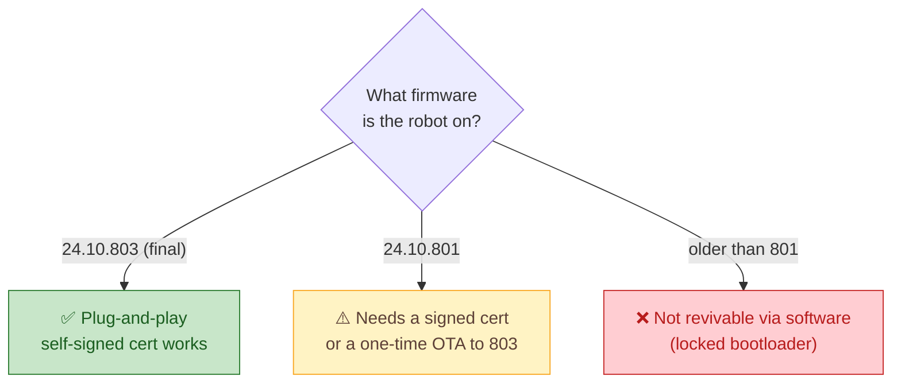

# 🧭 The revival path

How a specific, powered-on Moxie goes from bricked to alive — with **no teardown and no serial
cable**, using only camera QR codes. This is the decision tree.

## 1. Check the firmware gate first

Moxie's cloud endpoints are compiled into the firmware and its TLS is peer-verified, so you can't
just redirect DNS. Embodied shipped the escape hatch in the final updates:



| Firmware | Custom endpoint? | Cert requirement | Home box? |
|----------|------------------|------------------|-----------|
| **24.10.803** (final, Jan 2025) | yes | honors `disable_verify` → **self-signed OK** | ✅ plug-and-play |
| **24.10.801** (Oct 2024) | yes | needs a **publicly-signed** cert | ⚠️ with a real cert, or the 801→803 OTA |
| older than 801 | no | — | ❌ not via software |

The firmware even contains an `IOTEndpoint` enum value literally named `OPEN_MOXIE` (= 11) — Embodied
added first-class support for a community server before shutting down.

## 2. The QR sequence

A Moxie in setup mode is a QR reader. Reviving it is a short sequence of codes held to its camera:

```mermaid
sequenceDiagram
    participant You as 📱 You (web app)
    participant Moxie as 🤖 Moxie
    participant Box as 🖥️ Your server
    Note over Moxie: In pairing mode (QR reader)
    You->>Moxie: 1️⃣ Wi-Fi QR ("PA"+protobuf)
    Note over Moxie: joins your Wi-Fi ✅
    Moxie-->>You: waits for a 2nd, different QR
    You->>Moxie: 2️⃣ Endpoint QR ({"debug":{"om"}})
    Moxie->>Box: 3️⃣ MQTT connect (TLS :8883)
    Box-->>Moxie: config + "paired"
    Note over Moxie: 🗣️ talks, via your local models
```

### Step 1 — Wi-Fi QR ✅
`"PA" + Base64(protobuf)` carrying SSID, password, band, and the pairing seed. Generated by our
parent-app web UI / `tools/pairing`. **Verified against real hardware — a Moxie scanned ours and
joined the network.** Format: [`../reverse-engineering/qr-format.md`](../reverse-engineering/qr-format.md).

After this, a firmware-801/803 robot joins Wi-Fi and **waits for a second, different-looking QR** —
the endpoint code, not another Wi-Fi code.

### Step 2 — Endpoint QR 🔨
Plain JSON (no prefix): `{"debug":{"command":"om","param":"<base64 ServiceConfiguration2>"}}`, where
`ServiceConfiguration2` sets `gcp_project` (shortened to `"o"` for QR density), `mqtt_host` = your box,
`override_port` = 8883, `disable_verify` = true. A real one is tiny — ~73 chars, e.g.:

```
{"debug": {"command": "om", "param": "CgFvQgwxOTIuMTY4LjEuNTBYs0VgAQ=="}}
```

This permanently repoints the robot at your MQTT broker. Generated by `mqtt/` (Phase 2). Full schema:
[`mqtt-and-conversation.md`](mqtt-and-conversation.md).

### Step 3 — Connect & talk 🔨
The robot opens MQTT/TLS to your broker (self-signed CA works on 803), the server pushes its config
and marks it paired, and conversations flow: **audio → STT → LLM → behavior markup → the robot
speaks** (Moxie synthesizes its own voice on-device). Built in `mqtt/` + `ai/` (Phases 2–3).

## If you're on 24.10.801
You need either a publicly-signed cert on your MQTT broker (e.g. Let's Encrypt + a domain) or the
801→803 OTA. Also pre-seed a valid-looking Google service-account JSON to avoid a known Wi-Fi-app
crash loop. Details and community links: [`../community-research.md`](../community-research.md).

## No teardown required
This whole path is camera-QR only. ADB access to the robot's filesystem exists (for reading its
identity keys) but is **not needed** for a normal setup — we deliberately avoid disassembly and
serial access. Robot-side facts: [`../../hardware/README.md`](../../hardware/README.md).

---
📖 [Docs index](../README.md) · [← Architecture overview](overview.md) · [MQTT & conversation spec →](mqtt-and-conversation.md)
