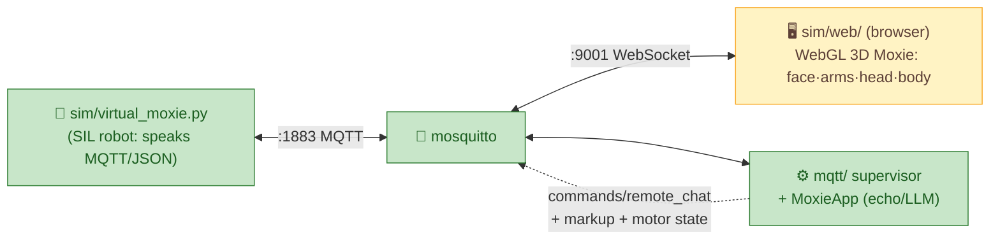

# 🕹️ SIL simulator, web UI & the 1-week delivery plan

> **Goal.** A **software-in-the-loop (SIL) Moxie** you can watch in a browser — face, arms, head, body
> moving — driven by the **exact protocol reverse-engineered from firmware v3.6.4-Zephyr / OTA
> v24.10.803**, wired to our MQTT server, tested in CI. No robot hardware required. Built and delivered
> over ~1 week by a **layered set of session timers**.

## What is (and isn't) simulated — honest scope

We do **not** boot the RK3288 Android `system.img`: it expects vendor HALs for hardware that doesn't
exist off-robot (DLP projector, XMOS DSP, Lizard MCU, cameras) plus AVB. That path is a dead end for a
sim. Instead:

| Layer | Approach | Status |
|---|---|---|
| **Protocol** (MQTT topics, JSON envelopes, JWT) | A **virtual robot** that speaks it exactly ([`sim/virtual_moxie.py`](../../sim/virtual_moxie.py)) | ✅ working — round-trips against the real [`mqtt/`](../../mqtt/) supervisor |
| **Behavior** (`<mark cmd:…>` markup, moods, gestures) | `sim/web/bridge.js` parses the marks → drives face + arm gestures | 🟡 wired (D3 refining) |
| **Motion** (arms/head/body DOF) | Drive a **WebGL (three.js) 3D Moxie** from the `libmotionlib` motor indices ([hardware-map](../reverse-engineering/hardware-map.md#native-motion-api-factory-libmotionlib--liblizardjni)) | 🟢 model+rig+API + live bus bridge |
| **Face** (DLP expressions/visemes) | Render the animated face to a canvas **texture on the face-screen mesh**, from TTS marks + mood verbs | 🟡 canvas face + 6 expressions built; wire to `EmotionState` next |
| **Component golden-tests** (optional, later) | Run specific ARM `.so` (`libchatscript`) under **qemu-user** for reference outputs | ⏸ backlog |

### Visual reference — the 3D model (from the FCC external photos)

So the model is buildable from repo facts even if the photos vanish, Moxie's real appearance
([R1‑EXT], [fcc-teardown](../reverse-engineering/fcc-teardown.md)):

- **Silhouette:** a single **teardrop/egg body** (wide rounded base, tapering to a rounded point at the
  **top-rear**) — head and body are one continuous form, gently leaning forward. **~15 in (≈38 cm) tall**
  by the ruler in the photo.
- **Colour:** **teal / turquoise** matte shell (hex ≈ `#3BB6B0`), with **lighter teal arms** and a **black
  rubber ring** around the base edge.
- **Face:** a **tilted oval face-screen** on the front upper body — an **off-white / warm-grey fresnel
  panel** (`≈ #E8E4D8`) angled up ~15–20°; the animated DLP face is projected onto it (in the sim: a
  canvas texture on this oval mesh).
- **Arms:** **two short paddle arms** low on the sides, lighter teal — each a **two-segment limb** with
  **2 DOF**: a **shoulder** that bends the whole arm **up/down** (`L/R ARM UP/DN`) and an **elbow** that
  bends the forearm **in/out** (`L/R ARM IN/OUT`) — see the [motor map](../reverse-engineering/hardware-map.md).
  Rig as upper-arm + forearm so the elbow visibly folds, not a single rigid paddle.
- **Base:** a **circular disc base** (~7 in dia) with the `moxie` wordmark; the body rotates on it
  (`BODY L/R`) and leans (`BODY F/B`).
- **Details:** speaker grille low-front; a small chest/"heart" LED (`HRT LED`).

three.js build: primitives first (a lathed teardrop body, an angled ellipse face plane, two capsule
arms, a cylinder base), grouped so each `libmotionlib` DOF maps to a node's rotation. A sculpted GLTF
can replace the primitives later without changing the motor→node wiring.

> **Modeling & look → Fable 5.** The 3D model, materials, face art, and overall visual polish are
> delegated to **Fable 5** subagents (`Agent(model: "fable")`); the build timer spawns one for each
> UI/appearance milestone (D2–D5), while the main loop keeps the protocol/motor **wiring** correct so
> the look and the mechanics stay decoupled.

The **firmware is the contract, not the runtime.** Everything the sim does is validated against the
recovered protocol docs, so "it works in the sim" means "it will work on a real re-homed robot."

## Architecture



The browser subscribes (MQTT-over-WebSocket) to the same topics the robot sees, so the avatar animates
from the **real** `remote_chat` replies + behavior markup + motor commands — it's a window into the live
bus, not a mock.

## The 1-week roadmap (drives the build timer)

Each day = one shippable milestone. The build loop picks the next unchecked item.

- [x] **D1 — Protocol SIL + CI.** `virtual_moxie.py` round-trip (state→config(paired)→remote-chat→reply);
  `sim/run_smoke.sh`; GitHub Actions (`.github/workflows/ci.yml`: doc-links + proto + SIL smoke). ✅
- [x] **D2 — 3D Moxie + bus to the browser.** ✅ WebGL 3D Moxie (`sim/web/`, three.js r160, Fable 5):
  teal teardrop shell, oval canvas face, two-segment arms, 7-DOF rig on the `libmotionlib` indices,
  `window.moxie` API + control panel. ✅ **Live bus**: broker `listener 9001 / websockets` +
  `sim/web/bridge.js` (MQTT.js) subscribes `/devices/+/commands/remote_chat` and drives the avatar —
  verified end-to-end (WS client receives a supervisor reply over `:9001`). ✅ **three.js + mqtt.js
  vendored** in `sim/web/vendor/` — the sim runs with **no network/CDN** (self-sufficiency).
- [~] **D3 — Behavior markup → animation.** ✅ `bridge.js` parses `<mark cmd:…>` — full `Gesture_*` set +
  `Bht_*` behaviour-trees (Wing_Flap/Sleep/Idle_Curious/…) → whole-body poses, `playback-mood` → face
  (evidence-based mood map), text → speech bubble. ⏳ remaining: **`icons-v2` badges** on the face
  (Fable, in progress).
- [ ] **D4 — Motion from motor state.** Virtual robot publishes motor positions (the 7 `libmotionlib`
  DOFs); the UI animates arms/head/body from them. Sliders to drive motors manually.
- [ ] **D5 — Face expressions + visemes.** Render expressions from mood + simple visemes from the spoken
  text; conversation transcript panel.
- [~] **D6 — Scenarios + record/replay.** ✅ started: `sim/scenarios/*.json` scripted conversations +
  `virtual_moxie.py --scenario` + `sim/run_scenarios.sh` (in CI); `basic.json` runs 4/4 turns. ⏳ remaining:
  record a live session and replay into the UI; LLM-app scenarios.
- [ ] **D7 — Package + deliver.** `docker-compose up` = broker + supervisor + web UI + virtual robot;
  screenshots/gif in the README; final docs pass; tag a release.

Progress is tracked here (check items off) and mirrored in `work/firmware-re/progress/PLAN.md`.

## The layered session timers

Three cadences run this campaign. They are **session-local crons** (they fire prompts into the running
Claude Code session, which has the repo + docker + git) — so they progress while this session is alive,
exactly like the existing `/loop`. (Durable cloud schedules can't touch the local repo, so they're not
used for the build itself.) Session crons **auto-expire after 7 days** — which is exactly the delivery
window; re-arm them if the campaign runs longer.

| Tier | Cadence | Job | Prompt intent |
|---|---|---|---|
| **① Build** | hourly (`:13`) | Implement the next roadmap item | "Pick the next unchecked D-item in sil-and-cicd.md, build it, run `sim/run_smoke.sh`, commit, push, check the item off." |
| **② Test** | every 3 h (`:37`) | Guard quality | "Run the SIL smoke + CI checks; expand `sim/scenarios`; verify the web UI renders; fix any regression; report." |
| **③ Plan/Audit** | every 12 h (`:23`) | Keep it coherent & honest | "Run `work/firmware-re/progress/SELF-AUDIT.md`; review this roadmap; keep docs↔code↔protocol consistent; post a status summary." |

The **existing RE/deconstruction `/loop`** continues in parallel as the "research" tier — it feeds new
protocol facts that the build tier consumes. All tiers share `PLAN.md` + this roadmap as the source of
truth, so they don't collide: each reads state, does the smallest useful increment, and records it.

> **If this session closes:** the timers stop (they're session-local). Restart them by re-running the
> `/loop` prompts, or keep the session open for the week. A future option is to move the *research* tier
> to a durable cloud schedule while keeping *build/test* local.

## Run it now

```sh
# one-shot local proof (broker + supervisor + virtual robot):
bash sim/run_smoke.sh
# → ✅ SIL round-trip OK — state→config(paired)→remote-chat→reply
```

---
📖 [MQTT server](../../mqtt/) · [Cloud protocol](../reverse-engineering/cloud-protocol.md) · [Behavior markup](../reverse-engineering/behavior-markup.md) · [Hardware map](../reverse-engineering/hardware-map.md) · [Roadmap](../../ROADMAP.md)
