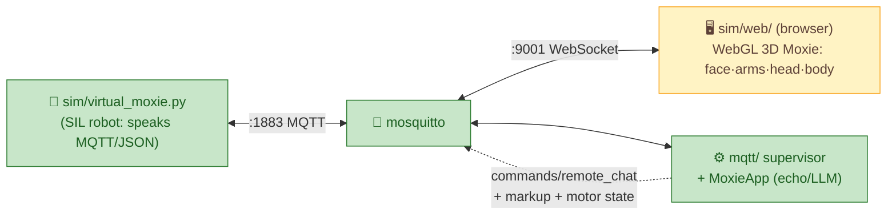

# 🕹️ SIL simulator, web UI & the 1-week delivery plan

> **Goal.** A **software-in-the-loop (SIL) Moxie** you can watch in a browser — face, arms, head, body
> moving — driven by the **exact protocol reverse-engineered from firmware v3.6.4-Zephyr / OTA
> v24.10.803**, wired to our MQTT server, tested in CI. No robot hardware required. Built and delivered
> over ~1 week by a **layered set of session timers**.

## What is (and isn't) simulated — honest scope

We do **not** boot the RK3288 Android `system.img`: it expects vendor HALs for hardware that doesn't
exist off-robot (DLP projector, XMOS DSP, Lizard MCU, cameras) plus AVB. That path is a dead end for a
sim. Instead:

| Layer | Approach | Status |
|---|---|---|
| **Protocol** (MQTT topics, JSON envelopes, JWT) | A **virtual robot** that speaks it exactly ([`sim/virtual_moxie.py`](../../sim/virtual_moxie.py)) | ✅ working — round-trips against the real [`mqtt/`](../../mqtt/) supervisor |
| **Behavior** (`<mark cmd:…>` markup, moods, gestures) | `sim/web/bridge.js` parses the marks → drives face + arm gestures | 🟡 wired (D3 refining) |
| **Motion** (arms/head/body DOF) | Drive a **WebGL (three.js) 3D Moxie** from the `libmotionlib` motor indices ([hardware-map](../reverse-engineering/hardware-map.md#native-motion-api-factory-libmotionlib--liblizardjni)) | 🟢 model+rig+API + live bus bridge |
| **Face** (DLP expressions/visemes) | Render the animated face to a canvas **texture on the face-screen mesh**, from TTS marks + mood verbs | 🟢 6 expressions + mood-driven + icons-v2 badges |
| **Component golden-tests** (optional, later) | Run specific ARM `.so` (`libchatscript`) under **qemu-user** for reference outputs | ⏸ backlog |

### Visual reference — the 3D model (from the FCC external photos)

So the model is buildable from repo facts even if the photos vanish, Moxie's real appearance
([R1‑EXT], [fcc-teardown](../reverse-engineering/fcc-teardown.md)):

**Moxie is a two-part robot: a distinct HEAD sitting on top of a separate cylindrical BODY** — NOT one
continuous teardrop. **~15 in (≈38 cm) tall.**

- **Body:** an upright **cylinder** (softly rounded), teal `#3BB6B0`, sitting on a circular disc base.
  The **speaker grille is low on the front of the body** (stays at the bottom). The body **turns** on
  the base (`BODY L/R` = yaw) and **leans** forward/back (`BODY F/B`).
- **Head:** a **separate rounded head on top of the body**, clearly distinct from it (a visible neck/gap,
  not blended). The head **tilts forward/back** (`HEAD UP/DN`). The **face lives on the head** (moved up
  from the body).
- **Face:** the animated face-screen is on the **front of the head** — a **flat/near-flat DISK**
  (a shallow round pane), **not a cone or a domed bulge**; it sits nearly flush in the head. It's a
  **glowing DLP projector**, not a dull panel. Render it as an **emissive, glowing** surface (bloom/light-emitting,
  WebGL lighting) so the face literally casts light; eyes/brows/mouth glow. In a dark scene the face
  should be the light source.
- **Scene lighting is adjustable:** expose a control to dim the whole scene from lit → dark; when dark,
  **Moxie's projected face glows** and lights its surroundings. (Fable: expose e.g.
  `window.moxie.setSceneLight(0..1)`; the HUD adds a slider.)
- **Camera / forehead:** the camera is a **small lens** set into the head **above the face** — it is
  **NOT** a massive black band/visor. Keep the dark area **subtle and small** (a slim recessed strip or
  just the lens itself), the same teal shell elsewhere.
- **Arms:** **two half-cylinder arms on the OUTSIDE of the body** (curved shells hugging the body sides),
  lighter teal — each a **two-segment limb, 2 DOF**: a **shoulder** bending the arm **up/down**
  (`L/R ARM UP/DN`) and an **elbow** bending the forearm **in/out** (`L/R ARM IN/OUT`); the elbow visibly
  folds. See the [motor map](../reverse-engineering/hardware-map.md).
- **Arm width is CONSTANT:** the **upper arm, forearm, and hand are all the same width** — a
  uniform-width curved shell from shoulder to tip. No tapering.
- **Hands:** the arm ends in a **hand** in a **lighter blue** — the **same width as the arm** (the
  rounded lighter-blue end of that same shell), **not a narrow pill/capsule** stuck on the end.
- **Ears:** **small recessed oval cutouts on the left & right sides of the HEAD** — mic inputs. They're
  an **extruded/flush cut** (a darker inset oval), **nothing sticking out**.
- **Heart LED:** on the **body front, high on the chest just under the head**: a **thin white
  horizontal line with a TINY white heart beneath it** — a small, delicate light indicator, **not** a
  big black/solid heart shape.
- **Base:** circular disc base with a **black rubber ring**; `moxie` wordmark.

Rig (each `libmotionlib` DOF → one node): `bodyYaw(5) → bodyLean(6) → { head(4)→face+forehead-cam ;
shoulderL(0)→elbowL(1)→handL ; shoulderR(2)→elbowR(3)→handR }`. Body cylinder + separate head group so
the neck/gap is real; arms as half-cylinder shells on the body exterior. Primitives first; a sculpted
GLTF can replace them later without changing the motor→node wiring.

> ⚠️ **The current `sim/web/moxie.js` model is a single teardrop with the face on the body — this is
> wrong and is being redone by Fable 5 to match the above** (separate cylinder body + head, forehead
> camera, half-cylinder arms, single-finger hands).

> **Modeling & look → Fable 5.** The 3D model, materials, face art, and overall visual polish are
> delegated to **Fable 5** subagents (`Agent(model: "fable")`); the build timer spawns one for each
> UI/appearance milestone (D2–D5), while the main loop keeps the protocol/motor **wiring** correct so
> the look and the mechanics stay decoupled.

The **firmware is the contract, not the runtime.** Everything the sim does is validated against the
recovered protocol docs, so "it works in the sim" means "it will work on a real re-homed robot."

## Architecture



The browser subscribes (MQTT-over-WebSocket) to the same topics the robot sees, so the avatar animates
from the **real** `remote_chat` replies + behavior markup + motor commands — it's a window into the live
bus, not a mock.

## Design language

All web UI follows the **[valpatel.com-derived style guide](../design/style-guide.md)** — a dark
robot **telemetry/mission-control HUD** (void `#0a0a0f`, neon-cyan `#00f0ff` accents, Inter +
JetBrains Mono, mono-labels-on-dark). Fonts are vendored (offline). The functional milestones below
(D1–D7) are complete; a **design/depth pass (D8)** re-skins the SIL into the control-room aesthetic and
is ongoing — "feature-complete" is not "done", the look matters.

- [~] **D8 — Control-room redesign.** Apply the style guide deeply to `sim/web/` (and the server UI):
  Moxie in the void, HUD panels, telemetry gauges, comms-log transcript, live indicators. In progress
  (Fable 5). Then: phoneme visemes, screenshots/gif, release tag.

## The 1-week roadmap (drives the build timer)

Each day = one shippable milestone. The build loop picks the next unchecked item.

- [x] **D1 — Protocol SIL + CI.** `virtual_moxie.py` round-trip (state→config(paired)→remote-chat→reply);
  `sim/run_smoke.sh`; GitHub Actions (`.github/workflows/ci.yml`: doc-links + proto + SIL smoke). ✅
- [x] **D2 — 3D Moxie + bus to the browser.** ✅ WebGL 3D Moxie (`sim/web/`, three.js r160, Fable 5):
  teal teardrop shell, oval canvas face, two-segment arms, 7-DOF rig on the `libmotionlib` indices,
  `window.moxie` API + control panel. ✅ **Live bus**: broker `listener 9001 / websockets` +
  `sim/web/bridge.js` (MQTT.js) subscribes `/devices/+/commands/remote_chat` and drives the avatar —
  verified end-to-end (WS client receives a supervisor reply over `:9001`). ✅ **three.js + mqtt.js
  vendored** in `sim/web/vendor/` — the sim runs with **no network/CDN** (self-sufficiency).
- [x] **D3 — Behavior markup → animation.** `bridge.js` parses `<mark cmd:…>` — full `Gesture_*` set +
  `Bht_*` behaviour-trees (Wing_Flap/Sleep/Idle_Curious/…) → whole-body poses, `playback-mood` → face
  (evidence-based mood map), text → speech bubble, and **`icons-v2` → face badges** (School/Birthday/
  Medical/Heart glyphs drawn on the face canvas, Fable 5) with show(cmd 0)/clear(cmd 2).
- [x] **D4 — Motion from motor state.** ✅ hand sliders (D2) + a **SIL-only motor channel**:
  `/devices/<id>/commands/motor` `{motors:{idx:val}}` → `bridge.js` → the rig animates the 7
  `libmotionlib` DOFs over the bus. `virtual_moxie.py` scenarios can carry `motors` turns
  ([`scenarios/motion.json`](../../sim/scenarios/motion.json)); unit-tested. ⚠️ sim-only — the real
  robot's motion is markup-driven on-device, not a cloud motor stream.
- [~] **D5 — Face expressions + visemes + transcript.** ✅ 6 expressions + mood-driven face (D3);
  ✅ **conversation transcript panel** — `bridge.js` subscribes to `events/remote-chat` (child) +
  `commands/remote_chat` (Moxie) and renders both sides in a scrolling panel; basic talking-mouth viseme
  during speech. ⏳ optional: phoneme-accurate viseme mouth shapes.
- [x] **D6 — Scenarios + record/replay.** ✅ `sim/scenarios/*.json` + `virtual_moxie.py --scenario`/
  `--loop-seconds` + `sim/run_scenarios.sh` (in CI). ✅ **record/replay**: `bridge.js` records live bus
  events and replays them (with original timing) through the same handlers — Record/Save/Load/**Play
  demo** buttons; ships a canned `sim/web/sessions/demo.json` (a birthday exchange) that replays the 3D
  Moxie **with no broker**.
- [x] **D7 — Package + deliver.** `docker compose -f sim/docker-compose.yml up` = broker + supervisor +
  web UI (+ `--profile demo` virtual robot); [`sim/README.md`](../../sim/README.md) one-command run.
  Compose config validated; loop-replay verified. ⏳ optional polish: screenshots/gif, release tag.

Progress is tracked here (check items off) and mirrored in `work/firmware-re/progress/PLAN.md`.

## The layered session timers

Three cadences run this campaign. They are **session-local crons** (they fire prompts into the running
Claude Code session, which has the repo + docker + git) — so they progress while this session is alive,
exactly like the existing `/loop`. (Durable cloud schedules can't touch the local repo, so they're not
used for the build itself.) Session crons **auto-expire after 7 days** — which is exactly the delivery
window; re-arm them if the campaign runs longer.

| Tier | Cadence | Job | Prompt intent |
|---|---|---|---|
| **① Build** | hourly (`:13`) | Implement the next roadmap item | "Pick the next unchecked D-item in sil-and-cicd.md, build it, run `sim/run_smoke.sh`, commit, push, check the item off." |
| **② Test** | every 3 h (`:37`) | Guard quality | "Run the SIL smoke + CI checks; expand `sim/scenarios`; verify the web UI renders; fix any regression; report." |
| **③ Plan/Audit** | every 12 h (`:23`) | Keep it coherent & honest | "Run `work/firmware-re/progress/SELF-AUDIT.md`; review this roadmap; keep docs↔code↔protocol consistent; post a status summary." |

The **existing RE/deconstruction `/loop`** continues in parallel as the "research" tier — it feeds new
protocol facts that the build tier consumes. All tiers share `PLAN.md` + this roadmap as the source of
truth, so they don't collide: each reads state, does the smallest useful increment, and records it.

> **If this session closes:** the timers stop (they're session-local). Restart them by re-running the
> `/loop` prompts, or keep the session open for the week. A future option is to move the *research* tier
> to a durable cloud schedule while keeping *build/test* local.

## Run it now

```sh
# one-shot local proof (broker + supervisor + virtual robot):
bash sim/run_smoke.sh
# → ✅ SIL round-trip OK — state→config(paired)→remote-chat→reply
```

---
📖 [MQTT server](../../mqtt/) · [Cloud protocol](../reverse-engineering/cloud-protocol.md) · [Behavior markup](../reverse-engineering/behavior-markup.md) · [Hardware map](../reverse-engineering/hardware-map.md) · [Roadmap](../../ROADMAP.md)
