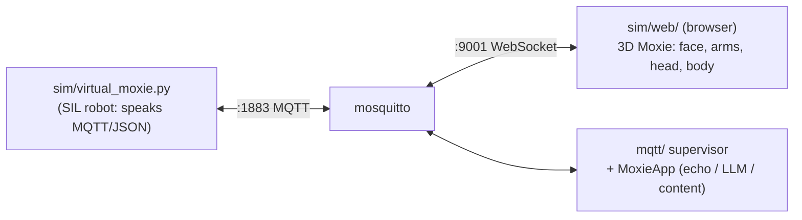

# SIL simulator and CI

The **software-in-the-loop (SIL) simulator** is a virtual Moxie you can watch in a browser (face,
arms, head, body) driven by the exact protocol recovered from firmware v3.6.4-Zephyr / OTA
v24.10.803 and wired to our MQTT backend. This page covers what it simulates, how it is built, and
the CI tiers that test it. How to run it: [`sim/README.md`](../../sim/README.md). Workflow details:
[`sim/ci/README.md`](../../sim/ci/README.md).

## What is (and isn't) simulated — honest scope

We do **not** boot the robot's RK3288 Android image: it needs vendor HALs for hardware that does not
exist off-robot (DLP projector, XMOS DSP, Lizard MCU, cameras) plus verified boot. Instead:

| Layer | Approach | Status |
|---|---|---|
| **Protocol** (MQTT topics, JSON envelopes) | A virtual robot that speaks it exactly ([`sim/virtual_moxie.py`](../../sim/virtual_moxie.py)) | Works; round-trips against the real [`mqtt/`](../../mqtt/) supervisor |
| **Behavior** (`<mark cmd:…>` markup, moods, gestures, `Bht_*` trees, `icons-v2`) | [`sim/web/bridge/`](../../sim/web/bridge/) parses the marks and drives face and arms | Works |
| **Motion** (7 DOFs) | A WebGL (three.js) Moxie rigged on the `libmotionlib` motor indices ([hardware map](../reverse-engineering/hardware/hardware-map.md#native-motion-api-factory-libmotionlib-liblizardjni)) | Works; hand sliders plus a SIL-only `/devices/<id>/commands/motor` channel |
| **Face** | An animated canvas texture on the face mesh, driven by mood and TTS marks | Works; expressions, mood, icon badges, a basic talking mouth |
| **Voice** | Plays the server's `CloudTTSResponse` (`commands/tts`) through Web Audio | Works |
| **Component goldens** | Run ARM `.so` files (e.g. `libchatscript`) under qemu-user | Not started |

The **firmware is the contract, not the runtime**: the sim is validated against the recovered protocol,
so behavior proven here should hold on a re-homed robot. Two caveats: the SIL-only motor channel does
not exist on a real robot (its motion is markup-driven on-device), and no physical robot has yet run
our markup. See [SIM as a client](sim-as-a-client.md) for where the sim and a robot differ.

### Visual reference: the 3D model (from the FCC external photos)

Written down so the model can be rebuilt from repo facts alone
([fcc-teardown](../reverse-engineering/hardware/fcc-teardown.md)).

- **Two parts:** a distinct **head** on a separate cylindrical **body**, about 15 in (38 cm) tall,
  teal `#3BB6B0`, on a circular disc base with a black rubber ring and a `moxie` wordmark.
- **Body:** an **upper chest** (arms and heart LED), slightly wider and overhanging a **lower chest**
  (speaker grille, low on the front), with a crisp shadowed step between them. The body turns on the
  base (yaw) and leans forward/back; the lean pivot is at the chest seam, so the lower chest stays
  planted.
- **Neck:** short and wide, sized so a full head tilt clears the chest.
- **Head:** wider than tall (radii about x 0.66, y 0.60, z 0.63), rounded with a slightly pointed top.
  It tilts forward/back.
- **Face:** a flat, **matte**, glowing DLP screen filling most of the head front, running up to a
  **small** camera lens at the top (not a dark visor). The glow comes from the drawn features
  (emissive map), never an overlay in front of the pane; expressions must stay crisp at every
  `setSceneLight` level. Symbols draw as a large square panel over the eyes with the face dimmed;
  `sleep` closes the eyes to arcs.
- **Scene light:** adjustable (`window.moxie.setSceneLight(0..1)`); in the dark, the face lights its
  surroundings.
- **Arms:** two uniform-width half-cylinder shells on the outside of the body, lighter-blue hands of
  the same width. Each arm has a **shoulder** (up/down) and an **elbow** that folds flat in-plane.
  Shoulders are out-only on the in/out axis (rest at 0, against the side).
- **The elbow is a spring, not a motor:** its fold is derived from the shoulder's out/in angle
  (motors 1/3). Against the body the forearm is pushed straight; as the arm swings out the spring
  closes it, reaching maximum fold at `13064`, smoothstepped so there is no jump
  ([evidence](../reverse-engineering/hardware/hardware-map.md#arm-anatomy-what-arm_in_out-actually-is)).
- **Handedness:** motor names are from the robot's own perspective, so its **left** arm (motors 0/1)
  appears on the viewer's right ([motor map](../reverse-engineering/hardware/hardware-map.md)).
- **Ears:** thin horizontal oval mic-port markings painted into the head texture (not geometry).
- **Heart LED:** a thin white horizontal line with a tiny white heart beneath it, high on the chest.

Rig: `bodyYaw(5) → bodyLean(6) → { head(4) → face + camera ; shoulderL(0) → elbowL(1) → handL ;
shoulderR(2) → elbowR(3) → handR }`.

**Known limitation:** `makeArmShellGeometry()` ([`sim/web/moxie/geometry.js`](../../sim/web/moxie/geometry.js))
wraps each arm onto `bodyRadiusAt(y)`, so a plate's local Z is not its own plane and the two elbows fold
slightly asymmetrically. The fix is to build each plate flat in its own frame at the hinge and place it
with a transform, solving the boss offset and outward yaw together.

## Architecture


```mermaid
flowchart LR
  vm["sim/virtual_moxie.py<br/>(SIL robot: speaks MQTT/JSON)"] <-->|":1883 MQTT"| broker["mosquitto"]
  broker <-->|":9001 WebSocket"| ui["sim/web/ (browser)<br/>3D Moxie: face, arms, head, body"]
  broker <--> sup["mqtt/ supervisor<br/>+ MoxieApp (echo / LLM / content)"]
```

The browser subscribes over MQTT-over-WebSocket to the same topics a robot sees, so the avatar
animates from real `remote_chat` replies, markup and audio. It is a window onto the live bus, not a
mock. It also records bus events and replays them with their original timing; the canned
[`sim/web/sessions/demo.json`](../../sim/web/sessions/demo.json) plays with no broker at all.
Scripted conversations live in [`sim/scenarios/`](../../sim/scenarios/).

The same `sim/web/` folder is the static site (hub, simulator, setup page, example console, docs
explorer): [static experience](static-experience.md). UI style: [style guide](../design/style-guide.md).

## CI tiers

Workflows are edited as templates in [`sim/ci/`](../../sim/ci/) and installed as identical copies in
`.github/workflows/` (see [RELEASING.md](../../RELEASING.md)).

| Workflow | Trigger | What it runs |
|---|---|---|
| `ci.yml` (fast) | push to `dev`, PR into `dev` | doc and protocol guards, the hermetic Python suite, the SIL smoke, node and headless-browser suites, and the `--selftest` of both deployed checks |
| `ci-deep.yml` (deep) | PR into `main`, nightly 03:17 UTC, manual | the full suite, HIL scenarios, compose stack, package and multi-arch image builds (not pushed), the soak test; manual dispatch adds the **live** suites |
| `deployed.yml` | 4× daily, daily canary, manual | `check_deployed.mjs` against the real deployment; once a day `check_live_turn.mjs` spends one chat turn; manual `mic=spend` runs the paid microphone check |
| `promotion.yml` | hourly at :37, manual | is `dev` reconciled after the last `dev → main` squash? |
| `release.yml` | tag `v*` | package and GHCR images |
| `cleanup.yml` | PR closed | deletes that PR's build cache |

Everything on the fast tier is **hermetic**: no key, no network brain, no voice models.

### Live suites (manual, they spend)

```sh
gh workflow run ci-deep.yml --ref dev                  # live gateway suites
gh workflow run ci-deep.yml --ref dev -f voice=true    # plus the live voice suite
```

| Step | Runs | Needs | Cost |
|---|---|---|---|
| Live gateway | `test_live_gateway.py`, `test_live_action_tags.py`, `test_live_content_e2e.py` | secrets `MOXIE_LLM_API_KEY` / `MOXIE_LLM_BASE_URL` / `MOXIE_LLM_MODEL` | about 12–13 completions |
| Live voice (`voice=true`) | `test_live_talk_e2e.py`: real Piper speech through real Whisper | the above plus `piper-tts`, `faster-whisper` and two pinned Piper voices | about 1 completion and ~126 MB of models on a cold cache |
| Live-brain SIL smoke | `sim/run_smoke.sh --live-brain`: broker, supervisor, live brain, TTS and virtual robot together | the same secrets | 1 completion |

They are manual because each run bills a real gateway, and GitHub withholds secrets from fork PRs.
Run them before a promotion or when a change touches the prompt, content modules or voice path.

- **Fail, don't skip:** every live test skips without credentials locally, but in CI the gateway step
  fails on an empty key and the voice step fails unless at least 3 of its 4 tests passed.
- **The join:** `run_smoke.sh --live-brain` is the one run with every layer real at once, and
  `virtual_moxie --reject-echo` fails it if the reply is the echo app's (a silent fallback).
- **What it proves:** the gateway answers; the prompt still makes the model emit action tags at the
  asserted rate; `mqtt/content_modules/starter.json` comes back as a valid `RemoteChatResponse`; and
  with `voice=true`, the `events/zmq → transcript → reply → CloudTTSResponse` loop works on real audio.
- Voices are fetched by [`sim/ci/fetch_piper_voices.py`](../../sim/ci/fetch_piper_voices.py) from pinned
  URLs with recorded sha256 and cached.

### The deployed check

[`sim/check_deployed.mjs`](../../sim/check_deployed.mjs) is the only check that looks at what the host
actually serves. It exists because Cloudflare Pages injects an analytics beacon into every HTML
response, which our first CSP refused on every production load and nothing local could see. It drives
a phone-sized browser (390×844, iOS user agent) and asserts:

1. the chat box (`#speech-input`, `#speech-btn`) is reachable on a fresh load: non-zero size, inside
   the first viewport, and winning an `elementFromPoint` hit test;
2. the injected beacon loads and the page fires zero `securitypolicyviolation` events;
3. no page asset failed on the wire;
4. each key script **ran**, by a mark only that script leaves (e.g. `moxie.js` fills `#motors`,
   `hud.js` labels the motor sliders, `env.js` creates `.env-badge`, `qr.js` draws ink on
   `#qr-canvas`). An inert 200 OK script produces no console output, so only an effect can reveal it;
5. on the site's own canonical origin, the deployment is **live**: `data-mode` is `live` and the badge
   reads MOXIE ONLINE. Clause 4 only proves `mode.js` answered, and `degraded` (lost secrets, the kill
   switch) or `offline` (no Functions) are answers too. Previews are keyless and are not held to it;
   `MOXIE_EXPECT_LIVE=1|0` overrides.

```sh
node sim/check_deployed.mjs                     # the canonical origin sim/web/index.html declares
node sim/check_deployed.mjs https://host/sim    # any deployment (or MOXIE_DEPLOYED_URL=…)
node sim/check_deployed.mjs --selftest          # hermetic; the fast tier runs this on every push
gh workflow run deployed.yml                    # on demand in CI
```

It is a **monitor, not a merge gate**: Pages previews have no GitHub Deployment to wait on, a branch
alias serves the previous build until the new one lands, forks get no preview, and `*.pages.dev`
hosts do not get the beacon. `--selftest` checks the checker: loopback copies of `sim/web` under the
real `_headers`, where the healthy ones must pass and each mutated one must fail a *different* clause.

It cannot see a **dead brain**: `/api/health` reads configuration only, so it answers `live` while every
turn fails `upstream_down`, and the checker aborts every spending route. Measured on 2026-10-07 with
fixtures built from the real Functions, a dead brain, lost secrets, the kill switch and missing
Functions all passed the four clauses above (24/24); clause 5 now catches all but the dead brain.

### The daily canary

[`sim/check_live_turn.mjs`](../../sim/check_live_turn.mjs) asks the deployed brain one question: one
`POST /api/chat` (`"hi moxie"`, a browser user agent, the site's own `Origin`) that must come back 200
with `reason` null, a non-empty reply and a voice ticket for that line, in under 10 s. It never redeems
the ticket, so a run costs one chat completion (3 of the 4,000-unit daily budget). It makes at most two
POSTs, the second only after a `rate_limited` refusal (which spends nothing upstream), and logs at most
40 characters of the reply.

```sh
node sim/check_live_turn.mjs --selftest   # hermetic; the fast tier runs this on every push
node sim/check_live_turn.mjs              # the canonical origin: spends one chat turn
gh workflow run deployed.yml              # the same in CI (with the free check); -f canary=false skips it
```

`deployed.yml` runs it once a day on its own cron, a judgement made for that one turn only: without it
every monitor stays green with the brain dead. The selftest runs it as a child process against the real
chat route on loopback: two controls must pass, and nine bad answers (a dead brain, lost secrets, the kill
switch, no Functions, an empty reply, no ticket, a slow turn, two kinds of rate limit) must each fail
their own clause.

### The paid microphone check

[`sim/check_hosted_mic.mjs`](../../sim/check_hosted_mic.mjs) plays a WAV into Chrome's fake microphone
and drives the real page: `getUserMedia`, `mic.js` capture, 48 → 16 kHz encoding, upload, then what
the deployment heard, answered and said. It spends (about 3 gateway calls per run; `MOXIE_MIC_BUDGET`,
default 5, aborts extra requests at the browser).

```sh
node sim/check_hosted_mic.mjs --selftest   # hermetic; the fast tier runs this on every push
node sim/check_hosted_mic.mjs --dry-run    # the real site, free: spending routes aborted
node sim/check_hosted_mic.mjs              # the real site, spends
gh workflow run deployed.yml -f mic=spend  # the same in CI
```

It is neither a gate nor a schedule, because a scheduled run would eat the budget the public demo
shares.

#### The audio clause is an ordering, not a magnitude — and that is a scar

CI runners saturate the captured audio (peak 1.0), which flattens any absolute-amplitude measure, and
their capture is too degraded to tell the right clip from a decoy reliably. So:

- the check scores the capture against the clip played **and** an unrelated clip, and asserts only
  that the played clip wins a per-chunk **vote** (threshold 0.60), using log-RMS envelopes matched
  against the looped template;
- these capture statistics are asserted only by `--dry-run` and the paid run, and reported in CI;
- what gates every push is deterministic: a **scorer proof** over committed fixtures (the decoy must
  lose), a **degradation gauntlet** of seven modelled capture defects over the committed fixture, and
  **digital silence** through a real capture, which must fail the "audible" clause.

It does not prove a human voice works (the clip is the site's own prerendered speech); point
`MOXIE_MIC_WAV` and `MOXIE_MIC_TEXT` at a recording to test that.

### Browser-suite teeth

A green browser suite proves its assertions are present, not that they are load-bearing.
[`sim/tools/page_teeth_check.py`](../../sim/tools/README.md) serves each suite a deliberately broken
site (a script deleted, a script served 200 OK but inert, a fetch 404'd, a document emptied, a resource
stalled) and records which checks stay green. A suite is only in scope for a breakage if its healthy
run actually requested that resource, and a stall whose throttle did not apply is skipped rather than
read as a pass.

Rules that came out of it, for anyone writing a browser suite:

- Install **both** a `console` and a `pageerror` listener. A 404'd `<script src>` and a CSP refusal
  surface only on the console. Use `watchPage()` + `notable()` from
  [`sim/browser_harness.mjs`](../../sim/browser_harness.mjs), which forgive expected noise **by count**
  at the interceptor that provokes it, never by widening a pattern.
- Assert an **effect**, not a flag. Never add a `window.__loaded` marker for a test.
- Check canvas ink with alpha (`d[i + 3] > 0`), not a colour channel: an untouched canvas is
  `rgba(0,0,0,0)`.
- Wait on `img.complete` without swallowing a timeout.
- Keep suites hermetic: intercept sidecar probes (`:8081`, `:8082`) and `/api/health`, or the result
  depends on what happens to be running on the machine.
- Assert recorded state after completion, never a live sample.

### `promotion.yml`: was the last promotion finished?

Squash-merging a `dev → main` PR leaves `dev` one commit behind `main`, and nothing goes red. This
check reddens if that state persists.

```sh
python3 sim/tools/check_promotion_state.py        # 0 finished · 1 unfinished · 2 could not measure
gh workflow run promotion.yml                     # the same in CI
gh workflow run promotion.yml -f grace_seconds=0  # ignore the post-squash window
```

It uses read-only repo permissions and gates nothing. It forgives 30 minutes after the squash (the
longest reconcile observed was 990 s). It is not a fast-tier step because the defect is precisely a
push that never happened. Its teeth run in the fast tier: `sim/tests/test_promotion_guard.py` builds
real git repositories with a stubbed `gh` and checks the full truth table.

## Run it now

```sh
bash sim/run_smoke.sh               # broker + supervisor + virtual robot, echo brain
# → ✅ SIL round-trip OK — state→config(paired)→remote-chat→reply

bash sim/run_smoke.sh --live-brain  # the same with a real brain (needs a gateway key;
                                    # skips with status 0 and says why without one)
```

---
[MQTT server](../../mqtt/) · [Cloud protocol](../reverse-engineering/protocol/cloud-protocol.md) · [Behavior markup](../reverse-engineering/runtime/behavior-markup.md) · [Hardware map](../reverse-engineering/hardware/hardware-map.md) · [Roadmap](../../ROADMAP.md)
