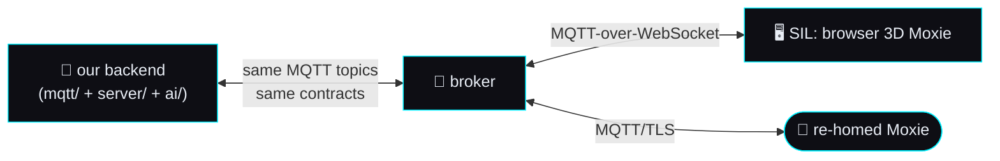

# 🖥️ The SIM as a backend client — interchangeable with a real robot

> **Spec version 1.** How the software-in-the-loop simulator (the [SIL](sil-and-cicd.md)) consumes our
> backend. The point of this spec: **the SIM is not a special case** — it is another *client* of the
> exact same contracts a real robot speaks ([AI seam](ai-seam.md), [config & telemetry](config-and-telemetry-contract.md),
> [content modules](content-module-contract.md), over [MQTT](mqtt-and-conversation.md)). Build the
> backend to those specs and the SIM and a re-homed Moxie are drop-in replacements for each other.
> Reads standalone; cites the study for provenance.

## The interchangeability guarantee

The backend speaks **only** the reverse-engineered MQTT/JSON/markup protocol — never anything
SIM-specific. Therefore:

**Anything proven in the sim works on hardware, and vice-versa** — because both clients subscribe to
the same topics and honor the same request/response contracts. The SIM is the test/display surface;
the robot is production; the backend cannot tell them apart at the protocol layer.

## Robot → cloud: the activity log, and the delta that is allowed

Both SIM clients publish the robot's own upstream channel,
`/devices/{id}/events/client-service-activity-log`, multiplexed by `subtopic`
([mqtt-and-conversation §3.3](mqtt-and-conversation.md), cited to
[cloud-protocol.md](../reverse-engineering/protocol/cloud-protocol.md)). Until 2026-09-02 only
[`sim/virtual_moxie.py`](../../sim/virtual_moxie.py) did, so the browser SIM could not ask the cloud
anything or report its own state, and the interchangeability guarantee above was overstated in that
direction. It now holds in both.

The guarantee is enforced from **both** ends against one recorded file,
[`sim/tests/goldens/robot_to_cloud_activity.json`](../../sim/tests/goldens/robot_to_cloud_activity.json):

| Held by | Asserts |
|---|---|
| `sim/tests/test_sim_client_parity.py` | the Python SIL robot still publishes exactly the golden's envelopes, in the golden's key order |
| `sim/test_bridge.mjs` | the browser SIM builds the same envelopes, with the same keys in the same order |

So neither client can drift from the other without a test going red, and the golden cannot go stale
without the first test catching it.

**The one legitimate delta** is the golden's `identity_keys`: the fields that say *which* robot is
speaking and *when* (the device id inside `auid`, and the client's own `module_name`). Every other field
must match. A divergence anywhere else is a bug, not a difference.

**Cloud → robot:** the browser SIM also acts on `response_actions` now — moods reach the face, gestures
reach the motors, and an unknown action type is counted and ignored rather than thrown, so a newer cloud
cannot break an older SIM.

## What the SIM substitutes vs what's identical

| Concern | Real robot | SIM | Same contract? |
|---|---|---|---|
| Transport | MQTT/TLS :8883 | MQTT-over-WebSocket :9001 (same broker, same topics) | ✅ topics identical |
| Config | `/config` `RobotCloudConfig` | consumes the same `/config` | ✅ [config contract](config-and-telemetry-contract.md) |
| Status/telemetry | `/state` `RobotStatus` | publishes a synthetic `/state` | ✅ same shapes |
| Brain / turn | `RemoteChatRequest`↔`Response` | identical | ✅ [AI seam ②](ai-seam.md) |
| Content/activities | server-side modules | identical | ✅ [content contract](content-module-contract.md) |
| Behavior markup | drives face/motors | drives WebGL face/arms/head/body | ✅ same `<mark cmd:…>` |
| Body / render | physical DLP face + 7-DOF motors | WebGL 3D avatar | ⛔ client-side only (not a backend concern) |
| Mic (STT in) | XMOS → audio bus | browser mic → same STT seam | ✅ [AI seam ①](ai-seam.md) |
| **Voice (TTS out)** | **on-device** — server sends text+markup, robot synthesizes | **browser plays the server's `CloudTTSResponse`** through Web Audio | ⚠️ **see below** |

Everything above the render layer is contract-identical. Only the **body render** (purely client-side)
and the **TTS boundary** differ.

## The one divergence a spec must call out: TTS

On a real robot, TTS is **on-device** — the backend sends *text + behavior markup* and Moxie speaks it
([perception-pipeline](../reverse-engineering/runtime/perception-pipeline.md), [ai-seam ③](ai-seam.md)).
A browser has no on-device Moxie voice, so the SIM needs **audio it can play**. Two options, both
compatible with the AI seam's TTS contract:

1. **Server-side TTS** (Piper → PCM) rendering the same `CloudTTSResponse{audio, marks}` the seam
   defines — the browser plays the PCM and lip-syncs from the `TTSMark`s. This is the path that also
   lets a real robot use a server voice. **This is the one we built** (see below).
2. **Pre-rendered audio** for scripted demos (the SIM can talk with no backend at all).

> **Implication for the backend:** to drive the SIM's voice you implement AI-seam **③ TTS out** (which
> a real robot doesn't require, since it self-synthesizes). This is the *only* backend capability the
> SIM needs that a real robot doesn't — so build TTS-out anyway and both clients are covered.

### What each SIM client does with a `CloudTTSResponse`

The supervisor synthesizes the turn and publishes a `CloudTTSResponse` on
`/devices/{id}/commands/tts` ([AI seam ③](ai-seam.md)). Both SIM clients consume that one message:

| client | module | what "playing" means |
|---|---|---|
| headless SIL robot | `sim/virtual_moxie.py::_play_tts` | decodes + records that Moxie spoke (bytes, rate, marks) — asserted by `sim/run_smoke.sh --expect-tts` |
| browser SIM | `sim/web/audio.js::playCloudTTS` (routed in by `bridge.js`) | **real sound** through the shared Web Audio context, with the face's mouth animating while it plays |

**The decode contract.** `AudioBuffer{buffer, channels, sample_rate}` +
`TTSMark{time, start, end, type, value}` — a client must honor all of this itself:

- `audio.buffer` is base64 of **raw little-endian signed 16-bit PCM**. It is *not* a container: there
  is no RIFF/OGG header, so `decodeAudioData()` cannot read it. The client builds the audio buffer by
  hand — `sample / 32768` → Float32, de-interleaved by `channels`, played at `sample_rate`.
- **Chunked replies:** chunks sharing an `event_id` play in `chunk_num` order (a serial queue), so a
  streamed line is heard as one utterance even if the chunks arrive out of order.
- **Lip-sync:** `marks[]` drive the mouth when present (viseme/word marks, timed by `time` in ms from
  the start of the utterance); with no marks the mouth follows the audio's own envelope, so the face
  still visibly speaks. Marks are recommended, never required.
- **Never throw:** a missing `sample_rate` defaults to 24000, an odd trailing byte is dropped, junk
  base64 decodes to silence. A client that throws on bad audio is a client that goes mute.

**The SIM decodes the wire itself** — it never imports the server SDK (`moxie_sdk.tts`), exactly like
robot firmware. That is the interchangeability guarantee doing real work: the same bytes reach a
browser and a robot, and neither client shares code with the server. Guarded by `sim/test_audio.mjs`
(which also round-trips the browser decoder against the *real* server encoder) and by the Playwright
tests in `sim/tests/test_sil.py`.

**One browser constraint a robot doesn't have:** a page may not make sound before a user gesture
(the autoplay policy). The SIM **queues** the audio and plays it on the next click/keypress rather
than dropping it, and the existing sound toggle mutes it. The backend is unaffected — this is entirely
client-side, like the body render.

### The other voice on the page: the child (2026-09-03)

Everything above is Moxie's voice. The browser SIM has a **second** one, and it is governed by the
opposite rule.

The scripted session (`sim/web/sessions/demo.json`) is a *conversation*: the child asks, Moxie
answers. Both halves arrive through `bridge.js::route` — the child's on `/events/remote-chat`, which
`handleUserTurn` renders. Until now that handler wrote the transcript row, played a listening chirp,
and stopped, so the demo was half-silent even though the child's two lines had been pre-rendered into
the manifest's `child` group all along.

It cannot be fixed by calling `speak()`, and the reason is a property of the wire rather than of the
page. **`/events/remote-chat` is the child channel, and a visitor IS the child**: the Talk box and the
microphone publish a visitor's own words on exactly that topic, through exactly that handler.
`speak()` guarantees sound — pre-cached clip → Piper → the browser's speech synthesis — so pointing it
at this handler would read a visitor's sentence back at them in a stranger's voice, and on the mic
path over the top of them. Worse than the silence it replaced.

So the child's voice is `audio.js::speakClipOnly(text, "child")`, and it is a **separate entry point,
not a flag**:

| | Moxie — `speak()` | the child — `speakClipOnly()` |
|---|---|---|
| promise | **sound always**: clip → Piper → browser voice | **a shipped clip, or nothing** |
| manifest lookup | falls through `moxie` → `child` | the named group and nowhere else |
| synthesizer reachable | yes, by design | **no — there is no code path to one** |
| drives the mouth | yes (envelope or `marks[]`) | never: Moxie lip-syncing the child is a broken toy |
| may interrupt | yes — `speak()` calls `stop()` first | never while Moxie is speaking |

The guarantee is deliberately structural. A `noFallback` argument threaded through `speak()` would be
one condition away from being loosened by someone who did not know why it was there; "which function
did you call" cannot be loosened by editing a condition. There is no gate on *replaying* either — the
clip check is the tighter guarantee (sound only where this site authored the child's voice for that
exact sentence), and a replay gate would additionally mute `mic.js`'s degraded scripted-child line,
which runs outside a replay and is exactly where the child should be heard.

**Ordering is asymmetric on purpose: the child yields, Moxie interrupts.** The robot is the subject of
the page and must never be talked over by a prop, so a visitor typing mid-answer cannot cut her off; a
child line still playing when Moxie's turn lands is cut, and a newer child line replaces an older one.
That last rule has a consequence for the *script*: a session whose reply lands before the child's clip
ends ships a child cut off mid-word. `sim/test_fallback_coverage.mjs` §2b times every scripted child
line against the next event that makes Moxie speak (durations estimated from file size, so the guard
needs no codec), and §8b drives the real `audio.js` under a stubbed Web Audio stack to assert what was
started, stopped, synthesized, and whether the mouth moved.

## How the SIM connects

The browser subscribes MQTT-over-WebSocket to the **same topics the robot sees**, so the avatar
animates from the **real** `remote_chat` replies + markup + motor commands — a live window into the
bus, not a mock. The virtual robot (`sim/virtual_moxie.py`) publishes `/state` and consumes `/config`
and commands exactly as hardware would. Build/run detail + the 3D model reference:
[`sil-and-cicd.md`](sil-and-cicd.md).

## Conformance

- [ ] The backend publishes only standard contracts (config/state/remote_chat/markup) — nothing SIM-specific.
- [ ] The SIM subscribes to the same MQTT topics and honors the same config/turn/markup contracts as a robot.
- [ ] A backend built to the [AI seam](ai-seam.md) + [config](config-and-telemetry-contract.md) +
      [content](content-module-contract.md) specs runs the SIM with **zero backend changes**; only the
      client render + audio playback are SIM-side.
- [ ] AI-seam **③ TTS out** is implemented server-side (the SIM's only extra need vs a real robot).
- [ ] The SIM plays that `CloudTTSResponse` by decoding the raw PCM **client-side** (no server-SDK
      import), in `chunk_num` order, lip-syncing from `marks[]` when they are present.

Where it lives: [`../../sim/`](../../sim/) (the SIL client + web UI) talking to [`../../mqtt/`](../../mqtt/)
(the backend). Same backend, two interchangeable clients.

---
📖 [Docs index](../README.md) · [SIL design & build plan](sil-and-cicd.md) · [AI seam](ai-seam.md) · [Ecosystem build plan](moxie-ecosystem.md)
