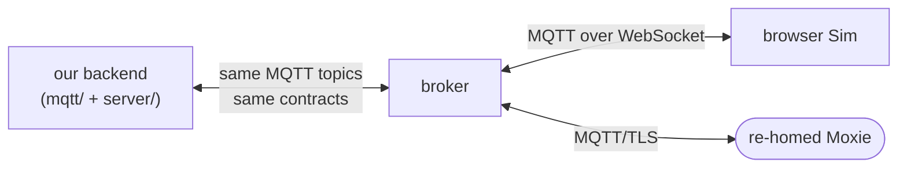

# The Sim as a backend client

> **Spec version 1.** How the software-in-the-loop simulator ([SIL](sil-and-cicd.md)) uses the backend.
> The Sim is not a special case: it is another client of the same contracts a real robot speaks
> ([AI seam](ai-seam.md), [config and telemetry](config-and-telemetry-contract.md),
> [content modules](content-module-contract.md), over [MQTT](mqtt-and-conversation.md)).

## The interchangeability guarantee

The backend speaks only the reverse-engineered MQTT/JSON/markup protocol, never anything Sim-specific.

```mermaid
flowchart LR
  be["our backend<br/>(mqtt/ + server/)"] <-->|"same MQTT topics<br/>same contracts"| broker["broker"]
  broker <-->|"MQTT over WebSocket"| sim["browser Sim"]
  broker <-->|"MQTT/TLS"| real(["re-homed Moxie"])
```

Both clients subscribe to the same topics and honor the same request/response contracts, so the
backend cannot tell them apart at the protocol layer.

## Robot → cloud: the activity log

Both Sim clients (the headless [`sim/virtual_moxie.py`](../../sim/virtual_moxie.py) and the browser Sim)
publish the robot's upstream channel `/devices/{id}/events/client-service-activity-log`, multiplexed by
`subtopic` ([MQTT contract](mqtt-and-conversation.md), cited to
[cloud-protocol.md](../reverse-engineering/protocol/cloud-protocol.md)).

Both are held to one recorded file,
[`sim/tests/goldens/robot_to_cloud_activity.json`](../../sim/tests/goldens/robot_to_cloud_activity.json):

| Held by | Asserts |
|---|---|
| `sim/tests/test_sim_client_parity.py` | the Python robot publishes exactly the golden's envelopes, in the golden's key order |
| `sim/test_bridge.mjs` | the browser Sim builds the same envelopes, same keys, same order |

The only allowed difference is the golden's `identity_keys`: the fields that say which robot is
speaking and when (the device id inside `auid`, and the client's `module_name`). Any other difference
is a bug.

**Cloud → robot:** the browser Sim acts on `response_actions` — moods reach the face, gestures reach the
motors, and an unknown action type is counted and ignored, so a newer cloud cannot break an older Sim.

## What the Sim substitutes and what is identical

| Concern | Real robot | Sim | Same contract? |
|---|---|---|---|
| Transport | MQTT/TLS :8883 | MQTT over WebSocket :9001 (same broker, same topics) | Yes |
| Config | `/config` `RobotCloudConfig` | consumes the same `/config` | Yes ([config contract](config-and-telemetry-contract.md)) |
| Status/telemetry | `/state` `RobotStatus` | publishes a synthetic `/state` | Yes |
| Brain / turn | `RemoteChatRequest` ↔ `Response` | identical | Yes ([AI seam ②](ai-seam.md)) |
| Content/activities | server-side modules | identical | Yes ([content contract](content-module-contract.md)) |
| Behavior markup | drives face and motors | drives the WebGL face, arms, head, body | Yes, same `<mark cmd:…>` |
| Body / render | physical face + 7 motors | WebGL avatar | No — client-side only |
| Mic (speech in) | XMOS → audio bus | browser mic → same STT seam | Yes ([AI seam ①](ai-seam.md)) |
| **Voice (speech out)** | **on-device**: server sends text + markup, robot synthesizes | **browser plays the server's `CloudTTSResponse`** | **Differs — see below** |

## The one divergence: text-to-speech

A real robot synthesizes speech on-device from text + markup
([perception pipeline](../reverse-engineering/runtime/perception-pipeline.md)). A browser has no Moxie
voice, so the Sim needs audio. It gets it one of two ways, both compatible with the AI seam:

1. **Server-side TTS** (Piper or a gateway) rendering `CloudTTSResponse{audio, marks}` per
   [AI seam ③](ai-seam.md). The browser plays the PCM and lip-syncs from the `TTSMark`s. This is what
   is built.
2. **Pre-rendered audio** for scripted demos, so the Sim can talk with no backend.

So the backend must implement AI seam ③ (TTS out) to drive the Sim, even though a real robot does not
need it. It is the only extra capability the Sim requires.

### Playing a `CloudTTSResponse`

The supervisor publishes a `CloudTTSResponse` on `/devices/{id}/commands/tts`. Both Sim clients consume it:

| Client | Code | What "playing" means |
|---|---|---|
| headless robot | `sim/virtual_moxie.py::_play_tts` | records that Moxie spoke (bytes, rate, marks); asserted by `sim/run_smoke.sh --expect-tts` |
| browser Sim | `sim/web/voice/cloud.js::playCloudTTS` (routed from `sim/web/bridge/index.js`) | real sound through Web Audio, mouth animating |

**Decode contract.** `AudioBuffer{buffer, channels, sample_rate}` and
`TTSMark{time, start, end, type, value}`. A client must:

- Treat `audio.buffer` as base64 of **raw little-endian signed 16-bit PCM**, with no container header
  (so `decodeAudioData()` cannot read it). Convert `sample / 32768` to Float32, de-interleave by
  `channels`, play at `sample_rate`.
- Play chunks sharing an `event_id` in `chunk_num` order (a serial queue), so a streamed line is heard
  as one utterance even if chunks arrive out of order.
- Drive the mouth from `marks[]` when present (`time` in ms from the start of the utterance); without
  marks, follow the audio envelope. Marks are recommended, never required.
- Never throw: a missing `sample_rate` defaults to 24000, an odd trailing byte is dropped, bad base64
  decodes to silence.

The Sim decodes the wire itself and never imports the server SDK (`moxie_sdk.tts`), just like robot
firmware. Guarded by `sim/test_audio.mjs` (which round-trips the browser decoder against the real server
encoder) and `sim/tests/test_sil.py`.

Browsers may not play sound before a user gesture, so the Sim queues audio and plays it on the next
click or keypress. This is client-side only.

### The child's voice in the Sim

The scripted demo (`sim/web/sessions/demo.json`) is a conversation, so the browser also voices the
child's lines, which arrive on `/events/remote-chat`. That is also the topic a visitor's own typed or
spoken words travel on, so the child's voice must never synthesize: it would read a visitor's sentence
back at them. The rule:

| | Moxie — `speak()` | The child — `speakClipOnly()` (`sim/web/voice/local.js`) |
|---|---|---|
| Promise | sound always: clip → Piper → browser voice | a shipped clip for that exact sentence, or nothing |
| Manifest lookup | falls through `moxie` → `child` | the named group only |
| Synthesizer reachable | yes | no code path to one |
| Drives the mouth | yes | never |
| May interrupt | yes | never while Moxie is speaking |

It is a separate function, not a flag, so the guarantee cannot be loosened by editing a condition. The
child yields and Moxie interrupts: a child clip still playing when Moxie's turn lands is cut.
`sim/test_fallback_coverage.mjs` checks that every scripted child line finishes before Moxie's next
reply, and drives the real voice code under a stubbed Web Audio stack.

## Conformance

- [ ] The backend publishes only standard contracts (config, state, remote chat, markup), nothing Sim-specific.
- [ ] The Sim subscribes to the same MQTT topics and honors the same config, turn and markup contracts as a robot.
- [ ] A backend built to the [AI seam](ai-seam.md), [config](config-and-telemetry-contract.md) and
      [content](content-module-contract.md) specs runs the Sim with no backend changes.
- [ ] AI seam ③ (TTS out) is implemented server-side.
- [ ] The Sim decodes the raw PCM client-side (no server-SDK import), in `chunk_num` order, lip-syncing
      from `marks[]` when present.

Code: [`sim/`](../../sim/) (the clients and web UI) talking to [`mqtt/`](../../mqtt/) (the backend).

---
[Docs index](../README.md) · [SIL design](sil-and-cicd.md) · [AI seam](ai-seam.md) · [Architecture overview](overview.md)
