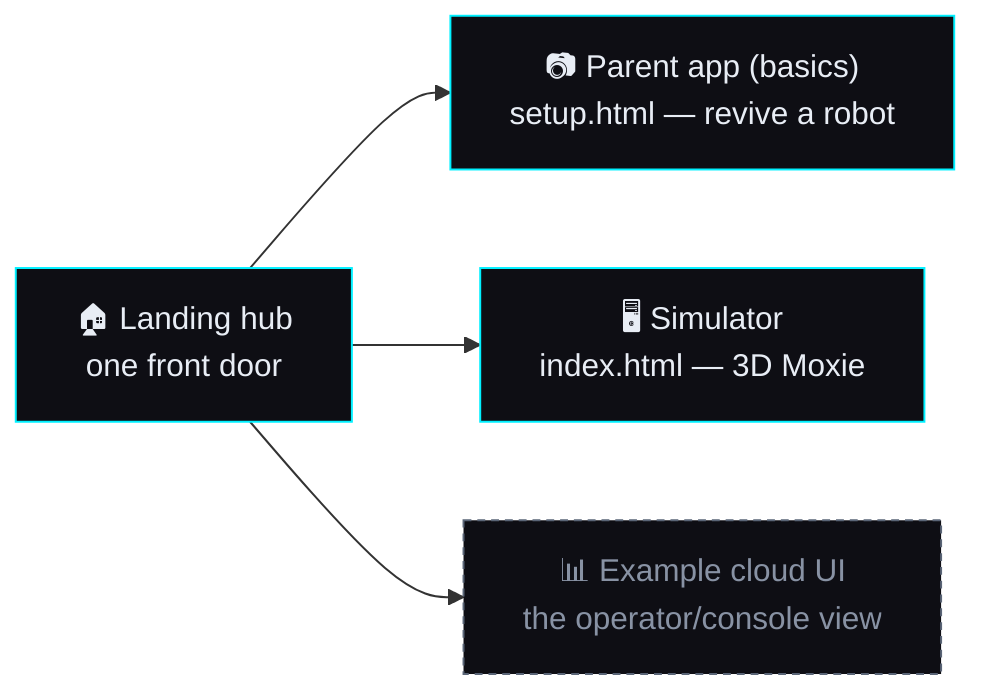

# 🌐 The Moxie experience as one static site

> **What the user asked for.** A **combined parent app + simulator + example cloud UI** for the Moxie
> experience, hosted on **Cloudflare Pages** as a static site — "just the basics hosted online, not full
> LLM gateway connectivity" — that **grows into the real end-to-end system** over time. This doc is the
> map: the three surfaces, what each one is, what runs statically vs. needs a server, and the roadmap
> from "shop window" to "real product." Robot behaviour is grounded in firmware **v24.10.803**.

## The three surfaces

| Surface | What it is | Static today? | Where |
|---|---|---|---|
| **Parent app** (basics) | The phone flow that re-homes a real robot: Wi-Fi QR + server QR. | ✅ **done** — `setup.html` builds both codes client-side via [`qr.js`](../../sim/web/qr.js) (plain-JSON QR types, no protobuf, no server). | [`sim/web/setup.html`](../../sim/web/setup.html) |
| **Simulator** | The 3D Moxie — face, arms, liveness — driven by the real protocol, with a stub brain + pre-rendered audio so it talks with no server. | ✅ **done** | [`sim/web/`](../../sim/web/) |
| **Example cloud UI** | The operator/console view: a robot's status, the child's session transcript, content — read-only, canned data. | ⏳ **planned** — static with fixture JSON. | *(next)* |
| **Landing hub** | One front door tying the three together. | ⏳ **planned** | *(next)* |

## What's static vs. what needs a server

The dividing line is simple and worth stating plainly:

- **Anything that produces a QR, animates the avatar, or replays a canned session is static.** The
  revival QRs are plain JSON ([`qr-commands.md`](../reverse-engineering/qr-commands.md)); the avatar is
  WebGL; the demo conversation is scripted and pre-rendered ([`deploy-cloudflare.md`](../guides/deploy-cloudflare.md)).
- **Anything that talks to a *live robot*, does real STT/LLM/TTS, or stores a real account needs a
  server.** A real robot speaks **MQTT over TLS** — a CDN can't be its broker. Full pairing (the `PA`
  protobuf payload + recovery phrase + child account) is the server-bound [`server/`](../../server/)
  FastAPI app, not part of the static basics.

So the static site is a **complete, honest demo of the experience** plus the **one genuinely useful
real-world tool** — the revival QR a parent holds up to a robot. Everything past that plugs in when you
self-host the backend.

## The "basics online" scope (this milestone)

What the user means by *the basics*, concretely:

1. **A parent with a dead Moxie and only a phone can revive it** — `setup.html`, no install. ✅
2. **Anyone can see the 3D Moxie talk** — the simulator with stubs. ✅
3. **A read-only example of the cloud/console view** — so the shape of the real product is visible. ⏳
4. **One landing page** that presents all three. ⏳

Explicitly *out of scope* for this milestone (deferred to the end-to-end phase): LLM gateway
connectivity, live MQTT to a real robot, real accounts/auth, real content authoring.

## Growing into the end-to-end system

The static site is the **near end** of one continuum, not a throwaway. Each surface has a live twin that
plugs in behind the same UI:

| Static surface | …becomes | Live backend |
|---|---|---|
| `setup.html` (QR only) | full pairing + recovery phrase + child account | [`server/`](../../server/) FastAPI parent-app server |
| Simulator stub brain | a real conversing brain | [`mqtt/`](../../mqtt/) supervisor + `LLMApp` (self-hosted Ollama, or a gateway) |
| Pre-rendered audio | live voice | [`sim/tts`](../../sim/tts/) Piper · [`sim/stt`](../../sim/stt/) faster-whisper |
| Canned cloud UI | live console | the same server's REST API + broker status |

The precedence is already **automatic** in the client (a live endpoint is used if reachable, else the
stub) — so "plug in the backend" is a configuration change, not a rewrite.

## Deploy

Deploy root is **`sim/web/`** — it holds the vendored deps (three.js, fonts, `qrcode.js`, `qr.js`) that
every surface shares, so the parent app, simulator and (soon) cloud UI live as sibling pages reusing one
`vendor/` tree. Mechanics — headers, audio pre-caching, per-environment config — are in
[`deploy-cloudflare.md`](../guides/deploy-cloudflare.md).

---
📖 [Deploy to Cloudflare](../guides/deploy-cloudflare.md) · [Revive your Moxie](../guides/revive-your-moxie.md) · [Ecosystem plan](moxie-ecosystem.md) · [Simulator](../../sim/README.md) · [Docs index](../README.md)
