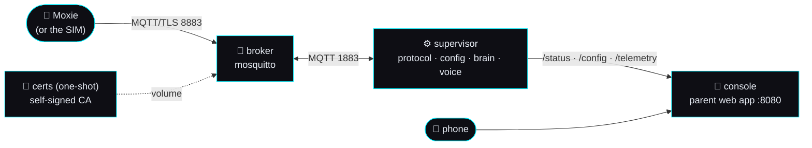

# 🚀 The one-command stack

> **Goal.** Get a running Moxie cloud — broker, robot supervisor and parent console — with
> **one command**, on any machine with Docker. Two ways in: **pull our published images**
> (no clone, no build) or **build from a clone**. This is the fastest way to get a backend
> that a real robot (or the [simulator](../../sim/)) can talk to.
>
> Already have a robot on Wi-Fi and just want the whole revival story?
> Start at [`revive-your-moxie.md`](revive-your-moxie.md) — this guide is its "stand up
> the backend" step, done properly.

## What comes up



| Service | Published image | Built from | What it does |
|---|---|---|---|
| `certs` | `ghcr.io/mvalancy/moxie-robot-saver/broker-certs` | [`mqtt/broker/Dockerfile`](../../mqtt/broker/Dockerfile) | Runs [`gen-certs.sh`](../../mqtt/broker/gen-certs.sh) **once** into a volume: the broker's self-signed CA + server cert. Exits. |
| `broker` | *upstream* `eclipse-mosquitto:2.0.20` | — | The MQTT broker the robot homes to. TLS `8883` (robot) · plain `1883` (SIM/tests) · WebSocket `9001` (browser UI). Config: [`compose-mosquitto.conf`](../../mqtt/broker/compose-mosquitto.conf), inlined into `docker-compose.images.yml` so that file stands alone. |
| `supervisor` | `ghcr.io/mvalancy/moxie-robot-saver/supervisor` | [`mqtt/Dockerfile`](../../mqtt/Dockerfile) | [`mqtt/run.py`](../../mqtt/run.py) — speaks Moxie's protocol, pushes each robot its config, routes turns to the brain, synthesizes the server voice. |
| `console` | `ghcr.io/mvalancy/moxie-robot-saver/console` | [`server/Dockerfile`](../../server/Dockerfile) | [`server/run.py`](../../server/run.py) — the account-free parent-app REST API, the mobile web client, and the fleet / config / telemetry views. |

We publish three images, not four: the broker **is** upstream mosquitto — we ship its
config, not a fork of it — so the third image is honestly named `broker-certs` (the
one-shot that mints your appliance's own CA) rather than `broker`.

## Prerequisites

- **Docker Engine 24+** with the Compose plugin (`docker compose version`). Nothing else —
  no Python, no Node, no cloud account, and (on the prebuilt path) no git.
- ~1 GB of disk for the images, and free TCP ports `1883 / 8080 / 8883 / 8931 / 9001`
  (all changeable — see [Ports](#ports)).
- **CPU architecture:** the images are multi-arch — `linux/amd64` (any PC, an Intel NAS)
  and `linux/arm64` (Raspberry Pi 4/5 on a 64-bit OS, Apple silicon under Docker Desktop).
  Docker picks the right one for you. 32-bit ARM (`armv7`, a Pi Zero/2/3 on a 32-bit OS)
  is **not** published — build from the clone there.

## Path A: prebuilt images (two commands, no clone)

The way most owners should install it. Nothing is compiled on your machine; Docker pulls
three small images and starts them.

```sh
curl -O https://raw.githubusercontent.com/mvalancy/moxie-robot-saver/main/docker-compose.images.yml
docker compose -f docker-compose.images.yml up            # add -d for the background
```

That file is deliberately **self-contained** — it references nothing else in the repo, so
those two commands are the entire install. Want to configure it? Grab the documented
example env beside it (optional — every value has a working default):

```sh
curl -O https://raw.githubusercontent.com/mvalancy/moxie-robot-saver/main/.env.example
cp .env.example .env && $EDITOR .env
docker compose -f docker-compose.images.yml up -d
```

> **Honest status.** The release workflow publishes these images on every `v*` tag
> ([RELEASING.md](../../RELEASING.md)). Until the **first tag cut after this landed**,
> `ghcr.io/mvalancy/moxie-robot-saver/*` is empty and the pull will 404 — use Path B, or
> check the repo's Packages page. The wiring itself is proven: `MOXIE_SMOKE_MODE=images
> sim/run_compose_smoke.sh` runs this exact file, with `pull_policy: never`, against
> locally built images carrying those names, and takes it through the full robot
> round-trip.

## Path B: the one command, from a clone

For hacking on it, for 32-bit ARM, and for the `voice` / `stt` profiles (they change the
supervisor *image*, so a prebuilt one cannot enable them).

```sh
git clone https://github.com/mvalancy/moxie-robot-saver.git
cd moxie-robot-saver
docker compose up            # add -d to run it in the background
```

That is the whole thing. First run builds the images and generates the broker certs
(~2 minutes); later runs start in seconds.

Both paths use the compose project name `moxie` and therefore the **same named volumes**,
so you can switch between them without losing your certs, your DB or Moxie's memory.

Either way, open **`http://<this-machine-ip>:8080`** from a phone on the same LAN.

Check it from the terminal:

```sh
curl -s http://127.0.0.1:8931/status | head -c 200      # the supervisor
curl -s http://127.0.0.1:8080/local/fleet | head -c 200  # the console's fleet view
```

## Configure it — one `.env`

Every knob lives in **one** file at the repo root. There is a working default for all of
them, so the stack starts with no `.env` at all:

```sh
cp .env.example .env         # then edit
docker compose up -d         # picks it up automatically
```

(On Path A the same `.env` is read by `docker compose -f docker-compose.images.yml up -d`,
plus three extra knobs only that file uses: `MOXIE_IMAGE_REGISTRY`, `MOXIE_IMAGE_TAG` and
`MOXIE_IMAGE_PULL_POLICY`.)

`.env` is git-ignored — **never commit a key**. [`.env.example`](../../.env.example) is
the tracked copy and documents every `MOXIE_*` knob. The ones that matter most:

| Variable | Default | What it does |
|---|---|---|
| `MOXIE_BROKER_HOST` | `127.0.0.1` | The IP a **real robot** uses to reach your broker. Goes into the endpoint QR *and* the broker cert — set it to this machine's LAN IP **before the first `up`**. |
| `MOXIE_BIND_HOST` | `0.0.0.0` | Which host interface the published ports bind to. `127.0.0.1` = this machine only. |
| `MOXIE_BIND_HOST_PLAIN` | `127.0.0.1` | The **plain** MQTT listener (`1883`) binds separately, and to loopback: it is the one door with a fleet-wide identity behind it. A robot never uses it. Set to `0.0.0.0` only to drive the SIM or the tests from another machine. |
| `MOXIE_APP` | `content` | The brain: `content` (data-driven modules) · `llm` (free-form companion) · `echo` (no LLM, for testing the plumbing) · `webhook` (hand turns to your own service). |
| `MOXIE_LLM_BASE_URL` / `_API_KEY` / `_MODEL` | our LiteLLM gateway | Any OpenAI-compatible endpoint — the gateway, Ollama, vLLM, LM Studio. **Without a key the stack still runs**; Moxie just answers with a "my brain got fuzzy" fallback instead of real conversation. |
| `MOXIE_TTS` | `tone` | The server voice. `tone` is the built-in zero-dependency placeholder — audio arrives with no model and no key. Real speech: the `voice` profile below. |
| `MOXIE_STT` | `auto` | Ears. `auto` = on when faster-whisper is in the supervisor image (see the `stt` profile). |
| `MOXIE_CHILD_NICKNAME` | `friend` | What Moxie calls the child until the console's record is wired in. |

## Ports

Each is remapped by one line in `.env` (e.g. `MOXIE_PORT_CONSOLE=9090`) if something on
your machine already owns it.

| `.env` | Default | Who connects |
|---|---|---|
| `MOXIE_PORT_MQTT_TLS` | `8883` | **The robot** (MQTT over TLS). |
| `MOXIE_PORT_MQTT` | `1883` | The SIM, `sim/virtual_moxie.py`, the tests. **Loopback-only** unless you set `MOXIE_BIND_HOST_PLAIN`. |
| `MOXIE_PORT_WS` | `9001` | The browser UI (MQTT over WebSocket). |
| `MOXIE_PORT_CONSOLE` | `8080` | Your phone / browser → the parent console. |
| `MOXIE_PORT_STATUS` | `8931` | The supervisor's `/status`, `/telemetry`, `/config`. Bound to `127.0.0.1` unless you change `MOXIE_BIND_HOST` — it is an unauthenticated admin surface. |

> **Why 8931 and not 8930?** The runtime's status server binds `127.0.0.1` on purpose. In
> compose the console is a *different container*, so the supervisor image starts a tiny
> forwarder ([`status_proxy.py`](../../mqtt/status_proxy.py)) on `8931` — an explicit,
> opt-in `MOXIE_STATUS_PROXY_PORT`, not a change to the runtime's default posture.

## Who may talk on the bus

*(Broker hardening P0, 2026-09-02 — the full reasoning is
[`mqtt-and-conversation.md` §3.1](../architecture/mqtt-and-conversation.md).)*

**Nothing to configure. `docker compose up` is still the whole install.** The `certs`
one-shot that already mints your broker's TLS material now also mints a **per-appliance
password for the supervisor** and leaves it in the same volume, at `0600`, owned by the
supervisor's user. Nothing is printed, nothing is committed, and the password is never a
compose `environment:` value (which `docker inspect` would show).

What that buys you:

| Before | Now |
|---|---|
| Any device on your LAN could subscribe `$SYS/broker/log/#` and read every robot id on your appliance | `$SYS` is the supervisor's alone |
| Any device could subscribe `/devices/+/config` and watch your child's name and birthday go past | every client sees only `/devices/<its own client id>/…` |
| Any device could publish into another robot's topics | same confinement, in the write direction |
| The plain `1883` port was published to the LAN | published to `127.0.0.1` (`MOXIE_BIND_HOST_PLAIN`) |

**And what it does not buy you, stated plainly: this is containment, not authentication.**
A robot still connects anonymously — that is the only thing a stock Moxie can do — so a
device that copies a robot's id is still served as that robot. The
[🔐 Robot access card](permitting-a-robot.md) is what decides whether a robot is served
your child's data; the broker ACL only decides how far it can reach if it gets on the bus.

Things worth knowing:

- **An appliance installed before this** grows a credential on its next `up`; no action.
- **`docker compose down -v` rolls the credential** along with the certs, automatically.
- **Running the broker bare metal?** [`mqtt/broker/mosquitto.conf`](../../mqtt/broker/mosquitto.conf)
  now needs `keys/passwd` to exist or mosquitto will not start. Run
  `mqtt/broker/gen-passwd.sh mqtt/broker/keys` once, then point the supervisor at the
  plaintext with `MOXIE_MQTT_USER=supervisor` and
  `MOXIE_MQTT_PASSWORD_FILE=…/keys/supervisor.pass` in `mqtt/.env`.
- **Proving it on your own machine:** `sim/run_acl_proof.sh` starts a throwaway broker
  from these exact config files and asserts, by message delivery, that a second client
  cannot read your robot's config or the fleet roster.

## Where your data lives

Named Docker volumes, so `docker compose down` (without `-v`) keeps everything:

| Volume | Holds | Losing it means |
|---|---|---|
| `moxie_moxie-certs` | Broker CA + server cert, **and the supervisor's broker password** | The robot must be re-shown an endpoint QR after regeneration. The credential is re-minted automatically on the next `up`. |
| `moxie_moxie-console-data` | `moxie.db` — children, robots, encrypted key blobs | Re-pair; restore the child with the recovery phrase. |
| `moxie_moxie-supervisor-data` | Conversation memory (`MOXIE_MEMORY_DIR`, `MOXIE_DATA_DIR`) | Moxie forgets past conversations. |
| `moxie_moxie-broker-data` | mosquitto persistence | Nothing important. |
| `moxie_moxie-models` / `moxie_moxie-whisper-cache` | Piper voice · faster-whisper model | Re-downloaded by the profiles. |

```sh
docker compose down            # stop, keep all data
docker compose down -v         # stop and DELETE the volumes above
docker volume rm moxie_moxie-certs   # regenerate just the broker certs on next `up`
```

## Optional profiles (best-effort)

> These profiles need **Path B (the clone)**. Both bake extra Python wheels into the
> supervisor image, and a prebuilt image cannot grow them — the published `supervisor` is
> the small, zero-dependency one, exactly as `docker compose up` builds it by default.
> (A prebuilt `supervisor-voice` variant is not published today; it is on the list.)

The default stack is deliberately small: no ML wheels, no model downloads. The profiles
add them, and both need **two steps** — the profile fetches the model, and one `.env`
line puts the matching runtime in the supervisor image. Honest status: `voice` is
verified end to end (real Piper speech reaches the SIM through the composed stack);
`stt` fetches its model and the supervisor reports `STT enabled: faster-whisper`, but
no live microphone audio has been transcribed through it yet.

### 🔊 `voice` — Moxie's real (offline) voice

```sh
docker compose --profile voice up voice-model      # downloads Piper "Amy" (~64 MB) into a volume
```
Then in `.env`:
```sh
MOXIE_SUPERVISOR_EXTRAS=piper-tts
MOXIE_PIPER_MODEL=/models/en_US-amy-medium.onnx
```
```sh
docker compose up -d --build                       # rebuilds the supervisor with Piper
docker compose logs supervisor | grep voice        # → [run] server voice enabled: piper
```
Fully offline, no key, no rate limit. The image grows from ~245 MB to ~520 MB, which is
exactly why it is opt-in. If Piper or the model is missing the supervisor falls back to
the `tone` voice rather than failing — but if `MOXIE_PIPER_MODEL` points at a file that
does not exist *while* Piper is installed, it exits at startup. Run the fetch first.

### 🎤 `stt` — local speech-to-text

```sh
docker compose --profile stt up stt-model          # pre-fetches the faster-whisper model
```
Then `MOXIE_SUPERVISOR_EXTRAS=faster-whisper numpy` in `.env` and
`docker compose up -d --build` → `docker compose logs supervisor` shows
`[run] STT enabled: faster-whisper`. `MOXIE_STT=auto` turns it on as soon as the package
is importable; `MOXIE_STT_MODEL` picks the size (`base.en` by default). This adds ~1 GB
to the image, and the first transcription is slow while the model warms.

## Point a real robot at it

1. Set `MOXIE_BROKER_HOST` to this machine's LAN IP in `.env`, then
   `docker compose down -v && docker compose up -d` so the broker cert carries that IP.
2. Get the robot on Wi-Fi and paired — [`first-time-setup.md`](first-time-setup.md).
3. Show it the **endpoint QR** from the console (or `tools/pairing/moxie_endpoint_qr.py`)
   — full detail in [`revive-your-moxie.md`](revive-your-moxie.md#path-b-you-have-an-801803-robot-re-home-it-with-a-qr).
4. Watch it arrive: `docker compose logs -f supervisor` → `🤖 robot connected: d_…`, and
   the console's fleet card lights up.

## Prove it works

```sh
bash sim/run_compose_smoke.sh                          # Path B: build from the clone
MOXIE_SMOKE_MODE=images bash sim/run_compose_smoke.sh  # Path A: the published-image file
```

Both modes make the *same* assertions; `images` mode builds the three images locally,
tags them with the exact names `docker-compose.images.yml` references, and sets
`pull_policy: never` — so a green run proves that file's wiring, not a registry. It also
checks the broker config inlined in `docker-compose.images.yml` still matches
[`compose-mosquitto.conf`](../../mqtt/broker/compose-mosquitto.conf) line for line.

Brings the **real** compose file up under a throwaway project name on ports nothing else
uses (so it can never disturb a stack you already have running), waits for all three
healthchecks, round-trips [`sim/virtual_moxie.py`](../../sim/virtual_moxie.py) through the
composed broker (`state → config → remote-chat → reply → TTS audio`), checks the console's
`/local/fleet` sees that robot, then tears everything down. Non-zero exit on any failure.

### How the two compose files stay in sync

`docker-compose.images.yml` must stand alone — an owner `curl`s that one file and never
clones — so it cannot reference anything here: it **repeats** the supervisor's whole
`environment:` block and **inlines** `compose-mosquitto.conf`. Copies drift, and this one
did: the PR that closed the pairing gate added `MOXIE_ALLOW_UNVERIFIED_BOTS` to
`docker-compose.yml` while the images file was being written in parallel, so the
prebuilt-image stack shipped refusing to pair — and each branch's own smoke was green,
because a smoke only runs the file that branch touched. The fix is one line; the guard is
[`sim/tests/test_compose.py`](../../sim/tests/test_compose.py), which now diffs the two
files with PyYAML and no Docker: identical `MOXIE_*` environment for `supervisor`,
`console` and `certs` (same keys, same `${VAR:-default}`), the inlined broker config
byte-for-byte against the file, and the same services, healthchecks, `depends_on`
conditions, published-port defaults and volume paths. Knobs that legitimately live in one
file only (`MOXIE_SUPERVISOR_EXTRAS` is build-time, `MOXIE_IMAGE_*` are registry-only) sit
on a short allowlist the tests re-verify rather than mute. **So: edit both files, or the
hermetic suite fails in milliseconds on your PR** instead of the deep tier finding it days
later at promotion.

```
── 2. waiting for healthchecks (broker · supervisor · console)
   ✅ broker healthy
   ✅ supervisor healthy
   ✅ console healthy
── 4. virtual Moxie against the COMPOSED broker (127.0.0.1:1921)
[virtual-moxie] ← remote_chat reply: 'You said: hello Moxie'
[virtual-moxie] 🔊 spoke 50934 B @ 22050 Hz (~1.15s, 0 marks)
── 5. parent console /local/fleet sees the robot (127.0.0.1:8921)
   robot_count=1 device_id=d_798b… firmware=24.10.803 online=True
   ✅ one-command stack PROVEN
```

## Updating

**Path A — prebuilt images.** Two commands, and your volumes are untouched:

```sh
docker compose -f docker-compose.images.yml pull      # fetch the newer images
docker compose -f docker-compose.images.yml up -d     # recreate only what changed
```

`MOXIE_IMAGE_TAG=latest` (the default) follows every stable release. Pin `0.6` to take
patch releases only, or `0.6.2` to freeze. Roll back by setting the old tag and running
`up -d` again — the images are immutable, so the previous version is still there.

**Path B — from the clone:**

```sh
git pull
docker compose up -d --build      # rebuild changed images, keep every volume
```

## Troubleshooting

| Symptom | Fix |
|---|---|
| `port is already allocated` | Something owns that port. Remap it in `.env` (see [Ports](#ports)) — the SIL stack (`sim/docker-compose.yml`) and a bare-metal `python mqtt/run.py` both use 1883. |
| Console shows "supervisor not reachable" | `docker compose ps` — is `supervisor` healthy? `docker compose logs supervisor`. The console reads `http://supervisor:8931/status`, so the status proxy must be up. |
| Robot connects, then goes quiet | Almost always the brain: no `MOXIE_LLM_API_KEY`, or an endpoint the container cannot reach. `docker compose logs supervisor` shows the turn and the fallback line. |
| No audio in the SIM | `MOXIE_TTS=tone` gives you a placeholder tone immediately; real speech needs the `voice` profile. |
| Robot cannot complete the TLS handshake | The cert's SAN must match the address the robot dials. Set `MOXIE_BROKER_HOST` to the LAN IP, delete the certs volume, `up` again. Firmware 24.10.803 also honours `disable_verify` in the endpoint QR. |
| `certs` container keeps re-running | It is a one-shot; `Exited (0)` is success. |
| `manifest unknown` / `denied` pulling `ghcr.io/mvalancy/…` | No release has been tagged yet (see the honest status under [Path A](#path-a-prebuilt-images-two-commands-no-clone)), or you asked for a `MOXIE_IMAGE_TAG` that was never published. Use Path B, or pick a tag from the repo's Packages page. |
| `no matching manifest for linux/arm/v7` | 32-bit ARM is not published — use Path B on that machine. |
| Changed `.env` but nothing happened | `docker compose up -d` again — compose re-creates the containers whose environment changed. Build-time knobs (`MOXIE_SUPERVISOR_EXTRAS`) also need `--build`. |

## Running it a different way

- **Just the SIL simulator** (browser 3D Moxie, no robot): `docker compose -f sim/docker-compose.yml up` — see [`sim/README.md`](../../sim/README.md).
- **Bare metal, no Docker**: `pip install -r mqtt/requirements.txt && python mqtt/run.py` alongside `python server/run.py`; broker config in [`mqtt/broker/`](../../mqtt/broker/).
- **Publish the static SIM + docs**: [`deploy-cloudflare.md`](deploy-cloudflare.md).

---
📖 [Guides](README.md) · [Revive your Moxie](revive-your-moxie.md) · [Docs index](../README.md) · [Back to top](../../README.md)
