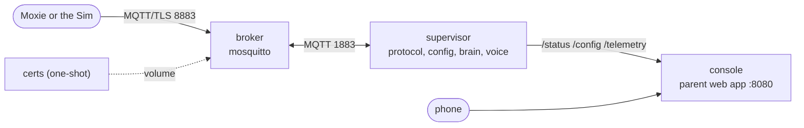

# The one-command stack

Run the whole Moxie backend — MQTT broker, robot supervisor and parent console — on any machine
with Docker. A real robot or the [simulator](../../sim/README.md) can then connect to it. For the full
revival story, start at [Revive your Moxie](revive-your-moxie.md); this guide is its "stand up the
backend" step.

## What comes up


```mermaid
flowchart LR
  moxie(["Moxie or the Sim"]) -->|"MQTT/TLS 8883"| broker["broker<br/>mosquitto"]
  broker <-->|"MQTT 1883"| sup["supervisor<br/>protocol, config, brain, voice"]
  sup -->|"/status /config /telemetry"| console["console<br/>parent web app :8080"]
  phone(["phone"]) --> console
  certs["certs (one-shot)"] -.->|"volume"| broker
```

| Service | Image | What it does |
|---|---|---|
| `certs` | `ghcr.io/mvalancy/moxie-robot-saver/broker-certs` | Runs once: creates the broker's self-signed CA, its certificate, and the supervisor's broker password. |
| `broker` | upstream `eclipse-mosquitto:2.0.20` | The MQTT broker. TLS `8883` for the robot, plain `1883` for the Sim and tests, WebSocket `9001` for the browser. |
| `supervisor` | `ghcr.io/mvalancy/moxie-robot-saver/supervisor` | [`mqtt/run.py`](../../mqtt/run.py): speaks Moxie's protocol, pushes config, runs the brain and the voice. |
| `console` | `ghcr.io/mvalancy/moxie-robot-saver/console` | [`server/run.py`](../../server/run.py): the parent-app REST API, phone web app, and fleet, config and telemetry views. |

## Requirements

- Docker Engine 24+ with the Compose plugin. Nothing else.
- About 1 GB of disk, and free ports `1883`, `8080`, `8883`, `8931`, `9001` (all remappable).
- `amd64` or `arm64` (a Raspberry Pi 4/5 on a 64-bit OS works). For 32-bit ARM, build from a clone.

## Install

**Option A: prebuilt images, no clone.**

```sh
curl -O https://raw.githubusercontent.com/mvalancy/moxie-robot-saver/main/docker-compose.images.yml
MOXIE_APP=echo docker compose -f docker-compose.images.yml up
```

`MOXIE_APP=echo` runs without a brain: the stack works end to end, but Moxie just echoes you. The real
brains (`content`, `llm`) refuse to start until you set `MOXIE_LLM_BASE_URL`, because the repo ships no
default endpoint. To add one:

```sh
curl -O https://raw.githubusercontent.com/mvalancy/moxie-robot-saver/main/.env.example
cp .env.example .env && $EDITOR .env      # set MOXIE_LLM_BASE_URL (and key, model)
docker compose -f docker-compose.images.yml up -d
```

**Option B: from a clone.** Needed for development, 32-bit ARM, and the `voice`/`stt` profiles.

```sh
git clone https://github.com/mvalancy/moxie-robot-saver.git
cd moxie-robot-saver
cp .env.example .env && $EDITOR .env
docker compose up          # first run builds images (~2 minutes)
```

Both options use the compose project `moxie` and the same volumes, so you can switch between them.
Open `http://<this-machine's-ip>:8080` from a phone on the same network. From a terminal on this
machine (the supervisor's status port answers only here):

```sh
curl -s http://127.0.0.1:8931/status | head -c 200       # supervisor
curl -s http://127.0.0.1:8080/local/fleet | head -c 200   # console
```

## Configure

All settings live in one git-ignored `.env` at the repo root; [`.env.example`](../../.env.example)
documents every one. Never commit a key. The important ones:

| Variable | Default | Meaning |
|---|---|---|
| `MOXIE_LLM_BASE_URL`, `_API_KEY`, `_MODEL` | **none** | Any OpenAI-compatible endpoint: Ollama (`http://host.docker.internal:11434/v1`), vLLM, LM Studio, LiteLLM, a hosted proxy. Required for `content` and `llm`. Without a key, Moxie gives a "my brain got fuzzy" line when the endpoint refuses. |
| `MOXIE_APP` | `content` | The brain: `content` (data-driven modules), `llm` (free chat), `echo` (no LLM), `webhook` (your own service). |
| `MOXIE_CHILD_NICKNAME` | `friend` | The name Moxie says to a robot that no account names a child for. The name a parent types in the web app's Wi-Fi tab wins for that parent's robot ([where it goes](../architecture/config-and-telemetry-contract.md#the-childs-name-the-parents-record-per-robot)). |
| `MOXIE_BROKER_HOST` | `127.0.0.1` | The address a **real robot** uses to reach the broker. It goes into the endpoint QR and the broker certificate, so set it to this machine's LAN IP before the first `up`. |
| `MOXIE_BIND_HOST` | `0.0.0.0` | Interface for the ports other devices need: the robot's TLS port (`8883`), the browser UI (`9001`) and the console (`8080`). |
| `MOXIE_BIND_HOST_PLAIN` | `127.0.0.1` | Interface for plain MQTT (`1883`). Robots never use it; open it only to drive the Sim from another machine. |
| `MOXIE_BIND_HOST_STATUS` | `127.0.0.1` | Interface for the supervisor's status port (`8931`); `MOXIE_BIND_HOST` does not widen it. Set `0.0.0.0` only to read the status page from another machine: it then serves your child's name, Moxie's memory and the safety review to anyone on your network, with no sign-in, and takes their settings changes. |
| `MOXIE_TTS` | `tone` | Server voice. `tone` is a placeholder; see the `voice` profile or [gateway voice](gateway-voice-and-ears.md). |
| `MOXIE_STT` | `auto` | Speech-to-text; see the `stt` profile or [gateway ears](gateway-voice-and-ears.md). |

Option A also reads `MOXIE_IMAGE_REGISTRY`, `MOXIE_IMAGE_TAG` and `MOXIE_IMAGE_PULL_POLICY`.

### Ports

| Setting | Default | Used by |
|---|---|---|
| `MOXIE_PORT_MQTT_TLS` | `8883` | The robot |
| `MOXIE_PORT_MQTT` | `1883` | The Sim, `sim/virtual_moxie.py`, tests (loopback only by default) |
| `MOXIE_PORT_WS` | `9001` | The browser UI (MQTT over WebSocket) |
| `MOXIE_PORT_CONSOLE` | `8080` | Your phone or browser |
| `MOXIE_PORT_STATUS` | `8931` | The supervisor's `/status`, `/telemetry`, `/config`, `/memory`, `/safety` and the rest, with no sign-in. It listens on `127.0.0.1` (`MOXIE_BIND_HOST_STATUS`: the default, and `.env.example`'s value), so only this machine reaches it. It is a small forwarder ([`status_proxy.py`](../../mqtt/status_proxy.py)) to the runtime's loopback-only port; the console reads it over the compose network, not through this port. |

### What is on your network

With `.env.example`'s values, three ports listen on every interface, because other devices need them:

| Port | For | What any device on your network can do with it |
|---|---|---|
| `8883` | The robot (MQTT over TLS) | Connect anonymously, as a robot does. The broker confines each client to its own device id, but cannot tell a robot from a device that copies its id ([broker security](#broker-security)). |
| `9001` | The browser Sim and UI (MQTT over WebSocket) | Read every robot's MQTT traffic as it passes, including the settings sent to a robot, your child's name among them. It can write only as the Sim's own device id ([why](../architecture/backlog/security-broker-auth.md#25-the-browser-sim-option-a-shipped-option-b-closes-the-residual)). |
| `8080` | You, from your phone (the console) | Use the console. Its sign-in is an email address alone, and most of it asks for none: reading and erasing what Moxie remembers, reading the safety review, changing settings, permitting a robot, speaking as Moxie. Whether it should require a real sign-in is an open owner question (OQ3). |

Plain MQTT (`1883`) and the supervisor's status port (`8931`) listen on this machine only. Keeping the
status port here closes a door that needed no console at all; it does not lock the console. Do not
expose any of these ports to the internet.

## Broker security

Nothing to configure. The `certs` step also creates a per-appliance password for the supervisor
(stored `0600` in the certs volume, never printed or placed in compose environment). The broker ACL
then gives each client access only to `/devices/<its own id>/…`, and `$SYS` only to the supervisor.

This is **containment, not authentication**: a stock Moxie can only connect anonymously, so a device
that copies a robot's id is treated as that robot. Whether a robot is served your child's data is
decided by the [robot access card](permitting-a-robot.md). Details:
[MQTT contract §3.1](../architecture/mqtt-and-conversation.md).

- `docker compose down -v` regenerates the credential with the certificates.
- Running mosquitto without Docker? It needs `keys/passwd`: run `mqtt/broker/gen-passwd.sh
  mqtt/broker/keys`, then set `MOXIE_MQTT_USER=supervisor` and
  `MOXIE_MQTT_PASSWORD_FILE=…/keys/supervisor.pass` in `mqtt/.env`.
- `sim/run_acl_proof.sh` proves the ACL against a throwaway broker.

## Your data

Named volumes survive `docker compose down`; `down -v` deletes them.

| Volume | Holds | If lost |
|---|---|---|
| `moxie_moxie-certs` | Broker CA and certificate, supervisor password | Show the robot a new endpoint QR. |
| `moxie_moxie-console-data` | `moxie.db`: children, robots, encrypted keys | Re-pair; restore the child with the recovery phrase. |
| `moxie_moxie-supervisor-data` | Conversation memory | Moxie forgets past conversations. |
| `moxie_moxie-broker-data` | mosquitto persistence | Nothing important. |
| `moxie_moxie-models`, `moxie_moxie-whisper-cache` | Piper voice, Whisper model | Downloaded again. |

## Optional profiles (Option B only)

They add Python packages to the supervisor image, so they need a local build.

**`voice`** — Moxie's real offline voice (Piper "Amy"):

```sh
docker compose --profile voice up voice-model     # downloads ~64 MB
# in .env:
#   MOXIE_SUPERVISOR_EXTRAS=piper-tts
#   MOXIE_PIPER_MODEL=/models/en_US-amy-medium.onnx
docker compose up -d --build
docker compose logs supervisor | grep voice       # [run] server voice enabled: piper
```

The image grows from about 245 MB to 520 MB. If `MOXIE_PIPER_MODEL` points at a missing file while
Piper is installed, the supervisor exits at startup, so fetch the model first.

**`stt`** — local speech-to-text (faster-whisper):

```sh
docker compose --profile stt up stt-model
# in .env: MOXIE_SUPERVISOR_EXTRAS=faster-whisper numpy
docker compose up -d --build                      # logs: [run] STT enabled: faster-whisper
```

Adds about 1 GB. `MOXIE_STT_MODEL` picks the size (`base.en` by default). The `stt` profile starts
correctly, but live microphone audio has not yet been transcribed through the composed stack.

## Point a real robot at it

1. Set `MOXIE_BROKER_HOST` to this machine's LAN IP, then `docker compose down -v && docker compose up -d`
   so the certificate carries it.
2. Get the robot on Wi-Fi and paired: [first-time setup](first-time-setup.md).
3. Show it the endpoint QR from the console (or `tools/pairing/moxie_endpoint_qr.py`); see
   [Revive your Moxie](revive-your-moxie.md).
4. `docker compose logs -f supervisor` should print `robot connected: d_…`, and the console's fleet card
   lights up.

## Test it

```sh
bash sim/run_compose_smoke.sh                           # from the clone
MOXIE_SMOKE_MODE=images bash sim/run_compose_smoke.sh   # the prebuilt-images file
```

The smoke test brings the real compose file up on spare ports, waits for the health checks, runs a
virtual robot through a full turn (state, config, chat, reply, audio), checks the console sees it, and
tears down.

`docker-compose.images.yml` must stand alone, so it repeats the supervisor's environment and inlines
the broker config. `sim/tests/test_compose.py` fails if the two compose files drift apart, so **edit
both**.

## Update

```sh
# Option A
docker compose -f docker-compose.images.yml pull && docker compose -f docker-compose.images.yml up -d
# Option B
git pull && docker compose up -d --build
```

`MOXIE_IMAGE_TAG` defaults to `latest`; set `0.7` for patch releases only, or an exact version to pin
or roll back.

## Troubleshooting

| Symptom | Fix |
|---|---|
| `port is already allocated` | Remap the port in `.env`. The Sim stack and a bare-metal `mqtt/run.py` also use 1883. |
| Console says the supervisor is unreachable | `docker compose ps` and `docker compose logs supervisor`. |
| Supervisor keeps restarting | `MOXIE_LLM_BASE_URL` is empty with a brain that needs it. Set it or use `MOXIE_APP=echo`. |
| Robot connects, then goes quiet | Usually the brain: missing key or unreachable endpoint. Check the supervisor logs. |
| No audio in the Sim | `tone` is a placeholder; use the `voice` profile or a gateway voice for speech. |
| Robot fails the TLS handshake | The certificate must match the address the robot dials. Fix `MOXIE_BROKER_HOST`, delete the certs volume, `up` again. |
| `certs` shows `Exited (0)` | Normal; it runs once. |
| `manifest unknown` or `denied` when pulling | The `MOXIE_IMAGE_TAG` you asked for does not exist. |
| `no matching manifest for linux/arm/v7` | 32-bit ARM is not published; use Option B. |
| `.env` change had no effect | `docker compose up -d` again; build-time settings also need `--build`. |

## Other ways to run

- Just the simulator: `docker compose -f sim/docker-compose.yml up` ([`sim/`](../../sim/README.md)).
- Without Docker: `pip install -r mqtt/requirements.txt && python mqtt/run.py`, plus
  `python server/run.py`; broker config in [`mqtt/broker/`](../../mqtt/broker/).
- The static site on Cloudflare: [deploy guide](deploy-cloudflare.md).

---
[Guides](README.md) · [Revive your Moxie](revive-your-moxie.md) · [Docs index](../README.md)
