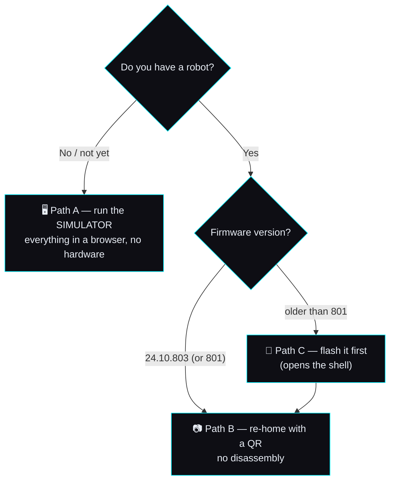

# 🤖 Revive your Moxie — the full path

> **Goal.** Take a Moxie that's been dead since the cloud shut down and get it **talking again** on
> hardware you own — or, with no robot at all, run the **[simulator](../../sim/)** and get the whole
> experience in a browser. Robot side is grounded in firmware
> **v3.6.4-Zephyr / OTA v24.10.803** ([reference](../reverse-engineering/firmware-803-reference.md)).
>
> ⚠️ **Unofficial fan project — not affiliated with, endorsed by, or connected to Embodied, Inc.**
> "Moxie" is their trademark. This exists so retired robots don't become landfill.

## Which path are you on?



**You need the same backend for all three paths** — build that first.

---

## 1. Stand up the backend (everyone)

The backend is what a robot (or the sim) connects to: an MQTT broker, the supervisor that speaks
Moxie's protocol, and the brain. One command:

```sh
docker compose -f sim/docker-compose.yml up          # broker + supervisor + web UI
```

Or run the pieces directly (see [`sim/README.md`](../../sim/README.md) and [`mqtt/`](../../mqtt/)).

### Give it a brain (LLM)
Copy `mqtt/.env.example` → `mqtt/.env` (git-ignored; **never commit keys**) and pick one:

```sh
# Ollama — fully offline, recommended
ollama pull llama3.1 && ollama serve
MOXIE_LLM_BASE_URL=http://127.0.0.1:11434/v1
MOXIE_LLM_API_KEY=ollama
MOXIE_LLM_MODEL=llama3.1
```
…or any **OpenAI-compatible** endpoint (LiteLLM, vLLM, LM Studio) with its own base URL/key/model.
The brain ([`LLMApp`](../../mqtt/moxie_sdk/apps/llm_app.py)) speaks a **Moxie personality** and emits real
**[behavior markup](../reverse-engineering/behavior-markup.md)** — so Moxie *gestures and emotes* while
it talks, on the sim or the real robot.

### Give it a voice and ears (optional but fun)
```sh
python3 sim/tts/server.py 8081     # Piper TTS  (voice: amy) -> Moxie speaks
python3 sim/stt/server.py 8082     # faster-whisper STT      -> you can talk to it
```
Both are **offline**, no API keys. Setup details in [`sim/README.md`](../../sim/README.md).

---

## Path A — no robot: run the simulator

```sh
python3 sim/serve.py 8080          # then open http://localhost:8080
```
You get the **3D Moxie** — face, arms, head, body, liveness — driven by the same protocol a real robot
speaks. Click **Connect** (live bus), **Listen** to talk to it, or **Play demo** for a canned
conversation with no services running. Full design + scope: [`sil-and-cicd.md`](../architecture/sil-and-cicd.md).

**Everything you prove here works on hardware** — the sim and a real robot are interchangeable clients
of the same backend ([why](../architecture/moxie-ecosystem.md)).

---

## Path B — you have an 801/803 robot: re-home it with a QR

No disassembly. The robot scans a QR that points it at **your** server.

1. **Get the robot on Wi-Fi + paired** — [`first-time-setup.md`](first-time-setup.md).
2. **Point it at your backend**: generate an endpoint QR and show it to Moxie's camera.

   **From a phone, nothing installed** — open the [simulator page](../../sim/web/) (it's a static site,
   so a Cloudflare Pages deploy works) and use the **Revive a robot** panel in the rail. The endpoint,
   Wi-Fi and debug QRs are **plain JSON**, so the page builds them client-side; no server, no Python.

   **From a terminal**, the toolkit does the same thing:
   ```sh
   python -m moxie_toolkit.cli endpoint OPEN_MOXIE --png fix.png
   ```
   Both emit **byte-identical payloads** (asserted by `node sim/test_qr.mjs`).
   `OPEN_MOXIE` (=11) and `EMBODIED_LOCAL` (=8) are **built into the shipped firmware**, so the robot
   natively knows how to home to a self-hosted server ([`qr-commands.md`](../reverse-engineering/qr-commands.md)).
3. **TLS**: the robot validates against the CA store with **no pinning**, so a real domain + Let's
   Encrypt cert is trusted ([`network-trust.md`](../reverse-engineering/network-trust.md)).
4. Moxie connects to your broker, your brain answers, and it talks.

**Wi-Fi caveats** (from the firmware): Open / WPA2-PSK / hidden SSIDs work; **WPA3-only, enterprise
802.1X, and captive portals do not** — use a normal WPA2 network or a phone hotspot. 5 GHz works but the
robot is only certified on the **lower U-NII-1 channels (36–48)**
([`fcc-teardown.md`](../reverse-engineering/fcc-teardown.md)).

---

## Path C — a pre-801 robot: flash it first

Robots older than 801 have the cloud endpoint **hardcoded to `mqtt.googleapis.com`** with CA-validated
TLS, so **no QR or DNS trick can relocate them** — they need new firmware.

- The bootloader drops to **`rockusb`/`fastboot` on AVB failure**, and the mainboard has a physical
  **`LOAD` button** (confirmed in the FCC internal photos) that enters Rockchip **download mode** — an
  **unsigned** path, so `rkdeveloptool` can flash a `--disable-verification` `vbmeta` plus your images.
- Step-by-step: [`flashing-runbook.md`](../reverse-engineering/flashing-runbook.md); the physical surface
  (ports, buttons, UART, the STM32 `ISP & DEBUG` header) is in
  [`hardware-access.md`](../reverse-engineering/hardware-access.md) and
  [`fcc-teardown.md`](../reverse-engineering/fcc-teardown.md).
- ⚠️ **This opens the shell** and can wipe `/data` (forceencrypt f2fs). It's the honest price for a
  pre-801 unit. Once flashed to 803, **Path B applies**.

> **Still open (bench work):** whether the `LOAD` button and a USB port are reachable **without**
> opening the shell — that would make pre-801 revival no-disassembly too. Tracked in
> [`COVERAGE.md`](../reverse-engineering/COVERAGE.md).

---

## Going further
- **Custom software on the robot** — a debug-signed APK in `/system/priv-app` inherits full privileges;
  the only gate is writing the system image ([`firmware-image.md`](../reverse-engineering/firmware-image.md)).
- **Drive the body directly** — the ZMQ bus + motor protos ([`robot-ipc-protocol.md`](../reverse-engineering/robot-ipc-protocol.md),
  [`hardware-map.md`](../reverse-engineering/hardware-map.md)).
- **Serve your own content** — content modules, ChatScript, and the hash-based
  [file-sync protocol](../reverse-engineering/cloud-protocol.md#file-sync--how-a-server-delivers-content-voice--chatscript).

---
📖 [Field guide](../reverse-engineering/FIELD-GUIDE.md) · [Ecosystem plan](../architecture/moxie-ecosystem.md) · [Simulator](../../sim/README.md) · [Docs index](../README.md)
