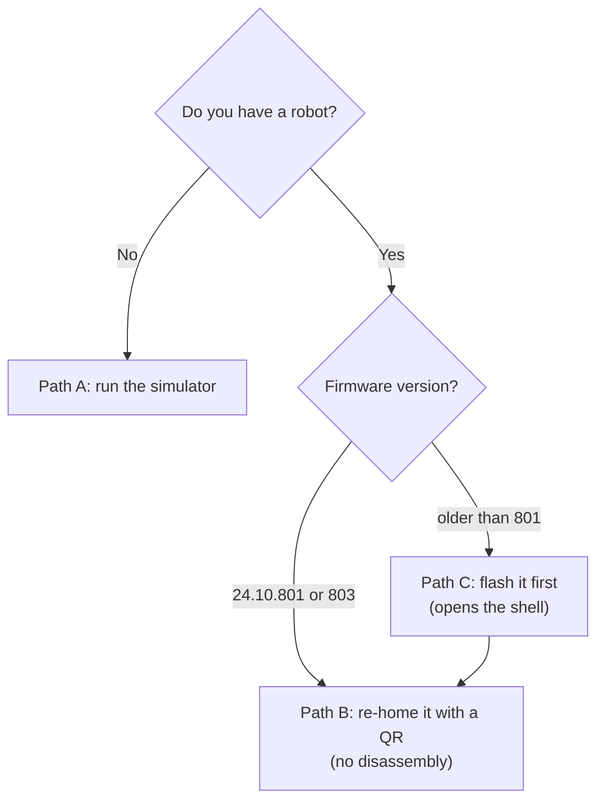

# Revive your Moxie

Get a Moxie that died with the cloud **talking again** on hardware you own — or, with no robot, run the
[simulator](../../sim/README.md) and get the same experience in a browser. Robot details refer to
firmware v3.6.4-Zephyr / OTA v24.10.803 ([reference](../reverse-engineering/firmware/firmware-803-reference.md)).

This is an unofficial fan project, not affiliated with Embodied, Inc.; "Moxie" is their trademark.

## Which path are you on?


```mermaid
flowchart TD
  q{"Do you have a robot?"}
  q -->|"No"| sim["Path A: run the simulator"]
  q -->|"Yes"| fw{"Firmware version?"}
  fw -->|"24.10.801 or 803"| qr["Path B: re-home it with a QR<br/>(no disassembly)"]
  fw -->|"older than 801"| flash["Path C: flash it first<br/>(opens the shell)"]
  flash --> qr
```

All three paths use the same backend, so set that up first.

## 1. Stand up the backend

Follow the [one-command stack](one-command-stack.md): `docker compose up` gives you the broker, the
supervisor and the parent console. Set `MOXIE_LLM_BASE_URL` in `.env` to give Moxie a brain — any
OpenAI-compatible endpoint. Fully offline with Ollama:

```sh
ollama pull llama3.1 && ollama serve
# .env
MOXIE_LLM_BASE_URL=http://host.docker.internal:11434/v1
MOXIE_LLM_API_KEY=ollama
MOXIE_LLM_MODEL=llama3.1
```

The brain speaks as Moxie and emits [behavior markup](../reverse-engineering/runtime/behavior-markup.md),
so Moxie gestures and emotes while it talks. For a real voice and ears, use the compose `voice` and
`stt` profiles (offline) or a [gateway](gateway-voice-and-ears.md).

## Path A: no robot, run the simulator

```sh
docker compose -f sim/docker-compose.yml up     # then open http://localhost:8080/sim.html
```

You get the 3D Moxie, driven by the same protocol a real robot speaks. Click **Connect** for the live
bus, **Listen** to talk, or **Play demo** for a canned conversation with nothing running. The simulator
and a real robot are interchangeable clients of the backend ([why](../architecture/sim-as-a-client.md)).

## Path B: re-home an 801 or 803 robot with a QR

No disassembly. The robot scans a QR that points it at **your** server. On the day, follow the
[bench runbook](bench-runbook.md): the same path step by step, with what each Connection monitor
line means.

1. **Get the robot on Wi-Fi with the Wi-Fi-only code:** the console's **📶 Wi-Fi** tab makes it by
   default ([first-time setup](first-time-setup.md)), and so do Moxie Direct and the setup page below.
   Not a pairing-key code: a pairing key sends the robot looking for the original cloud
   ([live notes](../debugging/live-hardware-debug.md)).
2. **Point it at your backend**: generate an endpoint QR and show it to Moxie's camera.

   **From a phone, nothing installed:** open the [setup page](../../sim/web/setup.html) and make the
   **Wi-Fi** code, then the **server** code. The page builds them in the browser.

   **From a terminal**, the toolkit does the same thing:
   ```sh
   python -m moxie_toolkit.cli endpoint OPEN_MOXIE --png fix.png
   ```
   Both produce identical payloads. `OPEN_MOXIE` (=11) and `EMBODIED_LOCAL` (=8) are built into the
   shipped firmware, so the robot already knows how to use a self-hosted server
   ([QR commands](../reverse-engineering/protocol/qr-commands.md)). The parent console's **Server
   Pairing** tab and `tools/pairing/moxie_endpoint_qr.py` make the same code for your broker.
3. **TLS.** Firmware 803 honors `disable_verify` in the endpoint QR, so the stack's self-signed
   certificate works. Firmware 801 needs a publicly trusted certificate (a real domain and Let's
   Encrypt); the robot does no certificate pinning
   ([network trust](../reverse-engineering/protocol/network-trust.md), [revival path](../architecture/revival-path.md)).
4. **Add it to your account.** Moxie connects to your broker and waits as *pending*. In the
   console's **🤖 Moxie** tab, press **Add to my account**: that lets it in and gives you its robot
   card (settings, insights, memory, Wake, Unpair). Then your brain answers and it talks. This step
   is built and tested against the simulator; no physical robot has done it yet.

**Wi-Fi caveats** (from the firmware): Open / WPA2-PSK / hidden SSIDs work; **WPA3-only, enterprise
802.1X, and captive portals do not** — use a normal WPA2 network or a phone hotspot. 5 GHz works but the
robot is only certified on the **lower U-NII-1 channels (36–48)**
([`fcc-teardown.md`](../reverse-engineering/hardware/fcc-teardown.md)).

## Path C: flash an older robot first

Robots older than 801 have the cloud endpoint **hardcoded to `mqtt.googleapis.com`** with CA-validated
TLS, so **no QR or DNS trick can relocate them** — they need new firmware.

- The bootloader drops to **`rockusb`/`fastboot` on AVB failure**, and the mainboard has a physical
  **`LOAD` button** (confirmed in the FCC internal photos) that enters Rockchip **download mode** — an
  **unsigned** path, so `rkdeveloptool` can flash a `--disable-verification` `vbmeta` plus your images.
- Step-by-step: [`flashing-runbook.md`](../reverse-engineering/firmware/flashing-runbook.md); the physical surface
  (ports, buttons, UART, the STM32 `ISP & DEBUG` header) is in
  [`hardware-access.md`](../reverse-engineering/hardware/hardware-access.md) and
  [`fcc-teardown.md`](../reverse-engineering/hardware/fcc-teardown.md).
- **This opens the shell** and can wipe `/data` (forceencrypt f2fs). It's the honest price for a
  pre-801 unit. Once flashed to 803, **Path B applies**.

> **Still open (bench work):** whether the `LOAD` button and a USB port are reachable **without**
> opening the shell — that would make pre-801 revival no-disassembly too. Tracked in
> [`EXPLORATION-MAP.md`](../reverse-engineering/EXPLORATION-MAP.md#open-items-need-a-bench-unit-or-an-external-artifact).

## Going further
- **Custom software on the robot** — a debug-signed APK in `/system/priv-app` inherits full privileges;
  the only gate is writing the system image ([`firmware-image.md`](../reverse-engineering/firmware/firmware-image.md)).
- **Drive the body directly** — the ZMQ bus + motor protos ([`robot-ipc-protocol.md`](../reverse-engineering/protocol/robot-ipc-protocol.md),
  [`hardware-map.md`](../reverse-engineering/hardware/hardware-map.md)).
- **Serve your own content** — content modules, ChatScript, and the hash-based
  [file-sync protocol](../reverse-engineering/protocol/cloud-protocol.md#file-sync-how-a-server-delivers-content-voice-chatscript).

---
📖 [Field guide](../reverse-engineering/FIELD-GUIDE.md) · [Architecture overview](../architecture/overview.md) · [Simulator](../../sim/README.md) · [Docs index](../README.md)
