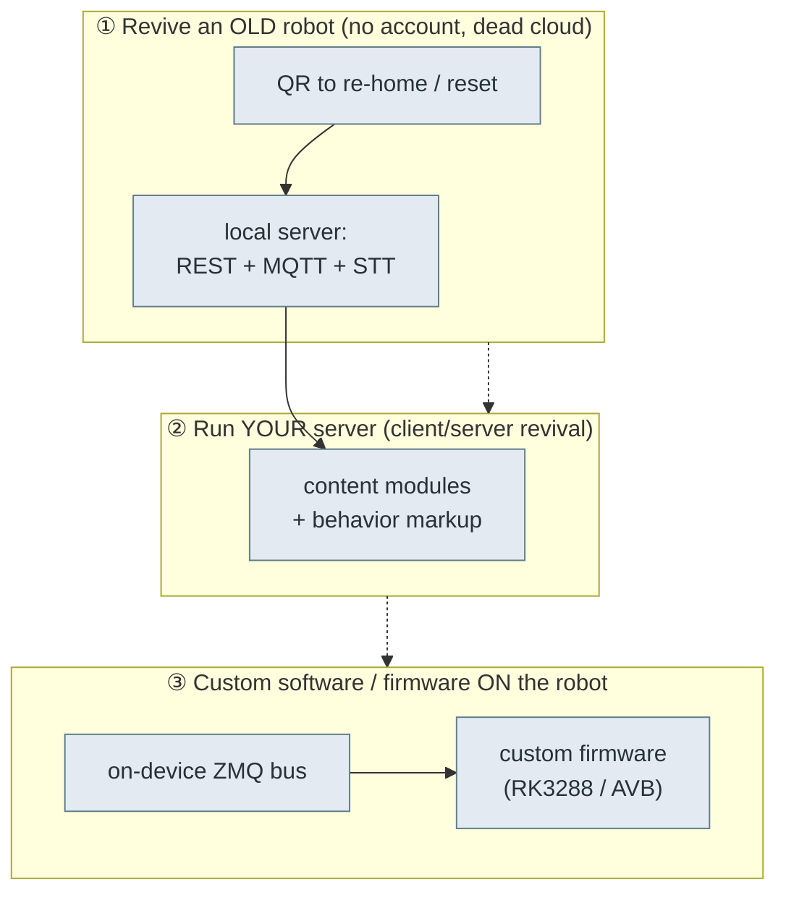

# 🧭 Moxie field guide — revive it, run it, rebuild it

The one-page map of everything reverse-engineered here, organized by what you're trying to do. Each
row links to the deep doc and the tool that does the work. Start here.

## The system at a glance

- **Hardware:** Rockchip **RK3288**, ARMv7, **Android 9**, AVB-signed A/B, verity enforcing,
  `oem_unlock_supported=1`. Body driven by a **"Lizard" MCU** (motors/touch/IMU/LED/battery); face is a
  **DLP projector**; audio via an **XMOS** DSP; conversation via **ChatScript + cloud LLM**.
- **Apps:** `bo-android` (the brain — Unity + native `libbo-*`), `bo-wifi` (setup/QR, Unity),
  `OSUpdate`/`BoUpdater` (A/B OTA), factory `productiontesting.*`.
- **Buses:** on-device **ZeroMQ** (`127.0.0.1:5678/6789`, protobuf) between modules; **MQTT + REST +
  Deepgram-WebSocket** to the cloud.

## ① Revive an old robot — the honest state

| Robot generation | No-disassembly path | Status |
|---|---|---|
| **801+ / 803** | QR `endpoint_update` → `OPEN_MOXIE`/`EMBODIED_LOCAL`, then run your server | ✅ Works. Generate the QR with the toolkit; hold it to the camera. |
| **pre-801 (Google-IoT)** | — | ❌ **Unsolved without opening.** Endpoint pinned to `mqtt.googleapis.com` (TLS hostname-checked) → can't relocate by QR/DNS; a signed OTA can't be delivered over the network; USB/recovery may need the shell open. |

- **Do it:** `python -m moxie_toolkit.cli endpoint OPEN_MOXIE --png fix.png` → show `fix.png` to the robot.
- **Why it works (801+):** an offline robot drops to `STATE_CONFIG` and *scans QR codes* ([`boot-and-launcher.md`](boot-and-launcher.md)); pre-801 still can't relocate off Google.
- **Deep docs:** [`qr-commands.md`](qr-commands.md) · [`ota-and-recovery.md`](ota-and-recovery.md)
- **Open leads (for pre-801):** find a recovery key-combo / external USB port; source a genuine
  signed 803 `update.zip`; characterize pre-801 setup-mode QR behavior. Tracked in
  [`ota-and-recovery.md`](ota-and-recovery.md).

## ② Run your own server (client/server revival)

What the robot expects a backend to provide:

| Piece | Doc | Notes |
|---|---|---|
| Transport | [`cloud-protocol.md`](cloud-protocol.md) | REST `client-service-api.local` (`api/robot-sessions`, `api/ota`), MQTT topics off `BRAIN_BASE_TOPIC`, Deepgram STT over WebSocket. |
| Pairing | [`qr-format.md`](qr-format.md) · [`crypto-and-keys.md`](crypto-and-keys.md) | `PA`+`StartPairingQR`; Ed25519/X25519 one-seed key system. |
| Conversation | [`content-and-conversation.md`](content-and-conversation.md) | Content-module JSON, `RemoteChat` request/response, `volley`/`session` hooks. |
| Making it move | [`behavior-markup.md`](behavior-markup.md) | `<mark cmd:…>` verbs woven into TTS. |
| Phone-app API | [`rest-api.md`](rest-api.md) · [`pairing-and-robot.md`](pairing-and-robot.md) | The parent-app surface. |

- **Do it:** implement the above in [`../../server/`](../../server/) + [`../../mqtt/`](../../mqtt/);
  point the robot at it with an `endpoint_update` QR. OpenMoxie is a working reference.

## ③ Custom software / firmware on the robot

| Layer | Doc / tool | Notes |
|---|---|---|
| Drive the body directly | [`robot-ipc-protocol.md`](robot-ipc-protocol.md) + [`../../tools/robot-toolkit/moxie_toolkit/bus.py`](../../tools/robot-toolkit/moxie_toolkit/bus.py) | `MoxieBus` over ZMQ: publish `lizzerface` motor/LED/power protos, read sensors. `adb forward tcp:5678/6789`. |
| Hardware map | [`hardware-map.md`](hardware-map.md) | Motors, touch/switch/IMU, LED patterns, power rails. |
| Boot/lifecycle | [`boot-and-launcher.md`](boot-and-launcher.md) | The Launcher state machine + component supervision to replicate. |
| Protocol schemas | [`recovered-proto/`](recovered-proto/) | 120 `.proto` files, all compile under `protoc`. |
| Firmware / flashing | [`firmware-image.md`](firmware-image.md) | Partitions, AVB, OEM-unlock, disable-verification, `rkdeveloptool`. |
| Factory line | [`factory-provisioning.md`](factory-provisioning.md) + [`../../tools/robot-toolkit/secrets/`](../../tools/robot-toolkit/secrets/) | Serial/part grammar; secrets = blob XOR package-name (Unicorn extractor). |

- **Minimal-invasive custom personality:** keep stock `vendor`/MCU/DLP plumbing, replace only the app
  layer, and speak the ZMQ + protobuf bus. Full firmware rebuild needs AVB re-signing or an unlocked
  bootloader.

## The toolkit

[`../../tools/robot-toolkit/`](../../tools/robot-toolkit/) — `moxie-qr` (generate/validate/PNG the QR
codes), `MoxieBus` (drive the robot over ZMQ), `markup` (behavior tags), `secrets/` (libsecrets
extractor), and Python bindings for all 120 protos. Validate the QR encoders with
`python -m moxie_toolkit.cli validate` (27 checks incl. byte-parity with the phone-side tool).

---
📖 [Reverse-engineering index](README.md) · [Docs index](../README.md) · [Repo root](../../README.md)
