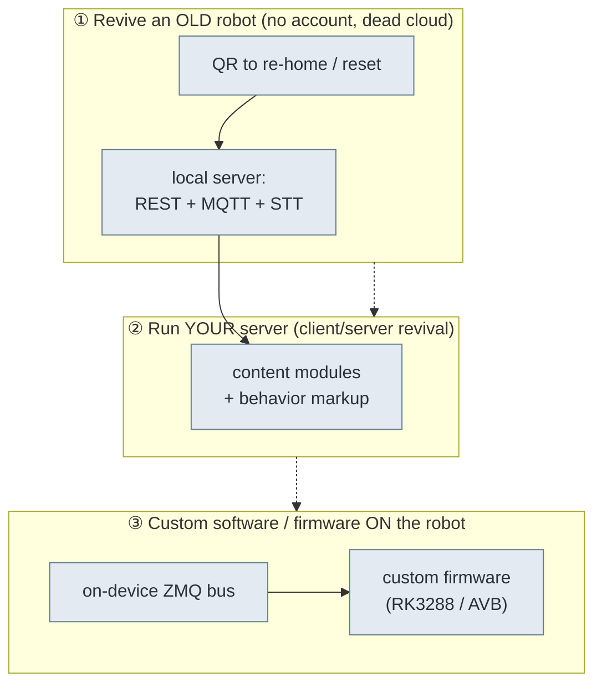

# 🧭 Moxie field guide — revive it, run it, rebuild it

The one-page map of everything reverse-engineered here, organized by what you're trying to do. Each
row links to the deep doc and the tool that does the work. Start here.

> ✅ Progress & gaps: **[COVERAGE.md](COVERAGE.md)**.

## The system at a glance

> 🗺️ For the full picture, see **[architecture-diagrams.md](architecture-diagrams.md)** — a hierarchy of mermaid diagrams from product ecosystem down to hardware buses and motor drivers.

> Analyzed build: **[`v3.6.4-Zephyr` / OTA `v24.10.803`](firmware-803-reference.md)** (RK3288, Android 9, built 2024-12-28) — see the version-stamped reference for exact identifiers and partition hashes.

- **Hardware:** Rockchip **RK3288**, ARMv7, **Android 9**, AVB-signed A/B, verity enforcing,
  `oem_unlock_supported=1`. Body driven by a **"Lizard" MCU** (motors/touch/IMU/LED/battery); face is a
  **DLP projector**; audio via an **XMOS** DSP; conversation via **ChatScript + cloud LLM**.
- **Apps:** `bo-android` (the brain — Unity + native `libbo-*`), `bo-wifi` (setup/QR, Unity),
  `OSUpdate`/`BoUpdater` (A/B OTA), factory `productiontesting.*`.
- **Buses:** on-device **ZeroMQ** (`127.0.0.1:5678/6789`, protobuf) between modules; **MQTT + REST +
  Deepgram-WebSocket** to the cloud.

## Scope: the entire machine, end to end

**This project covers the whole robot — software *and* hardware, non-invasive *and* invasive.** We
tackle it in tiers, cheapest-for-the-owner first, but nothing is off the table:

1. **Tier 1 — no-disassembly** (best for a non-technical owner): QR re-home, network/OTA, config.
   We map this first because if it works, anyone can do it with a phone.
2. **Tier 2 — external ports**: USB (rockusb / fastboot), the UART/TTL **serial console** (`ttyFIQ0`).
3. **Tier 3 — full teardown & flashing**: open the shell, maskrom/loader, `rkdeveloptool`, re-sign or
   disable AVB, solder to test points / TTL headers, JTAG, chip-off if needed.

Tier 1 being "exhausted" for a given robot just means we move down the list — **disassembly and
flashing are planned, expected, and fully in scope**, not a failure. See
[`hardware-access.md`](hardware-access.md) for the physical/flashing surface and
[`firmware-image.md`](firmware-image.md) for building & signing custom images.

## ① Revive an old robot

| Robot generation | Tier-1 (no-open) path | Status | Tier-2/3 (planned) |
|---|---|---|---|
| **801+ / 803** | QR `endpoint_update` → `OPEN_MOXIE`/`EMBODIED_LOCAL`, run your server | ✅ Works — hold a QR to the camera | teardown/flash also available for custom firmware |
| **pre-801 (Google-IoT)** | — | ⚠️ **No no-open path found** (endpoint hardcoded to `mqtt.googleapis.com`, CA-validated cert — see [`network-trust.md`](network-trust.md) — so QR/DNS can't relocate it) | ✅ **Open path works:** teardown → maskrom/`rkdeveloptool` flash to 803 (or custom), then Tier-1 applies. See [`hardware-access.md`](hardware-access.md). |

- **Tier-1 (801+):** `python -m moxie_toolkit.cli endpoint OPEN_MOXIE --png fix.png` → show `fix.png` to the robot.
- **Why Tier-1 works (801+):** an offline robot drops to `STATE_CONFIG` and *scans QR codes* ([`boot-and-launcher.md`](boot-and-launcher.md)); pre-801 simply can't be told a new endpoint over the air.
- **Deep docs:** [`qr-commands.md`](qr-commands.md) · [`ota-and-recovery.md`](ota-and-recovery.md) · [`hardware-access.md`](hardware-access.md)
- **Pre-801 route:** the reliable path is Tier-3 (open + flash). Tier-1/2 leads still worth chasing:
  a recovery key-combo, an externally reachable USB port, a genuine signed 803 `update.zip` — tracked
  in [`ota-and-recovery.md`](ota-and-recovery.md).

## ② Run your own server (client/server revival)

What the robot expects a backend to provide:

| Piece | Doc | Notes |
|---|---|---|
| Transport | [`cloud-protocol.md`](cloud-protocol.md) | REST `client-service-api.local` (`api/robot-sessions`, `api/ota`), MQTT topics off `BRAIN_BASE_TOPIC`, Deepgram STT over WebSocket. |
| TLS trust | [`network-trust.md`](network-trust.md) | CA-validated, no pinning → a real domain + Let's Encrypt cert is trusted. |
| Pairing | [`qr-format.md`](qr-format.md) · [`crypto-and-keys.md`](crypto-and-keys.md) | `PA`+`StartPairingQR`; Ed25519/X25519 one-seed key system. |
| Conversation | [`content-and-conversation.md`](content-and-conversation.md) | Content-module JSON, `RemoteChat` request/response, `volley`/`session` hooks. |
| Making it move | [`behavior-markup.md`](behavior-markup.md) | `<mark cmd:…>` verbs woven into TTS. |
| Hearing & seeing | [`perception-pipeline.md`](perception-pipeline.md) | STT in (Deepgram), TTS out (CloudTTS audio+marks), faces/people/QR events. |
| Phone-app API | [`rest-api.md`](rest-api.md) · [`pairing-and-robot.md`](pairing-and-robot.md) | The parent-app surface. |

- **Do it:** implement the above in [`../../server/`](../../server/) + [`../../mqtt/`](../../mqtt/);
  point the robot at it with an `endpoint_update` QR. OpenMoxie is a working reference.

## ③ Custom software / firmware on the robot

| Layer | Doc / tool | Notes |
|---|---|---|
| Drive the body directly | [`robot-ipc-protocol.md`](robot-ipc-protocol.md) + [`../../tools/robot-toolkit/moxie_toolkit/bus.py`](../../tools/robot-toolkit/moxie_toolkit/bus.py) | `MoxieBus` over ZMQ: publish `lizzerface` motor/LED/power protos, read sensors. `adb forward tcp:5678/6789`. |
| Hardware map | [`hardware-map.md`](hardware-map.md) | Motors, touch/switch/IMU, LED patterns, power rails. |
| Boot/lifecycle | [`boot-and-launcher.md`](boot-and-launcher.md) | The Launcher state machine + component supervision to replicate. |
| Protocol schemas | [`recovered-proto/`](recovered-proto/) | 120 `.proto` files, all compile under `protoc`. |
| Firmware / flashing | [`firmware-image.md`](firmware-image.md) | Partitions, AVB, OEM-unlock, disable-verification, `rkdeveloptool`. |
| Factory line | [`factory-provisioning.md`](factory-provisioning.md) + [`../../tools/robot-toolkit/secrets/`](../../tools/robot-toolkit/secrets/) | Serial/part grammar; secrets = blob XOR package-name (Unicorn extractor). |

- **Minimal-invasive custom personality:** keep stock `vendor`/MCU/DLP plumbing, replace only the app
  layer, and speak the ZMQ + protobuf bus. Full firmware rebuild needs AVB re-signing or an unlocked
  bootloader.

## The toolkit

[`../../tools/robot-toolkit/`](../../tools/robot-toolkit/) — `moxie-qr` (generate/validate/PNG the QR
codes), `MoxieBus` (drive the robot over ZMQ), `markup` (behavior tags), `secrets/` (libsecrets
extractor), and Python bindings for all 120 protos. Validate the QR encoders with
`python -m moxie_toolkit.cli validate` (27 checks incl. byte-parity with the phone-side tool).

---
📖 [Reverse-engineering index](README.md) · [External sources map](external-sources.md) · [Docs index](../README.md) · [Repo root](../../README.md)
