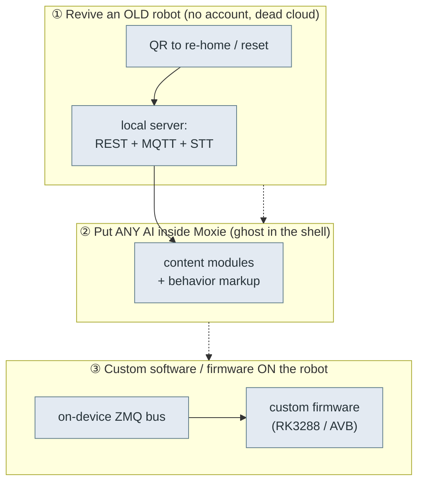

# 🧭 Moxie field guide — revive it, re-brain it, rebuild it

Everything reverse-engineered here, organized by what you want to do: **① revive an old robot**, **② put
your own AI inside Moxie**, or **③ run custom software or firmware on the robot**. Each row links to the
deep doc and the tool that does the work. Robots on firmware 801+ can be re-homed with a QR code and no
disassembly; older (pre-801) robots need the shell opened and a reflash first. Status and remaining gaps
are on the [exploration map](EXPLORATION-MAP.md); the whole system is drawn in the
[architecture diagrams](architecture-diagrams.md).

```mermaid
flowchart TB
  subgraph G1["① Revive an OLD robot (no account, dead cloud)"]
    qr["QR to re-home / reset"] --> srv
  end
  subgraph G2["② Put ANY AI inside Moxie (ghost in the shell)"]
    srv["local server:<br/>REST + MQTT + STT"] --> content["content modules<br/>+ behavior markup"]
  end
  subgraph G3["③ Custom software / firmware ON the robot"]
    bus["on-device ZMQ bus"] --> fw["custom firmware<br/>(RK3288 / AVB)"]
  end
  G1 -.-> G2 -.-> G3
  classDef d fill:#e3eaf2,stroke:#607d8b,color:#263238;
  class qr,srv,content,bus,fw d;
```

## The system at a glance

Analyzed build: **[`v3.6.4-Zephyr` / OTA `v24.10.803`](firmware/firmware-803-reference.md)** (RK3288,
Android 9, built 2024-12-28).

- **Hardware:** Rockchip **RK3288**, ARMv7, **Android 9**, AVB-signed A/B, verity enforcing,
  `oem_unlock_supported=1`. The body is driven by the **"Lizard" MCU** (motors/touch/IMU/LED/battery); the
  face is a **DLP projector**; audio goes through an **XMOS** DSP; conversation is **ChatScript + cloud LLM**.
- **Apps:** `bo-android` (the brain — Unity + native `libbo-*`), `bo-wifi` (setup/QR, Unity),
  `OSUpdate`/`BoUpdater` (A/B OTA), factory `productiontesting.*`.
- **Buses:** on-device **ZeroMQ** (`127.0.0.1:5678/6789`, protobuf) between modules; **MQTT + REST +
  Deepgram WebSocket** to the cloud.

## Scope: the whole machine, in tiers

The project covers software and hardware, non-invasive and invasive, cheapest-for-the-owner first:

1. **Tier 1 — no disassembly:** QR re-home, network/OTA, config. If it works, anyone with a phone can do it.
2. **Tier 2 — external ports:** USB (rockusb / fastboot), the UART/TTL **serial console** (`ttyFIQ0`).
3. **Tier 3 — full teardown and flashing:** maskrom/loader, `rkdeveloptool`, re-signing or disabling AVB,
   test points / TTL headers, JTAG, chip-off if needed.

Running out of Tier-1 options for a robot means moving down the list; disassembly and flashing are fully
in scope. See [`hardware-access.md`](hardware/hardware-access.md) and [`firmware-image.md`](firmware/firmware-image.md).

## ① Revive an old robot

| Robot generation | Tier-1 (no-open) path | Status | Tier-2/3 |
|---|---|---|---|
| **801+ / 803** | QR `endpoint_update` → `OPEN_MOXIE` / `EMBODIED_LOCAL`, run your server | ✅ Works — hold a QR to the camera | teardown/flash also available for custom firmware |
| **pre-801 (Google IoT)** | — | ⚠️ No no-open path: endpoint hardcoded to `mqtt.googleapis.com` with a CA-validated cert ([`network-trust.md`](protocol/network-trust.md)), so QR/DNS can't relocate it | ✅ Teardown → maskrom/`rkdeveloptool` flash to 803 (or custom), then Tier 1 applies ([`hardware-access.md`](hardware/hardware-access.md)) |

- **Tier 1 (801+):** from `tools/robot-toolkit/`, run `python -m moxie_toolkit.cli endpoint OPEN_MOXIE --png fix.png`
  and show `fix.png` to the robot.
- **Why it works:** an offline robot drops to `STATE_CONFIG` and scans QR codes
  ([`boot-and-launcher.md`](firmware/boot-and-launcher.md)); a pre-801 robot can't be told a new endpoint over the air.
- **Pre-801 leads still worth chasing** (tracked in [`ota-and-recovery.md`](firmware/ota-and-recovery.md)):
  a recovery key combo, an externally reachable USB port, a genuine signed 803 `update.zip`.
- **Deep docs:** [`qr-commands.md`](protocol/qr-commands.md) · [`ota-and-recovery.md`](firmware/ota-and-recovery.md) ·
  [`flashing-runbook.md`](firmware/flashing-runbook.md) · [`hardware-access.md`](hardware/hardware-access.md)

## ② Put your own AI inside Moxie — the ghost in the shell

Everything Moxie says and does — every line, mood, gaze and body move — is decided by a **brain behind a
documented seam**: each turn the robot sends a [`RemoteChatRequest`](protocol/remote-chat-protocol.md) and
performs the `RemoteChatResponse` that comes back (text + `markup` + `mood` + navigation actions). Anything
that answers that contract *is* Moxie's mind — a ChatScript clone, an LLM, an agent, your own model. The
heavy on-device ML (`libbo-brain`, vision, fusion) is [out of process behind the ZMQ bus](runtime/native-boundary.md),
so a new brain replaces it by speaking the bus/RemoteChat, never by reimplementing it.

The minimum viable brain returns `RemoteChatResponse{result:SUCCESS, output:{text, markup}}` and Moxie
speaks it; a fuller brain sets mood, drives activities (`launch`/`exit`/`execute`), moderates input, and streams.

| Piece | Doc | Notes |
|---|---|---|
| Transport | [`cloud-protocol.md`](protocol/cloud-protocol.md) | REST `client-service-api.local` (`api/robot-sessions`, `api/ota`), MQTT topics off `BRAIN_BASE_TOPIC`, Deepgram STT over WebSocket. |
| TLS trust | [`network-trust.md`](protocol/network-trust.md) | CA-validated, no pinning → a real domain + Let's Encrypt cert is trusted. |
| Pairing | [`qr-format.md`](phone/qr-format.md) · [`crypto-and-keys.md`](phone/crypto-and-keys.md) | `PA` + `StartPairingQR`; Ed25519/X25519 one-seed key system. |
| Conversation | [`content-and-conversation.md`](runtime/content-and-conversation.md) | Content-module JSON, `RemoteChat` request/response, `volley`/`session` hooks. |
| Making it move | [`behavior-markup.md`](runtime/behavior-markup.md) | `<mark cmd:…>` verbs woven into TTS. |
| Hearing and seeing | [`perception-pipeline.md`](runtime/perception-pipeline.md) | STT in (Deepgram), TTS out (CloudTTS audio + marks), faces/people/QR events. |
| Phone-app API | [`rest-api.md`](phone/rest-api.md) · [`pairing-and-robot.md`](phone/pairing-and-robot.md) | The parent-app surface. |

**Do it:** the transport is implemented in [`server/`](../../server/) + [`mqtt/`](../../mqtt/); put your AI
behind the RemoteChat seam (the implementation contract is the [AI seam spec](../architecture/ai-seam.md))
and point the robot at it with an `endpoint_update` QR. OpenMoxie is a working community reference for the
compatible-server floor.

## ③ Custom software / firmware on the robot

| Layer | Doc / tool | Notes |
|---|---|---|
| Drive the body directly | [`robot-ipc-protocol.md`](protocol/robot-ipc-protocol.md) + [`bus.py`](../../tools/robot-toolkit/moxie_toolkit/bus.py) | `MoxieBus` over ZMQ: publish `lizzerface` motor/LED/power protos, read sensors. `adb forward tcp:5678/6789`. |
| Hardware map | [`hardware-map.md`](hardware/hardware-map.md) | Motors, touch/switch/IMU, LED patterns, power rails. |
| Boot/lifecycle | [`boot-and-launcher.md`](firmware/boot-and-launcher.md) | The Launcher state machine + component supervision to replicate. |
| Protocol schemas | [`recovered-proto/`](protocol/recovered-proto/) | 120 `.proto` files, all compile under `protoc`. |
| Firmware / flashing | [`firmware-image.md`](firmware/firmware-image.md) | Partitions, AVB, OEM unlock, disable-verification, `rkdeveloptool`. |
| Factory line | [`factory-provisioning.md`](firmware/factory-provisioning.md) + [`secrets/`](../../tools/robot-toolkit/secrets/) | Serial/part grammar; secrets = blob XOR package name (Unicorn extractor). |

The least invasive custom personality keeps the stock `vendor`/MCU/DLP plumbing, replaces only the app
layer, and speaks the ZMQ + protobuf bus. A full firmware rebuild needs AVB re-signing or an unlocked bootloader.

## The toolkit

[`tools/robot-toolkit/`](../../tools/robot-toolkit/) — `moxie-qr` (generate/validate/decode the QR codes),
`MoxieBus` (drive the robot over ZMQ), `cloud` (MQTT topics, RemoteChat/config builders), `markup`
(behavior tags), `protoref` (query the 120 protos), and `secrets/` (libsecrets extractor). Run from
`tools/robot-toolkit/`: `python -m moxie_toolkit.cli validate` (27 QR checks, incl. byte parity with the
phone-side tool) and `python run_tests.py` (12 round-trip tests).

---
📖 [Reverse-engineering index](README.md) · [Exploration map](EXPLORATION-MAP.md) · [External sources](external-sources.md) · [Docs index](../README.md) · [Repo root](../../README.md)
