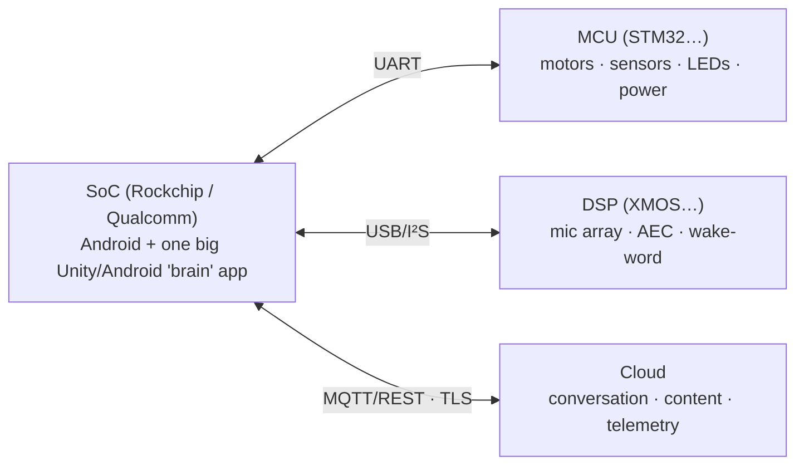

# 🧭 The Android-robot revival playbook

> How we reverse-engineered and revived the **Moxie** robot end-to-end — generalized so a new team (and
> their AI agents) can repeat it on *another* Android-computer robot. Where [`METHODOLOGY.md`](METHODOLOGY.md)
> is the tool-tier reference for *this* firmware (`v24.10.803`), this is the **transferable story + method**.
> The step-by-step recipes are packaged as invokable skills in [`.claude/skills/`](../../.claude/skills/)
> (start with `reverse-engineering-android-robots`).

## Why this generalizes
A huge class of consumer robots and smart appliances share one architecture:

If your target looks like this, the **method, tool recipes, and doc discipline here transfer directly** —
only the specific parts/paths change. Frame the whole effort toward three concrete goals; they keep it
honest and prioritized:

1. **Build custom firmware / run custom software on the device.**
2. **Client/server revival** — a self-hosted backend the device talks to (replace the dead cloud).
3. **Revive units without disassembly** — the no-open paths (a re-homing QR, a config push, an OTA).

## The mindset (what actually mattered)
- **Clean-room.** Work only from shipped, freely-distributed binaries; ship no vendor source. The bar:
  *if every original binary/asset vanished, could someone rebuild this piece from your doc alone?* Capture
  the data (tables, constants, algorithms) — don't point at it. Track it in a self-sufficiency register.
- **Confirmed vs inferred.** A symbol name proves a *capability*; the exact value/trigger needs the next
  tool tier. Never restate a guess as fact. (We had "observed" values that were simply **wrong** until
  decompiled — e.g. an audio channel we'd called "music" was `FX`.)
- **"Named but not enumerated."** The single most productive lens: code names a mechanism (a command verb,
  an event, a config key, an error) but leaves the actual **set** in the binary. Hunting that set —
  hardcoded `string[]` arrays, enums, dispatch tables — is where most high-value findings came from (the 52
  vocal gestures, the audio/error enums, the closed QR command set).
- **Escalate tools light → heavy.** Most answers fall to `grep`/`strings`/`nm`. Reach for a decompiler only
  when data-flow defeats you.
- **Small, shippable, honest.** One thread per iteration. If nothing is genuinely new, say so — don't pad.

## The arc (how the Moxie project actually unfolded — a reusable order)
1. **The easy client first.** We started with the *phone app* (freely downloadable): clean-room recovered
   its REST API, its one-seed crypto, and the pairing-QR wire format → a working local **server** + QR
   tooling. Fast confidence, and it defined the cloud seam.
2. **The cloud/comms layer.** The MQTT topic map (Google IoT-Core convention), TLS trust (CA-validated, not
   pinned → a real cert works), the device-auth JWT, and the endpoint/relocation config → the spec a
   revival server answers.
3. **The firmware teardown.** Unpacked the images; inventoried apps/libs/init/permissions; decompiled the
   Unity **brain** (`Assembly-CSharp`) — the richest artifact by far — and the native `libbo-*` libs.
4. **The protocol, recovered exactly.** Extracted the embedded protobuf `FileDescriptorProto`s → **120
   `.proto` files** (376 messages), compile-clean and byte-parity-verified against a community server. This
   is the wire source-of-truth and powers the toolkit + simulator.
5. **Depth, layer by layer.** ~40 focused passes over the brain: behavior tree + markup, face animation,
   perception/gaze/turn-taking, task scheduler + action arbiter, the native boundary, the multi-processor
   firmware map, telehealth, content delivery. Each pass: one thread, documented deeply, stamped, verified.
6. **The heavy tier when stuck.** For GOT-indirected native dispatch we brought in **Ghidra (via PyGhidra)**
   and closed the exact QR command router; **UnityPy** pulled the face mesh's blendshape set.
7. **Publish + keep it coherent.** A static docs explorer over a reproducible bundle, with mechanical guards
   (links + anchors, consistency, mermaid, headless), a README hierarchy, and a top-down consistency SOP so
   the message stays consistent root-to-leaf.

## The method, step by step (each is a skill)
| Phase | Skill | Output |
|---|---|---|
| Acquire + unpack firmware, inventory | `unpacking-android-firmware` | partitions, apps, libs, init, sysconfig, device-tree |
| Decompile the app layer | `decompiling-android-apps` | the brain logic, setup/factory flows |
| Decompile native libs | `decompiling-native-arm-libraries` | native dispatch, the hardware C API |
| Recover the wire protocol | `recovering-protobuf-schemas` | exact, wire-compatible `.proto` |
| Extract Unity assets | `extracting-unity-assets` | meshes/blendshapes, clips, textures |
| Map the hardware | `mapping-robot-hardware` | device-tree, the multi-processor + update paths |
| Document + verify | `publishing-moxie-docs` (adapt) | a navigable, guarded doc tree |

## What saved (and wasted) the most time
- **Decompile before you hunt.** Our biggest false-start was an *empirical* pre-decompilation QR-command
  search (an acoustic "does the robot react" rig). Once we decompiled the setup app, the whole command set
  was a closed `if/else` — obvious in minutes. **Read the code before probing the black box.**
- **The managed C# is the jackpot.** For a Mono-Unity device, `Assembly-CSharp` yields enums, vocabularies,
  the native-call boundary, and every protobuf type name. Grep it first for anything managed.
- **Protobuf descriptors are free.** Don't hand-write schemas from field observations — extract the embedded
  descriptors and you get the exact IDL.
- **PyGhidra, not Java scripts,** on a JRE-only host; reuse the analyzed project; resolve string refs *from*
  the function (GOT indirection makes `getReferencesTo` empty). These three gotchas cost hours before we
  wrote them down — now in `decompiling-native-arm-libraries`.
- **Guardrails beat vigilance.** A reproducible bundle + a link/anchor checker + a stale-claim consistency
  guard caught drift mechanically that manual review missed (they once flagged 74 broken deep-links).
- **Honesty compounds.** Marking findings confirmed-vs-inferred, and refusing to manufacture commits, kept
  the docs trustworthy — which is the whole point of a clean-room reference.

## Reuse what Moxie produced
The *code* won't port to a different robot, but it's a complete worked reference: the recovered protocol +
toolkit (`tools/robot-toolkit/`, see `using-the-moxie-toolkit`), a self-hosted server + broker + AI seam
(`server/`, `mqtt/`, `ai/`), a browser **simulator** that speaks the real protocol (`sim/`), and the full
clean-room docs ([`README.md`](README.md) + [`COVERAGE.md`](COVERAGE.md)). Fork the *shape*, not the bytes.

---
📖 [Reverse-engineering index](README.md) · [Methodology](METHODOLOGY.md) · [Coverage](COVERAGE.md) · [Field guide](FIELD-GUIDE.md) · [Docs index](../README.md)
