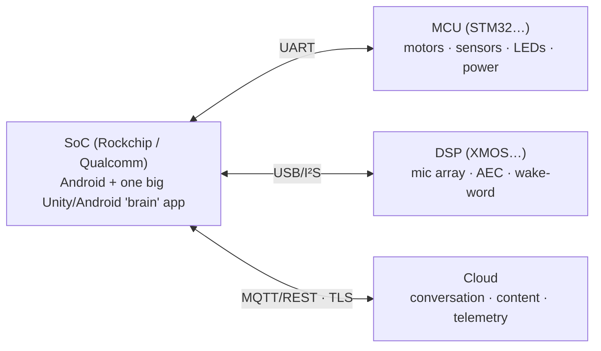

# 🧭 Playbook — how we reverse-engineer Moxie (and how to repeat it)

How every fact in this folder was produced, so anyone can reproduce or extend it, and so a new team can
repeat the method on another Android-computer robot. It covers the evidence base, the tool tiers (light
to heavy, up to Ghidra), the per-iteration loop every session runs, and the lessons that saved the most
time. Everything is clean-room: facts and schemas from shipped, freely-distributed binaries, no Embodied
source. Robot-side docs describe firmware **`v3.6.4-Zephyr` / OTA `v24.10.803`** — keep that stamp on new
pages. The step-by-step recipes are packaged as invokable skills in [`.claude/skills/`](../../.claude/skills/)
(start with `reverse-engineering-android-robots`).

## Why this generalizes

Many consumer robots and smart appliances share one architecture:


```mermaid
flowchart LR
  soc["SoC (Rockchip / Qualcomm)<br/>Android + one big Unity/Android 'brain' app"]
  soc <-->|UART| mcu["MCU (STM32…)<br/>motors · sensors · LEDs · power"]
  soc <-->|USB/I²S| dsp["DSP (XMOS…)<br/>mic array · AEC · wake-word"]
  soc <-->|MQTT/REST · TLS| cloud["Cloud<br/>conversation · content · telemetry"]
```

If your target looks like this, the method, tool recipes and doc discipline transfer directly; only the
parts and paths change. Frame the work toward three goals — they keep it honest and prioritized:

1. **Custom firmware / custom software on the device.**
2. **Client/server revival** — a self-hosted backend the device talks to (replace the dead cloud).
3. **Revive units without disassembly** — the no-open paths (a re-homing QR, a config push, an OTA).

## Principles

- **Clean-room sufficiency.** Ship no vendor source. The test for every doc: *if every Moxie binary,
  image and asset vanished, could someone rebuild this piece from the doc alone?* Capture the data
  (schemas, tables, constants, algorithms) — don't point at it. Out-of-scope data (voice, content, ML
  weights a revival replaces) is a gap only if the doc pretends to cover it. The per-subsystem answer is
  tracked in the [exploration map](EXPLORATION-MAP.md#clean-room-self-sufficiency-what-would-go-missing).
- **Confirmed vs inferred.** Mark every finding as **confirmed** (read from the binary) or **inferred**.
  A symbol name proves a *capability*; the exact trigger or value often needs the next tool tier. Never
  upgrade a guess by restating it — escalate the tool or label it. (Example: an audio channel once
  called "music" was `FX` once decompiled.)
- **"Named but not enumerated."** Code names a mechanism (a command verb, an event, a config key, an
  error) but leaves the actual **set** in the binary. Hunting that set — hardcoded `string[]` arrays,
  enums, dispatch tables — produced most high-value findings (the 52 vocal gestures, the audio/error
  enums, the closed QR command set).
- **Lightest tool first.** Most answers fall to `grep`/`strings`/`nm`; use a decompiler only when
  data-flow defeats you.
- **Small and honest.** One thread per iteration. If nothing is genuinely new, say so; don't pad.

## The evidence base

The analysis workspace lives **outside the repo** (`work/`, one level up from the repo checkout) and is
never committed — only the facts extracted from it are.

| Artifact | Where (under `work/`) | What it is |
|---|---|---|
| Partition images | `firmware-re/{system.img, oem.img, parts/vendor.img, parts/boot.img, …}` | the factory OS — read with `debugfs` (ext4) / `unpackbootimg` |
| Robot apps | `firmware-re/extract/apps/*.apk` (`bo-android`, `bo-wifi`, `productiontesting.*`, …) | the on-device APKs pulled from the images |
| Decompiled C# | `firmware-re/extract/csharp/src-asm/Assembly-CSharp.decompiled.cs` (7 MB) | the Unity **brain** (`bo-android`) — 2750 classes |
| Decompiled Java | `firmware-re/out/<app>/sources/…` | jadx output for the DEX apps |
| Native libs | each APK's `lib/armeabi-v7a/*.so` | the `libbo-*` modules + support libs |
| Recovered protos (in repo) | [`protocol/recovered-proto/`](protocol/recovered-proto/) | the wire contract; all compile under `protoc` |

## The tool tiers — light to heavy

1. **Filesystem / images** — `debugfs -R 'ls -l /…' system.img` and `debugfs -R 'cat /path' …` read files
   without mounting; `unpackbootimg` for `boot.img`. Inventory, init scripts, permissions, props.
2. **Android / Java** — `work/tools/jadx/bin/jadx` (DEX → Java); `apktool` for resources/manifest. The
   factory apps, `bo-wifi` and Java services decompile cleanly here.
3. **Unity / C#** — `ilspycmd` (with `export DOTNET_ROOT=$HOME/.dotnet PATH=$HOME/.dotnet:$PATH
   DOTNET_ROLL_FORWARD=LatestMajor`; venv at `work/firmware-re/extract/csharp/.venv`) → the managed brain.
4. **Native: symbols and strings** — `nm -D` / `readelf -d -sW` / `strings -a` / `c++filt`. Exports,
   `SONAME`/`NEEDED`, log tags, demangled class and method names — enough to identify a `.so` and its API
   (how the [native module roster](runtime/native-boundary.md#the-full-module-roster-what-each-remaining-bo-so-actually-is)
   was mapped).
5. **Native: disassembly** — **capstone** (in the venv; `Cs(CS_ARCH_ARM, CS_MODE_THUMB)`). Resolves
   `ldr [pc]` / `movw+movt` literal loads to strings; good for one function's control flow. **Blind to
   GOT-indirected data and dispatch tables** — a `strings` hit is not proof a value is a live dispatch key.
6. **Native: decompilation (Ghidra)** — full pseudocode with cross-references and string/data flow, plus
   real variable/type names when the `.so` carries **DWARF** (several `libbo-*` do). The tool for hard
   native questions such as the `QRCommand` string → handler dispatch in `libbo-logger`.

### Using Ghidra (via PyGhidra)

Ghidra is installed at `work/tools/ghidra/`. **Use PyGhidra, not Ghidra's own scripts:** the host has a
**JRE, not a JDK** (no `javac`), so Java GhidraScripts won't compile, and Ghidra 12 dropped Jython, so
`.py` GhidraScripts need PyGhidra anyway. PyGhidra (installed from Ghidra's bundled wheel into the venv)
drives the same API from CPython:

```bash
VENV/bin/pip install work/tools/ghidra/Ghidra/Features/PyGhidra/pypkg/dist/pyghidra-*.whl   # once
GHIDRA_INSTALL_DIR=work/tools/ghidra  VENV/bin/python decompile.py
```
```python
import pyghidra; pyghidra.start()
from ghidra.base.project import GhidraProject
from ghidra.app.decompiler import DecompInterface
proj = GhidraProject.openProject(PROJ_DIR, "proj", True)      # reuse a prior analysis (fast)
program = proj.openProgram("/", "libbo-logger.so", False)
di = DecompInterface(); di.openProgram(program)
for f in program.getFunctionManager().getFunctions(True):
    if f.getName() in TARGETS:
        print(di.decompileFunction(f, 180, monitor).getDecompiledFunction().getC())
```

- **Import + auto-analyze once** with `analyzeHeadless <proj> <name> -import <so> -processor
  ARM:LE:32:v7` (minutes and GBs of RAM for a ~60 MB module — run it in the background), then re-open the
  saved project read-only and decompile **named targets**.
- **Resolve strings from the function** (`getReferencesFrom()` into `.rodata`); `getReferencesTo` on a
  string is often empty because of GOT indirection.
- **One JVM at a time.** A killed run leaves the project locked; clear stray `java` processes first.

**Worked example.** The [QR command router](protocol/qr-commands.md#the-effective-command-set-native-dispatch-rightpointon_qrcommand):
capstone showed `on_QRCommand` spawning a worker but couldn't resolve the dispatch strings; PyGhidra
decompiled the body and its `.rodata` refs, proving the closed set (`report` / `endpoint_update` / `om`,
else *"Unknown QR Diagnostic Command"*).

## The per-iteration loop

Every reverse-engineering session runs the same cycle:

1. **Read the plan** — `work/firmware-re/progress/PLAN.md` (status / next / blockers; outside the repo).
2. **Check before writing** — the [exploration map](EXPLORATION-MAP.md) and the existing docs. Don't
   re-document; pick the next genuinely open thread.
3. **Reverse-engineer** with the lightest sufficient tier; escalate to Ghidra for hard native questions.
4. **Write** detailed, `v24.10.803`-stamped findings into the right subfolder (phone / protocol / runtime
   / firmware / hardware) with a back-link.
5. **Push it upward** — the [top-down consistency pass](../README.md#-how-this-documentation-tree-is-maintained-sop):
   the subfolder README, this folder's [README](README.md), the exploration map, and — if the story
   changes — `docs/README.md` and the root `README.md`.
6. **Rebuild + verify** — `python3 sim/tools/build_docs_bundle.py`, `node sim/test_docs.mjs`,
   `python3 scripts/check-doc-links.py`, `python3 scripts/check-doc-consistency.py`.
7. **Commit**, then update `PLAN.md`.

## Phases and the skill for each

| Phase | Skill | Output |
|---|---|---|
| Acquire + unpack firmware, inventory | `unpacking-android-firmware` | partitions, apps, libs, init, sysconfig, device-tree |
| Decompile the app layer | `decompiling-android-apps` | the brain logic, setup/factory flows |
| Decompile native libs | `decompiling-native-arm-libraries` | native dispatch, the hardware C API |
| Recover the wire protocol | `recovering-protobuf-schemas` | exact, wire-compatible `.proto` |
| Extract Unity assets | `extracting-unity-assets` | meshes/blendshapes, clips, textures |
| Map the hardware | `mapping-robot-hardware` | device-tree, the multi-processor layout + update paths |
| Document + verify | `publishing-moxie-docs` (adapt) | a navigable, guarded doc tree |

A productive order, as it worked on Moxie:

1. **The easy client first** — the freely downloadable phone app: REST API, one-seed crypto, pairing-QR
   format → a working local server and QR tooling. It also defines the cloud seam.
2. **The cloud layer** — MQTT topic map (Google IoT-Core convention), TLS trust (CA-validated, not
   pinned), device-auth JWT, endpoint relocation → the spec a revival server answers.
3. **The firmware** — unpack the images, inventory apps/libs/init/permissions, decompile the Unity brain
   (`Assembly-CSharp`, the richest artifact by far) and the native `libbo-*` libs.
4. **The protocol, exactly** — extract the embedded `FileDescriptorProto`s → 120 `.proto` files (382
   messages), compile-clean and cross-checked against a community server.
5. **Depth, layer by layer** — behavior tree + markup, face animation, perception/gaze/turn-taking, task
   scheduler + action arbiter, native boundary, hardware map, telehealth, content delivery.
6. **The heavy tier when stuck** — PyGhidra for GOT-indirected dispatch; UnityPy for the face mesh.
7. **Publish with guards** — a static docs explorer over a reproducible bundle, plus link/anchor,
   consistency and mermaid checks.
8. **Distill into a build spec** — the [architecture spec layer](../architecture/README.md): small,
   standalone implementation contracts (REST, MQTT, AI seam, config/telemetry, content, sim-as-client)
   that cite the study. The study stays as reference; the contracts are what you build from.

## Lessons

- **Decompile before you probe.** An early empirical QR-command search (watching whether the robot
  reacted) was wasted effort; the decompiled setup app showed the whole command set as a closed
  `if/else` in minutes.
- **The managed C# is the jackpot.** For a Mono-Unity device, `Assembly-CSharp` yields enums,
  vocabularies, the native-call boundary and every protobuf type name. Grep it first.
- **Protobuf descriptors are free.** Extract the embedded descriptors instead of hand-writing schemas.
- **PyGhidra on a JRE-only host; reuse the analyzed project; resolve string refs from the function.**
- **Guards beat vigilance.** A reproducible bundle plus link/anchor and stale-claim checkers catch drift
  that manual review misses.

## Reuse what Moxie produced

The code won't port to a different robot, but it is a complete worked reference: the recovered protocol
+ toolkit ([`tools/robot-toolkit/`](../../tools/robot-toolkit/), skill `using-the-moxie-toolkit`), a
self-hosted server + broker + AI seam ([`server/`](../../server/), [`mqtt/`](../../mqtt/),
[`ai/`](../../ai/)), a browser simulator that speaks the real protocol ([`sim/`](../../sim/)), and these
docs. Fork the shape, not the bytes.

---
📖 [Reverse-engineering index](README.md) · [Exploration map](EXPLORATION-MAP.md) · [Field guide](FIELD-GUIDE.md) · [Docs index](../README.md)
