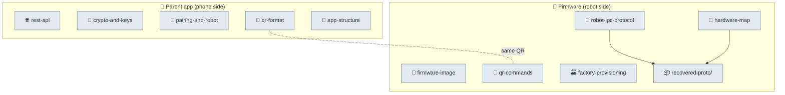

# 🔬 Reverse-engineering (source of truth)

Clean-room maps of the Moxie system, in two halves. **Phone side:** the decompiled parent app
(`com.embo.embodied.parent` v2.2.2). **Robot side:** the on-device firmware (RK3288 Android 9) and
its `bo-*` apps, read from the factory partition images. No Embodied source is included — only
observed facts and schemas reconstructed from shipped binaries. Everything else in the repo derives
from these.

> ✅ **[Coverage matrix](COVERAGE.md)** — what's documented per goal + the honest remaining gaps.
>
> 🗺️ **[Exploration map](EXPLORATION-MAP.md)** — the source-surface view: every proto namespace, C# subsystem, image, app & native lib with its status (✅/🟡/⬜) and covering doc — *what we've examined and what's still open*.

> 🗺️ **See the [architecture diagrams](architecture-diagrams.md)** — the whole system as a hierarchy of mermaid diagrams, product level down to motor drivers.

> 📇 **Firmware analyzed: [`v3.6.4-Zephyr` / OTA `v24.10.803`](firmware/firmware-803-reference.md)** — the version-stamped reference (identifiers, partition hashes, app + native-lib inventory). All robot-side docs describe this build.

> 🧭 **New here? Start with the [FIELD-GUIDE](FIELD-GUIDE.md)** — everything below, organized by what you want to do (revive an old robot · run your own server · custom firmware).

### 📱 Phone side — the parent app (`phone/`)

- [`rest-api.md`](phone/rest-api.md) — every endpoint, the passwordless-email→OAuth flow, headers, token shapes.
- [`crypto-and-keys.md`](phone/crypto-and-keys.md) — the one 32-byte seed (Argon2id) → Ed25519/X25519/secretbox, recovery keys, E2E encryption.
- [`pairing-and-robot.md`](phone/pairing-and-robot.md) — the pairing handshake, Wi-Fi provisioning, robot control API.
- [`qr-format.md`](phone/qr-format.md) — the exact pairing-QR wire format (protobuf + legacy JSON), as the phone emits it.
- [`app-structure.md`](phone/app-structure.md) — manifest, components, third-party SDKs, package inventory.

### 🔌 Protocol — the robot↔server & on-device wire (`protocol/`)

- [`robot-ipc-protocol.md`](protocol/robot-ipc-protocol.md) — the on-device **ZeroMQ + protobuf** message bus that wires the modules together; the module map and behavior-command markup.
- [`cloud-protocol.md`](protocol/cloud-protocol.md) — the robot↔backend surface (REST `client-service`, MQTT topics, Deepgram STT, the chat envelope) — **what a self-hosted server must implement**.
- [`remote-chat-protocol.md`](protocol/remote-chat-protocol.md) — the **per-turn robot↔brain conversation RPC** (`RemoteChat.proto`): the full `RemoteChatResponse` contract a self-hosted brain returns — `output{text,markup,mood,dialog_act,emotion,sentiment}`, **action commands** (`launch`/`exit_module`/`execute`/`sleep`/`tangent`) that drive activity navigation, the `input.safety` **moderation verdict**, `RemoteChatMetrics`, the 10 `ResultCode`s, streaming, and the dialog-act/emotion/signal taxonomies.
- [`device-config-and-telemetry.md`](protocol/device-config-and-telemetry.md) — the **`embodied.logging` data-model**: `RobotCloudConfig` (the master config the cloud pushes — child/bedtime/alarms/volume/OTA/privacy), `RobotStatus`, the `Packet`/`Log*` **telemetry envelope**, the `LoggingPolicy` (`NO_DATA`/`NO_MEDIA`/`FULL`) data-collection gate, the `CloudStatus.UserState` pairing lifecycle, and the `IOTEndpoint` taxonomy (incl. `EMBODIED_LOCAL`/`OPEN_MOXIE`).
- [`runtime-control.md`](protocol/runtime-control.md) — the **imperative runtime-control surface**: bus commands that change a *running* brain live (vs. the declarative config) — `SystemVolumeModify` (abs/relative), `SystemSlowInputModify` (accessibility pacing), `ChatbotListeningRequest` (force listen), `AllowCutoffEvent` (barge-in gate), `SoftReset`/`HardReset`, and the ChatScript lifecycle.
- [`power-and-system-events.md`](protocol/power-and-system-events.md) — the **power lifecycle protocol**: the authoritative `PowerStatePB` state enum (11 states, 0–10), the `ResumeCause` wake taxonomy, `RESTART_XMOS` co-processor recovery, and the `embodied.sys` status events (Wi-Fi vs internet, STT/OTA health, shutdown, the unpair/telehealth **disengage** flow, and **time/timezone/wake-alarms** — `TimeZoneInfo` (Olson id) + `UserAlarmRequest`/`UserAlarmTriggered`, the on-device implementation of the cloud `WakeSchedule`/bedtime).
- [`perception-fusion.md`](protocol/perception-fusion.md) — the **fused world-model of people**: `libbo-fusion.so` ties face + body + voice (DOA/VAD/STT) into one tracked `FusedPersonPB` with 3D **world** + **screen** coordinates, per-eye landmarks, head pose, engagement, and a **translation-aware** speech model, plus the person-level event stream (added/removed/moved, started/stopped-speaking with STT-vs-VAD source, smiled, engaged/disengaged) the brain reasons over.
- [`offline-and-brain-state.md`](protocol/offline-and-brain-state.md) — **offline behavior + persisted brain state** (`embodied.robotbrain.serialized`): the `FallbackInfo` tree Moxie serves on `ERROR_OFFLINE` (with the 6-option `FallbackOptions` strategy + the `FallbackType` decision), pushed by the server via `upgrade_fallbacks`; `CSData` (the reboot-surviving resume point); and `UserRecommendationData` (the recommender's persisted tag-history + RNG state). Why a stuck robot still talks with no backend.
- [`telehealth.md`](protocol/telehealth.md) — the **remote-puppet ("TeleBrain") protocol**: `STATE_TELEBRAIN` runs perception + MAINAPP with **no local brain** while a remote operator drives Moxie via `TeleHealth.proto` (`START_SESSION`/`PLAY_OUTPUT`/`INTERRUPT`), `Output{text, markup}` over MQTT.
- [`qr-commands.md`](protocol/qr-commands.md) — the **complete QR grammar** the robot scans (pairing / VPN / debug-factory commands), read from `bo-wifi`.
- [`network-trust.md`](protocol/network-trust.md) — the TLS trust model: **CA-store validation, no pinning**; what cert a self-hosted server needs, and the precise pre-801 block.
- [`unity-mainapp-interface.md`](protocol/unity-mainapp-interface.md) — the **MAINAPP (Unity front-end) protocol** (`embodied.unity`): the complete map of the seam between the brain logic and the Unity face/audio/camera app — app lifecycle (`MainAppStatus`/`SoftwareVersion`), the virtual **camera** (`RobotCamera`), **audio out** (CloudTTS `AudioBuffer`+`TTSMark`s, `AudioNotif` playback control, `PredictedMotorNoise` for AEC), engagement/turn signals, runtime **asset bundles**, the `UserPairingRequest` action set, FPS/TTS **stats**, and the markup authoring tool.
- [`proto-catalog.md`](protocol/proto-catalog.md) — the **browsable catalog** of all 382 messages / 84 enums / 2074 fields (auto-generated).
- [`recovered-proto/`](protocol/recovered-proto/) — **120 `.proto` files** reconstructed from the robot binaries; the machine-readable protocol.

### 🧠 Runtime — the on-device brain, behavior & face engine (`runtime/`)

- [`behavior-input-events.md`](runtime/behavior-input-events.md) — the **input contract**: the 163 `InputEvent` types (sensors, vision, audio, speech, chat, system) that drive the behavior tree via the Farmer→`InputEngine` bus, and the 24 that are proto-serializable (the ZMQ external contract).
- [`behavior-tree-engine.md`](runtime/behavior-tree-engine.md) — the **decision layer**: the brain runs on **ParadoxNotion NodeCanvas** (BT · Dialogue · FSM · FlowScript) with a Blackboard; the node taxonomy, embodied's ~70 `Robot*` nodes, the logic/animation tree split, and the 45 named `Bht_*` trees (incl. the `Eyeseme` facial expressions).
- [`robot-actions.md`](runtime/robot-actions.md) — the **top-level behavior arbiter** (personality): the `RobotActionManager` scores every `RobotAction` each frame and runs the winner — the ladder **Startup > handling (pickup/putdown/unstable 900/800/700) > affection (belly-rub/hug 400/300) > content activity (200) > idle (100)**; the `RobotActionMicroExpBase<Event,State>` reflex pattern; and how content activities (Drawing/GeneralConv/ImaginativePlay) run as on-device shells over server-side logic.
- [`task-scheduler.md`](runtime/task-scheduler.md) — the **runtime glue** between decision and motion: the `EBGameTask`/`EBGTManager` **priority + resource-arbitration scheduler** that lets a dozen concurrent behaviors (idle breathing, gaze, blink, lip-sync, a scripted wave, a touch flinch) share Moxie's outputs without conflict — the 44-flag `RobotResourceFlags` output inventory + the `RobotTaskPriority` preemption ladder.
- [`behavior-markup.md`](runtime/behavior-markup.md) — the inline `<mark name="cmd:…">` command language (24 verbs) a server uses to make Moxie **move, emote, and play audio while speaking**.
- [`content-and-conversation.md`](runtime/content-and-conversation.md) — the dialog engines (ChatScript + LLM), the **content-module format**, and the `volley`/`session` hooks a server fills in.
- [`content-delivery.md`](runtime/content-delivery.md) — how content is **packaged & delivered**: dynamic Unity AssetBundles from 3 sources (baked/local/**remote**), the file manifest (hash+version), the load lifecycle, and the 24 per-type processors (behavior trees, audio, icons, bangles, customizations).
- [`perception-pipeline.md`](runtime/perception-pipeline.md) — the **audio** (wake-word → XMOS → Deepgram STT → CloudTTS) and **vision** (faces/people/QR) pipelines a server sits in the middle of.
- [`gaze-and-attention.md`](runtime/gaze-and-attention.md) — **how Moxie decides where to look**: weighted 3D interest points → attention target → face/spot selection → facing calc → IK look-at with angle-scaled **saccades** (12.5 ms floor, 10° re-target hysteresis) — plus the **published `Attention` state** (`TARGET_FOCUS`/`NO_TARGET_FOCUS`/`SEARCHING` + the targeted fused-person id) other modules and a server can subscribe to.
- [`turn-taking.md`](runtime/turn-taking.md) — the **conversation state machine**: `TurnTakingState`'s five axes (TurnOwner · Mentor/Moxie state · Engagement · Assist), barge-in via `ChatbotAllowCutoffEvent`/`AllowInterruption`, DOA speaker scoring, and the `WaitingForResponse` re-prompt timer.
- [`unity-face-animation.md`](runtime/unity-face-animation.md) — **how the animated face actually renders**, from the decompiled Unity code: the `rig3` blendshape mesh, the **`EBAnimGrinder`** build-time controller generator, the layered/masked Animator + `EBCompositeAnimPlayer` (Playables), the **`StateVariables` blackboard** (`RobotState_*`) the behavior tree writes, the **Eyeseme** mood layer (11 `ePlaybackMood`s) + post-process blink, the **viseme** mouth layer (41 ARPABET phonemes, two TTS sources), IK look-at, the `SensoryMode` idle selector, and the accessibility gates.

### 🧱 Firmware — the OS image, boot, security & flashing (`firmware/`)

- [`firmware-image.md`](firmware/firmware-image.md) — RK3288 / Android 9 partition layout, verified boot (AVB), security posture, installed apps, and **how to unlock & flash custom firmware**.
- [`firmware-inventory.md`](firmware/firmware-inventory.md) — complete app + binary manifest (50 priv-app / 29 app / 334 bin), embodied vs stock.
- [`firmware-manifest.md`](firmware/firmware-manifest.md) — consolidated per-file manifest (2250 system / 507 vendor files) + machine-readable TSVs.
- [`boot-and-launcher.md`](firmware/boot-and-launcher.md) — the app-level **Launcher state machine** (config/QR-reading, running, recovery, factory test) and component supervision.
- [`security-policy.md`](firmware/security-policy.md) — the **Android permission + SELinux** surface: embodied apps are platform-signed (no privapp/seapp policy), the 2 custom daemon domains (`ledctrld`/`projectorfanpid`) + `emb_*` device labels, and the minimal declared hardware-feature set.
- [`hal-and-drivers.md`](firmware/hal-and-drivers.md) — the **vendor HAL set** (all stock — no embodied HAL), in-tree kernel drivers, and the **co-processor firmware blobs**: the two XMOS voice-DSP images (`xmosdfu.bin` + a VAD variant, with hashes) and the BCM4339 radio.
- [`settings-schema.md`](firmware/settings-schema.md) — the **199 `SettingSchema` keys** (the full runtime config surface a server can tune).
- [`ota-and-recovery.md`](firmware/ota-and-recovery.md) — the A/B OTA machinery, payload signing gate, and an **honest, tiered map of upgrade vectors** (no-open first, then USB/UART, then full teardown/flash) for reviving old robots.
- [`flashing-runbook.md`](firmware/flashing-runbook.md) — **step-by-step** to build/flash custom firmware and revive a robot by reflashing.
- [`unity-assets.md`](firmware/unity-assets.md) — the Unity 2020.3 face/HUD/effects asset inventory + the boot animation.
- [`factory-provisioning.md`](firmware/factory-provisioning.md) — the production-line apps, serial/part grammar, and the **factory secret** getters (and how to recover them).

### 🦾 Hardware — the physical board & teardown (`hardware/`)

- [`hardware-map.md`](hardware/hardware-map.md) — motors, touch/switch/IMU sensors, LED face patterns, and power rails, from the MCU protobufs.
- [`device-tree.md`](hardware/device-tree.md) — board-level hardware wiring from the DTB (I²C/UART/display/camera/PMIC map) + the decompiled `.dts`.
- [`hardware-access.md`](hardware/hardware-access.md) — the **physical surface**: maskrom/rockusb/fastboot, `rkdeveloptool` flashing, the **UART/TTL serial console** (`ttyFIQ0`), JTAG — the full teardown path (in scope).
- [`fcc-teardown.md`](hardware/fcc-teardown.md) — **board-level hardware map from the FCC filings** (rev1 vs rev2): full chip inventory, per-chip programmer/IDE/toolchain, the `LOAD` download button + STM32 `ISP & DEBUG` header, all cited to exhibit pages.

### 🌐 External research

- [`external-sources.md`](external-sources.md) — **external & community research map** (FCC filings, teardowns, OpenMoxie, Lantronix, press) — facts extracted & adjudicated against our RE, with a provenance/licensing policy and a self-sufficiency doctrine.

---
📖 [Docs index](../README.md) · [Back to top](../../README.md)