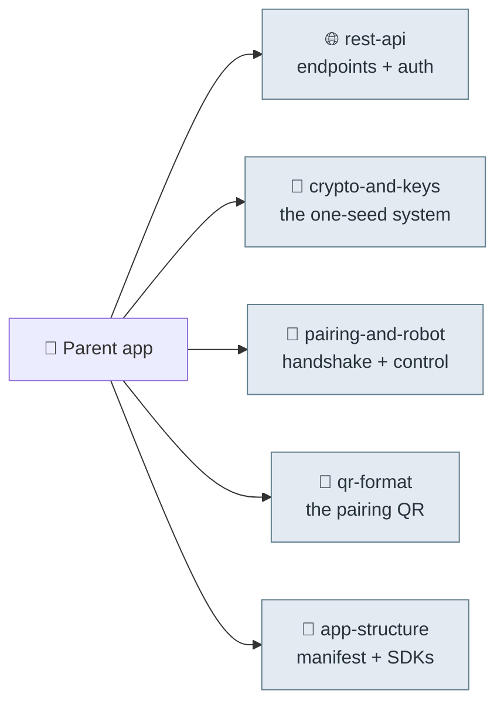

# 🔬 Reverse-engineering (source of truth)

Clean-room maps of the decompiled Moxie parent app (`com.embo.embodied.parent` v2.2.2). Everything
else in the repo is derived from these. No Embodied code or binaries are included — only descriptions.

- [`rest-api.md`](rest-api.md) — every endpoint, the passwordless-email→OAuth flow, headers, token shapes.
- [`crypto-and-keys.md`](crypto-and-keys.md) — the one 32-byte seed (Argon2id) → Ed25519/X25519/secretbox, recovery keys, E2E encryption.
- [`pairing-and-robot.md`](pairing-and-robot.md) — the pairing handshake, Wi-Fi provisioning, robot control API.
- [`qr-format.md`](qr-format.md) — the exact pairing-QR wire format (protobuf + legacy JSON).
- [`app-structure.md`](app-structure.md) — manifest, components, third-party SDKs, package inventory.

---
📖 [Docs index](../README.md) · [Back to top](../../README.md)
