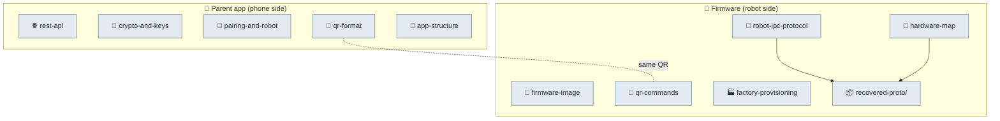

# 🔬 Reverse-engineering (source of truth)

Clean-room maps of the Moxie system, in two halves. **Phone side:** the decompiled parent app
(`com.embo.embodied.parent` v2.2.2). **Robot side:** the on-device firmware (RK3288 Android 9) and
its `bo-*` apps, read from the factory partition images. No Embodied source is included — only
observed facts and schemas reconstructed from shipped binaries. Everything else in the repo derives
from these.

> 🗺️ **See the [architecture diagrams](architecture-diagrams.md)** — the whole system as a hierarchy of mermaid diagrams, product level down to motor drivers.

> 📇 **Firmware analyzed: [`v3.6.4-Zephyr` / OTA `v24.10.803`](firmware-803-reference.md)** — the version-stamped reference (identifiers, partition hashes, app + native-lib inventory). All robot-side docs describe this build.

> 🧭 **New here? Start with the [FIELD-GUIDE](FIELD-GUIDE.md)** — everything below, organized by what you want to do (revive an old robot · run your own server · custom firmware).

### Phone side — the parent app

- [`rest-api.md`](rest-api.md) — every endpoint, the passwordless-email→OAuth flow, headers, token shapes.
- [`crypto-and-keys.md`](crypto-and-keys.md) — the one 32-byte seed (Argon2id) → Ed25519/X25519/secretbox, recovery keys, E2E encryption.
- [`pairing-and-robot.md`](pairing-and-robot.md) — the pairing handshake, Wi-Fi provisioning, robot control API.
- [`qr-format.md`](qr-format.md) — the exact pairing-QR wire format (protobuf + legacy JSON), as the phone emits it.
- [`app-structure.md`](app-structure.md) — manifest, components, third-party SDKs, package inventory.

### Robot side — the firmware (for running custom software on the device)

- [`firmware-image.md`](firmware-image.md) — RK3288 / Android 9 partition layout, verified boot (AVB), security posture, installed apps, and **how to unlock & flash custom firmware**.
- [`hardware-access.md`](hardware-access.md) — the **physical surface**: maskrom/rockusb/fastboot, `rkdeveloptool` flashing, the **UART/TTL serial console** (`ttyFIQ0`), JTAG — the full teardown path (in scope).
- [`ota-and-recovery.md`](ota-and-recovery.md) — the A/B OTA machinery, payload signing gate, and an **honest, tiered map of upgrade vectors** (no-open first, then USB/UART, then full teardown/flash) for reviving old robots.
- [`boot-and-launcher.md`](boot-and-launcher.md) — the app-level **Launcher state machine** (config/QR-reading, running, recovery, factory test) and component supervision.
- [`robot-ipc-protocol.md`](robot-ipc-protocol.md) — the on-device **ZeroMQ + protobuf** message bus that wires the modules together; the module map and behavior-command markup.
- [`cloud-protocol.md`](cloud-protocol.md) — the robot↔backend surface (REST `client-service`, MQTT topics, Deepgram STT, the chat envelope) — **what a self-hosted server must implement**.
- [`network-trust.md`](network-trust.md) — the TLS trust model: **CA-store validation, no pinning**; what cert a self-hosted server needs, and the precise pre-801 block.
- [`behavior-markup.md`](behavior-markup.md) — the inline `<mark name="cmd:…">` command language (24 verbs) a server uses to make Moxie **move, emote, and play audio while speaking**.
- [`content-and-conversation.md`](content-and-conversation.md) — the dialog engines (ChatScript + LLM), the **content-module format**, and the `volley`/`session` hooks a server fills in.
- [`perception-pipeline.md`](perception-pipeline.md) — the **audio** (wake-word → XMOS → Deepgram STT → CloudTTS) and **vision** (faces/people/QR) pipelines a server sits in the middle of.
- [`qr-commands.md`](qr-commands.md) — the **complete QR grammar** the robot scans (pairing / VPN / debug-factory commands), read from `bo-wifi`.
- [`hardware-map.md`](hardware-map.md) — motors, touch/switch/IMU sensors, LED face patterns, and power rails, from the MCU protobufs.
- [`factory-provisioning.md`](factory-provisioning.md) — the production-line apps, serial/part grammar, and the **factory secret** getters (and how to recover them).
- [`recovered-proto/`](recovered-proto/) — **120 `.proto` files** reconstructed from the robot binaries; the machine-readable protocol.
- [`proto-catalog.md`](proto-catalog.md) — the **browsable catalog** of all 382 messages / 84 enums / 2074 fields (auto-generated).

---
📖 [Docs index](../README.md) · [Back to top](../../README.md)
