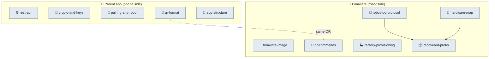

# 🔬 Reverse-engineering (source of truth)

Clean-room maps of the Moxie system, in two halves. **Phone side:** the decompiled parent app
(`com.embo.embodied.parent` v2.2.2). **Robot side:** the on-device firmware (RK3288, Android 9) and its
`bo-*` apps, read from the factory partition images of **[`v3.6.4-Zephyr` / OTA `v24.10.803`](firmware/firmware-803-reference.md)**.
No Embodied source is included — only observed facts and schemas reconstructed from shipped binaries.
Everything else in the repo derives from these docs.

The key finding: the robot decides everything it says and does behind one documented seam
([`RemoteChat`](protocol/remote-chat-protocol.md)), with the heavy ML
[out of process behind the ZMQ bus](runtime/native-boundary.md). So any AI that speaks that contract
*becomes* Moxie — a compatible server is the floor, a full brain transplant the ceiling.

## Start here

| Doc | What it is |
|---|---|
| [FIELD-GUIDE](FIELD-GUIDE.md) | New here? Everything below organized by goal: revive an old robot · run your own brain · custom firmware. |
| [Exploration map](EXPLORATION-MAP.md) | Status board: coverage per goal, every proto namespace / C# subsystem / image / lib with its covering doc, and the open items. |
| [Architecture diagrams](architecture-diagrams.md) | The whole system as a hierarchy of mermaid diagrams, product level down to motor drivers. |
| [Playbook](PLAYBOOK.md) | How the facts are produced — tool tiers (incl. PyGhidra), the per-iteration loop, lessons — generalized for other Android robots. |
| [External sources](external-sources.md) | Outside research (FCC filings, teardowns, OpenMoxie, press), adjudicated against our RE, plus the provenance policy. |

Building from this? The [architecture spec layer](../architecture/README.md) distills these facts into
standalone implementation contracts — [REST](../architecture/rest-api-contract.md),
[MQTT/conversation](../architecture/mqtt-and-conversation.md), the [AI seam](../architecture/ai-seam.md) —
so a clean-room build reads the spec, not the raw study.

```mermaid
flowchart TB
    subgraph phone["📱 Parent app (phone side)"]
      rest["🌐 rest-api"]
      crypto["🔐 crypto-and-keys"]
      pair["🔗 pairing-and-robot"]
      qr["🎫 qr-format"]
      struct["🧩 app-structure"]
    end
    subgraph robot["🤖 Firmware (robot side)"]
      fw["🧱 firmware-image"]
      ipc["🧠 robot-ipc-protocol"]
      qrc["🎫 qr-commands"]
      hw["🦾 hardware-map"]
      fac["🏭 factory-provisioning"]
      proto["📦 recovered-proto/"]
    end
    qr -.same QR.- qrc
    ipc --> proto
    hw --> proto
    classDef d fill:#e3eaf2,stroke:#607d8b,color:#263238;
    class rest,crypto,pair,qr,struct,fw,ipc,qrc,hw,fac,proto d;
```

### 📱 Phone side — the parent app ([`phone/`](phone/README.md))

- [`rest-api.md`](phone/rest-api.md) — every endpoint, the passwordless-email → OAuth flow, headers, token shapes.
- [`crypto-and-keys.md`](phone/crypto-and-keys.md) — the one 32-byte seed (Argon2id) → Ed25519/X25519/secretbox, recovery keys, E2E encryption.
- [`pairing-and-robot.md`](phone/pairing-and-robot.md) — the pairing handshake, Wi-Fi provisioning, robot control API.
- [`qr-format.md`](phone/qr-format.md) — the pairing-QR wire format (protobuf + legacy JSON) as the phone emits it.
- [`app-structure.md`](phone/app-structure.md) — manifest, components, third-party SDKs, package inventory.

### 🔌 Protocol — robot↔server and on-device wire ([`protocol/`](protocol/README.md))

- [`robot-ipc-protocol.md`](protocol/robot-ipc-protocol.md) — the on-device ZeroMQ + protobuf bus, its module map and two-frame framing.
- [`cloud-protocol.md`](protocol/cloud-protocol.md) — robot↔backend: REST `client-service`, MQTT topics, device auth, Deepgram STT — what a self-hosted server implements.
- [`remote-chat-protocol.md`](protocol/remote-chat-protocol.md) — the per-turn robot↔brain RPC: response contract, action commands, safety verdict, ResultCodes, streaming.
- [`device-config-and-telemetry.md`](protocol/device-config-and-telemetry.md) — `RobotCloudConfig` (pushed config), `RobotStatus`, the telemetry envelope, `LoggingPolicy`, `IOTEndpoint`.
- [`runtime-control.md`](protocol/runtime-control.md) — live bus commands: volume, slow-input pacing, force-listen, barge-in gate, soft/hard reset.
- [`power-and-system-events.md`](protocol/power-and-system-events.md) — `PowerStatePB` (11 states), wake causes, XMOS recovery, system status events, time zone + alarms.
- [`perception-fusion.md`](protocol/perception-fusion.md) — the fused world model of people (`FusedPersonPB`) and its person-level event stream.
- [`offline-and-brain-state.md`](protocol/offline-and-brain-state.md) — offline fallback tree (`FallbackInfo`) and persisted brain state (`CSData`, recommender history).
- [`telehealth.md`](protocol/telehealth.md) — the remote-puppet (`STATE_TELEBRAIN`) protocol: operator-driven `Output{text, markup}` over MQTT.
- [`qr-commands.md`](protocol/qr-commands.md) — the complete, closed QR grammar the robot scans (pairing / VPN / debug-factory), from `bo-wifi`.
- [`network-trust.md`](protocol/network-trust.md) — TLS trust: CA-store validation, no pinning; what cert a server needs; the pre-801 block.
- [`unity-mainapp-interface.md`](protocol/unity-mainapp-interface.md) — the brain ↔ Unity face/audio/camera seam (`embodied.unity`).
- [`proto-catalog.md`](protocol/proto-catalog.md) — browsable catalog of all 382 messages / 84 enums (auto-generated).
- [`recovered-proto/`](protocol/recovered-proto/) — the 120 `.proto` files reconstructed from the robot binaries.

### 🧠 Runtime — the on-device brain, behavior and face ([`runtime/`](runtime/README.md))

- [`behavior-input-events.md`](runtime/behavior-input-events.md) — the 163 `InputEvent` types that drive the behavior tree, 24 of them proto-serializable.
- [`behavior-tree-engine.md`](runtime/behavior-tree-engine.md) — the NodeCanvas decision layer (BT/FSM/Dialogue + Blackboard), its node vocabulary, and the 45 `Bht_*` trees.
- [`robot-actions.md`](runtime/robot-actions.md) — the top-level action arbiter: scored ladder Startup > handling > affection > activity > idle.
- [`task-scheduler.md`](runtime/task-scheduler.md) — `EBGameTask` priority + resource arbitration over the 44 `RobotResourceFlags` outputs.
- [`native-boundary.md`](runtime/native-boundary.md) — how managed code reaches native: P/Invoke, JNI, and the ZMQ bus to the `libbo-*` modules.
- [`behavior-markup.md`](runtime/behavior-markup.md) — the inline `<mark name="cmd:…">` language (24 verbs) for moving and emoting while speaking.
- [`content-and-conversation.md`](runtime/content-and-conversation.md) — dialog engines (ChatScript + LLM), the content-module format, `volley`/`session` hooks.
- [`content-delivery.md`](runtime/content-delivery.md) — how content is packaged and delivered: AssetBundles, manifest, load lifecycle, 24 processors.
- [`perception-pipeline.md`](runtime/perception-pipeline.md) — the audio (wake word → XMOS → STT → TTS) and vision (faces/people/QR) pipelines.
- [`gaze-and-attention.md`](runtime/gaze-and-attention.md) — where Moxie looks: interest points, saccades, IK look-at, the published `Attention` state.
- [`turn-taking.md`](runtime/turn-taking.md) — the conversation state machine: turn owner, engagement, barge-in, re-prompt timer.
- [`unity-face-animation.md`](runtime/unity-face-animation.md) — how the face renders: `rig3` blendshapes, `EBAnimGrinder`, Eyeseme moods, visemes, blink.

### 🧱 Firmware — OS image, boot, security and flashing ([`firmware/`](firmware/README.md))

- [`firmware-803-reference.md`](firmware/firmware-803-reference.md) — the version-stamped reference: identifiers, partition hashes, app + native-lib inventory.
- [`firmware-image.md`](firmware/firmware-image.md) — partition layout, AVB, security posture, and how to unlock and flash custom firmware.
- [`firmware-inventory.md`](firmware/firmware-inventory.md) — app + binary manifest (embodied vs stock) and the per-file manifest TSVs.
- [`boot-and-launcher.md`](firmware/boot-and-launcher.md) — the Launcher state machine (config/QR-reading, running, recovery, factory test).
- [`security-policy.md`](firmware/security-policy.md) — Android permissions + SELinux: platform-signed apps, the 2 custom daemon domains.
- [`hal-and-drivers.md`](firmware/hal-and-drivers.md) — vendor HALs, kernel drivers, and the XMOS / BCM4339 co-processor blobs with hashes.
- [`settings-schema.md`](firmware/settings-schema.md) — the 199 `SettingSchema` keys (the runtime config surface).
- [`ota-and-recovery.md`](firmware/ota-and-recovery.md) — A/B OTA, the payload signing gate, and a tiered map of upgrade vectors for old robots.
- [`flashing-runbook.md`](firmware/flashing-runbook.md) — step by step: build/flash custom firmware and revive a robot by reflashing.
- [`unity-assets.md`](firmware/unity-assets.md) — the Unity 2020.3 face/HUD/effects asset inventory and the boot animation.
- [`factory-provisioning.md`](firmware/factory-provisioning.md) — production-line apps, serial/part grammar, and the factory secret getters.

### 🦾 Hardware — the physical board and teardown ([`hardware/`](hardware/README.md))

- [`hardware-map.md`](hardware/hardware-map.md) — motors, touch/switch/IMU sensors, LED patterns and power rails, from the MCU protobufs.
- [`device-tree.md`](hardware/device-tree.md) — board wiring from the DTB (I²C/UART/display/camera/PMIC) plus the decompiled `.dts`.
- [`hardware-access.md`](hardware/hardware-access.md) — maskrom/rockusb/fastboot, `rkdeveloptool`, the `ttyFIQ0` serial console, JTAG.
- [`fcc-teardown.md`](hardware/fcc-teardown.md) — board-level map from the FCC filings (rev1 vs rev2): chip inventory, `LOAD` button, MCU debug header.

---
📖 [Docs index](../README.md) · [Back to top](../../README.md)
