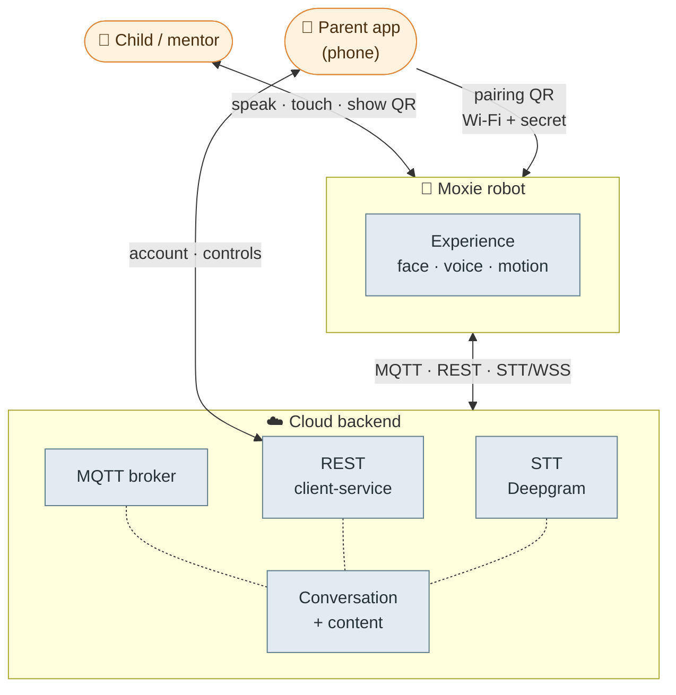
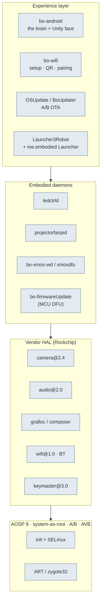
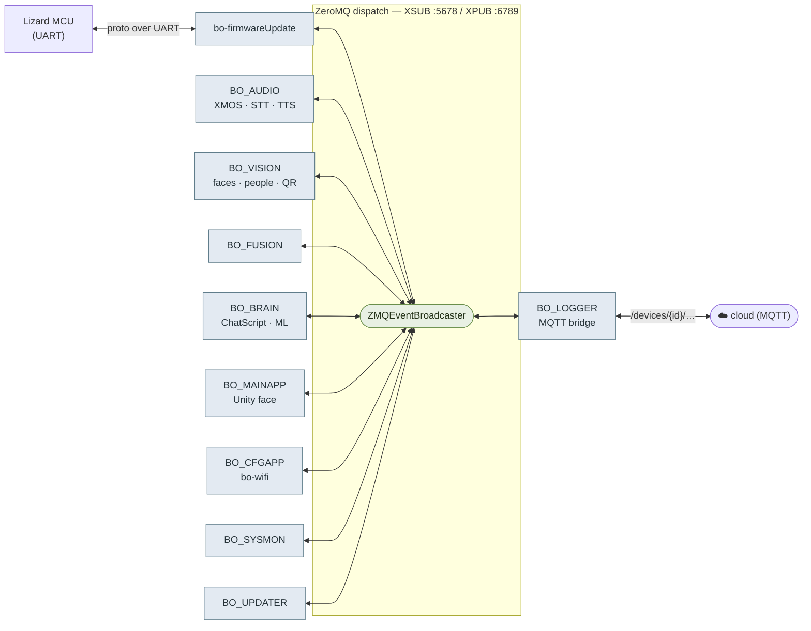
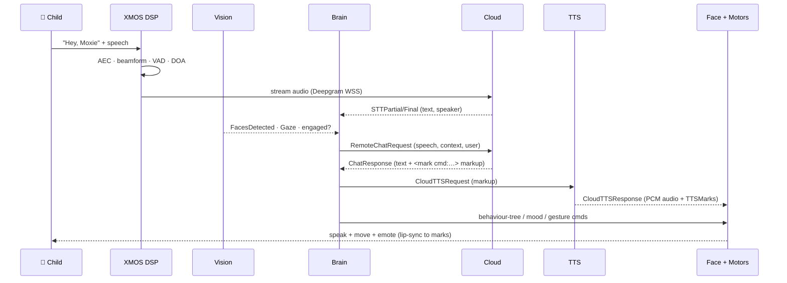
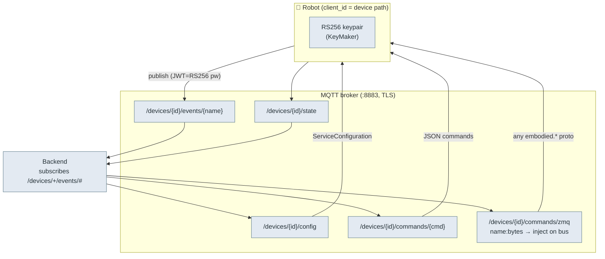
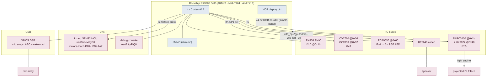
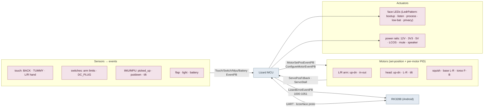
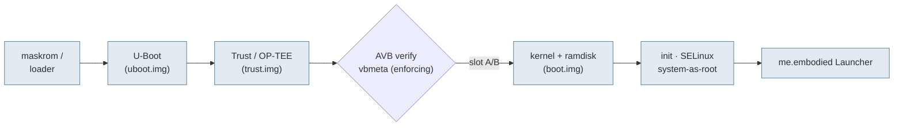
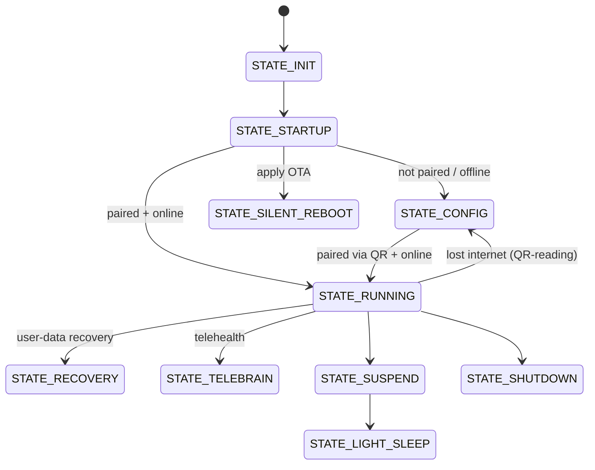

# 🗺️ Architecture diagrams — the whole system, top to bottom

> A hierarchy of diagrams for **Moxie `v3.6.4-Zephyr` / OTA `v24.10.803`** (RK3288, Android 9), from
> the product ecosystem down to motor drivers and hardware buses. Every box is grounded in the
> reverse-engineering in this folder; each level links to its deep doc. GitHub renders these natively.

**Levels:** [L0 Product](#l0-product-ecosystem) · [L1 Software stack](#l1-on-robot-software-stack) ·
[L2 Component bus](#l2-on-device-component-bus) · [L3 Interaction loop](#l3-the-interaction-loop) ·
[L4 Cloud transport](#l4-cloud-transport) · [L5 Hardware topology](#l5-hardware-topology) ·
[L6 Actuation & sensing](#l6-actuation-sensing-the-lizard-mcu) · [L7 Boot chain](#l7-boot-chain-lifecycle)

---

## L0 — Product ecosystem

The four actors and how they connect.

Deep docs: [`cloud-protocol.md`](protocol/cloud-protocol.md) · [`qr-format.md`](phone/qr-format.md) · [`rest-api.md`](phone/rest-api.md)

---

## L1 — On-robot software stack

Layers inside the robot, from AOSP up to the experience.

Deep docs: [`firmware-803-reference.md`](firmware/firmware-803-reference.md) · [`firmware-image.md`](firmware/firmware-image.md) · [`boot-and-launcher.md`](firmware/boot-and-launcher.md)

---

## L2 — On-device component bus

The `bo-*` components wired by a ZeroMQ pub/sub proxy (`libbo-dispatch`), plus the MCU and cloud bridges.
Each message is two frames: `[descriptor FullName][protobuf]`.

Deep docs: [`robot-ipc-protocol.md`](protocol/robot-ipc-protocol.md) · [`recovered-proto/`](protocol/recovered-proto/)

---

## L3 — The interaction loop

One conversational turn, end to end.

Deep docs: [`perception-pipeline.md`](runtime/perception-pipeline.md) · [`content-and-conversation.md`](runtime/content-and-conversation.md) · [`behavior-markup.md`](runtime/behavior-markup.md)

---

## L4 — Cloud transport

MQTT topic structure (Google IoT-Core convention) + device auth.

Deep docs: [`cloud-protocol.md`](protocol/cloud-protocol.md) · [`network-trust.md`](protocol/network-trust.md)

---

## L5 — Hardware topology

The RK3288 SoC and every peripheral, from the device tree (`rk3288-robot`, see [`device-tree.md`](hardware/device-tree.md)).

Deep docs: [`hardware-map.md`](hardware/hardware-map.md) · [`firmware-803-reference.md`](firmware/firmware-803-reference.md)

---

## L6 — Actuation & sensing (the Lizard MCU)

What the MCU drives and reports over UART (the `embodied.lizzerface` protocol).

Motor PID params (`ConfigParam`): `KP KI KD MAX_PWM KI_LEAK LIMIT ADJ MOTOR_FWD/RWD WRITE`.
Deep doc: [`hardware-map.md`](hardware/hardware-map.md)

---

## L7 — Boot chain & lifecycle

From power-on to the running experience, and the Launcher states.

Deep docs: [`boot-and-launcher.md`](firmware/boot-and-launcher.md) · [`firmware-image.md`](firmware/firmware-image.md) · [`ota-and-recovery.md`](firmware/ota-and-recovery.md)

---

📖 [Reverse-engineering index](README.md) · [Field guide](FIELD-GUIDE.md) · [Firmware reference](firmware/firmware-803-reference.md) · [Docs index](../README.md)
