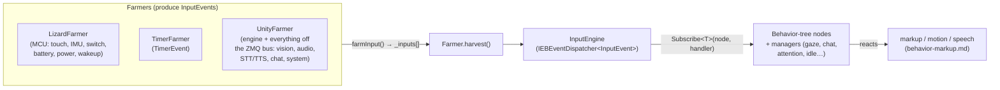

# 👂 Behavior input events — the robot's perception vocabulary (`v3.6.4-Zephyr` / OTA `v24.10.803`)

> Recovered from `Assembly-CSharp.dll` (the brain, `bo-android`) in the **v24.10.803** image. This is
> the **input contract** of the behavior engine: the 163 typed events — sensors, vision, audio, speech,
> chat, system — that flow *into* the behavior tree and make Moxie react. It is the counterpart to
> [`behavior-markup.md`](behavior-markup.md) (what the brain emits *out*). Together with
> [`perception-pipeline.md`](perception-pipeline.md) (the vision/audio DSP that *produces* percepts) and
> [`hardware-map.md`](hardware-map.md) (the Lizard MCU that produces sensor events), this closes the
> "senses → brain → body" loop.

## How events reach the behavior tree — the Farmer pattern

Everything the robot perceives becomes an `InputEvent` and is dispatched through a single typed pub/sub
bus. Producers are **`Farmer`s**; the **`InputEngine`** is the dispatcher; behavior-tree nodes and
systems **subscribe by event type**.

- **`abstract class Farmer`** — holds `List<InputEvent> _inputs`; each frame `farmInput()` fills it and
  `harvest()` drains it into the engine. Three concrete farmers exist:
  - **`LizardFarmer`** — pulls hardware events from `Lizzerface` (the Lizard MCU bridge — see
    [`hardware-map.md`](hardware-map.md#raw-uart-command-set-lizzerfacecommands)); gated by `SensorsEnabled`.
  - **`TimerFarmer`** — scheduled `TimerEvent`s.
  - **`UnityFarmer`** — the Unity engine tick plus the bridge for everything arriving on the on-device
    **ZeroMQ** bus (vision, audio, STT/TTS, chat, cloud, system).
- **`InputEngine : IEBEventDispatcher<InputEvent>`** — a singleton wrapping `EBEventDispatcher`.
  Consumers call `Subscribe<T>(subscriber, delegate)` / `Unsubscribe<T>(…)` where `T : InputEvent`, so a
  gaze controller subscribes to `FacesEvent`/`GazeEvent`, the chat manager to `STTResultEvent`, etc.

## The event vocabulary (163 types, by domain)

### 🖐️ Physical / sensor (from the Lizard MCU)
`TouchEvent` (BACK/TUMMY/hands) · `SwitchEvent` (arms, DC-plug) · `MpuEvent` + `MpuPickedUpEvent` /
`MpuPickedUpShakenEvent` / `MpuPutDownEvent` / `MpuTiltEvent` / `MpuIsNoisyEvent` / `MpuPickUpStatusEvent` ·
`ServoPosFdbackEvent` · `ServoStallEvent` · `BatteryEvent` · `PowerStateEvent` · `LizardWakeupEvent` ·
`LizardErrorEvent` · `RobotActionMPUPickedUpEvent` · `RobotActionMPUNotStableEvent` · **`RobotActionHugEvent`**
· **`RobotActionBellyRubEvent`** (higher-level gestures fused from touch + IMU).

### 👁️ Vision / people (from `libbo-vision` / fusion)
`FacesEvent` · `PeopleEvent` · `FusedPeopleEvent` · `PersonAddedEvent` / `PersonRemovedEvent` /
`PersonSaidEvent` / `PersonSmiledEvent` / `PersonStartedSpeakingEvent` · `PosesEvent` · `GazeEvent` ·
`OcclusionEvent` · `QREvent` · `RobotBodyTrackingEvent` / `RobotEyeTrackingEvent` / `RobotHeadTrackingEvent` ·
`RobotCameraEvent` / `RobotCameraShakeEvent` / `RobotMotorCameraEvent` · `DOAInputEvent` /
`DOAControlRequest` (mic-array direction-of-arrival) · `AttentionEvent`.

### 🔊 Audio & speech (percepts + playback)
`AudioEvent` · `AudioEnergyPercept` · `SpeechEnergyPercept` · `VoiceActivityPercept` · `AudioIsFinishedEvent` ·
`SFXPlaybackReportEvent` · `AudioNotif{Chat,Pause,Resume,SpeedChange,VolumeChange}Event` ·
`AudioNotifyBaseBackgroundEvent`.

### 🗣️ STT / TTS
`STTPartialEvent` · `STTResultEvent` · `STTReadyEvent` · `CloudTTSRequestEvent` · `CloudTTSBaseEvent` ·
`TTSRequestEvent` · `TTSOutputEvent` · `TTSResult` · `TTSBTEvent` · `TTSErrorEvent` · `TTSVoiceTypeEvent` ·
`SpeechPlaybackRequest` · `SpeechPlaybackSpeakingWords` · `SpeechPlaybackStreamStatus` · `SpeechStateChangeEvent`.

### 💬 Chat / conversation
`ChatEvent` · `ChatInputEvent` / `ChatOutputEvent` / `ChatResponseEvent` · `ChatRequested` / `ChatResetEvent` ·
`ChatbotReadyEvent` / `ChatbotListeningEvent` / `ChatbotAllowCutoffEvent` / `ChatbotRunmodeEvent` /
`ChatbotSettingsSwapEvent` · `ChatStateEvent` / `ChatInstanceState` / `ChatEntityUpdateEvent` /
`ChatTargetEvent` · `ChatBehaviorStartedEvent` / `ChatBehaviorStoppedEvent` · `TriggerChatActivityEvent` ·
`SendChatInputEvent` · `PullstringResponseEvent`.

### 🌳 Behavior-tree control & turn-taking
`BTStartedAction` / `BTStartedBlocking` / `BTEndedBlocking` / `BTStartedSubgraph` / `BTEndedSubgraph` ·
`BTManagerEvent` · `BTInputEventAsset` · `BTGazeControlTarget` · `AllowInterruption` /
`UserInterruptionEvent` · `TurnTakingEvent` · `IdleStateRequestEvent` · `ConsciousState_Event`.

### ⚙️ System / power / network
`NetworkState` · `SystemWifiConnectionState` / `SystemWifiRecoverPBPublisher` · `ServerConnectEvent` ·
`SystemStartSuspend` / `SystemSuspendEventPBPublisher` / `SystemResumeEvent` / `SystemRecoverEvent` ·
`SystemShutdownRequestPBPublisher` / `MainAppShutdownEvent` · `SilentBootCompleteEvent` ·
`SystemUnpairReadyPBPublisher` · `MarkupSystemStartSuspend` / `MarkupSystemStartUnpair` ·
`SystemFPSStatsPBPublisher` / `TTSStatsPBPublisher` (telemetry).

### ⏱️ Timers, assets, logging, debug
`TimerEvent` · `KeyEvent` · `ConsoleCommandEvent` · `AnimStateEvent` / `AnimTrackEvent` /
`ProceduralBlinkEvent` · `DynamicAssetBundle{Load,ReLoad,Release,Scan}Event` · `Logging*` · `*TestEvent`.

## The bus-serializable subset — the external contract (24 events)

Most events are in-process (Unity/behavior-tree plumbing). **24** carry a protobuf serializer
(`new Serializer<Evt>(Serialize, EvtPB.Descriptor.FullName)`), meaning they cross the process/ZeroMQ
boundary and are exactly what a **server or a custom controller sees/injects** on the bus
([`robot-ipc-protocol.md`](robot-ipc-protocol.md)):

| Event | Proto | Domain |
|---|---|---|
| `TouchEvent` | `TouchEventPB` | touch (BACK/TUMMY/hands) |
| `SwitchEvent` | `SwitchEventPB` | switches (arms, DC-plug) |
| `MpuEvent` | `MpuEventPB` | IMU gesture |
| `MpuPickedUpEvent` / `MpuPickedUpShakenEvent` / `MpuPickUpStatusEvent` / `MpuPutDownEvent` / `MpuTiltEvent` / `MpuIsNoisyEvent` | `Mpu…PB` | IMU sub-events |
| `BatteryEvent` | `BatteryEventPB` | battery level/temp |
| `PowerStateEvent` | `PowerStateEventPB` | power state |
| `ServoStallEvent` | `ServoStallEventPB` | motor stall |
| `LizardErrorEvent` | `LizardErrorEventPB` | MCU faults (1000–1051) |
| `LizardWakeupEvent` | `LizardWakeupEventPB` | wake source |
| `ReloadQueueStayAwakePulseEvent` | `PowerStayAwakePB` | keep-awake pulse |
| `AudioNotifChat/Pause/Resume/SpeedChange/VolumeChange` | `AudioNotif…PB` | audio-playback control |
| `AudioIsFinishedEvent` | `AudioIsFinishedEventPB` | playback done |
| `SystemSuspendEventPBPublisher` | `SystemSuspendPB` | suspend |
| `SystemFPSStatsPBPublisher` / `TTSStatsPBPublisher` | `FPSStatsPB` / `TTSStatsPB` | telemetry |

> The rest (vision `Faces/People*`, `Gaze*`, `Chat*`, `STT/TTS*`, `BT*`) are **in-process** — they live
> inside the brain and never hit the bus, so a self-hosted server does not receive them directly; it
> influences them via the cloud chat/TTS contract ([`cloud-protocol.md`](cloud-protocol.md)) and the
> markup it returns.

## What this means for the three goals

**① Custom firmware / custom brain.** This is the complete list of stimuli a replacement behavior engine
must consume to feel like Moxie — and the bus-serializable 24 are the hardware/telemetry events your code
must handle (or synthesize) to drive the stock stack. `RobotActionHugEvent` / `RobotActionBellyRubEvent`
show the fused "affection" percepts the personality keys off of.

**② Server revival.** The 24 PB events are what actually appear on the ZMQ bus; a server bridging the bus
([`robot-ipc-protocol.md`](robot-ipc-protocol.md), `MoxieBus`) can read sensor/battery/power/IMU state and
inject audio-playback control. Conversation is not event-injection — it's the cloud chat/TTS contract.

**③ Pre-801 revival.** No new lever; this is brain-side, above the network boundary in
[`network-trust.md`](network-trust.md).

---
📖 [Reverse-engineering index](README.md) · [Behavior markup (output)](behavior-markup.md) · [Perception pipeline](perception-pipeline.md) · [Hardware map](hardware-map.md) · [Robot IPC](robot-ipc-protocol.md)
