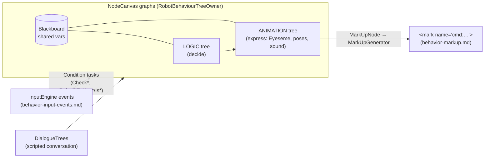

# 🌳 Behavior-tree engine — the decision layer (`v3.6.4-Zephyr` / OTA `v24.10.803`)

> Recovered from `Assembly-CSharp.dll` (the brain, `bo-android`) in the **v24.10.803** image. This is
> the **middle layer** of Moxie's brain: the runtime that turns input events into behavior. It sits
> between [`behavior-input-events.md`](behavior-input-events.md) (the 163 events coming *in*) and
> [`behavior-markup.md`](behavior-markup.md) (the `<mark>` commands going *out*), and it is what a
> "named behaviour tree" in the markup actually runs.

## TL;DR

- Moxie's decision engine is **ParadoxNotion NodeCanvas** — an off-the-shelf Unity graph framework, not
  embodied's own. Namespaces present: `NodeCanvas.BehaviourTrees`, `NodeCanvas.DialogueTrees`,
  `NodeCanvas.StateMachines`, `NodeCanvas.Framework` (Blackboard/Graph/Task), `NodeCanvas.Tasks.Actions`,
  `NodeCanvas.Tasks.Conditions`. **All four graph kinds are used** (BT · Dialogue · FSM · FlowScript).
- Embodied layers a **`Robot*` node/task library (~70 custom nodes)** and **45 named `Bht_*` trees** on
  top — including the whole facial-**expression** set (`Bht_Eyeseme_*`), idle/attention states, gestures,
  and pick-up/put-down reactions. A shared **Blackboard** carries state (this is the `variableName` /
  `variableValue` store the markup writes).
- The behavior runs in **two parallel trees**: a **Logic** tree (what to do) and an **Animation** tree
  (how to express it) — `RobotBT_SetLogicBehaviourTree` / `RobotBT_SetAnimationBehaviourTree`,
  `RobotBehaviourTreeComponentLogic` / `…ComponentAnimation`.
- The seam to output is **`MarkUpNode`**: a node that owns a `MarkUpGenerator` and produces the `<mark
  name="cmd:…">` string documented in [`behavior-markup.md`](behavior-markup.md).

## The engine — NodeCanvas

| Graph kind | Owner class | Role in Moxie |
|---|---|---|
| **BehaviourTree** | `BehaviourTreeOwner : GraphOwner<BehaviourTree>` → embodied **`RobotBehaviourTreeOwner`** | the reactive behavior layer (the `Bht_*` trees) |
| **DialogueTree** | `DialogueTreeController : GraphOwner<DialogueTree>, IDialogueActor` | scripted conversation flow (statements/choices/branches) — see below |
| **FSM** | `FSMOwner : GraphOwner<FSM>` | state machines (e.g. engagement/turn-taking states) |
| **FlowScript** | `FlowScriptController : GraphOwner<FlowScript>` | visual scripting glue |

Every node returns a NodeCanvas **`Status`** — `Success`, `Failure`, or `Running` (the description
strings are embedded verbatim in the binary, e.g. *"You should return Status.Success, Failure or Running
within that function."*). The **`Blackboard`** (`IBlackboard`, `object this[string varName]`) is the
shared variable store; `RobotBT_CheckMarkupVariable` reads the same vars the markup `variableName`/
`variableValue` pair writes.

### Behaviour-tree node taxonomy (authoritative descriptions from the binary)

**Composites** (`BTComposite`) — control child execution:

| Node | Behavior (from the embedded `[Description]`) |
|---|---|
| `Selector` | run children in order (or randomly) until one returns Success; Dynamic mode re-evaluates higher-priority children |
| `Sequencer` | run children in order until one Fails |
| `PrioritySelector` | **Utility-AI** selector — execute the child with the highest priority weight, fall through on failure |
| `ProbabilitySelector` | pick a child by weighted chance, with an optional pre-Condition filter |
| `Parallel` | run all children simultaneously; return per the `ParallelPolicy` (incl. Repeat) |
| `FlipSelector` | Selector that moves a Succeeding child to the end (recently-failed checked first) |
| `StepIterator` | step through children across ticks |

**Decorators** (`BTDecorator`) — wrap a single child: `Inverter`, `Repeater`, `Iterator`, `Optional`,
`Filter`, `Monitor`, `ConditionalEvaluator`, **`Guard`** (token-based mutual exclusion across *all* the
agent's trees), **`Interruptor`** (fail-and-bail the child when a condition becomes true), `Remapper`,
`Setter`, plus embodied's `RobotBT_CameraShake`, `RobotBT_GazeDisabler`, `RobotBT_Repeater`,
`RobotBT_EndTreeDisabler`.

**Leaves / flow**: `ActionNode`, `ConditionNode`, **`MarkUpNode`** (emits markup), `SubTree` (embed
another whole tree), `NestedFSM`, `FSMState`, `RootSwitcher`, `NodeToggler`, `EndBehaviourTree`,
`BTNestedFlowScript`.

## The embodied `Robot*` layer

On top of the stock NodeCanvas task library (`Check*`, `Find*`, `Wait`, `Set/GetProperty`, …), embodied
adds ~70 `RobotBT_*` nodes. Grouped:

- **Playback actions** — `RobotBT_PlayAnimation`, `RobotBT_PlaySound`, `RobotBT_PlayBackgroundSound`,
  `RobotBT_PlayScreenSaver`, `RobotBT_PlaybackMood`, `RobotBT_PlaybackIntensity`, `RobotBT_CameraShake`.
- **Expression / mood** — `RobotBT_EyesemeState`, `RobotBT_HasMoodChanged`,
  `RobotBT_HasEyesemeEnableChanged`, `RobotBT_OldPlaybackMood`.
- **Gaze** — `RobotBT_GazeControlTarget`, `RobotBT_GazeControlManualTarget`, `RobotBT_GazeDisabler`,
  `RobotBT_EyeGazeEnabled`.
- **Tree control** — `RobotBT_SetBehaviourTree`, `RobotBT_SetLogicBehaviourTree`,
  `RobotBT_SetAnimationBehaviourTree`, `RobotBT_IsCurrentBehaviorTree`, `RobotBT_Is{Animation,Logic}BehaviorTree`,
  `RobotBT_EnableNodeCanvas` / `RobotBT_IsNodeCanvasEnabled`.
- **Markup graphs** — `RobotBT_IsMarkupGraph`, `RobotBT_IsPlayingMarkupGraph`, `RobotBT_IsMarkupTool`,
  `RobotBT_CheckMarkupVariable` (the BT ↔ [`behavior-markup.md`](behavior-markup.md) bridge).
- **Events** — `RobotBT_SendEventAsset`, `RobotBT_CheckEventAsset`, `RobotBT_CompleteEvent`
  (the BT ↔ [`behavior-input-events.md`](behavior-input-events.md) bridge).
- **Turn-taking / conversation state** — a large family keyed on the states
  `Moxie` / `Engagement` / `Mentor` / `Assist`: `RobotBT_TurnTakingIn{Turn,MoxieState,EngagementState,MentorState,AssistState}`,
  `…TimeIn*`, `RobotBT_TurnTakingIsResponseMissing`, `…WaitingForResponseTime`.
- **Sensory mode** — `RobotBT_SensoryMode`, `RobotBT_SensoryModeDuration`, `RobotBT_TimeSinceSensoryMode`,
  `RobotBT_HasSensoryModeChanged`.
- **Accessibility global settings** (mirror [`settings-schema.md`](settings-schema.md)) —
  `RobotBT_RobotGlobalSettings_LessMotion`, `…_SlowSpeech`, `…_MuteRobotSoundEffects`,
  `…_HideRobotVisualEffects`, `…_HideRobotHUDAnimatorAttachments`.

## The 45 named behavior trees (`Bht_*`)

Loaded via `RobotBehaviourTreeAssetResourceSingleton`; a markup `behaviour-tree` command names one of these.

| Group | Trees |
|---|---|
| **Expressions (`Eyeseme`, 11)** | `Afraid` · `Angry` · `Concerned` · `Confused` · `Curious` · `Embarrassed` · `Happy` · `Neutral` · `Sad` · `Shy` · `Surprised` |
| **Idle / attention** | `Idle_Curious` · `Idle_Listening` · `Idle_Near_Focused` · `Idle_Near_UnFocused` · `Idle_Far_Unfocused` · `Idle_SeekingState` · `Idle_DisengagedState` · `Idle_Earmuffs` |
| **Gestures / talking** | `Gesture_Greet` · `Talking_Poses` · `Talking_With_Gestures` · `Vocal_Gestures` (`Vg_`) · `Head` · `Spin_360` · `ooo_long` · `Sign_off` |
| **Physical reactions** | `Robot_Pickup` · `Robot_Putdown` |
| **Sleep / sensory** | `Sleep_Anim` (+`_Zero`) · `Sleeping_Anim` · `SensoryIdle_Anim` · `SensoryIdleStoryTime_Anim` |
| **System / lifecycle** | `System_Resume` · `System_Suspend` (+`_Zero`) · `System_WifiRecover` · `Active_Thinking` · `Demo_Wake_Up` |
| **Test / misc** | `Motor_Test` · `TestState` · `Anim` |

> **`Bht_Eyeseme_*` = the facial expressions are behavior trees**, not static frames — an expression is a
> small NodeCanvas graph that plays face + eye animation. That's why the mood/eyeseme condition nodes
> exist, and why the SIL's expression set (happy/sad/surprised/thinking/neutral/sleep) is a faithful
> subset. Complements the render side in [`unity-assets.md`](unity-assets.md).

## DialogueTrees — scripted conversation

Conversation content also runs on NodeCanvas, as **DialogueTrees** (`DialogueTreeController`, an
`IDialogueActor`). Node types recovered: `StatementNode` (Moxie says a line), `MultipleChoiceNode` /
`MultipleConditionNode` (branch on choice/condition), `ConditionNode`, `GoToNode` / `Jumper` (flow),
`ProbabilitySelector` (random branch), `FinishNode`, `DTNestedFlowScript`. This is the authoring model
behind the content modules in [`content-and-conversation.md`](content-and-conversation.md).

## What this means for the three goals

**① Custom firmware / custom brain.** The decision layer is a **known, off-the-shelf engine (NodeCanvas)**
with a documented node contract — reproducible without reversing a bespoke interpreter. A custom brain
either drives these same graphs or replaces them, using the input/output seams: read `InputEngine`
events via Condition tasks, emit behavior via `MarkUpNode`/markup. The **logic/animation tree split** and
the `Bht_*` catalog are the blueprint for a faithful personality.

**② Server revival.** Mostly on-device — a server does not run the BTs. It influences them via the cloud
chat/TTS contract and the markup it returns (which the animation trees play). The `TurnTaking*` state
family shows the engagement model a server's dialog fills.

**③ Pre-801 revival.** No new lever; brain-side, above the network boundary.

---
📖 [Reverse-engineering index](README.md) · [Behavior input events](behavior-input-events.md) · [Behavior markup](behavior-markup.md) · [Content & conversation](content-and-conversation.md) · [Unity assets](unity-assets.md)
