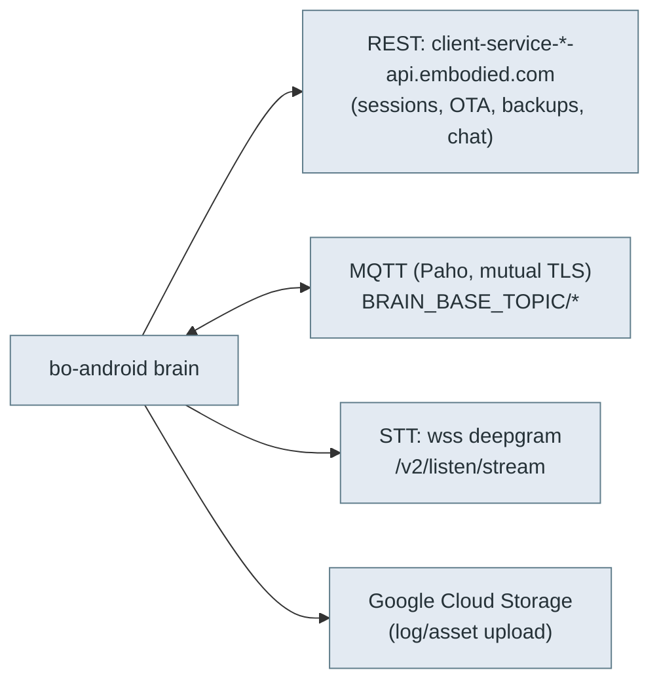

# ☁️ Robot ↔ cloud protocol — REST, MQTT, STT

> **What this is.** How the robot's brain (`bo-android`) talks to the **backend** — the surface a
> self-hosted server must implement to run a Moxie (goal #2, client/server revival). This is the
> *robot side* of the cloud; the *phone app's* REST surface is separate (see [`rest-api.md`](rest-api.md)).
> Reconstructed from `bo-android` native libs (`libbo-dispatch`, `libbo-logger`) and the
> `me.embodied.*` Java service layer.

## Three channels



## 1. REST — `client-service`

Per-endpoint base URLs (map 1:1 to the `IOTEndpoint` enum, see [`qr-commands.md`](qr-commands.md)):

| IOTEndpoint | Base URL |
|---|---|
| `EMBODIED_PRODUCTION` | `https://client-service-api.embodied.com/` |
| `EMBODIED_STAGING` | `https://client-service-staging-api.embodied.com/` |
| `EMBODIED_DEVELOP` | `https://client-service-develop-api.embodied.com/` |
| `EMBODIED_HIPAA` | `https://client-service-hipaa-api.embodied.com/` |
| `EMBODIED_CHINA` | `https://client-service-cn-api.embodied.com/` |
| `EMBODIED_HK` | `https://client-service-hk-api.embodied.com/` |
| **`EMBODIED_LOCAL`** | **`https://client-service-api.local/`** ← self-hosted target |

### Endpoints seen

| Path | Purpose |
|---|---|
| `api/robot-sessions`, `api/robot-sessions/complete` | Open/close a robot session (bearer/`?key=` auth). |
| **`api/ota`** | **OTA check** — how the robot asks the backend for a firmware update. A local server that implements this can serve a (signed) `update.zip`; see [`ota-and-recovery.md`](ota-and-recovery.md). |
| `api/backups`, `api/backups/newest/download` | Cloud backup of robot/user data. |
| `api/restores/` | Restore flow. |

Assets/logs also go to **Google Cloud Storage** (`www.googleapis.com/upload/storage/v1`,
`oauth2/v4/token`, scope `devstorage.read_write`) — a service-account OAuth path, separate from
client-service.

> **Revival implication.** `EMBODIED_LOCAL` → `client-service-api.local` is a first-class,
> in-firmware target. Point an 801+ robot there (via `endpoint_update` QR + DNS for `*.local`) and a
> server that implements `api/robot-sessions`, `api/ota`, and the MQTT topics below can run it fully —
> no OpenMoxie dependency. `OPEN_MOXIE=11` is the analogous community target.

## 2. MQTT — the live bus (Eclipse Paho, mutual TLS)

The brain links Eclipse **Paho MQTT** (C) over TLS with client certificates (the classic Google
IoT-Core / AWS IoT pattern; pre-801 pinned `mqtt.googleapis.com`, hence `kTypeGoogleApisComPrefix`).
Topics are **settings-driven** off a configurable **`BRAIN_BASE_TOPIC`** (an `embodied::core::SettingSchema`):

| Setting / topic | Role |
|---|---|
| `BRAIN_BASE_TOPIC` | Base path all others hang off (per-robot). |
| `RC_TOPIC` / `rc_topic` | **Remote chat** — cloud pushes `RemoteChatResponse`/`ChatResponse`. |
| `COMMANDS_TOPIC` | Commands to the robot (incl. system/OTA signals). |
| `chat_topic` / `clear_chat_topic` | Conversation stream + reset. |
| `rb_menu_topic` | Robot-brain menu / content selection. |
| `MQTT_FILE_SYNC`, `MQTT_FILE_RECOVERY`, `mqtt_files`, `mqtt_file_undo` | **File sync** channel — content modules, config, backups over MQTT. |
| `learning_focus_topics` | Learning-focus subscriptions. |

Payloads are the `embodied.*` protobufs (see [`recovered-proto/`](recovered-proto/)). Client-id and
topic prefixes are provisioned per robot (uuid/serial-derived).

## 3. STT — Deepgram over WebSocket

Speech-to-text streams to a WebSocket, **not** MQTT:

```
wss://deepgram-test.embodied.com/v2/listen/stream?<params>
Authorization: bearer <token>
```

`STTWebClient`/`URIMaker` (`org.java_websocket`) opens the socket, streams mic audio frames
(`AudioBuffer`), and receives transcripts, in `CONTINUOUS` or `SPEECH` mode. The path (`/v2/listen/stream`)
is Deepgram's streaming API — a self-hosted server can proxy to any STT with the same framing.

## The chat request/response envelope

`RemoteChatRequest` (`embodied.robotbrain`) is what the robot sends the backend per user turn — the
contract a custom "brain server" must answer:

- Identity/context: `session_id`, `user_id`, `user_age`, `nickname`, `family`, `timezone_id`, `settings`.
- Input: `speech` (+ `confidence`, `speech_alternates`, `original_language`), `command`, `event_id`,
  `input_vars`, `module_id`/`content_id`, `activity_ids`.
- Context blocks: `global_context`, `conversation_context`, `prompt_context`, `recommend`.
- Controls: `stream_response`, `response_chunks`, `is_mentor`, `no_llm`, `upgrade_fallbacks`, `api_version`.

`ChatResponse` comes back with an `OutputType` (`NORMAL`, `FALLBACK`, `GLOBAL_COMMAND`, `STINGER`,
`SILENT`, `REMOTE_DELAY`, …), `FallbackType`, a `BlockedType` (why a response was suppressed —
`TARGET_OUT_OF_VIEW`, `NOT_ENGAGED`, `THINKING`, …), and `ResponseSource` (`LOCAL_RESPONSE` vs
`REMOTE_RESPONSE`). The spoken text carries inline behavior markup (`<mark name="cmd:…">`, see
[`robot-ipc-protocol.md`](robot-ipc-protocol.md)) so one response drives speech **and** body.

## Minimum viable backend (for revival)

1. Serve `https://client-service-api.local/` (DNS + TLS) and point the robot at `EMBODIED_LOCAL`.
2. Implement `api/robot-sessions` (open/complete) and the MQTT broker with per-robot `BRAIN_BASE_TOPIC`.
3. Answer `RemoteChatRequest` on `RC_TOPIC` with `ChatResponse` (wrap any modern LLM; emit `<mark
   name="cmd:…">` for gestures).
4. Bridge STT (proxy the Deepgram framing, or swap in your own) and TTS (the robot renders CereVoice
   locally via the `embodied.unity.CloudTTS` path).
5. Optional: `api/ota` to push firmware, `api/backups`/`api/restores` for data.

This is a superset of what OpenMoxie does; the [`server/`](../../server/) + [`mqtt/`](../../mqtt/) in
this repo are the working start.

---
📖 [Reverse-engineering index](README.md) · [IPC protocol](robot-ipc-protocol.md) · [OTA](ota-and-recovery.md) · [Docs index](../README.md)
