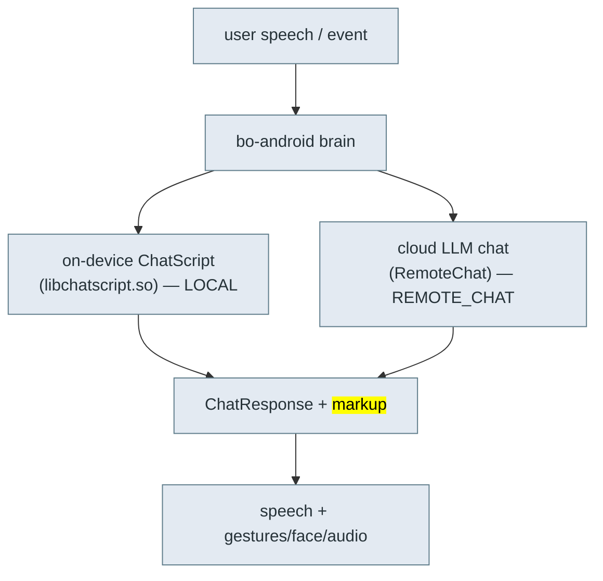

# 🗣️ Content & conversation — ChatScript, content modules, the volley API

> **What this is.** How Moxie decides what to *say and do* — the two-layer dialog engine, the
> content-module format a server delivers, and the `volley`/`session` hooks that let content run code
> and drive the robot. This is the payload side of client/server revival (goal #2): once the transport
> ([`cloud-protocol.md`](cloud-protocol.md)) is up, this is what you fill it with. Reconstructed from
> the `embodied.robotbrain` protos, `libbo-brain`/`libchatscript` symbols, and the working
> OpenMoxie content-module format (which implements the same `RemoteChat` contract).

## Two dialog engines



- **ChatScript (LOCAL):** the classic rule-based engine runs *on the robot* (`ChatscriptEngine`,
  `chatscript::api`), compiling topic/concept rules. Fast, offline, deterministic. Errors surface as
  `ChatScriptError`/`ChatScriptException`; readiness as `ChatScriptReady`.
- **Cloud chat (REMOTE_CHAT):** an LLM answers a `RemoteChatRequest` and returns a `ChatResponse`.
- **HYBRID:** a module can mix both (`ModuleDetail.ContentSource = LOCAL | REMOTE_CHAT | HYBRID`).

A **module** (`ModuleDetail`) is an activity/content pack: `ContentDetail` entries, a
`ModuleCategory` (CREATIVITY, REGULATION, MOVEMENT, READING, PLAYFUL_GAME, PUZZLE_GAME, FUN_TIDBIT,
LISTENING, MISSION, CONVERSATION, UTILITY), delivery `ContentRules` (ORDERED, RANDOM,
`*_EXHAUST[_SEEN]`, DAILY_MISSION, CALENDAR), and `min_api_version`. `LineStoreSerialState` tracks
which lines a child has seen (the `masks`) so `*_EXHAUST` rules don't repeat.

## Content-module format (what a server serves)

A module is JSON with three optional sections — `conversations`, `globals`, `schedules`:

### `conversations[]` — LLM-driven chats
```json
{ "name":"Basic Memory Chat", "module_id":"OPENMOXIE_CHAT", "content_id":"memory",
  "max_history":40, "max_volleys":40, "opener":"Let's have a chat.|Anything on your mind?<opener>",
  "prompt":"You are a robot named Moxie ... talking to {{volley.config.child_pii.nickname}}. FACTS:\n{{volley.persist_data.memory_chat.facts}}",
  "model":"gpt-4o", "max_tokens":100, "temperature":0.5,
  "code":"def post_process(volley, session): ..." }
```
- `prompt` is **Jinja2-templated** over `volley`/`session` (`{{…}}`, ``). Common vars:
  `volley.config.child_pii.nickname`, `volley.persist_data.*`, `session.overflow`.
- `opener` supports `|`-alternatives and inline tags (`<opener>`, `<exit>`, `<sleep>`, `<launch:XX>`).
- `code` defines Python hooks run around each turn: `pre_process`, `post_process`,
  `complete_handler`, `notify_handler` (and `handle_volley` for globals).

### `globals[]` — regex-triggered commands (always on)
```json
{ "name":"Timer Start", "pattern":"^(moxie|moxy) (start|set) a? timer for? (\\d+) (minute|hour|second)s?$",
  "entity_groups":"3,4", "action":4, "code":"def handle_volley(volley): ..." }
```
Regex over the utterance; capture groups become `volley.entities`. `action` selects how the match is
handled; the `code` builds the response and fires execution actions.

### `schedules[]` — what to offer when
```json
{ "name":"moxie_go_hub_timers",
  "schedule":{ "provided_schedule":[{"module_id":"ENROLLCONVO"},{"module_id":"DM"}],
    "generate":{"chat_count":2,"module_count":6,"chat_modules":[...]},
    "hub_config":{"hubs":[{"module_id":"MOXIE_GO","content_id":"default"}]},
    "alarm_module":{"module_id":"ALARM","content_id":"fire"} } }
```
Mirrors `embodied.robotbrain.ContentSchedule` (`ScheduleConfig.day_one_schedule`, `promoted_content`,
`MissionConfig`, `RewardsConfig`, `EndOfSessionConfig`).

## The `volley` / `session` API (server-side hooks)

Each turn hands your `code` a **`volley`** (this exchange) and **`session`** (the conversation):

| Call | Effect |
|---|---|
| `volley.set_output(text, markup)` | Set the spoken text and optional `<mark cmd:…>` markup (see [`behavior-markup.md`](behavior-markup.md)). |
| `volley.entities` | Regex capture groups (for globals). |
| `volley.persist_data` / `volley.local_data` | Cross-session / this-turn scratch storage. |
| `volley.request.get("input_vars", {})` | Inbound vars (maps to `RemoteChatRequest.input_vars`). |
| `volley.add_execution_action(name, args)` | Ask the robot to *do* something (bridge to native). |
| `volley.update_subscriptions([...])` | Subscribe to robot events for later turns. |
| `session.summarize(...)` | LLM-summarize the transcript (memory). |
| `session.total_volleys`, `session.is_empty()`, `session.overflow` | Turn accounting. |

### Execution actions (content → robot bridge)
Named actions the brain executes, e.g.:
- `eb_timer_request [id, expiration_ms]` — set/cancel a timer (fires a wake event on expiry).
- `eb_enable_qr [true]` — turn on the camera QR scanner for this activity.
- `eb_wake` — wake state.

They map to `RemoteChatRequest.execute_returns` / `ChatResponse` action fields, and are the same
`activity_ids`/`input_vars` plumbing the proto exposes.

### QR inside content (ties to the QR toolkit)
Content can request a scan and read the value, so activities ship their own "launch cards":
```python
volley.add_execution_action('eb_enable_qr', ['true'])
volley.update_subscriptions(['eb-qr-event'])
# next turn:
qr = volley.request["input_vars"].get("$eb_qr_value", "")
if qr.startswith("GO"): volley.set_output(f"You got it!{qr[2:]}", None)
```
These are ordinary content QRs (a text payload the vision QR pipeline decodes), distinct from the
setup/`bo-wifi` grammar in [`qr-commands.md`](qr-commands.md) — same camera, different consumer.

## Revival implications

- A server implements `RemoteChat` (over the MQTT `RC_TOPIC`) by loading these modules, rendering the
  Jinja prompt, calling an LLM, running the `code` hooks, and returning `ChatResponse` text + markup.
- ChatScript content packs can stay on-device for offline/global commands; new activities are pure
  server-side modules. OpenMoxie is a working reference for the module format; this repo's
  [`server/`](../../server/) is where our implementation lives.
- Because `code` runs arbitrary Python server-side and `add_execution_action` reaches native robot
  functions, the content layer is fully programmable without touching firmware.

---
📖 [Reverse-engineering index](README.md) · [Cloud protocol](cloud-protocol.md) · [Behavior markup](behavior-markup.md) · [Docs index](../README.md)
