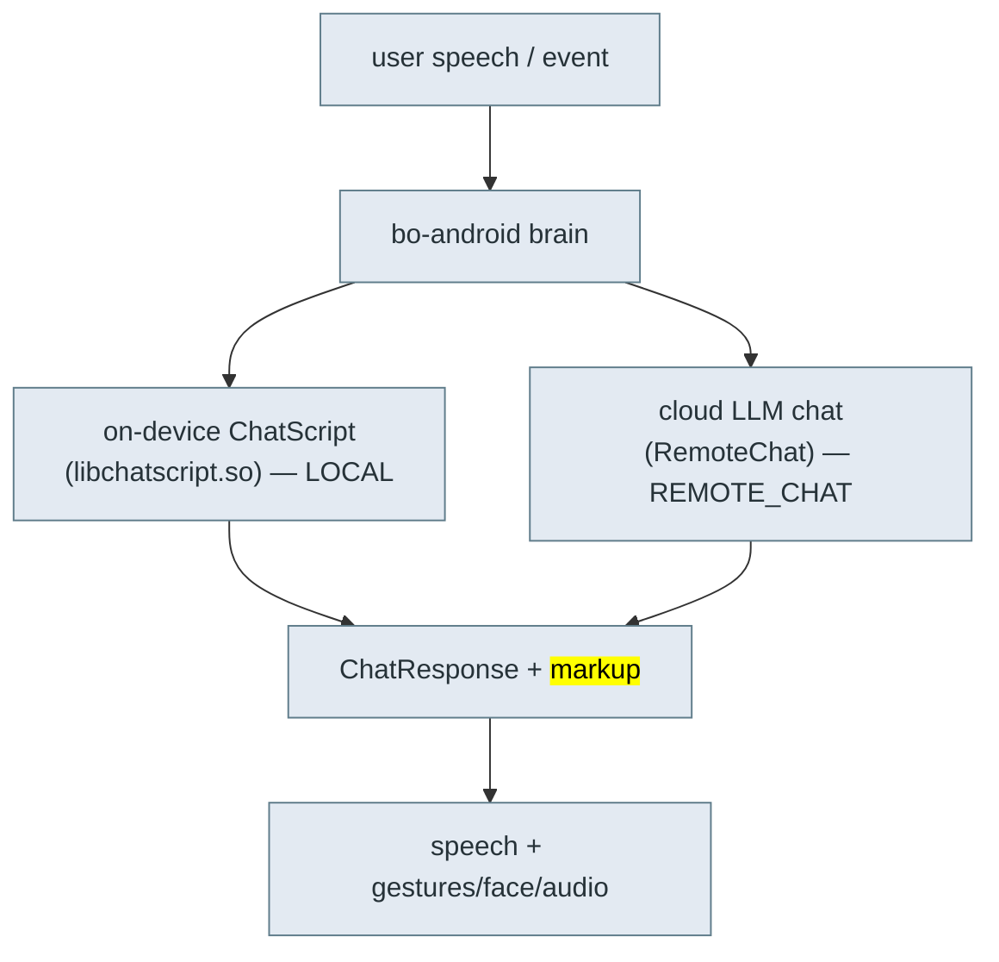

# 🗣️ Content & conversation — ChatScript, content modules, the volley API

> **What this is.** How Moxie decides what to *say and do* — the two-layer dialog engine, the
> content-module format a server delivers, and the `volley`/`session` hooks that let content run code
> and drive the robot. This is the payload side of client/server revival (goal #2): once the transport
> ([`cloud-protocol.md`](cloud-protocol.md)) is up, this is what you fill it with. Reconstructed from
> the `embodied.robotbrain` protos, `libbo-brain`/`libchatscript` symbols, and the working
> OpenMoxie content-module format (which implements the same `RemoteChat` contract).

## Two dialog engines



- **ChatScript (LOCAL):** the classic rule-based engine runs *on the robot* (`ChatscriptEngine`,
  `chatscript::api`), compiling topic/concept rules. Fast, offline, deterministic. Errors surface as
  `ChatScriptError`/`ChatScriptException`; readiness as `ChatScriptReady`.
- **Cloud chat (REMOTE_CHAT):** an LLM answers a `RemoteChatRequest` and returns a `ChatResponse`.
- **HYBRID:** a module can mix both (`ModuleDetail.ContentSource = LOCAL | REMOTE_CHAT | HYBRID`).

A **module** (`ModuleDetail`) is an activity/content pack: `ContentDetail` entries, a
`ModuleCategory` (CREATIVITY, REGULATION, MOVEMENT, READING, PLAYFUL_GAME, PUZZLE_GAME, FUN_TIDBIT,
LISTENING, MISSION, CONVERSATION, UTILITY), delivery `ContentRules` (ORDERED, RANDOM,
`*_EXHAUST[_SEEN]`, DAILY_MISSION, CALENDAR), and `min_api_version`. `LineStoreSerialState` tracks
which lines a child has seen (the `masks`) so `*_EXHAUST` rules don't repeat.

## Content-module format (what a server serves)

A module is JSON with three optional sections — `conversations`, `globals`, `schedules`:

### `conversations[]` — LLM-driven chats
```json
{ "name":"Basic Memory Chat", "module_id":"OPENMOXIE_CHAT", "content_id":"memory",
  "max_history":40, "max_volleys":40, "opener":"Let's have a chat.|Anything on your mind?<opener>",
  "prompt":"You are a robot named Moxie ... talking to {{volley.config.child_pii.nickname}}. FACTS:\n{{volley.persist_data.memory_chat.facts}}",
  "model":"gpt-4o", "max_tokens":100, "temperature":0.5,
  "code":"def post_process(volley, session): ..." }
```
- `prompt` is **Jinja2-templated** over `volley`/`session` (`{{…}}`, ``). Common vars:
  `volley.config.child_pii.nickname`, `volley.persist_data.*`, `session.overflow`.
- `opener` supports `|`-alternatives and inline tags (`<opener>`, `<exit>`, `<sleep>`, `<launch:XX>`).
- `code` defines Python hooks run around each turn: `pre_process`, `post_process`,
  `complete_handler`, `notify_handler` (and `handle_volley` for globals).

### `globals[]` — regex-triggered commands (always on)
```json
{ "name":"Timer Start", "pattern":"^(moxie|moxy) (start|set) a? timer for? (\\d+) (minute|hour|second)s?$",
  "entity_groups":"3,4", "action":4, "code":"def handle_volley(volley): ..." }
```
Regex over the utterance; capture groups become `volley.entities`. `action` selects how the match is
handled; the `code` builds the response and fires execution actions.

### `schedules[]` — what to offer when
```json
{ "name":"moxie_go_hub_timers",
  "schedule":{ "provided_schedule":[{"module_id":"ENROLLCONVO"},{"module_id":"DM"}],
    "generate":{"chat_count":2,"module_count":6,"chat_modules":[...]},
    "hub_config":{"hubs":[{"module_id":"MOXIE_GO","content_id":"default"}]},
    "alarm_module":{"module_id":"ALARM","content_id":"fire"} } }
```
Mirrors `embodied.robotbrain.ContentSchedule` (`ScheduleConfig.day_one_schedule`, `promoted_content`,
`MissionConfig`, `RewardsConfig`, `EndOfSessionConfig`).

## TTS & dialog engine internals (formats & data)

Both engines are **native libs baked into the firmware**, but their **data (voice model, dialog
content) is delivered as synced content — not in the image**. This is the key revival fact: you supply
your own voice/dialog; you can't extract (and don't need) Embodied's licensed assets.

### CereVoice TTS (`libcerevoice_eng.so`, ~44 MB)
- **CereProc CereVoice**, build **v5.0.2**, **DNN parametric synthesis** (`CPDNN` — deep-neural-net
  spurt generation, not classic unit-selection).
- Voice model format: a **`.voice` file** = "**CEREPROC TPDATABASE v 1.0**" (`CEREVOICE HEADER`), a
  licensed text-processing DB + DNN weights. The voice file is **not on the firmware image** — it's
  delivered as content; the engine performs a license check (`src/license/bigdigits.c`).
- **Revival:** irrelevant to reproduce exactly — the brain requests TTS via `CloudTTSRequest` and the
  **server returns rendered PCM** (`CloudTTSResponse.audio`, see [`perception-pipeline.md`](perception-pipeline.md)),
  so any TTS (or a CereProc voice you license) drops in. Local CereVoice is the on-device path/fallback.

### ChatScript (`libchatscript.so`, ~27 MB)
- **Bruce Wilcox's ChatScript** rule engine (prints `ChatScript Version %s compiled %s`). Symbol
  legend confirmed in the binary: `$` variables · `@` factsets · `_` match-vars · `^` macros ·
  `~` topics/concepts.
- Content authored as **`.top` topic files** (topics, `~concepts`, `table`/facts) and **compiled** to
  a runtime dictionary + topic store (`AddTopicCode`, `AllocateTopicMemory`, `$cs_topicretrylimit`).
  The compiled content is **not in the firmware** — it's synced content.
- Drives the **LOCAL** dialog path and the always-on **global commands** (regex `globals`, above);
  errors surface as `ChatScriptError`/`ChatScriptException`, readiness as `ChatScriptReady` on the bus.

### Where the data lives
Voice, ChatScript, and content modules are **synced to `/sdcard/EmbodiedData` / `/sdcard/EmbodiedStaticData`**
over the MQTT **file-sync** channel (`MQTT_FILE_SYNC`, see [`cloud-protocol.md`](cloud-protocol.md)) —
the same mechanism that delivers OTA images and content modules. A revival server hosts/serves these;
the base firmware ships only the engines.

## Scheduling, progression & rewards (what to offer next)

Above individual modules sits the pedagogy layer — how the robot/server decides **what content to
offer**, tracks a child's progress, and rewards them. All `embodied.robotbrain`:

### Content days & schedule (`ContentSchedule`, `DailySchedule`)
- **`DailySchedule{csv_day_name, featured_module, modules[]}`** — content is organized into **"content
  days"**; each day has a featured activity + a module list. A child advances through `content_day`s.
- **`ScheduleConfig`** — `day_one_schedule` (onboarding), `promoted_content`, a `prompt_template`/
  `prompt_lm`; **`MissionConfig{mission_id}`** (daily missions), **`RewardsConfig{module_id,
  min_content_day}`**, **`EndOfSessionConfig{chat_module, end_module, chat_count}`**.
- **`ContentModule{module_id, allowed, denied_ids}`** + **`TagList{allowed, denied}`** gate which
  modules/tags are permitted (parental controls).

### The recommender
Which module to surface is ranked by weighted signals (the `RECOMMENDATION_*` settings,
[`settings-schema.md`](settings-schema.md)): `RECOMMENDATION_MP_PARENT_WEIGHT`,
`..._SENTIMENT_WEIGHT`, `..._RANDOM_WEIGHT`, `RECOMMENDATION_TAGHISTORY_ALPHA`,
`RECOMMENDATION_RANDOM_SEED/MODIFIER/UPDATE_PROB`, `RECOMMENDATION_BY_SEL`. Recommendations arrive as
`RecommendationContext.Recommendation{module_id, content_id, entry_line, seen, skip_hub}`
(see [`cloud-protocol.md`](cloud-protocol.md)'s `RemoteChatRequest.recommend`).

### STAR goals (the SEL curriculum)
Moxie's socio-emotional-learning goals: **`STARGoalStateChange{goal, goal_level, prompt_level,
activated}`** with **`STARGoalSuccess`/`STARGoalFailure`**. Content targets a `goal` at a `goal_level`;
success advances levels (`RECOMMENDATION_BY_SEL` weights recommendations by SEL goal).

### Rewards & history
- **`StarBitsEarned{earned, total, latest_unlocked}`** — **StarBits**, the reward currency a child
  earns to unlock content (the `RewardStar`/`reward-star` animation + markup, [`unity-assets.md`](unity-assets.md)).
- **`MentorBehavior{module_id, content_id, content_day, action, ended_reason}`** + `MentorBehaviorSet`
  — the **history** of what the child did (completed/abandoned, when). The robot **requests it** on
  session start (`client-service-activity-log subtopic=query, query=mentor_behaviors`,
  [`cloud-protocol.md`](cloud-protocol.md)) and **reports** new behaviors back — the server persists it
  and feeds it to the recommender + parent reports.

**Revival (goal #2):** a minimal server can ship a fixed `DailySchedule`/hub and ignore the
recommender (OpenMoxie does — a static `provided_schedule` + a hub module, [`content-and-conversation`](#schedulesschedules--what-to-offer-when)).
Full parity means persisting MentorBehavior + StarBits + STAR-goal state per child and ranking modules.

## Telehealth / remote puppet mode

Besides ChatScript (LOCAL) and the LLM (REMOTE_CHAT), there's a **third response source: a live human
operator** puppeting Moxie in real time (the telehealth / remote-caregiver feature). The robot enters
**`STATE_TELEBRAIN`** ([`boot-and-launcher.md`](boot-and-launcher.md)) — perception + Unity face run,
but **the local brain is off**; every utterance/behavior comes from the operator.

Protocol (`embodied.telehealth`, over MQTT — the `client-service-activity-log` `subtopic=telehealth`
and `/commands/telehealth`, see [`cloud-protocol.md`](cloud-protocol.md)):

```proto
enum Action { START_SESSION=1; PLAY_OUTPUT=2; END_SESSION=3; UPDATE_STATE=4; INTERRUPT=5; }
enum RobotState { READY=1; IN_SESSION=2; EXITING=3; }
message Output  { string line_id=1; repeated string line_params=2; string text=3; string markup=4; }
message TelehealthMessage { Action action=2; Output output=3; RobotState state=4; string session_id=5; }
TelehealthRobotCommand { string command; TelehealthMessage message; }   // cloud → robot
TelehealthRobotEvent   { string subtopic; TelehealthMessage message; }   // robot → cloud (status)
```

Flow: `START_SESSION` → robot goes `IN_SESSION`; the operator sends **`PLAY_OUTPUT`** with `text` +
**`markup`** (the same `<mark cmd:…>` behavior markup, [`behavior-markup.md`](behavior-markup.md)) —
so the operator drives **speech *and* face/motion** live; **`INTERRUPT`** stops current output;
`END_SESSION` returns to normal. `TelehealthStatus{telehealth_active, session_active}` reports state.

**Revival use (goal #2):** trivial to implement — a server publishes `PLAY_OUTPUT{text, markup}` to let
a parent speak through Moxie (type or TTS a line + optional gestures). OpenMoxie's server exposes
exactly this (`send_telehealth` / `PLAY_OUTPUT` / `INTERRUPT`). It reuses the TTS + markup paths, so no
new robot-side work is needed.

## The `volley` / `session` API (server-side hooks)

Each turn hands your `code` a **`volley`** (this exchange) and **`session`** (the conversation):

| Call | Effect |
|---|---|
| `volley.set_output(text, markup)` | Set the spoken text and optional `<mark cmd:…>` markup (see [`behavior-markup.md`](behavior-markup.md)). |
| `volley.entities` | Regex capture groups (for globals). |
| `volley.persist_data` / `volley.local_data` | Cross-session / this-turn scratch storage. |
| `volley.request.get("input_vars", {})` | Inbound vars (maps to `RemoteChatRequest.input_vars`). |
| `volley.add_execution_action(name, args)` | Ask the robot to *do* something (bridge to native). |
| `volley.update_subscriptions([...])` | Subscribe to robot events for later turns. |
| `session.summarize(...)` | LLM-summarize the transcript (memory). |
| `session.total_volleys`, `session.is_empty()`, `session.overflow` | Turn accounting. |

### Execution actions (content → robot bridge)
Named actions the brain executes, e.g.:
- `eb_timer_request [id, expiration_ms]` — set/cancel a timer (fires a wake event on expiry).
- `eb_enable_qr [true]` — turn on the camera QR scanner for this activity.
- `eb_wake` — wake state.

They map to `RemoteChatRequest.execute_returns` / `ChatResponse` action fields, and are the same
`activity_ids`/`input_vars` plumbing the proto exposes.

### QR inside content (ties to the QR toolkit)
Content can request a scan and read the value, so activities ship their own "launch cards":
```python
volley.add_execution_action('eb_enable_qr', ['true'])
volley.update_subscriptions(['eb-qr-event'])
# next turn:
qr = volley.request["input_vars"].get("$eb_qr_value", "")
if qr.startswith("GO"): volley.set_output(f"You got it!{qr[2:]}", None)
```
These are ordinary content QRs (a text payload the vision QR pipeline decodes), distinct from the
setup/`bo-wifi` grammar in [`qr-commands.md`](qr-commands.md) — same camera, different consumer.

## Revival implications

- A server implements `RemoteChat` (over the MQTT `RC_TOPIC`) by loading these modules, rendering the
  Jinja prompt, calling an LLM, running the `code` hooks, and returning `ChatResponse` text + markup.
- ChatScript content packs can stay on-device for offline/global commands; new activities are pure
  server-side modules. OpenMoxie is a working reference for the module format; this repo's
  [`server/`](../../server/) is where our implementation lives.
- Because `code` runs arbitrary Python server-side and `add_execution_action` reaches native robot
  functions, the content layer is fully programmable without touching firmware.

---
📖 [Reverse-engineering index](README.md) · [Cloud protocol](cloud-protocol.md) · [Behavior markup](behavior-markup.md) · [Docs index](../README.md)
